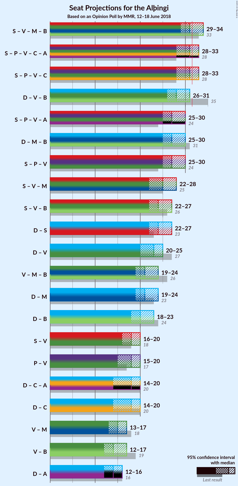

# Opinion Poll by MMR, 12–18 June 2018

<a href="#voting-intentions">Voting Intentions</a> | <a href="#seats">Seats</a> | <a href="#coalitions">Coalitions</a> | <a href="#technical-information">Technical Information</a>

## Voting Intentions

### Confidence Intervals

| Party | Last Result | Poll Result | 80% Confidence Interval | 90% Confidence Interval | 95% Confidence Interval | 99% Confidence Interval |
|:-----:|:-----------:|:-----------:|:-----------------------:|:-----------------------:|:-----------------------:|:-----------------------:|
| Sjálfstæðisflokkurinn | 25.2% | 21.6% | 20.0–23.4% |19.5–23.9% |19.1–24.4% |18.3–25.3% |
| Samfylkingin | 12.1% | 15.1% | 13.7–16.7% |13.3–17.2% |13.0–17.6% |12.3–18.4% |
| Píratar | 9.2% | 14.3% | 12.9–15.8% |12.5–16.3% |12.2–16.7% |11.5–17.5% |
| Vinstrihreyfingin – grænt framboð | 16.9% | 12.6% | 11.3–14.1% |11.0–14.6% |10.7–15.0% |10.1–15.7% |
| Miðflokkurinn | 10.9% | 10.6% | 9.4–12.0% |9.1–12.4% |8.8–12.7% |8.2–13.4% |
| Framsóknarflokkurinn | 10.7% | 9.5% | 8.4–10.9% |8.1–11.2% |7.8–11.6% |7.3–12.3% |
| Flokkur fólksins | 6.9% | 8.2% | 7.2–9.5% |6.9–9.8% |6.6–10.2% |6.1–10.8% |
| Viðreisn | 6.7% | 5.8% | 5.0–7.0% |4.7–7.3% |4.5–7.5% |4.1–8.1% |

*Note:* The poll result column reflects the actual value used in the calculations. Published results may vary slightly, and in addition be rounded to fewer digits.

## Seats

### Confidence Intervals

| Party | Last Result | Median | 80% Confidence Interval | 90% Confidence Interval | 95% Confidence Interval | 99% Confidence Interval |
|:-----:|:-----------:|:------:|:-----------------------:|:-----------------------:|:-----------------------:|:-----------------------:|
| <a href="#sjálfstæðisflokkurinn">Sjálfstæðisflokkurinn</a> | 16 | 14 | 13–15 |13–16 |12–16 |12–17 |
| <a href="#samfylkingin">Samfylkingin</a> | 7 | 10 | 9–11 |9–11 |8–12 |8–12 |
| <a href="#píratar">Píratar</a> | 6 | 9 | 8–11 |8–11 |8–11 |7–12 |
| <a href="#vinstrihreyfingin-–-grænt-framboð">Vinstrihreyfingin – grænt framboð</a> | 11 | 8 | 7–10 |7–10 |7–10 |6–10 |
| <a href="#miðflokkurinn">Miðflokkurinn</a> | 7 | 7 | 6–8 |6–9 |5–9 |5–9 |
| <a href="#framsóknarflokkurinn">Framsóknarflokkurinn</a> | 8 | 6 | 5–7 |5–7 |5–8 |4–8 |
| <a href="#flokkur-fólksins">Flokkur fólksins</a> | 4 | 5 | 4–6 |4–6 |4–6 |4–7 |
| <a href="#viðreisn">Viðreisn</a> | 4 | 3 | 3–4 |0–4 |0–5 |0–5 |

### Sjálfstæðisflokkurinn

*For a full overview of the results for this party, see the [Sjálfstæðisflokkurinn](party-sjálfstæðisflokkurinn.html) page.*

| Number of Seats | Probability | Accumulated | Special Marks |
|:---------------:|:-----------:|:-----------:|:-------------:|
| 11 | 0.1% | 100% |  |
| 12 | 5% | 99.9% |  |
| 13 | 17% | 95% |  |
| 14 | 36% | 79% | Median |
| 15 | 35% | 42% |  |
| 16 | 6% | 7% | Last Result |
| 17 | 1.0% | 1.3% |  |
| 18 | 0.3% | 0.3% |  |
| 19 | 0% | 0% |  |

### Samfylkingin

*For a full overview of the results for this party, see the [Samfylkingin](party-samfylkingin.html) page.*

| Number of Seats | Probability | Accumulated | Special Marks |
|:---------------:|:-----------:|:-----------:|:-------------:|
| 7 | 0.2% | 100% | Last Result |
| 8 | 3% | 99.8% |  |
| 9 | 29% | 97% |  |
| 10 | 47% | 68% | Median |
| 11 | 17% | 21% |  |
| 12 | 4% | 4% |  |
| 13 | 0.2% | 0.2% |  |
| 14 | 0% | 0% |  |

### Píratar

*For a full overview of the results for this party, see the [Píratar](party-píratar.html) page.*

| Number of Seats | Probability | Accumulated | Special Marks |
|:---------------:|:-----------:|:-----------:|:-------------:|
| 6 | 0% | 100% | Last Result |
| 7 | 1.1% | 100% |  |
| 8 | 18% | 98.9% |  |
| 9 | 47% | 81% | Median |
| 10 | 24% | 34% |  |
| 11 | 9% | 10% |  |
| 12 | 1.0% | 1.0% |  |
| 13 | 0% | 0% |  |

### Vinstrihreyfingin – grænt framboð

*For a full overview of the results for this party, see the [Vinstrihreyfingin – grænt framboð](party-vinstrihreyfingin–græntframboð.html) page.*

| Number of Seats | Probability | Accumulated | Special Marks |
|:---------------:|:-----------:|:-----------:|:-------------:|
| 6 | 2% | 100% |  |
| 7 | 17% | 98% |  |
| 8 | 48% | 82% | Median |
| 9 | 23% | 34% |  |
| 10 | 10% | 10% |  |
| 11 | 0.3% | 0.3% | Last Result |
| 12 | 0% | 0% |  |

### Miðflokkurinn

*For a full overview of the results for this party, see the [Miðflokkurinn](party-miðflokkurinn.html) page.*

| Number of Seats | Probability | Accumulated | Special Marks |
|:---------------:|:-----------:|:-----------:|:-------------:|
| 5 | 5% | 100% |  |
| 6 | 28% | 95% |  |
| 7 | 27% | 67% | Last Result, Median |
| 8 | 35% | 40% |  |
| 9 | 5% | 5% |  |
| 10 | 0.4% | 0.4% |  |
| 11 | 0% | 0% |  |

### Framsóknarflokkurinn

*For a full overview of the results for this party, see the [Framsóknarflokkurinn](party-framsóknarflokkurinn.html) page.*

| Number of Seats | Probability | Accumulated | Special Marks |
|:---------------:|:-----------:|:-----------:|:-------------:|
| 4 | 1.1% | 100% |  |
| 5 | 31% | 98.9% |  |
| 6 | 48% | 68% | Median |
| 7 | 17% | 20% |  |
| 8 | 3% | 3% | Last Result |
| 9 | 0.2% | 0.2% |  |
| 10 | 0% | 0% |  |

### Flokkur fólksins

*For a full overview of the results for this party, see the [Flokkur fólksins](party-flokkurfólksins.html) page.*

| Number of Seats | Probability | Accumulated | Special Marks |
|:---------------:|:-----------:|:-----------:|:-------------:|
| 3 | 0.4% | 100% |  |
| 4 | 16% | 99.6% | Last Result |
| 5 | 58% | 84% | Median |
| 6 | 24% | 26% |  |
| 7 | 2% | 2% |  |
| 8 | 0% | 0% |  |

### Viðreisn

*For a full overview of the results for this party, see the [Viðreisn](party-viðreisn.html) page.*

| Number of Seats | Probability | Accumulated | Special Marks |
|:---------------:|:-----------:|:-----------:|:-------------:|
| 0 | 8% | 100% |  |
| 1 | 0.3% | 92% |  |
| 2 | 0% | 92% |  |
| 3 | 48% | 92% | Median |
| 4 | 40% | 44% | Last Result |
| 5 | 4% | 4% |  |
| 6 | 0.1% | 0.1% |  |
| 7 | 0% | 0% |  |

## Coalitions

### Confidence Intervals

| Coalition | Last Result | Median | Majority? | 80% Confidence Interval | 90% Confidence Interval | 95% Confidence Interval | 99% Confidence Interval |
|:---------:|:-----------:|:------:|:---------:|:-----------------------:|:-----------------------:|:-----------------------:|:-----------------------:|
| Samfylkingin – Vinstrihreyfingin – grænt framboð – Miðflokkurinn – Framsóknarflokkurinn | 33 | 31 | 38% | 30–32 | 29–33 | 29–34 | 28–35 |
| Samfylkingin – Píratar – Vinstrihreyfingin – grænt framboð – Viðreisn | 28 | 31 | 27% | 29–33 | 28–33 | 28–33 | 27–34 |
| Sjálfstæðisflokkurinn – Vinstrihreyfingin – grænt framboð – Framsóknarflokkurinn | 35 | 28 | 2% | 27–30 | 26–31 | 26–31 | 25–32 |
| Samfylkingin – Píratar – Vinstrihreyfingin – grænt framboð | 24 | 27 | 0.1% | 26–29 | 25–30 | 25–31 | 24–31 |
| Sjálfstæðisflokkurinn – Miðflokkurinn – Framsóknarflokkurinn | 31 | 27 | 0.2% | 25–29 | 25–30 | 25–30 | 24–31 |
| Samfylkingin – Vinstrihreyfingin – grænt framboð – Miðflokkurinn | 25 | 26 | 0% | 24–27 | 23–27 | 23–28 | 22–29 |
| Samfylkingin – Vinstrihreyfingin – grænt framboð – Framsóknarflokkurinn | 26 | 24 | 0% | 23–26 | 22–27 | 22–27 | 21–28 |
| Sjálfstæðisflokkurinn – Samfylkingin | 23 | 24 | 0% | 22–25 | 22–26 | 22–26 | 21–28 |
| Sjálfstæðisflokkurinn – Vinstrihreyfingin – grænt framboð | 27 | 23 | 0% | 21–24 | 21–24 | 20–25 | 19–26 |
| Vinstrihreyfingin – grænt framboð – Miðflokkurinn – Framsóknarflokkurinn | 26 | 21 | 0% | 20–23 | 19–23 | 19–24 | 18–25 |
| Sjálfstæðisflokkurinn – Miðflokkurinn | 23 | 21 | 0% | 19–23 | 19–23 | 19–24 | 19–24 |
| Sjálfstæðisflokkurinn – Framsóknarflokkurinn | 24 | 20 | 0% | 19–22 | 18–22 | 18–23 | 17–24 |
| Samfylkingin – Vinstrihreyfingin – grænt framboð | 18 | 18 | 0% | 17–20 | 16–21 | 16–21 | 15–22 |
| Píratar – Vinstrihreyfingin – grænt framboð | 17 | 17 | 0% | 16–19 | 16–19 | 15–20 | 15–21 |
| Sjálfstæðisflokkurinn – Viðreisn | 20 | 18 | 0% | 16–19 | 15–20 | 14–20 | 13–20 |
| Vinstrihreyfingin – grænt framboð – Miðflokkurinn | 18 | 15 | 0% | 14–17 | 13–17 | 13–17 | 12–18 |
| Vinstrihreyfingin – grænt framboð – Framsóknarflokkurinn | 19 | 14 | 0% | 13–16 | 12–16 | 12–16 | 12–17 |

### Samfylkingin – Vinstrihreyfingin – grænt framboð – Miðflokkurinn – Framsóknarflokkurinn

| Number of Seats | Probability | Accumulated | Special Marks |
|:---------------:|:-----------:|:-----------:|:-------------:|
| 27 | 0.3% | 100% |  |
| 28 | 1.0% | 99.7% |  |
| 29 | 7% | 98.7% |  |
| 30 | 22% | 92% |  |
| 31 | 32% | 71% | Median |
| 32 | 28% | 38% | Majority |
| 33 | 7% | 10% | Last Result |
| 34 | 2% | 3% |  |
| 35 | 1.1% | 1.4% |  |
| 36 | 0.3% | 0.3% |  |
| 37 | 0% | 0% |  |

### Samfylkingin – Píratar – Vinstrihreyfingin – grænt framboð – Viðreisn

| Number of Seats | Probability | Accumulated | Special Marks |
|:---------------:|:-----------:|:-----------:|:-------------:|
| 26 | 0.4% | 100% |  |
| 27 | 0.7% | 99.6% |  |
| 28 | 5% | 98.9% | Last Result |
| 29 | 16% | 94% |  |
| 30 | 26% | 78% | Median |
| 31 | 25% | 53% |  |
| 32 | 16% | 27% | Majority |
| 33 | 11% | 12% |  |
| 34 | 0.7% | 1.0% |  |
| 35 | 0.3% | 0.3% |  |
| 36 | 0% | 0% |  |

### Sjálfstæðisflokkurinn – Vinstrihreyfingin – grænt framboð – Framsóknarflokkurinn

| Number of Seats | Probability | Accumulated | Special Marks |
|:---------------:|:-----------:|:-----------:|:-------------:|
| 24 | 0.1% | 100% |  |
| 25 | 1.0% | 99.9% |  |
| 26 | 4% | 99.0% |  |
| 27 | 17% | 95% |  |
| 28 | 36% | 78% | Median |
| 29 | 22% | 42% |  |
| 30 | 15% | 20% |  |
| 31 | 4% | 5% |  |
| 32 | 1.4% | 2% | Majority |
| 33 | 0.2% | 0.2% |  |
| 34 | 0% | 0% |  |
| 35 | 0% | 0% | Last Result |

### Samfylkingin – Píratar – Vinstrihreyfingin – grænt framboð

| Number of Seats | Probability | Accumulated | Special Marks |
|:---------------:|:-----------:|:-----------:|:-------------:|
| 24 | 1.3% | 100% | Last Result |
| 25 | 5% | 98.6% |  |
| 26 | 20% | 93% |  |
| 27 | 27% | 74% | Median |
| 28 | 28% | 46% |  |
| 29 | 11% | 18% |  |
| 30 | 4% | 7% |  |
| 31 | 3% | 3% |  |
| 32 | 0.1% | 0.1% | Majority |
| 33 | 0% | 0% |  |

### Sjálfstæðisflokkurinn – Miðflokkurinn – Framsóknarflokkurinn

| Number of Seats | Probability | Accumulated | Special Marks |
|:---------------:|:-----------:|:-----------:|:-------------:|
| 23 | 0.1% | 100% |  |
| 24 | 2% | 99.9% |  |
| 25 | 10% | 98% |  |
| 26 | 15% | 88% |  |
| 27 | 25% | 73% | Median |
| 28 | 36% | 48% |  |
| 29 | 6% | 11% |  |
| 30 | 5% | 5% |  |
| 31 | 0.3% | 0.5% | Last Result |
| 32 | 0.2% | 0.2% | Majority |
| 33 | 0% | 0% |  |

### Samfylkingin – Vinstrihreyfingin – grænt framboð – Miðflokkurinn

| Number of Seats | Probability | Accumulated | Special Marks |
|:---------------:|:-----------:|:-----------:|:-------------:|
| 20 | 0.1% | 100% |  |
| 21 | 0.2% | 99.9% |  |
| 22 | 2% | 99.8% |  |
| 23 | 7% | 98% |  |
| 24 | 25% | 91% |  |
| 25 | 15% | 66% | Last Result, Median |
| 26 | 37% | 51% |  |
| 27 | 11% | 14% |  |
| 28 | 1.1% | 3% |  |
| 29 | 2% | 2% |  |
| 30 | 0% | 0% |  |

### Samfylkingin – Vinstrihreyfingin – grænt framboð – Framsóknarflokkurinn

| Number of Seats | Probability | Accumulated | Special Marks |
|:---------------:|:-----------:|:-----------:|:-------------:|
| 20 | 0.1% | 100% |  |
| 21 | 2% | 99.9% |  |
| 22 | 4% | 98% |  |
| 23 | 34% | 94% |  |
| 24 | 27% | 60% | Median |
| 25 | 20% | 33% |  |
| 26 | 8% | 13% | Last Result |
| 27 | 5% | 6% |  |
| 28 | 0.3% | 0.5% |  |
| 29 | 0.3% | 0.3% |  |
| 30 | 0% | 0% |  |

### Sjálfstæðisflokkurinn – Samfylkingin

| Number of Seats | Probability | Accumulated | Special Marks |
|:---------------:|:-----------:|:-----------:|:-------------:|
| 21 | 1.3% | 100% |  |
| 22 | 10% | 98.7% |  |
| 23 | 21% | 89% | Last Result |
| 24 | 21% | 68% | Median |
| 25 | 37% | 47% |  |
| 26 | 8% | 10% |  |
| 27 | 1.3% | 2% |  |
| 28 | 0.7% | 0.9% |  |
| 29 | 0.2% | 0.2% |  |
| 30 | 0% | 0% |  |

### Sjálfstæðisflokkurinn – Vinstrihreyfingin – grænt framboð

| Number of Seats | Probability | Accumulated | Special Marks |
|:---------------:|:-----------:|:-----------:|:-------------:|
| 19 | 0.6% | 100% |  |
| 20 | 4% | 99.4% |  |
| 21 | 20% | 96% |  |
| 22 | 19% | 76% | Median |
| 23 | 41% | 57% |  |
| 24 | 11% | 16% |  |
| 25 | 4% | 5% |  |
| 26 | 0.5% | 0.6% |  |
| 27 | 0.1% | 0.1% | Last Result |
| 28 | 0% | 0% |  |

### Vinstrihreyfingin – grænt framboð – Miðflokkurinn – Framsóknarflokkurinn

| Number of Seats | Probability | Accumulated | Special Marks |
|:---------------:|:-----------:|:-----------:|:-------------:|
| 18 | 0.8% | 100% |  |
| 19 | 8% | 99.1% |  |
| 20 | 13% | 91% |  |
| 21 | 42% | 78% | Median |
| 22 | 19% | 36% |  |
| 23 | 14% | 17% |  |
| 24 | 2% | 3% |  |
| 25 | 0.6% | 0.6% |  |
| 26 | 0% | 0% | Last Result |

### Sjálfstæðisflokkurinn – Miðflokkurinn

| Number of Seats | Probability | Accumulated | Special Marks |
|:---------------:|:-----------:|:-----------:|:-------------:|
| 18 | 0.4% | 100% |  |
| 19 | 13% | 99.5% |  |
| 20 | 16% | 86% |  |
| 21 | 21% | 71% | Median |
| 22 | 27% | 49% |  |
| 23 | 19% | 23% | Last Result |
| 24 | 4% | 4% |  |
| 25 | 0.4% | 0.5% |  |
| 26 | 0% | 0.1% |  |
| 27 | 0% | 0% |  |

### Sjálfstæðisflokkurinn – Framsóknarflokkurinn

| Number of Seats | Probability | Accumulated | Special Marks |
|:---------------:|:-----------:|:-----------:|:-------------:|
| 17 | 0.6% | 100% |  |
| 18 | 6% | 99.4% |  |
| 19 | 19% | 94% |  |
| 20 | 43% | 75% | Median |
| 21 | 20% | 31% |  |
| 22 | 8% | 12% |  |
| 23 | 4% | 4% |  |
| 24 | 0.4% | 0.5% | Last Result |
| 25 | 0.1% | 0.1% |  |
| 26 | 0% | 0% |  |

### Samfylkingin – Vinstrihreyfingin – grænt framboð

| Number of Seats | Probability | Accumulated | Special Marks |
|:---------------:|:-----------:|:-----------:|:-------------:|
| 14 | 0.1% | 100% |  |
| 15 | 1.2% | 99.9% |  |
| 16 | 5% | 98.7% |  |
| 17 | 22% | 94% |  |
| 18 | 39% | 72% | Last Result, Median |
| 19 | 21% | 33% |  |
| 20 | 6% | 11% |  |
| 21 | 5% | 5% |  |
| 22 | 0.5% | 0.5% |  |
| 23 | 0% | 0% |  |

### Píratar – Vinstrihreyfingin – grænt framboð

| Number of Seats | Probability | Accumulated | Special Marks |
|:---------------:|:-----------:|:-----------:|:-------------:|
| 14 | 0.3% | 100% |  |
| 15 | 4% | 99.7% |  |
| 16 | 10% | 96% |  |
| 17 | 44% | 86% | Last Result, Median |
| 18 | 21% | 42% |  |
| 19 | 17% | 21% |  |
| 20 | 3% | 4% |  |
| 21 | 1.1% | 1.1% |  |
| 22 | 0% | 0% |  |

### Sjálfstæðisflokkurinn – Viðreisn

| Number of Seats | Probability | Accumulated | Special Marks |
|:---------------:|:-----------:|:-----------:|:-------------:|
| 13 | 1.4% | 100% |  |
| 14 | 2% | 98.6% |  |
| 15 | 3% | 97% |  |
| 16 | 7% | 93% |  |
| 17 | 33% | 86% | Median |
| 18 | 39% | 54% |  |
| 19 | 10% | 15% |  |
| 20 | 5% | 5% | Last Result |
| 21 | 0.2% | 0.3% |  |
| 22 | 0% | 0% |  |

### Vinstrihreyfingin – grænt framboð – Miðflokkurinn

| Number of Seats | Probability | Accumulated | Special Marks |
|:---------------:|:-----------:|:-----------:|:-------------:|
| 12 | 0.5% | 100% |  |
| 13 | 7% | 99.5% |  |
| 14 | 22% | 93% |  |
| 15 | 21% | 70% | Median |
| 16 | 30% | 49% |  |
| 17 | 18% | 19% |  |
| 18 | 1.2% | 1.5% | Last Result |
| 19 | 0.3% | 0.3% |  |
| 20 | 0% | 0% |  |

### Vinstrihreyfingin – grænt framboð – Framsóknarflokkurinn

| Number of Seats | Probability | Accumulated | Special Marks |
|:---------------:|:-----------:|:-----------:|:-------------:|
| 11 | 0.4% | 100% |  |
| 12 | 5% | 99.6% |  |
| 13 | 26% | 94% |  |
| 14 | 31% | 69% | Median |
| 15 | 25% | 38% |  |
| 16 | 11% | 13% |  |
| 17 | 1.4% | 2% |  |
| 18 | 0.4% | 0.4% |  |
| 19 | 0% | 0% | Last Result |

## Technical Information

### Opinion Poll

+ **Polling firm:** MMR
+ **Commissioner(s):** —
+ **Fieldwork period:** 12–18 June 2018

### Calculations

+ **Sample size:** 925
+ **Simulations done:** 131,072
+ **Error estimate:** 1.54%

