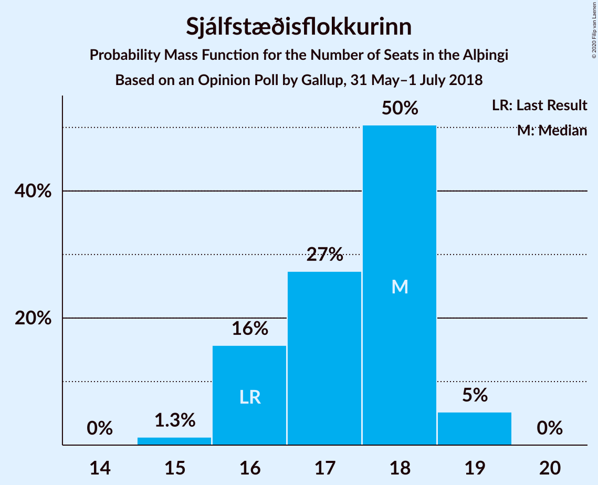
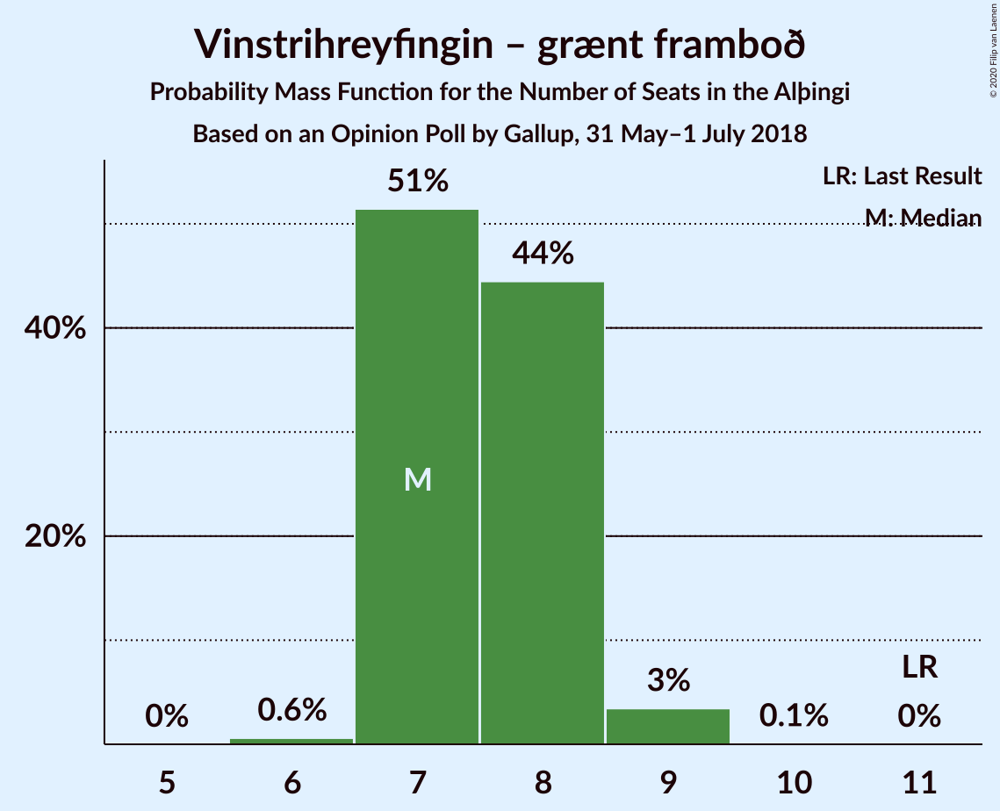
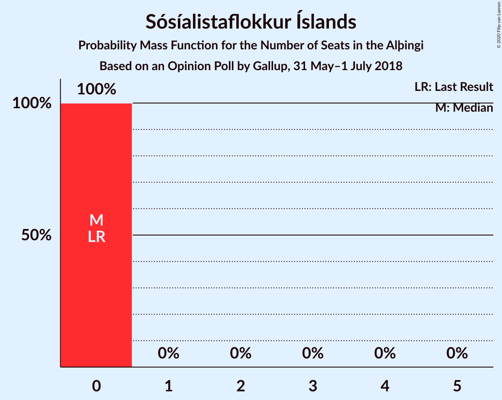
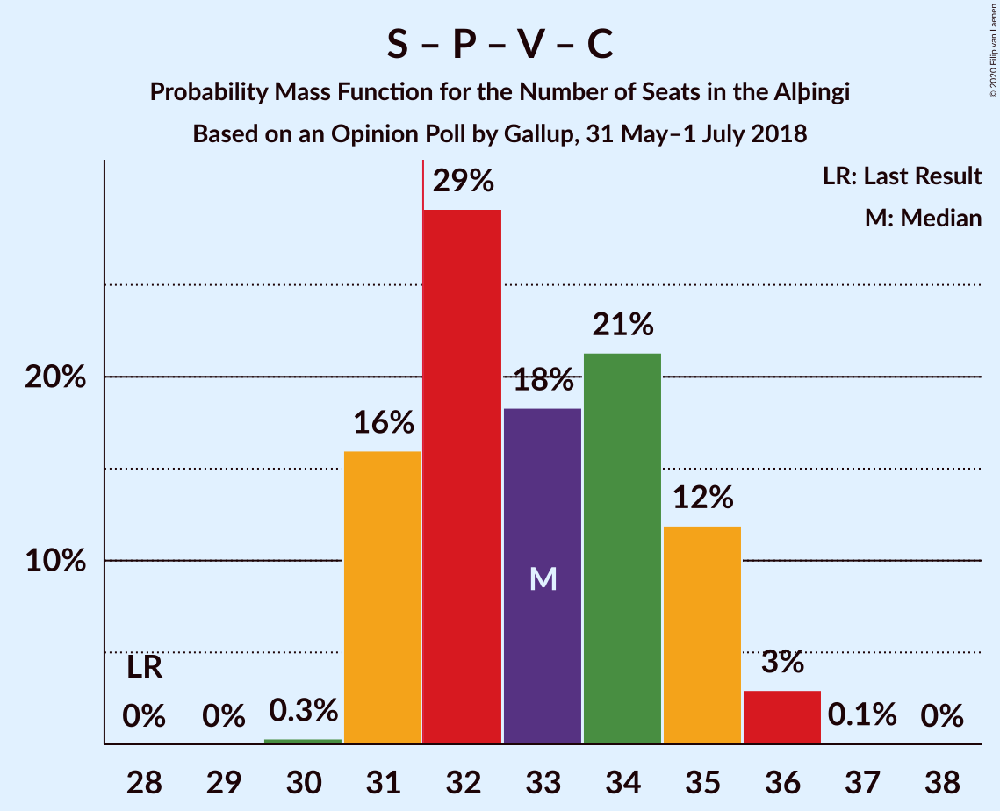
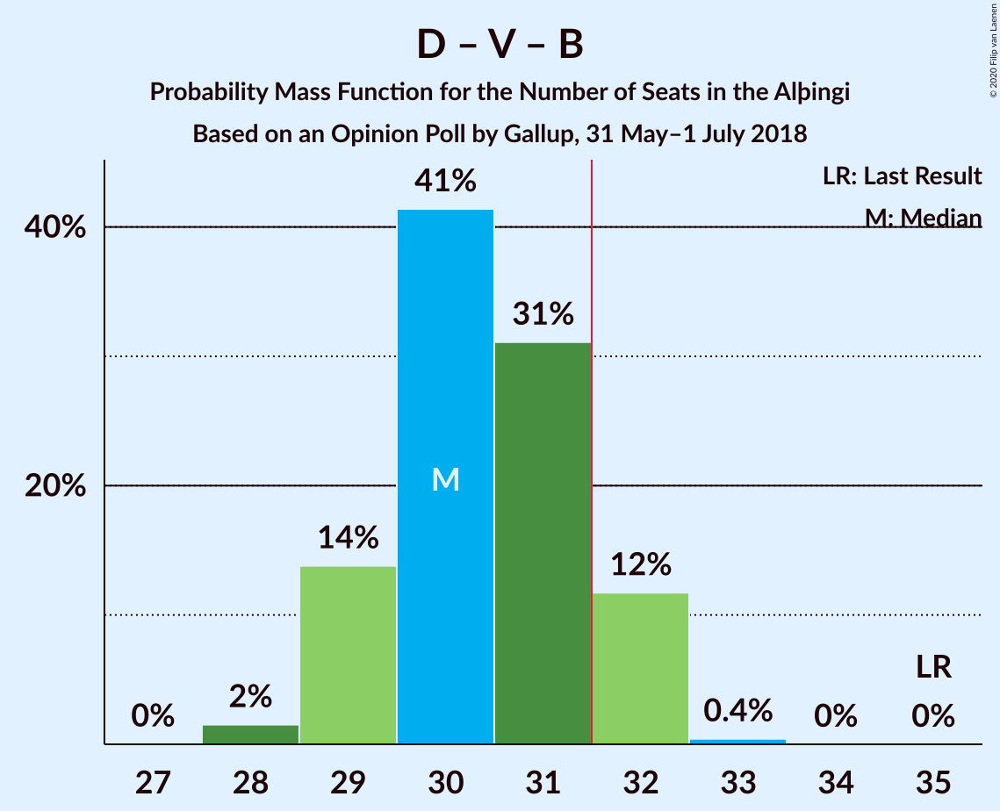
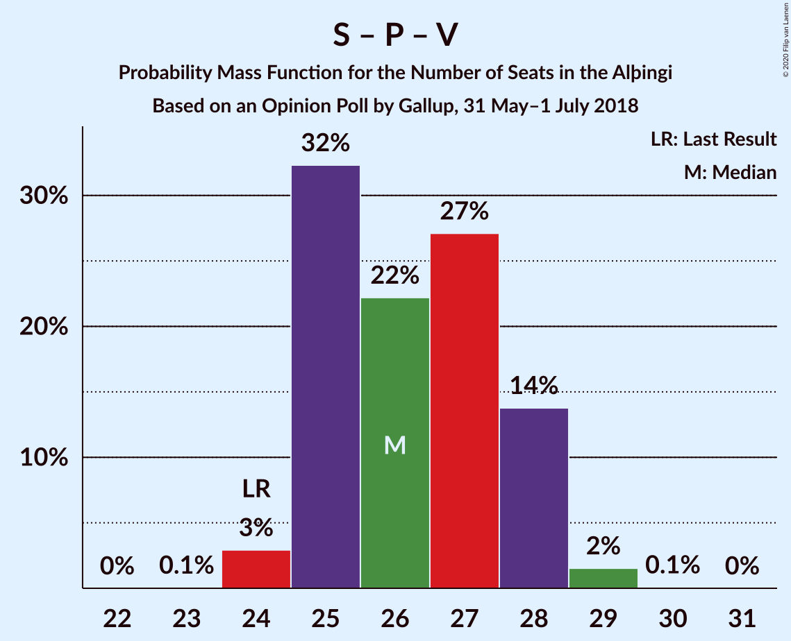

# Opinion Poll by Gallup, 31 May–1 July 2018

<a href="#voting-intentions">Voting Intentions</a> | <a href="#seats">Seats</a> | <a href="#coalitions">Coalitions</a> | <a href="#technical-information">Technical Information</a>

## Voting Intentions

### Confidence Intervals

| Party | Last Result | Poll Result | 80% Confidence Interval | 90% Confidence Interval | 95% Confidence Interval | 99% Confidence Interval |
|:-----:|:-----------:|:-----------:|:-----------------------:|:-----------------------:|:-----------------------:|:-----------------------:|
| Sjálfstæðisflokkurinn | 25.2% | 24.5% | 23.6–25.5% |23.3–25.8% |23.1–26.0% |22.6–26.5% |
| Samfylkingin | 12.1% | 15.2% | 14.4–16.0% |14.2–16.3% |14.0–16.5% |13.6–16.9% |
| Píratar | 9.2% | 13.1% | 12.4–13.9% |12.2–14.1% |12.0–14.3% |11.6–14.7% |
| Vinstrihreyfingin – grænt framboð | 16.9% | 11.5% | 10.8–12.3% |10.6–12.5% |10.5–12.7% |10.1–13.0% |
| Viðreisn | 6.7% | 10.4% | 9.7–11.1% |9.5–11.3% |9.4–11.5% |9.1–11.8% |
| Framsóknarflokkurinn | 10.7% | 8.5% | 7.9–9.2% |7.7–9.4% |7.6–9.5% |7.3–9.8% |
| Miðflokkurinn | 10.9% | 8.0% | 7.4–8.6% |7.2–8.8% |7.1–9.0% |6.8–9.3% |
| Flokkur fólksins | 6.9% | 5.1% | 4.6–5.6% |4.5–5.8% |4.4–5.9% |4.2–6.2% |
| Sósíalistaflokkur Íslands | 0.0% | 1.0% | 0.8–1.2% |0.7–1.3% |0.7–1.4% |0.6–1.5% |

*Note:* The poll result column reflects the actual value used in the calculations. Published results may vary slightly, and in addition be rounded to fewer digits.

## Seats

### Confidence Intervals

| Party | Last Result | Median | 80% Confidence Interval | 90% Confidence Interval | 95% Confidence Interval | 99% Confidence Interval |
|:-----:|:-----------:|:------:|:-----------------------:|:-----------------------:|:-----------------------:|:-----------------------:|
| <a href="#sjálfstæðisflokkurinn">Sjálfstæðisflokkurinn</a> | 16 | 19 | 15–19 |15–19 |15–19 |15–19 |
| <a href="#samfylkingin">Samfylkingin</a> | 7 | 9 | 9–11 |9–11 |9–11 |9–11 |
| <a href="#píratar">Píratar</a> | 6 | 9 | 9 |8–9 |8–9 |8–9 |
| <a href="#vinstrihreyfingin-–-grænt-framboð">Vinstrihreyfingin – grænt framboð</a> | 11 | 7 | 7–8 |7–8 |7–8 |7–9 |
| <a href="#viðreisn">Viðreisn</a> | 4 | 7 | 7 |7 |7 |6–7 |
| <a href="#framsóknarflokkurinn">Framsóknarflokkurinn</a> | 8 | 5 | 5–6 |5–6 |5–6 |5–6 |
| <a href="#miðflokkurinn">Miðflokkurinn</a> | 7 | 4 | 4 |4 |4–5 |4–5 |
| <a href="#flokkur-fólksins">Flokkur fólksins</a> | 4 | 3 | 3 |3–4 |3–4 |0–4 |
| <a href="#sósíalistaflokkur-íslands">Sósíalistaflokkur Íslands</a> | 0 | 0 | 0 |0 |0 |0 |

### Sjálfstæðisflokkurinn

*For a full overview of the results for this party, see the [Sjálfstæðisflokkurinn](party-sjálfstæðisflokkurinn.html) page.*

| Number of Seats | Probability | Accumulated | Special Marks |
|:---------------:|:-----------:|:-----------:|:-------------:|
| 15 | 29% | 100% |  |
| 16 | 7% | 71% | Last Result |
| 17 | 0.7% | 64% |  |
| 18 | 1.1% | 63% |  |
| 19 | 62% | 62% | Median |
| 20 | 0% | 0% |  |

### Samfylkingin

*For a full overview of the results for this party, see the [Samfylkingin](party-samfylkingin.html) page.*

| Number of Seats | Probability | Accumulated | Special Marks |
|:---------------:|:-----------:|:-----------:|:-------------:|
| 7 | 0% | 100% | Last Result |
| 8 | 0% | 100% |  |
| 9 | 63% | 100% | Median |
| 10 | 8% | 37% |  |
| 11 | 29% | 29% |  |
| 12 | 0% | 0% |  |

### Píratar

*For a full overview of the results for this party, see the [Píratar](party-píratar.html) page.*

| Number of Seats | Probability | Accumulated | Special Marks |
|:---------------:|:-----------:|:-----------:|:-------------:|
| 6 | 0% | 100% | Last Result |
| 7 | 0% | 100% |  |
| 8 | 7% | 100% |  |
| 9 | 92% | 93% | Median |
| 10 | 0.2% | 0.2% |  |
| 11 | 0% | 0% |  |

### Vinstrihreyfingin – grænt framboð

*For a full overview of the results for this party, see the [Vinstrihreyfingin – grænt framboð](party-vinstrihreyfingin–græntframboð.html) page.*

| Number of Seats | Probability | Accumulated | Special Marks |
|:---------------:|:-----------:|:-----------:|:-------------:|
| 6 | 0.1% | 100% |  |
| 7 | 62% | 99.9% | Median |
| 8 | 36% | 38% |  |
| 9 | 2% | 2% |  |
| 10 | 0% | 0% |  |
| 11 | 0% | 0% | Last Result |

### Viðreisn

*For a full overview of the results for this party, see the [Viðreisn](party-viðreisn.html) page.*

| Number of Seats | Probability | Accumulated | Special Marks |
|:---------------:|:-----------:|:-----------:|:-------------:|
| 4 | 0% | 100% | Last Result |
| 5 | 0.2% | 100% |  |
| 6 | 1.3% | 99.8% |  |
| 7 | 98% | 98.5% | Median |
| 8 | 0.2% | 0.2% |  |
| 9 | 0% | 0% |  |

### Framsóknarflokkurinn

*For a full overview of the results for this party, see the [Framsóknarflokkurinn](party-framsóknarflokkurinn.html) page.*

| Number of Seats | Probability | Accumulated | Special Marks |
|:---------------:|:-----------:|:-----------:|:-------------:|
| 5 | 63% | 100% | Median |
| 6 | 37% | 37% |  |
| 7 | 0.2% | 0.2% |  |
| 8 | 0% | 0% | Last Result |

### Miðflokkurinn

*For a full overview of the results for this party, see the [Miðflokkurinn](party-miðflokkurinn.html) page.*

| Number of Seats | Probability | Accumulated | Special Marks |
|:---------------:|:-----------:|:-----------:|:-------------:|
| 4 | 97% | 100% | Median |
| 5 | 3% | 3% |  |
| 6 | 0.2% | 0.2% |  |
| 7 | 0% | 0% | Last Result |

### Flokkur fólksins

*For a full overview of the results for this party, see the [Flokkur fólksins](party-flokkurfólksins.html) page.*

| Number of Seats | Probability | Accumulated | Special Marks |
|:---------------:|:-----------:|:-----------:|:-------------:|
| 0 | 2% | 100% |  |
| 1 | 0% | 98% |  |
| 2 | 0% | 98% |  |
| 3 | 91% | 98% | Median |
| 4 | 7% | 7% | Last Result |
| 5 | 0% | 0% |  |

### Sósíalistaflokkur Íslands

*For a full overview of the results for this party, see the [Sósíalistaflokkur Íslands](party-sósíalistaflokkuríslands.html) page.*

| Number of Seats | Probability | Accumulated | Special Marks |
|:---------------:|:-----------:|:-----------:|:-------------:|
| 0 | 100% | 100% | Last Result, Median |

## Coalitions

### Confidence Intervals

| Coalition | Last Result | Median | Majority? | 80% Confidence Interval | 90% Confidence Interval | 95% Confidence Interval | 99% Confidence Interval |
|:---------:|:-----------:|:------:|:---------:|:-----------------------:|:-----------------------:|:-----------------------:|:-----------------------:|
| Samfylkingin – Píratar – Vinstrihreyfingin – grænt framboð – Viðreisn | 28 | 32 | 100% | 32–35 | 32–35 | 32–35 | 32–35 |
| Sjálfstæðisflokkurinn – Vinstrihreyfingin – grænt framboð – Framsóknarflokkurinn | 35 | 31 | 0.9% | 29–31 | 29–31 | 29–31 | 29–33 |
| Samfylkingin – Vinstrihreyfingin – grænt framboð – Framsóknarflokkurinn – Miðflokkurinn | 33 | 25 | 0% | 25–29 | 25–29 | 25–29 | 25–30 |
| Sjálfstæðisflokkurinn – Samfylkingin | 23 | 28 | 0% | 26–28 | 26–28 | 26–28 | 24–28 |
| Sjálfstæðisflokkurinn – Framsóknarflokkurinn – Miðflokkurinn | 31 | 28 | 0% | 25–28 | 25–28 | 25–28 | 25–29 |
| Samfylkingin – Píratar – Vinstrihreyfingin – grænt framboð | 24 | 25 | 0% | 25–28 | 25–28 | 25–28 | 25–28 |
| Sjálfstæðisflokkurinn – Vinstrihreyfingin – grænt framboð | 27 | 26 | 0% | 23–26 | 23–26 | 23–26 | 23–27 |
| Sjálfstæðisflokkurinn – Viðreisn | 20 | 26 | 0% | 22–26 | 22–26 | 22–26 | 22–26 |
| Samfylkingin – Vinstrihreyfingin – grænt framboð – Framsóknarflokkurinn | 26 | 21 | 0% | 21–25 | 21–25 | 21–25 | 21–25 |
| Sjálfstæðisflokkurinn – Framsóknarflokkurinn | 24 | 24 | 0% | 21–24 | 21–24 | 21–24 | 21–24 |
| Samfylkingin – Vinstrihreyfingin – grænt framboð – Miðflokkurinn | 25 | 20 | 0% | 20–23 | 20–23 | 20–23 | 20–24 |
| Sjálfstæðisflokkurinn – Miðflokkurinn | 23 | 23 | 0% | 19–23 | 19–23 | 19–23 | 19–23 |
| Vinstrihreyfingin – grænt framboð – Framsóknarflokkurinn – Miðflokkurinn | 26 | 16 | 0% | 16–18 | 16–18 | 16–19 | 16–20 |
| Samfylkingin – Vinstrihreyfingin – grænt framboð | 18 | 16 | 0% | 16–19 | 16–19 | 16–19 | 16–19 |
| Píratar – Vinstrihreyfingin – grænt framboð | 17 | 16 | 0% | 16–17 | 16–17 | 16–17 | 16–18 |
| Vinstrihreyfingin – grænt framboð – Framsóknarflokkurinn | 19 | 12 | 0% | 12–14 | 12–14 | 12–14 | 12–15 |
| Vinstrihreyfingin – grænt framboð – Miðflokkurinn | 18 | 11 | 0% | 11–12 | 11–12 | 11–13 | 11–14 |

### Samfylkingin – Píratar – Vinstrihreyfingin – grænt framboð – Viðreisn

| Number of Seats | Probability | Accumulated | Special Marks |
|:---------------:|:-----------:|:-----------:|:-------------:|
| 28 | 0% | 100% | Last Result |
| 29 | 0% | 100% |  |
| 30 | 0% | 100% |  |
| 31 | 0% | 100% |  |
| 32 | 62% | 100% | Median, Majority |
| 33 | 7% | 38% |  |
| 34 | 2% | 30% |  |
| 35 | 28% | 29% |  |
| 36 | 0.2% | 0.2% |  |
| 37 | 0% | 0% |  |

### Sjálfstæðisflokkurinn – Vinstrihreyfingin – grænt framboð – Framsóknarflokkurinn

| Number of Seats | Probability | Accumulated | Special Marks |
|:---------------:|:-----------:|:-----------:|:-------------:|
| 29 | 28% | 100% |  |
| 30 | 9% | 72% |  |
| 31 | 63% | 64% | Median |
| 32 | 0% | 0.9% | Majority |
| 33 | 0.9% | 0.9% |  |
| 34 | 0% | 0% |  |
| 35 | 0% | 0% | Last Result |

### Samfylkingin – Vinstrihreyfingin – grænt framboð – Framsóknarflokkurinn – Miðflokkurinn

| Number of Seats | Probability | Accumulated | Special Marks |
|:---------------:|:-----------:|:-----------:|:-------------:|
| 25 | 62% | 100% | Median |
| 26 | 0% | 38% |  |
| 27 | 0% | 38% |  |
| 28 | 7% | 38% |  |
| 29 | 29% | 31% |  |
| 30 | 1.4% | 2% |  |
| 31 | 0.2% | 0.3% |  |
| 32 | 0% | 0% | Majority |
| 33 | 0% | 0% | Last Result |

### Sjálfstæðisflokkurinn – Samfylkingin

| Number of Seats | Probability | Accumulated | Special Marks |
|:---------------:|:-----------:|:-----------:|:-------------:|
| 23 | 0% | 100% | Last Result |
| 24 | 1.0% | 100% |  |
| 25 | 0.1% | 99.0% |  |
| 26 | 35% | 98.9% |  |
| 27 | 0.3% | 64% |  |
| 28 | 64% | 64% | Median |
| 29 | 0.2% | 0.2% |  |
| 30 | 0% | 0% |  |

### Sjálfstæðisflokkurinn – Framsóknarflokkurinn – Miðflokkurinn

| Number of Seats | Probability | Accumulated | Special Marks |
|:---------------:|:-----------:|:-----------:|:-------------:|
| 25 | 28% | 100% |  |
| 26 | 8% | 72% |  |
| 27 | 0.6% | 64% |  |
| 28 | 63% | 64% | Median |
| 29 | 0.9% | 0.9% |  |
| 30 | 0% | 0% |  |
| 31 | 0% | 0% | Last Result |

### Samfylkingin – Píratar – Vinstrihreyfingin – grænt framboð

| Number of Seats | Probability | Accumulated | Special Marks |
|:---------------:|:-----------:|:-----------:|:-------------:|
| 24 | 0% | 100% | Last Result |
| 25 | 62% | 100% | Median |
| 26 | 7% | 38% |  |
| 27 | 1.3% | 31% |  |
| 28 | 29% | 30% |  |
| 29 | 0.2% | 0.2% |  |
| 30 | 0% | 0% |  |

### Sjálfstæðisflokkurinn – Vinstrihreyfingin – grænt framboð

| Number of Seats | Probability | Accumulated | Special Marks |
|:---------------:|:-----------:|:-----------:|:-------------:|
| 22 | 0.1% | 100% |  |
| 23 | 28% | 99.9% |  |
| 24 | 8% | 72% |  |
| 25 | 0.7% | 64% |  |
| 26 | 62% | 63% | Median |
| 27 | 0.9% | 0.9% | Last Result |
| 28 | 0% | 0% |  |

### Sjálfstæðisflokkurinn – Viðreisn

| Number of Seats | Probability | Accumulated | Special Marks |
|:---------------:|:-----------:|:-----------:|:-------------:|
| 20 | 0% | 100% | Last Result |
| 21 | 0.1% | 100% |  |
| 22 | 29% | 99.9% |  |
| 23 | 7% | 71% |  |
| 24 | 1.1% | 63% |  |
| 25 | 0% | 62% |  |
| 26 | 62% | 62% | Median |
| 27 | 0% | 0% |  |

### Samfylkingin – Vinstrihreyfingin – grænt framboð – Framsóknarflokkurinn

| Number of Seats | Probability | Accumulated | Special Marks |
|:---------------:|:-----------:|:-----------:|:-------------:|
| 21 | 62% | 100% | Median |
| 22 | 0% | 38% |  |
| 23 | 0% | 38% |  |
| 24 | 8% | 38% |  |
| 25 | 29% | 29% |  |
| 26 | 0% | 0% | Last Result |

### Sjálfstæðisflokkurinn – Framsóknarflokkurinn

| Number of Seats | Probability | Accumulated | Special Marks |
|:---------------:|:-----------:|:-----------:|:-------------:|
| 21 | 29% | 100% |  |
| 22 | 8% | 71% |  |
| 23 | 0.7% | 64% |  |
| 24 | 63% | 63% | Last Result, Median |
| 25 | 0% | 0% |  |

### Samfylkingin – Vinstrihreyfingin – grænt framboð – Miðflokkurinn

| Number of Seats | Probability | Accumulated | Special Marks |
|:---------------:|:-----------:|:-----------:|:-------------:|
| 20 | 62% | 100% | Median |
| 21 | 0% | 38% |  |
| 22 | 7% | 38% |  |
| 23 | 29% | 31% |  |
| 24 | 2% | 2% |  |
| 25 | 0.2% | 0.3% | Last Result |
| 26 | 0% | 0% |  |

### Sjálfstæðisflokkurinn – Miðflokkurinn

| Number of Seats | Probability | Accumulated | Special Marks |
|:---------------:|:-----------:|:-----------:|:-------------:|
| 19 | 28% | 100% |  |
| 20 | 8% | 72% |  |
| 21 | 0.1% | 64% |  |
| 22 | 1.1% | 64% |  |
| 23 | 63% | 63% | Last Result, Median |
| 24 | 0% | 0% |  |

### Vinstrihreyfingin – grænt framboð – Framsóknarflokkurinn – Miðflokkurinn

| Number of Seats | Probability | Accumulated | Special Marks |
|:---------------:|:-----------:|:-----------:|:-------------:|
| 16 | 62% | 100% | Median |
| 17 | 0.2% | 38% |  |
| 18 | 35% | 38% |  |
| 19 | 0.4% | 3% |  |
| 20 | 2% | 2% |  |
| 21 | 0% | 0% |  |
| 22 | 0% | 0% |  |
| 23 | 0% | 0% |  |
| 24 | 0% | 0% |  |
| 25 | 0% | 0% |  |
| 26 | 0% | 0% | Last Result |

### Samfylkingin – Vinstrihreyfingin – grænt framboð

| Number of Seats | Probability | Accumulated | Special Marks |
|:---------------:|:-----------:|:-----------:|:-------------:|
| 16 | 62% | 100% | Median |
| 17 | 0.1% | 38% |  |
| 18 | 8% | 38% | Last Result |
| 19 | 30% | 30% |  |
| 20 | 0% | 0% |  |

### Píratar – Vinstrihreyfingin – grænt framboð

| Number of Seats | Probability | Accumulated | Special Marks |
|:---------------:|:-----------:|:-----------:|:-------------:|
| 14 | 0.1% | 100% |  |
| 15 | 0% | 99.9% |  |
| 16 | 69% | 99.9% | Median |
| 17 | 28% | 31% | Last Result |
| 18 | 2% | 2% |  |
| 19 | 0% | 0% |  |

### Vinstrihreyfingin – grænt framboð – Framsóknarflokkurinn

| Number of Seats | Probability | Accumulated | Special Marks |
|:---------------:|:-----------:|:-----------:|:-------------:|
| 12 | 62% | 100% | Median |
| 13 | 0.5% | 38% |  |
| 14 | 35% | 37% |  |
| 15 | 2% | 2% |  |
| 16 | 0% | 0% |  |
| 17 | 0% | 0% |  |
| 18 | 0% | 0% |  |
| 19 | 0% | 0% | Last Result |

### Vinstrihreyfingin – grænt framboð – Miðflokkurinn

| Number of Seats | Probability | Accumulated | Special Marks |
|:---------------:|:-----------:|:-----------:|:-------------:|
| 11 | 62% | 100% | Median |
| 12 | 35% | 38% |  |
| 13 | 0.7% | 3% |  |
| 14 | 2% | 2% |  |
| 15 | 0% | 0% |  |
| 16 | 0% | 0% |  |
| 17 | 0% | 0% |  |
| 18 | 0% | 0% | Last Result |

## Technical Information

### Opinion Poll

+ **Polling firm:** Gallup
+ **Commissioner(s):** —
+ **Fieldwork period:** 31 May–1 July 2018

### Calculations

+ **Sample size:** 3243
+ **Simulations done:** 1,024
+ **Error estimate:** 2.23%

