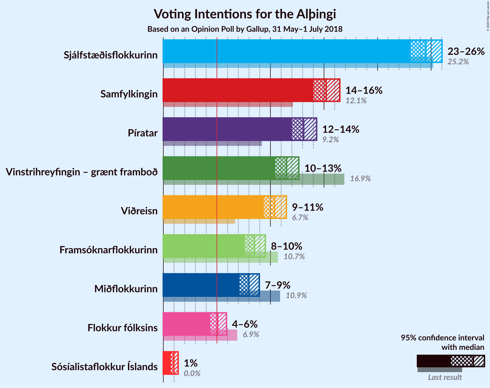
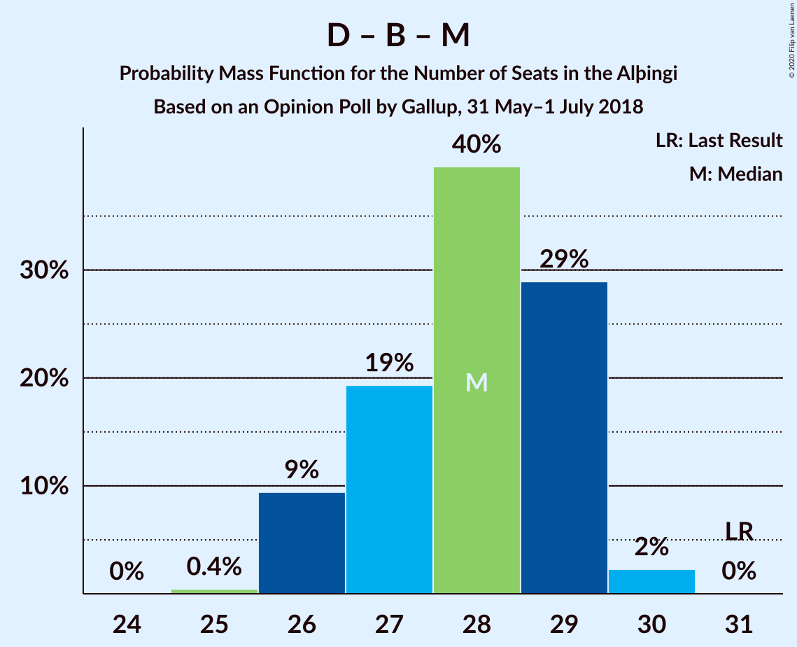
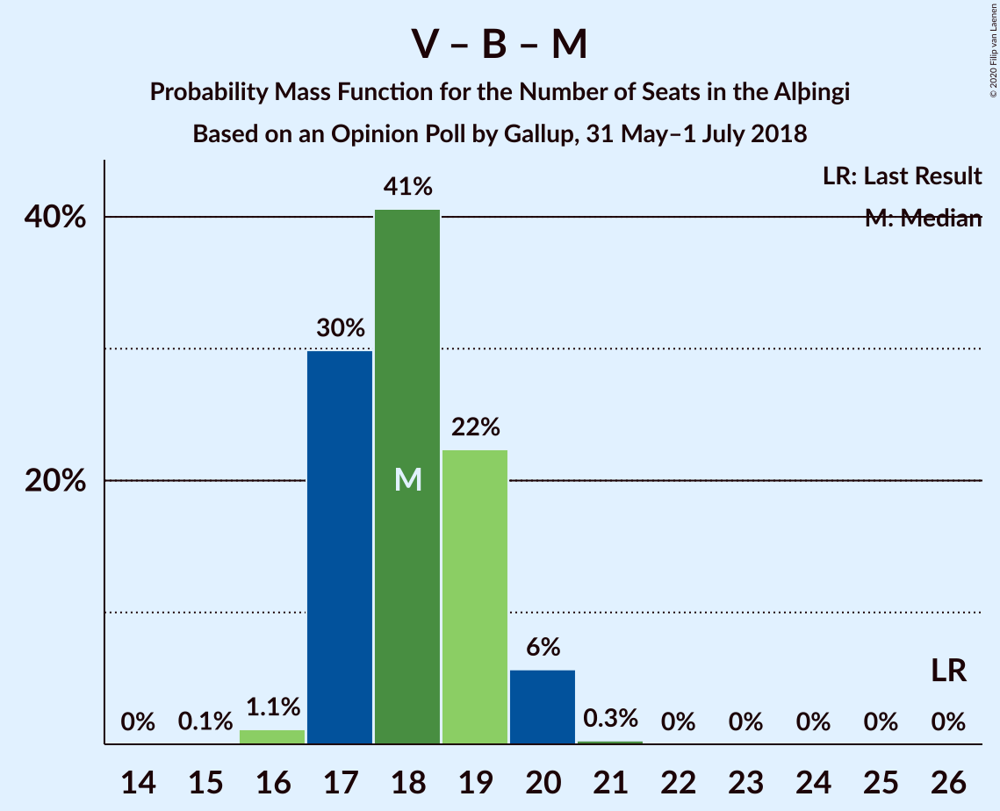

# Opinion Poll by Gallup, 31 May–1 July 2018

<a href="#voting-intentions">Voting Intentions</a> | <a href="#seats">Seats</a> | <a href="#coalitions">Coalitions</a> | <a href="#technical-information">Technical Information</a>

## Voting Intentions

### Confidence Intervals

| Party | Last Result | Poll Result | 80% Confidence Interval | 90% Confidence Interval | 95% Confidence Interval | 99% Confidence Interval |
|:-----:|:-----------:|:-----------:|:-----------------------:|:-----------------------:|:-----------------------:|:-----------------------:|
| Sjálfstæðisflokkurinn | 25.2% | 24.5% | 23.6–25.5% |23.3–25.8% |23.1–26.0% |22.6–26.5% |
| Samfylkingin | 12.1% | 15.2% | 14.4–16.0% |14.2–16.3% |14.0–16.5% |13.6–16.9% |
| Píratar | 9.2% | 13.1% | 12.4–13.9% |12.2–14.1% |12.0–14.3% |11.6–14.7% |
| Vinstrihreyfingin – grænt framboð | 16.9% | 11.5% | 10.8–12.3% |10.6–12.5% |10.5–12.7% |10.1–13.0% |
| Viðreisn | 6.7% | 10.4% | 9.7–11.1% |9.5–11.3% |9.4–11.5% |9.1–11.8% |
| Framsóknarflokkurinn | 10.7% | 8.5% | 7.9–9.2% |7.7–9.4% |7.6–9.5% |7.3–9.8% |
| Miðflokkurinn | 10.9% | 8.0% | 7.4–8.6% |7.2–8.8% |7.1–9.0% |6.8–9.3% |
| Flokkur fólksins | 6.9% | 5.1% | 4.6–5.6% |4.5–5.8% |4.4–5.9% |4.2–6.2% |

*Note:* The poll result column reflects the actual value used in the calculations. Published results may vary slightly, and in addition be rounded to fewer digits.

## Seats

### Confidence Intervals

| Party | Last Result | Median | 80% Confidence Interval | 90% Confidence Interval | 95% Confidence Interval | 99% Confidence Interval |
|:-----:|:-----------:|:------:|:-----------------------:|:-----------------------:|:-----------------------:|:-----------------------:|
| <a href="#sjálfstæðisflokkurinn">Sjálfstæðisflokkurinn</a> | 16 | 17 | 16–19 |16–19 |16–19 |15–19 |
| <a href="#samfylkingin">Samfylkingin</a> | 7 | 10 | 10–11 |9–11 |9–11 |9–12 |
| <a href="#píratar">Píratar</a> | 6 | 9 | 8–9 |8–10 |8–10 |8–10 |
| <a href="#vinstrihreyfingin-–-grænt-framboð">Vinstrihreyfingin – grænt framboð</a> | 11 | 8 | 7–8 |7–8 |7–9 |6–9 |
| <a href="#viðreisn">Viðreisn</a> | 4 | 7 | 6–7 |6–8 |6–8 |6–8 |
| <a href="#framsóknarflokkurinn">Framsóknarflokkurinn</a> | 8 | 5 | 5–6 |5–6 |5–6 |5–7 |
| <a href="#miðflokkurinn">Miðflokkurinn</a> | 7 | 5 | 5–6 |4–6 |4–6 |4–6 |
| <a href="#flokkur-fólksins">Flokkur fólksins</a> | 4 | 3 | 0–3 |0–3 |0–4 |0–4 |

### Sjálfstæðisflokkurinn

*For a full overview of the results for this party, see the [Sjálfstæðisflokkurinn](party-sjálfstæðisflokkurinn.html) page.*

| Number of Seats | Probability | Accumulated | Special Marks |
|:---------------:|:-----------:|:-----------:|:-------------:|
| 15 | 1.1% | 100% |  |
| 16 | 19% | 98.9% | Last Result |
| 17 | 33% | 80% | Median |
| 18 | 34% | 47% |  |
| 19 | 13% | 13% |  |
| 20 | 0.1% | 0.1% |  |
| 21 | 0% | 0% |  |

### Samfylkingin

*For a full overview of the results for this party, see the [Samfylkingin](party-samfylkingin.html) page.*

| Number of Seats | Probability | Accumulated | Special Marks |
|:---------------:|:-----------:|:-----------:|:-------------:|
| 7 | 0% | 100% | Last Result |
| 8 | 0.1% | 100% |  |
| 9 | 8% | 99.9% |  |
| 10 | 60% | 92% | Median |
| 11 | 32% | 33% |  |
| 12 | 0.8% | 0.8% |  |
| 13 | 0% | 0% |  |

### Píratar

*For a full overview of the results for this party, see the [Píratar](party-píratar.html) page.*

| Number of Seats | Probability | Accumulated | Special Marks |
|:---------------:|:-----------:|:-----------:|:-------------:|
| 6 | 0% | 100% | Last Result |
| 7 | 0.2% | 100% |  |
| 8 | 40% | 99.8% |  |
| 9 | 54% | 60% | Median |
| 10 | 6% | 6% |  |
| 11 | 0% | 0% |  |

### Vinstrihreyfingin – grænt framboð

*For a full overview of the results for this party, see the [Vinstrihreyfingin – grænt framboð](party-vinstrihreyfingin–græntframboð.html) page.*

| Number of Seats | Probability | Accumulated | Special Marks |
|:---------------:|:-----------:|:-----------:|:-------------:|
| 6 | 0.9% | 100% |  |
| 7 | 44% | 99.1% |  |
| 8 | 51% | 55% | Median |
| 9 | 4% | 4% |  |
| 10 | 0.1% | 0.1% |  |
| 11 | 0% | 0% | Last Result |

### Viðreisn

*For a full overview of the results for this party, see the [Viðreisn](party-viðreisn.html) page.*

| Number of Seats | Probability | Accumulated | Special Marks |
|:---------------:|:-----------:|:-----------:|:-------------:|
| 4 | 0% | 100% | Last Result |
| 5 | 0.1% | 100% |  |
| 6 | 27% | 99.9% |  |
| 7 | 66% | 73% | Median |
| 8 | 7% | 7% |  |
| 9 | 0% | 0% |  |

### Framsóknarflokkurinn

*For a full overview of the results for this party, see the [Framsóknarflokkurinn](party-framsóknarflokkurinn.html) page.*

| Number of Seats | Probability | Accumulated | Special Marks |
|:---------------:|:-----------:|:-----------:|:-------------:|
| 4 | 0.4% | 100% |  |
| 5 | 54% | 99.6% | Median |
| 6 | 45% | 46% |  |
| 7 | 0.4% | 0.5% |  |
| 8 | 0.1% | 0.1% | Last Result |
| 9 | 0% | 0% |  |

### Miðflokkurinn

*For a full overview of the results for this party, see the [Miðflokkurinn](party-miðflokkurinn.html) page.*

| Number of Seats | Probability | Accumulated | Special Marks |
|:---------------:|:-----------:|:-----------:|:-------------:|
| 4 | 8% | 100% |  |
| 5 | 78% | 92% | Median |
| 6 | 14% | 14% |  |
| 7 | 0% | 0% | Last Result |

### Flokkur fólksins

*For a full overview of the results for this party, see the [Flokkur fólksins](party-flokkurfólksins.html) page.*

| Number of Seats | Probability | Accumulated | Special Marks |
|:---------------:|:-----------:|:-----------:|:-------------:|
| 0 | 41% | 100% |  |
| 1 | 0% | 59% |  |
| 2 | 0% | 59% |  |
| 3 | 56% | 59% | Median |
| 4 | 3% | 3% | Last Result |
| 5 | 0% | 0% |  |

## Coalitions

### Confidence Intervals

| Coalition | Last Result | Median | Majority? | 80% Confidence Interval | 90% Confidence Interval | 95% Confidence Interval | 99% Confidence Interval |
|:---------:|:-----------:|:------:|:---------:|:-----------------------:|:-----------------------:|:-----------------------:|:-----------------------:|
| Samfylkingin – Píratar – Vinstrihreyfingin – grænt framboð – Viðreisn | 28 | 33 | 90% | 32–35 | 31–35 | 31–36 | 31–36 |
| Sjálfstæðisflokkurinn – Vinstrihreyfingin – grænt framboð – Framsóknarflokkurinn | 35 | 31 | 10% | 29–31 | 29–32 | 28–32 | 28–33 |
| Samfylkingin – Vinstrihreyfingin – grænt framboð – Framsóknarflokkurinn – Miðflokkurinn | 33 | 29 | 0.1% | 27–30 | 26–30 | 26–31 | 26–31 |
| Sjálfstæðisflokkurinn – Framsóknarflokkurinn – Miðflokkurinn | 31 | 28 | 0% | 27–29 | 26–29 | 26–30 | 25–30 |
| Sjálfstæðisflokkurinn – Samfylkingin | 23 | 28 | 0% | 26–29 | 26–29 | 26–29 | 25–30 |
| Samfylkingin – Píratar – Vinstrihreyfingin – grænt framboð | 24 | 26 | 0% | 25–28 | 25–28 | 25–28 | 24–29 |
| Sjálfstæðisflokkurinn – Vinstrihreyfingin – grænt framboð | 27 | 25 | 0% | 24–26 | 23–26 | 23–27 | 23–27 |
| Sjálfstæðisflokkurinn – Viðreisn | 20 | 24 | 0% | 23–25 | 23–26 | 22–26 | 22–26 |
| Samfylkingin – Vinstrihreyfingin – grænt framboð – Framsóknarflokkurinn | 26 | 23 | 0% | 22–25 | 22–25 | 21–25 | 21–26 |
| Sjálfstæðisflokkurinn – Framsóknarflokkurinn | 24 | 23 | 0% | 22–24 | 21–24 | 21–25 | 21–25 |
| Samfylkingin – Vinstrihreyfingin – grænt framboð – Miðflokkurinn | 25 | 23 | 0% | 22–24 | 21–24 | 21–25 | 20–25 |
| Sjálfstæðisflokkurinn – Miðflokkurinn | 23 | 23 | 0% | 21–24 | 21–24 | 21–24 | 20–24 |
| Vinstrihreyfingin – grænt framboð – Framsóknarflokkurinn – Miðflokkurinn | 26 | 18 | 0% | 17–19 | 16–20 | 16–20 | 16–20 |
| Samfylkingin – Vinstrihreyfingin – grænt framboð | 18 | 18 | 0% | 17–19 | 17–19 | 16–19 | 16–20 |
| Píratar – Vinstrihreyfingin – grænt framboð | 17 | 16 | 0% | 15–17 | 15–18 | 15–18 | 15–18 |
| Vinstrihreyfingin – grænt framboð – Framsóknarflokkurinn | 19 | 13 | 0% | 12–14 | 12–14 | 12–14 | 12–15 |
| Vinstrihreyfingin – grænt framboð – Miðflokkurinn | 18 | 13 | 0% | 12–14 | 11–14 | 11–14 | 11–15 |

### Samfylkingin – Píratar – Vinstrihreyfingin – grænt framboð – Viðreisn

| Number of Seats | Probability | Accumulated | Special Marks |
|:---------------:|:-----------:|:-----------:|:-------------:|
| 28 | 0% | 100% | Last Result |
| 29 | 0% | 100% |  |
| 30 | 0.2% | 100% |  |
| 31 | 10% | 99.8% |  |
| 32 | 23% | 90% | Majority |
| 33 | 21% | 67% |  |
| 34 | 22% | 46% | Median |
| 35 | 20% | 23% |  |
| 36 | 3% | 3% |  |
| 37 | 0.2% | 0.2% |  |
| 38 | 0% | 0% |  |

### Sjálfstæðisflokkurinn – Vinstrihreyfingin – grænt framboð – Framsóknarflokkurinn

| Number of Seats | Probability | Accumulated | Special Marks |
|:---------------:|:-----------:|:-----------:|:-------------:|
| 27 | 0.1% | 100% |  |
| 28 | 5% | 99.9% |  |
| 29 | 10% | 95% |  |
| 30 | 34% | 85% | Median |
| 31 | 41% | 51% |  |
| 32 | 9% | 10% | Majority |
| 33 | 0.9% | 0.9% |  |
| 34 | 0% | 0% |  |
| 35 | 0% | 0% | Last Result |

### Samfylkingin – Vinstrihreyfingin – grænt framboð – Framsóknarflokkurinn – Miðflokkurinn

| Number of Seats | Probability | Accumulated | Special Marks |
|:---------------:|:-----------:|:-----------:|:-------------:|
| 25 | 0.3% | 100% |  |
| 26 | 6% | 99.7% |  |
| 27 | 20% | 94% |  |
| 28 | 23% | 74% | Median |
| 29 | 36% | 51% |  |
| 30 | 13% | 15% |  |
| 31 | 2% | 3% |  |
| 32 | 0.1% | 0.1% | Majority |
| 33 | 0% | 0% | Last Result |

### Sjálfstæðisflokkurinn – Framsóknarflokkurinn – Miðflokkurinn

| Number of Seats | Probability | Accumulated | Special Marks |
|:---------------:|:-----------:|:-----------:|:-------------:|
| 25 | 0.6% | 100% |  |
| 26 | 9% | 99.4% |  |
| 27 | 20% | 90% | Median |
| 28 | 43% | 70% |  |
| 29 | 23% | 27% |  |
| 30 | 4% | 4% |  |
| 31 | 0.1% | 0.1% | Last Result |
| 32 | 0% | 0% | Majority |

### Sjálfstæðisflokkurinn – Samfylkingin

| Number of Seats | Probability | Accumulated | Special Marks |
|:---------------:|:-----------:|:-----------:|:-------------:|
| 23 | 0% | 100% | Last Result |
| 24 | 0% | 100% |  |
| 25 | 1.3% | 100% |  |
| 26 | 15% | 98.7% |  |
| 27 | 28% | 84% | Median |
| 28 | 31% | 56% |  |
| 29 | 23% | 25% |  |
| 30 | 1.5% | 1.5% |  |
| 31 | 0% | 0% |  |

### Samfylkingin – Píratar – Vinstrihreyfingin – grænt framboð

| Number of Seats | Probability | Accumulated | Special Marks |
|:---------------:|:-----------:|:-----------:|:-------------:|
| 24 | 2% | 100% | Last Result |
| 25 | 19% | 98% |  |
| 26 | 30% | 79% |  |
| 27 | 27% | 49% | Median |
| 28 | 19% | 21% |  |
| 29 | 2% | 2% |  |
| 30 | 0.2% | 0.2% |  |
| 31 | 0% | 0% |  |

### Sjálfstæðisflokkurinn – Vinstrihreyfingin – grænt framboð

| Number of Seats | Probability | Accumulated | Special Marks |
|:---------------:|:-----------:|:-----------:|:-------------:|
| 22 | 0.2% | 100% |  |
| 23 | 7% | 99.8% |  |
| 24 | 20% | 93% |  |
| 25 | 46% | 73% | Median |
| 26 | 24% | 27% |  |
| 27 | 3% | 3% | Last Result |
| 28 | 0% | 0% |  |

### Sjálfstæðisflokkurinn – Viðreisn

| Number of Seats | Probability | Accumulated | Special Marks |
|:---------------:|:-----------:|:-----------:|:-------------:|
| 20 | 0% | 100% | Last Result |
| 21 | 0.1% | 100% |  |
| 22 | 3% | 99.9% |  |
| 23 | 25% | 97% |  |
| 24 | 30% | 72% | Median |
| 25 | 35% | 42% |  |
| 26 | 7% | 8% |  |
| 27 | 0.2% | 0.2% |  |
| 28 | 0% | 0% |  |

### Samfylkingin – Vinstrihreyfingin – grænt framboð – Framsóknarflokkurinn

| Number of Seats | Probability | Accumulated | Special Marks |
|:---------------:|:-----------:|:-----------:|:-------------:|
| 21 | 3% | 100% |  |
| 22 | 24% | 97% |  |
| 23 | 25% | 73% | Median |
| 24 | 38% | 48% |  |
| 25 | 9% | 10% |  |
| 26 | 0.9% | 0.9% | Last Result |
| 27 | 0% | 0% |  |

### Sjálfstæðisflokkurinn – Framsóknarflokkurinn

| Number of Seats | Probability | Accumulated | Special Marks |
|:---------------:|:-----------:|:-----------:|:-------------:|
| 20 | 0.4% | 100% |  |
| 21 | 9% | 99.6% |  |
| 22 | 24% | 90% | Median |
| 23 | 40% | 66% |  |
| 24 | 22% | 26% | Last Result |
| 25 | 3% | 3% |  |
| 26 | 0% | 0% |  |

### Samfylkingin – Vinstrihreyfingin – grænt framboð – Miðflokkurinn

| Number of Seats | Probability | Accumulated | Special Marks |
|:---------------:|:-----------:|:-----------:|:-------------:|
| 20 | 0.6% | 100% |  |
| 21 | 7% | 99.3% |  |
| 22 | 26% | 92% |  |
| 23 | 38% | 66% | Median |
| 24 | 23% | 28% |  |
| 25 | 5% | 5% | Last Result |
| 26 | 0.3% | 0.3% |  |
| 27 | 0% | 0% |  |

### Sjálfstæðisflokkurinn – Miðflokkurinn

| Number of Seats | Probability | Accumulated | Special Marks |
|:---------------:|:-----------:|:-----------:|:-------------:|
| 20 | 1.4% | 100% |  |
| 21 | 18% | 98.6% |  |
| 22 | 28% | 81% | Median |
| 23 | 40% | 53% | Last Result |
| 24 | 13% | 13% |  |
| 25 | 0.1% | 0.1% |  |
| 26 | 0% | 0% |  |

### Vinstrihreyfingin – grænt framboð – Framsóknarflokkurinn – Miðflokkurinn

| Number of Seats | Probability | Accumulated | Special Marks |
|:---------------:|:-----------:|:-----------:|:-------------:|
| 15 | 0.1% | 100% |  |
| 16 | 5% | 99.9% |  |
| 17 | 24% | 95% |  |
| 18 | 33% | 71% | Median |
| 19 | 31% | 38% |  |
| 20 | 6% | 6% |  |
| 21 | 0.2% | 0.2% |  |
| 22 | 0% | 0% |  |
| 23 | 0% | 0% |  |
| 24 | 0% | 0% |  |
| 25 | 0% | 0% |  |
| 26 | 0% | 0% | Last Result |

### Samfylkingin – Vinstrihreyfingin – grænt framboð

| Number of Seats | Probability | Accumulated | Special Marks |
|:---------------:|:-----------:|:-----------:|:-------------:|
| 15 | 0.2% | 100% |  |
| 16 | 4% | 99.8% |  |
| 17 | 32% | 96% |  |
| 18 | 42% | 64% | Last Result, Median |
| 19 | 21% | 22% |  |
| 20 | 2% | 2% |  |
| 21 | 0.1% | 0.1% |  |
| 22 | 0% | 0% |  |

### Píratar – Vinstrihreyfingin – grænt framboð

| Number of Seats | Probability | Accumulated | Special Marks |
|:---------------:|:-----------:|:-----------:|:-------------:|
| 14 | 0.4% | 100% |  |
| 15 | 20% | 99.6% |  |
| 16 | 42% | 79% |  |
| 17 | 32% | 38% | Last Result, Median |
| 18 | 6% | 6% |  |
| 19 | 0.3% | 0.3% |  |
| 20 | 0% | 0% |  |

### Vinstrihreyfingin – grænt framboð – Framsóknarflokkurinn

| Number of Seats | Probability | Accumulated | Special Marks |
|:---------------:|:-----------:|:-----------:|:-------------:|
| 11 | 0.4% | 100% |  |
| 12 | 30% | 99.5% |  |
| 13 | 37% | 69% | Median |
| 14 | 30% | 33% |  |
| 15 | 2% | 2% |  |
| 16 | 0% | 0% |  |
| 17 | 0% | 0% |  |
| 18 | 0% | 0% |  |
| 19 | 0% | 0% | Last Result |

### Vinstrihreyfingin – grænt framboð – Miðflokkurinn

| Number of Seats | Probability | Accumulated | Special Marks |
|:---------------:|:-----------:|:-----------:|:-------------:|
| 10 | 0.1% | 100% |  |
| 11 | 6% | 99.9% |  |
| 12 | 35% | 94% |  |
| 13 | 47% | 58% | Median |
| 14 | 11% | 12% |  |
| 15 | 0.5% | 0.5% |  |
| 16 | 0% | 0% |  |
| 17 | 0% | 0% |  |
| 18 | 0% | 0% | Last Result |

## Technical Information

### Opinion Poll

+ **Polling firm:** Gallup
+ **Commissioner(s):** —
+ **Fieldwork period:** 31 May–1 July 2018

### Calculations

+ **Sample size:** 3243
+ **Simulations done:** 1,048,576
+ **Error estimate:** 1.20%

