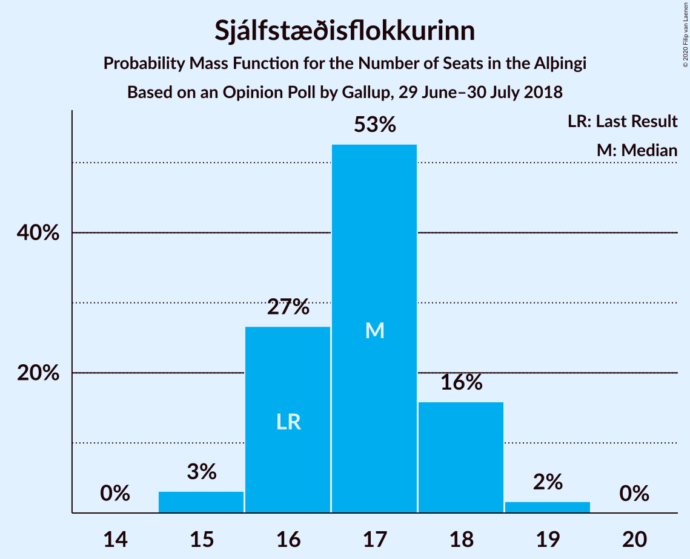
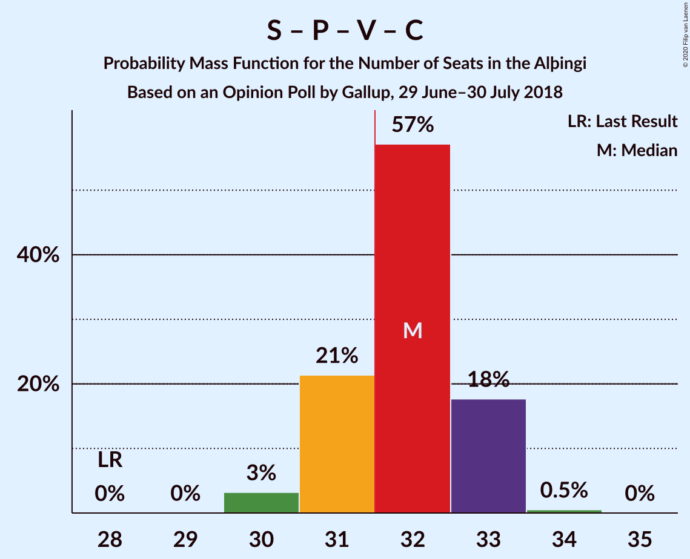
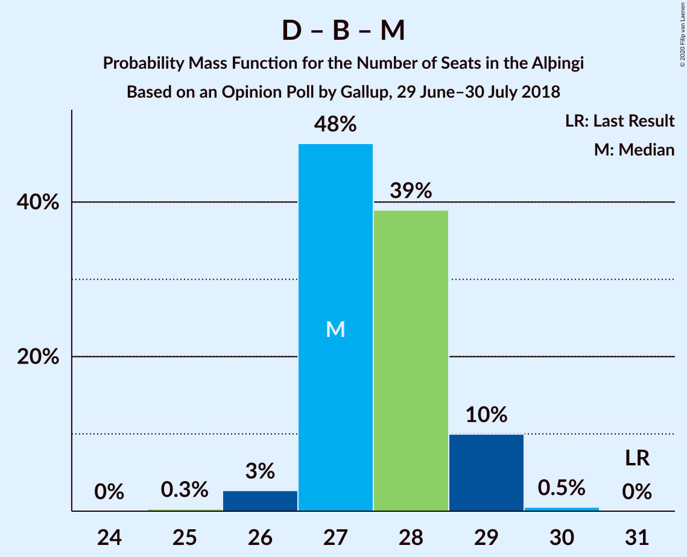
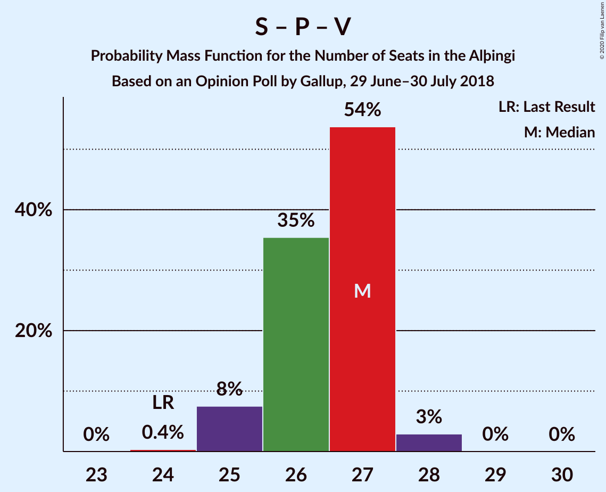
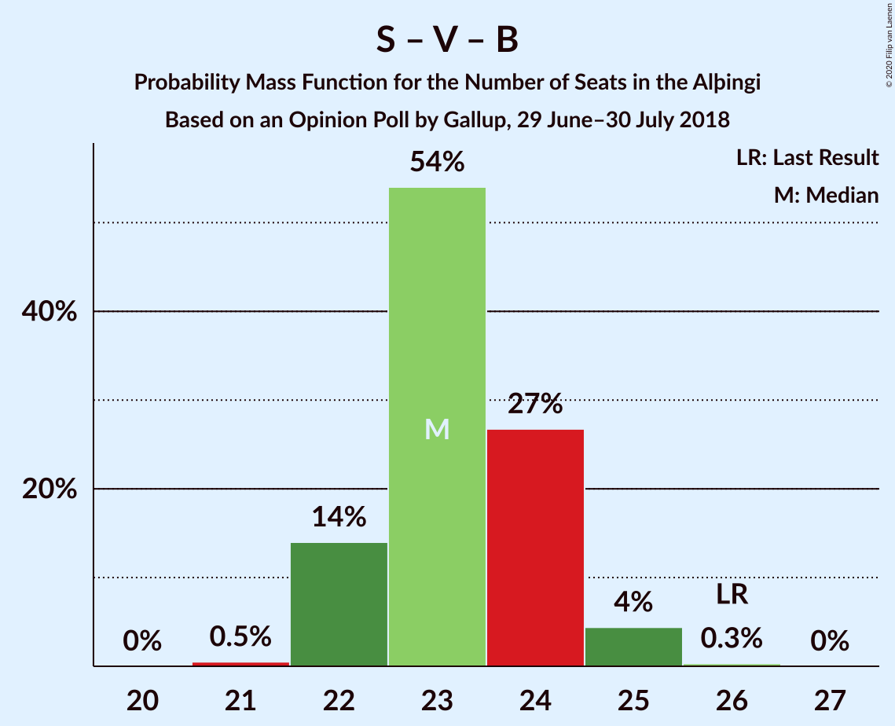
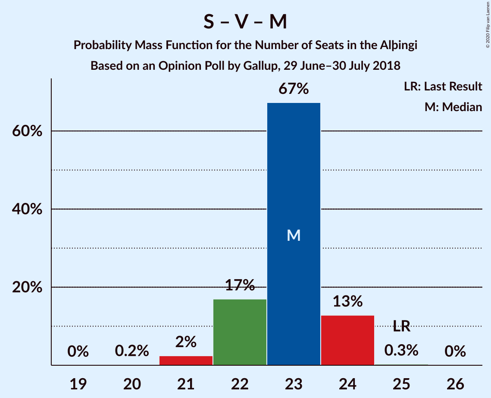
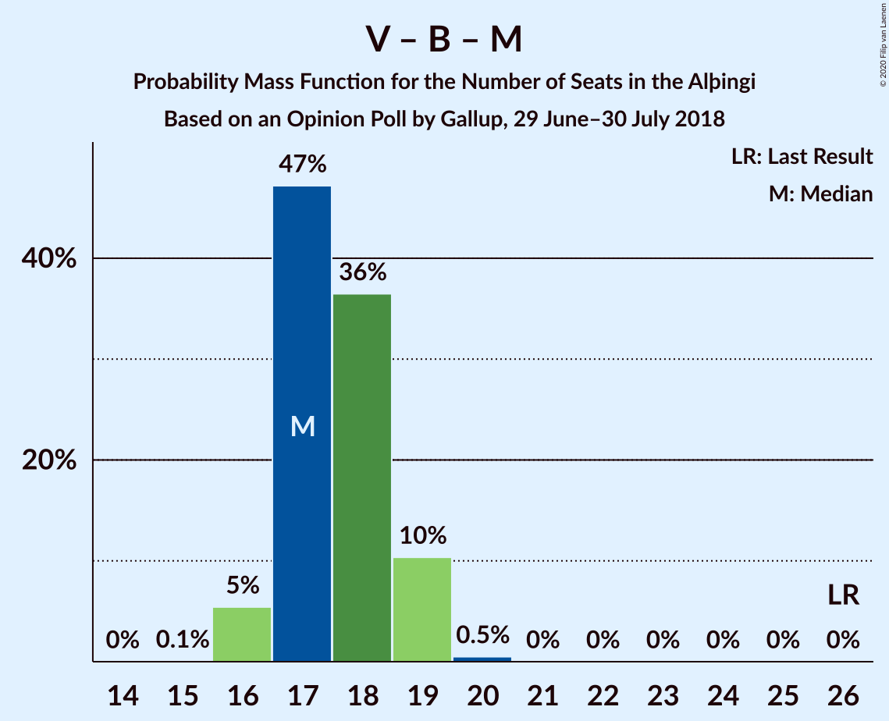

# Opinion Poll by Gallup, 29 June–30 July 2018

<a href="#voting-intentions">Voting Intentions</a> | <a href="#seats">Seats</a> | <a href="#coalitions">Coalitions</a> | <a href="#technical-information">Technical Information</a>

## Voting Intentions

### Confidence Intervals

| Party | Last Result | Poll Result | 80% Confidence Interval | 90% Confidence Interval | 95% Confidence Interval | 99% Confidence Interval |
|:-----:|:-----------:|:-----------:|:-----------------------:|:-----------------------:|:-----------------------:|:-----------------------:|
| Sjálfstæðisflokkurinn | 25.2% | 24.6% | 23.7–25.5% |23.4–25.8% |23.2–26.0% |22.8–26.5% |
| Samfylkingin | 12.1% | 16.7% | 15.9–17.5% |15.7–17.8% |15.5–18.0% |15.2–18.4% |
| Píratar | 9.2% | 13.9% | 13.2–14.7% |13.0–14.9% |12.8–15.1% |12.5–15.5% |
| Vinstrihreyfingin – grænt framboð | 16.9% | 10.7% | 10.1–11.4% |9.9–11.6% |9.7–11.8% |9.4–12.1% |
| Framsóknarflokkurinn | 10.7% | 9.2% | 8.6–9.8% |8.4–10.0% |8.3–10.2% |8.0–10.5% |
| Viðreisn | 6.7% | 8.7% | 8.1–9.3% |8.0–9.5% |7.8–9.7% |7.6–10.0% |
| Miðflokkurinn | 10.9% | 8.6% | 8.0–9.2% |7.9–9.4% |7.7–9.6% |7.5–9.9% |
| Flokkur fólksins | 6.9% | 6.0% | 5.5–6.5% |5.4–6.7% |5.3–6.8% |5.0–7.1% |
| Sósíalistaflokkur Íslands | 0.0% | 0.9% | 0.7–1.1% |0.7–1.2% |0.6–1.3% |0.6–1.4% |

*Note:* The poll result column reflects the actual value used in the calculations. Published results may vary slightly, and in addition be rounded to fewer digits.

## Seats

### Confidence Intervals

| Party | Last Result | Median | 80% Confidence Interval | 90% Confidence Interval | 95% Confidence Interval | 99% Confidence Interval |
|:-----:|:-----------:|:------:|:-----------------------:|:-----------------------:|:-----------------------:|:-----------------------:|
| <a href="#sjálfstæðisflokkurinn">Sjálfstæðisflokkurinn</a> | 16 | 17 | 16–18 |16–18 |15–18 |15–19 |
| <a href="#samfylkingin">Samfylkingin</a> | 7 | 11 | 10–11 |10–11 |10–12 |10–12 |
| <a href="#píratar">Píratar</a> | 6 | 9 | 8–9 |8–9 |8–10 |8–10 |
| <a href="#vinstrihreyfingin-–-grænt-framboð">Vinstrihreyfingin – grænt framboð</a> | 11 | 7 | 6–7 |6–7 |6–8 |6–8 |
| <a href="#framsóknarflokkurinn">Framsóknarflokkurinn</a> | 8 | 5 | 5–6 |5–6 |5–7 |5–8 |
| <a href="#viðreisn">Viðreisn</a> | 4 | 5 | 5–6 |5–6 |5–6 |5–6 |
| <a href="#miðflokkurinn">Miðflokkurinn</a> | 7 | 5 | 5–6 |5–6 |5–6 |4–6 |
| <a href="#flokkur-fólksins">Flokkur fólksins</a> | 4 | 4 | 3–4 |3–4 |3–4 |3–4 |
| <a href="#sósíalistaflokkur-íslands">Sósíalistaflokkur Íslands</a> | 0 | 0 | 0 |0 |0 |0 |

### Sjálfstæðisflokkurinn

*For a full overview of the results for this party, see the [Sjálfstæðisflokkurinn](party-sjálfstæðisflokkurinn.html) page.*

| Number of Seats | Probability | Accumulated | Special Marks |
|:---------------:|:-----------:|:-----------:|:-------------:|
| 15 | 3% | 100% |  |
| 16 | 27% | 97% | Last Result |
| 17 | 53% | 70% | Median |
| 18 | 16% | 18% |  |
| 19 | 2% | 2% |  |
| 20 | 0% | 0% |  |

### Samfylkingin

*For a full overview of the results for this party, see the [Samfylkingin](party-samfylkingin.html) page.*

| Number of Seats | Probability | Accumulated | Special Marks |
|:---------------:|:-----------:|:-----------:|:-------------:|
| 7 | 0% | 100% | Last Result |
| 8 | 0% | 100% |  |
| 9 | 0.1% | 100% |  |
| 10 | 14% | 99.9% |  |
| 11 | 83% | 86% | Median |
| 12 | 3% | 3% |  |
| 13 | 0% | 0% |  |

### Píratar

*For a full overview of the results for this party, see the [Píratar](party-píratar.html) page.*

| Number of Seats | Probability | Accumulated | Special Marks |
|:---------------:|:-----------:|:-----------:|:-------------:|
| 6 | 0% | 100% | Last Result |
| 7 | 0% | 100% |  |
| 8 | 23% | 100% |  |
| 9 | 73% | 77% | Median |
| 10 | 4% | 4% |  |
| 11 | 0% | 0% |  |

### Vinstrihreyfingin – grænt framboð

*For a full overview of the results for this party, see the [Vinstrihreyfingin – grænt framboð](party-vinstrihreyfingin–græntframboð.html) page.*

| Number of Seats | Probability | Accumulated | Special Marks |
|:---------------:|:-----------:|:-----------:|:-------------:|
| 6 | 22% | 100% |  |
| 7 | 75% | 78% | Median |
| 8 | 4% | 4% |  |
| 9 | 0% | 0% |  |
| 10 | 0% | 0% |  |
| 11 | 0% | 0% | Last Result |

### Framsóknarflokkurinn

*For a full overview of the results for this party, see the [Framsóknarflokkurinn](party-framsóknarflokkurinn.html) page.*

| Number of Seats | Probability | Accumulated | Special Marks |
|:---------------:|:-----------:|:-----------:|:-------------:|
| 5 | 53% | 100% | Median |
| 6 | 44% | 47% |  |
| 7 | 2% | 3% |  |
| 8 | 0.5% | 0.5% | Last Result |
| 9 | 0% | 0% |  |

### Viðreisn

*For a full overview of the results for this party, see the [Viðreisn](party-viðreisn.html) page.*

| Number of Seats | Probability | Accumulated | Special Marks |
|:---------------:|:-----------:|:-----------:|:-------------:|
| 4 | 0.3% | 100% | Last Result |
| 5 | 60% | 99.7% | Median |
| 6 | 40% | 40% |  |
| 7 | 0.1% | 0.1% |  |
| 8 | 0% | 0% |  |

### Miðflokkurinn

*For a full overview of the results for this party, see the [Miðflokkurinn](party-miðflokkurinn.html) page.*

| Number of Seats | Probability | Accumulated | Special Marks |
|:---------------:|:-----------:|:-----------:|:-------------:|
| 4 | 1.0% | 100% |  |
| 5 | 78% | 99.0% | Median |
| 6 | 21% | 21% |  |
| 7 | 0% | 0% | Last Result |

### Flokkur fólksins

*For a full overview of the results for this party, see the [Flokkur fólksins](party-flokkurfólksins.html) page.*

| Number of Seats | Probability | Accumulated | Special Marks |
|:---------------:|:-----------:|:-----------:|:-------------:|
| 0 | 0.2% | 100% |  |
| 1 | 0% | 99.8% |  |
| 2 | 0% | 99.8% |  |
| 3 | 48% | 99.8% |  |
| 4 | 52% | 52% | Last Result, Median |
| 5 | 0.1% | 0.1% |  |
| 6 | 0% | 0% |  |

### Sósíalistaflokkur Íslands

*For a full overview of the results for this party, see the [Sósíalistaflokkur Íslands](party-sósíalistaflokkuríslands.html) page.*

| Number of Seats | Probability | Accumulated | Special Marks |
|:---------------:|:-----------:|:-----------:|:-------------:|
| 0 | 100% | 100% | Last Result, Median |

## Coalitions

### Confidence Intervals

| Coalition | Last Result | Median | Majority? | 80% Confidence Interval | 90% Confidence Interval | 95% Confidence Interval | 99% Confidence Interval |
|:---------:|:-----------:|:------:|:---------:|:-----------------------:|:-----------------------:|:-----------------------:|:-----------------------:|
| Samfylkingin – Píratar – Vinstrihreyfingin – grænt framboð – Viðreisn | 28 | 32 | 75% | 31–33 | 31–33 | 30–33 | 30–34 |
| Sjálfstæðisflokkurinn – Vinstrihreyfingin – grænt framboð – Framsóknarflokkurinn | 35 | 29 | 0.6% | 28–30 | 28–31 | 27–31 | 27–32 |
| Samfylkingin – Vinstrihreyfingin – grænt framboð – Framsóknarflokkurinn – Miðflokkurinn | 33 | 28 | 0% | 28–29 | 27–30 | 27–30 | 27–30 |
| Sjálfstæðisflokkurinn – Framsóknarflokkurinn – Miðflokkurinn | 31 | 27 | 0% | 27–29 | 27–29 | 26–29 | 26–30 |
| Sjálfstæðisflokkurinn – Samfylkingin | 23 | 28 | 0% | 27–29 | 26–29 | 26–29 | 26–30 |
| Samfylkingin – Píratar – Vinstrihreyfingin – grænt framboð | 24 | 27 | 0% | 26–27 | 25–27 | 25–28 | 25–28 |
| Samfylkingin – Vinstrihreyfingin – grænt framboð – Framsóknarflokkurinn | 26 | 23 | 0% | 22–24 | 22–24 | 22–25 | 21–25 |
| Sjálfstæðisflokkurinn – Vinstrihreyfingin – grænt framboð | 27 | 24 | 0% | 23–25 | 22–25 | 22–25 | 22–26 |
| Sjálfstæðisflokkurinn – Framsóknarflokkurinn | 24 | 22 | 0% | 22–23 | 21–24 | 21–24 | 20–25 |
| Samfylkingin – Vinstrihreyfingin – grænt framboð – Miðflokkurinn | 25 | 23 | 0% | 22–24 | 22–24 | 21–24 | 21–24 |
| Sjálfstæðisflokkurinn – Viðreisn | 20 | 22 | 0% | 21–23 | 21–24 | 21–24 | 20–24 |
| Sjálfstæðisflokkurinn – Miðflokkurinn | 23 | 22 | 0% | 21–23 | 21–23 | 21–23 | 20–24 |
| Vinstrihreyfingin – grænt framboð – Framsóknarflokkurinn – Miðflokkurinn | 26 | 17 | 0% | 17–19 | 16–19 | 16–19 | 16–20 |
| Samfylkingin – Vinstrihreyfingin – grænt framboð | 18 | 18 | 0% | 17–18 | 17–18 | 16–19 | 16–19 |
| Píratar – Vinstrihreyfingin – grænt framboð | 17 | 16 | 0% | 15–16 | 15–16 | 14–17 | 14–17 |
| Vinstrihreyfingin – grænt framboð – Framsóknarflokkurinn | 19 | 12 | 0% | 12–13 | 11–13 | 11–14 | 11–14 |
| Vinstrihreyfingin – grænt framboð – Miðflokkurinn | 18 | 12 | 0% | 11–13 | 11–13 | 11–13 | 11–13 |

### Samfylkingin – Píratar – Vinstrihreyfingin – grænt framboð – Viðreisn

| Number of Seats | Probability | Accumulated | Special Marks |
|:---------------:|:-----------:|:-----------:|:-------------:|
| 28 | 0% | 100% | Last Result |
| 29 | 0% | 100% |  |
| 30 | 3% | 100% |  |
| 31 | 21% | 97% |  |
| 32 | 57% | 75% | Median, Majority |
| 33 | 18% | 18% |  |
| 34 | 0.5% | 0.5% |  |
| 35 | 0% | 0% |  |

### Sjálfstæðisflokkurinn – Vinstrihreyfingin – grænt framboð – Framsóknarflokkurinn

| Number of Seats | Probability | Accumulated | Special Marks |
|:---------------:|:-----------:|:-----------:|:-------------:|
| 27 | 3% | 100% |  |
| 28 | 10% | 97% |  |
| 29 | 59% | 87% | Median |
| 30 | 22% | 28% |  |
| 31 | 5% | 6% |  |
| 32 | 0.6% | 0.6% | Majority |
| 33 | 0% | 0% |  |
| 34 | 0% | 0% |  |
| 35 | 0% | 0% | Last Result |

### Samfylkingin – Vinstrihreyfingin – grænt framboð – Framsóknarflokkurinn – Miðflokkurinn

| Number of Seats | Probability | Accumulated | Special Marks |
|:---------------:|:-----------:|:-----------:|:-------------:|
| 26 | 0.4% | 100% |  |
| 27 | 9% | 99.6% |  |
| 28 | 49% | 91% | Median |
| 29 | 33% | 42% |  |
| 30 | 8% | 9% |  |
| 31 | 0.4% | 0.4% |  |
| 32 | 0% | 0% | Majority |
| 33 | 0% | 0% | Last Result |

### Sjálfstæðisflokkurinn – Framsóknarflokkurinn – Miðflokkurinn

| Number of Seats | Probability | Accumulated | Special Marks |
|:---------------:|:-----------:|:-----------:|:-------------:|
| 25 | 0.3% | 100% |  |
| 26 | 3% | 99.7% |  |
| 27 | 48% | 97% | Median |
| 28 | 39% | 49% |  |
| 29 | 10% | 10% |  |
| 30 | 0.5% | 0.5% |  |
| 31 | 0% | 0% | Last Result |

### Sjálfstæðisflokkurinn – Samfylkingin

| Number of Seats | Probability | Accumulated | Special Marks |
|:---------------:|:-----------:|:-----------:|:-------------:|
| 23 | 0% | 100% | Last Result |
| 24 | 0% | 100% |  |
| 25 | 0.4% | 100% |  |
| 26 | 8% | 99.6% |  |
| 27 | 24% | 92% |  |
| 28 | 53% | 68% | Median |
| 29 | 14% | 15% |  |
| 30 | 0.9% | 0.9% |  |
| 31 | 0% | 0% |  |

### Samfylkingin – Píratar – Vinstrihreyfingin – grænt framboð

| Number of Seats | Probability | Accumulated | Special Marks |
|:---------------:|:-----------:|:-----------:|:-------------:|
| 24 | 0.4% | 100% | Last Result |
| 25 | 8% | 99.6% |  |
| 26 | 35% | 92% |  |
| 27 | 54% | 57% | Median |
| 28 | 3% | 3% |  |
| 29 | 0% | 0.1% |  |
| 30 | 0% | 0% |  |

### Samfylkingin – Vinstrihreyfingin – grænt framboð – Framsóknarflokkurinn

| Number of Seats | Probability | Accumulated | Special Marks |
|:---------------:|:-----------:|:-----------:|:-------------:|
| 21 | 0.5% | 100% |  |
| 22 | 14% | 99.5% |  |
| 23 | 54% | 85% | Median |
| 24 | 27% | 31% |  |
| 25 | 4% | 5% |  |
| 26 | 0.3% | 0.3% | Last Result |
| 27 | 0% | 0% |  |

### Sjálfstæðisflokkurinn – Vinstrihreyfingin – grænt framboð

| Number of Seats | Probability | Accumulated | Special Marks |
|:---------------:|:-----------:|:-----------:|:-------------:|
| 21 | 0.3% | 100% |  |
| 22 | 8% | 99.7% |  |
| 23 | 29% | 92% |  |
| 24 | 49% | 62% | Median |
| 25 | 12% | 14% |  |
| 26 | 1.1% | 1.1% |  |
| 27 | 0% | 0% | Last Result |

### Sjálfstæðisflokkurinn – Framsóknarflokkurinn

| Number of Seats | Probability | Accumulated | Special Marks |
|:---------------:|:-----------:|:-----------:|:-------------:|
| 20 | 0.9% | 100% |  |
| 21 | 7% | 99.1% |  |
| 22 | 53% | 92% | Median |
| 23 | 34% | 39% |  |
| 24 | 4% | 6% | Last Result |
| 25 | 1.0% | 1.0% |  |
| 26 | 0% | 0% |  |

### Samfylkingin – Vinstrihreyfingin – grænt framboð – Miðflokkurinn

| Number of Seats | Probability | Accumulated | Special Marks |
|:---------------:|:-----------:|:-----------:|:-------------:|
| 20 | 0.2% | 100% |  |
| 21 | 2% | 99.8% |  |
| 22 | 17% | 97% |  |
| 23 | 67% | 80% | Median |
| 24 | 13% | 13% |  |
| 25 | 0.3% | 0.3% | Last Result |
| 26 | 0% | 0% |  |

### Sjálfstæðisflokkurinn – Viðreisn

| Number of Seats | Probability | Accumulated | Special Marks |
|:---------------:|:-----------:|:-----------:|:-------------:|
| 20 | 2% | 100% | Last Result |
| 21 | 13% | 98% |  |
| 22 | 53% | 86% | Median |
| 23 | 25% | 33% |  |
| 24 | 8% | 8% |  |
| 25 | 0.3% | 0.3% |  |
| 26 | 0% | 0% |  |

### Sjálfstæðisflokkurinn – Miðflokkurinn

| Number of Seats | Probability | Accumulated | Special Marks |
|:---------------:|:-----------:|:-----------:|:-------------:|
| 20 | 2% | 100% |  |
| 21 | 19% | 98% |  |
| 22 | 53% | 80% | Median |
| 23 | 26% | 27% | Last Result |
| 24 | 1.5% | 1.5% |  |
| 25 | 0% | 0% |  |

### Vinstrihreyfingin – grænt framboð – Framsóknarflokkurinn – Miðflokkurinn

| Number of Seats | Probability | Accumulated | Special Marks |
|:---------------:|:-----------:|:-----------:|:-------------:|
| 15 | 0.1% | 100% |  |
| 16 | 5% | 99.9% |  |
| 17 | 47% | 95% | Median |
| 18 | 36% | 47% |  |
| 19 | 10% | 11% |  |
| 20 | 0.5% | 0.5% |  |
| 21 | 0% | 0% |  |
| 22 | 0% | 0% |  |
| 23 | 0% | 0% |  |
| 24 | 0% | 0% |  |
| 25 | 0% | 0% |  |
| 26 | 0% | 0% | Last Result |

### Samfylkingin – Vinstrihreyfingin – grænt framboð

| Number of Seats | Probability | Accumulated | Special Marks |
|:---------------:|:-----------:|:-----------:|:-------------:|
| 16 | 3% | 100% |  |
| 17 | 28% | 97% |  |
| 18 | 64% | 69% | Last Result, Median |
| 19 | 5% | 5% |  |
| 20 | 0% | 0% |  |

### Píratar – Vinstrihreyfingin – grænt framboð

| Number of Seats | Probability | Accumulated | Special Marks |
|:---------------:|:-----------:|:-----------:|:-------------:|
| 14 | 3% | 100% |  |
| 15 | 34% | 97% |  |
| 16 | 60% | 63% | Median |
| 17 | 3% | 3% | Last Result |
| 18 | 0.1% | 0.1% |  |
| 19 | 0% | 0% |  |

### Vinstrihreyfingin – grænt framboð – Framsóknarflokkurinn

| Number of Seats | Probability | Accumulated | Special Marks |
|:---------------:|:-----------:|:-----------:|:-------------:|
| 11 | 9% | 100% |  |
| 12 | 54% | 91% | Median |
| 13 | 32% | 37% |  |
| 14 | 5% | 5% |  |
| 15 | 0.3% | 0.3% |  |
| 16 | 0% | 0% |  |
| 17 | 0% | 0% |  |
| 18 | 0% | 0% |  |
| 19 | 0% | 0% | Last Result |

### Vinstrihreyfingin – grænt framboð – Miðflokkurinn

| Number of Seats | Probability | Accumulated | Special Marks |
|:---------------:|:-----------:|:-----------:|:-------------:|
| 10 | 0.2% | 100% |  |
| 11 | 13% | 99.8% |  |
| 12 | 71% | 87% | Median |
| 13 | 15% | 16% |  |
| 14 | 0.3% | 0.3% |  |
| 15 | 0% | 0% |  |
| 16 | 0% | 0% |  |
| 17 | 0% | 0% |  |
| 18 | 0% | 0% | Last Result |

## Technical Information

### Opinion Poll

+ **Polling firm:** Gallup
+ **Commissioner(s):** —
+ **Fieldwork period:** 29 June–30 July 2018

### Calculations

+ **Sample size:** 3558
+ **Simulations done:** 1,048,576
+ **Error estimate:** 0.73%

