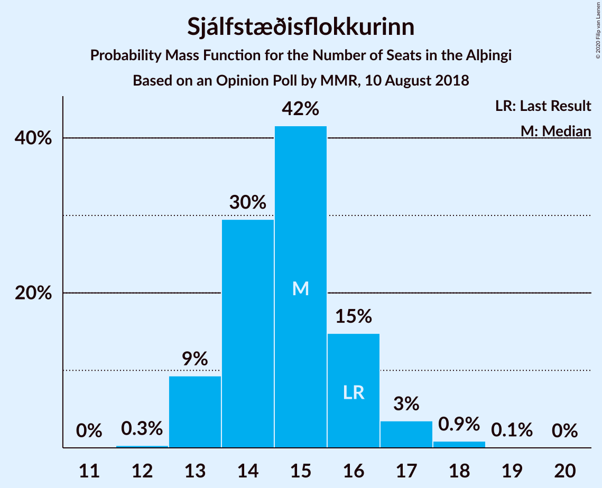
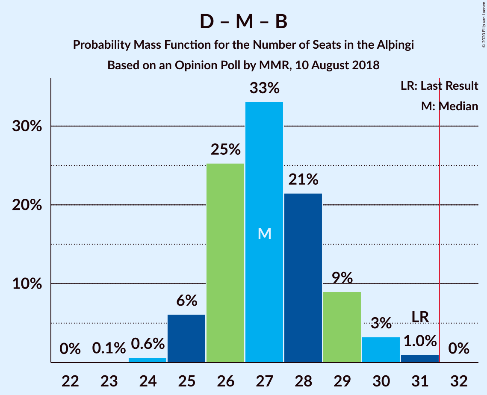
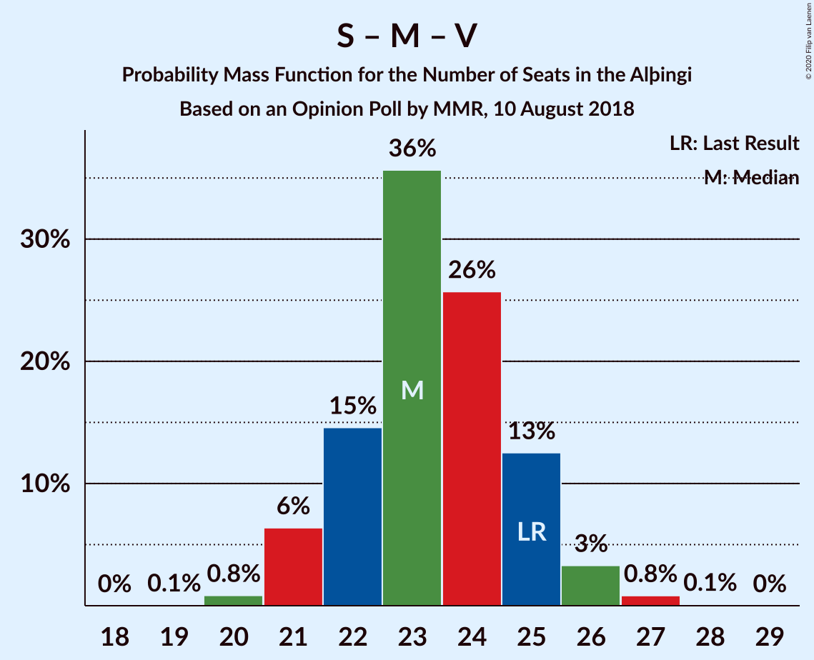
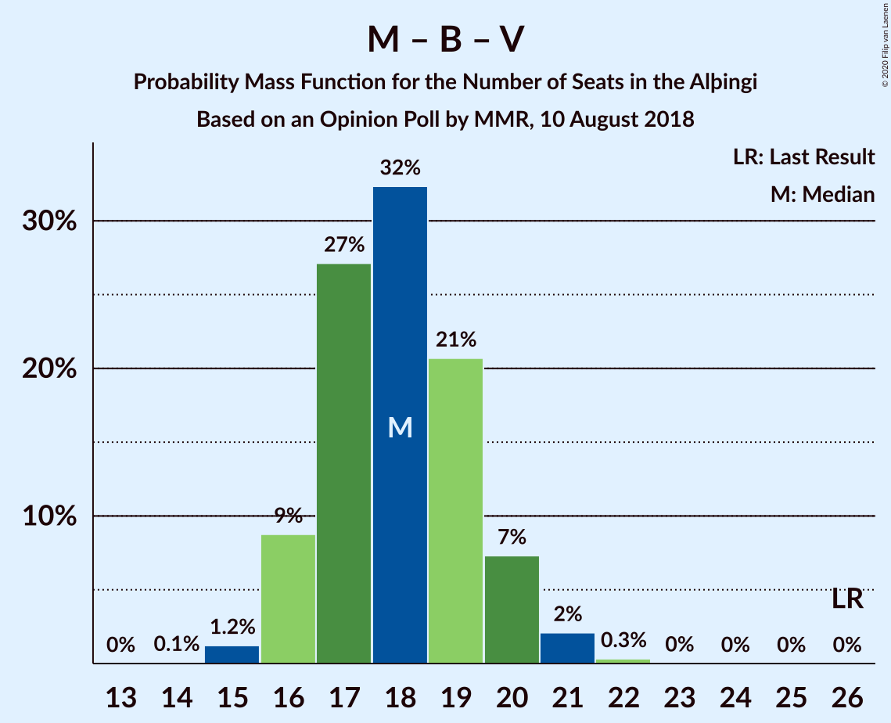

# Opinion Poll by MMR, 10 August 2018

<a href="#voting-intentions">Voting Intentions</a> | <a href="#seats">Seats</a> | <a href="#coalitions">Coalitions</a> | <a href="#technical-information">Technical Information</a>

## Voting Intentions

### Confidence Intervals

| Party | Last Result | Poll Result | 80% Confidence Interval | 90% Confidence Interval | 95% Confidence Interval | 99% Confidence Interval |
|:-----:|:-----------:|:-----------:|:-----------------------:|:-----------------------:|:-----------------------:|:-----------------------:|
| Sjálfstæðisflokkurinn | 25.2% | 22.1% | 20.4–23.9% |19.9–24.4% |19.5–24.9% |18.7–25.8% |
| Samfylkingin | 12.1% | 16.6% | 15.1–18.3% |14.7–18.7% |14.3–19.2% |13.6–20.0% |
| Píratar | 9.2% | 13.4% | 12.1–15.0% |11.7–15.4% |11.3–15.8% |10.7–16.6% |
| Miðflokkurinn | 10.9% | 10.3% | 9.1–11.7% |8.8–12.1% |8.5–12.5% |8.0–13.2% |
| Framsóknarflokkurinn | 10.7% | 8.9% | 7.8–10.2% |7.5–10.6% |7.2–10.9% |6.7–11.6% |
| Vinstrihreyfingin – grænt framboð | 16.9% | 8.8% | 7.7–10.1% |7.4–10.5% |7.1–10.8% |6.6–11.5% |
| Viðreisn | 6.7% | 8.7% | 7.6–10.0% |7.3–10.4% |7.0–10.7% |6.5–11.4% |
| Flokkur fólksins | 6.9% | 7.8% | 6.8–9.1% |6.5–9.4% |6.2–9.7% |5.8–10.4% |

*Note:* The poll result column reflects the actual value used in the calculations. Published results may vary slightly, and in addition be rounded to fewer digits.

## Seats

### Confidence Intervals

| Party | Last Result | Median | 80% Confidence Interval | 90% Confidence Interval | 95% Confidence Interval | 99% Confidence Interval |
|:-----:|:-----------:|:------:|:-----------------------:|:-----------------------:|:-----------------------:|:-----------------------:|
| <a href="#sjálfstæðisflokkurinn">Sjálfstæðisflokkurinn</a> | 16 | 15 | 13–16 |13–16 |13–17 |13–18 |
| <a href="#samfylkingin">Samfylkingin</a> | 7 | 11 | 10–12 |10–12 |9–13 |9–13 |
| <a href="#píratar">Píratar</a> | 6 | 9 | 8–10 |7–10 |7–10 |7–11 |
| <a href="#miðflokkurinn">Miðflokkurinn</a> | 7 | 7 | 6–8 |6–8 |5–9 |5–9 |
| <a href="#framsóknarflokkurinn">Framsóknarflokkurinn</a> | 8 | 6 | 5–6 |5–7 |4–7 |4–8 |
| <a href="#vinstrihreyfingin-–-grænt-framboð">Vinstrihreyfingin – grænt framboð</a> | 11 | 6 | 5–6 |5–6 |5–7 |4–7 |
| <a href="#viðreisn">Viðreisn</a> | 4 | 5 | 5–6 |5–6 |4–6 |4–7 |
| <a href="#flokkur-fólksins">Flokkur fólksins</a> | 4 | 5 | 4–6 |4–6 |4–6 |3–7 |

### Sjálfstæðisflokkurinn

*For a full overview of the results for this party, see the [Sjálfstæðisflokkurinn](party-sjálfstæðisflokkurinn.html) page.*

| Number of Seats | Probability | Accumulated | Special Marks |
|:---------------:|:-----------:|:-----------:|:-------------:|
| 12 | 0.2% | 100% |  |
| 13 | 11% | 99.8% |  |
| 14 | 24% | 89% |  |
| 15 | 49% | 65% | Median |
| 16 | 12% | 15% | Last Result |
| 17 | 2% | 3% |  |
| 18 | 0.8% | 0.9% |  |
| 19 | 0.1% | 0.1% |  |
| 20 | 0% | 0% |  |

### Samfylkingin

*For a full overview of the results for this party, see the [Samfylkingin](party-samfylkingin.html) page.*

| Number of Seats | Probability | Accumulated | Special Marks |
|:---------------:|:-----------:|:-----------:|:-------------:|
| 7 | 0% | 100% | Last Result |
| 8 | 0.2% | 100% |  |
| 9 | 3% | 99.8% |  |
| 10 | 14% | 96% |  |
| 11 | 37% | 82% | Median |
| 12 | 41% | 45% |  |
| 13 | 4% | 4% |  |
| 14 | 0.2% | 0.3% |  |
| 15 | 0% | 0% |  |

### Píratar

*For a full overview of the results for this party, see the [Píratar](party-píratar.html) page.*

| Number of Seats | Probability | Accumulated | Special Marks |
|:---------------:|:-----------:|:-----------:|:-------------:|
| 6 | 0.1% | 100% | Last Result |
| 7 | 5% | 99.9% |  |
| 8 | 26% | 95% |  |
| 9 | 46% | 68% | Median |
| 10 | 20% | 22% |  |
| 11 | 1.4% | 1.4% |  |
| 12 | 0% | 0% |  |

### Miðflokkurinn

*For a full overview of the results for this party, see the [Miðflokkurinn](party-miðflokkurinn.html) page.*

| Number of Seats | Probability | Accumulated | Special Marks |
|:---------------:|:-----------:|:-----------:|:-------------:|
| 5 | 5% | 100% |  |
| 6 | 36% | 95% |  |
| 7 | 49% | 59% | Last Result, Median |
| 8 | 6% | 10% |  |
| 9 | 4% | 4% |  |
| 10 | 0.3% | 0.3% |  |
| 11 | 0% | 0% |  |

### Framsóknarflokkurinn

*For a full overview of the results for this party, see the [Framsóknarflokkurinn](party-framsóknarflokkurinn.html) page.*

| Number of Seats | Probability | Accumulated | Special Marks |
|:---------------:|:-----------:|:-----------:|:-------------:|
| 4 | 3% | 100% |  |
| 5 | 44% | 97% |  |
| 6 | 47% | 53% | Median |
| 7 | 5% | 6% |  |
| 8 | 0.7% | 0.8% | Last Result |
| 9 | 0.1% | 0.1% |  |
| 10 | 0% | 0% |  |

### Vinstrihreyfingin – grænt framboð

*For a full overview of the results for this party, see the [Vinstrihreyfingin – grænt framboð](party-vinstrihreyfingin–græntframboð.html) page.*

| Number of Seats | Probability | Accumulated | Special Marks |
|:---------------:|:-----------:|:-----------:|:-------------:|
| 4 | 2% | 100% |  |
| 5 | 48% | 98% |  |
| 6 | 46% | 50% | Median |
| 7 | 4% | 4% |  |
| 8 | 0.1% | 0.1% |  |
| 9 | 0% | 0% |  |
| 10 | 0% | 0% |  |
| 11 | 0% | 0% | Last Result |

### Viðreisn

*For a full overview of the results for this party, see the [Viðreisn](party-viðreisn.html) page.*

| Number of Seats | Probability | Accumulated | Special Marks |
|:---------------:|:-----------:|:-----------:|:-------------:|
| 4 | 3% | 100% | Last Result |
| 5 | 52% | 97% | Median |
| 6 | 43% | 45% |  |
| 7 | 2% | 2% |  |
| 8 | 0.2% | 0.2% |  |
| 9 | 0% | 0% |  |

### Flokkur fólksins

*For a full overview of the results for this party, see the [Flokkur fólksins](party-flokkurfólksins.html) page.*

| Number of Seats | Probability | Accumulated | Special Marks |
|:---------------:|:-----------:|:-----------:|:-------------:|
| 3 | 0.5% | 100% |  |
| 4 | 20% | 99.4% | Last Result |
| 5 | 67% | 79% | Median |
| 6 | 12% | 13% |  |
| 7 | 0.6% | 0.6% |  |
| 8 | 0% | 0% |  |

## Coalitions

### Confidence Intervals

| Coalition | Last Result | Median | Majority? | 80% Confidence Interval | 90% Confidence Interval | 95% Confidence Interval | 99% Confidence Interval |
|:---------:|:-----------:|:------:|:---------:|:-----------------------:|:-----------------------:|:-----------------------:|:-----------------------:|
| Samfylkingin – Píratar – Vinstrihreyfingin – grænt framboð – Viðreisn | 28 | 31 | 41% | 30–33 | 29–33 | 28–33 | 27–34 |
| Samfylkingin – Miðflokkurinn – Framsóknarflokkurinn – Vinstrihreyfingin – grænt framboð | 33 | 29 | 2% | 28–30 | 27–31 | 27–31 | 25–33 |
| Sjálfstæðisflokkurinn – Miðflokkurinn – Framsóknarflokkurinn | 31 | 27 | 0% | 25–29 | 25–29 | 25–30 | 24–31 |
| Sjálfstæðisflokkurinn – Framsóknarflokkurinn – Vinstrihreyfingin – grænt framboð | 35 | 26 | 0% | 25–27 | 25–28 | 24–28 | 24–29 |
| Sjálfstæðisflokkurinn – Samfylkingin | 23 | 26 | 0% | 25–27 | 24–27 | 24–28 | 23–29 |
| Samfylkingin – Píratar – Vinstrihreyfingin – grænt framboð | 24 | 26 | 0% | 24–27 | 24–27 | 23–27 | 22–28 |
| Samfylkingin – Miðflokkurinn – Vinstrihreyfingin – grænt framboð | 25 | 24 | 0% | 22–24 | 22–25 | 21–26 | 20–27 |
| Samfylkingin – Framsóknarflokkurinn – Vinstrihreyfingin – grænt framboð | 26 | 22 | 0% | 21–24 | 21–24 | 20–24 | 19–25 |
| Sjálfstæðisflokkurinn – Miðflokkurinn | 23 | 22 | 0% | 20–23 | 19–23 | 19–24 | 19–25 |
| Sjálfstæðisflokkurinn – Framsóknarflokkurinn | 24 | 20 | 0% | 19–22 | 19–22 | 19–23 | 18–24 |
| Sjálfstæðisflokkurinn – Vinstrihreyfingin – grænt framboð | 27 | 20 | 0% | 19–22 | 19–22 | 19–22 | 18–24 |
| Sjálfstæðisflokkurinn – Viðreisn | 20 | 20 | 0% | 19–22 | 19–22 | 18–22 | 18–24 |
| Miðflokkurinn – Framsóknarflokkurinn – Vinstrihreyfingin – grænt framboð | 26 | 18 | 0% | 16–19 | 16–20 | 16–20 | 15–21 |
| Samfylkingin – Vinstrihreyfingin – grænt framboð | 18 | 17 | 0% | 16–18 | 15–18 | 15–19 | 14–19 |
| Píratar – Vinstrihreyfingin – grænt framboð | 17 | 14 | 0% | 13–16 | 13–16 | 13–16 | 12–17 |
| Miðflokkurinn – Vinstrihreyfingin – grænt framboð | 18 | 12 | 0% | 11–13 | 11–14 | 11–15 | 10–15 |
| Framsóknarflokkurinn – Vinstrihreyfingin – grænt framboð | 19 | 11 | 0% | 10–12 | 10–12 | 10–13 | 9–14 |

### Samfylkingin – Píratar – Vinstrihreyfingin – grænt framboð – Viðreisn

| Number of Seats | Probability | Accumulated | Special Marks |
|:---------------:|:-----------:|:-----------:|:-------------:|
| 27 | 0.8% | 100% |  |
| 28 | 2% | 99.2% | Last Result |
| 29 | 6% | 97% |  |
| 30 | 22% | 91% |  |
| 31 | 28% | 69% | Median |
| 32 | 31% | 41% | Majority |
| 33 | 10% | 10% |  |
| 34 | 0.5% | 0.6% |  |
| 35 | 0.1% | 0.1% |  |
| 36 | 0% | 0% |  |

### Samfylkingin – Miðflokkurinn – Framsóknarflokkurinn – Vinstrihreyfingin – grænt framboð

| Number of Seats | Probability | Accumulated | Special Marks |
|:---------------:|:-----------:|:-----------:|:-------------:|
| 25 | 1.0% | 100% |  |
| 26 | 0.7% | 99.0% |  |
| 27 | 5% | 98% |  |
| 28 | 22% | 93% |  |
| 29 | 38% | 71% |  |
| 30 | 26% | 32% | Median |
| 31 | 5% | 7% |  |
| 32 | 2% | 2% | Majority |
| 33 | 0.6% | 0.6% | Last Result |
| 34 | 0% | 0% |  |

### Sjálfstæðisflokkurinn – Miðflokkurinn – Framsóknarflokkurinn

| Number of Seats | Probability | Accumulated | Special Marks |
|:---------------:|:-----------:|:-----------:|:-------------:|
| 24 | 0.5% | 100% |  |
| 25 | 11% | 99.5% |  |
| 26 | 30% | 89% |  |
| 27 | 22% | 58% |  |
| 28 | 26% | 36% | Median |
| 29 | 8% | 10% |  |
| 30 | 2% | 3% |  |
| 31 | 0.9% | 0.9% | Last Result |
| 32 | 0% | 0% | Majority |

### Sjálfstæðisflokkurinn – Framsóknarflokkurinn – Vinstrihreyfingin – grænt framboð

| Number of Seats | Probability | Accumulated | Special Marks |
|:---------------:|:-----------:|:-----------:|:-------------:|
| 23 | 0.5% | 100% |  |
| 24 | 3% | 99.5% |  |
| 25 | 42% | 97% |  |
| 26 | 37% | 55% |  |
| 27 | 8% | 18% | Median |
| 28 | 7% | 10% |  |
| 29 | 2% | 2% |  |
| 30 | 0.1% | 0.1% |  |
| 31 | 0% | 0% |  |
| 32 | 0% | 0% | Majority |
| 33 | 0% | 0% |  |
| 34 | 0% | 0% |  |
| 35 | 0% | 0% | Last Result |

### Sjálfstæðisflokkurinn – Samfylkingin

| Number of Seats | Probability | Accumulated | Special Marks |
|:---------------:|:-----------:|:-----------:|:-------------:|
| 22 | 0.5% | 100% |  |
| 23 | 0.9% | 99.5% | Last Result |
| 24 | 7% | 98.6% |  |
| 25 | 28% | 92% |  |
| 26 | 23% | 64% | Median |
| 27 | 36% | 40% |  |
| 28 | 3% | 4% |  |
| 29 | 1.1% | 1.3% |  |
| 30 | 0.1% | 0.2% |  |
| 31 | 0% | 0% |  |

### Samfylkingin – Píratar – Vinstrihreyfingin – grænt framboð

| Number of Seats | Probability | Accumulated | Special Marks |
|:---------------:|:-----------:|:-----------:|:-------------:|
| 21 | 0.1% | 100% |  |
| 22 | 1.1% | 99.9% |  |
| 23 | 2% | 98.8% |  |
| 24 | 10% | 96% | Last Result |
| 25 | 32% | 87% |  |
| 26 | 29% | 55% | Median |
| 27 | 24% | 26% |  |
| 28 | 2% | 2% |  |
| 29 | 0.2% | 0.2% |  |
| 30 | 0% | 0% |  |

### Samfylkingin – Miðflokkurinn – Vinstrihreyfingin – grænt framboð

| Number of Seats | Probability | Accumulated | Special Marks |
|:---------------:|:-----------:|:-----------:|:-------------:|
| 20 | 1.4% | 100% |  |
| 21 | 2% | 98.6% |  |
| 22 | 9% | 96% |  |
| 23 | 36% | 87% |  |
| 24 | 41% | 51% | Median |
| 25 | 5% | 10% | Last Result |
| 26 | 4% | 4% |  |
| 27 | 0.8% | 0.8% |  |
| 28 | 0% | 0% |  |

### Samfylkingin – Framsóknarflokkurinn – Vinstrihreyfingin – grænt framboð

| Number of Seats | Probability | Accumulated | Special Marks |
|:---------------:|:-----------:|:-----------:|:-------------:|
| 18 | 0.1% | 100% |  |
| 19 | 0.8% | 99.9% |  |
| 20 | 4% | 99.1% |  |
| 21 | 9% | 96% |  |
| 22 | 51% | 86% |  |
| 23 | 19% | 35% | Median |
| 24 | 15% | 17% |  |
| 25 | 2% | 2% |  |
| 26 | 0.2% | 0.2% | Last Result |
| 27 | 0% | 0% |  |

### Sjálfstæðisflokkurinn – Miðflokkurinn

| Number of Seats | Probability | Accumulated | Special Marks |
|:---------------:|:-----------:|:-----------:|:-------------:|
| 18 | 0.2% | 100% |  |
| 19 | 9% | 99.8% |  |
| 20 | 10% | 91% |  |
| 21 | 27% | 81% |  |
| 22 | 43% | 54% | Median |
| 23 | 7% | 11% | Last Result |
| 24 | 3% | 4% |  |
| 25 | 1.1% | 1.2% |  |
| 26 | 0.1% | 0.1% |  |
| 27 | 0% | 0% |  |

### Sjálfstæðisflokkurinn – Framsóknarflokkurinn

| Number of Seats | Probability | Accumulated | Special Marks |
|:---------------:|:-----------:|:-----------:|:-------------:|
| 17 | 0.1% | 100% |  |
| 18 | 1.2% | 99.9% |  |
| 19 | 23% | 98.7% |  |
| 20 | 36% | 75% |  |
| 21 | 27% | 39% | Median |
| 22 | 9% | 12% |  |
| 23 | 3% | 3% |  |
| 24 | 0.6% | 0.6% | Last Result |
| 25 | 0% | 0% |  |

### Sjálfstæðisflokkurinn – Vinstrihreyfingin – grænt framboð

| Number of Seats | Probability | Accumulated | Special Marks |
|:---------------:|:-----------:|:-----------:|:-------------:|
| 17 | 0.1% | 100% |  |
| 18 | 1.3% | 99.9% |  |
| 19 | 15% | 98.6% |  |
| 20 | 55% | 83% |  |
| 21 | 16% | 29% | Median |
| 22 | 10% | 12% |  |
| 23 | 2% | 2% |  |
| 24 | 0.5% | 0.5% |  |
| 25 | 0% | 0% |  |
| 26 | 0% | 0% |  |
| 27 | 0% | 0% | Last Result |

### Sjálfstæðisflokkurinn – Viðreisn

| Number of Seats | Probability | Accumulated | Special Marks |
|:---------------:|:-----------:|:-----------:|:-------------:|
| 17 | 0.2% | 100% |  |
| 18 | 3% | 99.8% |  |
| 19 | 20% | 96% |  |
| 20 | 46% | 77% | Last Result, Median |
| 21 | 20% | 30% |  |
| 22 | 8% | 10% |  |
| 23 | 2% | 2% |  |
| 24 | 0.4% | 0.5% |  |
| 25 | 0.1% | 0.1% |  |
| 26 | 0% | 0% |  |

### Miðflokkurinn – Framsóknarflokkurinn – Vinstrihreyfingin – grænt framboð

| Number of Seats | Probability | Accumulated | Special Marks |
|:---------------:|:-----------:|:-----------:|:-------------:|
| 15 | 1.3% | 100% |  |
| 16 | 12% | 98.7% |  |
| 17 | 24% | 87% |  |
| 18 | 44% | 63% |  |
| 19 | 12% | 19% | Median |
| 20 | 5% | 7% |  |
| 21 | 2% | 2% |  |
| 22 | 0.2% | 0.3% |  |
| 23 | 0% | 0% |  |
| 24 | 0% | 0% |  |
| 25 | 0% | 0% |  |
| 26 | 0% | 0% | Last Result |

### Samfylkingin – Vinstrihreyfingin – grænt framboð

| Number of Seats | Probability | Accumulated | Special Marks |
|:---------------:|:-----------:|:-----------:|:-------------:|
| 13 | 0.1% | 100% |  |
| 14 | 2% | 99.9% |  |
| 15 | 6% | 98% |  |
| 16 | 26% | 92% |  |
| 17 | 45% | 66% | Median |
| 18 | 17% | 21% | Last Result |
| 19 | 3% | 4% |  |
| 20 | 0.1% | 0.2% |  |
| 21 | 0% | 0% |  |

### Píratar – Vinstrihreyfingin – grænt framboð

| Number of Seats | Probability | Accumulated | Special Marks |
|:---------------:|:-----------:|:-----------:|:-------------:|
| 11 | 0.2% | 100% |  |
| 12 | 2% | 99.8% |  |
| 13 | 17% | 98% |  |
| 14 | 36% | 82% |  |
| 15 | 34% | 46% | Median |
| 16 | 11% | 12% |  |
| 17 | 0.7% | 0.7% | Last Result |
| 18 | 0% | 0% |  |

### Miðflokkurinn – Vinstrihreyfingin – grænt framboð

| Number of Seats | Probability | Accumulated | Special Marks |
|:---------------:|:-----------:|:-----------:|:-------------:|
| 9 | 0.1% | 100% |  |
| 10 | 2% | 99.9% |  |
| 11 | 15% | 98% |  |
| 12 | 54% | 83% |  |
| 13 | 21% | 29% | Median |
| 14 | 4% | 7% |  |
| 15 | 3% | 3% |  |
| 16 | 0.4% | 0.4% |  |
| 17 | 0% | 0% |  |
| 18 | 0% | 0% | Last Result |

### Framsóknarflokkurinn – Vinstrihreyfingin – grænt framboð

| Number of Seats | Probability | Accumulated | Special Marks |
|:---------------:|:-----------:|:-----------:|:-------------:|
| 8 | 0.1% | 100% |  |
| 9 | 1.3% | 99.9% |  |
| 10 | 23% | 98.7% |  |
| 11 | 47% | 75% |  |
| 12 | 23% | 28% | Median |
| 13 | 4% | 5% |  |
| 14 | 0.8% | 0.9% |  |
| 15 | 0.1% | 0.1% |  |
| 16 | 0% | 0% |  |
| 17 | 0% | 0% |  |
| 18 | 0% | 0% |  |
| 19 | 0% | 0% | Last Result |

## Technical Information

### Opinion Poll

+ **Polling firm:** MMR
+ **Commissioner(s):** —
+ **Fieldwork period:** 10 August 2018

### Calculations

+ **Sample size:** 910
+ **Simulations done:** 131,072
+ **Error estimate:** 1.39%

