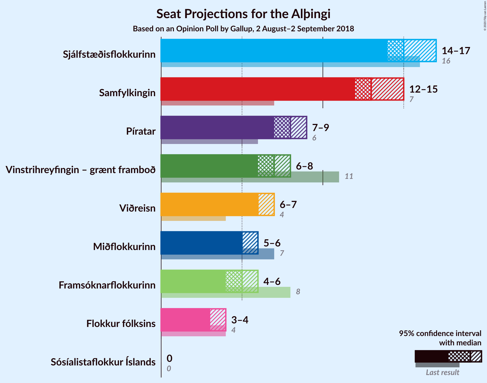
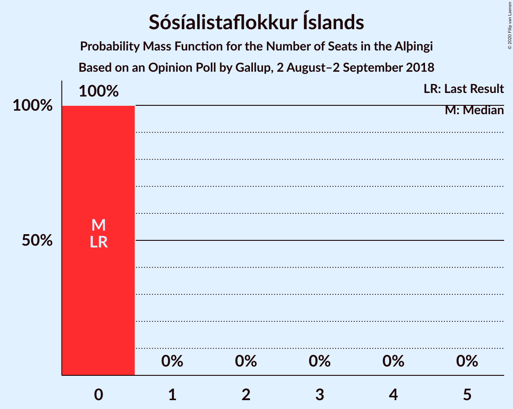

# Opinion Poll by Gallup, 2 August–2 September 2018

<a href="#voting-intentions">Voting Intentions</a> | <a href="#seats">Seats</a> | <a href="#coalitions">Coalitions</a> | <a href="#technical-information">Technical Information</a>

## Voting Intentions

### Confidence Intervals

| Party | Last Result | Poll Result | 80% Confidence Interval | 90% Confidence Interval | 95% Confidence Interval | 99% Confidence Interval |
|:-----:|:-----------:|:-----------:|:-----------------------:|:-----------------------:|:-----------------------:|:-----------------------:|
| Sjálfstæðisflokkurinn | 25.2% | 22.7% | 21.8–23.6% |21.6–23.9% |21.4–24.1% |21.0–24.5% |
| Samfylkingin | 12.1% | 19.3% | 18.5–20.1% |18.3–20.4% |18.1–20.6% |17.7–21.0% |
| Píratar | 9.2% | 12.5% | 11.8–13.2% |11.6–13.4% |11.5–13.6% |11.2–13.9% |
| Vinstrihreyfingin – grænt framboð | 16.9% | 11.7% | 11.1–12.4% |10.9–12.6% |10.7–12.8% |10.4–13.1% |
| Viðreisn | 6.7% | 10.1% | 9.5–10.8% |9.3–10.9% |9.2–11.1% |8.9–11.4% |
| Miðflokkurinn | 10.9% | 8.7% | 8.1–9.3% |8.0–9.5% |7.8–9.7% |7.6–10.0% |
| Framsóknarflokkurinn | 10.7% | 8.2% | 7.7–8.8% |7.5–9.0% |7.4–9.1% |7.1–9.4% |
| Flokkur fólksins | 6.9% | 5.7% | 5.2–6.2% |5.1–6.4% |5.0–6.5% |4.8–6.8% |
| Sósíalistaflokkur Íslands | 0.0% | 0.7% | 0.5–0.9% |0.5–1.0% |0.5–1.0% |0.4–1.1% |

*Note:* The poll result column reflects the actual value used in the calculations. Published results may vary slightly, and in addition be rounded to fewer digits.

## Seats

### Confidence Intervals

| Party | Last Result | Median | 80% Confidence Interval | 90% Confidence Interval | 95% Confidence Interval | 99% Confidence Interval |
|:-----:|:-----------:|:------:|:-----------------------:|:-----------------------:|:-----------------------:|:-----------------------:|
| <a href="#sjálfstæðisflokkurinn">Sjálfstæðisflokkurinn</a> | 16 | 14 | 14 |14 |14 |14–16 |
| <a href="#samfylkingin">Samfylkingin</a> | 7 | 14 | 12–14 |12–14 |12–14 |11–14 |
| <a href="#píratar">Píratar</a> | 6 | 7 | 7–8 |7–8 |7–8 |7–8 |
| <a href="#vinstrihreyfingin-–-grænt-framboð">Vinstrihreyfingin – grænt framboð</a> | 11 | 8 | 8 |8 |8 |8–9 |
| <a href="#viðreisn">Viðreisn</a> | 4 | 7 | 7 |7 |6–7 |6–7 |
| <a href="#miðflokkurinn">Miðflokkurinn</a> | 7 | 5 | 5 |5 |5 |5–6 |
| <a href="#framsóknarflokkurinn">Framsóknarflokkurinn</a> | 8 | 5 | 5 |4–5 |4–5 |4–5 |
| <a href="#flokkur-fólksins">Flokkur fólksins</a> | 4 | 3 | 3–4 |3–4 |3–4 |3–4 |
| <a href="#sósíalistaflokkur-íslands">Sósíalistaflokkur Íslands</a> | 0 | 0 | 0 |0 |0 |0 |

### Sjálfstæðisflokkurinn

*For a full overview of the results for this party, see the [Sjálfstæðisflokkurinn](party-sjálfstæðisflokkurinn.html) page.*

| Number of Seats | Probability | Accumulated | Special Marks |
|:---------------:|:-----------:|:-----------:|:-------------:|
| 14 | 99.2% | 100% | Median |
| 15 | 0.2% | 0.8% |  |
| 16 | 0.6% | 0.6% | Last Result |
| 17 | 0% | 0% |  |

### Samfylkingin

*For a full overview of the results for this party, see the [Samfylkingin](party-samfylkingin.html) page.*

| Number of Seats | Probability | Accumulated | Special Marks |
|:---------------:|:-----------:|:-----------:|:-------------:|
| 7 | 0% | 100% | Last Result |
| 8 | 0% | 100% |  |
| 9 | 0% | 100% |  |
| 10 | 0% | 100% |  |
| 11 | 0.6% | 100% |  |
| 12 | 19% | 99.4% |  |
| 13 | 10% | 80% |  |
| 14 | 71% | 71% | Median |
| 15 | 0% | 0% |  |

### Píratar

*For a full overview of the results for this party, see the [Píratar](party-píratar.html) page.*

| Number of Seats | Probability | Accumulated | Special Marks |
|:---------------:|:-----------:|:-----------:|:-------------:|
| 6 | 0% | 100% | Last Result |
| 7 | 71% | 100% | Median |
| 8 | 29% | 29% |  |
| 9 | 0% | 0% |  |

### Vinstrihreyfingin – grænt framboð

*For a full overview of the results for this party, see the [Vinstrihreyfingin – grænt framboð](party-vinstrihreyfingin–græntframboð.html) page.*

| Number of Seats | Probability | Accumulated | Special Marks |
|:---------------:|:-----------:|:-----------:|:-------------:|
| 7 | 0.2% | 100% |  |
| 8 | 99.2% | 99.8% | Median |
| 9 | 0.6% | 0.7% |  |
| 10 | 0% | 0% |  |
| 11 | 0% | 0% | Last Result |

### Viðreisn

*For a full overview of the results for this party, see the [Viðreisn](party-viðreisn.html) page.*

| Number of Seats | Probability | Accumulated | Special Marks |
|:---------------:|:-----------:|:-----------:|:-------------:|
| 4 | 0% | 100% | Last Result |
| 5 | 0% | 100% |  |
| 6 | 3% | 100% |  |
| 7 | 97% | 97% | Median |
| 8 | 0% | 0% |  |

### Miðflokkurinn

*For a full overview of the results for this party, see the [Miðflokkurinn](party-miðflokkurinn.html) page.*

| Number of Seats | Probability | Accumulated | Special Marks |
|:---------------:|:-----------:|:-----------:|:-------------:|
| 5 | 98% | 100% | Median |
| 6 | 2% | 2% |  |
| 7 | 0% | 0% | Last Result |

### Framsóknarflokkurinn

*For a full overview of the results for this party, see the [Framsóknarflokkurinn](party-framsóknarflokkurinn.html) page.*

| Number of Seats | Probability | Accumulated | Special Marks |
|:---------------:|:-----------:|:-----------:|:-------------:|
| 4 | 10% | 100% |  |
| 5 | 90% | 90% | Median |
| 6 | 0.1% | 0.1% |  |
| 7 | 0% | 0% |  |
| 8 | 0% | 0% | Last Result |

### Flokkur fólksins

*For a full overview of the results for this party, see the [Flokkur fólksins](party-flokkurfólksins.html) page.*

| Number of Seats | Probability | Accumulated | Special Marks |
|:---------------:|:-----------:|:-----------:|:-------------:|
| 3 | 70% | 100% | Median |
| 4 | 29% | 29% | Last Result |
| 5 | 0% | 0% |  |

### Sósíalistaflokkur Íslands

*For a full overview of the results for this party, see the [Sósíalistaflokkur Íslands](party-sósíalistaflokkuríslands.html) page.*

| Number of Seats | Probability | Accumulated | Special Marks |
|:---------------:|:-----------:|:-----------:|:-------------:|
| 0 | 100% | 100% | Last Result, Median |

## Coalitions

### Confidence Intervals

| Coalition | Last Result | Median | Majority? | 80% Confidence Interval | 90% Confidence Interval | 95% Confidence Interval | 99% Confidence Interval |
|:---------:|:-----------:|:------:|:---------:|:-----------------------:|:-----------------------:|:-----------------------:|:-----------------------:|
| Samfylkingin – Píratar – Vinstrihreyfingin – grænt framboð – Viðreisn | 28 | 36 | 100% | 35–36 | 35–36 | 35–36 | 34–36 |
| Samfylkingin – Vinstrihreyfingin – grænt framboð – Miðflokkurinn – Framsóknarflokkurinn | 33 | 32 | 71% | 30–32 | 30–32 | 30–32 | 30–32 |
| Samfylkingin – Píratar – Vinstrihreyfingin – grænt framboð | 24 | 29 | 0% | 28–29 | 28–29 | 28–29 | 27–29 |
| Sjálfstæðisflokkurinn – Samfylkingin | 23 | 28 | 0% | 26–28 | 26–28 | 26–28 | 26–28 |
| Sjálfstæðisflokkurinn – Vinstrihreyfingin – grænt framboð – Framsóknarflokkurinn | 35 | 27 | 0% | 27 | 26–27 | 26–27 | 26–30 |
| Samfylkingin – Vinstrihreyfingin – grænt framboð – Framsóknarflokkurinn | 26 | 27 | 0% | 25–27 | 25–27 | 25–27 | 25–27 |
| Samfylkingin – Vinstrihreyfingin – grænt framboð – Miðflokkurinn | 25 | 27 | 0% | 25–27 | 25–27 | 25–27 | 25–27 |
| Sjálfstæðisflokkurinn – Miðflokkurinn – Framsóknarflokkurinn | 31 | 24 | 0% | 24 | 23–24 | 23–25 | 23–26 |
| Sjálfstæðisflokkurinn – Vinstrihreyfingin – grænt framboð | 27 | 22 | 0% | 22 | 22 | 22 | 22–25 |
| Samfylkingin – Vinstrihreyfingin – grænt framboð | 18 | 22 | 0% | 20–22 | 20–22 | 20–22 | 20–22 |
| Sjálfstæðisflokkurinn – Viðreisn | 20 | 21 | 0% | 21 | 21 | 20–21 | 20–23 |
| Sjálfstæðisflokkurinn – Miðflokkurinn | 23 | 19 | 0% | 19 | 19 | 19–20 | 19–21 |
| Sjálfstæðisflokkurinn – Framsóknarflokkurinn | 24 | 19 | 0% | 19 | 18–19 | 18–19 | 18–21 |
| Vinstrihreyfingin – grænt framboð – Miðflokkurinn – Framsóknarflokkurinn | 26 | 18 | 0% | 18 | 17–18 | 17–19 | 17–19 |
| Píratar – Vinstrihreyfingin – grænt framboð | 17 | 15 | 0% | 15–16 | 15–16 | 15–16 | 15–16 |
| Vinstrihreyfingin – grænt framboð – Miðflokkurinn | 18 | 13 | 0% | 13 | 13 | 13–14 | 13–14 |
| Vinstrihreyfingin – grænt framboð – Framsóknarflokkurinn | 19 | 13 | 0% | 12–13 | 12–13 | 12–13 | 12–14 |

### Samfylkingin – Píratar – Vinstrihreyfingin – grænt framboð – Viðreisn

| Number of Seats | Probability | Accumulated | Special Marks |
|:---------------:|:-----------:|:-----------:|:-------------:|
| 28 | 0% | 100% | Last Result |
| 29 | 0% | 100% |  |
| 30 | 0% | 100% |  |
| 31 | 0% | 100% |  |
| 32 | 0% | 100% | Majority |
| 33 | 0.1% | 100% |  |
| 34 | 0.6% | 99.8% |  |
| 35 | 22% | 99.2% |  |
| 36 | 77% | 78% | Median |
| 37 | 0% | 0% |  |

### Samfylkingin – Vinstrihreyfingin – grænt framboð – Miðflokkurinn – Framsóknarflokkurinn

| Number of Seats | Probability | Accumulated | Special Marks |
|:---------------:|:-----------:|:-----------:|:-------------:|
| 30 | 27% | 100% |  |
| 31 | 2% | 73% |  |
| 32 | 71% | 71% | Median, Majority |
| 33 | 0% | 0.1% | Last Result |
| 34 | 0% | 0% |  |

### Samfylkingin – Píratar – Vinstrihreyfingin – grænt framboð

| Number of Seats | Probability | Accumulated | Special Marks |
|:---------------:|:-----------:|:-----------:|:-------------:|
| 24 | 0% | 100% | Last Result |
| 25 | 0% | 100% |  |
| 26 | 0.2% | 100% |  |
| 27 | 0.6% | 99.8% |  |
| 28 | 19% | 99.2% |  |
| 29 | 80% | 80% | Median |
| 30 | 0.1% | 0.1% |  |
| 31 | 0% | 0% |  |

### Sjálfstæðisflokkurinn – Samfylkingin

| Number of Seats | Probability | Accumulated | Special Marks |
|:---------------:|:-----------:|:-----------:|:-------------:|
| 23 | 0% | 100% | Last Result |
| 24 | 0% | 100% |  |
| 25 | 0% | 100% |  |
| 26 | 19% | 100% |  |
| 27 | 11% | 81% |  |
| 28 | 71% | 71% | Median |
| 29 | 0% | 0% |  |

### Sjálfstæðisflokkurinn – Vinstrihreyfingin – grænt framboð – Framsóknarflokkurinn

| Number of Seats | Probability | Accumulated | Special Marks |
|:---------------:|:-----------:|:-----------:|:-------------:|
| 26 | 10% | 100% |  |
| 27 | 89% | 90% | Median |
| 28 | 0% | 0.7% |  |
| 29 | 0.1% | 0.7% |  |
| 30 | 0.7% | 0.7% |  |
| 31 | 0% | 0% |  |
| 32 | 0% | 0% | Majority |
| 33 | 0% | 0% |  |
| 34 | 0% | 0% |  |
| 35 | 0% | 0% | Last Result |

### Samfylkingin – Vinstrihreyfingin – grænt framboð – Framsóknarflokkurinn

| Number of Seats | Probability | Accumulated | Special Marks |
|:---------------:|:-----------:|:-----------:|:-------------:|
| 24 | 0.2% | 100% |  |
| 25 | 29% | 99.8% |  |
| 26 | 0% | 71% | Last Result |
| 27 | 71% | 71% | Median |
| 28 | 0% | 0.1% |  |
| 29 | 0% | 0% |  |

### Samfylkingin – Vinstrihreyfingin – grænt framboð – Miðflokkurinn

| Number of Seats | Probability | Accumulated | Special Marks |
|:---------------:|:-----------:|:-----------:|:-------------:|
| 25 | 17% | 100% | Last Result |
| 26 | 12% | 83% |  |
| 27 | 71% | 71% | Median |
| 28 | 0% | 0.1% |  |
| 29 | 0% | 0% |  |

### Sjálfstæðisflokkurinn – Miðflokkurinn – Framsóknarflokkurinn

| Number of Seats | Probability | Accumulated | Special Marks |
|:---------------:|:-----------:|:-----------:|:-------------:|
| 23 | 10% | 100% |  |
| 24 | 87% | 90% | Median |
| 25 | 2% | 3% |  |
| 26 | 0.8% | 0.8% |  |
| 27 | 0% | 0% |  |
| 28 | 0% | 0% |  |
| 29 | 0% | 0% |  |
| 30 | 0% | 0% |  |
| 31 | 0% | 0% | Last Result |

### Sjálfstæðisflokkurinn – Vinstrihreyfingin – grænt framboð

| Number of Seats | Probability | Accumulated | Special Marks |
|:---------------:|:-----------:|:-----------:|:-------------:|
| 22 | 99.2% | 100% | Median |
| 23 | 0.1% | 0.7% |  |
| 24 | 0% | 0.7% |  |
| 25 | 0.6% | 0.6% |  |
| 26 | 0% | 0% |  |
| 27 | 0% | 0% | Last Result |

### Samfylkingin – Vinstrihreyfingin – grænt framboð

| Number of Seats | Probability | Accumulated | Special Marks |
|:---------------:|:-----------:|:-----------:|:-------------:|
| 18 | 0% | 100% | Last Result |
| 19 | 0.1% | 100% |  |
| 20 | 19% | 99.8% |  |
| 21 | 10% | 80% |  |
| 22 | 71% | 71% | Median |
| 23 | 0.1% | 0.1% |  |
| 24 | 0% | 0% |  |

### Sjálfstæðisflokkurinn – Viðreisn

| Number of Seats | Probability | Accumulated | Special Marks |
|:---------------:|:-----------:|:-----------:|:-------------:|
| 20 | 3% | 100% | Last Result |
| 21 | 96% | 97% | Median |
| 22 | 0.2% | 0.8% |  |
| 23 | 0.6% | 0.6% |  |
| 24 | 0% | 0% |  |

### Sjálfstæðisflokkurinn – Miðflokkurinn

| Number of Seats | Probability | Accumulated | Special Marks |
|:---------------:|:-----------:|:-----------:|:-------------:|
| 19 | 97% | 100% | Median |
| 20 | 2% | 3% |  |
| 21 | 0.8% | 0.8% |  |
| 22 | 0% | 0% |  |
| 23 | 0% | 0% | Last Result |

### Sjálfstæðisflokkurinn – Framsóknarflokkurinn

| Number of Seats | Probability | Accumulated | Special Marks |
|:---------------:|:-----------:|:-----------:|:-------------:|
| 18 | 10% | 100% |  |
| 19 | 89% | 90% | Median |
| 20 | 0.2% | 0.9% |  |
| 21 | 0.6% | 0.6% |  |
| 22 | 0% | 0% |  |
| 23 | 0% | 0% |  |
| 24 | 0% | 0% | Last Result |

### Vinstrihreyfingin – grænt framboð – Miðflokkurinn – Framsóknarflokkurinn

| Number of Seats | Probability | Accumulated | Special Marks |
|:---------------:|:-----------:|:-----------:|:-------------:|
| 17 | 10% | 100% |  |
| 18 | 87% | 90% | Median |
| 19 | 3% | 3% |  |
| 20 | 0% | 0.1% |  |
| 21 | 0.1% | 0.1% |  |
| 22 | 0% | 0% |  |
| 23 | 0% | 0% |  |
| 24 | 0% | 0% |  |
| 25 | 0% | 0% |  |
| 26 | 0% | 0% | Last Result |

### Píratar – Vinstrihreyfingin – grænt framboð

| Number of Seats | Probability | Accumulated | Special Marks |
|:---------------:|:-----------:|:-----------:|:-------------:|
| 14 | 0.2% | 100% |  |
| 15 | 71% | 99.8% | Median |
| 16 | 29% | 29% |  |
| 17 | 0% | 0% | Last Result |

### Vinstrihreyfingin – grænt framboð – Miðflokkurinn

| Number of Seats | Probability | Accumulated | Special Marks |
|:---------------:|:-----------:|:-----------:|:-------------:|
| 13 | 97% | 100% | Median |
| 14 | 3% | 3% |  |
| 15 | 0.1% | 0.1% |  |
| 16 | 0% | 0% |  |
| 17 | 0% | 0% |  |
| 18 | 0% | 0% | Last Result |

### Vinstrihreyfingin – grænt framboð – Framsóknarflokkurinn

| Number of Seats | Probability | Accumulated | Special Marks |
|:---------------:|:-----------:|:-----------:|:-------------:|
| 12 | 10% | 100% |  |
| 13 | 89% | 90% | Median |
| 14 | 0.6% | 0.7% |  |
| 15 | 0.1% | 0.1% |  |
| 16 | 0% | 0% |  |
| 17 | 0% | 0% |  |
| 18 | 0% | 0% |  |
| 19 | 0% | 0% | Last Result |

## Technical Information

### Opinion Poll

+ **Polling firm:** Gallup
+ **Commissioner(s):** —
+ **Fieldwork period:** 2 August–2 September 2018

### Calculations

+ **Sample size:** 3731
+ **Simulations done:** 1,024
+ **Error estimate:** 1.88%

