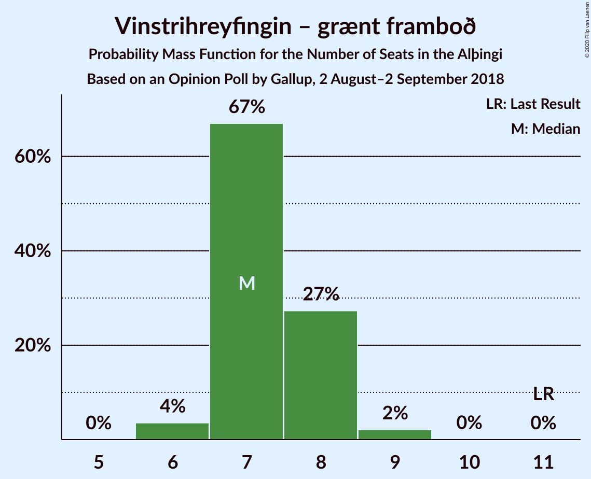
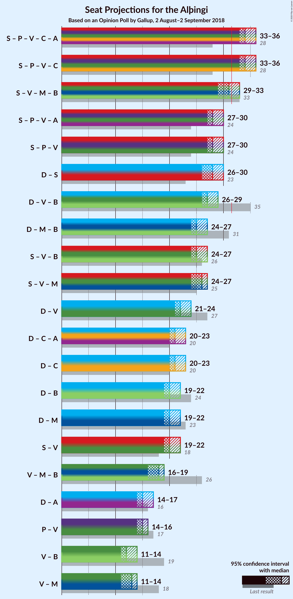

# Opinion Poll by Gallup, 2 August–2 September 2018

<a href="#voting-intentions">Voting Intentions</a> | <a href="#seats">Seats</a> | <a href="#coalitions">Coalitions</a> | <a href="#technical-information">Technical Information</a>

## Voting Intentions

### Confidence Intervals

| Party | Last Result | Poll Result | 80% Confidence Interval | 90% Confidence Interval | 95% Confidence Interval | 99% Confidence Interval |
|:-----:|:-----------:|:-----------:|:-----------------------:|:-----------------------:|:-----------------------:|:-----------------------:|
| Sjálfstæðisflokkurinn | 25.2% | 22.7% | 21.8–23.6% |21.6–23.9% |21.4–24.1% |21.0–24.5% |
| Samfylkingin | 12.1% | 19.3% | 18.5–20.1% |18.3–20.4% |18.1–20.6% |17.7–21.0% |
| Píratar | 9.2% | 12.5% | 11.8–13.2% |11.6–13.4% |11.5–13.6% |11.2–13.9% |
| Vinstrihreyfingin – grænt framboð | 16.9% | 11.7% | 11.1–12.4% |10.9–12.6% |10.7–12.8% |10.4–13.1% |
| Viðreisn | 6.7% | 10.1% | 9.5–10.8% |9.3–10.9% |9.2–11.1% |8.9–11.4% |
| Miðflokkurinn | 10.9% | 8.7% | 8.1–9.3% |8.0–9.5% |7.8–9.7% |7.6–10.0% |
| Framsóknarflokkurinn | 10.7% | 8.2% | 7.7–8.8% |7.5–9.0% |7.4–9.1% |7.1–9.4% |
| Flokkur fólksins | 6.9% | 5.7% | 5.2–6.2% |5.1–6.4% |5.0–6.5% |4.8–6.8% |

*Note:* The poll result column reflects the actual value used in the calculations. Published results may vary slightly, and in addition be rounded to fewer digits.

## Seats

### Confidence Intervals

| Party | Last Result | Median | 80% Confidence Interval | 90% Confidence Interval | 95% Confidence Interval | 99% Confidence Interval |
|:-----:|:-----------:|:------:|:-----------------------:|:-----------------------:|:-----------------------:|:-----------------------:|
| <a href="#sjálfstæðisflokkurinn">Sjálfstæðisflokkurinn</a> | 16 | 15 | 14–16 |14–16 |14–17 |14–17 |
| <a href="#samfylkingin">Samfylkingin</a> | 7 | 13 | 12–15 |12–15 |12–15 |11–15 |
| <a href="#píratar">Píratar</a> | 6 | 8 | 7–8 |7–8 |7–9 |7–9 |
| <a href="#vinstrihreyfingin-–-grænt-framboð">Vinstrihreyfingin – grænt framboð</a> | 11 | 7 | 7–8 |7–9 |6–9 |6–9 |
| <a href="#viðreisn">Viðreisn</a> | 4 | 6 | 6–7 |6–7 |6–7 |5–7 |
| <a href="#miðflokkurinn">Miðflokkurinn</a> | 7 | 5 | 5–6 |5–6 |5–6 |4–6 |
| <a href="#framsóknarflokkurinn">Framsóknarflokkurinn</a> | 8 | 5 | 5–6 |4–6 |4–6 |4–6 |
| <a href="#flokkur-fólksins">Flokkur fólksins</a> | 4 | 3 | 3–4 |3–4 |3–4 |0–4 |

### Sjálfstæðisflokkurinn

*For a full overview of the results for this party, see the [Sjálfstæðisflokkurinn](party-sjálfstæðisflokkurinn.html) page.*

| Number of Seats | Probability | Accumulated | Special Marks |
|:---------------:|:-----------:|:-----------:|:-------------:|
| 13 | 0.4% | 100% |  |
| 14 | 37% | 99.6% |  |
| 15 | 51% | 63% | Median |
| 16 | 9% | 11% | Last Result |
| 17 | 3% | 3% |  |
| 18 | 0.3% | 0.3% |  |
| 19 | 0% | 0% |  |

### Samfylkingin

*For a full overview of the results for this party, see the [Samfylkingin](party-samfylkingin.html) page.*

| Number of Seats | Probability | Accumulated | Special Marks |
|:---------------:|:-----------:|:-----------:|:-------------:|
| 7 | 0% | 100% | Last Result |
| 8 | 0% | 100% |  |
| 9 | 0% | 100% |  |
| 10 | 0% | 100% |  |
| 11 | 2% | 100% |  |
| 12 | 15% | 98% |  |
| 13 | 42% | 83% | Median |
| 14 | 29% | 41% |  |
| 15 | 12% | 12% |  |
| 16 | 0% | 0% |  |

### Píratar

*For a full overview of the results for this party, see the [Píratar](party-píratar.html) page.*

| Number of Seats | Probability | Accumulated | Special Marks |
|:---------------:|:-----------:|:-----------:|:-------------:|
| 6 | 0% | 100% | Last Result |
| 7 | 27% | 100% |  |
| 8 | 69% | 73% | Median |
| 9 | 4% | 4% |  |
| 10 | 0% | 0% |  |

### Vinstrihreyfingin – grænt framboð

*For a full overview of the results for this party, see the [Vinstrihreyfingin – grænt framboð](party-vinstrihreyfingin–græntframboð.html) page.*

| Number of Seats | Probability | Accumulated | Special Marks |
|:---------------:|:-----------:|:-----------:|:-------------:|
| 6 | 3% | 100% |  |
| 7 | 60% | 97% | Median |
| 8 | 31% | 37% |  |
| 9 | 6% | 6% |  |
| 10 | 0% | 0% |  |
| 11 | 0% | 0% | Last Result |

### Viðreisn

*For a full overview of the results for this party, see the [Viðreisn](party-viðreisn.html) page.*

| Number of Seats | Probability | Accumulated | Special Marks |
|:---------------:|:-----------:|:-----------:|:-------------:|
| 4 | 0% | 100% | Last Result |
| 5 | 2% | 100% |  |
| 6 | 88% | 98% | Median |
| 7 | 10% | 11% |  |
| 8 | 0.4% | 0.4% |  |
| 9 | 0% | 0% |  |

### Miðflokkurinn

*For a full overview of the results for this party, see the [Miðflokkurinn](party-miðflokkurinn.html) page.*

| Number of Seats | Probability | Accumulated | Special Marks |
|:---------------:|:-----------:|:-----------:|:-------------:|
| 4 | 0.6% | 100% |  |
| 5 | 64% | 99.4% | Median |
| 6 | 35% | 35% |  |
| 7 | 0% | 0% | Last Result |

### Framsóknarflokkurinn

*For a full overview of the results for this party, see the [Framsóknarflokkurinn](party-framsóknarflokkurinn.html) page.*

| Number of Seats | Probability | Accumulated | Special Marks |
|:---------------:|:-----------:|:-----------:|:-------------:|
| 4 | 7% | 100% |  |
| 5 | 81% | 93% | Median |
| 6 | 12% | 12% |  |
| 7 | 0% | 0% |  |
| 8 | 0% | 0% | Last Result |

### Flokkur fólksins

*For a full overview of the results for this party, see the [Flokkur fólksins](party-flokkurfólksins.html) page.*

| Number of Seats | Probability | Accumulated | Special Marks |
|:---------------:|:-----------:|:-----------:|:-------------:|
| 0 | 1.1% | 100% |  |
| 1 | 0% | 98.9% |  |
| 2 | 0% | 98.9% |  |
| 3 | 72% | 98.9% | Median |
| 4 | 27% | 27% | Last Result |
| 5 | 0% | 0% |  |

## Coalitions

### Confidence Intervals

| Coalition | Last Result | Median | Majority? | 80% Confidence Interval | 90% Confidence Interval | 95% Confidence Interval | 99% Confidence Interval |
|:---------:|:-----------:|:------:|:---------:|:-----------------------:|:-----------------------:|:-----------------------:|:-----------------------:|
| Samfylkingin – Píratar – Vinstrihreyfingin – grænt framboð – Viðreisn | 28 | 35 | 100% | 34–36 | 33–36 | 33–36 | 32–37 |
| Samfylkingin – Vinstrihreyfingin – grænt framboð – Miðflokkurinn – Framsóknarflokkurinn | 33 | 31 | 40% | 30–32 | 30–32 | 29–33 | 29–33 |
| Samfylkingin – Píratar – Vinstrihreyfingin – grænt framboð | 24 | 28 | 0% | 28–30 | 27–30 | 27–30 | 26–30 |
| Sjálfstæðisflokkurinn – Samfylkingin | 23 | 28 | 0.1% | 27–30 | 26–30 | 26–30 | 26–30 |
| Sjálfstæðisflokkurinn – Vinstrihreyfingin – grænt framboð – Framsóknarflokkurinn | 35 | 27 | 0% | 26–28 | 26–29 | 26–29 | 25–29 |
| Samfylkingin – Vinstrihreyfingin – grænt framboð – Miðflokkurinn | 25 | 26 | 0% | 25–27 | 25–27 | 24–28 | 24–28 |
| Sjálfstæðisflokkurinn – Miðflokkurinn – Framsóknarflokkurinn | 31 | 25 | 0% | 24–26 | 24–26 | 24–27 | 23–28 |
| Samfylkingin – Vinstrihreyfingin – grænt framboð – Framsóknarflokkurinn | 26 | 26 | 0% | 24–27 | 24–27 | 24–27 | 23–27 |
| Sjálfstæðisflokkurinn – Vinstrihreyfingin – grænt framboð | 27 | 22 | 0% | 21–23 | 21–24 | 21–24 | 21–25 |
| Sjálfstæðisflokkurinn – Viðreisn | 20 | 21 | 0% | 20–22 | 20–22 | 20–23 | 20–23 |
| Sjálfstæðisflokkurinn – Miðflokkurinn | 23 | 20 | 0% | 19–21 | 19–22 | 19–22 | 19–23 |
| Samfylkingin – Vinstrihreyfingin – grænt framboð | 18 | 21 | 0% | 20–22 | 19–22 | 19–22 | 18–22 |
| Sjálfstæðisflokkurinn – Framsóknarflokkurinn | 24 | 20 | 0% | 19–21 | 19–21 | 19–21 | 18–22 |
| Vinstrihreyfingin – grænt framboð – Miðflokkurinn – Framsóknarflokkurinn | 26 | 18 | 0% | 17–19 | 16–19 | 16–19 | 16–20 |
| Píratar – Vinstrihreyfingin – grænt framboð | 17 | 15 | 0% | 14–16 | 14–16 | 14–16 | 13–17 |
| Vinstrihreyfingin – grænt framboð – Miðflokkurinn | 18 | 13 | 0% | 12–14 | 12–14 | 12–14 | 11–14 |
| Vinstrihreyfingin – grænt framboð – Framsóknarflokkurinn | 19 | 12 | 0% | 12–13 | 11–14 | 11–14 | 11–14 |

### Samfylkingin – Píratar – Vinstrihreyfingin – grænt framboð – Viðreisn

| Number of Seats | Probability | Accumulated | Special Marks |
|:---------------:|:-----------:|:-----------:|:-------------:|
| 28 | 0% | 100% | Last Result |
| 29 | 0% | 100% |  |
| 30 | 0% | 100% |  |
| 31 | 0% | 100% |  |
| 32 | 0.6% | 100% | Majority |
| 33 | 6% | 99.4% |  |
| 34 | 42% | 93% | Median |
| 35 | 37% | 51% |  |
| 36 | 13% | 15% |  |
| 37 | 1.0% | 1.1% |  |
| 38 | 0.1% | 0.1% |  |
| 39 | 0% | 0% |  |

### Samfylkingin – Vinstrihreyfingin – grænt framboð – Miðflokkurinn – Framsóknarflokkurinn

| Number of Seats | Probability | Accumulated | Special Marks |
|:---------------:|:-----------:|:-----------:|:-------------:|
| 28 | 0.4% | 100% |  |
| 29 | 4% | 99.5% |  |
| 30 | 19% | 95% | Median |
| 31 | 36% | 76% |  |
| 32 | 36% | 40% | Majority |
| 33 | 3% | 3% | Last Result |
| 34 | 0.1% | 0.1% |  |
| 35 | 0% | 0% |  |

### Samfylkingin – Píratar – Vinstrihreyfingin – grænt framboð

| Number of Seats | Probability | Accumulated | Special Marks |
|:---------------:|:-----------:|:-----------:|:-------------:|
| 24 | 0% | 100% | Last Result |
| 25 | 0% | 100% |  |
| 26 | 2% | 100% |  |
| 27 | 7% | 98% |  |
| 28 | 41% | 91% | Median |
| 29 | 37% | 49% |  |
| 30 | 12% | 13% |  |
| 31 | 0.3% | 0.3% |  |
| 32 | 0% | 0% | Majority |

### Sjálfstæðisflokkurinn – Samfylkingin

| Number of Seats | Probability | Accumulated | Special Marks |
|:---------------:|:-----------:|:-----------:|:-------------:|
| 23 | 0% | 100% | Last Result |
| 24 | 0% | 100% |  |
| 25 | 0% | 100% |  |
| 26 | 5% | 100% |  |
| 27 | 16% | 95% |  |
| 28 | 55% | 78% | Median |
| 29 | 10% | 24% |  |
| 30 | 13% | 14% |  |
| 31 | 0.2% | 0.3% |  |
| 32 | 0.1% | 0.1% | Majority |
| 33 | 0% | 0% |  |

### Sjálfstæðisflokkurinn – Vinstrihreyfingin – grænt framboð – Framsóknarflokkurinn

| Number of Seats | Probability | Accumulated | Special Marks |
|:---------------:|:-----------:|:-----------:|:-------------:|
| 24 | 0.1% | 100% |  |
| 25 | 1.2% | 99.9% |  |
| 26 | 10% | 98.7% |  |
| 27 | 63% | 88% | Median |
| 28 | 17% | 26% |  |
| 29 | 8% | 9% |  |
| 30 | 0.5% | 0.5% |  |
| 31 | 0% | 0% |  |
| 32 | 0% | 0% | Majority |
| 33 | 0% | 0% |  |
| 34 | 0% | 0% |  |
| 35 | 0% | 0% | Last Result |

### Samfylkingin – Vinstrihreyfingin – grænt framboð – Miðflokkurinn

| Number of Seats | Probability | Accumulated | Special Marks |
|:---------------:|:-----------:|:-----------:|:-------------:|
| 23 | 0.3% | 100% |  |
| 24 | 4% | 99.7% |  |
| 25 | 19% | 96% | Last Result, Median |
| 26 | 44% | 77% |  |
| 27 | 30% | 33% |  |
| 28 | 3% | 3% |  |
| 29 | 0.1% | 0.1% |  |
| 30 | 0% | 0% |  |

### Sjálfstæðisflokkurinn – Miðflokkurinn – Framsóknarflokkurinn

| Number of Seats | Probability | Accumulated | Special Marks |
|:---------------:|:-----------:|:-----------:|:-------------:|
| 23 | 0.8% | 100% |  |
| 24 | 22% | 99.1% |  |
| 25 | 41% | 77% | Median |
| 26 | 32% | 36% |  |
| 27 | 3% | 4% |  |
| 28 | 0.7% | 0.7% |  |
| 29 | 0% | 0% |  |
| 30 | 0% | 0% |  |
| 31 | 0% | 0% | Last Result |

### Samfylkingin – Vinstrihreyfingin – grænt framboð – Framsóknarflokkurinn

| Number of Seats | Probability | Accumulated | Special Marks |
|:---------------:|:-----------:|:-----------:|:-------------:|
| 22 | 0.1% | 100% |  |
| 23 | 0.8% | 99.9% |  |
| 24 | 10% | 99.1% |  |
| 25 | 31% | 89% | Median |
| 26 | 25% | 58% | Last Result |
| 27 | 33% | 33% |  |
| 28 | 0.2% | 0.2% |  |
| 29 | 0% | 0% |  |

### Sjálfstæðisflokkurinn – Vinstrihreyfingin – grænt framboð

| Number of Seats | Probability | Accumulated | Special Marks |
|:---------------:|:-----------:|:-----------:|:-------------:|
| 19 | 0.1% | 100% |  |
| 20 | 0.2% | 99.9% |  |
| 21 | 17% | 99.7% |  |
| 22 | 58% | 82% | Median |
| 23 | 15% | 25% |  |
| 24 | 8% | 9% |  |
| 25 | 1.0% | 1.0% |  |
| 26 | 0% | 0% |  |
| 27 | 0% | 0% | Last Result |

### Sjálfstæðisflokkurinn – Viðreisn

| Number of Seats | Probability | Accumulated | Special Marks |
|:---------------:|:-----------:|:-----------:|:-------------:|
| 19 | 0.3% | 100% |  |
| 20 | 35% | 99.7% | Last Result |
| 21 | 48% | 65% | Median |
| 22 | 13% | 17% |  |
| 23 | 4% | 4% |  |
| 24 | 0.4% | 0.4% |  |
| 25 | 0% | 0% |  |

### Sjálfstæðisflokkurinn – Miðflokkurinn

| Number of Seats | Probability | Accumulated | Special Marks |
|:---------------:|:-----------:|:-----------:|:-------------:|
| 18 | 0.2% | 100% |  |
| 19 | 28% | 99.8% |  |
| 20 | 38% | 72% | Median |
| 21 | 28% | 33% |  |
| 22 | 5% | 6% |  |
| 23 | 0.6% | 0.6% | Last Result |
| 24 | 0% | 0% |  |

### Samfylkingin – Vinstrihreyfingin – grænt framboð

| Number of Seats | Probability | Accumulated | Special Marks |
|:---------------:|:-----------:|:-----------:|:-------------:|
| 18 | 0.7% | 100% | Last Result |
| 19 | 9% | 99.3% |  |
| 20 | 33% | 91% | Median |
| 21 | 31% | 57% |  |
| 22 | 26% | 26% |  |
| 23 | 0.2% | 0.2% |  |
| 24 | 0% | 0% |  |

### Sjálfstæðisflokkurinn – Framsóknarflokkurinn

| Number of Seats | Probability | Accumulated | Special Marks |
|:---------------:|:-----------:|:-----------:|:-------------:|
| 18 | 2% | 100% |  |
| 19 | 30% | 98% |  |
| 20 | 55% | 68% | Median |
| 21 | 12% | 13% |  |
| 22 | 1.3% | 1.5% |  |
| 23 | 0.2% | 0.2% |  |
| 24 | 0% | 0% | Last Result |

### Vinstrihreyfingin – grænt framboð – Miðflokkurinn – Framsóknarflokkurinn

| Number of Seats | Probability | Accumulated | Special Marks |
|:---------------:|:-----------:|:-----------:|:-------------:|
| 15 | 0.1% | 100% |  |
| 16 | 5% | 99.9% |  |
| 17 | 27% | 95% | Median |
| 18 | 52% | 68% |  |
| 19 | 15% | 16% |  |
| 20 | 0.9% | 1.0% |  |
| 21 | 0% | 0% |  |
| 22 | 0% | 0% |  |
| 23 | 0% | 0% |  |
| 24 | 0% | 0% |  |
| 25 | 0% | 0% |  |
| 26 | 0% | 0% | Last Result |

### Píratar – Vinstrihreyfingin – grænt framboð

| Number of Seats | Probability | Accumulated | Special Marks |
|:---------------:|:-----------:|:-----------:|:-------------:|
| 13 | 2% | 100% |  |
| 14 | 15% | 98% |  |
| 15 | 50% | 83% | Median |
| 16 | 31% | 34% |  |
| 17 | 2% | 2% | Last Result |
| 18 | 0.1% | 0.1% |  |
| 19 | 0% | 0% |  |

### Vinstrihreyfingin – grænt framboð – Miðflokkurinn

| Number of Seats | Probability | Accumulated | Special Marks |
|:---------------:|:-----------:|:-----------:|:-------------:|
| 11 | 2% | 100% |  |
| 12 | 38% | 98% | Median |
| 13 | 44% | 60% |  |
| 14 | 16% | 16% |  |
| 15 | 0.5% | 0.5% |  |
| 16 | 0% | 0% |  |
| 17 | 0% | 0% |  |
| 18 | 0% | 0% | Last Result |

### Vinstrihreyfingin – grænt framboð – Framsóknarflokkurinn

| Number of Seats | Probability | Accumulated | Special Marks |
|:---------------:|:-----------:|:-----------:|:-------------:|
| 10 | 0.1% | 100% |  |
| 11 | 8% | 99.9% |  |
| 12 | 46% | 92% | Median |
| 13 | 39% | 46% |  |
| 14 | 7% | 7% |  |
| 15 | 0.1% | 0.1% |  |
| 16 | 0% | 0% |  |
| 17 | 0% | 0% |  |
| 18 | 0% | 0% |  |
| 19 | 0% | 0% | Last Result |

## Technical Information

### Opinion Poll

+ **Polling firm:** Gallup
+ **Commissioner(s):** —
+ **Fieldwork period:** 2 August–2 September 2018

### Calculations

+ **Sample size:** 3731
+ **Simulations done:** 131,072
+ **Error estimate:** 1.27%

