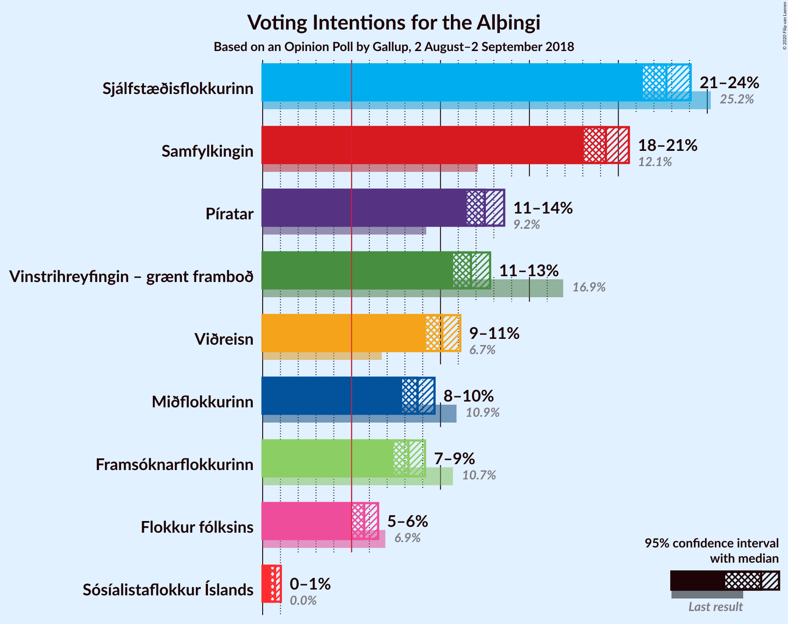
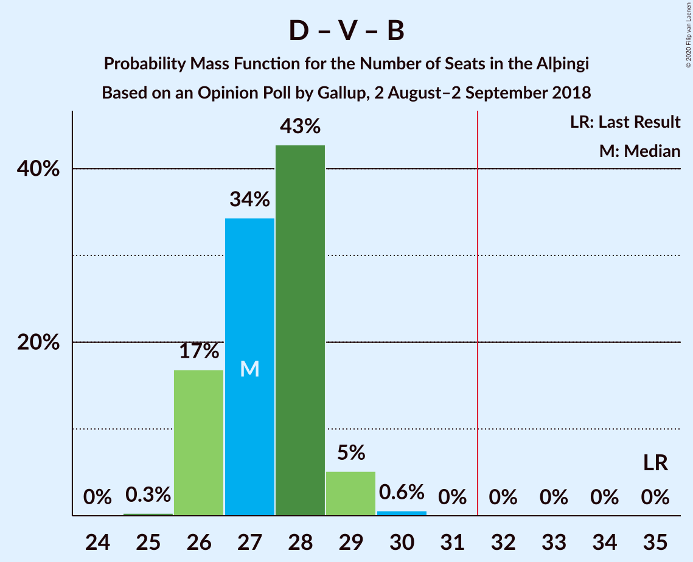
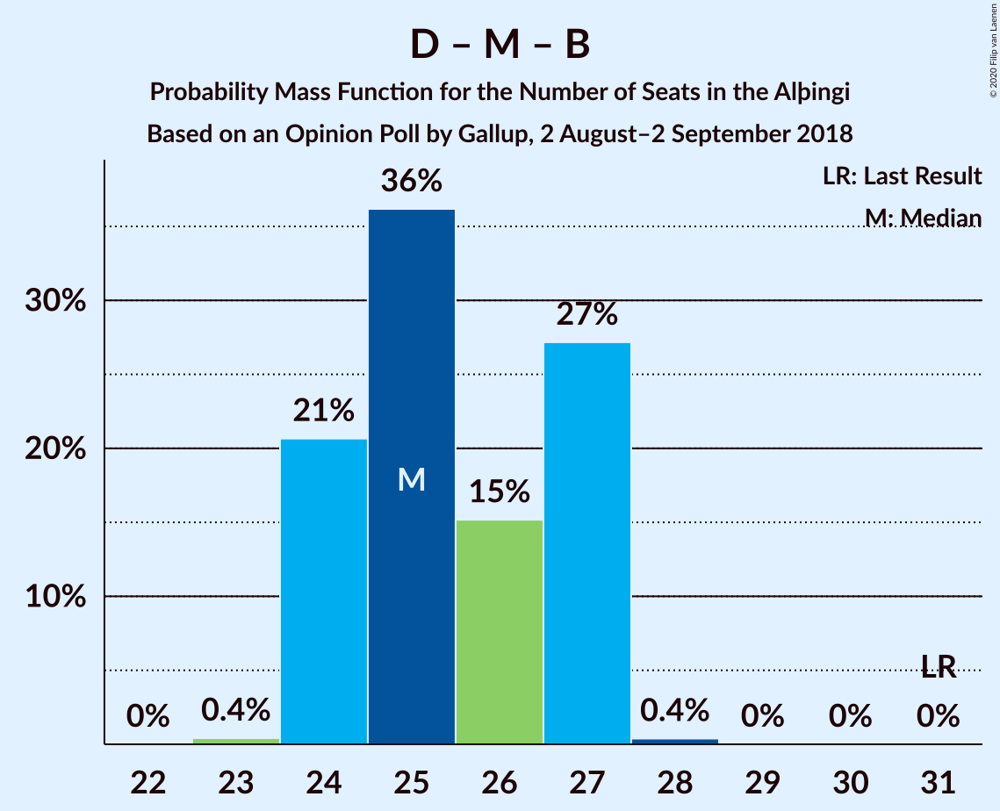
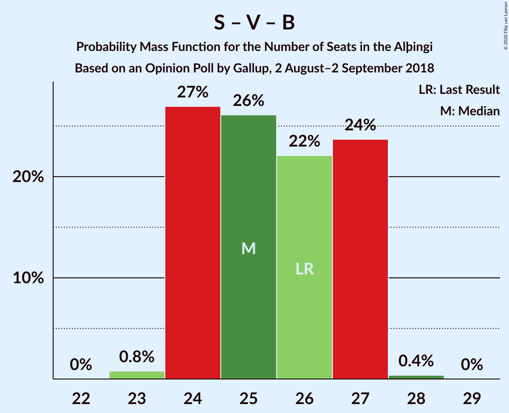
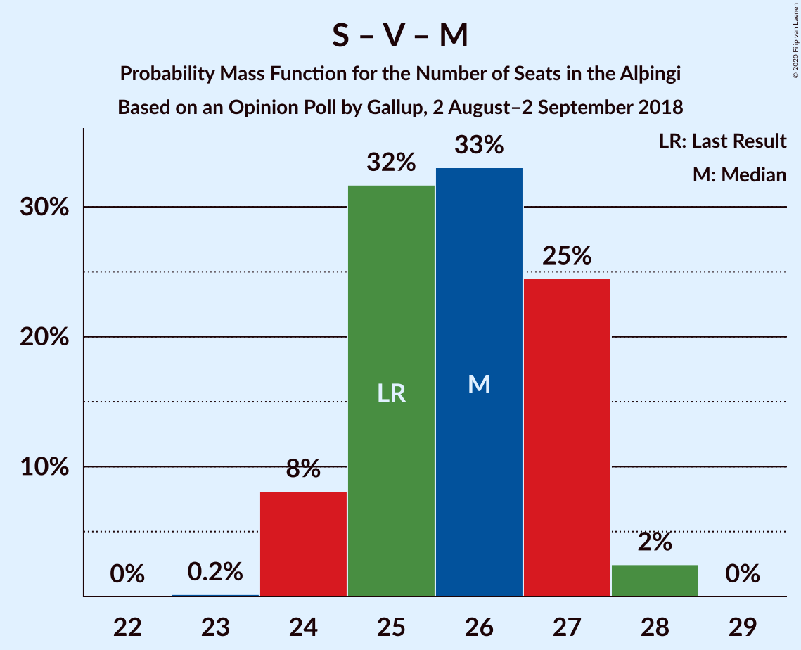
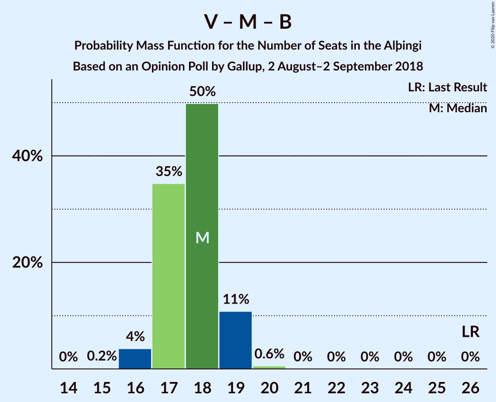

# Opinion Poll by Gallup, 2 August–2 September 2018

<a href="#voting-intentions">Voting Intentions</a> | <a href="#seats">Seats</a> | <a href="#coalitions">Coalitions</a> | <a href="#technical-information">Technical Information</a>

## Voting Intentions

### Confidence Intervals

| Party | Last Result | Poll Result | 80% Confidence Interval | 90% Confidence Interval | 95% Confidence Interval | 99% Confidence Interval |
|:-----:|:-----------:|:-----------:|:-----------------------:|:-----------------------:|:-----------------------:|:-----------------------:|
| Sjálfstæðisflokkurinn | 25.2% | 22.7% | 21.8–23.6% |21.6–23.9% |21.4–24.1% |21.0–24.5% |
| Samfylkingin | 12.1% | 19.3% | 18.5–20.1% |18.3–20.4% |18.1–20.6% |17.7–21.0% |
| Píratar | 9.2% | 12.5% | 11.8–13.2% |11.6–13.4% |11.5–13.6% |11.2–13.9% |
| Vinstrihreyfingin – grænt framboð | 16.9% | 11.7% | 11.1–12.4% |10.9–12.6% |10.7–12.8% |10.4–13.1% |
| Viðreisn | 6.7% | 10.1% | 9.5–10.8% |9.3–10.9% |9.2–11.1% |8.9–11.4% |
| Miðflokkurinn | 10.9% | 8.7% | 8.1–9.3% |8.0–9.5% |7.8–9.7% |7.6–10.0% |
| Framsóknarflokkurinn | 10.7% | 8.2% | 7.7–8.8% |7.5–9.0% |7.4–9.1% |7.1–9.4% |
| Flokkur fólksins | 6.9% | 5.7% | 5.2–6.2% |5.1–6.4% |5.0–6.5% |4.8–6.8% |
| Sósíalistaflokkur Íslands | 0.0% | 0.7% | 0.5–0.9% |0.5–1.0% |0.5–1.0% |0.4–1.1% |

*Note:* The poll result column reflects the actual value used in the calculations. Published results may vary slightly, and in addition be rounded to fewer digits.

## Seats

### Confidence Intervals

| Party | Last Result | Median | 80% Confidence Interval | 90% Confidence Interval | 95% Confidence Interval | 99% Confidence Interval |
|:-----:|:-----------:|:------:|:-----------------------:|:-----------------------:|:-----------------------:|:-----------------------:|
| <a href="#sjálfstæðisflokkurinn">Sjálfstæðisflokkurinn</a> | 16 | 15 | 14–16 |14–16 |14–17 |13–18 |
| <a href="#samfylkingin">Samfylkingin</a> | 7 | 13 | 12–14 |12–14 |12–14 |12–15 |
| <a href="#píratar">Píratar</a> | 6 | 8 | 7–8 |7–8 |7–9 |7–9 |
| <a href="#vinstrihreyfingin-–-grænt-framboð">Vinstrihreyfingin – grænt framboð</a> | 11 | 8 | 7–8 |7–8 |7–9 |6–9 |
| <a href="#viðreisn">Viðreisn</a> | 4 | 6 | 6–7 |6–7 |5–7 |5–7 |
| <a href="#miðflokkurinn">Miðflokkurinn</a> | 7 | 5 | 5–6 |5–6 |5–6 |4–6 |
| <a href="#framsóknarflokkurinn">Framsóknarflokkurinn</a> | 8 | 5 | 5–6 |5–6 |5–6 |4–6 |
| <a href="#flokkur-fólksins">Flokkur fólksins</a> | 4 | 3 | 3–4 |3–4 |3–4 |0–4 |
| <a href="#sósíalistaflokkur-íslands">Sósíalistaflokkur Íslands</a> | 0 | 0 | 0 |0 |0 |0 |

### Sjálfstæðisflokkurinn

*For a full overview of the results for this party, see the [Sjálfstæðisflokkurinn](party-sjálfstæðisflokkurinn.html) page.*

| Number of Seats | Probability | Accumulated | Special Marks |
|:---------------:|:-----------:|:-----------:|:-------------:|
| 13 | 2% | 100% |  |
| 14 | 11% | 98% |  |
| 15 | 63% | 88% | Median |
| 16 | 21% | 24% | Last Result |
| 17 | 2% | 3% |  |
| 18 | 0.6% | 0.6% |  |
| 19 | 0% | 0% |  |

### Samfylkingin

*For a full overview of the results for this party, see the [Samfylkingin](party-samfylkingin.html) page.*

| Number of Seats | Probability | Accumulated | Special Marks |
|:---------------:|:-----------:|:-----------:|:-------------:|
| 7 | 0% | 100% | Last Result |
| 8 | 0% | 100% |  |
| 9 | 0% | 100% |  |
| 10 | 0% | 100% |  |
| 11 | 0.2% | 100% |  |
| 12 | 40% | 99.8% |  |
| 13 | 50% | 60% | Median |
| 14 | 8% | 10% |  |
| 15 | 2% | 2% |  |
| 16 | 0% | 0% |  |

### Píratar

*For a full overview of the results for this party, see the [Píratar](party-píratar.html) page.*

| Number of Seats | Probability | Accumulated | Special Marks |
|:---------------:|:-----------:|:-----------:|:-------------:|
| 6 | 0% | 100% | Last Result |
| 7 | 14% | 100% |  |
| 8 | 82% | 86% | Median |
| 9 | 4% | 4% |  |
| 10 | 0% | 0% |  |

### Vinstrihreyfingin – grænt framboð

*For a full overview of the results for this party, see the [Vinstrihreyfingin – grænt framboð](party-vinstrihreyfingin–græntframboð.html) page.*

| Number of Seats | Probability | Accumulated | Special Marks |
|:---------------:|:-----------:|:-----------:|:-------------:|
| 6 | 2% | 100% |  |
| 7 | 45% | 98% |  |
| 8 | 49% | 53% | Median |
| 9 | 3% | 3% |  |
| 10 | 0.2% | 0.2% |  |
| 11 | 0% | 0% | Last Result |

### Viðreisn

*For a full overview of the results for this party, see the [Viðreisn](party-viðreisn.html) page.*

| Number of Seats | Probability | Accumulated | Special Marks |
|:---------------:|:-----------:|:-----------:|:-------------:|
| 4 | 0% | 100% | Last Result |
| 5 | 3% | 100% |  |
| 6 | 85% | 97% | Median |
| 7 | 12% | 12% |  |
| 8 | 0.2% | 0.2% |  |
| 9 | 0% | 0% |  |

### Miðflokkurinn

*For a full overview of the results for this party, see the [Miðflokkurinn](party-miðflokkurinn.html) page.*

| Number of Seats | Probability | Accumulated | Special Marks |
|:---------------:|:-----------:|:-----------:|:-------------:|
| 4 | 1.3% | 100% |  |
| 5 | 72% | 98.7% | Median |
| 6 | 26% | 27% |  |
| 7 | 0.1% | 0.1% | Last Result |
| 8 | 0% | 0% |  |

### Framsóknarflokkurinn

*For a full overview of the results for this party, see the [Framsóknarflokkurinn](party-framsóknarflokkurinn.html) page.*

| Number of Seats | Probability | Accumulated | Special Marks |
|:---------------:|:-----------:|:-----------:|:-------------:|
| 4 | 2% | 100% |  |
| 5 | 87% | 98% | Median |
| 6 | 11% | 11% |  |
| 7 | 0% | 0% |  |
| 8 | 0% | 0% | Last Result |

### Flokkur fólksins

*For a full overview of the results for this party, see the [Flokkur fólksins](party-flokkurfólksins.html) page.*

| Number of Seats | Probability | Accumulated | Special Marks |
|:---------------:|:-----------:|:-----------:|:-------------:|
| 0 | 1.3% | 100% |  |
| 1 | 0% | 98.7% |  |
| 2 | 0% | 98.7% |  |
| 3 | 68% | 98.7% | Median |
| 4 | 31% | 31% | Last Result |
| 5 | 0% | 0% |  |

### Sósíalistaflokkur Íslands

*For a full overview of the results for this party, see the [Sósíalistaflokkur Íslands](party-sósíalistaflokkuríslands.html) page.*

| Number of Seats | Probability | Accumulated | Special Marks |
|:---------------:|:-----------:|:-----------:|:-------------:|
| 0 | 100% | 100% | Last Result, Median |

## Coalitions

### Confidence Intervals

| Coalition | Last Result | Median | Majority? | 80% Confidence Interval | 90% Confidence Interval | 95% Confidence Interval | 99% Confidence Interval |
|:---------:|:-----------:|:------:|:---------:|:-----------------------:|:-----------------------:|:-----------------------:|:-----------------------:|
| Samfylkingin – Píratar – Vinstrihreyfingin – grænt framboð – Viðreisn | 28 | 34 | 100% | 33–35 | 33–36 | 33–36 | 33–37 |
| Samfylkingin – Vinstrihreyfingin – grænt framboð – Miðflokkurinn – Framsóknarflokkurinn | 33 | 31 | 9% | 29–31 | 29–32 | 29–32 | 28–33 |
| Samfylkingin – Píratar – Vinstrihreyfingin – grænt framboð | 24 | 28 | 0% | 27–29 | 27–29 | 27–30 | 27–30 |
| Sjálfstæðisflokkurinn – Samfylkingin | 23 | 28 | 0% | 27–29 | 26–29 | 26–30 | 26–31 |
| Sjálfstæðisflokkurinn – Vinstrihreyfingin – grænt framboð – Framsóknarflokkurinn | 35 | 28 | 0% | 27–28 | 26–28 | 26–29 | 26–30 |
| Sjálfstæðisflokkurinn – Miðflokkurinn – Framsóknarflokkurinn | 31 | 25 | 0% | 25–27 | 24–27 | 24–27 | 23–27 |
| Samfylkingin – Vinstrihreyfingin – grænt framboð – Framsóknarflokkurinn | 26 | 25 | 0% | 24–26 | 24–27 | 24–27 | 23–27 |
| Samfylkingin – Vinstrihreyfingin – grænt framboð – Miðflokkurinn | 25 | 26 | 0% | 24–26 | 24–27 | 24–27 | 24–28 |
| Sjálfstæðisflokkurinn – Vinstrihreyfingin – grænt framboð | 27 | 23 | 0% | 22–23 | 21–23 | 21–24 | 21–25 |
| Sjálfstæðisflokkurinn – Viðreisn | 20 | 21 | 0% | 21–22 | 20–23 | 20–23 | 20–24 |
| Sjálfstæðisflokkurinn – Framsóknarflokkurinn | 24 | 20 | 0% | 19–21 | 19–21 | 19–22 | 18–22 |
| Sjálfstæðisflokkurinn – Miðflokkurinn | 23 | 20 | 0% | 20–21 | 19–21 | 19–22 | 18–23 |
| Samfylkingin – Vinstrihreyfingin – grænt framboð | 18 | 20 | 0% | 19–21 | 19–21 | 19–22 | 19–22 |
| Vinstrihreyfingin – grænt framboð – Miðflokkurinn – Framsóknarflokkurinn | 26 | 18 | 0% | 17–19 | 17–19 | 16–19 | 15–20 |
| Píratar – Vinstrihreyfingin – grænt framboð | 17 | 15 | 0% | 15–16 | 15–16 | 14–17 | 14–17 |
| Vinstrihreyfingin – grænt framboð – Framsóknarflokkurinn | 19 | 13 | 0% | 12–13 | 12–14 | 11–14 | 10–14 |
| Vinstrihreyfingin – grænt framboð – Miðflokkurinn | 18 | 13 | 0% | 12–14 | 12–14 | 11–14 | 11–14 |

### Samfylkingin – Píratar – Vinstrihreyfingin – grænt framboð – Viðreisn

| Number of Seats | Probability | Accumulated | Special Marks |
|:---------------:|:-----------:|:-----------:|:-------------:|
| 28 | 0% | 100% | Last Result |
| 29 | 0% | 100% |  |
| 30 | 0% | 100% |  |
| 31 | 0% | 100% |  |
| 32 | 0.1% | 100% | Majority |
| 33 | 32% | 99.9% |  |
| 34 | 18% | 68% |  |
| 35 | 43% | 50% | Median |
| 36 | 6% | 6% |  |
| 37 | 0.7% | 0.7% |  |
| 38 | 0% | 0% |  |

### Samfylkingin – Vinstrihreyfingin – grænt framboð – Miðflokkurinn – Framsóknarflokkurinn

| Number of Seats | Probability | Accumulated | Special Marks |
|:---------------:|:-----------:|:-----------:|:-------------:|
| 28 | 0.7% | 100% |  |
| 29 | 18% | 99.3% |  |
| 30 | 13% | 81% |  |
| 31 | 60% | 69% | Median |
| 32 | 8% | 9% | Majority |
| 33 | 0.5% | 0.5% | Last Result |
| 34 | 0% | 0% |  |

### Samfylkingin – Píratar – Vinstrihreyfingin – grænt framboð

| Number of Seats | Probability | Accumulated | Special Marks |
|:---------------:|:-----------:|:-----------:|:-------------:|
| 24 | 0% | 100% | Last Result |
| 25 | 0% | 100% |  |
| 26 | 0.3% | 100% |  |
| 27 | 36% | 99.7% |  |
| 28 | 16% | 64% |  |
| 29 | 44% | 48% | Median |
| 30 | 4% | 4% |  |
| 31 | 0.1% | 0.1% |  |
| 32 | 0% | 0% | Majority |

### Sjálfstæðisflokkurinn – Samfylkingin

| Number of Seats | Probability | Accumulated | Special Marks |
|:---------------:|:-----------:|:-----------:|:-------------:|
| 23 | 0% | 100% | Last Result |
| 24 | 0% | 100% |  |
| 25 | 0.1% | 100% |  |
| 26 | 5% | 99.9% |  |
| 27 | 26% | 95% |  |
| 28 | 51% | 69% | Median |
| 29 | 16% | 18% |  |
| 30 | 2% | 3% |  |
| 31 | 0.6% | 0.7% |  |
| 32 | 0% | 0% | Majority |

### Sjálfstæðisflokkurinn – Vinstrihreyfingin – grænt framboð – Framsóknarflokkurinn

| Number of Seats | Probability | Accumulated | Special Marks |
|:---------------:|:-----------:|:-----------:|:-------------:|
| 25 | 0.1% | 100% |  |
| 26 | 9% | 99.9% |  |
| 27 | 10% | 91% |  |
| 28 | 76% | 81% | Median |
| 29 | 4% | 4% |  |
| 30 | 0.7% | 0.7% |  |
| 31 | 0% | 0% |  |
| 32 | 0% | 0% | Majority |
| 33 | 0% | 0% |  |
| 34 | 0% | 0% |  |
| 35 | 0% | 0% | Last Result |

### Sjálfstæðisflokkurinn – Miðflokkurinn – Framsóknarflokkurinn

| Number of Seats | Probability | Accumulated | Special Marks |
|:---------------:|:-----------:|:-----------:|:-------------:|
| 23 | 2% | 100% |  |
| 24 | 6% | 98% |  |
| 25 | 47% | 92% | Median |
| 26 | 34% | 45% |  |
| 27 | 11% | 12% |  |
| 28 | 0.2% | 0.2% |  |
| 29 | 0% | 0% |  |
| 30 | 0% | 0% |  |
| 31 | 0% | 0% | Last Result |

### Samfylkingin – Vinstrihreyfingin – grænt framboð – Framsóknarflokkurinn

| Number of Seats | Probability | Accumulated | Special Marks |
|:---------------:|:-----------:|:-----------:|:-------------:|
| 23 | 0.9% | 100% |  |
| 24 | 21% | 99.1% |  |
| 25 | 29% | 78% |  |
| 26 | 44% | 50% | Last Result, Median |
| 27 | 6% | 6% |  |
| 28 | 0.4% | 0.4% |  |
| 29 | 0% | 0% |  |

### Samfylkingin – Vinstrihreyfingin – grænt framboð – Miðflokkurinn

| Number of Seats | Probability | Accumulated | Special Marks |
|:---------------:|:-----------:|:-----------:|:-------------:|
| 23 | 0.1% | 100% |  |
| 24 | 18% | 99.9% |  |
| 25 | 21% | 82% | Last Result |
| 26 | 54% | 61% | Median |
| 27 | 6% | 7% |  |
| 28 | 0.5% | 0.5% |  |
| 29 | 0% | 0% |  |

### Sjálfstæðisflokkurinn – Vinstrihreyfingin – grænt framboð

| Number of Seats | Probability | Accumulated | Special Marks |
|:---------------:|:-----------:|:-----------:|:-------------:|
| 20 | 0.1% | 100% |  |
| 21 | 9% | 99.9% |  |
| 22 | 20% | 91% |  |
| 23 | 67% | 71% | Median |
| 24 | 4% | 5% |  |
| 25 | 0.6% | 0.6% |  |
| 26 | 0% | 0% |  |
| 27 | 0% | 0% | Last Result |

### Sjálfstæðisflokkurinn – Viðreisn

| Number of Seats | Probability | Accumulated | Special Marks |
|:---------------:|:-----------:|:-----------:|:-------------:|
| 19 | 0.2% | 100% |  |
| 20 | 9% | 99.8% | Last Result |
| 21 | 63% | 91% | Median |
| 22 | 22% | 28% |  |
| 23 | 4% | 5% |  |
| 24 | 0.7% | 0.7% |  |
| 25 | 0% | 0% |  |

### Sjálfstæðisflokkurinn – Framsóknarflokkurinn

| Number of Seats | Probability | Accumulated | Special Marks |
|:---------------:|:-----------:|:-----------:|:-------------:|
| 18 | 2% | 100% |  |
| 19 | 9% | 98% |  |
| 20 | 57% | 89% | Median |
| 21 | 29% | 32% |  |
| 22 | 3% | 3% |  |
| 23 | 0.2% | 0.2% |  |
| 24 | 0% | 0% | Last Result |

### Sjálfstæðisflokkurinn – Miðflokkurinn

| Number of Seats | Probability | Accumulated | Special Marks |
|:---------------:|:-----------:|:-----------:|:-------------:|
| 18 | 2% | 100% |  |
| 19 | 8% | 98% |  |
| 20 | 45% | 91% | Median |
| 21 | 42% | 46% |  |
| 22 | 3% | 4% |  |
| 23 | 0.6% | 0.6% | Last Result |
| 24 | 0% | 0% |  |

### Samfylkingin – Vinstrihreyfingin – grænt framboð

| Number of Seats | Probability | Accumulated | Special Marks |
|:---------------:|:-----------:|:-----------:|:-------------:|
| 18 | 0.1% | 100% | Last Result |
| 19 | 29% | 99.9% |  |
| 20 | 22% | 71% |  |
| 21 | 45% | 49% | Median |
| 22 | 4% | 5% |  |
| 23 | 0.2% | 0.3% |  |
| 24 | 0% | 0% |  |

### Vinstrihreyfingin – grænt framboð – Miðflokkurinn – Framsóknarflokkurinn

| Number of Seats | Probability | Accumulated | Special Marks |
|:---------------:|:-----------:|:-----------:|:-------------:|
| 15 | 0.6% | 100% |  |
| 16 | 3% | 99.4% |  |
| 17 | 30% | 96% |  |
| 18 | 40% | 66% | Median |
| 19 | 25% | 26% |  |
| 20 | 0.8% | 0.8% |  |
| 21 | 0% | 0% |  |
| 22 | 0% | 0% |  |
| 23 | 0% | 0% |  |
| 24 | 0% | 0% |  |
| 25 | 0% | 0% |  |
| 26 | 0% | 0% | Last Result |

### Píratar – Vinstrihreyfingin – grænt framboð

| Number of Seats | Probability | Accumulated | Special Marks |
|:---------------:|:-----------:|:-----------:|:-------------:|
| 13 | 0.1% | 100% |  |
| 14 | 5% | 99.9% |  |
| 15 | 49% | 95% |  |
| 16 | 43% | 46% | Median |
| 17 | 3% | 3% | Last Result |
| 18 | 0.1% | 0.1% |  |
| 19 | 0% | 0% |  |

### Vinstrihreyfingin – grænt framboð – Framsóknarflokkurinn

| Number of Seats | Probability | Accumulated | Special Marks |
|:---------------:|:-----------:|:-----------:|:-------------:|
| 10 | 0.6% | 100% |  |
| 11 | 3% | 99.4% |  |
| 12 | 35% | 96% |  |
| 13 | 55% | 61% | Median |
| 14 | 5% | 6% |  |
| 15 | 0.2% | 0.2% |  |
| 16 | 0% | 0% |  |
| 17 | 0% | 0% |  |
| 18 | 0% | 0% |  |
| 19 | 0% | 0% | Last Result |

### Vinstrihreyfingin – grænt framboð – Miðflokkurinn

| Number of Seats | Probability | Accumulated | Special Marks |
|:---------------:|:-----------:|:-----------:|:-------------:|
| 11 | 3% | 100% |  |
| 12 | 31% | 97% |  |
| 13 | 50% | 66% | Median |
| 14 | 16% | 16% |  |
| 15 | 0.2% | 0.2% |  |
| 16 | 0% | 0% |  |
| 17 | 0% | 0% |  |
| 18 | 0% | 0% | Last Result |

## Technical Information

### Opinion Poll

+ **Polling firm:** Gallup
+ **Commissioner(s):** —
+ **Fieldwork period:** 2 August–2 September 2018

### Calculations

+ **Sample size:** 3731
+ **Simulations done:** 131,072
+ **Error estimate:** 1.71%

