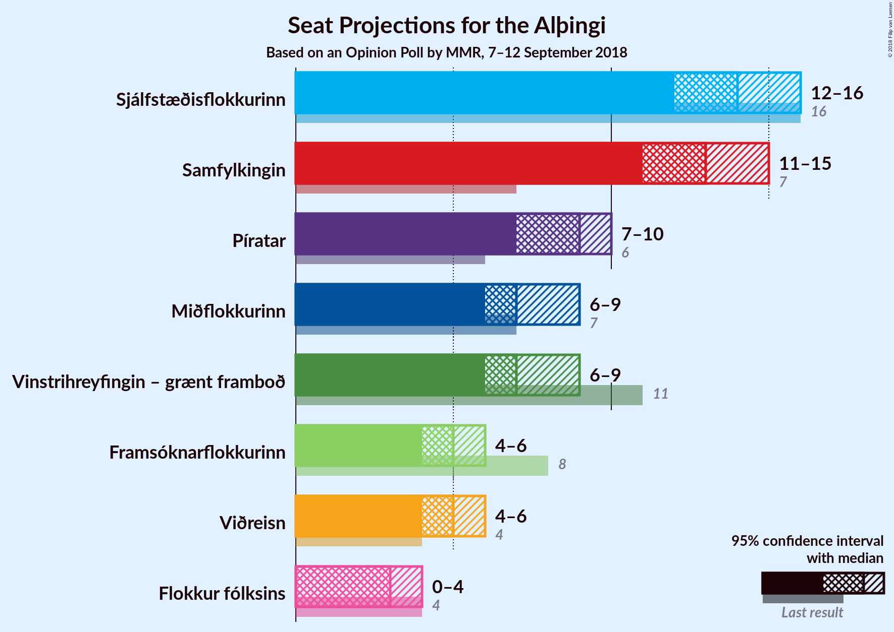
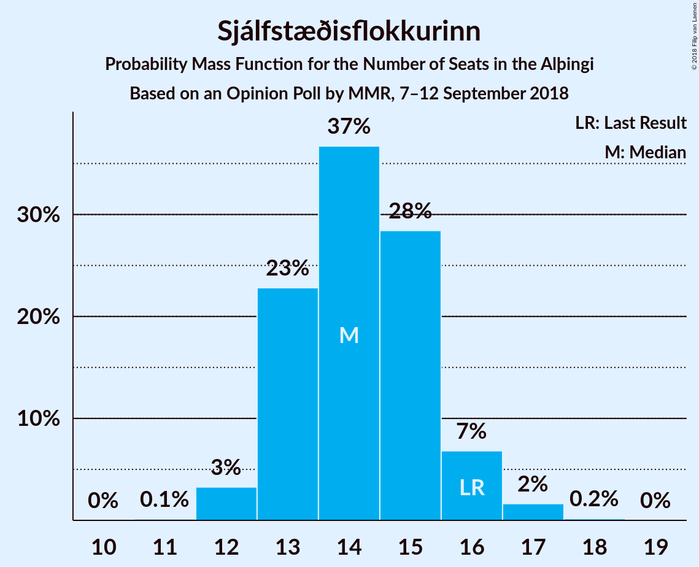

# Opinion Poll by MMR, 7–12 September 2018

<a href="#voting-intentions">Voting Intentions</a> | <a href="#seats">Seats</a> | <a href="#coalitions">Coalitions</a> | <a href="#technical-information">Technical Information</a>

## Voting Intentions

### Confidence Intervals

| Party | Last Result | Poll Result | 80% Confidence Interval | 90% Confidence Interval | 95% Confidence Interval | 99% Confidence Interval |
|:-----:|:-----------:|:-----------:|:-----------------------:|:-----------------------:|:-----------------------:|:-----------------------:|
| Sjálfstæðisflokkurinn | 25.2% | 21.3% | 19.7–23.1% |19.2–23.6% |18.8–24.0% |18.1–24.9% |
| Samfylkingin | 12.1% | 19.8% | 18.2–21.6% |17.8–22.1% |17.4–22.5% |16.7–23.3% |
| Píratar | 9.2% | 13.2% | 11.9–14.7% |11.5–15.2% |11.2–15.5% |10.6–16.3% |
| Vinstrihreyfingin – grænt framboð | 16.9% | 11.1% | 9.9–12.5% |9.6–12.9% |9.3–13.3% |8.7–14.0% |
| Miðflokkurinn | 10.9% | 10.8% | 9.6–12.2% |9.3–12.6% |9.0–12.9% |8.4–13.6% |
| Framsóknarflokkurinn | 10.7% | 8.1% | 7.0–9.3% |6.8–9.7% |6.5–10.0% |6.1–10.6% |
| Viðreisn | 6.7% | 7.9% | 6.8–9.1% |6.6–9.4% |6.3–9.8% |5.9–10.4% |
| Flokkur fólksins | 6.9% | 5.4% | 4.5–6.4% |4.3–6.7% |4.1–7.0% |3.7–7.5% |

*Note:* The poll result column reflects the actual value used in the calculations. Published results may vary slightly, and in addition be rounded to fewer digits.

## Seats

### Confidence Intervals

| Party | Last Result | Median | 80% Confidence Interval | 90% Confidence Interval | 95% Confidence Interval | 99% Confidence Interval |
|:-----:|:-----------:|:------:|:-----------------------:|:-----------------------:|:-----------------------:|:-----------------------:|
| <a href="#sjálfstæðisflokkurinn">Sjálfstæðisflokkurinn</a> | 16 | 14 | 13–14 |13–14 |13–15 |13–16 |
| <a href="#samfylkingin">Samfylkingin</a> | 7 | 12 | 11–13 |11–13 |11–14 |11–15 |
| <a href="#píratar">Píratar</a> | 6 | 8 | 8–9 |8–9 |8–9 |8–10 |
| <a href="#vinstrihreyfingin-–-grænt-framboð">Vinstrihreyfingin – grænt framboð</a> | 11 | 8 | 8 |8 |7–8 |5–8 |
| <a href="#miðflokkurinn">Miðflokkurinn</a> | 7 | 8 | 6–8 |6–8 |6–9 |5–9 |
| <a href="#framsóknarflokkurinn">Framsóknarflokkurinn</a> | 8 | 5 | 5–7 |5–7 |3–7 |3–7 |
| <a href="#viðreisn">Viðreisn</a> | 4 | 5 | 4–5 |4–5 |4–6 |4–6 |
| <a href="#flokkur-fólksins">Flokkur fólksins</a> | 4 | 3 | 3–5 |3–5 |0–5 |0–5 |

### Sjálfstæðisflokkurinn

*For a full overview of the results for this party, see the [Sjálfstæðisflokkurinn](party-sjálfstæðisflokkurinn.html) page.*

| Number of Seats | Probability | Accumulated | Special Marks |
|:---------------:|:-----------:|:-----------:|:-------------:|
| 11 | 0.1% | 100% |  |
| 12 | 0% | 99.9% |  |
| 13 | 17% | 99.9% |  |
| 14 | 79% | 82% | Median |
| 15 | 2% | 4% |  |
| 16 | 1.2% | 1.4% | Last Result |
| 17 | 0.1% | 0.2% |  |
| 18 | 0.1% | 0.1% |  |
| 19 | 0% | 0% |  |

### Samfylkingin

*For a full overview of the results for this party, see the [Samfylkingin](party-samfylkingin.html) page.*

| Number of Seats | Probability | Accumulated | Special Marks |
|:---------------:|:-----------:|:-----------:|:-------------:|
| 7 | 0% | 100% | Last Result |
| 8 | 0% | 100% |  |
| 9 | 0% | 100% |  |
| 10 | 0.2% | 100% |  |
| 11 | 16% | 99.8% |  |
| 12 | 65% | 84% | Median |
| 13 | 17% | 20% |  |
| 14 | 1.2% | 3% |  |
| 15 | 1.4% | 2% |  |
| 16 | 0.1% | 0.3% |  |
| 17 | 0.2% | 0.2% |  |
| 18 | 0% | 0% |  |

### Píratar

*For a full overview of the results for this party, see the [Píratar](party-píratar.html) page.*

| Number of Seats | Probability | Accumulated | Special Marks |
|:---------------:|:-----------:|:-----------:|:-------------:|
| 6 | 0% | 100% | Last Result |
| 7 | 0.3% | 100% |  |
| 8 | 77% | 99.7% | Median |
| 9 | 21% | 23% |  |
| 10 | 2% | 2% |  |
| 11 | 0.2% | 0.2% |  |
| 12 | 0% | 0% |  |

### Vinstrihreyfingin – grænt framboð

*For a full overview of the results for this party, see the [Vinstrihreyfingin – grænt framboð](party-vinstrihreyfingin–græntframboð.html) page.*

| Number of Seats | Probability | Accumulated | Special Marks |
|:---------------:|:-----------:|:-----------:|:-------------:|
| 5 | 0.7% | 100% |  |
| 6 | 1.4% | 99.3% |  |
| 7 | 2% | 98% |  |
| 8 | 96% | 96% | Median |
| 9 | 0.1% | 0.3% |  |
| 10 | 0.2% | 0.2% |  |
| 11 | 0.1% | 0.1% | Last Result |
| 12 | 0% | 0% |  |

### Miðflokkurinn

*For a full overview of the results for this party, see the [Miðflokkurinn](party-miðflokkurinn.html) page.*

| Number of Seats | Probability | Accumulated | Special Marks |
|:---------------:|:-----------:|:-----------:|:-------------:|
| 4 | 0.5% | 100% |  |
| 5 | 0.2% | 99.5% |  |
| 6 | 17% | 99.4% |  |
| 7 | 3% | 83% | Last Result |
| 8 | 76% | 80% | Median |
| 9 | 4% | 4% |  |
| 10 | 0% | 0% |  |

### Framsóknarflokkurinn

*For a full overview of the results for this party, see the [Framsóknarflokkurinn](party-framsóknarflokkurinn.html) page.*

| Number of Seats | Probability | Accumulated | Special Marks |
|:---------------:|:-----------:|:-----------:|:-------------:|
| 3 | 3% | 100% |  |
| 4 | 2% | 97% |  |
| 5 | 81% | 96% | Median |
| 6 | 2% | 15% |  |
| 7 | 13% | 13% |  |
| 8 | 0% | 0% | Last Result |

### Viðreisn

*For a full overview of the results for this party, see the [Viðreisn](party-viðreisn.html) page.*

| Number of Seats | Probability | Accumulated | Special Marks |
|:---------------:|:-----------:|:-----------:|:-------------:|
| 3 | 0% | 100% |  |
| 4 | 31% | 99.9% | Last Result |
| 5 | 66% | 68% | Median |
| 6 | 3% | 3% |  |
| 7 | 0.1% | 0.1% |  |
| 8 | 0% | 0% |  |

### Flokkur fólksins

*For a full overview of the results for this party, see the [Flokkur fólksins](party-flokkurfólksins.html) page.*

| Number of Seats | Probability | Accumulated | Special Marks |
|:---------------:|:-----------:|:-----------:|:-------------:|
| 0 | 3% | 100% |  |
| 1 | 0% | 97% |  |
| 2 | 0% | 97% |  |
| 3 | 80% | 97% | Median |
| 4 | 0.7% | 18% | Last Result |
| 5 | 17% | 17% |  |
| 6 | 0% | 0% |  |

## Coalitions

### Confidence Intervals

| Coalition | Last Result | Median | Majority? | 80% Confidence Interval | 90% Confidence Interval | 95% Confidence Interval | 99% Confidence Interval |
|:---------:|:-----------:|:------:|:---------:|:-----------------------:|:-----------------------:|:-----------------------:|:-----------------------:|
| Samfylkingin – Píratar – Vinstrihreyfingin – grænt framboð – Viðreisn | 28 | 33 | 86% | 31–34 | 31–35 | 31–35 | 30–36 |
| Samfylkingin – Vinstrihreyfingin – grænt framboð – Miðflokkurinn – Framsóknarflokkurinn | 33 | 33 | 96% | 32–34 | 32–34 | 30–34 | 29–36 |
| Samfylkingin – Píratar – Vinstrihreyfingin – grænt framboð | 24 | 28 | 0.3% | 27–30 | 27–30 | 27–30 | 26–31 |
| Sjálfstæðisflokkurinn – Vinstrihreyfingin – grænt framboð – Framsóknarflokkurinn | 35 | 27 | 0.1% | 26–29 | 26–29 | 25–29 | 24–29 |
| Sjálfstæðisflokkurinn – Miðflokkurinn – Framsóknarflokkurinn | 31 | 27 | 0% | 24–29 | 24–29 | 24–29 | 23–29 |
| Samfylkingin – Vinstrihreyfingin – grænt framboð – Miðflokkurinn | 25 | 28 | 0.3% | 27–28 | 27–28 | 27–28 | 26–30 |
| Sjálfstæðisflokkurinn – Samfylkingin | 23 | 26 | 0% | 25–26 | 25–27 | 25–28 | 25–30 |
| Samfylkingin – Vinstrihreyfingin – grænt framboð – Framsóknarflokkurinn | 26 | 25 | 0% | 25–26 | 24–26 | 23–26 | 22–27 |
| Sjálfstæðisflokkurinn – Vinstrihreyfingin – grænt framboð | 27 | 22 | 0% | 21–22 | 21–22 | 21–23 | 19–23 |
| Sjálfstæðisflokkurinn – Miðflokkurinn | 23 | 22 | 0% | 19–22 | 19–22 | 19–23 | 19–25 |
| Vinstrihreyfingin – grænt framboð – Miðflokkurinn – Framsóknarflokkurinn | 26 | 21 | 0% | 19–23 | 19–23 | 18–23 | 16–23 |
| Samfylkingin – Vinstrihreyfingin – grænt framboð | 18 | 20 | 0% | 19–21 | 19–21 | 19–21 | 18–22 |
| Sjálfstæðisflokkurinn – Framsóknarflokkurinn | 24 | 19 | 0% | 18–21 | 18–21 | 18–21 | 17–21 |
| Sjálfstæðisflokkurinn – Viðreisn | 20 | 19 | 0% | 17–19 | 17–19 | 17–21 | 17–21 |
| Píratar – Vinstrihreyfingin – grænt framboð | 17 | 16 | 0% | 16–17 | 16–17 | 15–17 | 15–17 |
| Vinstrihreyfingin – grænt framboð – Miðflokkurinn | 18 | 16 | 0% | 14–16 | 14–16 | 14–16 | 12–17 |
| Vinstrihreyfingin – grænt framboð – Framsóknarflokkurinn | 19 | 13 | 0% | 13–15 | 12–15 | 11–15 | 9–15 |

### Samfylkingin – Píratar – Vinstrihreyfingin – grænt framboð – Viðreisn

| Number of Seats | Probability | Accumulated | Special Marks |
|:---------------:|:-----------:|:-----------:|:-------------:|
| 28 | 0% | 100% | Last Result |
| 29 | 0% | 100% |  |
| 30 | 0.6% | 100% |  |
| 31 | 13% | 99.3% |  |
| 32 | 2% | 86% | Majority |
| 33 | 62% | 84% | Median |
| 34 | 16% | 22% |  |
| 35 | 4% | 5% |  |
| 36 | 0.7% | 1.0% |  |
| 37 | 0.1% | 0.3% |  |
| 38 | 0.1% | 0.2% |  |
| 39 | 0.1% | 0.1% |  |
| 40 | 0% | 0% |  |

### Samfylkingin – Vinstrihreyfingin – grænt framboð – Miðflokkurinn – Framsóknarflokkurinn

| Number of Seats | Probability | Accumulated | Special Marks |
|:---------------:|:-----------:|:-----------:|:-------------:|
| 29 | 0.8% | 100% |  |
| 30 | 3% | 99.2% |  |
| 31 | 0.7% | 96% |  |
| 32 | 17% | 96% | Majority |
| 33 | 64% | 79% | Last Result, Median |
| 34 | 13% | 15% |  |
| 35 | 0.1% | 2% |  |
| 36 | 1.4% | 2% |  |
| 37 | 0.2% | 0.2% |  |
| 38 | 0% | 0% |  |

### Samfylkingin – Píratar – Vinstrihreyfingin – grænt framboð

| Number of Seats | Probability | Accumulated | Special Marks |
|:---------------:|:-----------:|:-----------:|:-------------:|
| 24 | 0% | 100% | Last Result |
| 25 | 0% | 100% |  |
| 26 | 0.7% | 100% |  |
| 27 | 13% | 99.3% |  |
| 28 | 64% | 86% | Median |
| 29 | 3% | 22% |  |
| 30 | 19% | 19% |  |
| 31 | 0.2% | 0.6% |  |
| 32 | 0.2% | 0.3% | Majority |
| 33 | 0.1% | 0.1% |  |
| 34 | 0% | 0% |  |

### Sjálfstæðisflokkurinn – Vinstrihreyfingin – grænt framboð – Framsóknarflokkurinn

| Number of Seats | Probability | Accumulated | Special Marks |
|:---------------:|:-----------:|:-----------:|:-------------:|
| 22 | 0.1% | 100% |  |
| 23 | 0% | 99.9% |  |
| 24 | 0.8% | 99.9% |  |
| 25 | 2% | 99.1% |  |
| 26 | 18% | 97% |  |
| 27 | 65% | 79% | Median |
| 28 | 0.2% | 14% |  |
| 29 | 13% | 14% |  |
| 30 | 0.1% | 0.3% |  |
| 31 | 0% | 0.2% |  |
| 32 | 0.1% | 0.1% | Majority |
| 33 | 0% | 0% |  |
| 34 | 0% | 0% |  |
| 35 | 0% | 0% | Last Result |

### Sjálfstæðisflokkurinn – Miðflokkurinn – Framsóknarflokkurinn

| Number of Seats | Probability | Accumulated | Special Marks |
|:---------------:|:-----------:|:-----------:|:-------------:|
| 23 | 1.2% | 100% |  |
| 24 | 16% | 98.7% |  |
| 25 | 2% | 83% |  |
| 26 | 0.2% | 80% |  |
| 27 | 63% | 80% | Median |
| 28 | 4% | 18% |  |
| 29 | 14% | 14% |  |
| 30 | 0% | 0.1% |  |
| 31 | 0.1% | 0.1% | Last Result |
| 32 | 0% | 0% | Majority |

### Samfylkingin – Vinstrihreyfingin – grænt framboð – Miðflokkurinn

| Number of Seats | Probability | Accumulated | Special Marks |
|:---------------:|:-----------:|:-----------:|:-------------:|
| 24 | 0.1% | 100% |  |
| 25 | 0.1% | 99.9% | Last Result |
| 26 | 2% | 99.9% |  |
| 27 | 31% | 98% |  |
| 28 | 65% | 66% | Median |
| 29 | 0.1% | 2% |  |
| 30 | 1.5% | 2% |  |
| 31 | 0.1% | 0.3% |  |
| 32 | 0% | 0.3% | Majority |
| 33 | 0.2% | 0.2% |  |
| 34 | 0% | 0% |  |

### Sjálfstæðisflokkurinn – Samfylkingin

| Number of Seats | Probability | Accumulated | Special Marks |
|:---------------:|:-----------:|:-----------:|:-------------:|
| 23 | 0.2% | 100% | Last Result |
| 24 | 0.1% | 99.8% |  |
| 25 | 15% | 99.7% |  |
| 26 | 78% | 85% | Median |
| 27 | 4% | 7% |  |
| 28 | 2% | 3% |  |
| 29 | 0.4% | 1.2% |  |
| 30 | 0.6% | 0.8% |  |
| 31 | 0.2% | 0.3% |  |
| 32 | 0% | 0% | Majority |

### Samfylkingin – Vinstrihreyfingin – grænt framboð – Framsóknarflokkurinn

| Number of Seats | Probability | Accumulated | Special Marks |
|:---------------:|:-----------:|:-----------:|:-------------:|
| 22 | 0.7% | 100% |  |
| 23 | 3% | 99.3% |  |
| 24 | 2% | 96% |  |
| 25 | 63% | 94% | Median |
| 26 | 29% | 31% | Last Result |
| 27 | 2% | 2% |  |
| 28 | 0.3% | 0.3% |  |
| 29 | 0% | 0% |  |

### Sjálfstæðisflokkurinn – Vinstrihreyfingin – grænt framboð

| Number of Seats | Probability | Accumulated | Special Marks |
|:---------------:|:-----------:|:-----------:|:-------------:|
| 18 | 0.1% | 100% |  |
| 19 | 1.4% | 99.9% |  |
| 20 | 0.2% | 98% |  |
| 21 | 17% | 98% |  |
| 22 | 78% | 81% | Median |
| 23 | 3% | 3% |  |
| 24 | 0% | 0.3% |  |
| 25 | 0% | 0.2% |  |
| 26 | 0.2% | 0.2% |  |
| 27 | 0% | 0% | Last Result |

### Sjálfstæðisflokkurinn – Miðflokkurinn

| Number of Seats | Probability | Accumulated | Special Marks |
|:---------------:|:-----------:|:-----------:|:-------------:|
| 18 | 0.5% | 100% |  |
| 19 | 16% | 99.5% |  |
| 20 | 1.1% | 84% |  |
| 21 | 0.1% | 83% |  |
| 22 | 79% | 82% | Median |
| 23 | 2% | 3% | Last Result |
| 24 | 0.6% | 1.3% |  |
| 25 | 0.7% | 0.7% |  |
| 26 | 0% | 0% |  |

### Vinstrihreyfingin – grænt framboð – Miðflokkurinn – Framsóknarflokkurinn

| Number of Seats | Probability | Accumulated | Special Marks |
|:---------------:|:-----------:|:-----------:|:-------------:|
| 16 | 0.8% | 100% |  |
| 17 | 0.6% | 99.2% |  |
| 18 | 3% | 98.6% |  |
| 19 | 16% | 96% |  |
| 20 | 0.3% | 79% |  |
| 21 | 64% | 79% | Median |
| 22 | 2% | 15% |  |
| 23 | 13% | 13% |  |
| 24 | 0% | 0% |  |
| 25 | 0% | 0% |  |
| 26 | 0% | 0% | Last Result |

### Samfylkingin – Vinstrihreyfingin – grænt framboð

| Number of Seats | Probability | Accumulated | Special Marks |
|:---------------:|:-----------:|:-----------:|:-------------:|
| 17 | 0.1% | 100% |  |
| 18 | 0.6% | 99.9% | Last Result |
| 19 | 16% | 99.3% |  |
| 20 | 65% | 84% | Median |
| 21 | 17% | 18% |  |
| 22 | 0.5% | 0.9% |  |
| 23 | 0.1% | 0.4% |  |
| 24 | 0.2% | 0.3% |  |
| 25 | 0.1% | 0.1% |  |
| 26 | 0% | 0% |  |

### Sjálfstæðisflokkurinn – Framsóknarflokkurinn

| Number of Seats | Probability | Accumulated | Special Marks |
|:---------------:|:-----------:|:-----------:|:-------------:|
| 16 | 0.1% | 100% |  |
| 17 | 0.9% | 99.9% |  |
| 18 | 18% | 99.0% |  |
| 19 | 66% | 81% | Median |
| 20 | 1.3% | 15% |  |
| 21 | 13% | 13% |  |
| 22 | 0.1% | 0.3% |  |
| 23 | 0.1% | 0.2% |  |
| 24 | 0.1% | 0.1% | Last Result |
| 25 | 0% | 0% |  |

### Sjálfstæðisflokkurinn – Viðreisn

| Number of Seats | Probability | Accumulated | Special Marks |
|:---------------:|:-----------:|:-----------:|:-------------:|
| 15 | 0% | 100% |  |
| 16 | 0% | 99.9% |  |
| 17 | 16% | 99.9% |  |
| 18 | 16% | 84% |  |
| 19 | 63% | 68% | Median |
| 20 | 1.2% | 4% | Last Result |
| 21 | 3% | 3% |  |
| 22 | 0.1% | 0.2% |  |
| 23 | 0% | 0% |  |

### Píratar – Vinstrihreyfingin – grænt framboð

| Number of Seats | Probability | Accumulated | Special Marks |
|:---------------:|:-----------:|:-----------:|:-------------:|
| 13 | 0.1% | 100% |  |
| 14 | 0.3% | 99.9% |  |
| 15 | 3% | 99.6% |  |
| 16 | 76% | 97% | Median |
| 17 | 21% | 21% | Last Result |
| 18 | 0.2% | 0.4% |  |
| 19 | 0% | 0.2% |  |
| 20 | 0.2% | 0.2% |  |
| 21 | 0% | 0% |  |

### Vinstrihreyfingin – grænt framboð – Miðflokkurinn

| Number of Seats | Probability | Accumulated | Special Marks |
|:---------------:|:-----------:|:-----------:|:-------------:|
| 11 | 0% | 100% |  |
| 12 | 0.6% | 99.9% |  |
| 13 | 0.9% | 99.3% |  |
| 14 | 16% | 98% |  |
| 15 | 4% | 82% |  |
| 16 | 76% | 78% | Median |
| 17 | 2% | 2% |  |
| 18 | 0.1% | 0.1% | Last Result |
| 19 | 0% | 0% |  |

### Vinstrihreyfingin – grænt framboð – Framsóknarflokkurinn

| Number of Seats | Probability | Accumulated | Special Marks |
|:---------------:|:-----------:|:-----------:|:-------------:|
| 9 | 0.6% | 100% |  |
| 10 | 0.8% | 99.4% |  |
| 11 | 3% | 98.6% |  |
| 12 | 2% | 96% |  |
| 13 | 80% | 94% | Median |
| 14 | 0.3% | 14% |  |
| 15 | 13% | 13% |  |
| 16 | 0% | 0% |  |
| 17 | 0% | 0% |  |
| 18 | 0% | 0% |  |
| 19 | 0% | 0% | Last Result |

## Technical Information

### Opinion Poll

+ **Polling firm:** MMR
+ **Commissioner(s):** —
+ **Fieldwork period:** 7–12 September 2018

### Calculations

+ **Sample size:** 953
+ **Simulations done:** 1,024
+ **Error estimate:** 2.96%

