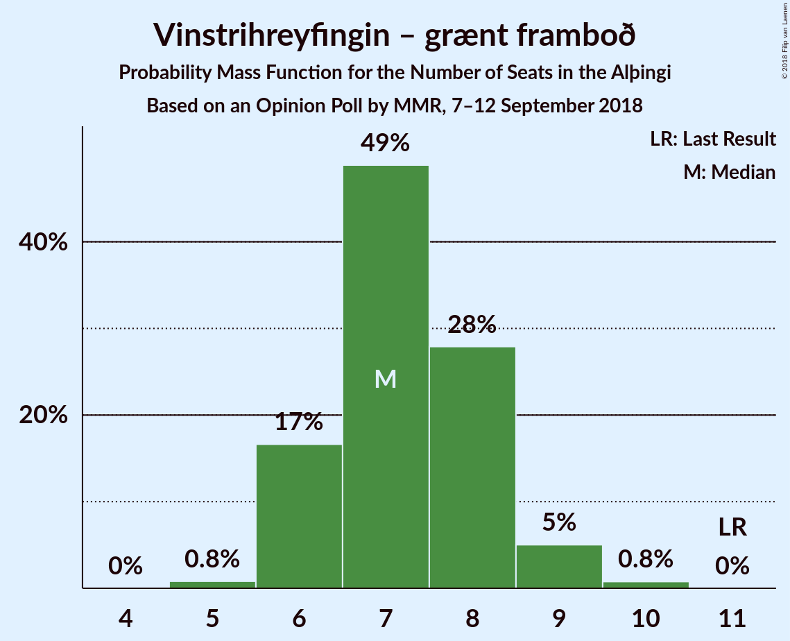

# Opinion Poll by MMR, 7–12 September 2018

<a href="#voting-intentions">Voting Intentions</a> | <a href="#seats">Seats</a> | <a href="#coalitions">Coalitions</a> | <a href="#technical-information">Technical Information</a>

## Voting Intentions

### Confidence Intervals

| Party | Last Result | Poll Result | 80% Confidence Interval | 90% Confidence Interval | 95% Confidence Interval | 99% Confidence Interval |
|:-----:|:-----------:|:-----------:|:-----------------------:|:-----------------------:|:-----------------------:|:-----------------------:|
| Sjálfstæðisflokkurinn | 25.2% | 21.3% | 19.7–23.1% |19.2–23.6% |18.8–24.0% |18.1–24.9% |
| Samfylkingin | 12.1% | 19.8% | 18.2–21.6% |17.8–22.1% |17.4–22.5% |16.7–23.3% |
| Píratar | 9.2% | 13.2% | 11.9–14.7% |11.5–15.2% |11.2–15.5% |10.6–16.3% |
| Vinstrihreyfingin – grænt framboð | 16.9% | 11.1% | 9.9–12.5% |9.6–12.9% |9.3–13.3% |8.7–14.0% |
| Miðflokkurinn | 10.9% | 10.8% | 9.6–12.2% |9.3–12.6% |9.0–12.9% |8.4–13.6% |
| Framsóknarflokkurinn | 10.7% | 8.1% | 7.0–9.3% |6.8–9.7% |6.5–10.0% |6.1–10.6% |
| Viðreisn | 6.7% | 7.9% | 6.8–9.1% |6.6–9.4% |6.3–9.8% |5.9–10.4% |
| Flokkur fólksins | 6.9% | 5.4% | 4.5–6.4% |4.3–6.7% |4.1–7.0% |3.7–7.5% |

*Note:* The poll result column reflects the actual value used in the calculations. Published results may vary slightly, and in addition be rounded to fewer digits.

## Seats

### Confidence Intervals

| Party | Last Result | Median | 80% Confidence Interval | 90% Confidence Interval | 95% Confidence Interval | 99% Confidence Interval |
|:-----:|:-----------:|:------:|:-----------------------:|:-----------------------:|:-----------------------:|:-----------------------:|
| <a href="#sjálfstæðisflokkurinn">Sjálfstæðisflokkurinn</a> | 16 | 14 | 13–15 |13–16 |12–16 |12–17 |
| <a href="#samfylkingin">Samfylkingin</a> | 7 | 13 | 12–15 |12–15 |11–15 |11–16 |
| <a href="#píratar">Píratar</a> | 6 | 9 | 8–10 |7–10 |7–10 |7–11 |
| <a href="#vinstrihreyfingin-–-grænt-framboð">Vinstrihreyfingin – grænt framboð</a> | 11 | 7 | 6–8 |6–9 |6–9 |5–10 |
| <a href="#miðflokkurinn">Miðflokkurinn</a> | 7 | 7 | 6–9 |6–9 |6–9 |5–10 |
| <a href="#framsóknarflokkurinn">Framsóknarflokkurinn</a> | 8 | 5 | 4–6 |4–6 |4–6 |4–7 |
| <a href="#viðreisn">Viðreisn</a> | 4 | 5 | 4–6 |4–6 |4–6 |3–7 |
| <a href="#flokkur-fólksins">Flokkur fólksins</a> | 4 | 3 | 0–4 |0–4 |0–4 |0–5 |

### Sjálfstæðisflokkurinn

*For a full overview of the results for this party, see the [Sjálfstæðisflokkurinn](party-sjálfstæðisflokkurinn.html) page.*

| Number of Seats | Probability | Accumulated | Special Marks |
|:---------------:|:-----------:|:-----------:|:-------------:|
| 11 | 0.1% | 100% |  |
| 12 | 3% | 99.9% |  |
| 13 | 23% | 97% |  |
| 14 | 37% | 74% | Median |
| 15 | 28% | 37% |  |
| 16 | 7% | 9% | Last Result |
| 17 | 2% | 2% |  |
| 18 | 0.2% | 0.2% |  |
| 19 | 0% | 0% |  |

### Samfylkingin

*For a full overview of the results for this party, see the [Samfylkingin](party-samfylkingin.html) page.*

| Number of Seats | Probability | Accumulated | Special Marks |
|:---------------:|:-----------:|:-----------:|:-------------:|
| 7 | 0% | 100% | Last Result |
| 8 | 0% | 100% |  |
| 9 | 0% | 100% |  |
| 10 | 0.2% | 100% |  |
| 11 | 4% | 99.8% |  |
| 12 | 19% | 96% |  |
| 13 | 34% | 77% | Median |
| 14 | 26% | 43% |  |
| 15 | 15% | 17% |  |
| 16 | 2% | 2% |  |
| 17 | 0% | 0% |  |

### Píratar

*For a full overview of the results for this party, see the [Píratar](party-píratar.html) page.*

| Number of Seats | Probability | Accumulated | Special Marks |
|:---------------:|:-----------:|:-----------:|:-------------:|
| 6 | 0.2% | 100% | Last Result |
| 7 | 8% | 99.8% |  |
| 8 | 35% | 91% |  |
| 9 | 41% | 56% | Median |
| 10 | 15% | 16% |  |
| 11 | 1.1% | 1.1% |  |
| 12 | 0% | 0% |  |

### Vinstrihreyfingin – grænt framboð

*For a full overview of the results for this party, see the [Vinstrihreyfingin – grænt framboð](party-vinstrihreyfingin–græntframboð.html) page.*

| Number of Seats | Probability | Accumulated | Special Marks |
|:---------------:|:-----------:|:-----------:|:-------------:|
| 5 | 0.8% | 100% |  |
| 6 | 17% | 99.2% |  |
| 7 | 49% | 83% | Median |
| 8 | 28% | 34% |  |
| 9 | 5% | 6% |  |
| 10 | 0.8% | 0.8% |  |
| 11 | 0% | 0% | Last Result |

### Miðflokkurinn

*For a full overview of the results for this party, see the [Miðflokkurinn](party-miðflokkurinn.html) page.*

| Number of Seats | Probability | Accumulated | Special Marks |
|:---------------:|:-----------:|:-----------:|:-------------:|
| 5 | 2% | 100% |  |
| 6 | 28% | 98% |  |
| 7 | 40% | 70% | Last Result, Median |
| 8 | 12% | 30% |  |
| 9 | 17% | 19% |  |
| 10 | 1.1% | 1.1% |  |
| 11 | 0% | 0% |  |

### Framsóknarflokkurinn

*For a full overview of the results for this party, see the [Framsóknarflokkurinn](party-framsóknarflokkurinn.html) page.*

| Number of Seats | Probability | Accumulated | Special Marks |
|:---------------:|:-----------:|:-----------:|:-------------:|
| 3 | 0.2% | 100% |  |
| 4 | 17% | 99.8% |  |
| 5 | 59% | 83% | Median |
| 6 | 22% | 24% |  |
| 7 | 2% | 2% |  |
| 8 | 0.1% | 0.1% | Last Result |
| 9 | 0% | 0% |  |

### Viðreisn

*For a full overview of the results for this party, see the [Viðreisn](party-viðreisn.html) page.*

| Number of Seats | Probability | Accumulated | Special Marks |
|:---------------:|:-----------:|:-----------:|:-------------:|
| 3 | 0.5% | 100% |  |
| 4 | 26% | 99.5% | Last Result |
| 5 | 59% | 74% | Median |
| 6 | 14% | 15% |  |
| 7 | 1.0% | 1.0% |  |
| 8 | 0% | 0% |  |

### Flokkur fólksins

*For a full overview of the results for this party, see the [Flokkur fólksins](party-flokkurfólksins.html) page.*

| Number of Seats | Probability | Accumulated | Special Marks |
|:---------------:|:-----------:|:-----------:|:-------------:|
| 0 | 27% | 100% |  |
| 1 | 0% | 73% |  |
| 2 | 0% | 73% |  |
| 3 | 48% | 73% | Median |
| 4 | 24% | 25% | Last Result |
| 5 | 0.8% | 0.8% |  |
| 6 | 0% | 0% |  |

## Coalitions

### Confidence Intervals

| Coalition | Last Result | Median | Majority? | 80% Confidence Interval | 90% Confidence Interval | 95% Confidence Interval | 99% Confidence Interval |
|:---------:|:-----------:|:------:|:---------:|:-----------------------:|:-----------------------:|:-----------------------:|:-----------------------:|
| Samfylkingin – Píratar – Vinstrihreyfingin – grænt framboð – Viðreisn | 28 | 34 | 96% | 32–36 | 32–37 | 31–37 | 30–38 |
| Samfylkingin – Vinstrihreyfingin – grænt framboð – Miðflokkurinn – Framsóknarflokkurinn | 33 | 33 | 85% | 31–35 | 30–35 | 30–36 | 29–36 |
| Samfylkingin – Píratar – Vinstrihreyfingin – grænt framboð | 24 | 29 | 5% | 27–31 | 27–31 | 26–32 | 26–33 |
| Samfylkingin – Vinstrihreyfingin – grænt framboð – Miðflokkurinn | 25 | 28 | 0.3% | 26–30 | 25–30 | 25–31 | 24–31 |
| Sjálfstæðisflokkurinn – Samfylkingin | 23 | 27 | 0.2% | 26–30 | 25–30 | 25–30 | 24–31 |
| Sjálfstæðisflokkurinn – Miðflokkurinn – Framsóknarflokkurinn | 31 | 26 | 0.1% | 25–28 | 24–29 | 24–29 | 23–30 |
| Sjálfstæðisflokkurinn – Vinstrihreyfingin – grænt framboð – Framsóknarflokkurinn | 35 | 26 | 0% | 25–28 | 24–29 | 24–29 | 23–30 |
| Samfylkingin – Vinstrihreyfingin – grænt framboð – Framsóknarflokkurinn | 26 | 26 | 0% | 24–28 | 23–28 | 23–29 | 22–29 |
| Sjálfstæðisflokkurinn – Miðflokkurinn | 23 | 21 | 0% | 20–23 | 19–24 | 19–24 | 18–25 |
| Sjálfstæðisflokkurinn – Vinstrihreyfingin – grænt framboð | 27 | 21 | 0% | 20–23 | 19–24 | 19–24 | 19–25 |
| Samfylkingin – Vinstrihreyfingin – grænt framboð | 18 | 21 | 0% | 19–22 | 18–23 | 18–23 | 17–24 |
| Vinstrihreyfingin – grænt framboð – Miðflokkurinn – Framsóknarflokkurinn | 26 | 20 | 0% | 18–21 | 17–22 | 17–22 | 16–23 |
| Sjálfstæðisflokkurinn – Framsóknarflokkurinn | 24 | 19 | 0% | 18–21 | 17–21 | 17–22 | 16–23 |
| Sjálfstæðisflokkurinn – Viðreisn | 20 | 19 | 0% | 18–21 | 17–21 | 17–21 | 16–23 |
| Píratar – Vinstrihreyfingin – grænt framboð | 17 | 16 | 0% | 14–17 | 14–18 | 14–18 | 13–19 |
| Vinstrihreyfingin – grænt framboð – Miðflokkurinn | 18 | 14 | 0% | 13–16 | 12–17 | 12–17 | 11–17 |
| Vinstrihreyfingin – grænt framboð – Framsóknarflokkurinn | 19 | 12 | 0% | 11–14 | 11–14 | 10–14 | 10–15 |

### Samfylkingin – Píratar – Vinstrihreyfingin – grænt framboð – Viðreisn

| Number of Seats | Probability | Accumulated | Special Marks |
|:---------------:|:-----------:|:-----------:|:-------------:|
| 28 | 0% | 100% | Last Result |
| 29 | 0.1% | 100% |  |
| 30 | 0.8% | 99.9% |  |
| 31 | 3% | 99.1% |  |
| 32 | 10% | 96% | Majority |
| 33 | 21% | 86% |  |
| 34 | 23% | 65% | Median |
| 35 | 24% | 41% |  |
| 36 | 12% | 18% |  |
| 37 | 4% | 5% |  |
| 38 | 1.1% | 1.2% |  |
| 39 | 0.1% | 0.1% |  |
| 40 | 0% | 0% |  |

### Samfylkingin – Vinstrihreyfingin – grænt framboð – Miðflokkurinn – Framsóknarflokkurinn

| Number of Seats | Probability | Accumulated | Special Marks |
|:---------------:|:-----------:|:-----------:|:-------------:|
| 28 | 0.1% | 100% |  |
| 29 | 1.0% | 99.9% |  |
| 30 | 5% | 98.9% |  |
| 31 | 9% | 94% |  |
| 32 | 25% | 85% | Median, Majority |
| 33 | 30% | 59% | Last Result |
| 34 | 16% | 29% |  |
| 35 | 9% | 14% |  |
| 36 | 4% | 4% |  |
| 37 | 0.3% | 0.3% |  |
| 38 | 0% | 0% |  |

### Samfylkingin – Píratar – Vinstrihreyfingin – grænt framboð

| Number of Seats | Probability | Accumulated | Special Marks |
|:---------------:|:-----------:|:-----------:|:-------------:|
| 24 | 0.1% | 100% | Last Result |
| 25 | 0.4% | 99.9% |  |
| 26 | 3% | 99.5% |  |
| 27 | 9% | 96% |  |
| 28 | 17% | 87% |  |
| 29 | 26% | 71% | Median |
| 30 | 27% | 44% |  |
| 31 | 12% | 17% |  |
| 32 | 4% | 5% | Majority |
| 33 | 0.7% | 0.8% |  |
| 34 | 0.1% | 0.1% |  |
| 35 | 0% | 0% |  |

### Samfylkingin – Vinstrihreyfingin – grænt framboð – Miðflokkurinn

| Number of Seats | Probability | Accumulated | Special Marks |
|:---------------:|:-----------:|:-----------:|:-------------:|
| 23 | 0.1% | 100% |  |
| 24 | 0.9% | 99.9% |  |
| 25 | 5% | 99.0% | Last Result |
| 26 | 11% | 95% |  |
| 27 | 27% | 84% | Median |
| 28 | 29% | 57% |  |
| 29 | 16% | 28% |  |
| 30 | 9% | 11% |  |
| 31 | 2% | 3% |  |
| 32 | 0.3% | 0.3% | Majority |
| 33 | 0% | 0% |  |

### Sjálfstæðisflokkurinn – Samfylkingin

| Number of Seats | Probability | Accumulated | Special Marks |
|:---------------:|:-----------:|:-----------:|:-------------:|
| 23 | 0.1% | 100% | Last Result |
| 24 | 1.0% | 99.9% |  |
| 25 | 7% | 99.0% |  |
| 26 | 16% | 92% |  |
| 27 | 28% | 76% | Median |
| 28 | 23% | 48% |  |
| 29 | 15% | 25% |  |
| 30 | 9% | 10% |  |
| 31 | 1.4% | 2% |  |
| 32 | 0.2% | 0.2% | Majority |
| 33 | 0% | 0% |  |

### Sjálfstæðisflokkurinn – Miðflokkurinn – Framsóknarflokkurinn

| Number of Seats | Probability | Accumulated | Special Marks |
|:---------------:|:-----------:|:-----------:|:-------------:|
| 22 | 0.2% | 100% |  |
| 23 | 0.6% | 99.8% |  |
| 24 | 6% | 99.2% |  |
| 25 | 22% | 93% |  |
| 26 | 24% | 71% | Median |
| 27 | 25% | 48% |  |
| 28 | 14% | 23% |  |
| 29 | 7% | 9% |  |
| 30 | 2% | 2% |  |
| 31 | 0.3% | 0.4% | Last Result |
| 32 | 0.1% | 0.1% | Majority |
| 33 | 0% | 0% |  |

### Sjálfstæðisflokkurinn – Vinstrihreyfingin – grænt framboð – Framsóknarflokkurinn

| Number of Seats | Probability | Accumulated | Special Marks |
|:---------------:|:-----------:|:-----------:|:-------------:|
| 22 | 0.1% | 100% |  |
| 23 | 0.7% | 99.9% |  |
| 24 | 6% | 99.2% |  |
| 25 | 17% | 93% |  |
| 26 | 28% | 76% | Median |
| 27 | 26% | 48% |  |
| 28 | 13% | 22% |  |
| 29 | 7% | 9% |  |
| 30 | 2% | 2% |  |
| 31 | 0.2% | 0.2% |  |
| 32 | 0% | 0% | Majority |
| 33 | 0% | 0% |  |
| 34 | 0% | 0% |  |
| 35 | 0% | 0% | Last Result |

### Samfylkingin – Vinstrihreyfingin – grænt framboð – Framsóknarflokkurinn

| Number of Seats | Probability | Accumulated | Special Marks |
|:---------------:|:-----------:|:-----------:|:-------------:|
| 21 | 0.1% | 100% |  |
| 22 | 0.9% | 99.9% |  |
| 23 | 6% | 99.0% |  |
| 24 | 14% | 93% |  |
| 25 | 24% | 78% | Median |
| 26 | 26% | 55% | Last Result |
| 27 | 18% | 28% |  |
| 28 | 8% | 10% |  |
| 29 | 2% | 3% |  |
| 30 | 0.1% | 0.1% |  |
| 31 | 0% | 0% |  |

### Sjálfstæðisflokkurinn – Miðflokkurinn

| Number of Seats | Probability | Accumulated | Special Marks |
|:---------------:|:-----------:|:-----------:|:-------------:|
| 18 | 0.7% | 100% |  |
| 19 | 7% | 99.3% |  |
| 20 | 20% | 93% |  |
| 21 | 28% | 72% | Median |
| 22 | 24% | 44% |  |
| 23 | 12% | 20% | Last Result |
| 24 | 6% | 7% |  |
| 25 | 2% | 2% |  |
| 26 | 0.2% | 0.2% |  |
| 27 | 0% | 0% |  |

### Sjálfstæðisflokkurinn – Vinstrihreyfingin – grænt framboð

| Number of Seats | Probability | Accumulated | Special Marks |
|:---------------:|:-----------:|:-----------:|:-------------:|
| 18 | 0.4% | 100% |  |
| 19 | 6% | 99.6% |  |
| 20 | 18% | 94% |  |
| 21 | 30% | 76% | Median |
| 22 | 28% | 46% |  |
| 23 | 13% | 18% |  |
| 24 | 4% | 5% |  |
| 25 | 0.7% | 0.7% |  |
| 26 | 0.1% | 0.1% |  |
| 27 | 0% | 0% | Last Result |

### Samfylkingin – Vinstrihreyfingin – grænt framboð

| Number of Seats | Probability | Accumulated | Special Marks |
|:---------------:|:-----------:|:-----------:|:-------------:|
| 16 | 0.1% | 100% |  |
| 17 | 0.5% | 99.9% |  |
| 18 | 5% | 99.4% | Last Result |
| 19 | 16% | 94% |  |
| 20 | 26% | 78% | Median |
| 21 | 27% | 53% |  |
| 22 | 19% | 25% |  |
| 23 | 5% | 6% |  |
| 24 | 1.2% | 1.3% |  |
| 25 | 0% | 0% |  |

### Vinstrihreyfingin – grænt framboð – Miðflokkurinn – Framsóknarflokkurinn

| Number of Seats | Probability | Accumulated | Special Marks |
|:---------------:|:-----------:|:-----------:|:-------------:|
| 15 | 0.1% | 100% |  |
| 16 | 1.3% | 99.9% |  |
| 17 | 6% | 98.5% |  |
| 18 | 18% | 93% |  |
| 19 | 25% | 75% | Median |
| 20 | 25% | 50% |  |
| 21 | 18% | 25% |  |
| 22 | 6% | 7% |  |
| 23 | 0.9% | 1.0% |  |
| 24 | 0.1% | 0.1% |  |
| 25 | 0% | 0% |  |
| 26 | 0% | 0% | Last Result |

### Sjálfstæðisflokkurinn – Framsóknarflokkurinn

| Number of Seats | Probability | Accumulated | Special Marks |
|:---------------:|:-----------:|:-----------:|:-------------:|
| 16 | 0.5% | 100% |  |
| 17 | 5% | 99.4% |  |
| 18 | 20% | 94% |  |
| 19 | 34% | 74% | Median |
| 20 | 26% | 40% |  |
| 21 | 10% | 14% |  |
| 22 | 3% | 4% |  |
| 23 | 0.8% | 0.8% |  |
| 24 | 0% | 0% | Last Result |

### Sjálfstæðisflokkurinn – Viðreisn

| Number of Seats | Probability | Accumulated | Special Marks |
|:---------------:|:-----------:|:-----------:|:-------------:|
| 15 | 0% | 100% |  |
| 16 | 0.6% | 99.9% |  |
| 17 | 7% | 99.4% |  |
| 18 | 23% | 93% |  |
| 19 | 38% | 70% | Median |
| 20 | 21% | 32% | Last Result |
| 21 | 9% | 11% |  |
| 22 | 2% | 2% |  |
| 23 | 0.5% | 0.6% |  |
| 24 | 0% | 0% |  |

### Píratar – Vinstrihreyfingin – grænt framboð

| Number of Seats | Probability | Accumulated | Special Marks |
|:---------------:|:-----------:|:-----------:|:-------------:|
| 12 | 0.2% | 100% |  |
| 13 | 1.4% | 99.8% |  |
| 14 | 10% | 98% |  |
| 15 | 23% | 88% |  |
| 16 | 37% | 65% | Median |
| 17 | 22% | 28% | Last Result |
| 18 | 5% | 6% |  |
| 19 | 0.7% | 0.8% |  |
| 20 | 0.1% | 0.1% |  |
| 21 | 0% | 0% |  |

### Vinstrihreyfingin – grænt framboð – Miðflokkurinn

| Number of Seats | Probability | Accumulated | Special Marks |
|:---------------:|:-----------:|:-----------:|:-------------:|
| 11 | 0.7% | 100% |  |
| 12 | 5% | 99.3% |  |
| 13 | 19% | 94% |  |
| 14 | 30% | 75% | Median |
| 15 | 23% | 45% |  |
| 16 | 16% | 22% |  |
| 17 | 5% | 5% |  |
| 18 | 0.4% | 0.5% | Last Result |
| 19 | 0% | 0% |  |

### Vinstrihreyfingin – grænt framboð – Framsóknarflokkurinn

| Number of Seats | Probability | Accumulated | Special Marks |
|:---------------:|:-----------:|:-----------:|:-------------:|
| 9 | 0.2% | 100% |  |
| 10 | 4% | 99.8% |  |
| 11 | 18% | 96% |  |
| 12 | 38% | 78% | Median |
| 13 | 28% | 41% |  |
| 14 | 11% | 13% |  |
| 15 | 2% | 2% |  |
| 16 | 0.1% | 0.1% |  |
| 17 | 0% | 0% |  |
| 18 | 0% | 0% |  |
| 19 | 0% | 0% | Last Result |

## Technical Information

### Opinion Poll

+ **Polling firm:** MMR
+ **Commissioner(s):** —
+ **Fieldwork period:** 7–12 September 2018

### Calculations

+ **Sample size:** 953
+ **Simulations done:** 1,048,576
+ **Error estimate:** 1.27%

