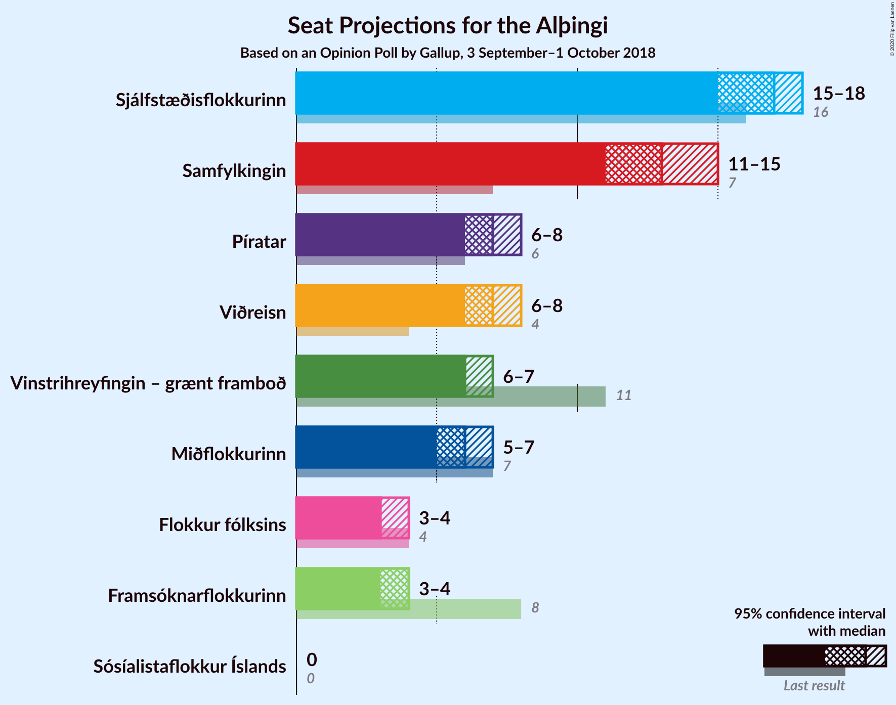
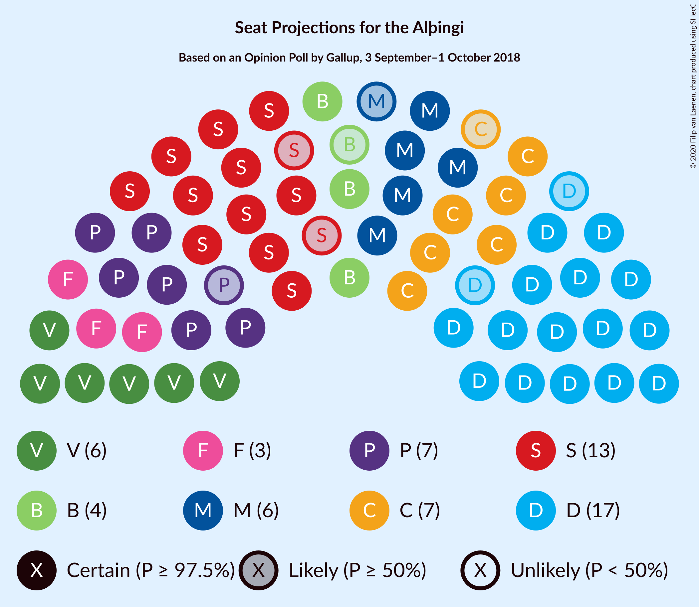
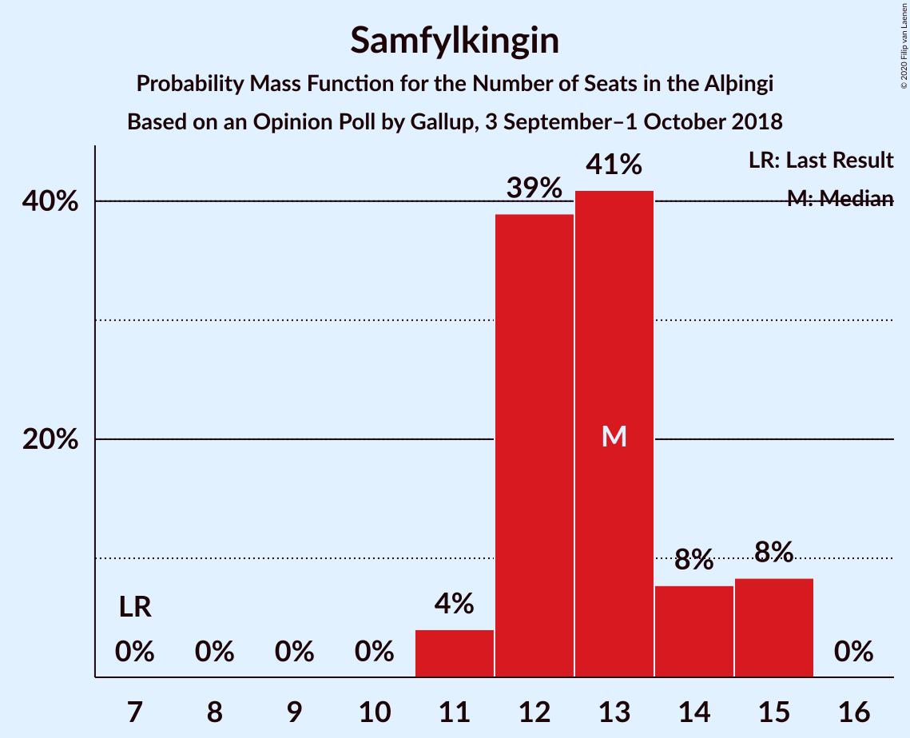
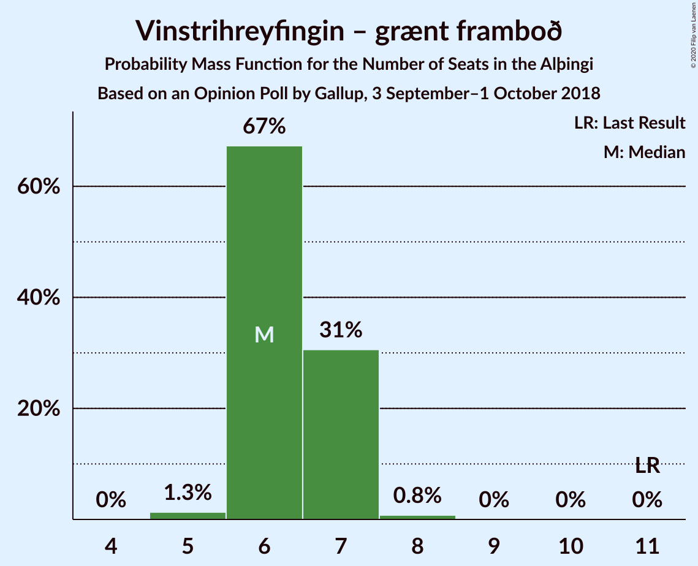
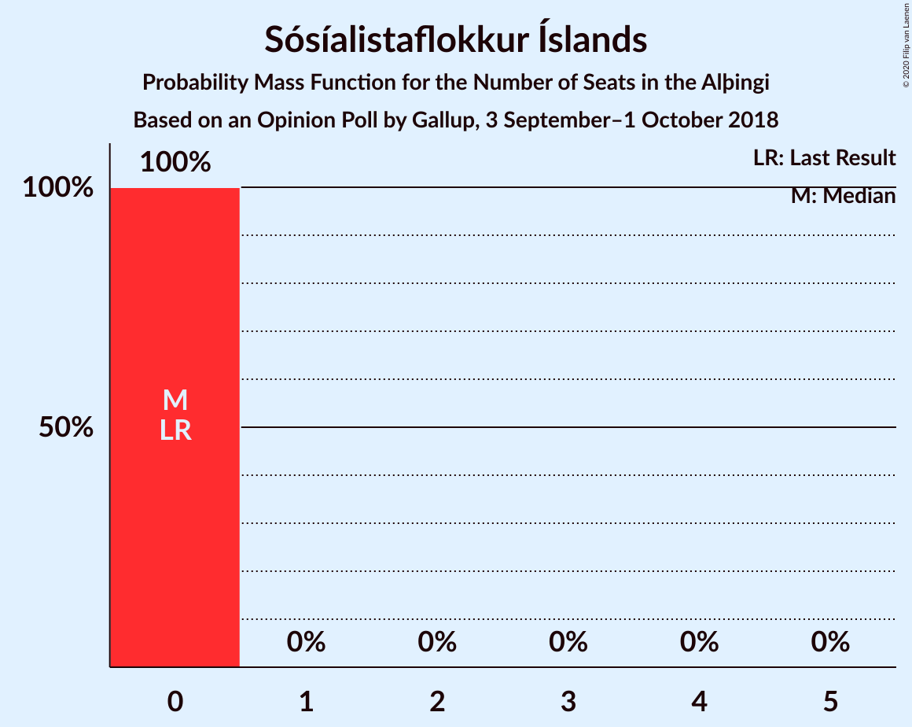
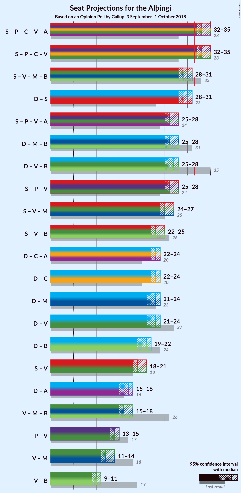
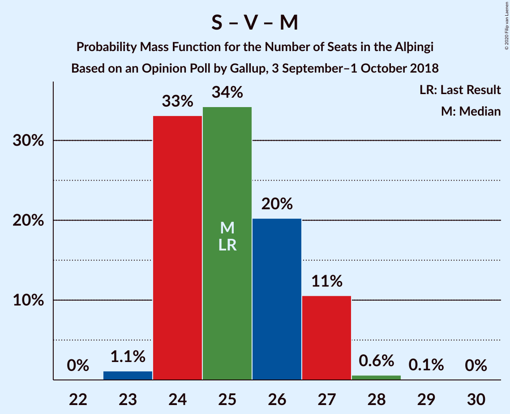
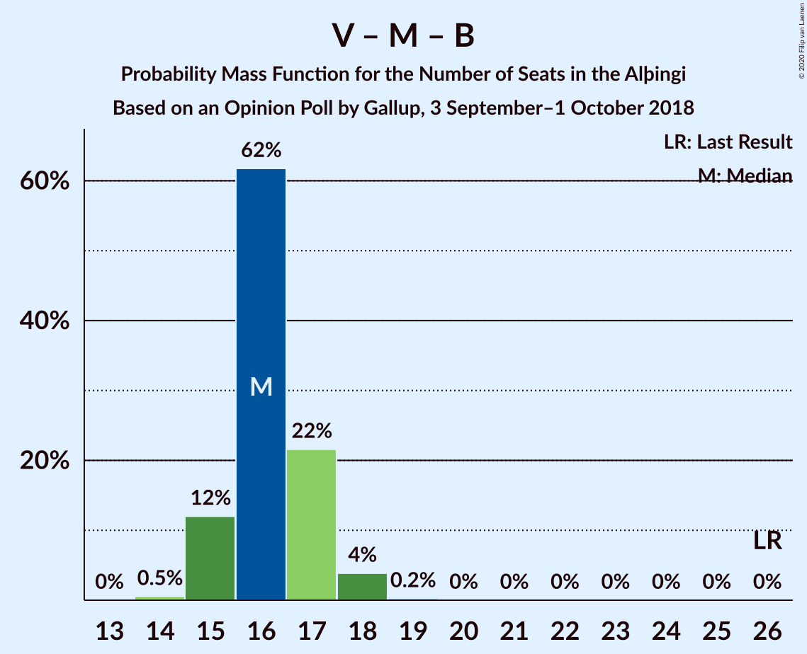

# Opinion Poll by Gallup, 3 September–1 October 2018

<a href="#voting-intentions">Voting Intentions</a> | <a href="#seats">Seats</a> | <a href="#coalitions">Coalitions</a> | <a href="#technical-information">Technical Information</a>

## Voting Intentions

### Confidence Intervals

| Party | Last Result | Poll Result | 80% Confidence Interval | 90% Confidence Interval | 95% Confidence Interval | 99% Confidence Interval |
|:-----:|:-----------:|:-----------:|:-----------------------:|:-----------------------:|:-----------------------:|:-----------------------:|
| Sjálfstæðisflokkurinn | 25.2% | 24.6% | 23.6–25.7% |23.3–25.9% |23.1–26.2% |22.6–26.7% |
| Samfylkingin | 12.1% | 19.3% | 18.4–20.3% |18.1–20.5% |17.9–20.8% |17.5–21.2% |
| Píratar | 9.2% | 11.5% | 10.8–12.3% |10.6–12.5% |10.4–12.7% |10.1–13.1% |
| Viðreisn | 6.7% | 10.7% | 10.0–11.5% |9.8–11.7% |9.6–11.9% |9.3–12.2% |
| Vinstrihreyfingin – grænt framboð | 16.9% | 10.3% | 9.6–11.1% |9.4–11.3% |9.3–11.5% |8.9–11.8% |
| Miðflokkurinn | 10.9% | 9.8% | 9.1–10.5% |8.9–10.7% |8.8–10.9% |8.5–11.3% |
| Framsóknarflokkurinn | 10.7% | 6.6% | 6.0–7.2% |5.9–7.4% |5.7–7.6% |5.5–7.9% |
| Flokkur fólksins | 6.9% | 5.9% | 5.4–6.5% |5.2–6.7% |5.1–6.8% |4.9–7.1% |
| Sósíalistaflokkur Íslands | 0.0% | 0.9% | 0.7–1.2% |0.7–1.2% |0.6–1.3% |0.5–1.4% |

*Note:* The poll result column reflects the actual value used in the calculations. Published results may vary slightly, and in addition be rounded to fewer digits.

## Seats

### Confidence Intervals

| Party | Last Result | Median | 80% Confidence Interval | 90% Confidence Interval | 95% Confidence Interval | 99% Confidence Interval |
|:-----:|:-----------:|:------:|:-----------------------:|:-----------------------:|:-----------------------:|:-----------------------:|
| <a href="#sjálfstæðisflokkurinn">Sjálfstæðisflokkurinn</a> | 16 | 17 | 17 |17 |17 |15–17 |
| <a href="#samfylkingin">Samfylkingin</a> | 7 | 11 | 11–13 |11–13 |11–13 |11–15 |
| <a href="#píratar">Píratar</a> | 6 | 8 | 6–8 |6–8 |6–8 |6–8 |
| <a href="#viðreisn">Viðreisn</a> | 4 | 7 | 7 |7 |7 |6–7 |
| <a href="#vinstrihreyfingin-–-grænt-framboð">Vinstrihreyfingin – grænt framboð</a> | 11 | 7 | 6–7 |6–7 |6–7 |6–7 |
| <a href="#miðflokkurinn">Miðflokkurinn</a> | 7 | 6 | 6–7 |6–7 |6–7 |6–7 |
| <a href="#framsóknarflokkurinn">Framsóknarflokkurinn</a> | 8 | 4 | 4 |4 |4 |3–4 |
| <a href="#flokkur-fólksins">Flokkur fólksins</a> | 4 | 3 | 3 |3 |3 |3–4 |
| <a href="#sósíalistaflokkur-íslands">Sósíalistaflokkur Íslands</a> | 0 | 0 | 0 |0 |0 |0 |

### Sjálfstæðisflokkurinn

*For a full overview of the results for this party, see the [Sjálfstæðisflokkurinn](party-sjálfstæðisflokkurinn.html) page.*

| Number of Seats | Probability | Accumulated | Special Marks |
|:---------------:|:-----------:|:-----------:|:-------------:|
| 15 | 0.9% | 100% |  |
| 16 | 0.1% | 99.1% | Last Result |
| 17 | 99.0% | 99.0% | Median |
| 18 | 0% | 0% |  |

### Samfylkingin

*For a full overview of the results for this party, see the [Samfylkingin](party-samfylkingin.html) page.*

| Number of Seats | Probability | Accumulated | Special Marks |
|:---------------:|:-----------:|:-----------:|:-------------:|
| 7 | 0% | 100% | Last Result |
| 8 | 0% | 100% |  |
| 9 | 0% | 100% |  |
| 10 | 0% | 100% |  |
| 11 | 83% | 100% | Median |
| 12 | 0% | 17% |  |
| 13 | 16% | 17% |  |
| 14 | 0% | 0.7% |  |
| 15 | 0.7% | 0.7% |  |
| 16 | 0% | 0% |  |

### Píratar

*For a full overview of the results for this party, see the [Píratar](party-píratar.html) page.*

| Number of Seats | Probability | Accumulated | Special Marks |
|:---------------:|:-----------:|:-----------:|:-------------:|
| 6 | 15% | 100% | Last Result |
| 7 | 0% | 85% |  |
| 8 | 85% | 85% | Median |
| 9 | 0% | 0% |  |

### Viðreisn

*For a full overview of the results for this party, see the [Viðreisn](party-viðreisn.html) page.*

| Number of Seats | Probability | Accumulated | Special Marks |
|:---------------:|:-----------:|:-----------:|:-------------:|
| 4 | 0% | 100% | Last Result |
| 5 | 0% | 100% |  |
| 6 | 0.6% | 100% |  |
| 7 | 99.4% | 99.4% | Median |
| 8 | 0% | 0% |  |

### Vinstrihreyfingin – grænt framboð

*For a full overview of the results for this party, see the [Vinstrihreyfingin – grænt framboð](party-vinstrihreyfingin–græntframboð.html) page.*

| Number of Seats | Probability | Accumulated | Special Marks |
|:---------------:|:-----------:|:-----------:|:-------------:|
| 6 | 17% | 100% |  |
| 7 | 83% | 83% | Median |
| 8 | 0% | 0% |  |
| 9 | 0% | 0% |  |
| 10 | 0% | 0% |  |
| 11 | 0% | 0% | Last Result |

### Miðflokkurinn

*For a full overview of the results for this party, see the [Miðflokkurinn](party-miðflokkurinn.html) page.*

| Number of Seats | Probability | Accumulated | Special Marks |
|:---------------:|:-----------:|:-----------:|:-------------:|
| 5 | 0.2% | 100% |  |
| 6 | 85% | 99.8% | Median |
| 7 | 15% | 15% | Last Result |
| 8 | 0% | 0% |  |

### Framsóknarflokkurinn

*For a full overview of the results for this party, see the [Framsóknarflokkurinn](party-framsóknarflokkurinn.html) page.*

| Number of Seats | Probability | Accumulated | Special Marks |
|:---------------:|:-----------:|:-----------:|:-------------:|
| 3 | 1.3% | 100% |  |
| 4 | 98.5% | 98.7% | Median |
| 5 | 0.1% | 0.1% |  |
| 6 | 0% | 0% |  |
| 7 | 0% | 0% |  |
| 8 | 0% | 0% | Last Result |

### Flokkur fólksins

*For a full overview of the results for this party, see the [Flokkur fólksins](party-flokkurfólksins.html) page.*

| Number of Seats | Probability | Accumulated | Special Marks |
|:---------------:|:-----------:|:-----------:|:-------------:|
| 3 | 99.4% | 100% | Median |
| 4 | 0.6% | 0.6% | Last Result |
| 5 | 0% | 0% |  |

### Sósíalistaflokkur Íslands

*For a full overview of the results for this party, see the [Sósíalistaflokkur Íslands](party-sósíalistaflokkuríslands.html) page.*

| Number of Seats | Probability | Accumulated | Special Marks |
|:---------------:|:-----------:|:-----------:|:-------------:|
| 0 | 100% | 100% | Last Result, Median |

## Coalitions

### Confidence Intervals

| Coalition | Last Result | Median | Majority? | 80% Confidence Interval | 90% Confidence Interval | 95% Confidence Interval | 99% Confidence Interval |
|:---------:|:-----------:|:------:|:---------:|:-----------------------:|:-----------------------:|:-----------------------:|:-----------------------:|
| Samfylkingin – Píratar – Viðreisn – Vinstrihreyfingin – grænt framboð | 28 | 33 | 100% | 32–33 | 32–33 | 32–33 | 32–34 |
| Samfylkingin – Vinstrihreyfingin – grænt framboð – Miðflokkurinn – Framsóknarflokkurinn | 33 | 28 | 0.4% | 28–30 | 28–30 | 28–30 | 28–30 |
| Sjálfstæðisflokkurinn – Samfylkingin | 23 | 28 | 0% | 28–30 | 28–30 | 28–30 | 28–30 |
| Sjálfstæðisflokkurinn – Miðflokkurinn – Framsóknarflokkurinn | 31 | 27 | 0% | 27–28 | 27–28 | 27–28 | 25–28 |
| Sjálfstæðisflokkurinn – Vinstrihreyfingin – grænt framboð – Framsóknarflokkurinn | 35 | 28 | 0% | 27–28 | 27–28 | 27–28 | 25–28 |
| Samfylkingin – Píratar – Vinstrihreyfingin – grænt framboð | 24 | 26 | 0% | 25–26 | 25–26 | 25–26 | 25–28 |
| Samfylkingin – Vinstrihreyfingin – grænt framboð – Miðflokkurinn | 25 | 24 | 0% | 24–26 | 24–26 | 24–26 | 24–27 |
| Sjálfstæðisflokkurinn – Viðreisn | 20 | 24 | 0% | 24 | 24 | 24 | 21–24 |
| Sjálfstæðisflokkurinn – Miðflokkurinn | 23 | 23 | 0% | 23–24 | 23–24 | 23–24 | 21–24 |
| Sjálfstæðisflokkurinn – Vinstrihreyfingin – grænt framboð | 27 | 24 | 0% | 23–24 | 23–24 | 23–24 | 21–24 |
| Samfylkingin – Vinstrihreyfingin – grænt framboð – Framsóknarflokkurinn | 26 | 22 | 0% | 22–23 | 22–23 | 22–23 | 22–24 |
| Sjálfstæðisflokkurinn – Framsóknarflokkurinn | 24 | 21 | 0% | 21 | 21 | 21 | 19–21 |
| Samfylkingin – Vinstrihreyfingin – grænt framboð | 18 | 18 | 0% | 18–19 | 18–19 | 18–19 | 18–21 |
| Vinstrihreyfingin – grænt framboð – Miðflokkurinn – Framsóknarflokkurinn | 26 | 17 | 0% | 17 | 17 | 17 | 15–17 |
| Píratar – Vinstrihreyfingin – grænt framboð | 17 | 15 | 0% | 12–15 | 12–15 | 12–15 | 12–15 |
| Vinstrihreyfingin – grænt framboð – Miðflokkurinn | 18 | 13 | 0% | 13 | 13 | 13 | 12–13 |
| Vinstrihreyfingin – grænt framboð – Framsóknarflokkurinn | 19 | 11 | 0% | 10–11 | 10–11 | 10–11 | 9–11 |

### Samfylkingin – Píratar – Viðreisn – Vinstrihreyfingin – grænt framboð

| Number of Seats | Probability | Accumulated | Special Marks |
|:---------------:|:-----------:|:-----------:|:-------------:|
| 28 | 0% | 100% | Last Result |
| 29 | 0% | 100% |  |
| 30 | 0% | 100% |  |
| 31 | 0% | 100% |  |
| 32 | 15% | 100% | Majority |
| 33 | 83% | 85% | Median |
| 34 | 2% | 2% |  |
| 35 | 0.3% | 0.3% |  |
| 36 | 0% | 0% |  |

### Samfylkingin – Vinstrihreyfingin – grænt framboð – Miðflokkurinn – Framsóknarflokkurinn

| Number of Seats | Probability | Accumulated | Special Marks |
|:---------------:|:-----------:|:-----------:|:-------------:|
| 28 | 84% | 100% | Median |
| 29 | 0.1% | 16% |  |
| 30 | 15% | 16% |  |
| 31 | 0% | 0.4% |  |
| 32 | 0.4% | 0.4% | Majority |
| 33 | 0% | 0% | Last Result |

### Sjálfstæðisflokkurinn – Samfylkingin

| Number of Seats | Probability | Accumulated | Special Marks |
|:---------------:|:-----------:|:-----------:|:-------------:|
| 23 | 0% | 100% | Last Result |
| 24 | 0% | 100% |  |
| 25 | 0% | 100% |  |
| 26 | 0% | 100% |  |
| 27 | 0% | 100% |  |
| 28 | 83% | 100% | Median |
| 29 | 0.1% | 17% |  |
| 30 | 17% | 17% |  |
| 31 | 0% | 0% |  |

### Sjálfstæðisflokkurinn – Miðflokkurinn – Framsóknarflokkurinn

| Number of Seats | Probability | Accumulated | Special Marks |
|:---------------:|:-----------:|:-----------:|:-------------:|
| 24 | 0.3% | 100% |  |
| 25 | 0.2% | 99.7% |  |
| 26 | 1.5% | 99.5% |  |
| 27 | 83% | 98% | Median |
| 28 | 15% | 15% |  |
| 29 | 0% | 0% |  |
| 30 | 0% | 0% |  |
| 31 | 0% | 0% | Last Result |

### Sjálfstæðisflokkurinn – Vinstrihreyfingin – grænt framboð – Framsóknarflokkurinn

| Number of Seats | Probability | Accumulated | Special Marks |
|:---------------:|:-----------:|:-----------:|:-------------:|
| 24 | 0.3% | 100% |  |
| 25 | 0.4% | 99.7% |  |
| 26 | 1.2% | 99.3% |  |
| 27 | 15% | 98% |  |
| 28 | 83% | 83% | Median |
| 29 | 0.1% | 0.1% |  |
| 30 | 0% | 0% |  |
| 31 | 0% | 0% |  |
| 32 | 0% | 0% | Majority |
| 33 | 0% | 0% |  |
| 34 | 0% | 0% |  |
| 35 | 0% | 0% | Last Result |

### Samfylkingin – Píratar – Vinstrihreyfingin – grænt framboð

| Number of Seats | Probability | Accumulated | Special Marks |
|:---------------:|:-----------:|:-----------:|:-------------:|
| 24 | 0% | 100% | Last Result |
| 25 | 15% | 100% |  |
| 26 | 83% | 85% | Median |
| 27 | 1.5% | 2% |  |
| 28 | 0.2% | 0.5% |  |
| 29 | 0.3% | 0.3% |  |
| 30 | 0% | 0% |  |

### Samfylkingin – Vinstrihreyfingin – grænt framboð – Miðflokkurinn

| Number of Seats | Probability | Accumulated | Special Marks |
|:---------------:|:-----------:|:-----------:|:-------------:|
| 23 | 0.1% | 100% |  |
| 24 | 83% | 99.9% | Median |
| 25 | 1.0% | 17% | Last Result |
| 26 | 15% | 16% |  |
| 27 | 0.3% | 0.8% |  |
| 28 | 0.4% | 0.4% |  |
| 29 | 0% | 0% |  |

### Sjálfstæðisflokkurinn – Viðreisn

| Number of Seats | Probability | Accumulated | Special Marks |
|:---------------:|:-----------:|:-----------:|:-------------:|
| 20 | 0% | 100% | Last Result |
| 21 | 0.5% | 100% |  |
| 22 | 0.5% | 99.5% |  |
| 23 | 0% | 99.0% |  |
| 24 | 99.0% | 99.0% | Median |
| 25 | 0% | 0% |  |

### Sjálfstæðisflokkurinn – Miðflokkurinn

| Number of Seats | Probability | Accumulated | Special Marks |
|:---------------:|:-----------:|:-----------:|:-------------:|
| 21 | 0.6% | 100% |  |
| 22 | 0.5% | 99.4% |  |
| 23 | 84% | 98.9% | Last Result, Median |
| 24 | 15% | 15% |  |
| 25 | 0% | 0% |  |

### Sjálfstæðisflokkurinn – Vinstrihreyfingin – grænt framboð

| Number of Seats | Probability | Accumulated | Special Marks |
|:---------------:|:-----------:|:-----------:|:-------------:|
| 21 | 0.7% | 100% |  |
| 22 | 0.2% | 99.3% |  |
| 23 | 16% | 99.0% |  |
| 24 | 83% | 83% | Median |
| 25 | 0% | 0% |  |
| 26 | 0% | 0% |  |
| 27 | 0% | 0% | Last Result |

### Samfylkingin – Vinstrihreyfingin – grænt framboð – Framsóknarflokkurinn

| Number of Seats | Probability | Accumulated | Special Marks |
|:---------------:|:-----------:|:-----------:|:-------------:|
| 22 | 84% | 100% | Median |
| 23 | 15% | 16% |  |
| 24 | 0.6% | 1.0% |  |
| 25 | 0.4% | 0.4% |  |
| 26 | 0% | 0% | Last Result |

### Sjálfstæðisflokkurinn – Framsóknarflokkurinn

| Number of Seats | Probability | Accumulated | Special Marks |
|:---------------:|:-----------:|:-----------:|:-------------:|
| 18 | 0.3% | 100% |  |
| 19 | 0.6% | 99.7% |  |
| 20 | 1.0% | 99.1% |  |
| 21 | 98% | 98% | Median |
| 22 | 0.1% | 0.1% |  |
| 23 | 0% | 0% |  |
| 24 | 0% | 0% | Last Result |

### Samfylkingin – Vinstrihreyfingin – grænt framboð

| Number of Seats | Probability | Accumulated | Special Marks |
|:---------------:|:-----------:|:-----------:|:-------------:|
| 18 | 83% | 100% | Last Result, Median |
| 19 | 16% | 17% |  |
| 20 | 0.2% | 0.9% |  |
| 21 | 0.7% | 0.7% |  |
| 22 | 0% | 0% |  |

### Vinstrihreyfingin – grænt framboð – Miðflokkurinn – Framsóknarflokkurinn

| Number of Seats | Probability | Accumulated | Special Marks |
|:---------------:|:-----------:|:-----------:|:-------------:|
| 15 | 1.3% | 100% |  |
| 16 | 0.1% | 98.7% |  |
| 17 | 98.6% | 98.6% | Median |
| 18 | 0% | 0% |  |
| 19 | 0% | 0% |  |
| 20 | 0% | 0% |  |
| 21 | 0% | 0% |  |
| 22 | 0% | 0% |  |
| 23 | 0% | 0% |  |
| 24 | 0% | 0% |  |
| 25 | 0% | 0% |  |
| 26 | 0% | 0% | Last Result |

### Píratar – Vinstrihreyfingin – grænt framboð

| Number of Seats | Probability | Accumulated | Special Marks |
|:---------------:|:-----------:|:-----------:|:-------------:|
| 12 | 15% | 100% |  |
| 13 | 0% | 85% |  |
| 14 | 1.4% | 85% |  |
| 15 | 83% | 83% | Median |
| 16 | 0% | 0% |  |
| 17 | 0% | 0% | Last Result |

### Vinstrihreyfingin – grænt framboð – Miðflokkurinn

| Number of Seats | Probability | Accumulated | Special Marks |
|:---------------:|:-----------:|:-----------:|:-------------:|
| 11 | 0.1% | 100% |  |
| 12 | 1.4% | 99.9% |  |
| 13 | 98% | 98% | Median |
| 14 | 0% | 0% |  |
| 15 | 0% | 0% |  |
| 16 | 0% | 0% |  |
| 17 | 0% | 0% |  |
| 18 | 0% | 0% | Last Result |

### Vinstrihreyfingin – grænt framboð – Framsóknarflokkurinn

| Number of Seats | Probability | Accumulated | Special Marks |
|:---------------:|:-----------:|:-----------:|:-------------:|
| 9 | 1.3% | 100% |  |
| 10 | 15% | 98.7% |  |
| 11 | 83% | 83% | Median |
| 12 | 0.1% | 0.1% |  |
| 13 | 0% | 0% |  |
| 14 | 0% | 0% |  |
| 15 | 0% | 0% |  |
| 16 | 0% | 0% |  |
| 17 | 0% | 0% |  |
| 18 | 0% | 0% |  |
| 19 | 0% | 0% | Last Result |

## Technical Information

### Opinion Poll

+ **Polling firm:** Gallup
+ **Commissioner(s):** —
+ **Fieldwork period:** 3 September–1 October 2018

### Calculations

+ **Sample size:** 2910
+ **Simulations done:** 1,024
+ **Error estimate:** 1.72%

