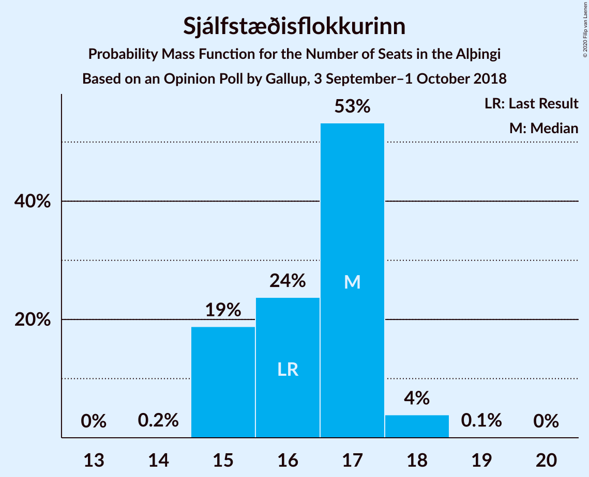
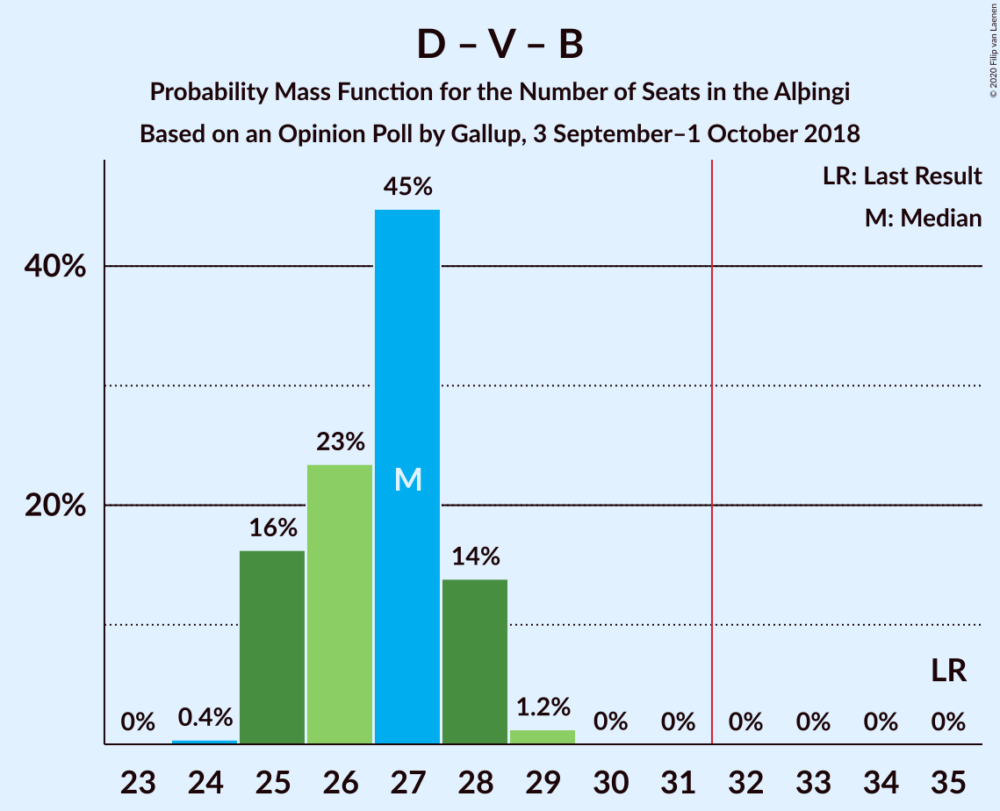
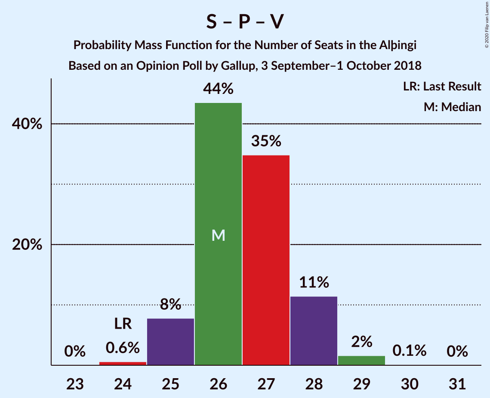

# Opinion Poll by Gallup, 3 September–1 October 2018

<a href="#voting-intentions">Voting Intentions</a> | <a href="#seats">Seats</a> | <a href="#coalitions">Coalitions</a> | <a href="#technical-information">Technical Information</a>

## Voting Intentions

### Confidence Intervals

| Party | Last Result | Poll Result | 80% Confidence Interval | 90% Confidence Interval | 95% Confidence Interval | 99% Confidence Interval |
|:-----:|:-----------:|:-----------:|:-----------------------:|:-----------------------:|:-----------------------:|:-----------------------:|
| Sjálfstæðisflokkurinn | 25.2% | 24.6% | 23.6–25.7% |23.3–25.9% |23.1–26.2% |22.6–26.7% |
| Samfylkingin | 12.1% | 19.3% | 18.4–20.3% |18.1–20.5% |17.9–20.8% |17.5–21.2% |
| Píratar | 9.2% | 11.5% | 10.8–12.3% |10.6–12.5% |10.4–12.7% |10.1–13.1% |
| Viðreisn | 6.7% | 10.7% | 10.0–11.5% |9.8–11.7% |9.6–11.9% |9.3–12.2% |
| Vinstrihreyfingin – grænt framboð | 16.9% | 10.3% | 9.6–11.1% |9.4–11.3% |9.3–11.5% |8.9–11.8% |
| Miðflokkurinn | 10.9% | 9.8% | 9.1–10.5% |8.9–10.7% |8.8–10.9% |8.5–11.3% |
| Framsóknarflokkurinn | 10.7% | 6.6% | 6.0–7.2% |5.9–7.4% |5.7–7.6% |5.5–7.9% |
| Flokkur fólksins | 6.9% | 5.9% | 5.4–6.5% |5.2–6.7% |5.1–6.8% |4.9–7.1% |

*Note:* The poll result column reflects the actual value used in the calculations. Published results may vary slightly, and in addition be rounded to fewer digits.

## Seats

### Confidence Intervals

| Party | Last Result | Median | 80% Confidence Interval | 90% Confidence Interval | 95% Confidence Interval | 99% Confidence Interval |
|:-----:|:-----------:|:------:|:-----------------------:|:-----------------------:|:-----------------------:|:-----------------------:|
| <a href="#sjálfstæðisflokkurinn">Sjálfstæðisflokkurinn</a> | 16 | 17 | 16–17 |15–18 |15–18 |15–18 |
| <a href="#samfylkingin">Samfylkingin</a> | 7 | 13 | 12–14 |12–15 |12–15 |11–15 |
| <a href="#píratar">Píratar</a> | 6 | 7 | 7–8 |7–8 |6–8 |6–8 |
| <a href="#viðreisn">Viðreisn</a> | 4 | 7 | 6–7 |6–7 |6–7 |6–8 |
| <a href="#vinstrihreyfingin-–-grænt-framboð">Vinstrihreyfingin – grænt framboð</a> | 11 | 6 | 6–7 |6–7 |6–7 |5–7 |
| <a href="#miðflokkurinn">Miðflokkurinn</a> | 7 | 6 | 6 |5–7 |5–7 |5–7 |
| <a href="#framsóknarflokkurinn">Framsóknarflokkurinn</a> | 8 | 4 | 3–4 |3–4 |3–5 |3–5 |
| <a href="#flokkur-fólksins">Flokkur fólksins</a> | 4 | 3 | 3–4 |3–4 |3–4 |0–4 |

### Sjálfstæðisflokkurinn

*For a full overview of the results for this party, see the [Sjálfstæðisflokkurinn](party-sjálfstæðisflokkurinn.html) page.*

| Number of Seats | Probability | Accumulated | Special Marks |
|:---------------:|:-----------:|:-----------:|:-------------:|
| 14 | 0.3% | 100% |  |
| 15 | 9% | 99.7% |  |
| 16 | 20% | 90% | Last Result |
| 17 | 63% | 71% | Median |
| 18 | 7% | 8% |  |
| 19 | 0.4% | 0.4% |  |
| 20 | 0% | 0% |  |

### Samfylkingin

*For a full overview of the results for this party, see the [Samfylkingin](party-samfylkingin.html) page.*

| Number of Seats | Probability | Accumulated | Special Marks |
|:---------------:|:-----------:|:-----------:|:-------------:|
| 7 | 0% | 100% | Last Result |
| 8 | 0% | 100% |  |
| 9 | 0% | 100% |  |
| 10 | 0% | 100% |  |
| 11 | 2% | 100% |  |
| 12 | 21% | 98% |  |
| 13 | 58% | 77% | Median |
| 14 | 14% | 19% |  |
| 15 | 5% | 5% |  |
| 16 | 0% | 0% |  |

### Píratar

*For a full overview of the results for this party, see the [Píratar](party-píratar.html) page.*

| Number of Seats | Probability | Accumulated | Special Marks |
|:---------------:|:-----------:|:-----------:|:-------------:|
| 6 | 5% | 100% | Last Result |
| 7 | 71% | 95% | Median |
| 8 | 24% | 24% |  |
| 9 | 0.2% | 0.2% |  |
| 10 | 0% | 0% |  |

### Viðreisn

*For a full overview of the results for this party, see the [Viðreisn](party-viðreisn.html) page.*

| Number of Seats | Probability | Accumulated | Special Marks |
|:---------------:|:-----------:|:-----------:|:-------------:|
| 4 | 0% | 100% | Last Result |
| 5 | 0.2% | 100% |  |
| 6 | 45% | 99.8% |  |
| 7 | 52% | 55% | Median |
| 8 | 2% | 2% |  |
| 9 | 0% | 0% |  |

### Vinstrihreyfingin – grænt framboð

*For a full overview of the results for this party, see the [Vinstrihreyfingin – grænt framboð](party-vinstrihreyfingin–græntframboð.html) page.*

| Number of Seats | Probability | Accumulated | Special Marks |
|:---------------:|:-----------:|:-----------:|:-------------:|
| 5 | 2% | 100% |  |
| 6 | 66% | 98% | Median |
| 7 | 31% | 31% |  |
| 8 | 0.4% | 0.4% |  |
| 9 | 0% | 0% |  |
| 10 | 0% | 0% |  |
| 11 | 0% | 0% | Last Result |

### Miðflokkurinn

*For a full overview of the results for this party, see the [Miðflokkurinn](party-miðflokkurinn.html) page.*

| Number of Seats | Probability | Accumulated | Special Marks |
|:---------------:|:-----------:|:-----------:|:-------------:|
| 5 | 9% | 100% |  |
| 6 | 81% | 91% | Median |
| 7 | 9% | 9% | Last Result |
| 8 | 0.3% | 0.4% |  |
| 9 | 0.2% | 0.2% |  |
| 10 | 0% | 0% |  |

### Framsóknarflokkurinn

*For a full overview of the results for this party, see the [Framsóknarflokkurinn](party-framsóknarflokkurinn.html) page.*

| Number of Seats | Probability | Accumulated | Special Marks |
|:---------------:|:-----------:|:-----------:|:-------------:|
| 3 | 10% | 100% |  |
| 4 | 87% | 90% | Median |
| 5 | 3% | 3% |  |
| 6 | 0% | 0% |  |
| 7 | 0% | 0% |  |
| 8 | 0% | 0% | Last Result |

### Flokkur fólksins

*For a full overview of the results for this party, see the [Flokkur fólksins](party-flokkurfólksins.html) page.*

| Number of Seats | Probability | Accumulated | Special Marks |
|:---------------:|:-----------:|:-----------:|:-------------:|
| 0 | 1.4% | 100% |  |
| 1 | 0% | 98.6% |  |
| 2 | 0% | 98.6% |  |
| 3 | 61% | 98.6% | Median |
| 4 | 37% | 37% | Last Result |
| 5 | 0.1% | 0.1% |  |
| 6 | 0% | 0% |  |

## Coalitions

### Confidence Intervals

| Coalition | Last Result | Median | Majority? | 80% Confidence Interval | 90% Confidence Interval | 95% Confidence Interval | 99% Confidence Interval |
|:---------:|:-----------:|:------:|:---------:|:-----------------------:|:-----------------------:|:-----------------------:|:-----------------------:|
| Samfylkingin – Píratar – Viðreisn – Vinstrihreyfingin – grænt framboð | 28 | 33 | 97% | 32–34 | 32–35 | 31–35 | 31–36 |
| Samfylkingin – Vinstrihreyfingin – grænt framboð – Miðflokkurinn – Framsóknarflokkurinn | 33 | 29 | 1.3% | 28–30 | 28–31 | 28–31 | 27–32 |
| Sjálfstæðisflokkurinn – Samfylkingin | 23 | 30 | 1.0% | 28–31 | 28–31 | 28–31 | 27–32 |
| Sjálfstæðisflokkurinn – Miðflokkurinn – Framsóknarflokkurinn | 31 | 27 | 0% | 26–27 | 25–28 | 25–28 | 24–29 |
| Sjálfstæðisflokkurinn – Vinstrihreyfingin – grænt framboð – Framsóknarflokkurinn | 35 | 27 | 0% | 26–28 | 25–28 | 25–28 | 25–29 |
| Samfylkingin – Píratar – Vinstrihreyfingin – grænt framboð | 24 | 26 | 0% | 26–28 | 25–28 | 25–28 | 25–29 |
| Samfylkingin – Vinstrihreyfingin – grænt framboð – Miðflokkurinn | 25 | 25 | 0% | 24–26 | 24–27 | 24–27 | 23–28 |
| Samfylkingin – Vinstrihreyfingin – grænt framboð – Framsóknarflokkurinn | 26 | 23 | 0% | 22–24 | 22–25 | 22–25 | 21–26 |
| Sjálfstæðisflokkurinn – Viðreisn | 20 | 23 | 0% | 22–24 | 22–24 | 21–25 | 21–25 |
| Sjálfstæðisflokkurinn – Miðflokkurinn | 23 | 23 | 0% | 22–23 | 21–24 | 21–24 | 20–25 |
| Sjálfstæðisflokkurinn – Vinstrihreyfingin – grænt framboð | 27 | 23 | 0% | 22–24 | 21–24 | 21–24 | 21–25 |
| Sjálfstæðisflokkurinn – Framsóknarflokkurinn | 24 | 21 | 0% | 19–21 | 19–22 | 19–22 | 18–22 |
| Samfylkingin – Vinstrihreyfingin – grænt framboð | 18 | 19 | 0% | 18–20 | 18–21 | 18–21 | 17–22 |
| Vinstrihreyfingin – grænt framboð – Miðflokkurinn – Framsóknarflokkurinn | 26 | 16 | 0% | 15–17 | 15–17 | 15–18 | 15–18 |
| Píratar – Vinstrihreyfingin – grænt framboð | 17 | 13 | 0% | 13–14 | 13–15 | 12–15 | 12–15 |
| Vinstrihreyfingin – grænt framboð – Miðflokkurinn | 18 | 12 | 0% | 12–13 | 11–13 | 11–14 | 11–14 |
| Vinstrihreyfingin – grænt framboð – Framsóknarflokkurinn | 19 | 10 | 0% | 10–11 | 9–11 | 9–11 | 9–12 |

### Samfylkingin – Píratar – Viðreisn – Vinstrihreyfingin – grænt framboð

| Number of Seats | Probability | Accumulated | Special Marks |
|:---------------:|:-----------:|:-----------:|:-------------:|
| 28 | 0% | 100% | Last Result |
| 29 | 0% | 100% |  |
| 30 | 0.1% | 100% |  |
| 31 | 2% | 99.9% |  |
| 32 | 22% | 97% | Majority |
| 33 | 50% | 76% | Median |
| 34 | 20% | 26% |  |
| 35 | 5% | 6% |  |
| 36 | 0.6% | 0.7% |  |
| 37 | 0.1% | 0.1% |  |
| 38 | 0% | 0% |  |

### Samfylkingin – Vinstrihreyfingin – grænt framboð – Miðflokkurinn – Framsóknarflokkurinn

| Number of Seats | Probability | Accumulated | Special Marks |
|:---------------:|:-----------:|:-----------:|:-------------:|
| 27 | 1.4% | 100% |  |
| 28 | 16% | 98.6% |  |
| 29 | 51% | 82% | Median |
| 30 | 23% | 31% |  |
| 31 | 7% | 8% |  |
| 32 | 1.2% | 1.3% | Majority |
| 33 | 0.1% | 0.1% | Last Result |
| 34 | 0% | 0% |  |

### Sjálfstæðisflokkurinn – Samfylkingin

| Number of Seats | Probability | Accumulated | Special Marks |
|:---------------:|:-----------:|:-----------:|:-------------:|
| 23 | 0% | 100% | Last Result |
| 24 | 0% | 100% |  |
| 25 | 0% | 100% |  |
| 26 | 0.1% | 100% |  |
| 27 | 1.3% | 99.9% |  |
| 28 | 10% | 98.6% |  |
| 29 | 22% | 88% |  |
| 30 | 52% | 66% | Median |
| 31 | 13% | 14% |  |
| 32 | 1.0% | 1.0% | Majority |
| 33 | 0% | 0% |  |

### Sjálfstæðisflokkurinn – Miðflokkurinn – Framsóknarflokkurinn

| Number of Seats | Probability | Accumulated | Special Marks |
|:---------------:|:-----------:|:-----------:|:-------------:|
| 24 | 1.3% | 100% |  |
| 25 | 8% | 98.7% |  |
| 26 | 29% | 91% |  |
| 27 | 52% | 62% | Median |
| 28 | 8% | 10% |  |
| 29 | 1.1% | 1.1% |  |
| 30 | 0% | 0% |  |
| 31 | 0% | 0% | Last Result |

### Sjálfstæðisflokkurinn – Vinstrihreyfingin – grænt framboð – Framsóknarflokkurinn

| Number of Seats | Probability | Accumulated | Special Marks |
|:---------------:|:-----------:|:-----------:|:-------------:|
| 24 | 0.4% | 100% |  |
| 25 | 6% | 99.6% |  |
| 26 | 22% | 94% |  |
| 27 | 50% | 72% | Median |
| 28 | 20% | 22% |  |
| 29 | 2% | 2% |  |
| 30 | 0.1% | 0.1% |  |
| 31 | 0% | 0% |  |
| 32 | 0% | 0% | Majority |
| 33 | 0% | 0% |  |
| 34 | 0% | 0% |  |
| 35 | 0% | 0% | Last Result |

### Samfylkingin – Píratar – Vinstrihreyfingin – grænt framboð

| Number of Seats | Probability | Accumulated | Special Marks |
|:---------------:|:-----------:|:-----------:|:-------------:|
| 24 | 0.5% | 100% | Last Result |
| 25 | 5% | 99.5% |  |
| 26 | 52% | 94% | Median |
| 27 | 32% | 42% |  |
| 28 | 8% | 10% |  |
| 29 | 2% | 2% |  |
| 30 | 0.1% | 0.1% |  |
| 31 | 0% | 0% |  |

### Samfylkingin – Vinstrihreyfingin – grænt framboð – Miðflokkurinn

| Number of Seats | Probability | Accumulated | Special Marks |
|:---------------:|:-----------:|:-----------:|:-------------:|
| 23 | 0.8% | 100% |  |
| 24 | 14% | 99.2% |  |
| 25 | 50% | 85% | Last Result, Median |
| 26 | 26% | 35% |  |
| 27 | 8% | 9% |  |
| 28 | 1.2% | 1.3% |  |
| 29 | 0% | 0% |  |

### Samfylkingin – Vinstrihreyfingin – grænt framboð – Framsóknarflokkurinn

| Number of Seats | Probability | Accumulated | Special Marks |
|:---------------:|:-----------:|:-----------:|:-------------:|
| 21 | 1.3% | 100% |  |
| 22 | 14% | 98.7% |  |
| 23 | 55% | 85% | Median |
| 24 | 21% | 29% |  |
| 25 | 7% | 8% |  |
| 26 | 1.1% | 1.1% | Last Result |
| 27 | 0% | 0% |  |

### Sjálfstæðisflokkurinn – Viðreisn

| Number of Seats | Probability | Accumulated | Special Marks |
|:---------------:|:-----------:|:-----------:|:-------------:|
| 20 | 0.2% | 100% | Last Result |
| 21 | 3% | 99.8% |  |
| 22 | 13% | 97% |  |
| 23 | 43% | 84% |  |
| 24 | 38% | 41% | Median |
| 25 | 3% | 3% |  |
| 26 | 0.2% | 0.2% |  |
| 27 | 0% | 0% |  |

### Sjálfstæðisflokkurinn – Miðflokkurinn

| Number of Seats | Probability | Accumulated | Special Marks |
|:---------------:|:-----------:|:-----------:|:-------------:|
| 20 | 0.8% | 100% |  |
| 21 | 8% | 99.2% |  |
| 22 | 23% | 91% |  |
| 23 | 58% | 68% | Last Result, Median |
| 24 | 9% | 10% |  |
| 25 | 1.0% | 1.0% |  |
| 26 | 0% | 0% |  |

### Sjálfstæðisflokkurinn – Vinstrihreyfingin – grænt framboð

| Number of Seats | Probability | Accumulated | Special Marks |
|:---------------:|:-----------:|:-----------:|:-------------:|
| 20 | 0.1% | 100% |  |
| 21 | 5% | 99.8% |  |
| 22 | 18% | 95% |  |
| 23 | 51% | 76% | Median |
| 24 | 23% | 25% |  |
| 25 | 2% | 2% |  |
| 26 | 0.1% | 0.1% |  |
| 27 | 0% | 0% | Last Result |

### Sjálfstæðisflokkurinn – Framsóknarflokkurinn

| Number of Seats | Probability | Accumulated | Special Marks |
|:---------------:|:-----------:|:-----------:|:-------------:|
| 18 | 0.9% | 100% |  |
| 19 | 10% | 99.1% |  |
| 20 | 26% | 89% |  |
| 21 | 56% | 64% | Median |
| 22 | 8% | 8% |  |
| 23 | 0.4% | 0.4% |  |
| 24 | 0% | 0% | Last Result |

### Samfylkingin – Vinstrihreyfingin – grænt framboð

| Number of Seats | Probability | Accumulated | Special Marks |
|:---------------:|:-----------:|:-----------:|:-------------:|
| 17 | 0.7% | 100% |  |
| 18 | 11% | 99.3% | Last Result |
| 19 | 56% | 88% | Median |
| 20 | 24% | 32% |  |
| 21 | 7% | 8% |  |
| 22 | 1.1% | 1.1% |  |
| 23 | 0% | 0% |  |

### Vinstrihreyfingin – grænt framboð – Miðflokkurinn – Framsóknarflokkurinn

| Number of Seats | Probability | Accumulated | Special Marks |
|:---------------:|:-----------:|:-----------:|:-------------:|
| 14 | 0.1% | 100% |  |
| 15 | 11% | 99.9% |  |
| 16 | 59% | 89% | Median |
| 17 | 25% | 29% |  |
| 18 | 4% | 4% |  |
| 19 | 0.3% | 0.3% |  |
| 20 | 0% | 0% |  |
| 21 | 0% | 0% |  |
| 22 | 0% | 0% |  |
| 23 | 0% | 0% |  |
| 24 | 0% | 0% |  |
| 25 | 0% | 0% |  |
| 26 | 0% | 0% | Last Result |

### Píratar – Vinstrihreyfingin – grænt framboð

| Number of Seats | Probability | Accumulated | Special Marks |
|:---------------:|:-----------:|:-----------:|:-------------:|
| 12 | 4% | 100% |  |
| 13 | 51% | 96% | Median |
| 14 | 35% | 44% |  |
| 15 | 9% | 9% |  |
| 16 | 0.2% | 0.2% |  |
| 17 | 0% | 0% | Last Result |

### Vinstrihreyfingin – grænt framboð – Miðflokkurinn

| Number of Seats | Probability | Accumulated | Special Marks |
|:---------------:|:-----------:|:-----------:|:-------------:|
| 10 | 0.1% | 100% |  |
| 11 | 7% | 99.9% |  |
| 12 | 60% | 93% | Median |
| 13 | 29% | 33% |  |
| 14 | 4% | 4% |  |
| 15 | 0.3% | 0.3% |  |
| 16 | 0% | 0% |  |
| 17 | 0% | 0% |  |
| 18 | 0% | 0% | Last Result |

### Vinstrihreyfingin – grænt framboð – Framsóknarflokkurinn

| Number of Seats | Probability | Accumulated | Special Marks |
|:---------------:|:-----------:|:-----------:|:-------------:|
| 9 | 8% | 100% |  |
| 10 | 64% | 92% | Median |
| 11 | 27% | 28% |  |
| 12 | 1.1% | 1.1% |  |
| 13 | 0% | 0% |  |
| 14 | 0% | 0% |  |
| 15 | 0% | 0% |  |
| 16 | 0% | 0% |  |
| 17 | 0% | 0% |  |
| 18 | 0% | 0% |  |
| 19 | 0% | 0% | Last Result |

## Technical Information

### Opinion Poll

+ **Polling firm:** Gallup
+ **Commissioner(s):** —
+ **Fieldwork period:** 3 September–1 October 2018

### Calculations

+ **Sample size:** 2910
+ **Simulations done:** 1,048,576
+ **Error estimate:** 1.80%

