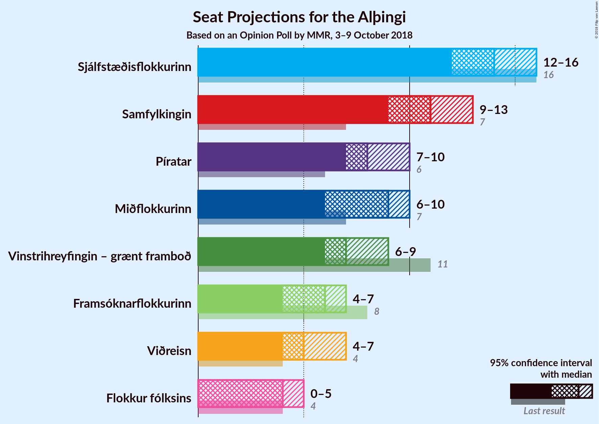
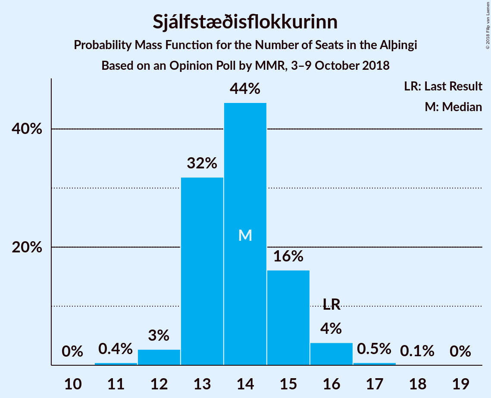
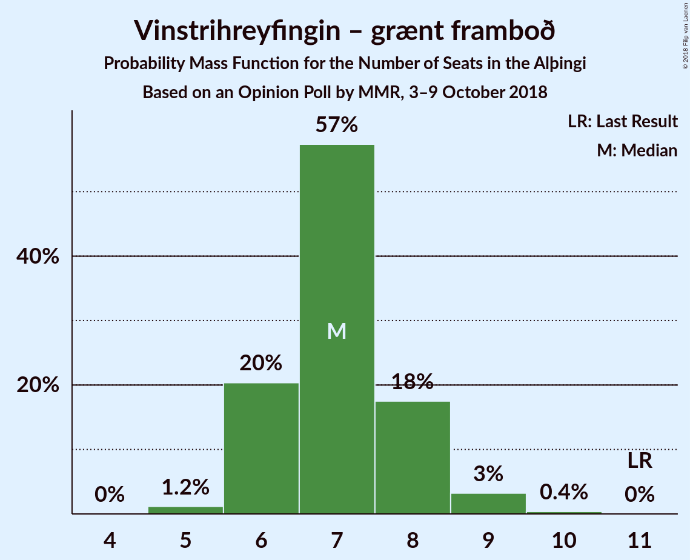

# Opinion Poll by MMR, 3–9 October 2018

<a href="#voting-intentions">Voting Intentions</a> | <a href="#seats">Seats</a> | <a href="#coalitions">Coalitions</a> | <a href="#technical-information">Technical Information</a>

## Voting Intentions

### Confidence Intervals

| Party | Last Result | Poll Result | 80% Confidence Interval | 90% Confidence Interval | 95% Confidence Interval | 99% Confidence Interval |
|:-----:|:-----------:|:-----------:|:-----------------------:|:-----------------------:|:-----------------------:|:-----------------------:|
| Sjálfstæðisflokkurinn | 25.2% | 20.8% | 19.2–22.6% |18.7–23.2% |18.4–23.6% |17.6–24.5% |
| Samfylkingin | 12.1% | 16.7% | 15.2–18.4% |14.8–18.9% |14.4–19.3% |13.8–20.1% |
| Píratar | 9.2% | 12.7% | 11.4–14.2% |11.0–14.6% |10.7–15.0% |10.1–15.8% |
| Miðflokkurinn | 10.9% | 11.9% | 10.7–13.4% |10.3–13.8% |10.0–14.2% |9.4–14.9% |
| Vinstrihreyfingin – grænt framboð | 16.9% | 11.0% | 9.7–12.4% |9.4–12.8% |9.1–13.2% |8.6–13.9% |
| Framsóknarflokkurinn | 10.7% | 8.9% | 7.8–10.2% |7.5–10.6% |7.2–10.9% |6.7–11.6% |
| Viðreisn | 6.7% | 8.6% | 7.5–9.9% |7.2–10.2% |6.9–10.6% |6.4–11.2% |
| Flokkur fólksins | 6.9% | 6.1% | 5.2–7.2% |4.9–7.5% |4.7–7.8% |4.3–8.4% |

*Note:* The poll result column reflects the actual value used in the calculations. Published results may vary slightly, and in addition be rounded to fewer digits.

## Seats

### Confidence Intervals

| Party | Last Result | Median | 80% Confidence Interval | 90% Confidence Interval | 95% Confidence Interval | 99% Confidence Interval |
|:-----:|:-----------:|:------:|:-----------------------:|:-----------------------:|:-----------------------:|:-----------------------:|
| <a href="#sjálfstæðisflokkurinn">Sjálfstæðisflokkurinn</a> | 16 | 14 | 13–15 |13–16 |12–16 |12–17 |
| <a href="#samfylkingin">Samfylkingin</a> | 7 | 10 | 10–12 |9–12 |9–13 |9–13 |
| <a href="#píratar">Píratar</a> | 6 | 8 | 7–9 |7–9 |7–10 |6–10 |
| <a href="#miðflokkurinn">Miðflokkurinn</a> | 7 | 9 | 7–10 |7–10 |6–10 |6–10 |
| <a href="#vinstrihreyfingin-–-grænt-framboð">Vinstrihreyfingin – grænt framboð</a> | 11 | 7 | 6–8 |6–8 |6–9 |5–9 |
| <a href="#framsóknarflokkurinn">Framsóknarflokkurinn</a> | 8 | 6 | 5–7 |4–7 |4–7 |4–8 |
| <a href="#viðreisn">Viðreisn</a> | 4 | 5 | 5–6 |4–7 |4–7 |4–7 |
| <a href="#flokkur-fólksins">Flokkur fólksins</a> | 4 | 4 | 3–4 |3–5 |0–5 |0–5 |

### Sjálfstæðisflokkurinn

*For a full overview of the results for this party, see the [Sjálfstæðisflokkurinn](party-sjálfstæðisflokkurinn.html) page.*

| Number of Seats | Probability | Accumulated | Special Marks |
|:---------------:|:-----------:|:-----------:|:-------------:|
| 11 | 0.3% | 100% |  |
| 12 | 3% | 99.7% |  |
| 13 | 31% | 97% |  |
| 14 | 37% | 65% | Median |
| 15 | 20% | 28% |  |
| 16 | 8% | 8% | Last Result |
| 17 | 0.4% | 0.5% |  |
| 18 | 0.1% | 0.1% |  |
| 19 | 0% | 0% |  |

### Samfylkingin

*For a full overview of the results for this party, see the [Samfylkingin](party-samfylkingin.html) page.*

| Number of Seats | Probability | Accumulated | Special Marks |
|:---------------:|:-----------:|:-----------:|:-------------:|
| 7 | 0% | 100% | Last Result |
| 8 | 0.2% | 100% |  |
| 9 | 7% | 99.8% |  |
| 10 | 43% | 93% | Median |
| 11 | 29% | 50% |  |
| 12 | 17% | 21% |  |
| 13 | 4% | 4% |  |
| 14 | 0.3% | 0.4% |  |
| 15 | 0% | 0% |  |

### Píratar

*For a full overview of the results for this party, see the [Píratar](party-píratar.html) page.*

| Number of Seats | Probability | Accumulated | Special Marks |
|:---------------:|:-----------:|:-----------:|:-------------:|
| 6 | 2% | 100% | Last Result |
| 7 | 14% | 98% |  |
| 8 | 58% | 84% | Median |
| 9 | 22% | 27% |  |
| 10 | 5% | 5% |  |
| 11 | 0.2% | 0.2% |  |
| 12 | 0% | 0% |  |

### Miðflokkurinn

*For a full overview of the results for this party, see the [Miðflokkurinn](party-miðflokkurinn.html) page.*

| Number of Seats | Probability | Accumulated | Special Marks |
|:---------------:|:-----------:|:-----------:|:-------------:|
| 6 | 3% | 100% |  |
| 7 | 19% | 97% | Last Result |
| 8 | 11% | 79% |  |
| 9 | 48% | 68% | Median |
| 10 | 20% | 20% |  |
| 11 | 0% | 0.1% |  |
| 12 | 0% | 0% |  |

### Vinstrihreyfingin – grænt framboð

*For a full overview of the results for this party, see the [Vinstrihreyfingin – grænt framboð](party-vinstrihreyfingin–græntframboð.html) page.*

| Number of Seats | Probability | Accumulated | Special Marks |
|:---------------:|:-----------:|:-----------:|:-------------:|
| 5 | 0.7% | 100% |  |
| 6 | 15% | 99.3% |  |
| 7 | 69% | 85% | Median |
| 8 | 13% | 16% |  |
| 9 | 2% | 3% |  |
| 10 | 0.4% | 0.4% |  |
| 11 | 0% | 0% | Last Result |

### Framsóknarflokkurinn

*For a full overview of the results for this party, see the [Framsóknarflokkurinn](party-framsóknarflokkurinn.html) page.*

| Number of Seats | Probability | Accumulated | Special Marks |
|:---------------:|:-----------:|:-----------:|:-------------:|
| 4 | 7% | 100% |  |
| 5 | 37% | 93% |  |
| 6 | 42% | 56% | Median |
| 7 | 12% | 14% |  |
| 8 | 2% | 2% | Last Result |
| 9 | 0% | 0% |  |

### Viðreisn

*For a full overview of the results for this party, see the [Viðreisn](party-viðreisn.html) page.*

| Number of Seats | Probability | Accumulated | Special Marks |
|:---------------:|:-----------:|:-----------:|:-------------:|
| 4 | 8% | 100% | Last Result |
| 5 | 47% | 92% | Median |
| 6 | 40% | 45% |  |
| 7 | 6% | 6% |  |
| 8 | 0.1% | 0.1% |  |
| 9 | 0% | 0% |  |

### Flokkur fólksins

*For a full overview of the results for this party, see the [Flokkur fólksins](party-flokkurfólksins.html) page.*

| Number of Seats | Probability | Accumulated | Special Marks |
|:---------------:|:-----------:|:-----------:|:-------------:|
| 0 | 4% | 100% |  |
| 1 | 0% | 96% |  |
| 2 | 0% | 96% |  |
| 3 | 45% | 96% |  |
| 4 | 44% | 50% | Last Result, Median |
| 5 | 6% | 6% |  |
| 6 | 0.1% | 0.1% |  |
| 7 | 0% | 0% |  |

## Coalitions

### Confidence Intervals

| Coalition | Last Result | Median | Majority? | 80% Confidence Interval | 90% Confidence Interval | 95% Confidence Interval | 99% Confidence Interval |
|:---------:|:-----------:|:------:|:---------:|:-----------------------:|:-----------------------:|:-----------------------:|:-----------------------:|
| Samfylkingin – Miðflokkurinn – Vinstrihreyfingin – grænt framboð – Framsóknarflokkurinn | 33 | 32 | 61% | 30–34 | 30–34 | 30–35 | 29–36 |
| Samfylkingin – Píratar – Vinstrihreyfingin – grænt framboð – Viðreisn | 28 | 31 | 39% | 30–33 | 29–34 | 29–34 | 28–35 |
| Sjálfstæðisflokkurinn – Miðflokkurinn – Framsóknarflokkurinn | 31 | 29 | 0.7% | 26–30 | 26–30 | 26–30 | 25–32 |
| Sjálfstæðisflokkurinn – Vinstrihreyfingin – grænt framboð – Framsóknarflokkurinn | 35 | 27 | 0% | 25–28 | 24–29 | 24–29 | 24–30 |
| Samfylkingin – Miðflokkurinn – Vinstrihreyfingin – grænt framboð | 25 | 26 | 0% | 25–28 | 25–29 | 24–29 | 23–30 |
| Samfylkingin – Píratar – Vinstrihreyfingin – grænt framboð | 24 | 25 | 0% | 25–28 | 24–28 | 24–29 | 23–29 |
| Sjálfstæðisflokkurinn – Samfylkingin | 23 | 25 | 0% | 23–26 | 22–27 | 22–27 | 22–29 |
| Samfylkingin – Vinstrihreyfingin – grænt framboð – Framsóknarflokkurinn | 26 | 23 | 0% | 22–26 | 22–26 | 21–26 | 20–27 |
| Sjálfstæðisflokkurinn – Miðflokkurinn | 23 | 23 | 0% | 20–24 | 20–24 | 20–24 | 19–26 |
| Miðflokkurinn – Vinstrihreyfingin – grænt framboð – Framsóknarflokkurinn | 26 | 21 | 0% | 19–23 | 19–23 | 19–24 | 18–25 |
| Sjálfstæðisflokkurinn – Vinstrihreyfingin – grænt framboð | 27 | 21 | 0% | 20–22 | 19–23 | 19–23 | 18–24 |
| Sjálfstæðisflokkurinn – Framsóknarflokkurinn | 24 | 20 | 0% | 18–21 | 18–21 | 18–22 | 17–23 |
| Sjálfstæðisflokkurinn – Viðreisn | 20 | 20 | 0% | 18–21 | 18–21 | 17–21 | 17–22 |
| Samfylkingin – Vinstrihreyfingin – grænt framboð | 18 | 17 | 0% | 17–19 | 16–20 | 16–20 | 15–21 |
| Miðflokkurinn – Vinstrihreyfingin – grænt framboð | 18 | 16 | 0% | 14–17 | 14–17 | 13–18 | 12–18 |
| Píratar – Vinstrihreyfingin – grænt framboð | 17 | 15 | 0% | 14–16 | 14–17 | 13–17 | 13–18 |
| Vinstrihreyfingin – grænt framboð – Framsóknarflokkurinn | 19 | 13 | 0% | 11–14 | 11–15 | 11–15 | 10–16 |

### Samfylkingin – Miðflokkurinn – Vinstrihreyfingin – grænt framboð – Framsóknarflokkurinn

| Number of Seats | Probability | Accumulated | Special Marks |
|:---------------:|:-----------:|:-----------:|:-------------:|
| 27 | 0.1% | 100% |  |
| 28 | 0.3% | 99.9% |  |
| 29 | 2% | 99.6% |  |
| 30 | 8% | 98% |  |
| 31 | 28% | 90% |  |
| 32 | 28% | 61% | Median, Majority |
| 33 | 21% | 33% | Last Result |
| 34 | 10% | 13% |  |
| 35 | 2% | 3% |  |
| 36 | 0.4% | 0.7% |  |
| 37 | 0.4% | 0.4% |  |
| 38 | 0% | 0% |  |

### Samfylkingin – Píratar – Vinstrihreyfingin – grænt framboð – Viðreisn

| Number of Seats | Probability | Accumulated | Special Marks |
|:---------------:|:-----------:|:-----------:|:-------------:|
| 27 | 0% | 100% |  |
| 28 | 1.0% | 99.9% | Last Result |
| 29 | 6% | 98.9% |  |
| 30 | 19% | 93% | Median |
| 31 | 35% | 74% |  |
| 32 | 25% | 39% | Majority |
| 33 | 6% | 14% |  |
| 34 | 7% | 8% |  |
| 35 | 0.7% | 1.0% |  |
| 36 | 0.2% | 0.3% |  |
| 37 | 0.1% | 0.1% |  |
| 38 | 0% | 0% |  |

### Sjálfstæðisflokkurinn – Miðflokkurinn – Framsóknarflokkurinn

| Number of Seats | Probability | Accumulated | Special Marks |
|:---------------:|:-----------:|:-----------:|:-------------:|
| 24 | 0.3% | 100% |  |
| 25 | 2% | 99.7% |  |
| 26 | 9% | 98% |  |
| 27 | 12% | 89% |  |
| 28 | 27% | 77% |  |
| 29 | 40% | 50% | Median |
| 30 | 8% | 10% |  |
| 31 | 2% | 2% | Last Result |
| 32 | 0.6% | 0.7% | Majority |
| 33 | 0.1% | 0.1% |  |
| 34 | 0% | 0% |  |

### Sjálfstæðisflokkurinn – Vinstrihreyfingin – grænt framboð – Framsóknarflokkurinn

| Number of Seats | Probability | Accumulated | Special Marks |
|:---------------:|:-----------:|:-----------:|:-------------:|
| 23 | 0.3% | 100% |  |
| 24 | 5% | 99.7% |  |
| 25 | 12% | 95% |  |
| 26 | 21% | 83% |  |
| 27 | 42% | 62% | Median |
| 28 | 14% | 20% |  |
| 29 | 3% | 5% |  |
| 30 | 2% | 2% |  |
| 31 | 0.3% | 0.3% |  |
| 32 | 0% | 0% | Majority |
| 33 | 0% | 0% |  |
| 34 | 0% | 0% |  |
| 35 | 0% | 0% | Last Result |

### Samfylkingin – Miðflokkurinn – Vinstrihreyfingin – grænt framboð

| Number of Seats | Probability | Accumulated | Special Marks |
|:---------------:|:-----------:|:-----------:|:-------------:|
| 22 | 0.3% | 100% |  |
| 23 | 0.6% | 99.7% |  |
| 24 | 3% | 99.1% |  |
| 25 | 16% | 96% | Last Result |
| 26 | 46% | 80% | Median |
| 27 | 17% | 34% |  |
| 28 | 8% | 17% |  |
| 29 | 8% | 8% |  |
| 30 | 0.7% | 0.7% |  |
| 31 | 0.1% | 0.1% |  |
| 32 | 0% | 0% | Majority |

### Samfylkingin – Píratar – Vinstrihreyfingin – grænt framboð

| Number of Seats | Probability | Accumulated | Special Marks |
|:---------------:|:-----------:|:-----------:|:-------------:|
| 22 | 0.2% | 100% |  |
| 23 | 1.3% | 99.8% |  |
| 24 | 8% | 98.5% | Last Result |
| 25 | 44% | 91% | Median |
| 26 | 12% | 46% |  |
| 27 | 23% | 34% |  |
| 28 | 8% | 11% |  |
| 29 | 3% | 3% |  |
| 30 | 0.3% | 0.4% |  |
| 31 | 0.1% | 0.1% |  |
| 32 | 0% | 0% | Majority |

### Sjálfstæðisflokkurinn – Samfylkingin

| Number of Seats | Probability | Accumulated | Special Marks |
|:---------------:|:-----------:|:-----------:|:-------------:|
| 21 | 0.2% | 100% |  |
| 22 | 6% | 99.8% |  |
| 23 | 7% | 94% | Last Result |
| 24 | 36% | 87% | Median |
| 25 | 30% | 52% |  |
| 26 | 13% | 22% |  |
| 27 | 7% | 9% |  |
| 28 | 2% | 2% |  |
| 29 | 0.5% | 0.5% |  |
| 30 | 0% | 0% |  |

### Samfylkingin – Vinstrihreyfingin – grænt framboð – Framsóknarflokkurinn

| Number of Seats | Probability | Accumulated | Special Marks |
|:---------------:|:-----------:|:-----------:|:-------------:|
| 19 | 0.1% | 100% |  |
| 20 | 0.7% | 99.9% |  |
| 21 | 2% | 99.2% |  |
| 22 | 24% | 97% |  |
| 23 | 37% | 74% | Median |
| 24 | 21% | 37% |  |
| 25 | 6% | 16% |  |
| 26 | 8% | 10% | Last Result |
| 27 | 2% | 2% |  |
| 28 | 0.2% | 0.3% |  |
| 29 | 0.1% | 0.1% |  |
| 30 | 0% | 0% |  |

### Sjálfstæðisflokkurinn – Miðflokkurinn

| Number of Seats | Probability | Accumulated | Special Marks |
|:---------------:|:-----------:|:-----------:|:-------------:|
| 18 | 0% | 100% |  |
| 19 | 0.7% | 99.9% |  |
| 20 | 10% | 99.2% |  |
| 21 | 8% | 89% |  |
| 22 | 17% | 81% |  |
| 23 | 38% | 64% | Last Result, Median |
| 24 | 24% | 26% |  |
| 25 | 2% | 2% |  |
| 26 | 0.3% | 0.5% |  |
| 27 | 0.2% | 0.2% |  |
| 28 | 0% | 0% |  |

### Miðflokkurinn – Vinstrihreyfingin – grænt framboð – Framsóknarflokkurinn

| Number of Seats | Probability | Accumulated | Special Marks |
|:---------------:|:-----------:|:-----------:|:-------------:|
| 17 | 0.3% | 100% |  |
| 18 | 0.9% | 99.7% |  |
| 19 | 10% | 98.8% |  |
| 20 | 12% | 89% |  |
| 21 | 28% | 77% |  |
| 22 | 36% | 49% | Median |
| 23 | 10% | 13% |  |
| 24 | 3% | 3% |  |
| 25 | 0.5% | 0.5% |  |
| 26 | 0% | 0% | Last Result |

### Sjálfstæðisflokkurinn – Vinstrihreyfingin – grænt framboð

| Number of Seats | Probability | Accumulated | Special Marks |
|:---------------:|:-----------:|:-----------:|:-------------:|
| 17 | 0.1% | 100% |  |
| 18 | 1.3% | 99.9% |  |
| 19 | 8% | 98.6% |  |
| 20 | 20% | 91% |  |
| 21 | 42% | 71% | Median |
| 22 | 20% | 29% |  |
| 23 | 9% | 10% |  |
| 24 | 1.0% | 1.2% |  |
| 25 | 0.2% | 0.2% |  |
| 26 | 0% | 0% |  |
| 27 | 0% | 0% | Last Result |

### Sjálfstæðisflokkurinn – Framsóknarflokkurinn

| Number of Seats | Probability | Accumulated | Special Marks |
|:---------------:|:-----------:|:-----------:|:-------------:|
| 16 | 0.1% | 100% |  |
| 17 | 2% | 99.9% |  |
| 18 | 15% | 98% |  |
| 19 | 22% | 84% |  |
| 20 | 47% | 62% | Median |
| 21 | 10% | 14% |  |
| 22 | 3% | 4% |  |
| 23 | 1.4% | 1.5% |  |
| 24 | 0.1% | 0.1% | Last Result |
| 25 | 0% | 0% |  |

### Sjálfstæðisflokkurinn – Viðreisn

| Number of Seats | Probability | Accumulated | Special Marks |
|:---------------:|:-----------:|:-----------:|:-------------:|
| 16 | 0.2% | 100% |  |
| 17 | 4% | 99.7% |  |
| 18 | 21% | 96% |  |
| 19 | 22% | 75% | Median |
| 20 | 38% | 53% | Last Result |
| 21 | 13% | 15% |  |
| 22 | 1.5% | 2% |  |
| 23 | 0.3% | 0.4% |  |
| 24 | 0.1% | 0.1% |  |
| 25 | 0% | 0% |  |

### Samfylkingin – Vinstrihreyfingin – grænt framboð

| Number of Seats | Probability | Accumulated | Special Marks |
|:---------------:|:-----------:|:-----------:|:-------------:|
| 14 | 0.1% | 100% |  |
| 15 | 0.6% | 99.9% |  |
| 16 | 8% | 99.3% |  |
| 17 | 44% | 91% | Median |
| 18 | 22% | 47% | Last Result |
| 19 | 17% | 24% |  |
| 20 | 6% | 7% |  |
| 21 | 1.3% | 2% |  |
| 22 | 0.3% | 0.3% |  |
| 23 | 0% | 0% |  |

### Miðflokkurinn – Vinstrihreyfingin – grænt framboð

| Number of Seats | Probability | Accumulated | Special Marks |
|:---------------:|:-----------:|:-----------:|:-------------:|
| 12 | 0.6% | 100% |  |
| 13 | 2% | 99.3% |  |
| 14 | 13% | 97% |  |
| 15 | 18% | 84% |  |
| 16 | 49% | 66% | Median |
| 17 | 15% | 17% |  |
| 18 | 3% | 3% | Last Result |
| 19 | 0.1% | 0.1% |  |
| 20 | 0% | 0% |  |

### Píratar – Vinstrihreyfingin – grænt framboð

| Number of Seats | Probability | Accumulated | Special Marks |
|:---------------:|:-----------:|:-----------:|:-------------:|
| 12 | 0.4% | 100% |  |
| 13 | 3% | 99.6% |  |
| 14 | 18% | 96% |  |
| 15 | 46% | 78% | Median |
| 16 | 22% | 32% |  |
| 17 | 8% | 10% | Last Result |
| 18 | 1.1% | 1.3% |  |
| 19 | 0.1% | 0.1% |  |
| 20 | 0% | 0% |  |

### Vinstrihreyfingin – grænt framboð – Framsóknarflokkurinn

| Number of Seats | Probability | Accumulated | Special Marks |
|:---------------:|:-----------:|:-----------:|:-------------:|
| 10 | 2% | 100% |  |
| 11 | 10% | 98% |  |
| 12 | 32% | 88% |  |
| 13 | 37% | 56% | Median |
| 14 | 11% | 18% |  |
| 15 | 6% | 7% |  |
| 16 | 0.7% | 0.8% |  |
| 17 | 0% | 0% |  |
| 18 | 0% | 0% |  |
| 19 | 0% | 0% | Last Result |

## Technical Information

### Opinion Poll

+ **Polling firm:** MMR
+ **Commissioner(s):** —
+ **Fieldwork period:** 3–9 October 2018

### Calculations

+ **Sample size:** 921
+ **Simulations done:** 131,072
+ **Error estimate:** 1.66%

