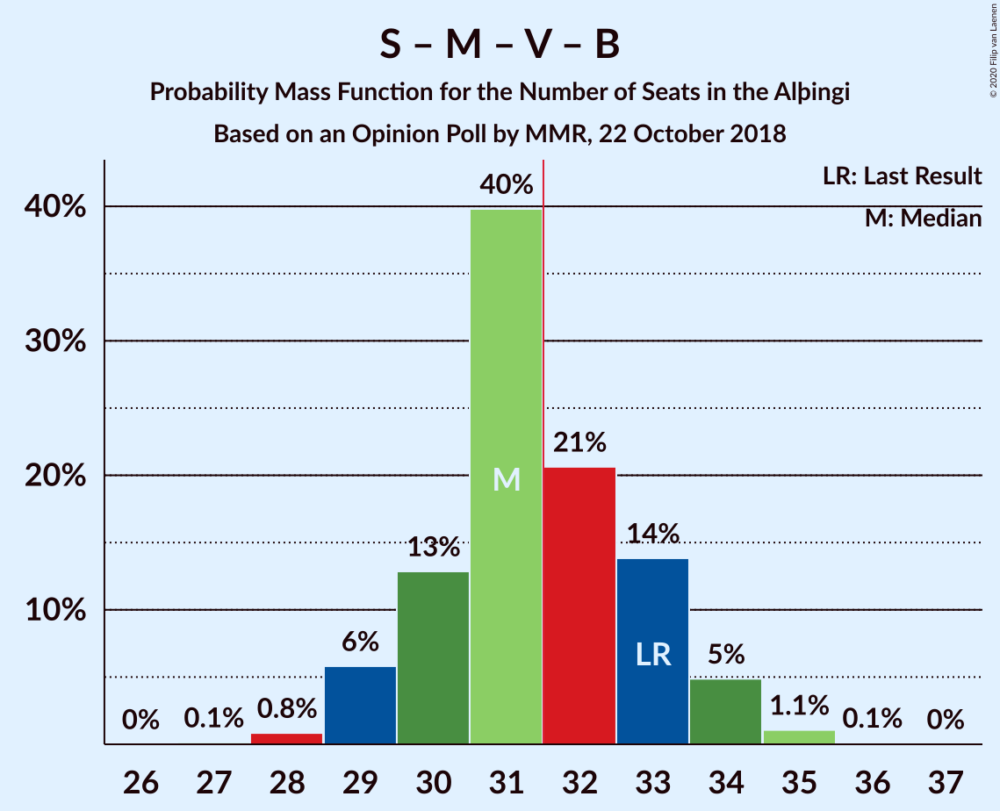

# Opinion Poll by MMR, 22 October 2018

<a href="#voting-intentions">Voting Intentions</a> | <a href="#seats">Seats</a> | <a href="#coalitions">Coalitions</a> | <a href="#technical-information">Technical Information</a>

## Voting Intentions

### Confidence Intervals

| Party | Last Result | Poll Result | 80% Confidence Interval | 90% Confidence Interval | 95% Confidence Interval | 99% Confidence Interval |
|:-----:|:-----------:|:-----------:|:-----------------------:|:-----------------------:|:-----------------------:|:-----------------------:|
| Sjálfstæðisflokkurinn | 25.2% | 20.8% | 19.1–22.6% |18.7–23.1% |18.3–23.5% |17.5–24.4% |
| Samfylkingin | 12.1% | 16.5% | 15.0–18.2% |14.6–18.6% |14.2–19.0% |13.5–19.9% |
| Píratar | 9.2% | 13.2% | 11.8–14.7% |11.5–15.2% |11.1–15.5% |10.5–16.3% |
| Miðflokkurinn | 10.9% | 12.7% | 11.4–14.3% |11.1–14.7% |10.7–15.1% |10.1–15.8% |
| Vinstrihreyfingin – grænt framboð | 16.9% | 10.8% | 9.6–12.2% |9.2–12.6% |8.9–13.0% |8.4–13.7% |
| Viðreisn | 6.7% | 9.9% | 8.7–11.3% |8.4–11.7% |8.1–12.0% |7.6–12.7% |
| Framsóknarflokkurinn | 10.7% | 7.8% | 6.8–9.1% |6.5–9.4% |6.2–9.7% |5.8–10.4% |
| Flokkur fólksins | 6.9% | 5.9% | 5.0–7.1% |4.8–7.4% |4.6–7.7% |4.2–8.2% |

*Note:* The poll result column reflects the actual value used in the calculations. Published results may vary slightly, and in addition be rounded to fewer digits.

## Seats

### Confidence Intervals

| Party | Last Result | Median | 80% Confidence Interval | 90% Confidence Interval | 95% Confidence Interval | 99% Confidence Interval |
|:-----:|:-----------:|:------:|:-----------------------:|:-----------------------:|:-----------------------:|:-----------------------:|
| <a href="#sjálfstæðisflokkurinn">Sjálfstæðisflokkurinn</a> | 16 | 14 | 13–15 |12–15 |12–15 |11–16 |
| <a href="#samfylkingin">Samfylkingin</a> | 7 | 10 | 10–12 |9–12 |9–13 |9–13 |
| <a href="#píratar">Píratar</a> | 6 | 8 | 7–9 |7–10 |7–10 |6–11 |
| <a href="#miðflokkurinn">Miðflokkurinn</a> | 7 | 9 | 8–10 |7–10 |7–10 |6–11 |
| <a href="#vinstrihreyfingin-–-grænt-framboð">Vinstrihreyfingin – grænt framboð</a> | 11 | 7 | 6–8 |6–8 |6–8 |5–9 |
| <a href="#viðreisn">Viðreisn</a> | 4 | 6 | 5–7 |5–7 |5–8 |5–8 |
| <a href="#framsóknarflokkurinn">Framsóknarflokkurinn</a> | 8 | 5 | 4–6 |4–6 |4–6 |3–6 |
| <a href="#flokkur-fólksins">Flokkur fólksins</a> | 4 | 4 | 3–4 |0–4 |0–5 |0–5 |

### Sjálfstæðisflokkurinn

*For a full overview of the results for this party, see the [Sjálfstæðisflokkurinn](party-sjálfstæðisflokkurinn.html) page.*

| Number of Seats | Probability | Accumulated | Special Marks |
|:---------------:|:-----------:|:-----------:|:-------------:|
| 11 | 0.7% | 100% |  |
| 12 | 8% | 99.2% |  |
| 13 | 34% | 92% |  |
| 14 | 38% | 57% | Median |
| 15 | 17% | 20% |  |
| 16 | 2% | 2% | Last Result |
| 17 | 0.3% | 0.3% |  |
| 18 | 0% | 0% |  |

### Samfylkingin

*For a full overview of the results for this party, see the [Samfylkingin](party-samfylkingin.html) page.*

| Number of Seats | Probability | Accumulated | Special Marks |
|:---------------:|:-----------:|:-----------:|:-------------:|
| 7 | 0% | 100% | Last Result |
| 8 | 0.2% | 100% |  |
| 9 | 6% | 99.8% |  |
| 10 | 59% | 93% | Median |
| 11 | 25% | 35% |  |
| 12 | 7% | 10% |  |
| 13 | 3% | 3% |  |
| 14 | 0.3% | 0.4% |  |
| 15 | 0% | 0% |  |

### Píratar

*For a full overview of the results for this party, see the [Píratar](party-píratar.html) page.*

| Number of Seats | Probability | Accumulated | Special Marks |
|:---------------:|:-----------:|:-----------:|:-------------:|
| 6 | 0.6% | 100% | Last Result |
| 7 | 10% | 99.4% |  |
| 8 | 45% | 89% | Median |
| 9 | 38% | 45% |  |
| 10 | 6% | 6% |  |
| 11 | 0.5% | 0.5% |  |
| 12 | 0% | 0% |  |

### Miðflokkurinn

*For a full overview of the results for this party, see the [Miðflokkurinn](party-miðflokkurinn.html) page.*

| Number of Seats | Probability | Accumulated | Special Marks |
|:---------------:|:-----------:|:-----------:|:-------------:|
| 6 | 0.5% | 100% |  |
| 7 | 6% | 99.5% | Last Result |
| 8 | 8% | 93% |  |
| 9 | 52% | 85% | Median |
| 10 | 32% | 33% |  |
| 11 | 1.3% | 2% |  |
| 12 | 0.3% | 0.3% |  |
| 13 | 0% | 0% |  |

### Vinstrihreyfingin – grænt framboð

*For a full overview of the results for this party, see the [Vinstrihreyfingin – grænt framboð](party-vinstrihreyfingin–græntframboð.html) page.*

| Number of Seats | Probability | Accumulated | Special Marks |
|:---------------:|:-----------:|:-----------:|:-------------:|
| 5 | 2% | 100% |  |
| 6 | 27% | 98% |  |
| 7 | 53% | 70% | Median |
| 8 | 15% | 17% |  |
| 9 | 2% | 2% |  |
| 10 | 0.4% | 0.4% |  |
| 11 | 0% | 0% | Last Result |

### Viðreisn

*For a full overview of the results for this party, see the [Viðreisn](party-viðreisn.html) page.*

| Number of Seats | Probability | Accumulated | Special Marks |
|:---------------:|:-----------:|:-----------:|:-------------:|
| 4 | 0.3% | 100% | Last Result |
| 5 | 14% | 99.7% |  |
| 6 | 55% | 86% | Median |
| 7 | 28% | 31% |  |
| 8 | 3% | 3% |  |
| 9 | 0.1% | 0.1% |  |
| 10 | 0% | 0% |  |

### Framsóknarflokkurinn

*For a full overview of the results for this party, see the [Framsóknarflokkurinn](party-framsóknarflokkurinn.html) page.*

| Number of Seats | Probability | Accumulated | Special Marks |
|:---------------:|:-----------:|:-----------:|:-------------:|
| 3 | 1.1% | 100% |  |
| 4 | 18% | 98.9% |  |
| 5 | 64% | 81% | Median |
| 6 | 17% | 17% |  |
| 7 | 0.4% | 0.4% |  |
| 8 | 0% | 0% | Last Result |

### Flokkur fólksins

*For a full overview of the results for this party, see the [Flokkur fólksins](party-flokkurfólksins.html) page.*

| Number of Seats | Probability | Accumulated | Special Marks |
|:---------------:|:-----------:|:-----------:|:-------------:|
| 0 | 9% | 100% |  |
| 1 | 0% | 91% |  |
| 2 | 0% | 91% |  |
| 3 | 38% | 91% |  |
| 4 | 49% | 53% | Last Result, Median |
| 5 | 4% | 4% |  |
| 6 | 0% | 0% |  |

## Coalitions

### Confidence Intervals

| Coalition | Last Result | Median | Majority? | 80% Confidence Interval | 90% Confidence Interval | 95% Confidence Interval | 99% Confidence Interval |
|:---------:|:-----------:|:------:|:---------:|:-----------------------:|:-----------------------:|:-----------------------:|:-----------------------:|
| Samfylkingin – Píratar – Vinstrihreyfingin – grænt framboð – Viðreisn | 28 | 32 | 58% | 30–34 | 30–34 | 30–35 | 29–36 |
| Samfylkingin – Miðflokkurinn – Vinstrihreyfingin – grænt framboð – Framsóknarflokkurinn | 33 | 31 | 41% | 30–33 | 29–34 | 29–34 | 28–35 |
| Sjálfstæðisflokkurinn – Miðflokkurinn – Framsóknarflokkurinn | 31 | 28 | 0.1% | 26–29 | 26–30 | 25–30 | 24–31 |
| Samfylkingin – Miðflokkurinn – Vinstrihreyfingin – grænt framboð | 25 | 26 | 0% | 25–28 | 24–28 | 24–29 | 23–30 |
| Sjálfstæðisflokkurinn – Vinstrihreyfingin – grænt framboð – Framsóknarflokkurinn | 35 | 26 | 0% | 24–27 | 24–28 | 23–28 | 22–29 |
| Samfylkingin – Píratar – Vinstrihreyfingin – grænt framboð | 24 | 26 | 0% | 24–27 | 24–28 | 23–28 | 23–29 |
| Sjálfstæðisflokkurinn – Samfylkingin | 23 | 24 | 0% | 23–26 | 23–26 | 22–27 | 21–28 |
| Samfylkingin – Vinstrihreyfingin – grænt framboð – Framsóknarflokkurinn | 26 | 22 | 0% | 21–24 | 20–24 | 20–25 | 19–26 |
| Sjálfstæðisflokkurinn – Miðflokkurinn | 23 | 23 | 0% | 21–24 | 21–25 | 20–25 | 20–26 |
| Sjálfstæðisflokkurinn – Vinstrihreyfingin – grænt framboð | 27 | 21 | 0% | 19–22 | 19–23 | 19–23 | 18–24 |
| Miðflokkurinn – Vinstrihreyfingin – grænt framboð – Framsóknarflokkurinn | 26 | 21 | 0% | 20–22 | 19–23 | 18–23 | 17–23 |
| Sjálfstæðisflokkurinn – Viðreisn | 20 | 20 | 0% | 19–21 | 18–22 | 18–22 | 17–23 |
| Sjálfstæðisflokkurinn – Framsóknarflokkurinn | 24 | 19 | 0% | 17–20 | 17–20 | 17–21 | 16–22 |
| Samfylkingin – Vinstrihreyfingin – grænt framboð | 18 | 17 | 0% | 16–19 | 16–19 | 15–20 | 15–21 |
| Miðflokkurinn – Vinstrihreyfingin – grænt framboð | 18 | 16 | 0% | 15–17 | 14–18 | 14–18 | 13–19 |
| Píratar – Vinstrihreyfingin – grænt framboð | 17 | 15 | 0% | 14–17 | 14–17 | 13–17 | 13–18 |
| Vinstrihreyfingin – grænt framboð – Framsóknarflokkurinn | 19 | 12 | 0% | 11–13 | 10–13 | 10–14 | 9–14 |

### Samfylkingin – Píratar – Vinstrihreyfingin – grænt framboð – Viðreisn

| Number of Seats | Probability | Accumulated | Special Marks |
|:---------------:|:-----------:|:-----------:|:-------------:|
| 28 | 0.2% | 100% | Last Result |
| 29 | 2% | 99.7% |  |
| 30 | 8% | 98% |  |
| 31 | 32% | 90% | Median |
| 32 | 30% | 58% | Majority |
| 33 | 18% | 28% |  |
| 34 | 7% | 11% |  |
| 35 | 3% | 4% |  |
| 36 | 0.8% | 1.0% |  |
| 37 | 0.2% | 0.2% |  |
| 38 | 0% | 0% |  |

### Samfylkingin – Miðflokkurinn – Vinstrihreyfingin – grænt framboð – Framsóknarflokkurinn

| Number of Seats | Probability | Accumulated | Special Marks |
|:---------------:|:-----------:|:-----------:|:-------------:|
| 27 | 0.1% | 100% |  |
| 28 | 0.8% | 99.9% |  |
| 29 | 6% | 99.0% |  |
| 30 | 13% | 93% |  |
| 31 | 40% | 80% | Median |
| 32 | 21% | 41% | Majority |
| 33 | 14% | 20% | Last Result |
| 34 | 5% | 6% |  |
| 35 | 1.1% | 1.2% |  |
| 36 | 0.1% | 0.1% |  |
| 37 | 0% | 0% |  |

### Sjálfstæðisflokkurinn – Miðflokkurinn – Framsóknarflokkurinn

| Number of Seats | Probability | Accumulated | Special Marks |
|:---------------:|:-----------:|:-----------:|:-------------:|
| 23 | 0.1% | 100% |  |
| 24 | 0.5% | 99.9% |  |
| 25 | 2% | 99.4% |  |
| 26 | 10% | 97% |  |
| 27 | 23% | 87% |  |
| 28 | 39% | 64% | Median |
| 29 | 18% | 25% |  |
| 30 | 5% | 7% |  |
| 31 | 1.3% | 1.4% | Last Result |
| 32 | 0.1% | 0.1% | Majority |
| 33 | 0% | 0% |  |

### Samfylkingin – Miðflokkurinn – Vinstrihreyfingin – grænt framboð

| Number of Seats | Probability | Accumulated | Special Marks |
|:---------------:|:-----------:|:-----------:|:-------------:|
| 22 | 0.1% | 100% |  |
| 23 | 0.7% | 99.9% |  |
| 24 | 5% | 99.2% |  |
| 25 | 14% | 94% | Last Result |
| 26 | 36% | 80% | Median |
| 27 | 24% | 44% |  |
| 28 | 16% | 20% |  |
| 29 | 4% | 5% |  |
| 30 | 0.8% | 0.9% |  |
| 31 | 0.1% | 0.1% |  |
| 32 | 0% | 0% | Majority |

### Sjálfstæðisflokkurinn – Vinstrihreyfingin – grænt framboð – Framsóknarflokkurinn

| Number of Seats | Probability | Accumulated | Special Marks |
|:---------------:|:-----------:|:-----------:|:-------------:|
| 21 | 0% | 100% |  |
| 22 | 0.5% | 99.9% |  |
| 23 | 4% | 99.4% |  |
| 24 | 14% | 96% |  |
| 25 | 30% | 82% |  |
| 26 | 32% | 52% | Median |
| 27 | 14% | 20% |  |
| 28 | 5% | 6% |  |
| 29 | 1.0% | 1.1% |  |
| 30 | 0.2% | 0.2% |  |
| 31 | 0% | 0% |  |
| 32 | 0% | 0% | Majority |
| 33 | 0% | 0% |  |
| 34 | 0% | 0% |  |
| 35 | 0% | 0% | Last Result |

### Samfylkingin – Píratar – Vinstrihreyfingin – grænt framboð

| Number of Seats | Probability | Accumulated | Special Marks |
|:---------------:|:-----------:|:-----------:|:-------------:|
| 22 | 0.2% | 100% |  |
| 23 | 3% | 99.7% |  |
| 24 | 12% | 97% | Last Result |
| 25 | 32% | 85% | Median |
| 26 | 30% | 53% |  |
| 27 | 14% | 23% |  |
| 28 | 7% | 9% |  |
| 29 | 2% | 2% |  |
| 30 | 0.4% | 0.5% |  |
| 31 | 0.1% | 0.1% |  |
| 32 | 0% | 0% | Majority |

### Sjálfstæðisflokkurinn – Samfylkingin

| Number of Seats | Probability | Accumulated | Special Marks |
|:---------------:|:-----------:|:-----------:|:-------------:|
| 21 | 0.5% | 100% |  |
| 22 | 4% | 99.5% |  |
| 23 | 25% | 95% | Last Result |
| 24 | 38% | 70% | Median |
| 25 | 21% | 32% |  |
| 26 | 8% | 11% |  |
| 27 | 2% | 3% |  |
| 28 | 0.7% | 0.8% |  |
| 29 | 0.1% | 0.1% |  |
| 30 | 0% | 0% |  |

### Samfylkingin – Vinstrihreyfingin – grænt framboð – Framsóknarflokkurinn

| Number of Seats | Probability | Accumulated | Special Marks |
|:---------------:|:-----------:|:-----------:|:-------------:|
| 18 | 0.1% | 100% |  |
| 19 | 0.6% | 99.9% |  |
| 20 | 5% | 99.4% |  |
| 21 | 18% | 94% |  |
| 22 | 42% | 77% | Median |
| 23 | 20% | 35% |  |
| 24 | 10% | 15% |  |
| 25 | 4% | 5% |  |
| 26 | 0.7% | 0.8% | Last Result |
| 27 | 0.1% | 0.1% |  |
| 28 | 0% | 0% |  |

### Sjálfstæðisflokkurinn – Miðflokkurinn

| Number of Seats | Probability | Accumulated | Special Marks |
|:---------------:|:-----------:|:-----------:|:-------------:|
| 19 | 0.3% | 100% |  |
| 20 | 2% | 99.6% |  |
| 21 | 8% | 97% |  |
| 22 | 26% | 89% |  |
| 23 | 37% | 63% | Last Result, Median |
| 24 | 19% | 26% |  |
| 25 | 6% | 7% |  |
| 26 | 0.8% | 0.9% |  |
| 27 | 0.1% | 0.1% |  |
| 28 | 0% | 0% |  |

### Sjálfstæðisflokkurinn – Vinstrihreyfingin – grænt framboð

| Number of Seats | Probability | Accumulated | Special Marks |
|:---------------:|:-----------:|:-----------:|:-------------:|
| 17 | 0.2% | 100% |  |
| 18 | 2% | 99.8% |  |
| 19 | 17% | 98% |  |
| 20 | 27% | 81% |  |
| 21 | 34% | 54% | Median |
| 22 | 14% | 20% |  |
| 23 | 4% | 5% |  |
| 24 | 0.9% | 1.0% |  |
| 25 | 0.1% | 0.1% |  |
| 26 | 0% | 0% |  |
| 27 | 0% | 0% | Last Result |

### Miðflokkurinn – Vinstrihreyfingin – grænt framboð – Framsóknarflokkurinn

| Number of Seats | Probability | Accumulated | Special Marks |
|:---------------:|:-----------:|:-----------:|:-------------:|
| 16 | 0.1% | 100% |  |
| 17 | 0.5% | 99.9% |  |
| 18 | 2% | 99.4% |  |
| 19 | 5% | 97% |  |
| 20 | 19% | 92% |  |
| 21 | 42% | 73% | Median |
| 22 | 25% | 31% |  |
| 23 | 5% | 6% |  |
| 24 | 0.3% | 0.4% |  |
| 25 | 0% | 0.1% |  |
| 26 | 0% | 0% | Last Result |

### Sjálfstæðisflokkurinn – Viðreisn

| Number of Seats | Probability | Accumulated | Special Marks |
|:---------------:|:-----------:|:-----------:|:-------------:|
| 16 | 0.1% | 100% |  |
| 17 | 0.8% | 99.9% |  |
| 18 | 9% | 99.1% |  |
| 19 | 25% | 90% |  |
| 20 | 39% | 65% | Last Result, Median |
| 21 | 19% | 26% |  |
| 22 | 6% | 7% |  |
| 23 | 1.4% | 2% |  |
| 24 | 0.2% | 0.2% |  |
| 25 | 0% | 0% |  |

### Sjálfstæðisflokkurinn – Framsóknarflokkurinn

| Number of Seats | Probability | Accumulated | Special Marks |
|:---------------:|:-----------:|:-----------:|:-------------:|
| 15 | 0.1% | 100% |  |
| 16 | 2% | 99.9% |  |
| 17 | 11% | 98% |  |
| 18 | 29% | 87% |  |
| 19 | 37% | 58% | Median |
| 20 | 16% | 20% |  |
| 21 | 3% | 4% |  |
| 22 | 0.5% | 0.6% |  |
| 23 | 0.1% | 0.1% |  |
| 24 | 0% | 0% | Last Result |

### Samfylkingin – Vinstrihreyfingin – grænt framboð

| Number of Seats | Probability | Accumulated | Special Marks |
|:---------------:|:-----------:|:-----------:|:-------------:|
| 14 | 0.2% | 100% |  |
| 15 | 4% | 99.8% |  |
| 16 | 17% | 96% |  |
| 17 | 43% | 79% | Median |
| 18 | 22% | 36% | Last Result |
| 19 | 11% | 14% |  |
| 20 | 3% | 3% |  |
| 21 | 0.7% | 0.7% |  |
| 22 | 0% | 0% |  |

### Miðflokkurinn – Vinstrihreyfingin – grænt framboð

| Number of Seats | Probability | Accumulated | Special Marks |
|:---------------:|:-----------:|:-----------:|:-------------:|
| 12 | 0.2% | 100% |  |
| 13 | 1.3% | 99.8% |  |
| 14 | 5% | 98.5% |  |
| 15 | 21% | 93% |  |
| 16 | 43% | 73% | Median |
| 17 | 24% | 30% |  |
| 18 | 5% | 6% | Last Result |
| 19 | 0.6% | 0.6% |  |
| 20 | 0.1% | 0.1% |  |
| 21 | 0% | 0% |  |

### Píratar – Vinstrihreyfingin – grænt framboð

| Number of Seats | Probability | Accumulated | Special Marks |
|:---------------:|:-----------:|:-----------:|:-------------:|
| 12 | 0.2% | 100% |  |
| 13 | 5% | 99.8% |  |
| 14 | 17% | 95% |  |
| 15 | 38% | 79% | Median |
| 16 | 30% | 41% |  |
| 17 | 8% | 11% | Last Result |
| 18 | 2% | 2% |  |
| 19 | 0.2% | 0.3% |  |
| 20 | 0% | 0% |  |

### Vinstrihreyfingin – grænt framboð – Framsóknarflokkurinn

| Number of Seats | Probability | Accumulated | Special Marks |
|:---------------:|:-----------:|:-----------:|:-------------:|
| 9 | 0.8% | 100% |  |
| 10 | 6% | 99.1% |  |
| 11 | 25% | 93% |  |
| 12 | 48% | 68% | Median |
| 13 | 17% | 20% |  |
| 14 | 4% | 4% |  |
| 15 | 0.3% | 0.3% |  |
| 16 | 0% | 0% |  |
| 17 | 0% | 0% |  |
| 18 | 0% | 0% |  |
| 19 | 0% | 0% | Last Result |

## Technical Information

### Opinion Poll

+ **Polling firm:** MMR
+ **Commissioner(s):** —
+ **Fieldwork period:** 22 October 2018

### Calculations

+ **Sample size:** 910
+ **Simulations done:** 1,048,576
+ **Error estimate:** 1.22%

