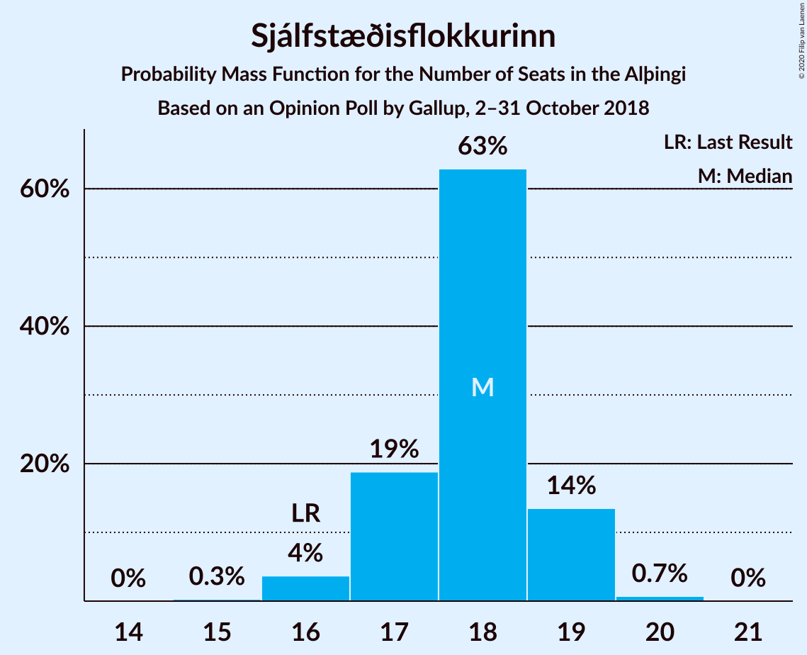

# Opinion Poll by Gallup, 2–31 October 2018

<a href="#voting-intentions">Voting Intentions</a> | <a href="#seats">Seats</a> | <a href="#coalitions">Coalitions</a> | <a href="#technical-information">Technical Information</a>

## Voting Intentions

### Confidence Intervals

| Party | Last Result | Poll Result | 80% Confidence Interval | 90% Confidence Interval | 95% Confidence Interval | 99% Confidence Interval |
|:-----:|:-----------:|:-----------:|:-----------------------:|:-----------------------:|:-----------------------:|:-----------------------:|
| Sjálfstæðisflokkurinn | 25.2% | 25.8% | 24.9–26.8% |24.6–27.1% |24.4–27.3% |23.9–27.8% |
| Samfylkingin | 12.1% | 17.0% | 16.2–17.8% |16.0–18.1% |15.8–18.3% |15.4–18.7% |
| Viðreisn | 6.7% | 10.8% | 10.2–11.5% |10.0–11.7% |9.8–11.9% |9.5–12.3% |
| Vinstrihreyfingin – grænt framboð | 16.9% | 10.6% | 9.9–11.3% |9.8–11.5% |9.6–11.7% |9.3–12.0% |
| Píratar | 9.2% | 10.6% | 9.9–11.3% |9.8–11.5% |9.6–11.7% |9.3–12.0% |
| Miðflokkurinn | 10.9% | 10.3% | 9.6–11.0% |9.5–11.2% |9.3–11.4% |9.0–11.7% |
| Framsóknarflokkurinn | 10.7% | 7.2% | 6.7–7.8% |6.5–8.0% |6.4–8.1% |6.1–8.4% |
| Flokkur fólksins | 6.9% | 6.2% | 5.7–6.8% |5.5–6.9% |5.4–7.1% |5.2–7.3% |
| Sósíalistaflokkur Íslands | 0.0% | 1.1% | 0.9–1.4% |0.8–1.4% |0.8–1.5% |0.7–1.7% |

*Note:* The poll result column reflects the actual value used in the calculations. Published results may vary slightly, and in addition be rounded to fewer digits.

## Seats

### Confidence Intervals

| Party | Last Result | Median | 80% Confidence Interval | 90% Confidence Interval | 95% Confidence Interval | 99% Confidence Interval |
|:-----:|:-----------:|:------:|:-----------------------:|:-----------------------:|:-----------------------:|:-----------------------:|
| <a href="#sjálfstæðisflokkurinn">Sjálfstæðisflokkurinn</a> | 16 | 17 | 15–19 |15–19 |15–19 |15–21 |
| <a href="#samfylkingin">Samfylkingin</a> | 7 | 11 | 11–12 |10–13 |10–13 |9–13 |
| <a href="#viðreisn">Viðreisn</a> | 4 | 6 | 5–7 |5–7 |5–7 |5–8 |
| <a href="#vinstrihreyfingin-–-grænt-framboð">Vinstrihreyfingin – grænt framboð</a> | 11 | 8 | 6–8 |5–8 |5–8 |5–8 |
| <a href="#píratar">Píratar</a> | 6 | 7 | 6–7 |6–7 |6–7 |6–7 |
| <a href="#miðflokkurinn">Miðflokkurinn</a> | 7 | 7 | 6–8 |6–8 |6–9 |5–9 |
| <a href="#framsóknarflokkurinn">Framsóknarflokkurinn</a> | 8 | 4 | 4 |4 |3–5 |3–5 |
| <a href="#flokkur-fólksins">Flokkur fólksins</a> | 4 | 4 | 3–4 |3–4 |3–5 |3–5 |
| <a href="#sósíalistaflokkur-íslands">Sósíalistaflokkur Íslands</a> | 0 | 0 | 0 |0 |0 |0 |

### Sjálfstæðisflokkurinn

*For a full overview of the results for this party, see the [Sjálfstæðisflokkurinn](party-sjálfstæðisflokkurinn.html) page.*

| Number of Seats | Probability | Accumulated | Special Marks |
|:---------------:|:-----------:|:-----------:|:-------------:|
| 15 | 12% | 100% |  |
| 16 | 14% | 88% | Last Result |
| 17 | 34% | 73% | Median |
| 18 | 9% | 40% |  |
| 19 | 29% | 30% |  |
| 20 | 0.4% | 1.4% |  |
| 21 | 1.0% | 1.0% |  |
| 22 | 0% | 0% |  |

### Samfylkingin

*For a full overview of the results for this party, see the [Samfylkingin](party-samfylkingin.html) page.*

| Number of Seats | Probability | Accumulated | Special Marks |
|:---------------:|:-----------:|:-----------:|:-------------:|
| 7 | 0% | 100% | Last Result |
| 8 | 0% | 100% |  |
| 9 | 2% | 100% |  |
| 10 | 5% | 98% |  |
| 11 | 69% | 93% | Median |
| 12 | 15% | 24% |  |
| 13 | 9% | 9% |  |
| 14 | 0% | 0% |  |

### Viðreisn

*For a full overview of the results for this party, see the [Viðreisn](party-viðreisn.html) page.*

| Number of Seats | Probability | Accumulated | Special Marks |
|:---------------:|:-----------:|:-----------:|:-------------:|
| 4 | 0% | 100% | Last Result |
| 5 | 26% | 100% |  |
| 6 | 58% | 74% | Median |
| 7 | 15% | 16% |  |
| 8 | 1.3% | 1.4% |  |
| 9 | 0.1% | 0.1% |  |
| 10 | 0% | 0% |  |

### Vinstrihreyfingin – grænt framboð

*For a full overview of the results for this party, see the [Vinstrihreyfingin – grænt framboð](party-vinstrihreyfingin–græntframboð.html) page.*

| Number of Seats | Probability | Accumulated | Special Marks |
|:---------------:|:-----------:|:-----------:|:-------------:|
| 5 | 10% | 100% |  |
| 6 | 29% | 90% |  |
| 7 | 5% | 61% |  |
| 8 | 56% | 56% | Median |
| 9 | 0% | 0% |  |
| 10 | 0% | 0% |  |
| 11 | 0% | 0% | Last Result |

### Píratar

*For a full overview of the results for this party, see the [Píratar](party-píratar.html) page.*

| Number of Seats | Probability | Accumulated | Special Marks |
|:---------------:|:-----------:|:-----------:|:-------------:|
| 5 | 0.4% | 100% |  |
| 6 | 26% | 99.6% | Last Result |
| 7 | 73% | 73% | Median |
| 8 | 0.3% | 0.3% |  |
| 9 | 0% | 0% |  |

### Miðflokkurinn

*For a full overview of the results for this party, see the [Miðflokkurinn](party-miðflokkurinn.html) page.*

| Number of Seats | Probability | Accumulated | Special Marks |
|:---------------:|:-----------:|:-----------:|:-------------:|
| 5 | 0.7% | 100% |  |
| 6 | 48% | 99.3% |  |
| 7 | 11% | 51% | Last Result, Median |
| 8 | 36% | 40% |  |
| 9 | 4% | 4% |  |
| 10 | 0% | 0% |  |

### Framsóknarflokkurinn

*For a full overview of the results for this party, see the [Framsóknarflokkurinn](party-framsóknarflokkurinn.html) page.*

| Number of Seats | Probability | Accumulated | Special Marks |
|:---------------:|:-----------:|:-----------:|:-------------:|
| 3 | 3% | 100% |  |
| 4 | 94% | 97% | Median |
| 5 | 3% | 4% |  |
| 6 | 0.1% | 0.1% |  |
| 7 | 0% | 0% |  |
| 8 | 0% | 0% | Last Result |

### Flokkur fólksins

*For a full overview of the results for this party, see the [Flokkur fólksins](party-flokkurfólksins.html) page.*

| Number of Seats | Probability | Accumulated | Special Marks |
|:---------------:|:-----------:|:-----------:|:-------------:|
| 0 | 0.3% | 100% |  |
| 1 | 0% | 99.7% |  |
| 2 | 0% | 99.7% |  |
| 3 | 29% | 99.7% |  |
| 4 | 66% | 70% | Last Result, Median |
| 5 | 4% | 4% |  |
| 6 | 0% | 0% |  |

### Sósíalistaflokkur Íslands

*For a full overview of the results for this party, see the [Sósíalistaflokkur Íslands](party-sósíalistaflokkuríslands.html) page.*

| Number of Seats | Probability | Accumulated | Special Marks |
|:---------------:|:-----------:|:-----------:|:-------------:|
| 0 | 100% | 100% | Last Result, Median |

## Coalitions

### Confidence Intervals

| Coalition | Last Result | Median | Majority? | 80% Confidence Interval | 90% Confidence Interval | 95% Confidence Interval | 99% Confidence Interval |
|:---------:|:-----------:|:------:|:---------:|:-----------------------:|:-----------------------:|:-----------------------:|:-----------------------:|
| Samfylkingin – Viðreisn – Píratar – Vinstrihreyfingin – grænt framboð | 28 | 32 | 56% | 29–33 | 29–33 | 29–33 | 29–33 |
| Samfylkingin – Vinstrihreyfingin – grænt framboð – Miðflokkurinn – Framsóknarflokkurinn | 33 | 29 | 0.1% | 29–31 | 29–31 | 27–31 | 25–31 |
| Sjálfstæðisflokkurinn – Miðflokkurinn – Framsóknarflokkurinn | 31 | 27 | 0% | 26–31 | 26–31 | 26–31 | 26–31 |
| Sjálfstæðisflokkurinn – Samfylkingin | 23 | 28 | 0% | 26–31 | 26–31 | 26–31 | 26–31 |
| Sjálfstæðisflokkurinn – Vinstrihreyfingin – grænt framboð – Framsóknarflokkurinn | 35 | 29 | 0.3% | 27–29 | 27–29 | 25–30 | 25–31 |
| Samfylkingin – Vinstrihreyfingin – grænt framboð – Miðflokkurinn | 25 | 25 | 0% | 25–27 | 25–27 | 22–27 | 20–28 |
| Sjálfstæðisflokkurinn – Miðflokkurinn | 23 | 23 | 0% | 22–27 | 22–27 | 22–27 | 22–27 |
| Samfylkingin – Píratar – Vinstrihreyfingin – grænt framboð | 24 | 25 | 0% | 24–27 | 23–27 | 22–27 | 21–27 |
| Sjálfstæðisflokkurinn – Viðreisn | 20 | 23 | 0% | 22–24 | 22–24 | 22–26 | 21–28 |
| Sjálfstæðisflokkurinn – Vinstrihreyfingin – grænt framboð | 27 | 25 | 0% | 23–25 | 23–25 | 22–25 | 22–27 |
| Samfylkingin – Vinstrihreyfingin – grænt framboð – Framsóknarflokkurinn | 26 | 23 | 0% | 21–24 | 21–24 | 21–24 | 19–24 |
| Sjálfstæðisflokkurinn – Framsóknarflokkurinn | 24 | 21 | 0% | 19–23 | 19–23 | 19–24 | 18–25 |
| Vinstrihreyfingin – grænt framboð – Miðflokkurinn – Framsóknarflokkurinn | 26 | 18 | 0% | 16–20 | 16–20 | 16–20 | 15–20 |
| Samfylkingin – Vinstrihreyfingin – grænt framboð | 18 | 19 | 0% | 17–20 | 17–20 | 16–20 | 14–20 |
| Vinstrihreyfingin – grænt framboð – Miðflokkurinn | 18 | 14 | 0% | 12–16 | 12–16 | 12–16 | 11–16 |
| Píratar – Vinstrihreyfingin – grænt framboð | 17 | 14 | 0% | 12–15 | 11–15 | 11–15 | 11–15 |
| Vinstrihreyfingin – grænt framboð – Framsóknarflokkurinn | 19 | 12 | 0% | 10–12 | 9–12 | 9–12 | 9–13 |

### Samfylkingin – Viðreisn – Píratar – Vinstrihreyfingin – grænt framboð

| Number of Seats | Probability | Accumulated | Special Marks |
|:---------------:|:-----------:|:-----------:|:-------------:|
| 28 | 0% | 100% | Last Result |
| 29 | 31% | 100% |  |
| 30 | 10% | 69% |  |
| 31 | 3% | 59% |  |
| 32 | 44% | 56% | Median, Majority |
| 33 | 12% | 12% |  |
| 34 | 0.1% | 0.2% |  |
| 35 | 0.1% | 0.1% |  |
| 36 | 0% | 0% |  |

### Samfylkingin – Vinstrihreyfingin – grænt framboð – Miðflokkurinn – Framsóknarflokkurinn

| Number of Seats | Probability | Accumulated | Special Marks |
|:---------------:|:-----------:|:-----------:|:-------------:|
| 25 | 1.2% | 100% |  |
| 26 | 0.6% | 98.8% |  |
| 27 | 2% | 98% |  |
| 28 | 1.0% | 96% |  |
| 29 | 69% | 95% |  |
| 30 | 14% | 27% | Median |
| 31 | 12% | 12% |  |
| 32 | 0.1% | 0.1% | Majority |
| 33 | 0% | 0% | Last Result |

### Sjálfstæðisflokkurinn – Miðflokkurinn – Framsóknarflokkurinn

| Number of Seats | Probability | Accumulated | Special Marks |
|:---------------:|:-----------:|:-----------:|:-------------:|
| 26 | 11% | 100% |  |
| 27 | 46% | 89% |  |
| 28 | 2% | 43% | Median |
| 29 | 11% | 41% |  |
| 30 | 3% | 30% |  |
| 31 | 27% | 27% | Last Result |
| 32 | 0% | 0% | Majority |

### Sjálfstæðisflokkurinn – Samfylkingin

| Number of Seats | Probability | Accumulated | Special Marks |
|:---------------:|:-----------:|:-----------:|:-------------:|
| 23 | 0% | 100% | Last Result |
| 24 | 0% | 100% |  |
| 25 | 0% | 100% |  |
| 26 | 13% | 100% |  |
| 27 | 3% | 87% |  |
| 28 | 46% | 85% | Median |
| 29 | 1.2% | 39% |  |
| 30 | 27% | 37% |  |
| 31 | 11% | 11% |  |
| 32 | 0% | 0% | Majority |

### Sjálfstæðisflokkurinn – Vinstrihreyfingin – grænt framboð – Framsóknarflokkurinn

| Number of Seats | Probability | Accumulated | Special Marks |
|:---------------:|:-----------:|:-----------:|:-------------:|
| 25 | 3% | 100% |  |
| 26 | 0.1% | 97% |  |
| 27 | 20% | 97% |  |
| 28 | 12% | 77% |  |
| 29 | 62% | 65% | Median |
| 30 | 0.9% | 3% |  |
| 31 | 2% | 2% |  |
| 32 | 0.3% | 0.3% | Majority |
| 33 | 0% | 0% |  |
| 34 | 0% | 0% |  |
| 35 | 0% | 0% | Last Result |

### Samfylkingin – Vinstrihreyfingin – grænt framboð – Miðflokkurinn

| Number of Seats | Probability | Accumulated | Special Marks |
|:---------------:|:-----------:|:-----------:|:-------------:|
| 20 | 0.6% | 100% |  |
| 21 | 0.7% | 99.4% |  |
| 22 | 2% | 98.8% |  |
| 23 | 0.6% | 97% |  |
| 24 | 1.2% | 96% |  |
| 25 | 70% | 95% | Last Result |
| 26 | 13% | 25% | Median |
| 27 | 10% | 12% |  |
| 28 | 2% | 2% |  |
| 29 | 0% | 0% |  |

### Sjálfstæðisflokkurinn – Miðflokkurinn

| Number of Seats | Probability | Accumulated | Special Marks |
|:---------------:|:-----------:|:-----------:|:-------------:|
| 22 | 11% | 100% |  |
| 23 | 45% | 89% | Last Result |
| 24 | 3% | 44% | Median |
| 25 | 13% | 41% |  |
| 26 | 1.2% | 28% |  |
| 27 | 27% | 27% |  |
| 28 | 0% | 0% |  |

### Samfylkingin – Píratar – Vinstrihreyfingin – grænt framboð

| Number of Seats | Probability | Accumulated | Special Marks |
|:---------------:|:-----------:|:-----------:|:-------------:|
| 21 | 0.6% | 100% |  |
| 22 | 3% | 99.4% |  |
| 23 | 2% | 96% |  |
| 24 | 36% | 94% | Last Result |
| 25 | 13% | 59% |  |
| 26 | 34% | 45% | Median |
| 27 | 11% | 11% |  |
| 28 | 0% | 0% |  |

### Sjálfstæðisflokkurinn – Viðreisn

| Number of Seats | Probability | Accumulated | Special Marks |
|:---------------:|:-----------:|:-----------:|:-------------:|
| 20 | 0% | 100% | Last Result |
| 21 | 2% | 100% |  |
| 22 | 23% | 98% |  |
| 23 | 35% | 75% | Median |
| 24 | 35% | 40% |  |
| 25 | 0.1% | 5% |  |
| 26 | 3% | 5% |  |
| 27 | 0.8% | 2% |  |
| 28 | 1.4% | 1.4% |  |
| 29 | 0% | 0% |  |

### Sjálfstæðisflokkurinn – Vinstrihreyfingin – grænt framboð

| Number of Seats | Probability | Accumulated | Special Marks |
|:---------------:|:-----------:|:-----------:|:-------------:|
| 21 | 0.1% | 100% |  |
| 22 | 3% | 99.9% |  |
| 23 | 21% | 97% |  |
| 24 | 13% | 77% |  |
| 25 | 61% | 63% | Median |
| 26 | 1.4% | 2% |  |
| 27 | 0.7% | 1.0% | Last Result |
| 28 | 0.3% | 0.3% |  |
| 29 | 0% | 0% |  |

### Samfylkingin – Vinstrihreyfingin – grænt framboð – Framsóknarflokkurinn

| Number of Seats | Probability | Accumulated | Special Marks |
|:---------------:|:-----------:|:-----------:|:-------------:|
| 19 | 0.7% | 100% |  |
| 20 | 2% | 99.3% |  |
| 21 | 29% | 98% |  |
| 22 | 12% | 68% |  |
| 23 | 44% | 56% | Median |
| 24 | 12% | 12% |  |
| 25 | 0.1% | 0.1% |  |
| 26 | 0% | 0% | Last Result |

### Sjálfstæðisflokkurinn – Framsóknarflokkurinn

| Number of Seats | Probability | Accumulated | Special Marks |
|:---------------:|:-----------:|:-----------:|:-------------:|
| 18 | 2% | 100% |  |
| 19 | 10% | 98% |  |
| 20 | 13% | 88% |  |
| 21 | 35% | 75% | Median |
| 22 | 10% | 40% |  |
| 23 | 27% | 30% |  |
| 24 | 2% | 3% | Last Result |
| 25 | 1.0% | 1.0% |  |
| 26 | 0% | 0% |  |

### Vinstrihreyfingin – grænt framboð – Miðflokkurinn – Framsóknarflokkurinn

| Number of Seats | Probability | Accumulated | Special Marks |
|:---------------:|:-----------:|:-----------:|:-------------:|
| 15 | 0.9% | 100% |  |
| 16 | 11% | 99.1% |  |
| 17 | 0.9% | 88% |  |
| 18 | 72% | 87% |  |
| 19 | 3% | 15% | Median |
| 20 | 13% | 13% |  |
| 21 | 0% | 0% |  |
| 22 | 0% | 0% |  |
| 23 | 0% | 0% |  |
| 24 | 0% | 0% |  |
| 25 | 0% | 0% |  |
| 26 | 0% | 0% | Last Result |

### Samfylkingin – Vinstrihreyfingin – grænt framboð

| Number of Seats | Probability | Accumulated | Special Marks |
|:---------------:|:-----------:|:-----------:|:-------------:|
| 14 | 0.6% | 100% |  |
| 15 | 0.1% | 99.4% |  |
| 16 | 3% | 99.4% |  |
| 17 | 28% | 96% |  |
| 18 | 11% | 68% | Last Result |
| 19 | 46% | 57% | Median |
| 20 | 11% | 11% |  |
| 21 | 0% | 0% |  |

### Vinstrihreyfingin – grænt framboð – Miðflokkurinn

| Number of Seats | Probability | Accumulated | Special Marks |
|:---------------:|:-----------:|:-----------:|:-------------:|
| 11 | 1.3% | 100% |  |
| 12 | 11% | 98.7% |  |
| 13 | 2% | 88% |  |
| 14 | 71% | 86% |  |
| 15 | 1.5% | 15% | Median |
| 16 | 14% | 14% |  |
| 17 | 0% | 0% |  |
| 18 | 0% | 0% | Last Result |

### Píratar – Vinstrihreyfingin – grænt framboð

| Number of Seats | Probability | Accumulated | Special Marks |
|:---------------:|:-----------:|:-----------:|:-------------:|
| 11 | 9% | 100% |  |
| 12 | 3% | 91% |  |
| 13 | 31% | 87% |  |
| 14 | 10% | 56% |  |
| 15 | 46% | 46% | Median |
| 16 | 0% | 0% |  |
| 17 | 0% | 0% | Last Result |

### Vinstrihreyfingin – grænt framboð – Framsóknarflokkurinn

| Number of Seats | Probability | Accumulated | Special Marks |
|:---------------:|:-----------:|:-----------:|:-------------:|
| 9 | 10% | 100% |  |
| 10 | 31% | 90% |  |
| 11 | 3% | 59% |  |
| 12 | 56% | 57% | Median |
| 13 | 1.3% | 1.4% |  |
| 14 | 0% | 0% |  |
| 15 | 0% | 0% |  |
| 16 | 0% | 0% |  |
| 17 | 0% | 0% |  |
| 18 | 0% | 0% |  |
| 19 | 0% | 0% | Last Result |

## Technical Information

### Opinion Poll

+ **Polling firm:** Gallup
+ **Commissioner(s):** —
+ **Fieldwork period:** 2–31 October 2018

### Calculations

+ **Sample size:** 3359
+ **Simulations done:** 1,024
+ **Error estimate:** 1.68%

