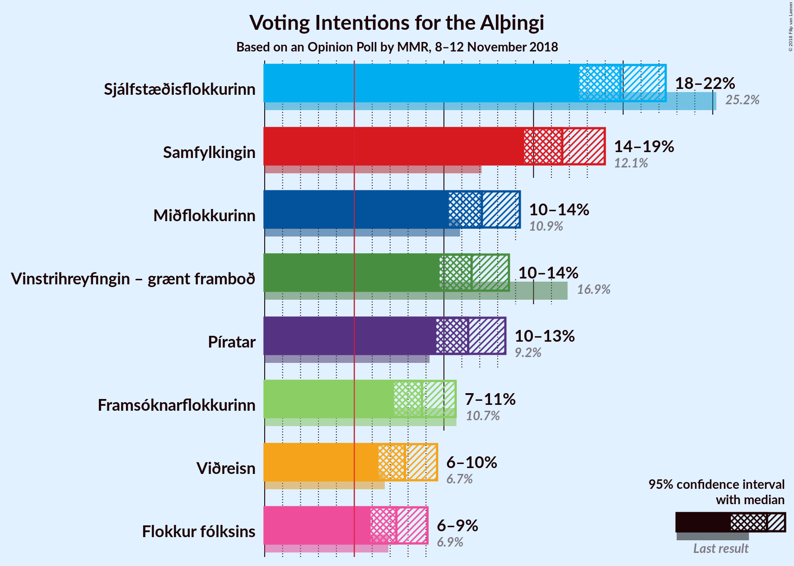

# Opinion Poll by MMR, 8–12 November 2018

<a href="#voting-intentions">Voting Intentions</a> | <a href="#seats">Seats</a> | <a href="#coalitions">Coalitions</a> | <a href="#technical-information">Technical Information</a>

## Voting Intentions

### Confidence Intervals

| Party | Last Result | Poll Result | 80% Confidence Interval | 90% Confidence Interval | 95% Confidence Interval | 99% Confidence Interval |
|:-----:|:-----------:|:-----------:|:-----------------------:|:-----------------------:|:-----------------------:|:-----------------------:|
| Sjálfstæðisflokkurinn | 25.2% | 19.8% | 18.3–21.5% |17.9–22.0% |17.5–22.4% |16.8–23.2% |
| Samfylkingin | 12.1% | 16.6% | 15.2–18.2% |14.8–18.6% |14.5–19.0% |13.8–19.7% |
| Miðflokkurinn | 10.9% | 12.1% | 10.9–13.5% |10.6–13.9% |10.3–14.2% |9.7–14.9% |
| Vinstrihreyfingin – grænt framboð | 16.9% | 11.5% | 10.4–12.9% |10.0–13.3% |9.8–13.6% |9.2–14.3% |
| Píratar | 9.2% | 11.4% | 10.2–12.7% |9.8–13.1% |9.6–13.4% |9.0–14.1% |
| Framsóknarflokkurinn | 10.7% | 8.8% | 7.7–10.0% |7.5–10.3% |7.2–10.7% |6.8–11.3% |
| Viðreisn | 6.7% | 7.8% | 6.8–9.0% |6.6–9.3% |6.3–9.6% |5.9–10.2% |
| Flokkur fólksins | 6.9% | 7.3% | 6.4–8.5% |6.1–8.8% |5.9–9.1% |5.5–9.7% |

*Note:* The poll result column reflects the actual value used in the calculations. Published results may vary slightly, and in addition be rounded to fewer digits.

## Seats

### Confidence Intervals

| Party | Last Result | Median | 80% Confidence Interval | 90% Confidence Interval | 95% Confidence Interval | 99% Confidence Interval |
|:-----:|:-----------:|:------:|:-----------------------:|:-----------------------:|:-----------------------:|:-----------------------:|
| <a href="#sjálfstæðisflokkurinn">Sjálfstæðisflokkurinn</a> | 16 | 13 | 12–15 |12–15 |11–15 |11–15 |
| <a href="#samfylkingin">Samfylkingin</a> | 7 | 11 | 10–12 |10–12 |9–13 |9–13 |
| <a href="#miðflokkurinn">Miðflokkurinn</a> | 7 | 9 | 7–10 |7–10 |6–10 |6–10 |
| <a href="#vinstrihreyfingin-–-grænt-framboð">Vinstrihreyfingin – grænt framboð</a> | 11 | 7 | 6–8 |6–9 |6–9 |6–10 |
| <a href="#píratar">Píratar</a> | 6 | 7 | 6–8 |6–9 |6–9 |5–9 |
| <a href="#framsóknarflokkurinn">Framsóknarflokkurinn</a> | 8 | 5 | 5–6 |4–7 |4–7 |4–8 |
| <a href="#viðreisn">Viðreisn</a> | 4 | 5 | 4–6 |4–6 |4–6 |3–6 |
| <a href="#flokkur-fólksins">Flokkur fólksins</a> | 4 | 4 | 4–5 |4–6 |3–6 |3–6 |

### Sjálfstæðisflokkurinn

*For a full overview of the results for this party, see the [Sjálfstæðisflokkurinn](party-sjálfstæðisflokkurinn.html) page.*

| Number of Seats | Probability | Accumulated | Special Marks |
|:---------------:|:-----------:|:-----------:|:-------------:|
| 10 | 0.2% | 100% |  |
| 11 | 2% | 99.8% |  |
| 12 | 14% | 97% |  |
| 13 | 48% | 84% | Median |
| 14 | 23% | 36% |  |
| 15 | 12% | 12% |  |
| 16 | 0.4% | 0.4% | Last Result |
| 17 | 0% | 0% |  |

### Samfylkingin

*For a full overview of the results for this party, see the [Samfylkingin](party-samfylkingin.html) page.*

| Number of Seats | Probability | Accumulated | Special Marks |
|:---------------:|:-----------:|:-----------:|:-------------:|
| 7 | 0% | 100% | Last Result |
| 8 | 0.3% | 100% |  |
| 9 | 3% | 99.7% |  |
| 10 | 37% | 97% |  |
| 11 | 37% | 60% | Median |
| 12 | 18% | 23% |  |
| 13 | 4% | 5% |  |
| 14 | 0.3% | 0.3% |  |
| 15 | 0% | 0% |  |

### Miðflokkurinn

*For a full overview of the results for this party, see the [Miðflokkurinn](party-miðflokkurinn.html) page.*

| Number of Seats | Probability | Accumulated | Special Marks |
|:---------------:|:-----------:|:-----------:|:-------------:|
| 6 | 3% | 100% |  |
| 7 | 21% | 97% | Last Result |
| 8 | 24% | 75% |  |
| 9 | 14% | 51% | Median |
| 10 | 38% | 38% |  |
| 11 | 0.1% | 0.1% |  |
| 12 | 0% | 0% |  |

### Vinstrihreyfingin – grænt framboð

*For a full overview of the results for this party, see the [Vinstrihreyfingin – grænt framboð](party-vinstrihreyfingin–græntframboð.html) page.*

| Number of Seats | Probability | Accumulated | Special Marks |
|:---------------:|:-----------:|:-----------:|:-------------:|
| 5 | 0.3% | 100% |  |
| 6 | 10% | 99.7% |  |
| 7 | 47% | 89% | Median |
| 8 | 34% | 42% |  |
| 9 | 7% | 8% |  |
| 10 | 2% | 2% |  |
| 11 | 0% | 0% | Last Result |

### Píratar

*For a full overview of the results for this party, see the [Píratar](party-píratar.html) page.*

| Number of Seats | Probability | Accumulated | Special Marks |
|:---------------:|:-----------:|:-----------:|:-------------:|
| 5 | 0.5% | 100% |  |
| 6 | 20% | 99.4% | Last Result |
| 7 | 44% | 80% | Median |
| 8 | 31% | 36% |  |
| 9 | 5% | 5% |  |
| 10 | 0.1% | 0.1% |  |
| 11 | 0% | 0% |  |

### Framsóknarflokkurinn

*For a full overview of the results for this party, see the [Framsóknarflokkurinn](party-framsóknarflokkurinn.html) page.*

| Number of Seats | Probability | Accumulated | Special Marks |
|:---------------:|:-----------:|:-----------:|:-------------:|
| 4 | 6% | 100% |  |
| 5 | 50% | 94% | Median |
| 6 | 37% | 44% |  |
| 7 | 6% | 7% |  |
| 8 | 1.1% | 1.2% | Last Result |
| 9 | 0% | 0% |  |

### Viðreisn

*For a full overview of the results for this party, see the [Viðreisn](party-viðreisn.html) page.*

| Number of Seats | Probability | Accumulated | Special Marks |
|:---------------:|:-----------:|:-----------:|:-------------:|
| 3 | 0.5% | 100% |  |
| 4 | 33% | 99.5% | Last Result |
| 5 | 54% | 66% | Median |
| 6 | 12% | 12% |  |
| 7 | 0.3% | 0.3% |  |
| 8 | 0% | 0% |  |

### Flokkur fólksins

*For a full overview of the results for this party, see the [Flokkur fólksins](party-flokkurfólksins.html) page.*

| Number of Seats | Probability | Accumulated | Special Marks |
|:---------------:|:-----------:|:-----------:|:-------------:|
| 0 | 0.1% | 100% |  |
| 1 | 0% | 99.9% |  |
| 2 | 0% | 99.9% |  |
| 3 | 5% | 99.9% |  |
| 4 | 50% | 95% | Last Result, Median |
| 5 | 36% | 45% |  |
| 6 | 9% | 9% |  |
| 7 | 0.1% | 0.1% |  |
| 8 | 0% | 0% |  |

## Coalitions

### Confidence Intervals

| Coalition | Last Result | Median | Majority? | 80% Confidence Interval | 90% Confidence Interval | 95% Confidence Interval | 99% Confidence Interval |
|:---------:|:-----------:|:------:|:---------:|:-----------------------:|:-----------------------:|:-----------------------:|:-----------------------:|
| Samfylkingin – Miðflokkurinn – Vinstrihreyfingin – grænt framboð – Framsóknarflokkurinn | 33 | 32 | 72% | 30–34 | 30–35 | 30–35 | 29–36 |
| Samfylkingin – Vinstrihreyfingin – grænt framboð – Píratar – Viðreisn | 28 | 30 | 20% | 28–32 | 27–33 | 27–33 | 26–34 |
| Sjálfstæðisflokkurinn – Miðflokkurinn – Framsóknarflokkurinn | 31 | 27 | 0% | 25–29 | 25–29 | 24–30 | 24–31 |
| Sjálfstæðisflokkurinn – Vinstrihreyfingin – grænt framboð – Framsóknarflokkurinn | 35 | 26 | 0% | 24–28 | 24–29 | 24–29 | 22–29 |
| Samfylkingin – Miðflokkurinn – Vinstrihreyfingin – grænt framboð | 25 | 27 | 0% | 25–29 | 25–29 | 24–29 | 23–30 |
| Samfylkingin – Vinstrihreyfingin – grænt framboð – Píratar | 24 | 26 | 0% | 23–27 | 23–28 | 23–28 | 22–29 |
| Sjálfstæðisflokkurinn – Samfylkingin | 23 | 24 | 0% | 23–26 | 22–26 | 22–27 | 21–27 |
| Samfylkingin – Vinstrihreyfingin – grænt framboð – Framsóknarflokkurinn | 26 | 24 | 0% | 22–25 | 22–26 | 21–27 | 20–28 |
| Miðflokkurinn – Vinstrihreyfingin – grænt framboð – Framsóknarflokkurinn | 26 | 21 | 0% | 19–23 | 19–24 | 19–24 | 18–24 |
| Sjálfstæðisflokkurinn – Miðflokkurinn | 23 | 22 | 0% | 20–23 | 20–24 | 19–24 | 18–25 |
| Sjálfstæðisflokkurinn – Vinstrihreyfingin – grænt framboð | 27 | 20 | 0% | 19–23 | 19–23 | 19–23 | 17–24 |
| Sjálfstæðisflokkurinn – Framsóknarflokkurinn | 24 | 19 | 0% | 17–20 | 17–21 | 17–21 | 16–22 |
| Samfylkingin – Vinstrihreyfingin – grænt framboð | 18 | 18 | 0% | 17–20 | 16–20 | 16–21 | 15–22 |
| Sjálfstæðisflokkurinn – Viðreisn | 20 | 18 | 0% | 17–19 | 17–20 | 16–20 | 15–21 |
| Miðflokkurinn – Vinstrihreyfingin – grænt framboð | 18 | 16 | 0% | 14–17 | 14–18 | 14–18 | 13–19 |
| Vinstrihreyfingin – grænt framboð – Píratar | 17 | 15 | 0% | 13–16 | 13–17 | 13–17 | 12–17 |
| Vinstrihreyfingin – grænt framboð – Framsóknarflokkurinn | 19 | 13 | 0% | 12–14 | 11–15 | 11–15 | 10–16 |

### Samfylkingin – Miðflokkurinn – Vinstrihreyfingin – grænt framboð – Framsóknarflokkurinn

| Number of Seats | Probability | Accumulated | Special Marks |
|:---------------:|:-----------:|:-----------:|:-------------:|
| 28 | 0.1% | 100% |  |
| 29 | 1.3% | 99.8% |  |
| 30 | 9% | 98.6% |  |
| 31 | 17% | 89% |  |
| 32 | 27% | 72% | Median, Majority |
| 33 | 26% | 45% | Last Result |
| 34 | 10% | 18% |  |
| 35 | 8% | 9% |  |
| 36 | 1.0% | 1.0% |  |
| 37 | 0% | 0% |  |

### Samfylkingin – Vinstrihreyfingin – grænt framboð – Píratar – Viðreisn

| Number of Seats | Probability | Accumulated | Special Marks |
|:---------------:|:-----------:|:-----------:|:-------------:|
| 25 | 0.1% | 100% |  |
| 26 | 0.4% | 99.9% |  |
| 27 | 6% | 99.5% |  |
| 28 | 7% | 94% | Last Result |
| 29 | 16% | 87% |  |
| 30 | 23% | 70% | Median |
| 31 | 28% | 48% |  |
| 32 | 15% | 20% | Majority |
| 33 | 4% | 5% |  |
| 34 | 1.1% | 1.2% |  |
| 35 | 0.1% | 0.1% |  |
| 36 | 0% | 0% |  |

### Sjálfstæðisflokkurinn – Miðflokkurinn – Framsóknarflokkurinn

| Number of Seats | Probability | Accumulated | Special Marks |
|:---------------:|:-----------:|:-----------:|:-------------:|
| 23 | 0.2% | 100% |  |
| 24 | 3% | 99.8% |  |
| 25 | 10% | 97% |  |
| 26 | 13% | 88% |  |
| 27 | 25% | 75% | Median |
| 28 | 26% | 50% |  |
| 29 | 19% | 23% |  |
| 30 | 4% | 4% |  |
| 31 | 0.5% | 0.6% | Last Result |
| 32 | 0% | 0% | Majority |

### Sjálfstæðisflokkurinn – Vinstrihreyfingin – grænt framboð – Framsóknarflokkurinn

| Number of Seats | Probability | Accumulated | Special Marks |
|:---------------:|:-----------:|:-----------:|:-------------:|
| 22 | 0.6% | 100% |  |
| 23 | 1.1% | 99.4% |  |
| 24 | 9% | 98% |  |
| 25 | 20% | 89% | Median |
| 26 | 33% | 69% |  |
| 27 | 18% | 36% |  |
| 28 | 12% | 18% |  |
| 29 | 6% | 7% |  |
| 30 | 0.3% | 0.4% |  |
| 31 | 0% | 0% |  |
| 32 | 0% | 0% | Majority |
| 33 | 0% | 0% |  |
| 34 | 0% | 0% |  |
| 35 | 0% | 0% | Last Result |

### Samfylkingin – Miðflokkurinn – Vinstrihreyfingin – grænt framboð

| Number of Seats | Probability | Accumulated | Special Marks |
|:---------------:|:-----------:|:-----------:|:-------------:|
| 22 | 0.1% | 100% |  |
| 23 | 0.6% | 99.9% |  |
| 24 | 2% | 99.3% |  |
| 25 | 11% | 97% | Last Result |
| 26 | 25% | 86% |  |
| 27 | 31% | 61% | Median |
| 28 | 19% | 30% |  |
| 29 | 10% | 12% |  |
| 30 | 1.3% | 1.5% |  |
| 31 | 0.1% | 0.1% |  |
| 32 | 0% | 0% | Majority |

### Samfylkingin – Vinstrihreyfingin – grænt framboð – Píratar

| Number of Seats | Probability | Accumulated | Special Marks |
|:---------------:|:-----------:|:-----------:|:-------------:|
| 21 | 0.2% | 100% |  |
| 22 | 1.2% | 99.8% |  |
| 23 | 10% | 98.6% |  |
| 24 | 15% | 88% | Last Result |
| 25 | 17% | 74% | Median |
| 26 | 35% | 57% |  |
| 27 | 17% | 22% |  |
| 28 | 4% | 5% |  |
| 29 | 1.1% | 1.2% |  |
| 30 | 0.1% | 0.1% |  |
| 31 | 0% | 0% |  |

### Sjálfstæðisflokkurinn – Samfylkingin

| Number of Seats | Probability | Accumulated | Special Marks |
|:---------------:|:-----------:|:-----------:|:-------------:|
| 20 | 0.1% | 100% |  |
| 21 | 1.3% | 99.9% |  |
| 22 | 6% | 98.6% |  |
| 23 | 27% | 93% | Last Result |
| 24 | 29% | 65% | Median |
| 25 | 20% | 36% |  |
| 26 | 13% | 17% |  |
| 27 | 3% | 4% |  |
| 28 | 0.2% | 0.3% |  |
| 29 | 0.1% | 0.1% |  |
| 30 | 0% | 0% |  |

### Samfylkingin – Vinstrihreyfingin – grænt framboð – Framsóknarflokkurinn

| Number of Seats | Probability | Accumulated | Special Marks |
|:---------------:|:-----------:|:-----------:|:-------------:|
| 19 | 0.1% | 100% |  |
| 20 | 0.6% | 99.9% |  |
| 21 | 4% | 99.4% |  |
| 22 | 10% | 95% |  |
| 23 | 35% | 85% | Median |
| 24 | 21% | 50% |  |
| 25 | 19% | 29% |  |
| 26 | 6% | 10% | Last Result |
| 27 | 3% | 3% |  |
| 28 | 0.6% | 0.6% |  |
| 29 | 0% | 0% |  |

### Miðflokkurinn – Vinstrihreyfingin – grænt framboð – Framsóknarflokkurinn

| Number of Seats | Probability | Accumulated | Special Marks |
|:---------------:|:-----------:|:-----------:|:-------------:|
| 17 | 0.1% | 100% |  |
| 18 | 0.5% | 99.8% |  |
| 19 | 10% | 99.3% |  |
| 20 | 10% | 89% |  |
| 21 | 30% | 79% | Median |
| 22 | 23% | 49% |  |
| 23 | 21% | 26% |  |
| 24 | 5% | 5% |  |
| 25 | 0.3% | 0.4% |  |
| 26 | 0% | 0% | Last Result |

### Sjálfstæðisflokkurinn – Miðflokkurinn

| Number of Seats | Probability | Accumulated | Special Marks |
|:---------------:|:-----------:|:-----------:|:-------------:|
| 18 | 0.8% | 100% |  |
| 19 | 4% | 99.2% |  |
| 20 | 15% | 95% |  |
| 21 | 13% | 81% |  |
| 22 | 30% | 68% | Median |
| 23 | 30% | 38% | Last Result |
| 24 | 6% | 8% |  |
| 25 | 2% | 2% |  |
| 26 | 0.1% | 0.1% |  |
| 27 | 0% | 0% |  |

### Sjálfstæðisflokkurinn – Vinstrihreyfingin – grænt framboð

| Number of Seats | Probability | Accumulated | Special Marks |
|:---------------:|:-----------:|:-----------:|:-------------:|
| 17 | 0.7% | 100% |  |
| 18 | 1.5% | 99.2% |  |
| 19 | 14% | 98% |  |
| 20 | 35% | 84% | Median |
| 21 | 23% | 49% |  |
| 22 | 13% | 26% |  |
| 23 | 13% | 14% |  |
| 24 | 0.5% | 0.6% |  |
| 25 | 0.1% | 0.1% |  |
| 26 | 0% | 0% |  |
| 27 | 0% | 0% | Last Result |

### Sjálfstæðisflokkurinn – Framsóknarflokkurinn

| Number of Seats | Probability | Accumulated | Special Marks |
|:---------------:|:-----------:|:-----------:|:-------------:|
| 15 | 0.2% | 100% |  |
| 16 | 1.5% | 99.8% |  |
| 17 | 11% | 98% |  |
| 18 | 27% | 88% | Median |
| 19 | 39% | 61% |  |
| 20 | 15% | 22% |  |
| 21 | 6% | 7% |  |
| 22 | 0.6% | 0.7% |  |
| 23 | 0.1% | 0.1% |  |
| 24 | 0% | 0% | Last Result |

### Samfylkingin – Vinstrihreyfingin – grænt framboð

| Number of Seats | Probability | Accumulated | Special Marks |
|:---------------:|:-----------:|:-----------:|:-------------:|
| 14 | 0.1% | 100% |  |
| 15 | 0.5% | 99.9% |  |
| 16 | 6% | 99.5% |  |
| 17 | 19% | 94% |  |
| 18 | 34% | 75% | Last Result, Median |
| 19 | 26% | 40% |  |
| 20 | 12% | 14% |  |
| 21 | 2% | 3% |  |
| 22 | 0.5% | 0.6% |  |
| 23 | 0% | 0% |  |

### Sjálfstæðisflokkurinn – Viðreisn

| Number of Seats | Probability | Accumulated | Special Marks |
|:---------------:|:-----------:|:-----------:|:-------------:|
| 14 | 0.1% | 100% |  |
| 15 | 0.6% | 99.9% |  |
| 16 | 4% | 99.3% |  |
| 17 | 28% | 95% |  |
| 18 | 31% | 68% | Median |
| 19 | 29% | 37% |  |
| 20 | 8% | 8% | Last Result |
| 21 | 0.6% | 0.6% |  |
| 22 | 0% | 0.1% |  |
| 23 | 0% | 0% |  |

### Miðflokkurinn – Vinstrihreyfingin – grænt framboð

| Number of Seats | Probability | Accumulated | Special Marks |
|:---------------:|:-----------:|:-----------:|:-------------:|
| 12 | 0.2% | 100% |  |
| 13 | 2% | 99.7% |  |
| 14 | 15% | 98% |  |
| 15 | 13% | 83% |  |
| 16 | 27% | 70% | Median |
| 17 | 34% | 43% |  |
| 18 | 8% | 8% | Last Result |
| 19 | 0.7% | 0.7% |  |
| 20 | 0% | 0% |  |

### Vinstrihreyfingin – grænt framboð – Píratar

| Number of Seats | Probability | Accumulated | Special Marks |
|:---------------:|:-----------:|:-----------:|:-------------:|
| 11 | 0.1% | 100% |  |
| 12 | 2% | 99.9% |  |
| 13 | 14% | 98% |  |
| 14 | 32% | 84% | Median |
| 15 | 29% | 52% |  |
| 16 | 18% | 23% |  |
| 17 | 5% | 5% | Last Result |
| 18 | 0.2% | 0.2% |  |
| 19 | 0% | 0% |  |

### Vinstrihreyfingin – grænt framboð – Framsóknarflokkurinn

| Number of Seats | Probability | Accumulated | Special Marks |
|:---------------:|:-----------:|:-----------:|:-------------:|
| 10 | 0.6% | 100% |  |
| 11 | 7% | 99.4% |  |
| 12 | 29% | 92% | Median |
| 13 | 39% | 63% |  |
| 14 | 17% | 24% |  |
| 15 | 6% | 7% |  |
| 16 | 0.9% | 0.9% |  |
| 17 | 0% | 0% |  |
| 18 | 0% | 0% |  |
| 19 | 0% | 0% | Last Result |

## Technical Information

### Opinion Poll

+ **Polling firm:** MMR
+ **Commissioner(s):** —
+ **Fieldwork period:** 8–12 November 2018

### Calculations

+ **Sample size:** 1048
+ **Simulations done:** 262,144
+ **Error estimate:** 1.77%

