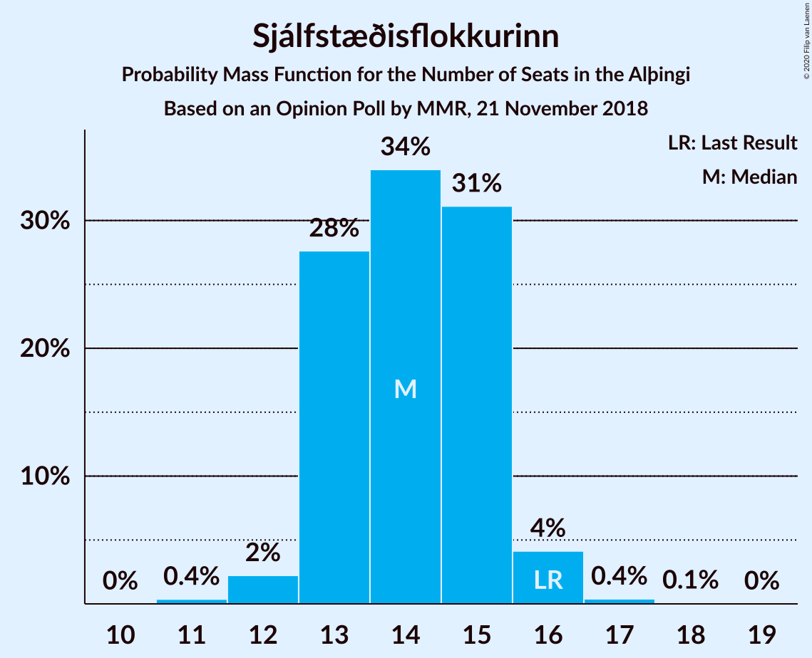
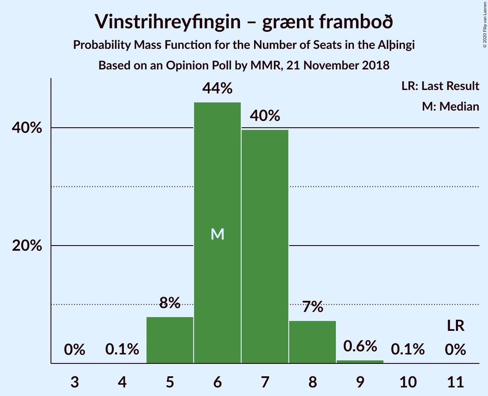

# Opinion Poll by MMR, 21 November 2018

<a href="#voting-intentions">Voting Intentions</a> | <a href="#seats">Seats</a> | <a href="#coalitions">Coalitions</a> | <a href="#technical-information">Technical Information</a>

## Voting Intentions

### Confidence Intervals

| Party | Last Result | Poll Result | 80% Confidence Interval | 90% Confidence Interval | 95% Confidence Interval | 99% Confidence Interval |
|:-----:|:-----------:|:-----------:|:-----------------------:|:-----------------------:|:-----------------------:|:-----------------------:|
| Sjálfstæðisflokkurinn | 25.2% | 21.1% | 19.4–22.9% |19.0–23.4% |18.6–23.9% |17.8–24.8% |
| Samfylkingin | 12.1% | 16.3% | 14.8–17.9% |14.4–18.4% |14.0–18.8% |13.3–19.6% |
| Miðflokkurinn | 10.9% | 13.1% | 11.7–14.6% |11.4–15.0% |11.0–15.4% |10.4–16.2% |
| Píratar | 9.2% | 11.3% | 10.1–12.8% |9.7–13.2% |9.4–13.6% |8.9–14.3% |
| Vinstrihreyfingin – grænt framboð | 16.9% | 10.3% | 9.1–11.7% |8.8–12.1% |8.5–12.5% |8.0–13.2% |
| Viðreisn | 6.7% | 8.6% | 7.5–9.9% |7.2–10.2% |6.9–10.6% |6.4–11.2% |
| Flokkur fólksins | 6.9% | 7.6% | 6.6–8.8% |6.3–9.2% |6.0–9.5% |5.6–10.1% |
| Framsóknarflokkurinn | 10.7% | 7.5% | 6.5–8.7% |6.2–9.1% |5.9–9.4% |5.5–10.0% |

*Note:* The poll result column reflects the actual value used in the calculations. Published results may vary slightly, and in addition be rounded to fewer digits.

## Seats

### Confidence Intervals

| Party | Last Result | Median | 80% Confidence Interval | 90% Confidence Interval | 95% Confidence Interval | 99% Confidence Interval |
|:-----:|:-----------:|:------:|:-----------------------:|:-----------------------:|:-----------------------:|:-----------------------:|
| <a href="#sjálfstæðisflokkurinn">Sjálfstæðisflokkurinn</a> | 16 | 14 | 13–15 |13–15 |12–16 |11–16 |
| <a href="#samfylkingin">Samfylkingin</a> | 7 | 11 | 10–12 |9–12 |9–12 |8–13 |
| <a href="#miðflokkurinn">Miðflokkurinn</a> | 7 | 10 | 8–10 |8–10 |7–11 |7–12 |
| <a href="#píratar">Píratar</a> | 6 | 7 | 6–8 |6–8 |6–9 |5–9 |
| <a href="#vinstrihreyfingin-–-grænt-framboð">Vinstrihreyfingin – grænt framboð</a> | 11 | 7 | 6–8 |5–8 |5–8 |5–9 |
| <a href="#viðreisn">Viðreisn</a> | 4 | 6 | 5–6 |4–7 |4–7 |4–7 |
| <a href="#flokkur-fólksins">Flokkur fólksins</a> | 4 | 5 | 4–5 |4–6 |4–6 |3–7 |
| <a href="#framsóknarflokkurinn">Framsóknarflokkurinn</a> | 8 | 4 | 4–5 |4–6 |3–6 |3–6 |

### Sjálfstæðisflokkurinn

*For a full overview of the results for this party, see the [Sjálfstæðisflokkurinn](party-sjálfstæðisflokkurinn.html) page.*

| Number of Seats | Probability | Accumulated | Special Marks |
|:---------------:|:-----------:|:-----------:|:-------------:|
| 11 | 0.6% | 100% |  |
| 12 | 2% | 99.3% |  |
| 13 | 32% | 97% |  |
| 14 | 35% | 65% | Median |
| 15 | 26% | 31% |  |
| 16 | 4% | 5% | Last Result |
| 17 | 0.4% | 0.5% |  |
| 18 | 0.1% | 0.1% |  |
| 19 | 0% | 0% |  |

### Samfylkingin

*For a full overview of the results for this party, see the [Samfylkingin](party-samfylkingin.html) page.*

| Number of Seats | Probability | Accumulated | Special Marks |
|:---------------:|:-----------:|:-----------:|:-------------:|
| 7 | 0% | 100% | Last Result |
| 8 | 1.1% | 100% |  |
| 9 | 8% | 98.9% |  |
| 10 | 36% | 91% |  |
| 11 | 43% | 55% | Median |
| 12 | 9% | 11% |  |
| 13 | 2% | 2% |  |
| 14 | 0.2% | 0.2% |  |
| 15 | 0% | 0% |  |

### Miðflokkurinn

*For a full overview of the results for this party, see the [Miðflokkurinn](party-miðflokkurinn.html) page.*

| Number of Seats | Probability | Accumulated | Special Marks |
|:---------------:|:-----------:|:-----------:|:-------------:|
| 6 | 0.3% | 100% |  |
| 7 | 4% | 99.7% | Last Result |
| 8 | 7% | 96% |  |
| 9 | 22% | 89% |  |
| 10 | 63% | 67% | Median |
| 11 | 4% | 4% |  |
| 12 | 0.5% | 0.6% |  |
| 13 | 0% | 0% |  |

### Píratar

*For a full overview of the results for this party, see the [Píratar](party-píratar.html) page.*

| Number of Seats | Probability | Accumulated | Special Marks |
|:---------------:|:-----------:|:-----------:|:-------------:|
| 5 | 1.1% | 100% |  |
| 6 | 15% | 98.9% | Last Result |
| 7 | 50% | 84% | Median |
| 8 | 30% | 34% |  |
| 9 | 4% | 4% |  |
| 10 | 0.1% | 0.1% |  |
| 11 | 0% | 0% |  |

### Vinstrihreyfingin – grænt framboð

*For a full overview of the results for this party, see the [Vinstrihreyfingin – grænt framboð](party-vinstrihreyfingin–græntframboð.html) page.*

| Number of Seats | Probability | Accumulated | Special Marks |
|:---------------:|:-----------:|:-----------:|:-------------:|
| 5 | 8% | 100% |  |
| 6 | 33% | 92% |  |
| 7 | 48% | 59% | Median |
| 8 | 10% | 11% |  |
| 9 | 0.7% | 0.8% |  |
| 10 | 0% | 0% |  |
| 11 | 0% | 0% | Last Result |

### Viðreisn

*For a full overview of the results for this party, see the [Viðreisn](party-viðreisn.html) page.*

| Number of Seats | Probability | Accumulated | Special Marks |
|:---------------:|:-----------:|:-----------:|:-------------:|
| 3 | 0.1% | 100% |  |
| 4 | 9% | 99.9% | Last Result |
| 5 | 39% | 91% |  |
| 6 | 45% | 53% | Median |
| 7 | 8% | 8% |  |
| 8 | 0% | 0% |  |

### Flokkur fólksins

*For a full overview of the results for this party, see the [Flokkur fólksins](party-flokkurfólksins.html) page.*

| Number of Seats | Probability | Accumulated | Special Marks |
|:---------------:|:-----------:|:-----------:|:-------------:|
| 3 | 2% | 100% |  |
| 4 | 47% | 98% | Last Result |
| 5 | 43% | 50% | Median |
| 6 | 7% | 7% |  |
| 7 | 0.5% | 0.5% |  |
| 8 | 0% | 0% |  |

### Framsóknarflokkurinn

*For a full overview of the results for this party, see the [Framsóknarflokkurinn](party-framsóknarflokkurinn.html) page.*

| Number of Seats | Probability | Accumulated | Special Marks |
|:---------------:|:-----------:|:-----------:|:-------------:|
| 2 | 0.1% | 100% |  |
| 3 | 3% | 99.9% |  |
| 4 | 48% | 97% | Median |
| 5 | 44% | 50% |  |
| 6 | 5% | 6% |  |
| 7 | 0.3% | 0.3% |  |
| 8 | 0% | 0% | Last Result |

## Coalitions

### Confidence Intervals

| Coalition | Last Result | Median | Majority? | 80% Confidence Interval | 90% Confidence Interval | 95% Confidence Interval | 99% Confidence Interval |
|:---------:|:-----------:|:------:|:---------:|:-----------------------:|:-----------------------:|:-----------------------:|:-----------------------:|
| Samfylkingin – Miðflokkurinn – Vinstrihreyfingin – grænt framboð – Framsóknarflokkurinn | 33 | 31 | 45% | 30–33 | 29–33 | 28–33 | 27–34 |
| Samfylkingin – Píratar – Vinstrihreyfingin – grænt framboð – Viðreisn | 28 | 30 | 19% | 28–32 | 27–32 | 26–33 | 26–33 |
| Sjálfstæðisflokkurinn – Miðflokkurinn – Framsóknarflokkurinn | 31 | 28 | 0.1% | 26–30 | 26–30 | 25–30 | 25–31 |
| Samfylkingin – Miðflokkurinn – Vinstrihreyfingin – grænt framboð | 25 | 27 | 0% | 25–28 | 25–29 | 24–29 | 23–29 |
| Sjálfstæðisflokkurinn – Vinstrihreyfingin – grænt framboð – Framsóknarflokkurinn | 35 | 25 | 0% | 24–27 | 23–27 | 23–27 | 21–28 |
| Samfylkingin – Píratar – Vinstrihreyfingin – grænt framboð | 24 | 24 | 0% | 23–26 | 22–26 | 22–27 | 21–28 |
| Sjálfstæðisflokkurinn – Samfylkingin | 23 | 25 | 0% | 23–26 | 23–26 | 22–27 | 22–28 |
| Sjálfstæðisflokkurinn – Miðflokkurinn | 23 | 24 | 0% | 22–25 | 21–25 | 21–26 | 20–26 |
| Samfylkingin – Vinstrihreyfingin – grænt framboð – Framsóknarflokkurinn | 26 | 22 | 0% | 20–23 | 20–24 | 19–24 | 18–25 |
| Miðflokkurinn – Vinstrihreyfingin – grænt framboð – Framsóknarflokkurinn | 26 | 21 | 0% | 19–22 | 19–23 | 18–23 | 17–23 |
| Sjálfstæðisflokkurinn – Vinstrihreyfingin – grænt framboð | 27 | 21 | 0% | 19–22 | 19–22 | 18–23 | 17–23 |
| Sjálfstæðisflokkurinn – Viðreisn | 20 | 20 | 0% | 18–21 | 18–21 | 17–22 | 16–22 |
| Sjálfstæðisflokkurinn – Framsóknarflokkurinn | 24 | 18 | 0% | 17–20 | 17–20 | 17–21 | 15–21 |
| Samfylkingin – Vinstrihreyfingin – grænt framboð | 18 | 17 | 0% | 16–19 | 15–19 | 15–19 | 14–20 |
| Miðflokkurinn – Vinstrihreyfingin – grænt framboð | 18 | 16 | 0% | 15–17 | 14–18 | 14–18 | 13–19 |
| Píratar – Vinstrihreyfingin – grænt framboð | 17 | 14 | 0% | 12–15 | 12–15 | 12–16 | 11–16 |
| Vinstrihreyfingin – grænt framboð – Framsóknarflokkurinn | 19 | 11 | 0% | 10–12 | 10–13 | 9–13 | 9–14 |

### Samfylkingin – Miðflokkurinn – Vinstrihreyfingin – grænt framboð – Framsóknarflokkurinn

| Number of Seats | Probability | Accumulated | Special Marks |
|:---------------:|:-----------:|:-----------:|:-------------:|
| 27 | 0.5% | 100% |  |
| 28 | 2% | 99.4% |  |
| 29 | 7% | 97% |  |
| 30 | 14% | 90% |  |
| 31 | 31% | 77% |  |
| 32 | 27% | 45% | Median, Majority |
| 33 | 17% | 19% | Last Result |
| 34 | 2% | 2% |  |
| 35 | 0.2% | 0.3% |  |
| 36 | 0% | 0% |  |

### Samfylkingin – Píratar – Vinstrihreyfingin – grænt framboð – Viðreisn

| Number of Seats | Probability | Accumulated | Special Marks |
|:---------------:|:-----------:|:-----------:|:-------------:|
| 25 | 0.2% | 100% |  |
| 26 | 4% | 99.8% |  |
| 27 | 3% | 95% |  |
| 28 | 10% | 92% | Last Result |
| 29 | 23% | 82% |  |
| 30 | 18% | 59% |  |
| 31 | 21% | 40% | Median |
| 32 | 16% | 19% | Majority |
| 33 | 4% | 4% |  |
| 34 | 0.1% | 0.1% |  |
| 35 | 0% | 0% |  |

### Sjálfstæðisflokkurinn – Miðflokkurinn – Framsóknarflokkurinn

| Number of Seats | Probability | Accumulated | Special Marks |
|:---------------:|:-----------:|:-----------:|:-------------:|
| 24 | 0.2% | 100% |  |
| 25 | 3% | 99.8% |  |
| 26 | 11% | 96% |  |
| 27 | 20% | 85% |  |
| 28 | 26% | 66% | Median |
| 29 | 20% | 40% |  |
| 30 | 18% | 20% |  |
| 31 | 2% | 2% | Last Result |
| 32 | 0.1% | 0.1% | Majority |
| 33 | 0% | 0% |  |

### Samfylkingin – Miðflokkurinn – Vinstrihreyfingin – grænt framboð

| Number of Seats | Probability | Accumulated | Special Marks |
|:---------------:|:-----------:|:-----------:|:-------------:|
| 22 | 0.1% | 100% |  |
| 23 | 0.6% | 99.8% |  |
| 24 | 3% | 99.3% |  |
| 25 | 12% | 96% | Last Result |
| 26 | 21% | 84% |  |
| 27 | 36% | 63% |  |
| 28 | 21% | 27% | Median |
| 29 | 6% | 6% |  |
| 30 | 0.3% | 0.4% |  |
| 31 | 0.1% | 0.1% |  |
| 32 | 0% | 0% | Majority |

### Sjálfstæðisflokkurinn – Vinstrihreyfingin – grænt framboð – Framsóknarflokkurinn

| Number of Seats | Probability | Accumulated | Special Marks |
|:---------------:|:-----------:|:-----------:|:-------------:|
| 21 | 0.5% | 100% |  |
| 22 | 1.0% | 99.5% |  |
| 23 | 4% | 98% |  |
| 24 | 22% | 94% |  |
| 25 | 36% | 72% | Median |
| 26 | 25% | 36% |  |
| 27 | 10% | 11% |  |
| 28 | 1.3% | 2% |  |
| 29 | 0.2% | 0.3% |  |
| 30 | 0.1% | 0.1% |  |
| 31 | 0% | 0% |  |
| 32 | 0% | 0% | Majority |
| 33 | 0% | 0% |  |
| 34 | 0% | 0% |  |
| 35 | 0% | 0% | Last Result |

### Samfylkingin – Píratar – Vinstrihreyfingin – grænt framboð

| Number of Seats | Probability | Accumulated | Special Marks |
|:---------------:|:-----------:|:-----------:|:-------------:|
| 20 | 0.2% | 100% |  |
| 21 | 2% | 99.8% |  |
| 22 | 7% | 98% |  |
| 23 | 20% | 90% |  |
| 24 | 22% | 70% | Last Result |
| 25 | 19% | 48% | Median |
| 26 | 24% | 29% |  |
| 27 | 4% | 4% |  |
| 28 | 0.5% | 0.5% |  |
| 29 | 0% | 0% |  |

### Sjálfstæðisflokkurinn – Samfylkingin

| Number of Seats | Probability | Accumulated | Special Marks |
|:---------------:|:-----------:|:-----------:|:-------------:|
| 21 | 0.4% | 100% |  |
| 22 | 2% | 99.6% |  |
| 23 | 11% | 97% | Last Result |
| 24 | 36% | 86% |  |
| 25 | 31% | 50% | Median |
| 26 | 16% | 19% |  |
| 27 | 2% | 3% |  |
| 28 | 1.0% | 1.2% |  |
| 29 | 0.2% | 0.3% |  |
| 30 | 0% | 0% |  |

### Sjálfstæðisflokkurinn – Miðflokkurinn

| Number of Seats | Probability | Accumulated | Special Marks |
|:---------------:|:-----------:|:-----------:|:-------------:|
| 19 | 0.1% | 100% |  |
| 20 | 0.9% | 99.8% |  |
| 21 | 5% | 99.0% |  |
| 22 | 12% | 93% |  |
| 23 | 29% | 81% | Last Result |
| 24 | 26% | 52% | Median |
| 25 | 21% | 26% |  |
| 26 | 4% | 4% |  |
| 27 | 0.4% | 0.4% |  |
| 28 | 0% | 0% |  |

### Samfylkingin – Vinstrihreyfingin – grænt framboð – Framsóknarflokkurinn

| Number of Seats | Probability | Accumulated | Special Marks |
|:---------------:|:-----------:|:-----------:|:-------------:|
| 17 | 0.2% | 100% |  |
| 18 | 0.6% | 99.8% |  |
| 19 | 3% | 99.2% |  |
| 20 | 13% | 96% |  |
| 21 | 19% | 82% |  |
| 22 | 40% | 63% | Median |
| 23 | 17% | 24% |  |
| 24 | 6% | 7% |  |
| 25 | 0.9% | 1.1% |  |
| 26 | 0.2% | 0.2% | Last Result |
| 27 | 0% | 0% |  |

### Miðflokkurinn – Vinstrihreyfingin – grænt framboð – Framsóknarflokkurinn

| Number of Seats | Probability | Accumulated | Special Marks |
|:---------------:|:-----------:|:-----------:|:-------------:|
| 16 | 0.1% | 100% |  |
| 17 | 1.0% | 99.9% |  |
| 18 | 2% | 98.8% |  |
| 19 | 9% | 96% |  |
| 20 | 25% | 87% |  |
| 21 | 42% | 62% | Median |
| 22 | 14% | 20% |  |
| 23 | 6% | 6% |  |
| 24 | 0.1% | 0.1% |  |
| 25 | 0% | 0% |  |
| 26 | 0% | 0% | Last Result |

### Sjálfstæðisflokkurinn – Vinstrihreyfingin – grænt framboð

| Number of Seats | Probability | Accumulated | Special Marks |
|:---------------:|:-----------:|:-----------:|:-------------:|
| 17 | 0.5% | 100% |  |
| 18 | 3% | 99.4% |  |
| 19 | 8% | 97% |  |
| 20 | 34% | 89% |  |
| 21 | 38% | 54% | Median |
| 22 | 12% | 16% |  |
| 23 | 4% | 4% |  |
| 24 | 0.3% | 0.3% |  |
| 25 | 0.1% | 0.1% |  |
| 26 | 0% | 0% |  |
| 27 | 0% | 0% | Last Result |

### Sjálfstæðisflokkurinn – Viðreisn

| Number of Seats | Probability | Accumulated | Special Marks |
|:---------------:|:-----------:|:-----------:|:-------------:|
| 16 | 0.5% | 100% |  |
| 17 | 3% | 99.5% |  |
| 18 | 13% | 96% |  |
| 19 | 30% | 83% |  |
| 20 | 38% | 53% | Last Result, Median |
| 21 | 11% | 15% |  |
| 22 | 4% | 4% |  |
| 23 | 0.2% | 0.3% |  |
| 24 | 0.1% | 0.1% |  |
| 25 | 0% | 0% |  |

### Sjálfstæðisflokkurinn – Framsóknarflokkurinn

| Number of Seats | Probability | Accumulated | Special Marks |
|:---------------:|:-----------:|:-----------:|:-------------:|
| 15 | 0.5% | 100% |  |
| 16 | 1.0% | 99.5% |  |
| 17 | 18% | 98% |  |
| 18 | 32% | 80% | Median |
| 19 | 26% | 48% |  |
| 20 | 20% | 22% |  |
| 21 | 2% | 3% |  |
| 22 | 0.3% | 0.4% |  |
| 23 | 0.1% | 0.1% |  |
| 24 | 0% | 0% | Last Result |

### Samfylkingin – Vinstrihreyfingin – grænt framboð

| Number of Seats | Probability | Accumulated | Special Marks |
|:---------------:|:-----------:|:-----------:|:-------------:|
| 13 | 0.2% | 100% |  |
| 14 | 1.0% | 99.8% |  |
| 15 | 7% | 98.8% |  |
| 16 | 21% | 92% |  |
| 17 | 25% | 71% |  |
| 18 | 36% | 46% | Last Result, Median |
| 19 | 8% | 10% |  |
| 20 | 2% | 2% |  |
| 21 | 0.1% | 0.2% |  |
| 22 | 0% | 0% |  |

### Miðflokkurinn – Vinstrihreyfingin – grænt framboð

| Number of Seats | Probability | Accumulated | Special Marks |
|:---------------:|:-----------:|:-----------:|:-------------:|
| 12 | 0.3% | 100% |  |
| 13 | 1.2% | 99.7% |  |
| 14 | 5% | 98.5% |  |
| 15 | 13% | 94% |  |
| 16 | 44% | 81% |  |
| 17 | 31% | 38% | Median |
| 18 | 5% | 6% | Last Result |
| 19 | 0.9% | 1.0% |  |
| 20 | 0% | 0% |  |

### Píratar – Vinstrihreyfingin – grænt framboð

| Number of Seats | Probability | Accumulated | Special Marks |
|:---------------:|:-----------:|:-----------:|:-------------:|
| 11 | 2% | 100% |  |
| 12 | 10% | 98% |  |
| 13 | 31% | 88% |  |
| 14 | 21% | 57% | Median |
| 15 | 32% | 36% |  |
| 16 | 3% | 4% |  |
| 17 | 0.2% | 0.3% | Last Result |
| 18 | 0.1% | 0.1% |  |
| 19 | 0% | 0% |  |

### Vinstrihreyfingin – grænt framboð – Framsóknarflokkurinn

| Number of Seats | Probability | Accumulated | Special Marks |
|:---------------:|:-----------:|:-----------:|:-------------:|
| 8 | 0.2% | 100% |  |
| 9 | 4% | 99.8% |  |
| 10 | 13% | 95% |  |
| 11 | 56% | 82% | Median |
| 12 | 17% | 26% |  |
| 13 | 8% | 9% |  |
| 14 | 1.4% | 1.5% |  |
| 15 | 0% | 0% |  |
| 16 | 0% | 0% |  |
| 17 | 0% | 0% |  |
| 18 | 0% | 0% |  |
| 19 | 0% | 0% | Last Result |

## Technical Information

### Opinion Poll

+ **Polling firm:** MMR
+ **Commissioner(s):** —
+ **Fieldwork period:** 21 November 2018

### Calculations

+ **Sample size:** 910
+ **Simulations done:** 131,072
+ **Error estimate:** 1.40%

