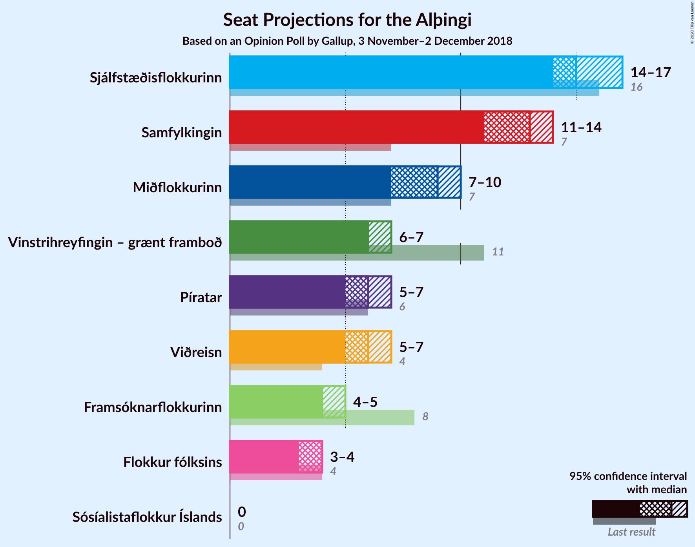
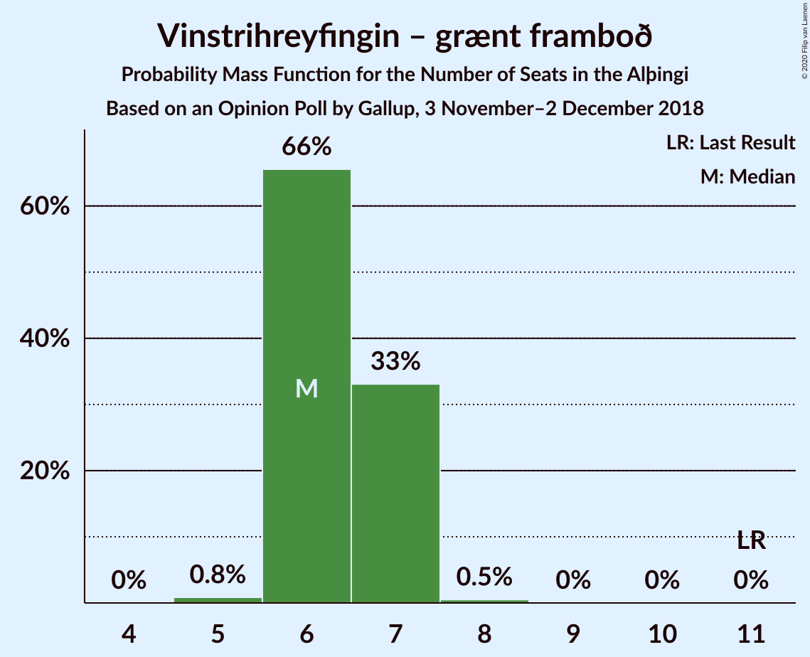
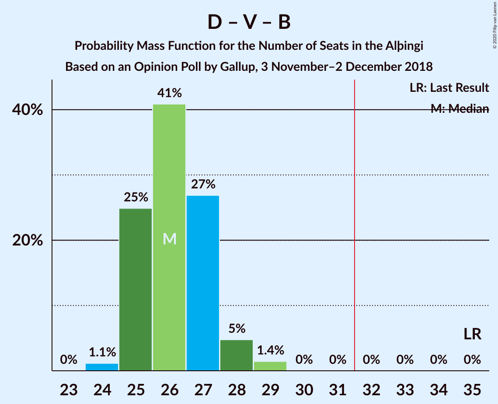
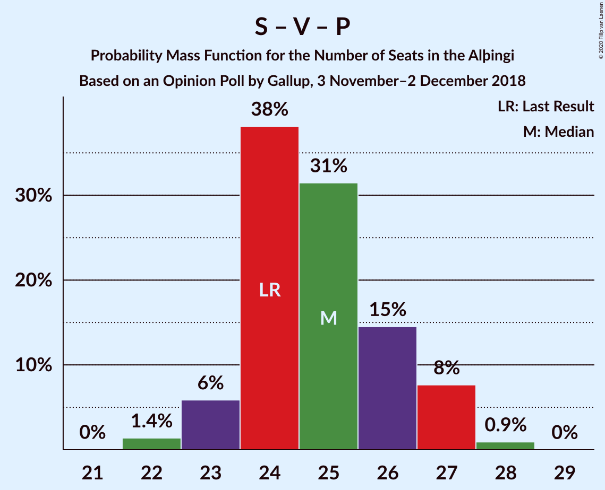

# Opinion Poll by Gallup, 3 November–2 December 2018

<a href="#voting-intentions">Voting Intentions</a> | <a href="#seats">Seats</a> | <a href="#coalitions">Coalitions</a> | <a href="#technical-information">Technical Information</a>

## Voting Intentions

### Confidence Intervals

| Party | Last Result | Poll Result | 80% Confidence Interval | 90% Confidence Interval | 95% Confidence Interval | 99% Confidence Interval |
|:-----:|:-----------:|:-----------:|:-----------------------:|:-----------------------:|:-----------------------:|:-----------------------:|
| Sjálfstæðisflokkurinn | 25.2% | 23.5% | 22.6–24.5% |22.3–24.8% |22.1–25.0% |21.6–25.5% |
| Samfylkingin | 12.1% | 18.7% | 17.8–19.6% |17.6–19.9% |17.4–20.1% |17.0–20.6% |
| Miðflokkurinn | 10.9% | 12.0% | 11.3–12.8% |11.1–13.0% |10.9–13.2% |10.6–13.6% |
| Vinstrihreyfingin – grænt framboð | 16.9% | 10.5% | 9.8–11.2% |9.6–11.5% |9.5–11.6% |9.2–12.0% |
| Píratar | 9.2% | 10.2% | 9.5–10.9% |9.3–11.1% |9.2–11.3% |8.9–11.7% |
| Viðreisn | 6.7% | 9.8% | 9.1–10.5% |9.0–10.7% |8.8–10.9% |8.5–11.2% |
| Framsóknarflokkurinn | 10.7% | 7.5% | 6.9–8.2% |6.8–8.3% |6.6–8.5% |6.4–8.8% |
| Flokkur fólksins | 6.9% | 6.2% | 5.7–6.8% |5.5–7.0% |5.4–7.1% |5.2–7.4% |

*Note:* The poll result column reflects the actual value used in the calculations. Published results may vary slightly, and in addition be rounded to fewer digits.

## Seats

### Confidence Intervals

| Party | Last Result | Median | 80% Confidence Interval | 90% Confidence Interval | 95% Confidence Interval | 99% Confidence Interval |
|:-----:|:-----------:|:------:|:-----------------------:|:-----------------------:|:-----------------------:|:-----------------------:|
| <a href="#sjálfstæðisflokkurinn">Sjálfstæðisflokkurinn</a> | 16 | 16 | 14–16 |14–16 |14–17 |14–17 |
| <a href="#samfylkingin">Samfylkingin</a> | 7 | 12 | 11–13 |11–14 |11–14 |11–14 |
| <a href="#miðflokkurinn">Miðflokkurinn</a> | 7 | 9 | 7–10 |7–10 |7–10 |7–10 |
| <a href="#vinstrihreyfingin-–-grænt-framboð">Vinstrihreyfingin – grænt framboð</a> | 11 | 6 | 6–7 |6–7 |6–7 |5–8 |
| <a href="#píratar">Píratar</a> | 6 | 6 | 6–7 |6–7 |5–7 |5–7 |
| <a href="#viðreisn">Viðreisn</a> | 4 | 6 | 5–6 |5–6 |5–6 |5–7 |
| <a href="#framsóknarflokkurinn">Framsóknarflokkurinn</a> | 8 | 4 | 4–5 |4–5 |4–5 |4–5 |
| <a href="#flokkur-fólksins">Flokkur fólksins</a> | 4 | 4 | 3–4 |3–4 |3–4 |3–4 |

### Sjálfstæðisflokkurinn

*For a full overview of the results for this party, see the [Sjálfstæðisflokkurinn](party-sjálfstæðisflokkurinn.html) page.*

| Number of Seats | Probability | Accumulated | Special Marks |
|:---------------:|:-----------:|:-----------:|:-------------:|
| 13 | 0.3% | 100% |  |
| 14 | 11% | 99.7% |  |
| 15 | 36% | 89% |  |
| 16 | 49% | 53% | Last Result, Median |
| 17 | 4% | 4% |  |
| 18 | 0.2% | 0.3% |  |
| 19 | 0.1% | 0.1% |  |
| 20 | 0% | 0% |  |

### Samfylkingin

*For a full overview of the results for this party, see the [Samfylkingin](party-samfylkingin.html) page.*

| Number of Seats | Probability | Accumulated | Special Marks |
|:---------------:|:-----------:|:-----------:|:-------------:|
| 7 | 0% | 100% | Last Result |
| 8 | 0% | 100% |  |
| 9 | 0% | 100% |  |
| 10 | 0.3% | 100% |  |
| 11 | 30% | 99.7% |  |
| 12 | 29% | 70% | Median |
| 13 | 34% | 41% |  |
| 14 | 6% | 7% |  |
| 15 | 0.3% | 0.3% |  |
| 16 | 0% | 0% |  |

### Miðflokkurinn

*For a full overview of the results for this party, see the [Miðflokkurinn](party-miðflokkurinn.html) page.*

| Number of Seats | Probability | Accumulated | Special Marks |
|:---------------:|:-----------:|:-----------:|:-------------:|
| 6 | 0.2% | 100% |  |
| 7 | 25% | 99.8% | Last Result |
| 8 | 4% | 74% |  |
| 9 | 51% | 70% | Median |
| 10 | 20% | 20% |  |
| 11 | 0% | 0% |  |

### Vinstrihreyfingin – grænt framboð

*For a full overview of the results for this party, see the [Vinstrihreyfingin – grænt framboð](party-vinstrihreyfingin–græntframboð.html) page.*

| Number of Seats | Probability | Accumulated | Special Marks |
|:---------------:|:-----------:|:-----------:|:-------------:|
| 5 | 0.5% | 100% |  |
| 6 | 55% | 99.5% | Median |
| 7 | 43% | 44% |  |
| 8 | 1.0% | 1.1% |  |
| 9 | 0% | 0% |  |
| 10 | 0% | 0% |  |
| 11 | 0% | 0% | Last Result |

### Píratar

*For a full overview of the results for this party, see the [Píratar](party-píratar.html) page.*

| Number of Seats | Probability | Accumulated | Special Marks |
|:---------------:|:-----------:|:-----------:|:-------------:|
| 5 | 3% | 100% |  |
| 6 | 54% | 97% | Last Result, Median |
| 7 | 43% | 44% |  |
| 8 | 0.1% | 0.1% |  |
| 9 | 0% | 0% |  |

### Viðreisn

*For a full overview of the results for this party, see the [Viðreisn](party-viðreisn.html) page.*

| Number of Seats | Probability | Accumulated | Special Marks |
|:---------------:|:-----------:|:-----------:|:-------------:|
| 4 | 0% | 100% | Last Result |
| 5 | 10% | 100% |  |
| 6 | 88% | 90% | Median |
| 7 | 2% | 2% |  |
| 8 | 0% | 0% |  |

### Framsóknarflokkurinn

*For a full overview of the results for this party, see the [Framsóknarflokkurinn](party-framsóknarflokkurinn.html) page.*

| Number of Seats | Probability | Accumulated | Special Marks |
|:---------------:|:-----------:|:-----------:|:-------------:|
| 4 | 60% | 100% | Median |
| 5 | 40% | 40% |  |
| 6 | 0.1% | 0.1% |  |
| 7 | 0% | 0% |  |
| 8 | 0% | 0% | Last Result |

### Flokkur fólksins

*For a full overview of the results for this party, see the [Flokkur fólksins](party-flokkurfólksins.html) page.*

| Number of Seats | Probability | Accumulated | Special Marks |
|:---------------:|:-----------:|:-----------:|:-------------:|
| 3 | 46% | 100% |  |
| 4 | 54% | 54% | Last Result, Median |
| 5 | 0.2% | 0.2% |  |
| 6 | 0% | 0% |  |

## Coalitions

### Confidence Intervals

| Coalition | Last Result | Median | Majority? | 80% Confidence Interval | 90% Confidence Interval | 95% Confidence Interval | 99% Confidence Interval |
|:---------:|:-----------:|:------:|:---------:|:-----------------------:|:-----------------------:|:-----------------------:|:-----------------------:|
| Samfylkingin – Miðflokkurinn – Vinstrihreyfingin – grænt framboð – Framsóknarflokkurinn | 33 | 31 | 49% | 31–33 | 31–34 | 30–34 | 30–34 |
| Samfylkingin – Vinstrihreyfingin – grænt framboð – Píratar – Viðreisn | 28 | 31 | 34% | 30–32 | 29–33 | 29–33 | 28–33 |
| Sjálfstæðisflokkurinn – Miðflokkurinn – Framsóknarflokkurinn | 31 | 28 | 0.2% | 27–30 | 27–30 | 27–30 | 26–31 |
| Samfylkingin – Miðflokkurinn – Vinstrihreyfingin – grænt framboð | 25 | 27 | 0% | 26–28 | 26–30 | 26–30 | 25–30 |
| Sjálfstæðisflokkurinn – Samfylkingin | 23 | 27 | 0% | 26–29 | 26–29 | 26–30 | 25–30 |
| Sjálfstæðisflokkurinn – Vinstrihreyfingin – grænt framboð – Framsóknarflokkurinn | 35 | 26 | 0% | 25–27 | 25–27 | 25–28 | 24–29 |
| Samfylkingin – Vinstrihreyfingin – grænt framboð – Píratar | 24 | 25 | 0% | 24–26 | 24–27 | 23–27 | 23–27 |
| Sjálfstæðisflokkurinn – Miðflokkurinn | 23 | 24 | 0% | 23–26 | 23–26 | 22–26 | 22–27 |
| Samfylkingin – Vinstrihreyfingin – grænt framboð – Framsóknarflokkurinn | 26 | 23 | 0% | 21–24 | 21–25 | 21–25 | 21–25 |
| Sjálfstæðisflokkurinn – Vinstrihreyfingin – grænt framboð | 27 | 22 | 0% | 21–23 | 21–23 | 21–23 | 20–24 |
| Sjálfstæðisflokkurinn – Viðreisn | 20 | 22 | 0% | 20–22 | 20–22 | 20–23 | 19–23 |
| Miðflokkurinn – Vinstrihreyfingin – grænt framboð – Framsóknarflokkurinn | 26 | 20 | 0% | 18–21 | 18–21 | 18–21 | 17–22 |
| Sjálfstæðisflokkurinn – Framsóknarflokkurinn | 24 | 20 | 0% | 19–21 | 18–21 | 18–21 | 18–22 |
| Samfylkingin – Vinstrihreyfingin – grænt framboð | 18 | 19 | 0% | 17–20 | 17–21 | 17–21 | 17–21 |
| Miðflokkurinn – Vinstrihreyfingin – grænt framboð | 18 | 16 | 0% | 13–16 | 13–16 | 13–17 | 13–17 |
| Vinstrihreyfingin – grænt framboð – Píratar | 17 | 13 | 0% | 12–13 | 12–14 | 11–14 | 11–14 |
| Vinstrihreyfingin – grænt framboð – Framsóknarflokkurinn | 19 | 11 | 0% | 10–11 | 10–12 | 10–12 | 10–13 |

### Samfylkingin – Miðflokkurinn – Vinstrihreyfingin – grænt framboð – Framsóknarflokkurinn

| Number of Seats | Probability | Accumulated | Special Marks |
|:---------------:|:-----------:|:-----------:|:-------------:|
| 29 | 0.1% | 100% |  |
| 30 | 3% | 99.9% |  |
| 31 | 48% | 97% | Median |
| 32 | 36% | 49% | Majority |
| 33 | 7% | 14% | Last Result |
| 34 | 6% | 6% |  |
| 35 | 0.1% | 0.1% |  |
| 36 | 0% | 0% |  |

### Samfylkingin – Vinstrihreyfingin – grænt framboð – Píratar – Viðreisn

| Number of Seats | Probability | Accumulated | Special Marks |
|:---------------:|:-----------:|:-----------:|:-------------:|
| 28 | 0.7% | 100% | Last Result |
| 29 | 5% | 99.3% |  |
| 30 | 33% | 94% | Median |
| 31 | 26% | 61% |  |
| 32 | 28% | 34% | Majority |
| 33 | 6% | 6% |  |
| 34 | 0.1% | 0.1% |  |
| 35 | 0% | 0% |  |

### Sjálfstæðisflokkurinn – Miðflokkurinn – Framsóknarflokkurinn

| Number of Seats | Probability | Accumulated | Special Marks |
|:---------------:|:-----------:|:-----------:|:-------------:|
| 26 | 0.7% | 100% |  |
| 27 | 12% | 99.3% |  |
| 28 | 45% | 87% |  |
| 29 | 23% | 43% | Median |
| 30 | 17% | 19% |  |
| 31 | 2% | 2% | Last Result |
| 32 | 0.2% | 0.2% | Majority |
| 33 | 0% | 0% |  |

### Samfylkingin – Miðflokkurinn – Vinstrihreyfingin – grænt framboð

| Number of Seats | Probability | Accumulated | Special Marks |
|:---------------:|:-----------:|:-----------:|:-------------:|
| 25 | 0.8% | 100% | Last Result |
| 26 | 24% | 99.1% |  |
| 27 | 35% | 75% | Median |
| 28 | 32% | 39% |  |
| 29 | 2% | 8% |  |
| 30 | 5% | 5% |  |
| 31 | 0% | 0% |  |

### Sjálfstæðisflokkurinn – Samfylkingin

| Number of Seats | Probability | Accumulated | Special Marks |
|:---------------:|:-----------:|:-----------:|:-------------:|
| 23 | 0% | 100% | Last Result |
| 24 | 0% | 100% |  |
| 25 | 1.1% | 100% |  |
| 26 | 10% | 98.9% |  |
| 27 | 44% | 89% |  |
| 28 | 16% | 45% | Median |
| 29 | 26% | 28% |  |
| 30 | 3% | 3% |  |
| 31 | 0.1% | 0.1% |  |
| 32 | 0% | 0% | Majority |

### Sjálfstæðisflokkurinn – Vinstrihreyfingin – grænt framboð – Framsóknarflokkurinn

| Number of Seats | Probability | Accumulated | Special Marks |
|:---------------:|:-----------:|:-----------:|:-------------:|
| 24 | 0.7% | 100% |  |
| 25 | 12% | 99.3% |  |
| 26 | 47% | 87% | Median |
| 27 | 37% | 41% |  |
| 28 | 3% | 3% |  |
| 29 | 0.5% | 0.5% |  |
| 30 | 0% | 0% |  |
| 31 | 0% | 0% |  |
| 32 | 0% | 0% | Majority |
| 33 | 0% | 0% |  |
| 34 | 0% | 0% |  |
| 35 | 0% | 0% | Last Result |

### Samfylkingin – Vinstrihreyfingin – grænt framboð – Píratar

| Number of Seats | Probability | Accumulated | Special Marks |
|:---------------:|:-----------:|:-----------:|:-------------:|
| 22 | 0.3% | 100% |  |
| 23 | 4% | 99.7% |  |
| 24 | 31% | 95% | Last Result, Median |
| 25 | 28% | 65% |  |
| 26 | 30% | 37% |  |
| 27 | 6% | 6% |  |
| 28 | 0.1% | 0.1% |  |
| 29 | 0% | 0% |  |

### Sjálfstæðisflokkurinn – Miðflokkurinn

| Number of Seats | Probability | Accumulated | Special Marks |
|:---------------:|:-----------:|:-----------:|:-------------:|
| 21 | 0.4% | 100% |  |
| 22 | 2% | 99.6% |  |
| 23 | 33% | 97% | Last Result |
| 24 | 31% | 64% |  |
| 25 | 17% | 33% | Median |
| 26 | 15% | 16% |  |
| 27 | 0.7% | 0.8% |  |
| 28 | 0.1% | 0.1% |  |
| 29 | 0% | 0% |  |

### Samfylkingin – Vinstrihreyfingin – grænt framboð – Framsóknarflokkurinn

| Number of Seats | Probability | Accumulated | Special Marks |
|:---------------:|:-----------:|:-----------:|:-------------:|
| 21 | 11% | 100% |  |
| 22 | 22% | 89% | Median |
| 23 | 28% | 66% |  |
| 24 | 31% | 39% |  |
| 25 | 7% | 8% |  |
| 26 | 0.5% | 0.5% | Last Result |
| 27 | 0% | 0% |  |

### Sjálfstæðisflokkurinn – Vinstrihreyfingin – grænt framboð

| Number of Seats | Probability | Accumulated | Special Marks |
|:---------------:|:-----------:|:-----------:|:-------------:|
| 19 | 0.2% | 100% |  |
| 20 | 2% | 99.8% |  |
| 21 | 21% | 98% |  |
| 22 | 61% | 77% | Median |
| 23 | 14% | 16% |  |
| 24 | 1.0% | 1.1% |  |
| 25 | 0.1% | 0.1% |  |
| 26 | 0% | 0% |  |
| 27 | 0% | 0% | Last Result |

### Sjálfstæðisflokkurinn – Viðreisn

| Number of Seats | Probability | Accumulated | Special Marks |
|:---------------:|:-----------:|:-----------:|:-------------:|
| 19 | 0.9% | 100% |  |
| 20 | 13% | 99.1% | Last Result |
| 21 | 35% | 86% |  |
| 22 | 49% | 51% | Median |
| 23 | 2% | 3% |  |
| 24 | 0.2% | 0.3% |  |
| 25 | 0% | 0% |  |

### Miðflokkurinn – Vinstrihreyfingin – grænt framboð – Framsóknarflokkurinn

| Number of Seats | Probability | Accumulated | Special Marks |
|:---------------:|:-----------:|:-----------:|:-------------:|
| 17 | 2% | 100% |  |
| 18 | 22% | 98% |  |
| 19 | 11% | 76% | Median |
| 20 | 54% | 64% |  |
| 21 | 10% | 11% |  |
| 22 | 0.7% | 0.7% |  |
| 23 | 0% | 0% |  |
| 24 | 0% | 0% |  |
| 25 | 0% | 0% |  |
| 26 | 0% | 0% | Last Result |

### Sjálfstæðisflokkurinn – Framsóknarflokkurinn

| Number of Seats | Probability | Accumulated | Special Marks |
|:---------------:|:-----------:|:-----------:|:-------------:|
| 18 | 7% | 100% |  |
| 19 | 29% | 93% |  |
| 20 | 36% | 64% | Median |
| 21 | 26% | 28% |  |
| 22 | 1.3% | 1.4% |  |
| 23 | 0.1% | 0.1% |  |
| 24 | 0% | 0% | Last Result |

### Samfylkingin – Vinstrihreyfingin – grænt framboð

| Number of Seats | Probability | Accumulated | Special Marks |
|:---------------:|:-----------:|:-----------:|:-------------:|
| 16 | 0.3% | 100% |  |
| 17 | 15% | 99.7% |  |
| 18 | 24% | 85% | Last Result, Median |
| 19 | 49% | 60% |  |
| 20 | 6% | 12% |  |
| 21 | 6% | 6% |  |
| 22 | 0% | 0% |  |

### Miðflokkurinn – Vinstrihreyfingin – grænt framboð

| Number of Seats | Probability | Accumulated | Special Marks |
|:---------------:|:-----------:|:-----------:|:-------------:|
| 12 | 0.1% | 100% |  |
| 13 | 23% | 99.9% |  |
| 14 | 4% | 77% |  |
| 15 | 17% | 73% | Median |
| 16 | 53% | 56% |  |
| 17 | 3% | 3% |  |
| 18 | 0% | 0% | Last Result |

### Vinstrihreyfingin – grænt framboð – Píratar

| Number of Seats | Probability | Accumulated | Special Marks |
|:---------------:|:-----------:|:-----------:|:-------------:|
| 10 | 0.1% | 100% |  |
| 11 | 3% | 99.9% |  |
| 12 | 15% | 97% | Median |
| 13 | 76% | 82% |  |
| 14 | 6% | 6% |  |
| 15 | 0.2% | 0.2% |  |
| 16 | 0% | 0% |  |
| 17 | 0% | 0% | Last Result |

### Vinstrihreyfingin – grænt framboð – Framsóknarflokkurinn

| Number of Seats | Probability | Accumulated | Special Marks |
|:---------------:|:-----------:|:-----------:|:-------------:|
| 9 | 0.2% | 100% |  |
| 10 | 23% | 99.8% | Median |
| 11 | 70% | 77% |  |
| 12 | 6% | 7% |  |
| 13 | 1.0% | 1.0% |  |
| 14 | 0% | 0% |  |
| 15 | 0% | 0% |  |
| 16 | 0% | 0% |  |
| 17 | 0% | 0% |  |
| 18 | 0% | 0% |  |
| 19 | 0% | 0% | Last Result |

## Technical Information

### Opinion Poll

+ **Polling firm:** Gallup
+ **Commissioner(s):** —
+ **Fieldwork period:** 3 November–2 December 2018

### Calculations

+ **Sample size:** 3101
+ **Simulations done:** 131,072
+ **Error estimate:** 1.25%

