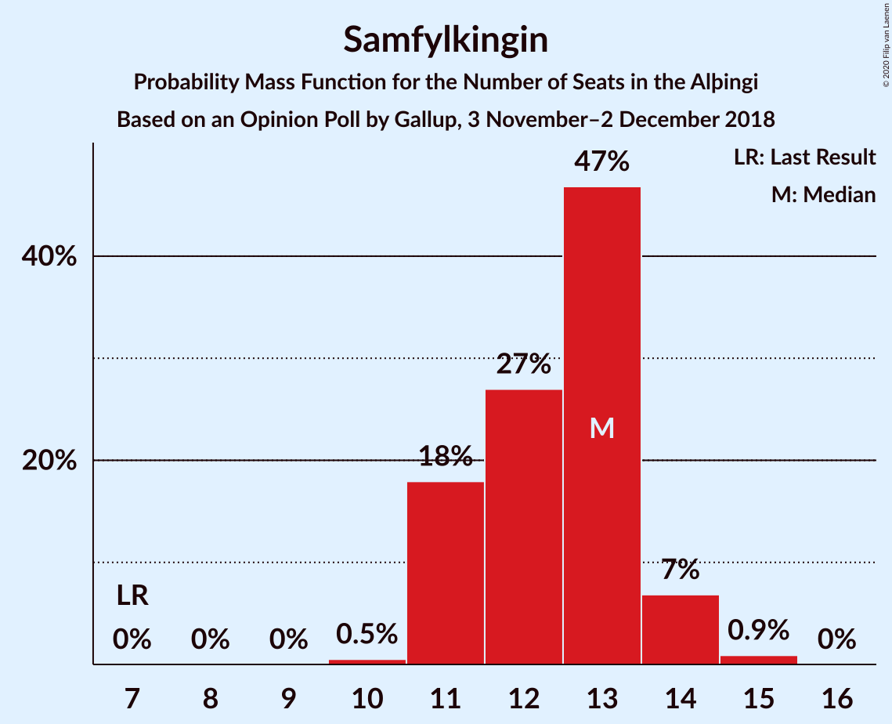

# Opinion Poll by Gallup, 3 November–2 December 2018

<a href="#voting-intentions">Voting Intentions</a> | <a href="#seats">Seats</a> | <a href="#coalitions">Coalitions</a> | <a href="#technical-information">Technical Information</a>

## Voting Intentions

### Confidence Intervals

| Party | Last Result | Poll Result | 80% Confidence Interval | 90% Confidence Interval | 95% Confidence Interval | 99% Confidence Interval |
|:-----:|:-----------:|:-----------:|:-----------------------:|:-----------------------:|:-----------------------:|:-----------------------:|
| Sjálfstæðisflokkurinn | 25.2% | 23.5% | 22.6–24.5% |22.3–24.8% |22.1–25.0% |21.6–25.5% |
| Samfylkingin | 12.1% | 18.7% | 17.8–19.6% |17.6–19.9% |17.4–20.1% |17.0–20.6% |
| Miðflokkurinn | 10.9% | 12.0% | 11.3–12.8% |11.1–13.0% |10.9–13.2% |10.6–13.6% |
| Vinstrihreyfingin – grænt framboð | 16.9% | 10.5% | 9.8–11.2% |9.6–11.5% |9.5–11.6% |9.2–12.0% |
| Píratar | 9.2% | 10.2% | 9.5–10.9% |9.3–11.1% |9.2–11.3% |8.9–11.7% |
| Viðreisn | 6.7% | 9.8% | 9.1–10.5% |9.0–10.7% |8.8–10.9% |8.5–11.2% |
| Framsóknarflokkurinn | 10.7% | 7.5% | 6.9–8.2% |6.8–8.3% |6.6–8.5% |6.4–8.8% |
| Flokkur fólksins | 6.9% | 6.2% | 5.7–6.8% |5.5–7.0% |5.4–7.1% |5.2–7.4% |

*Note:* The poll result column reflects the actual value used in the calculations. Published results may vary slightly, and in addition be rounded to fewer digits.

## Seats

### Confidence Intervals

| Party | Last Result | Median | 80% Confidence Interval | 90% Confidence Interval | 95% Confidence Interval | 99% Confidence Interval |
|:-----:|:-----------:|:------:|:-----------------------:|:-----------------------:|:-----------------------:|:-----------------------:|
| <a href="#sjálfstæðisflokkurinn">Sjálfstæðisflokkurinn</a> | 16 | 15 | 15–16 |15–16 |15–16 |15–16 |
| <a href="#samfylkingin">Samfylkingin</a> | 7 | 13 | 11–13 |11–13 |11–13 |11–13 |
| <a href="#miðflokkurinn">Miðflokkurinn</a> | 7 | 7 | 7–10 |7–10 |7–10 |7–10 |
| <a href="#vinstrihreyfingin-–-grænt-framboð">Vinstrihreyfingin – grænt framboð</a> | 11 | 7 | 7 |7 |7 |6–7 |
| <a href="#píratar">Píratar</a> | 6 | 6 | 6 |6 |6 |6 |
| <a href="#viðreisn">Viðreisn</a> | 4 | 6 | 6 |6 |6 |6–7 |
| <a href="#framsóknarflokkurinn">Framsóknarflokkurinn</a> | 8 | 5 | 4–5 |4–5 |4–5 |4–5 |
| <a href="#flokkur-fólksins">Flokkur fólksins</a> | 4 | 4 | 3–4 |3–4 |3–4 |3–4 |

### Sjálfstæðisflokkurinn

*For a full overview of the results for this party, see the [Sjálfstæðisflokkurinn](party-sjálfstæðisflokkurinn.html) page.*

| Number of Seats | Probability | Accumulated | Special Marks |
|:---------------:|:-----------:|:-----------:|:-------------:|
| 14 | 0.4% | 100% |  |
| 15 | 54% | 99.6% | Median |
| 16 | 45% | 46% | Last Result |
| 17 | 0.3% | 0.3% |  |
| 18 | 0% | 0% |  |

### Samfylkingin

*For a full overview of the results for this party, see the [Samfylkingin](party-samfylkingin.html) page.*

| Number of Seats | Probability | Accumulated | Special Marks |
|:---------------:|:-----------:|:-----------:|:-------------:|
| 7 | 0% | 100% | Last Result |
| 8 | 0% | 100% |  |
| 9 | 0% | 100% |  |
| 10 | 0.1% | 100% |  |
| 11 | 46% | 99.9% |  |
| 12 | 0.2% | 54% |  |
| 13 | 54% | 54% | Median |
| 14 | 0.2% | 0.2% |  |
| 15 | 0% | 0% |  |

### Miðflokkurinn

*For a full overview of the results for this party, see the [Miðflokkurinn](party-miðflokkurinn.html) page.*

| Number of Seats | Probability | Accumulated | Special Marks |
|:---------------:|:-----------:|:-----------:|:-------------:|
| 6 | 0.2% | 100% |  |
| 7 | 53% | 99.8% | Last Result, Median |
| 8 | 0% | 47% |  |
| 9 | 1.4% | 47% |  |
| 10 | 46% | 46% |  |
| 11 | 0% | 0% |  |

### Vinstrihreyfingin – grænt framboð

*For a full overview of the results for this party, see the [Vinstrihreyfingin – grænt framboð](party-vinstrihreyfingin–græntframboð.html) page.*

| Number of Seats | Probability | Accumulated | Special Marks |
|:---------------:|:-----------:|:-----------:|:-------------:|
| 6 | 2% | 100% |  |
| 7 | 98% | 98% | Median |
| 8 | 0% | 0% |  |
| 9 | 0% | 0% |  |
| 10 | 0% | 0% |  |
| 11 | 0% | 0% | Last Result |

### Píratar

*For a full overview of the results for this party, see the [Píratar](party-píratar.html) page.*

| Number of Seats | Probability | Accumulated | Special Marks |
|:---------------:|:-----------:|:-----------:|:-------------:|
| 5 | 0.4% | 100% |  |
| 6 | 99.1% | 99.6% | Last Result, Median |
| 7 | 0.4% | 0.4% |  |
| 8 | 0% | 0% |  |

### Viðreisn

*For a full overview of the results for this party, see the [Viðreisn](party-viðreisn.html) page.*

| Number of Seats | Probability | Accumulated | Special Marks |
|:---------------:|:-----------:|:-----------:|:-------------:|
| 4 | 0% | 100% | Last Result |
| 5 | 0% | 100% |  |
| 6 | 98.8% | 100% | Median |
| 7 | 1.1% | 1.1% |  |
| 8 | 0% | 0% |  |

### Framsóknarflokkurinn

*For a full overview of the results for this party, see the [Framsóknarflokkurinn](party-framsóknarflokkurinn.html) page.*

| Number of Seats | Probability | Accumulated | Special Marks |
|:---------------:|:-----------:|:-----------:|:-------------:|
| 4 | 47% | 100% |  |
| 5 | 53% | 53% | Median |
| 6 | 0.2% | 0.2% |  |
| 7 | 0% | 0% |  |
| 8 | 0% | 0% | Last Result |

### Flokkur fólksins

*For a full overview of the results for this party, see the [Flokkur fólksins](party-flokkurfólksins.html) page.*

| Number of Seats | Probability | Accumulated | Special Marks |
|:---------------:|:-----------:|:-----------:|:-------------:|
| 3 | 47% | 100% |  |
| 4 | 53% | 53% | Last Result, Median |
| 5 | 0% | 0% |  |

## Coalitions

### Confidence Intervals

| Coalition | Last Result | Median | Majority? | 80% Confidence Interval | 90% Confidence Interval | 95% Confidence Interval | 99% Confidence Interval |
|:---------:|:-----------:|:------:|:---------:|:-----------------------:|:-----------------------:|:-----------------------:|:-----------------------:|
| Samfylkingin – Miðflokkurinn – Vinstrihreyfingin – grænt framboð – Framsóknarflokkurinn | 33 | 32 | 99.5% | 32 | 32 | 32 | 32 |
| Samfylkingin – Vinstrihreyfingin – grænt framboð – Píratar – Viðreisn | 28 | 32 | 54% | 30–32 | 30–32 | 30–32 | 30–32 |
| Sjálfstæðisflokkurinn – Miðflokkurinn – Framsóknarflokkurinn | 31 | 27 | 0% | 27–30 | 27–30 | 27–30 | 27–30 |
| Samfylkingin – Miðflokkurinn – Vinstrihreyfingin – grænt framboð | 25 | 27 | 0% | 27–28 | 27–28 | 27–28 | 27–28 |
| Sjálfstæðisflokkurinn – Samfylkingin | 23 | 28 | 0% | 27–28 | 27–28 | 27–28 | 27–28 |
| Sjálfstæðisflokkurinn – Vinstrihreyfingin – grænt framboð – Framsóknarflokkurinn | 35 | 27 | 0% | 27 | 27 | 27 | 25–27 |
| Samfylkingin – Vinstrihreyfingin – grænt framboð – Píratar | 24 | 26 | 0% | 24–26 | 24–26 | 24–26 | 24–26 |
| Sjálfstæðisflokkurinn – Miðflokkurinn | 23 | 22 | 0% | 22–26 | 22–26 | 22–26 | 22–26 |
| Samfylkingin – Vinstrihreyfingin – grænt framboð – Framsóknarflokkurinn | 26 | 25 | 0% | 22–25 | 22–25 | 22–25 | 22–25 |
| Sjálfstæðisflokkurinn – Vinstrihreyfingin – grænt framboð | 27 | 22 | 0% | 22–23 | 22–23 | 22–23 | 21–23 |
| Sjálfstæðisflokkurinn – Viðreisn | 20 | 21 | 0% | 21–22 | 21–22 | 21–22 | 21–22 |
| Miðflokkurinn – Vinstrihreyfingin – grænt framboð – Framsóknarflokkurinn | 26 | 19 | 0% | 19–21 | 19–21 | 19–21 | 19–21 |
| Sjálfstæðisflokkurinn – Framsóknarflokkurinn | 24 | 20 | 0% | 20 | 20 | 20 | 19–20 |
| Samfylkingin – Vinstrihreyfingin – grænt framboð | 18 | 20 | 0% | 18–20 | 18–20 | 18–20 | 18–20 |
| Miðflokkurinn – Vinstrihreyfingin – grænt framboð | 18 | 14 | 0% | 14–17 | 14–17 | 14–17 | 14–17 |
| Vinstrihreyfingin – grænt framboð – Píratar | 17 | 13 | 0% | 13 | 13 | 13 | 12–13 |
| Vinstrihreyfingin – grænt framboð – Framsóknarflokkurinn | 19 | 12 | 0% | 11–12 | 11–12 | 11–12 | 10–12 |

### Samfylkingin – Miðflokkurinn – Vinstrihreyfingin – grænt framboð – Framsóknarflokkurinn

| Number of Seats | Probability | Accumulated | Special Marks |
|:---------------:|:-----------:|:-----------:|:-------------:|
| 31 | 0.4% | 100% |  |
| 32 | 99.1% | 99.5% | Median, Majority |
| 33 | 0.5% | 0.5% | Last Result |
| 34 | 0% | 0% |  |

### Samfylkingin – Vinstrihreyfingin – grænt framboð – Píratar – Viðreisn

| Number of Seats | Probability | Accumulated | Special Marks |
|:---------------:|:-----------:|:-----------:|:-------------:|
| 28 | 0% | 100% | Last Result |
| 29 | 0.1% | 100% |  |
| 30 | 46% | 99.9% |  |
| 31 | 0.2% | 54% |  |
| 32 | 54% | 54% | Median, Majority |
| 33 | 0% | 0.2% |  |
| 34 | 0% | 0.2% |  |
| 35 | 0.2% | 0.2% |  |
| 36 | 0% | 0% |  |

### Sjálfstæðisflokkurinn – Miðflokkurinn – Framsóknarflokkurinn

| Number of Seats | Probability | Accumulated | Special Marks |
|:---------------:|:-----------:|:-----------:|:-------------:|
| 24 | 0.2% | 100% |  |
| 25 | 0% | 99.8% |  |
| 26 | 0% | 99.8% |  |
| 27 | 53% | 99.8% | Median |
| 28 | 1.2% | 47% |  |
| 29 | 0.4% | 46% |  |
| 30 | 46% | 46% |  |
| 31 | 0.1% | 0.1% | Last Result |
| 32 | 0% | 0% | Majority |

### Samfylkingin – Miðflokkurinn – Vinstrihreyfingin – grænt framboð

| Number of Seats | Probability | Accumulated | Special Marks |
|:---------------:|:-----------:|:-----------:|:-------------:|
| 25 | 0.2% | 100% | Last Result |
| 26 | 0% | 99.8% |  |
| 27 | 53% | 99.8% | Median |
| 28 | 47% | 47% |  |
| 29 | 0% | 0% |  |

### Sjálfstæðisflokkurinn – Samfylkingin

| Number of Seats | Probability | Accumulated | Special Marks |
|:---------------:|:-----------:|:-----------:|:-------------:|
| 23 | 0% | 100% | Last Result |
| 24 | 0% | 100% |  |
| 25 | 0.2% | 100% |  |
| 26 | 0% | 99.8% |  |
| 27 | 45% | 99.8% |  |
| 28 | 54% | 54% | Median |
| 29 | 0.2% | 0.2% |  |
| 30 | 0% | 0% |  |

### Sjálfstæðisflokkurinn – Vinstrihreyfingin – grænt framboð – Framsóknarflokkurinn

| Number of Seats | Probability | Accumulated | Special Marks |
|:---------------:|:-----------:|:-----------:|:-------------:|
| 25 | 1.3% | 100% |  |
| 26 | 0.5% | 98.7% |  |
| 27 | 98% | 98% | Median |
| 28 | 0.1% | 0.3% |  |
| 29 | 0.2% | 0.2% |  |
| 30 | 0% | 0% |  |
| 31 | 0% | 0% |  |
| 32 | 0% | 0% | Majority |
| 33 | 0% | 0% |  |
| 34 | 0% | 0% |  |
| 35 | 0% | 0% | Last Result |

### Samfylkingin – Vinstrihreyfingin – grænt framboð – Píratar

| Number of Seats | Probability | Accumulated | Special Marks |
|:---------------:|:-----------:|:-----------:|:-------------:|
| 23 | 0.1% | 100% |  |
| 24 | 46% | 99.9% | Last Result |
| 25 | 1.2% | 54% |  |
| 26 | 53% | 53% | Median |
| 27 | 0% | 0.2% |  |
| 28 | 0.2% | 0.2% |  |
| 29 | 0% | 0% |  |

### Sjálfstæðisflokkurinn – Miðflokkurinn

| Number of Seats | Probability | Accumulated | Special Marks |
|:---------------:|:-----------:|:-----------:|:-------------:|
| 20 | 0.2% | 100% |  |
| 21 | 0% | 99.8% |  |
| 22 | 53% | 99.8% | Median |
| 23 | 0.1% | 47% | Last Result |
| 24 | 2% | 47% |  |
| 25 | 0% | 45% |  |
| 26 | 45% | 45% |  |
| 27 | 0% | 0.1% |  |
| 28 | 0% | 0% |  |

### Samfylkingin – Vinstrihreyfingin – grænt framboð – Framsóknarflokkurinn

| Number of Seats | Probability | Accumulated | Special Marks |
|:---------------:|:-----------:|:-----------:|:-------------:|
| 21 | 0.1% | 100% |  |
| 22 | 46% | 99.9% |  |
| 23 | 1.0% | 54% |  |
| 24 | 0.7% | 53% |  |
| 25 | 53% | 53% | Median |
| 26 | 0% | 0% | Last Result |

### Sjálfstæðisflokkurinn – Vinstrihreyfingin – grænt framboð

| Number of Seats | Probability | Accumulated | Special Marks |
|:---------------:|:-----------:|:-----------:|:-------------:|
| 21 | 2% | 100% |  |
| 22 | 53% | 98% | Median |
| 23 | 46% | 46% |  |
| 24 | 0.1% | 0.1% |  |
| 25 | 0% | 0% |  |
| 26 | 0% | 0% |  |
| 27 | 0% | 0% | Last Result |

### Sjálfstæðisflokkurinn – Viðreisn

| Number of Seats | Probability | Accumulated | Special Marks |
|:---------------:|:-----------:|:-----------:|:-------------:|
| 20 | 0.2% | 100% | Last Result |
| 21 | 53% | 99.8% | Median |
| 22 | 46% | 47% |  |
| 23 | 0.3% | 0.3% |  |
| 24 | 0% | 0% |  |

### Miðflokkurinn – Vinstrihreyfingin – grænt framboð – Framsóknarflokkurinn

| Number of Seats | Probability | Accumulated | Special Marks |
|:---------------:|:-----------:|:-----------:|:-------------:|
| 17 | 0.2% | 100% |  |
| 18 | 0% | 99.8% |  |
| 19 | 54% | 99.8% | Median |
| 20 | 0.5% | 46% |  |
| 21 | 46% | 46% |  |
| 22 | 0% | 0% |  |
| 23 | 0% | 0% |  |
| 24 | 0% | 0% |  |
| 25 | 0% | 0% |  |
| 26 | 0% | 0% | Last Result |

### Sjálfstæðisflokkurinn – Framsóknarflokkurinn

| Number of Seats | Probability | Accumulated | Special Marks |
|:---------------:|:-----------:|:-----------:|:-------------:|
| 18 | 0.4% | 100% |  |
| 19 | 1.0% | 99.6% |  |
| 20 | 98% | 98.7% | Median |
| 21 | 0.1% | 0.3% |  |
| 22 | 0% | 0.2% |  |
| 23 | 0.2% | 0.2% |  |
| 24 | 0% | 0% | Last Result |

### Samfylkingin – Vinstrihreyfingin – grænt framboð

| Number of Seats | Probability | Accumulated | Special Marks |
|:---------------:|:-----------:|:-----------:|:-------------:|
| 17 | 0.1% | 100% |  |
| 18 | 46% | 99.9% | Last Result |
| 19 | 1.5% | 54% |  |
| 20 | 53% | 53% | Median |
| 21 | 0.2% | 0.2% |  |
| 22 | 0% | 0% |  |

### Miðflokkurinn – Vinstrihreyfingin – grænt framboð

| Number of Seats | Probability | Accumulated | Special Marks |
|:---------------:|:-----------:|:-----------:|:-------------:|
| 13 | 0.4% | 100% |  |
| 14 | 53% | 99.6% | Median |
| 15 | 1.4% | 47% |  |
| 16 | 0% | 46% |  |
| 17 | 46% | 46% |  |
| 18 | 0% | 0% | Last Result |

### Vinstrihreyfingin – grænt framboð – Píratar

| Number of Seats | Probability | Accumulated | Special Marks |
|:---------------:|:-----------:|:-----------:|:-------------:|
| 11 | 0.4% | 100% |  |
| 12 | 1.2% | 99.6% |  |
| 13 | 98% | 98% | Median |
| 14 | 0.4% | 0.4% |  |
| 15 | 0% | 0% |  |
| 16 | 0% | 0% |  |
| 17 | 0% | 0% | Last Result |

### Vinstrihreyfingin – grænt framboð – Framsóknarflokkurinn

| Number of Seats | Probability | Accumulated | Special Marks |
|:---------------:|:-----------:|:-----------:|:-------------:|
| 10 | 1.0% | 100% |  |
| 11 | 46% | 99.0% |  |
| 12 | 53% | 53% | Median |
| 13 | 0% | 0% |  |
| 14 | 0% | 0% |  |
| 15 | 0% | 0% |  |
| 16 | 0% | 0% |  |
| 17 | 0% | 0% |  |
| 18 | 0% | 0% |  |
| 19 | 0% | 0% | Last Result |

## Technical Information

### Opinion Poll

+ **Polling firm:** Gallup
+ **Commissioner(s):** —
+ **Fieldwork period:** 3 November–2 December 2018

### Calculations

+ **Sample size:** 3101
+ **Simulations done:** 1,024
+ **Error estimate:** 2.51%

