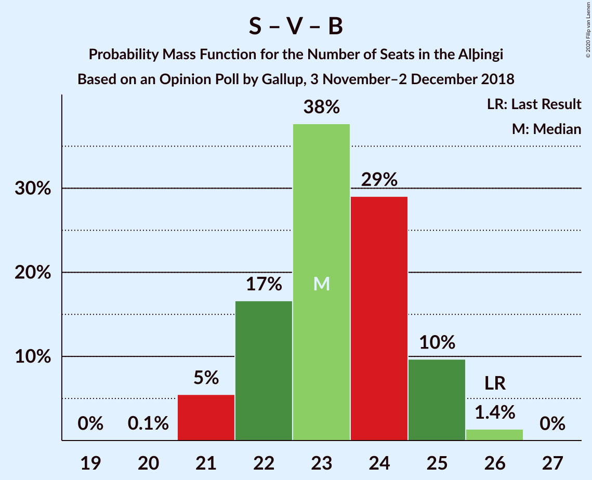

# Opinion Poll by Gallup, 3 November–2 December 2018

<a href="#voting-intentions">Voting Intentions</a> | <a href="#seats">Seats</a> | <a href="#coalitions">Coalitions</a> | <a href="#technical-information">Technical Information</a>

## Voting Intentions

### Confidence Intervals

| Party | Last Result | Poll Result | 80% Confidence Interval | 90% Confidence Interval | 95% Confidence Interval | 99% Confidence Interval |
|:-----:|:-----------:|:-----------:|:-----------------------:|:-----------------------:|:-----------------------:|:-----------------------:|
| Sjálfstæðisflokkurinn | 25.2% | 23.5% | 22.6–24.5% |22.3–24.8% |22.1–25.0% |21.6–25.5% |
| Samfylkingin | 12.1% | 18.7% | 17.8–19.6% |17.6–19.9% |17.4–20.1% |17.0–20.6% |
| Miðflokkurinn | 10.9% | 12.0% | 11.3–12.8% |11.1–13.0% |10.9–13.2% |10.6–13.6% |
| Vinstrihreyfingin – grænt framboð | 16.9% | 10.5% | 9.8–11.2% |9.6–11.5% |9.5–11.6% |9.2–12.0% |
| Píratar | 9.2% | 10.2% | 9.5–10.9% |9.3–11.1% |9.2–11.3% |8.9–11.7% |
| Viðreisn | 6.7% | 9.8% | 9.1–10.5% |9.0–10.7% |8.8–10.9% |8.5–11.2% |
| Framsóknarflokkurinn | 10.7% | 7.5% | 6.9–8.2% |6.8–8.3% |6.6–8.5% |6.4–8.8% |
| Flokkur fólksins | 6.9% | 6.2% | 5.7–6.8% |5.5–7.0% |5.4–7.1% |5.2–7.4% |
| Sósíalistaflokkur Íslands | 0.0% | 1.3% | 1.1–1.6% |1.0–1.7% |0.9–1.8% |0.9–1.9% |

*Note:* The poll result column reflects the actual value used in the calculations. Published results may vary slightly, and in addition be rounded to fewer digits.

## Seats

### Confidence Intervals

| Party | Last Result | Median | 80% Confidence Interval | 90% Confidence Interval | 95% Confidence Interval | 99% Confidence Interval |
|:-----:|:-----------:|:------:|:-----------------------:|:-----------------------:|:-----------------------:|:-----------------------:|
| <a href="#sjálfstæðisflokkurinn">Sjálfstæðisflokkurinn</a> | 16 | 15 | 14–16 |14–17 |14–17 |14–18 |
| <a href="#samfylkingin">Samfylkingin</a> | 7 | 13 | 11–13 |11–14 |11–14 |10–15 |
| <a href="#miðflokkurinn">Miðflokkurinn</a> | 7 | 9 | 7–10 |7–10 |7–10 |7–10 |
| <a href="#vinstrihreyfingin-–-grænt-framboð">Vinstrihreyfingin – grænt framboð</a> | 11 | 6 | 6–7 |6–7 |6–7 |5–8 |
| <a href="#píratar">Píratar</a> | 6 | 6 | 5–7 |5–7 |5–7 |5–7 |
| <a href="#viðreisn">Viðreisn</a> | 4 | 6 | 5–6 |5–6 |5–7 |5–7 |
| <a href="#framsóknarflokkurinn">Framsóknarflokkurinn</a> | 8 | 4 | 4–5 |4–5 |4–5 |4–5 |
| <a href="#flokkur-fólksins">Flokkur fólksins</a> | 4 | 4 | 3–4 |3–4 |3–4 |3–5 |
| <a href="#sósíalistaflokkur-íslands">Sósíalistaflokkur Íslands</a> | 0 | 0 | 0 |0 |0 |0 |

### Sjálfstæðisflokkurinn

*For a full overview of the results for this party, see the [Sjálfstæðisflokkurinn](party-sjálfstæðisflokkurinn.html) page.*

| Number of Seats | Probability | Accumulated | Special Marks |
|:---------------:|:-----------:|:-----------:|:-------------:|
| 13 | 0.1% | 100% |  |
| 14 | 18% | 99.9% |  |
| 15 | 40% | 82% | Median |
| 16 | 34% | 42% | Last Result |
| 17 | 7% | 8% |  |
| 18 | 1.0% | 1.0% |  |
| 19 | 0% | 0% |  |

### Samfylkingin

*For a full overview of the results for this party, see the [Samfylkingin](party-samfylkingin.html) page.*

| Number of Seats | Probability | Accumulated | Special Marks |
|:---------------:|:-----------:|:-----------:|:-------------:|
| 7 | 0% | 100% | Last Result |
| 8 | 0% | 100% |  |
| 9 | 0% | 100% |  |
| 10 | 0.5% | 100% |  |
| 11 | 18% | 99.5% |  |
| 12 | 27% | 82% |  |
| 13 | 47% | 55% | Median |
| 14 | 7% | 8% |  |
| 15 | 0.9% | 0.9% |  |
| 16 | 0% | 0% |  |

### Miðflokkurinn

*For a full overview of the results for this party, see the [Miðflokkurinn](party-miðflokkurinn.html) page.*

| Number of Seats | Probability | Accumulated | Special Marks |
|:---------------:|:-----------:|:-----------:|:-------------:|
| 6 | 0.5% | 100% |  |
| 7 | 11% | 99.5% | Last Result |
| 8 | 8% | 88% |  |
| 9 | 59% | 80% | Median |
| 10 | 21% | 21% |  |
| 11 | 0% | 0% |  |

### Vinstrihreyfingin – grænt framboð

*For a full overview of the results for this party, see the [Vinstrihreyfingin – grænt framboð](party-vinstrihreyfingin–græntframboð.html) page.*

| Number of Seats | Probability | Accumulated | Special Marks |
|:---------------:|:-----------:|:-----------:|:-------------:|
| 5 | 0.8% | 100% |  |
| 6 | 66% | 99.2% | Median |
| 7 | 33% | 34% |  |
| 8 | 0.5% | 0.5% |  |
| 9 | 0% | 0% |  |
| 10 | 0% | 0% |  |
| 11 | 0% | 0% | Last Result |

### Píratar

*For a full overview of the results for this party, see the [Píratar](party-píratar.html) page.*

| Number of Seats | Probability | Accumulated | Special Marks |
|:---------------:|:-----------:|:-----------:|:-------------:|
| 5 | 19% | 100% |  |
| 6 | 61% | 81% | Last Result, Median |
| 7 | 20% | 20% |  |
| 8 | 0.1% | 0.1% |  |
| 9 | 0% | 0% |  |

### Viðreisn

*For a full overview of the results for this party, see the [Viðreisn](party-viðreisn.html) page.*

| Number of Seats | Probability | Accumulated | Special Marks |
|:---------------:|:-----------:|:-----------:|:-------------:|
| 4 | 0% | 100% | Last Result |
| 5 | 14% | 100% |  |
| 6 | 82% | 86% | Median |
| 7 | 4% | 4% |  |
| 8 | 0% | 0% |  |

### Framsóknarflokkurinn

*For a full overview of the results for this party, see the [Framsóknarflokkurinn](party-framsóknarflokkurinn.html) page.*

| Number of Seats | Probability | Accumulated | Special Marks |
|:---------------:|:-----------:|:-----------:|:-------------:|
| 3 | 0.1% | 100% |  |
| 4 | 53% | 99.9% | Median |
| 5 | 47% | 47% |  |
| 6 | 0.2% | 0.2% |  |
| 7 | 0% | 0% |  |
| 8 | 0% | 0% | Last Result |

### Flokkur fólksins

*For a full overview of the results for this party, see the [Flokkur fólksins](party-flokkurfólksins.html) page.*

| Number of Seats | Probability | Accumulated | Special Marks |
|:---------------:|:-----------:|:-----------:|:-------------:|
| 0 | 0.2% | 100% |  |
| 1 | 0% | 99.8% |  |
| 2 | 0% | 99.8% |  |
| 3 | 39% | 99.8% |  |
| 4 | 60% | 61% | Last Result, Median |
| 5 | 0.9% | 0.9% |  |
| 6 | 0% | 0% |  |

### Sósíalistaflokkur Íslands

*For a full overview of the results for this party, see the [Sósíalistaflokkur Íslands](party-sósíalistaflokkuríslands.html) page.*

| Number of Seats | Probability | Accumulated | Special Marks |
|:---------------:|:-----------:|:-----------:|:-------------:|
| 0 | 100% | 100% | Last Result, Median |

## Coalitions

### Confidence Intervals

| Coalition | Last Result | Median | Majority? | 80% Confidence Interval | 90% Confidence Interval | 95% Confidence Interval | 99% Confidence Interval |
|:---------:|:-----------:|:------:|:---------:|:-----------------------:|:-----------------------:|:-----------------------:|:-----------------------:|
| Samfylkingin – Miðflokkurinn – Vinstrihreyfingin – grænt framboð – Framsóknarflokkurinn | 33 | 32 | 77% | 31–33 | 31–34 | 30–34 | 29–35 |
| Samfylkingin – Vinstrihreyfingin – grænt framboð – Píratar – Viðreisn | 28 | 31 | 21% | 29–32 | 29–33 | 29–33 | 28–34 |
| Sjálfstæðisflokkurinn – Miðflokkurinn – Framsóknarflokkurinn | 31 | 29 | 0.5% | 27–30 | 27–31 | 27–31 | 26–32 |
| Samfylkingin – Miðflokkurinn – Vinstrihreyfingin – grænt framboð | 25 | 28 | 0% | 27–29 | 26–29 | 26–30 | 25–30 |
| Sjálfstæðisflokkurinn – Samfylkingin | 23 | 28 | 0% | 26–29 | 26–30 | 26–30 | 25–30 |
| Sjálfstæðisflokkurinn – Vinstrihreyfingin – grænt framboð – Framsóknarflokkurinn | 35 | 26 | 0% | 25–27 | 25–28 | 25–28 | 24–29 |
| Samfylkingin – Vinstrihreyfingin – grænt framboð – Píratar | 24 | 25 | 0% | 24–26 | 23–27 | 23–27 | 22–28 |
| Sjálfstæðisflokkurinn – Miðflokkurinn | 23 | 24 | 0% | 23–26 | 22–26 | 22–26 | 21–27 |
| Samfylkingin – Vinstrihreyfingin – grænt framboð – Framsóknarflokkurinn | 26 | 23 | 0% | 22–25 | 21–25 | 21–25 | 21–26 |
| Sjálfstæðisflokkurinn – Vinstrihreyfingin – grænt framboð | 27 | 22 | 0% | 21–23 | 20–23 | 20–24 | 20–25 |
| Sjálfstæðisflokkurinn – Viðreisn | 20 | 21 | 0% | 20–22 | 20–23 | 19–23 | 19–24 |
| Sjálfstæðisflokkurinn – Framsóknarflokkurinn | 24 | 20 | 0% | 19–21 | 19–21 | 18–22 | 18–22 |
| Miðflokkurinn – Vinstrihreyfingin – grænt framboð – Framsóknarflokkurinn | 26 | 20 | 0% | 19–21 | 18–21 | 18–21 | 17–22 |
| Samfylkingin – Vinstrihreyfingin – grænt framboð | 18 | 19 | 0% | 18–20 | 17–20 | 17–21 | 17–21 |
| Miðflokkurinn – Vinstrihreyfingin – grænt framboð | 18 | 15 | 0% | 14–16 | 14–17 | 13–17 | 13–17 |
| Vinstrihreyfingin – grænt framboð – Píratar | 17 | 12 | 0% | 11–14 | 11–14 | 11–14 | 11–14 |
| Vinstrihreyfingin – grænt framboð – Framsóknarflokkurinn | 19 | 11 | 0% | 10–12 | 10–12 | 10–12 | 9–12 |

### Samfylkingin – Miðflokkurinn – Vinstrihreyfingin – grænt framboð – Framsóknarflokkurinn

| Number of Seats | Probability | Accumulated | Special Marks |
|:---------------:|:-----------:|:-----------:|:-------------:|
| 29 | 1.1% | 100% |  |
| 30 | 3% | 98.9% |  |
| 31 | 20% | 96% |  |
| 32 | 41% | 77% | Median, Majority |
| 33 | 29% | 35% | Last Result |
| 34 | 5% | 6% |  |
| 35 | 1.2% | 1.2% |  |
| 36 | 0% | 0% |  |

### Samfylkingin – Vinstrihreyfingin – grænt framboð – Píratar – Viðreisn

| Number of Seats | Probability | Accumulated | Special Marks |
|:---------------:|:-----------:|:-----------:|:-------------:|
| 27 | 0.1% | 100% |  |
| 28 | 2% | 99.9% | Last Result |
| 29 | 9% | 98% |  |
| 30 | 37% | 89% |  |
| 31 | 32% | 52% | Median |
| 32 | 13% | 21% | Majority |
| 33 | 7% | 8% |  |
| 34 | 0.9% | 0.9% |  |
| 35 | 0% | 0% |  |

### Sjálfstæðisflokkurinn – Miðflokkurinn – Framsóknarflokkurinn

| Number of Seats | Probability | Accumulated | Special Marks |
|:---------------:|:-----------:|:-----------:|:-------------:|
| 25 | 0.1% | 100% |  |
| 26 | 2% | 99.9% |  |
| 27 | 11% | 98% |  |
| 28 | 27% | 87% | Median |
| 29 | 39% | 60% |  |
| 30 | 15% | 20% |  |
| 31 | 4% | 5% | Last Result |
| 32 | 0.5% | 0.5% | Majority |
| 33 | 0% | 0% |  |

### Samfylkingin – Miðflokkurinn – Vinstrihreyfingin – grænt framboð

| Number of Seats | Probability | Accumulated | Special Marks |
|:---------------:|:-----------:|:-----------:|:-------------:|
| 24 | 0.1% | 100% |  |
| 25 | 2% | 99.9% | Last Result |
| 26 | 6% | 98% |  |
| 27 | 31% | 92% |  |
| 28 | 49% | 61% | Median |
| 29 | 9% | 12% |  |
| 30 | 3% | 3% |  |
| 31 | 0% | 0% |  |

### Sjálfstæðisflokkurinn – Samfylkingin

| Number of Seats | Probability | Accumulated | Special Marks |
|:---------------:|:-----------:|:-----------:|:-------------:|
| 23 | 0% | 100% | Last Result |
| 24 | 0% | 100% |  |
| 25 | 1.4% | 100% |  |
| 26 | 14% | 98.6% |  |
| 27 | 25% | 85% |  |
| 28 | 30% | 59% | Median |
| 29 | 24% | 30% |  |
| 30 | 5% | 5% |  |
| 31 | 0.1% | 0.1% |  |
| 32 | 0% | 0% | Majority |

### Sjálfstæðisflokkurinn – Vinstrihreyfingin – grænt framboð – Framsóknarflokkurinn

| Number of Seats | Probability | Accumulated | Special Marks |
|:---------------:|:-----------:|:-----------:|:-------------:|
| 24 | 1.1% | 100% |  |
| 25 | 25% | 98.9% | Median |
| 26 | 41% | 74% |  |
| 27 | 27% | 33% |  |
| 28 | 5% | 6% |  |
| 29 | 1.4% | 1.5% |  |
| 30 | 0% | 0% |  |
| 31 | 0% | 0% |  |
| 32 | 0% | 0% | Majority |
| 33 | 0% | 0% |  |
| 34 | 0% | 0% |  |
| 35 | 0% | 0% | Last Result |

### Samfylkingin – Vinstrihreyfingin – grænt framboð – Píratar

| Number of Seats | Probability | Accumulated | Special Marks |
|:---------------:|:-----------:|:-----------:|:-------------:|
| 22 | 1.4% | 100% |  |
| 23 | 6% | 98.6% |  |
| 24 | 38% | 93% | Last Result |
| 25 | 31% | 55% | Median |
| 26 | 15% | 23% |  |
| 27 | 8% | 9% |  |
| 28 | 0.9% | 0.9% |  |
| 29 | 0% | 0% |  |

### Sjálfstæðisflokkurinn – Miðflokkurinn

| Number of Seats | Probability | Accumulated | Special Marks |
|:---------------:|:-----------:|:-----------:|:-------------:|
| 21 | 1.0% | 100% |  |
| 22 | 7% | 99.0% |  |
| 23 | 15% | 92% | Last Result |
| 24 | 37% | 77% | Median |
| 25 | 29% | 40% |  |
| 26 | 10% | 11% |  |
| 27 | 2% | 2% |  |
| 28 | 0.1% | 0.1% |  |
| 29 | 0% | 0% |  |

### Samfylkingin – Vinstrihreyfingin – grænt framboð – Framsóknarflokkurinn

| Number of Seats | Probability | Accumulated | Special Marks |
|:---------------:|:-----------:|:-----------:|:-------------:|
| 20 | 0.1% | 100% |  |
| 21 | 5% | 99.9% |  |
| 22 | 17% | 94% |  |
| 23 | 38% | 78% | Median |
| 24 | 29% | 40% |  |
| 25 | 10% | 11% |  |
| 26 | 1.4% | 1.4% | Last Result |
| 27 | 0% | 0% |  |

### Sjálfstæðisflokkurinn – Vinstrihreyfingin – grænt framboð

| Number of Seats | Probability | Accumulated | Special Marks |
|:---------------:|:-----------:|:-----------:|:-------------:|
| 20 | 9% | 100% |  |
| 21 | 35% | 91% | Median |
| 22 | 39% | 56% |  |
| 23 | 14% | 17% |  |
| 24 | 2% | 3% |  |
| 25 | 0.8% | 0.8% |  |
| 26 | 0% | 0% |  |
| 27 | 0% | 0% | Last Result |

### Sjálfstæðisflokkurinn – Viðreisn

| Number of Seats | Probability | Accumulated | Special Marks |
|:---------------:|:-----------:|:-----------:|:-------------:|
| 19 | 3% | 100% |  |
| 20 | 19% | 97% | Last Result |
| 21 | 38% | 78% | Median |
| 22 | 34% | 41% |  |
| 23 | 6% | 7% |  |
| 24 | 0.9% | 0.9% |  |
| 25 | 0% | 0% |  |

### Sjálfstæðisflokkurinn – Framsóknarflokkurinn

| Number of Seats | Probability | Accumulated | Special Marks |
|:---------------:|:-----------:|:-----------:|:-------------:|
| 17 | 0.1% | 100% |  |
| 18 | 5% | 99.9% |  |
| 19 | 31% | 95% | Median |
| 20 | 47% | 64% |  |
| 21 | 13% | 17% |  |
| 22 | 4% | 4% |  |
| 23 | 0.1% | 0.1% |  |
| 24 | 0% | 0% | Last Result |

### Miðflokkurinn – Vinstrihreyfingin – grænt framboð – Framsóknarflokkurinn

| Number of Seats | Probability | Accumulated | Special Marks |
|:---------------:|:-----------:|:-----------:|:-------------:|
| 17 | 2% | 100% |  |
| 18 | 8% | 98% |  |
| 19 | 30% | 90% | Median |
| 20 | 40% | 60% |  |
| 21 | 17% | 19% |  |
| 22 | 2% | 2% |  |
| 23 | 0% | 0% |  |
| 24 | 0% | 0% |  |
| 25 | 0% | 0% |  |
| 26 | 0% | 0% | Last Result |

### Samfylkingin – Vinstrihreyfingin – grænt framboð

| Number of Seats | Probability | Accumulated | Special Marks |
|:---------------:|:-----------:|:-----------:|:-------------:|
| 16 | 0.3% | 100% |  |
| 17 | 8% | 99.7% |  |
| 18 | 28% | 91% | Last Result |
| 19 | 44% | 63% | Median |
| 20 | 15% | 19% |  |
| 21 | 4% | 4% |  |
| 22 | 0.1% | 0.1% |  |
| 23 | 0% | 0% |  |

### Miðflokkurinn – Vinstrihreyfingin – grænt framboð

| Number of Seats | Probability | Accumulated | Special Marks |
|:---------------:|:-----------:|:-----------:|:-------------:|
| 12 | 0.1% | 100% |  |
| 13 | 4% | 99.9% |  |
| 14 | 11% | 96% |  |
| 15 | 48% | 85% | Median |
| 16 | 31% | 37% |  |
| 17 | 6% | 6% |  |
| 18 | 0% | 0% | Last Result |

### Vinstrihreyfingin – grænt framboð – Píratar

| Number of Seats | Probability | Accumulated | Special Marks |
|:---------------:|:-----------:|:-----------:|:-------------:|
| 10 | 0.3% | 100% |  |
| 11 | 17% | 99.7% |  |
| 12 | 43% | 83% | Median |
| 13 | 29% | 40% |  |
| 14 | 11% | 11% |  |
| 15 | 0.2% | 0.2% |  |
| 16 | 0% | 0% |  |
| 17 | 0% | 0% | Last Result |

### Vinstrihreyfingin – grænt framboð – Framsóknarflokkurinn

| Number of Seats | Probability | Accumulated | Special Marks |
|:---------------:|:-----------:|:-----------:|:-------------:|
| 9 | 0.6% | 100% |  |
| 10 | 35% | 99.4% | Median |
| 11 | 49% | 65% |  |
| 12 | 16% | 16% |  |
| 13 | 0.2% | 0.2% |  |
| 14 | 0% | 0% |  |
| 15 | 0% | 0% |  |
| 16 | 0% | 0% |  |
| 17 | 0% | 0% |  |
| 18 | 0% | 0% |  |
| 19 | 0% | 0% | Last Result |

## Technical Information

### Opinion Poll

+ **Polling firm:** Gallup
+ **Commissioner(s):** —
+ **Fieldwork period:** 3 November–2 December 2018

### Calculations

+ **Sample size:** 3101
+ **Simulations done:** 1,048,576
+ **Error estimate:** 1.46%

