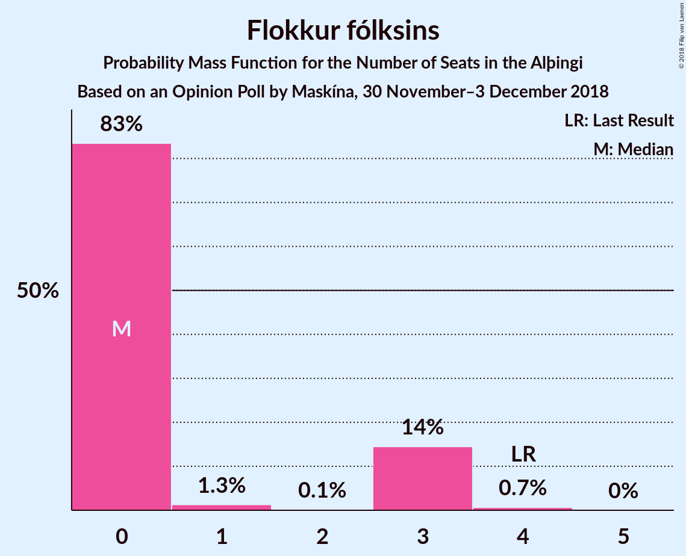

# Opinion Poll by Maskína, 30 November–3 December 2018

<a href="#voting-intentions">Voting Intentions</a> | <a href="#seats">Seats</a> | <a href="#coalitions">Coalitions</a> | <a href="#technical-information">Technical Information</a>

## Voting Intentions

### Confidence Intervals

| Party | Last Result | Poll Result | 80% Confidence Interval | 90% Confidence Interval | 95% Confidence Interval | 99% Confidence Interval |
|:-----:|:-----------:|:-----------:|:-----------------------:|:-----------------------:|:-----------------------:|:-----------------------:|
| Samfylkingin | 12.1% | 19.7% | 18.3–21.1% |17.9–21.6% |17.6–21.9% |17.0–22.6% |
| Sjálfstæðisflokkurinn | 25.2% | 19.3% | 18.0–20.8% |17.6–21.2% |17.3–21.5% |16.6–22.2% |
| Vinstrihreyfingin – grænt framboð | 16.9% | 14.9% | 13.7–16.2% |13.3–16.6% |13.0–16.9% |12.5–17.6% |
| Píratar | 9.2% | 14.9% | 13.7–16.2% |13.3–16.6% |13.0–16.9% |12.5–17.6% |
| Viðreisn | 6.7% | 13.4% | 12.3–14.7% |12.0–15.1% |11.7–15.4% |11.2–16.0% |
| Framsóknarflokkurinn | 10.7% | 8.8% | 7.8–9.9% |7.6–10.2% |7.4–10.4% |6.9–11.0% |
| Miðflokkurinn | 10.9% | 4.6% | 3.9–5.4% |3.7–5.6% |3.6–5.9% |3.3–6.3% |
| Flokkur fólksins | 6.9% | 4.4% | 3.8–5.2% |3.6–5.5% |3.4–5.7% |3.2–6.1% |

*Note:* The poll result column reflects the actual value used in the calculations. Published results may vary slightly, and in addition be rounded to fewer digits.

## Seats

### Confidence Intervals

| Party | Last Result | Median | 80% Confidence Interval | 90% Confidence Interval | 95% Confidence Interval | 99% Confidence Interval |
|:-----:|:-----------:|:------:|:-----------------------:|:-----------------------:|:-----------------------:|:-----------------------:|
| <a href="#samfylkingin">Samfylkingin</a> | 7 | 14 | 12–14 |12–14 |12–14 |12–15 |
| <a href="#sjálfstæðisflokkurinn">Sjálfstæðisflokkurinn</a> | 16 | 14 | 12–14 |12–14 |12–14 |11–15 |
| <a href="#vinstrihreyfingin-–-grænt-framboð">Vinstrihreyfingin – grænt framboð</a> | 11 | 10 | 9–10 |9–11 |9–11 |9–12 |
| <a href="#píratar">Píratar</a> | 6 | 10 | 10–11 |9–11 |9–11 |8–11 |
| <a href="#viðreisn">Viðreisn</a> | 4 | 9 | 8–9 |8–10 |8–10 |8–10 |
| <a href="#framsóknarflokkurinn">Framsóknarflokkurinn</a> | 8 | 6 | 5–6 |5–7 |5–7 |4–7 |
| <a href="#miðflokkurinn">Miðflokkurinn</a> | 7 | 0 | 0–3 |0–3 |0–3 |0–4 |
| <a href="#flokkur-fólksins">Flokkur fólksins</a> | 4 | 0 | 0 |0–3 |0–3 |0–3 |

### Samfylkingin

*For a full overview of the results for this party, see the [Samfylkingin](party-samfylkingin.html) page.*

| Number of Seats | Probability | Accumulated | Special Marks |
|:---------------:|:-----------:|:-----------:|:-------------:|
| 7 | 0% | 100% | Last Result |
| 8 | 0% | 100% |  |
| 9 | 0% | 100% |  |
| 10 | 0% | 100% |  |
| 11 | 0.3% | 100% |  |
| 12 | 11% | 99.7% |  |
| 13 | 6% | 88% |  |
| 14 | 81% | 83% | Median |
| 15 | 2% | 2% |  |
| 16 | 0.1% | 0.1% |  |
| 17 | 0% | 0% |  |

### Sjálfstæðisflokkurinn

*For a full overview of the results for this party, see the [Sjálfstæðisflokkurinn](party-sjálfstæðisflokkurinn.html) page.*

| Number of Seats | Probability | Accumulated | Special Marks |
|:---------------:|:-----------:|:-----------:|:-------------:|
| 10 | 0.1% | 100% |  |
| 11 | 0.8% | 99.9% |  |
| 12 | 12% | 99.1% |  |
| 13 | 20% | 87% |  |
| 14 | 65% | 67% | Median |
| 15 | 2% | 2% |  |
| 16 | 0.1% | 0.1% | Last Result |
| 17 | 0% | 0% |  |

### Vinstrihreyfingin – grænt framboð

*For a full overview of the results for this party, see the [Vinstrihreyfingin – grænt framboð](party-vinstrihreyfingin–græntframboð.html) page.*

| Number of Seats | Probability | Accumulated | Special Marks |
|:---------------:|:-----------:|:-----------:|:-------------:|
| 8 | 0.5% | 100% |  |
| 9 | 16% | 99.5% |  |
| 10 | 75% | 84% | Median |
| 11 | 8% | 9% | Last Result |
| 12 | 0.5% | 0.6% |  |
| 13 | 0.1% | 0.1% |  |
| 14 | 0% | 0% |  |

### Píratar

*For a full overview of the results for this party, see the [Píratar](party-píratar.html) page.*

| Number of Seats | Probability | Accumulated | Special Marks |
|:---------------:|:-----------:|:-----------:|:-------------:|
| 6 | 0% | 100% | Last Result |
| 7 | 0% | 100% |  |
| 8 | 0.5% | 100% |  |
| 9 | 8% | 99.5% |  |
| 10 | 76% | 91% | Median |
| 11 | 15% | 15% |  |
| 12 | 0.4% | 0.4% |  |
| 13 | 0% | 0% |  |

### Viðreisn

*For a full overview of the results for this party, see the [Viðreisn](party-viðreisn.html) page.*

| Number of Seats | Probability | Accumulated | Special Marks |
|:---------------:|:-----------:|:-----------:|:-------------:|
| 4 | 0% | 100% | Last Result |
| 5 | 0% | 100% |  |
| 6 | 0% | 100% |  |
| 7 | 0.3% | 100% |  |
| 8 | 11% | 99.7% |  |
| 9 | 82% | 89% | Median |
| 10 | 7% | 7% |  |
| 11 | 0.1% | 0.1% |  |
| 12 | 0% | 0% |  |

### Framsóknarflokkurinn

*For a full overview of the results for this party, see the [Framsóknarflokkurinn](party-framsóknarflokkurinn.html) page.*

| Number of Seats | Probability | Accumulated | Special Marks |
|:---------------:|:-----------:|:-----------:|:-------------:|
| 4 | 1.0% | 100% |  |
| 5 | 16% | 99.0% |  |
| 6 | 75% | 83% | Median |
| 7 | 8% | 8% |  |
| 8 | 0.1% | 0.2% | Last Result |
| 9 | 0% | 0% |  |

### Miðflokkurinn

*For a full overview of the results for this party, see the [Miðflokkurinn](party-miðflokkurinn.html) page.*

| Number of Seats | Probability | Accumulated | Special Marks |
|:---------------:|:-----------:|:-----------:|:-------------:|
| 0 | 66% | 100% | Median |
| 1 | 19% | 34% |  |
| 2 | 0.1% | 15% |  |
| 3 | 13% | 15% |  |
| 4 | 2% | 2% |  |
| 5 | 0% | 0% |  |
| 6 | 0% | 0% |  |
| 7 | 0% | 0% | Last Result |

### Flokkur fólksins

*For a full overview of the results for this party, see the [Flokkur fólksins](party-flokkurfólksins.html) page.*

| Number of Seats | Probability | Accumulated | Special Marks |
|:---------------:|:-----------:|:-----------:|:-------------:|
| 0 | 90% | 100% | Median |
| 1 | 4% | 10% |  |
| 2 | 0% | 6% |  |
| 3 | 6% | 6% |  |
| 4 | 0.2% | 0.2% | Last Result |
| 5 | 0% | 0% |  |

## Coalitions

### Confidence Intervals

| Coalition | Last Result | Median | Majority? | 80% Confidence Interval | 90% Confidence Interval | 95% Confidence Interval | 99% Confidence Interval |
|:---------:|:-----------:|:------:|:---------:|:-----------------------:|:-----------------------:|:-----------------------:|:-----------------------:|
| Samfylkingin – Píratar – Vinstrihreyfingin – grænt framboð – Viðreisn | 28 | 43 | 100% | 42–43 | 41–43 | 39–44 | 39–45 |
| Samfylkingin – Píratar – Vinstrihreyfingin – grænt framboð | 24 | 34 | 96% | 33–34 | 32–34 | 31–35 | 31–36 |
| Samfylkingin – Vinstrihreyfingin – grænt framboð – Framsóknarflokkurinn – Miðflokkurinn | 33 | 30 | 13% | 29–32 | 29–32 | 29–33 | 28–33 |
| Samfylkingin – Vinstrihreyfingin – grænt framboð – Framsóknarflokkurinn | 26 | 30 | 0.7% | 28–30 | 27–30 | 26–31 | 26–32 |
| Sjálfstæðisflokkurinn – Vinstrihreyfingin – grænt framboð – Framsóknarflokkurinn | 35 | 30 | 0.5% | 27–30 | 27–30 | 27–30 | 26–32 |
| Samfylkingin – Sjálfstæðisflokkurinn | 23 | 28 | 0% | 25–28 | 25–28 | 25–28 | 24–29 |
| Samfylkingin – Vinstrihreyfingin – grænt framboð – Miðflokkurinn | 25 | 24 | 0% | 24–26 | 23–26 | 23–27 | 22–28 |
| Samfylkingin – Vinstrihreyfingin – grænt framboð | 18 | 24 | 0% | 22–24 | 22–25 | 21–25 | 21–25 |
| Sjálfstæðisflokkurinn – Vinstrihreyfingin – grænt framboð | 27 | 24 | 0% | 22–24 | 21–24 | 21–25 | 21–26 |
| Sjálfstæðisflokkurinn – Viðreisn | 20 | 23 | 0% | 21–23 | 21–23 | 20–23 | 20–24 |
| Sjálfstæðisflokkurinn – Framsóknarflokkurinn – Miðflokkurinn | 31 | 20 | 0% | 19–21 | 19–21 | 18–22 | 18–23 |
| Píratar – Vinstrihreyfingin – grænt framboð | 17 | 20 | 0% | 19–21 | 19–21 | 19–21 | 18–22 |
| Sjálfstæðisflokkurinn – Framsóknarflokkurinn | 24 | 20 | 0% | 18–20 | 17–20 | 17–20 | 16–21 |
| Vinstrihreyfingin – grænt framboð – Framsóknarflokkurinn – Miðflokkurinn | 26 | 16 | 0% | 16–18 | 15–19 | 15–19 | 15–20 |
| Vinstrihreyfingin – grænt framboð – Framsóknarflokkurinn | 19 | 16 | 0% | 15–17 | 14–17 | 14–17 | 14–18 |
| Sjálfstæðisflokkurinn – Miðflokkurinn | 23 | 14 | 0% | 14–15 | 14–16 | 13–16 | 12–17 |
| Vinstrihreyfingin – grænt framboð – Miðflokkurinn | 18 | 10 | 0% | 10–12 | 10–12 | 10–14 | 9–15 |

### Samfylkingin – Píratar – Vinstrihreyfingin – grænt framboð – Viðreisn

| Number of Seats | Probability | Accumulated | Special Marks |
|:---------------:|:-----------:|:-----------:|:-------------:|
| 28 | 0% | 100% | Last Result |
| 29 | 0% | 100% |  |
| 30 | 0% | 100% |  |
| 31 | 0% | 100% |  |
| 32 | 0% | 100% | Majority |
| 33 | 0% | 100% |  |
| 34 | 0% | 100% |  |
| 35 | 0% | 100% |  |
| 36 | 0% | 100% |  |
| 37 | 0% | 100% |  |
| 38 | 0.2% | 100% |  |
| 39 | 3% | 99.8% |  |
| 40 | 1.3% | 97% |  |
| 41 | 2% | 96% |  |
| 42 | 19% | 94% |  |
| 43 | 71% | 75% | Median |
| 44 | 2% | 4% |  |
| 45 | 2% | 2% |  |
| 46 | 0.1% | 0.1% |  |
| 47 | 0% | 0% |  |

### Samfylkingin – Píratar – Vinstrihreyfingin – grænt framboð

| Number of Seats | Probability | Accumulated | Special Marks |
|:---------------:|:-----------:|:-----------:|:-------------:|
| 24 | 0% | 100% | Last Result |
| 25 | 0% | 100% |  |
| 26 | 0% | 100% |  |
| 27 | 0% | 100% |  |
| 28 | 0% | 100% |  |
| 29 | 0.1% | 100% |  |
| 30 | 0.2% | 99.9% |  |
| 31 | 4% | 99.7% |  |
| 32 | 3% | 96% | Majority |
| 33 | 17% | 93% |  |
| 34 | 71% | 76% | Median |
| 35 | 4% | 5% |  |
| 36 | 1.1% | 1.2% |  |
| 37 | 0.1% | 0.1% |  |
| 38 | 0% | 0% |  |

### Samfylkingin – Vinstrihreyfingin – grænt framboð – Framsóknarflokkurinn – Miðflokkurinn

| Number of Seats | Probability | Accumulated | Special Marks |
|:---------------:|:-----------:|:-----------:|:-------------:|
| 26 | 0% | 100% |  |
| 27 | 0.2% | 99.9% |  |
| 28 | 0.9% | 99.8% |  |
| 29 | 10% | 98.8% |  |
| 30 | 70% | 89% | Median |
| 31 | 6% | 19% |  |
| 32 | 10% | 13% | Majority |
| 33 | 3% | 3% | Last Result |
| 34 | 0.2% | 0.2% |  |
| 35 | 0% | 0% |  |

### Samfylkingin – Vinstrihreyfingin – grænt framboð – Framsóknarflokkurinn

| Number of Seats | Probability | Accumulated | Special Marks |
|:---------------:|:-----------:|:-----------:|:-------------:|
| 25 | 0% | 100% |  |
| 26 | 3% | 99.9% | Last Result |
| 27 | 2% | 97% |  |
| 28 | 7% | 95% |  |
| 29 | 17% | 88% |  |
| 30 | 67% | 71% | Median |
| 31 | 3% | 4% |  |
| 32 | 0.7% | 0.7% | Majority |
| 33 | 0% | 0% |  |

### Sjálfstæðisflokkurinn – Vinstrihreyfingin – grænt framboð – Framsóknarflokkurinn

| Number of Seats | Probability | Accumulated | Special Marks |
|:---------------:|:-----------:|:-----------:|:-------------:|
| 25 | 0.2% | 100% |  |
| 26 | 2% | 99.8% |  |
| 27 | 15% | 98% |  |
| 28 | 4% | 83% |  |
| 29 | 5% | 79% |  |
| 30 | 73% | 75% | Median |
| 31 | 2% | 2% |  |
| 32 | 0.5% | 0.5% | Majority |
| 33 | 0% | 0% |  |
| 34 | 0% | 0% |  |
| 35 | 0% | 0% | Last Result |

### Samfylkingin – Sjálfstæðisflokkurinn

| Number of Seats | Probability | Accumulated | Special Marks |
|:---------------:|:-----------:|:-----------:|:-------------:|
| 23 | 0.1% | 100% | Last Result |
| 24 | 1.2% | 99.9% |  |
| 25 | 13% | 98.7% |  |
| 26 | 11% | 86% |  |
| 27 | 8% | 75% |  |
| 28 | 64% | 66% | Median |
| 29 | 2% | 2% |  |
| 30 | 0.1% | 0.1% |  |
| 31 | 0% | 0% |  |

### Samfylkingin – Vinstrihreyfingin – grænt framboð – Miðflokkurinn

| Number of Seats | Probability | Accumulated | Special Marks |
|:---------------:|:-----------:|:-----------:|:-------------:|
| 21 | 0% | 100% |  |
| 22 | 0.5% | 99.9% |  |
| 23 | 8% | 99.4% |  |
| 24 | 71% | 92% | Median |
| 25 | 6% | 21% | Last Result |
| 26 | 11% | 15% |  |
| 27 | 1.2% | 3% |  |
| 28 | 2% | 2% |  |
| 29 | 0.1% | 0.1% |  |
| 30 | 0% | 0% |  |

### Samfylkingin – Vinstrihreyfingin – grænt framboð

| Number of Seats | Probability | Accumulated | Special Marks |
|:---------------:|:-----------:|:-----------:|:-------------:|
| 18 | 0% | 100% | Last Result |
| 19 | 0% | 100% |  |
| 20 | 0.1% | 100% |  |
| 21 | 3% | 99.9% |  |
| 22 | 9% | 97% |  |
| 23 | 14% | 88% |  |
| 24 | 67% | 74% | Median |
| 25 | 6% | 6% |  |
| 26 | 0.4% | 0.5% |  |
| 27 | 0.1% | 0.1% |  |
| 28 | 0% | 0% |  |

### Sjálfstæðisflokkurinn – Vinstrihreyfingin – grænt framboð

| Number of Seats | Probability | Accumulated | Special Marks |
|:---------------:|:-----------:|:-----------:|:-------------:|
| 20 | 0.3% | 100% |  |
| 21 | 8% | 99.7% |  |
| 22 | 11% | 92% |  |
| 23 | 10% | 81% |  |
| 24 | 68% | 71% | Median |
| 25 | 2% | 3% |  |
| 26 | 0.5% | 0.8% |  |
| 27 | 0.2% | 0.2% | Last Result |
| 28 | 0% | 0% |  |

### Sjálfstæðisflokkurinn – Viðreisn

| Number of Seats | Probability | Accumulated | Special Marks |
|:---------------:|:-----------:|:-----------:|:-------------:|
| 19 | 0.3% | 100% |  |
| 20 | 2% | 99.7% | Last Result |
| 21 | 12% | 97% |  |
| 22 | 19% | 86% |  |
| 23 | 65% | 66% | Median |
| 24 | 1.1% | 1.3% |  |
| 25 | 0.1% | 0.2% |  |
| 26 | 0% | 0% |  |

### Sjálfstæðisflokkurinn – Framsóknarflokkurinn – Miðflokkurinn

| Number of Seats | Probability | Accumulated | Special Marks |
|:---------------:|:-----------:|:-----------:|:-------------:|
| 17 | 0.3% | 100% |  |
| 18 | 4% | 99.7% |  |
| 19 | 6% | 96% |  |
| 20 | 67% | 90% | Median |
| 21 | 20% | 23% |  |
| 22 | 2% | 3% |  |
| 23 | 1.1% | 1.2% |  |
| 24 | 0.1% | 0.1% |  |
| 25 | 0% | 0% |  |
| 26 | 0% | 0% |  |
| 27 | 0% | 0% |  |
| 28 | 0% | 0% |  |
| 29 | 0% | 0% |  |
| 30 | 0% | 0% |  |
| 31 | 0% | 0% | Last Result |

### Píratar – Vinstrihreyfingin – grænt framboð

| Number of Seats | Probability | Accumulated | Special Marks |
|:---------------:|:-----------:|:-----------:|:-------------:|
| 16 | 0.1% | 100% |  |
| 17 | 0.2% | 99.9% | Last Result |
| 18 | 1.2% | 99.8% |  |
| 19 | 12% | 98.6% |  |
| 20 | 74% | 87% | Median |
| 21 | 12% | 13% |  |
| 22 | 0.8% | 1.0% |  |
| 23 | 0.2% | 0.2% |  |
| 24 | 0% | 0% |  |

### Sjálfstæðisflokkurinn – Framsóknarflokkurinn

| Number of Seats | Probability | Accumulated | Special Marks |
|:---------------:|:-----------:|:-----------:|:-------------:|
| 16 | 0.5% | 100% |  |
| 17 | 6% | 99.5% |  |
| 18 | 15% | 94% |  |
| 19 | 5% | 78% |  |
| 20 | 72% | 73% | Median |
| 21 | 0.8% | 1.0% |  |
| 22 | 0.2% | 0.2% |  |
| 23 | 0% | 0% |  |
| 24 | 0% | 0% | Last Result |

### Vinstrihreyfingin – grænt framboð – Framsóknarflokkurinn – Miðflokkurinn

| Number of Seats | Probability | Accumulated | Special Marks |
|:---------------:|:-----------:|:-----------:|:-------------:|
| 14 | 0.3% | 100% |  |
| 15 | 6% | 99.7% |  |
| 16 | 65% | 94% | Median |
| 17 | 9% | 29% |  |
| 18 | 14% | 20% |  |
| 19 | 4% | 5% |  |
| 20 | 0.8% | 1.1% |  |
| 21 | 0.3% | 0.3% |  |
| 22 | 0% | 0% |  |
| 23 | 0% | 0% |  |
| 24 | 0% | 0% |  |
| 25 | 0% | 0% |  |
| 26 | 0% | 0% | Last Result |

### Vinstrihreyfingin – grænt framboð – Framsóknarflokkurinn

| Number of Seats | Probability | Accumulated | Special Marks |
|:---------------:|:-----------:|:-----------:|:-------------:|
| 13 | 0.4% | 100% |  |
| 14 | 9% | 99.6% |  |
| 15 | 10% | 91% |  |
| 16 | 70% | 81% | Median |
| 17 | 10% | 11% |  |
| 18 | 0.7% | 0.9% |  |
| 19 | 0.1% | 0.1% | Last Result |
| 20 | 0.1% | 0.1% |  |
| 21 | 0% | 0% |  |

### Sjálfstæðisflokkurinn – Miðflokkurinn

| Number of Seats | Probability | Accumulated | Special Marks |
|:---------------:|:-----------:|:-----------:|:-------------:|
| 12 | 2% | 100% |  |
| 13 | 3% | 98% |  |
| 14 | 76% | 95% | Median |
| 15 | 12% | 19% |  |
| 16 | 6% | 7% |  |
| 17 | 1.0% | 1.1% |  |
| 18 | 0.1% | 0.1% |  |
| 19 | 0% | 0% |  |
| 20 | 0% | 0% |  |
| 21 | 0% | 0% |  |
| 22 | 0% | 0% |  |
| 23 | 0% | 0% | Last Result |

### Vinstrihreyfingin – grænt framboð – Miðflokkurinn

| Number of Seats | Probability | Accumulated | Special Marks |
|:---------------:|:-----------:|:-----------:|:-------------:|
| 9 | 0.9% | 100% |  |
| 10 | 69% | 99.1% | Median |
| 11 | 9% | 30% |  |
| 12 | 17% | 21% |  |
| 13 | 1.2% | 4% |  |
| 14 | 3% | 3% |  |
| 15 | 0.6% | 0.6% |  |
| 16 | 0% | 0% |  |
| 17 | 0% | 0% |  |
| 18 | 0% | 0% | Last Result |

## Technical Information

### Opinion Poll

+ **Polling firm:** Maskína
+ **Commissioner(s):** —
+ **Fieldwork period:** 30 November–3 December 2018

### Calculations

+ **Sample size:** 1311
+ **Simulations done:** 131,072
+ **Error estimate:** 2.00%

