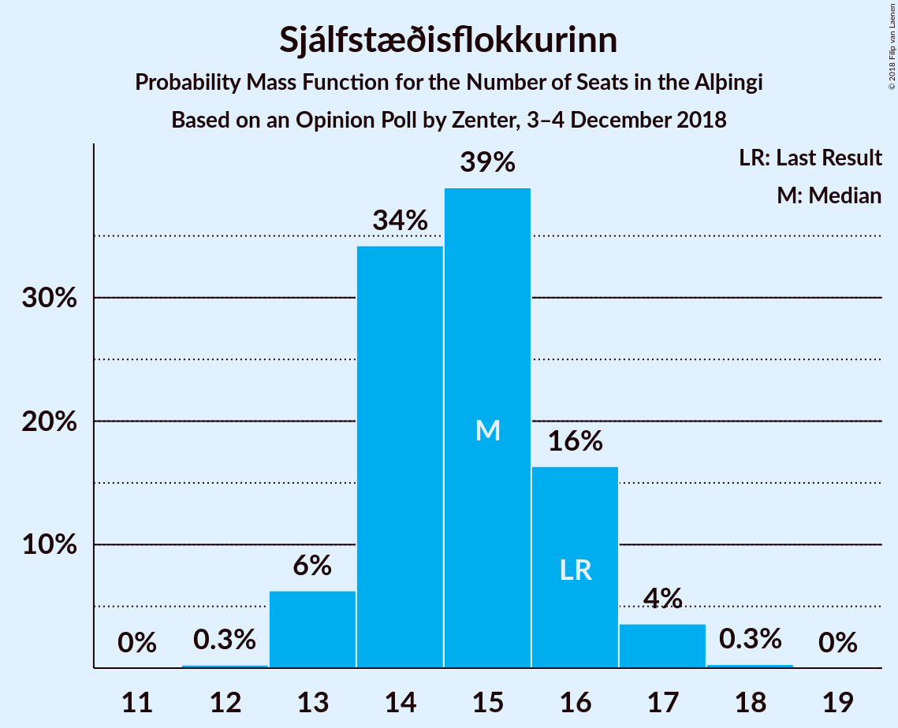
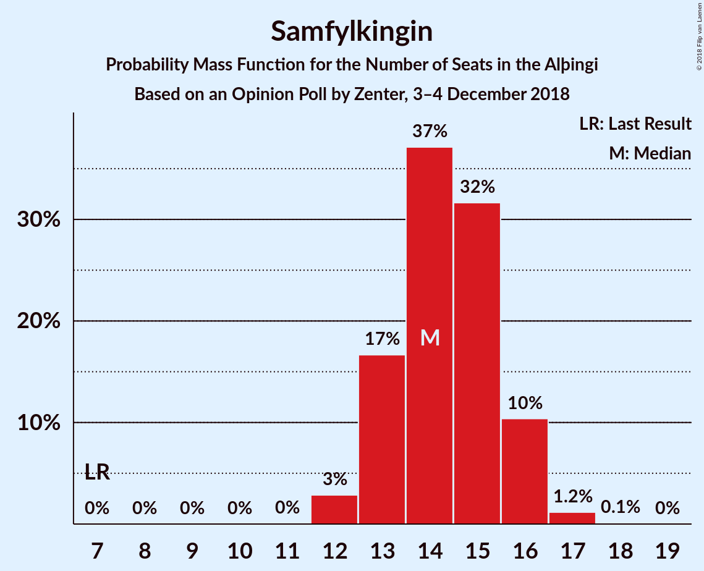

# Opinion Poll by Zenter, 3–4 December 2018

<a href="#voting-intentions">Voting Intentions</a> | <a href="#seats">Seats</a> | <a href="#coalitions">Coalitions</a> | <a href="#technical-information">Technical Information</a>

## Voting Intentions

### Confidence Intervals

| Party | Last Result | Poll Result | 80% Confidence Interval | 90% Confidence Interval | 95% Confidence Interval | 99% Confidence Interval |
|:-----:|:-----------:|:-----------:|:-----------------------:|:-----------------------:|:-----------------------:|:-----------------------:|
| Sjálfstæðisflokkurinn | 25.2% | 21.4% | 20.0–23.0% |19.6–23.4% |19.2–23.8% |18.6–24.5% |
| Samfylkingin | 12.1% | 20.8% | 19.4–22.3% |19.0–22.7% |18.6–23.1% |18.0–23.9% |
| Píratar | 9.2% | 14.4% | 13.2–15.7% |12.8–16.1% |12.6–16.4% |12.0–17.1% |
| Vinstrihreyfingin – grænt framboð | 16.9% | 12.7% | 11.6–14.0% |11.3–14.4% |11.0–14.7% |10.5–15.3% |
| Viðreisn | 6.7% | 9.1% | 8.1–10.2% |7.8–10.5% |7.6–10.8% |7.2–11.4% |
| Framsóknarflokkurinn | 10.7% | 8.5% | 7.6–9.6% |7.3–9.9% |7.1–10.2% |6.7–10.7% |
| Flokkur fólksins | 6.9% | 5.7% | 4.9–6.6% |4.7–6.9% |4.5–7.1% |4.2–7.6% |
| Miðflokkurinn | 10.9% | 4.3% | 3.6–5.1% |3.4–5.3% |3.3–5.5% |3.0–5.9% |

*Note:* The poll result column reflects the actual value used in the calculations. Published results may vary slightly, and in addition be rounded to fewer digits.

## Seats

### Confidence Intervals

| Party | Last Result | Median | 80% Confidence Interval | 90% Confidence Interval | 95% Confidence Interval | 99% Confidence Interval |
|:-----:|:-----------:|:------:|:-----------------------:|:-----------------------:|:-----------------------:|:-----------------------:|
| <a href="#sjálfstæðisflokkurinn">Sjálfstæðisflokkurinn</a> | 16 | 15 | 14–16 |13–16 |13–17 |13–17 |
| <a href="#samfylkingin">Samfylkingin</a> | 7 | 14 | 13–16 |13–16 |12–16 |12–17 |
| <a href="#píratar">Píratar</a> | 6 | 10 | 9–11 |9–11 |8–11 |8–12 |
| <a href="#vinstrihreyfingin-–-grænt-framboð">Vinstrihreyfingin – grænt framboð</a> | 11 | 9 | 8–10 |7–10 |7–10 |7–11 |
| <a href="#viðreisn">Viðreisn</a> | 4 | 6 | 5–7 |5–7 |5–7 |5–8 |
| <a href="#framsóknarflokkurinn">Framsóknarflokkurinn</a> | 8 | 6 | 5–6 |5–7 |4–7 |4–7 |
| <a href="#flokkur-fólksins">Flokkur fólksins</a> | 4 | 4 | 0–4 |0–4 |0–5 |0–5 |
| <a href="#miðflokkurinn">Miðflokkurinn</a> | 7 | 1 | 0–3 |0–3 |0–3 |0–4 |

### Sjálfstæðisflokkurinn

*For a full overview of the results for this party, see the [Sjálfstæðisflokkurinn](party-sjálfstæðisflokkurinn.html) page.*

| Number of Seats | Probability | Accumulated | Special Marks |
|:---------------:|:-----------:|:-----------:|:-------------:|
| 12 | 0.3% | 100% |  |
| 13 | 6% | 99.7% |  |
| 14 | 34% | 93% |  |
| 15 | 39% | 59% | Median |
| 16 | 16% | 20% | Last Result |
| 17 | 4% | 4% |  |
| 18 | 0.3% | 0.3% |  |
| 19 | 0% | 0% |  |

### Samfylkingin

*For a full overview of the results for this party, see the [Samfylkingin](party-samfylkingin.html) page.*

| Number of Seats | Probability | Accumulated | Special Marks |
|:---------------:|:-----------:|:-----------:|:-------------:|
| 7 | 0% | 100% | Last Result |
| 8 | 0% | 100% |  |
| 9 | 0% | 100% |  |
| 10 | 0% | 100% |  |
| 11 | 0% | 100% |  |
| 12 | 3% | 99.9% |  |
| 13 | 17% | 97% |  |
| 14 | 37% | 80% | Median |
| 15 | 32% | 43% |  |
| 16 | 10% | 12% |  |
| 17 | 1.2% | 1.3% |  |
| 18 | 0.1% | 0.1% |  |
| 19 | 0% | 0% |  |

### Píratar

*For a full overview of the results for this party, see the [Píratar](party-píratar.html) page.*

| Number of Seats | Probability | Accumulated | Special Marks |
|:---------------:|:-----------:|:-----------:|:-------------:|
| 6 | 0% | 100% | Last Result |
| 7 | 0.1% | 100% |  |
| 8 | 4% | 99.9% |  |
| 9 | 35% | 96% |  |
| 10 | 44% | 61% | Median |
| 11 | 15% | 17% |  |
| 12 | 1.3% | 1.3% |  |
| 13 | 0% | 0% |  |

### Vinstrihreyfingin – grænt framboð

*For a full overview of the results for this party, see the [Vinstrihreyfingin – grænt framboð](party-vinstrihreyfingin–græntframboð.html) page.*

| Number of Seats | Probability | Accumulated | Special Marks |
|:---------------:|:-----------:|:-----------:|:-------------:|
| 6 | 0.1% | 100% |  |
| 7 | 9% | 99.9% |  |
| 8 | 38% | 91% |  |
| 9 | 30% | 53% | Median |
| 10 | 22% | 23% |  |
| 11 | 0.7% | 0.7% | Last Result |
| 12 | 0% | 0% |  |

### Viðreisn

*For a full overview of the results for this party, see the [Viðreisn](party-viðreisn.html) page.*

| Number of Seats | Probability | Accumulated | Special Marks |
|:---------------:|:-----------:|:-----------:|:-------------:|
| 4 | 0.3% | 100% | Last Result |
| 5 | 23% | 99.7% |  |
| 6 | 62% | 77% | Median |
| 7 | 15% | 15% |  |
| 8 | 0.8% | 0.9% |  |
| 9 | 0% | 0% |  |

### Framsóknarflokkurinn

*For a full overview of the results for this party, see the [Framsóknarflokkurinn](party-framsóknarflokkurinn.html) page.*

| Number of Seats | Probability | Accumulated | Special Marks |
|:---------------:|:-----------:|:-----------:|:-------------:|
| 4 | 4% | 100% |  |
| 5 | 44% | 96% |  |
| 6 | 45% | 52% | Median |
| 7 | 6% | 7% |  |
| 8 | 0.4% | 0.5% | Last Result |
| 9 | 0% | 0% |  |

### Flokkur fólksins

*For a full overview of the results for this party, see the [Flokkur fólksins](party-flokkurfólksins.html) page.*

| Number of Seats | Probability | Accumulated | Special Marks |
|:---------------:|:-----------:|:-----------:|:-------------:|
| 0 | 11% | 100% |  |
| 1 | 0.1% | 89% |  |
| 2 | 0% | 89% |  |
| 3 | 38% | 89% |  |
| 4 | 49% | 51% | Last Result, Median |
| 5 | 3% | 3% |  |
| 6 | 0% | 0% |  |

### Miðflokkurinn

*For a full overview of the results for this party, see the [Miðflokkurinn](party-miðflokkurinn.html) page.*

| Number of Seats | Probability | Accumulated | Special Marks |
|:---------------:|:-----------:|:-----------:|:-------------:|
| 0 | 47% | 100% |  |
| 1 | 40% | 53% | Median |
| 2 | 0.5% | 13% |  |
| 3 | 12% | 12% |  |
| 4 | 0.8% | 0.8% |  |
| 5 | 0% | 0% |  |
| 6 | 0% | 0% |  |
| 7 | 0% | 0% | Last Result |

## Coalitions

### Confidence Intervals

| Coalition | Last Result | Median | Majority? | 80% Confidence Interval | 90% Confidence Interval | 95% Confidence Interval | 99% Confidence Interval |
|:---------:|:-----------:|:------:|:---------:|:-----------------------:|:-----------------------:|:-----------------------:|:-----------------------:|
| Samfylkingin – Píratar – Vinstrihreyfingin – grænt framboð – Viðreisn | 28 | 39 | 100% | 37–40 | 37–41 | 36–42 | 35–43 |
| Samfylkingin – Píratar – Vinstrihreyfingin – grænt framboð | 24 | 33 | 84% | 31–34 | 31–35 | 30–36 | 29–36 |
| Samfylkingin – Vinstrihreyfingin – grænt framboð – Framsóknarflokkurinn – Miðflokkurinn | 33 | 29 | 5% | 28–31 | 27–32 | 27–32 | 26–33 |
| Sjálfstæðisflokkurinn – Vinstrihreyfingin – grænt framboð – Framsóknarflokkurinn | 35 | 29 | 3% | 27–31 | 27–31 | 27–32 | 26–33 |
| Sjálfstæðisflokkurinn – Samfylkingin | 23 | 29 | 4% | 27–31 | 27–31 | 27–32 | 26–32 |
| Samfylkingin – Vinstrihreyfingin – grænt framboð – Framsóknarflokkurinn | 26 | 29 | 1.2% | 27–30 | 27–31 | 26–31 | 26–32 |
| Samfylkingin – Vinstrihreyfingin – grænt framboð – Miðflokkurinn | 25 | 24 | 0% | 22–25 | 22–26 | 22–26 | 21–27 |
| Sjálfstæðisflokkurinn – Vinstrihreyfingin – grænt framboð | 27 | 23 | 0% | 22–25 | 21–26 | 21–26 | 21–26 |
| Samfylkingin – Vinstrihreyfingin – grænt framboð | 18 | 23 | 0% | 22–24 | 21–25 | 21–25 | 20–26 |
| Sjálfstæðisflokkurinn – Framsóknarflokkurinn – Miðflokkurinn | 31 | 21 | 0% | 20–23 | 19–23 | 19–24 | 18–25 |
| Sjálfstæðisflokkurinn – Viðreisn | 20 | 21 | 0% | 19–22 | 19–23 | 19–23 | 18–24 |
| Sjálfstæðisflokkurinn – Framsóknarflokkurinn | 24 | 20 | 0% | 19–22 | 19–22 | 18–23 | 18–24 |
| Píratar – Vinstrihreyfingin – grænt framboð | 17 | 18 | 0% | 17–20 | 16–20 | 16–21 | 16–21 |
| Sjálfstæðisflokkurinn – Miðflokkurinn | 23 | 15 | 0% | 14–17 | 14–18 | 14–18 | 13–19 |
| Vinstrihreyfingin – grænt framboð – Framsóknarflokkurinn – Miðflokkurinn | 26 | 15 | 0% | 14–17 | 13–17 | 13–18 | 12–19 |
| Vinstrihreyfingin – grænt framboð – Framsóknarflokkurinn | 19 | 14 | 0% | 13–16 | 12–16 | 12–16 | 12–17 |
| Vinstrihreyfingin – grænt framboð – Miðflokkurinn | 18 | 9 | 0% | 8–11 | 8–11 | 8–13 | 7–13 |

### Samfylkingin – Píratar – Vinstrihreyfingin – grænt framboð – Viðreisn

| Number of Seats | Probability | Accumulated | Special Marks |
|:---------------:|:-----------:|:-----------:|:-------------:|
| 28 | 0% | 100% | Last Result |
| 29 | 0% | 100% |  |
| 30 | 0% | 100% |  |
| 31 | 0% | 100% |  |
| 32 | 0% | 100% | Majority |
| 33 | 0% | 100% |  |
| 34 | 0.1% | 100% |  |
| 35 | 1.0% | 99.9% |  |
| 36 | 4% | 98.9% |  |
| 37 | 13% | 95% |  |
| 38 | 26% | 82% |  |
| 39 | 31% | 56% | Median |
| 40 | 17% | 25% |  |
| 41 | 5% | 8% |  |
| 42 | 2% | 3% |  |
| 43 | 0.8% | 0.9% |  |
| 44 | 0.1% | 0.1% |  |
| 45 | 0% | 0% |  |

### Samfylkingin – Píratar – Vinstrihreyfingin – grænt framboð

| Number of Seats | Probability | Accumulated | Special Marks |
|:---------------:|:-----------:|:-----------:|:-------------:|
| 24 | 0% | 100% | Last Result |
| 25 | 0% | 100% |  |
| 26 | 0% | 100% |  |
| 27 | 0% | 100% |  |
| 28 | 0.1% | 100% |  |
| 29 | 0.6% | 99.9% |  |
| 30 | 4% | 99.4% |  |
| 31 | 11% | 95% |  |
| 32 | 23% | 84% | Majority |
| 33 | 35% | 62% | Median |
| 34 | 20% | 26% |  |
| 35 | 4% | 6% |  |
| 36 | 2% | 3% |  |
| 37 | 0.5% | 0.5% |  |
| 38 | 0% | 0% |  |

### Samfylkingin – Vinstrihreyfingin – grænt framboð – Framsóknarflokkurinn – Miðflokkurinn

| Number of Seats | Probability | Accumulated | Special Marks |
|:---------------:|:-----------:|:-----------:|:-------------:|
| 26 | 0.6% | 100% |  |
| 27 | 6% | 99.4% |  |
| 28 | 19% | 94% |  |
| 29 | 33% | 75% |  |
| 30 | 24% | 42% | Median |
| 31 | 13% | 18% |  |
| 32 | 4% | 5% | Majority |
| 33 | 0.9% | 1.0% | Last Result |
| 34 | 0.1% | 0.2% |  |
| 35 | 0% | 0% |  |

### Sjálfstæðisflokkurinn – Vinstrihreyfingin – grænt framboð – Framsóknarflokkurinn

| Number of Seats | Probability | Accumulated | Special Marks |
|:---------------:|:-----------:|:-----------:|:-------------:|
| 25 | 0.2% | 100% |  |
| 26 | 2% | 99.8% |  |
| 27 | 11% | 98% |  |
| 28 | 26% | 87% |  |
| 29 | 27% | 61% |  |
| 30 | 19% | 34% | Median |
| 31 | 12% | 15% |  |
| 32 | 2% | 3% | Majority |
| 33 | 0.7% | 0.7% |  |
| 34 | 0% | 0% |  |
| 35 | 0% | 0% | Last Result |

### Sjálfstæðisflokkurinn – Samfylkingin

| Number of Seats | Probability | Accumulated | Special Marks |
|:---------------:|:-----------:|:-----------:|:-------------:|
| 23 | 0% | 100% | Last Result |
| 24 | 0% | 100% |  |
| 25 | 0.1% | 100% |  |
| 26 | 2% | 99.9% |  |
| 27 | 8% | 98% |  |
| 28 | 21% | 90% |  |
| 29 | 33% | 69% | Median |
| 30 | 22% | 36% |  |
| 31 | 10% | 14% |  |
| 32 | 3% | 4% | Majority |
| 33 | 0.4% | 0.5% |  |
| 34 | 0.1% | 0.1% |  |
| 35 | 0% | 0% |  |

### Samfylkingin – Vinstrihreyfingin – grænt framboð – Framsóknarflokkurinn

| Number of Seats | Probability | Accumulated | Special Marks |
|:---------------:|:-----------:|:-----------:|:-------------:|
| 25 | 0.4% | 100% |  |
| 26 | 4% | 99.5% | Last Result |
| 27 | 16% | 96% |  |
| 28 | 26% | 80% |  |
| 29 | 34% | 54% | Median |
| 30 | 14% | 19% |  |
| 31 | 4% | 5% |  |
| 32 | 0.9% | 1.2% | Majority |
| 33 | 0.3% | 0.3% |  |
| 34 | 0% | 0% |  |

### Samfylkingin – Vinstrihreyfingin – grænt framboð – Miðflokkurinn

| Number of Seats | Probability | Accumulated | Special Marks |
|:---------------:|:-----------:|:-----------:|:-------------:|
| 20 | 0.2% | 100% |  |
| 21 | 2% | 99.8% |  |
| 22 | 14% | 98% |  |
| 23 | 24% | 85% |  |
| 24 | 36% | 60% | Median |
| 25 | 15% | 24% | Last Result |
| 26 | 7% | 9% |  |
| 27 | 2% | 2% |  |
| 28 | 0.3% | 0.3% |  |
| 29 | 0% | 0% |  |

### Sjálfstæðisflokkurinn – Vinstrihreyfingin – grænt framboð

| Number of Seats | Probability | Accumulated | Special Marks |
|:---------------:|:-----------:|:-----------:|:-------------:|
| 20 | 0.4% | 100% |  |
| 21 | 5% | 99.6% |  |
| 22 | 18% | 95% |  |
| 23 | 34% | 77% |  |
| 24 | 22% | 43% | Median |
| 25 | 14% | 22% |  |
| 26 | 7% | 7% |  |
| 27 | 0.4% | 0.4% | Last Result |
| 28 | 0% | 0% |  |

### Samfylkingin – Vinstrihreyfingin – grænt framboð

| Number of Seats | Probability | Accumulated | Special Marks |
|:---------------:|:-----------:|:-----------:|:-------------:|
| 18 | 0% | 100% | Last Result |
| 19 | 0.1% | 100% |  |
| 20 | 1.2% | 99.9% |  |
| 21 | 8% | 98.7% |  |
| 22 | 23% | 91% |  |
| 23 | 34% | 68% | Median |
| 24 | 27% | 34% |  |
| 25 | 5% | 7% |  |
| 26 | 1.3% | 2% |  |
| 27 | 0.3% | 0.3% |  |
| 28 | 0% | 0% |  |

### Sjálfstæðisflokkurinn – Framsóknarflokkurinn – Miðflokkurinn

| Number of Seats | Probability | Accumulated | Special Marks |
|:---------------:|:-----------:|:-----------:|:-------------:|
| 18 | 0.5% | 100% |  |
| 19 | 9% | 99.5% |  |
| 20 | 22% | 91% |  |
| 21 | 36% | 68% |  |
| 22 | 17% | 32% | Median |
| 23 | 11% | 15% |  |
| 24 | 3% | 4% |  |
| 25 | 0.6% | 0.8% |  |
| 26 | 0.1% | 0.1% |  |
| 27 | 0% | 0% |  |
| 28 | 0% | 0% |  |
| 29 | 0% | 0% |  |
| 30 | 0% | 0% |  |
| 31 | 0% | 0% | Last Result |

### Sjálfstæðisflokkurinn – Viðreisn

| Number of Seats | Probability | Accumulated | Special Marks |
|:---------------:|:-----------:|:-----------:|:-------------:|
| 17 | 0.1% | 100% |  |
| 18 | 1.2% | 99.9% |  |
| 19 | 12% | 98.8% |  |
| 20 | 33% | 87% | Last Result |
| 21 | 30% | 54% | Median |
| 22 | 18% | 24% |  |
| 23 | 5% | 6% |  |
| 24 | 0.8% | 0.8% |  |
| 25 | 0% | 0.1% |  |
| 26 | 0% | 0% |  |

### Sjálfstæðisflokkurinn – Framsóknarflokkurinn

| Number of Seats | Probability | Accumulated | Special Marks |
|:---------------:|:-----------:|:-----------:|:-------------:|
| 17 | 0.2% | 100% |  |
| 18 | 3% | 99.8% |  |
| 19 | 17% | 97% |  |
| 20 | 43% | 80% |  |
| 21 | 23% | 37% | Median |
| 22 | 10% | 14% |  |
| 23 | 3% | 3% |  |
| 24 | 0.7% | 0.8% | Last Result |
| 25 | 0% | 0% |  |

### Píratar – Vinstrihreyfingin – grænt framboð

| Number of Seats | Probability | Accumulated | Special Marks |
|:---------------:|:-----------:|:-----------:|:-------------:|
| 15 | 0.3% | 100% |  |
| 16 | 5% | 99.7% |  |
| 17 | 16% | 95% | Last Result |
| 18 | 31% | 78% |  |
| 19 | 29% | 47% | Median |
| 20 | 15% | 18% |  |
| 21 | 3% | 3% |  |
| 22 | 0.4% | 0.4% |  |
| 23 | 0% | 0% |  |

### Sjálfstæðisflokkurinn – Miðflokkurinn

| Number of Seats | Probability | Accumulated | Special Marks |
|:---------------:|:-----------:|:-----------:|:-------------:|
| 13 | 2% | 100% |  |
| 14 | 18% | 98% |  |
| 15 | 32% | 80% |  |
| 16 | 29% | 49% | Median |
| 17 | 13% | 20% |  |
| 18 | 5% | 7% |  |
| 19 | 2% | 2% |  |
| 20 | 0.2% | 0.2% |  |
| 21 | 0% | 0% |  |
| 22 | 0% | 0% |  |
| 23 | 0% | 0% | Last Result |

### Vinstrihreyfingin – grænt framboð – Framsóknarflokkurinn – Miðflokkurinn

| Number of Seats | Probability | Accumulated | Special Marks |
|:---------------:|:-----------:|:-----------:|:-------------:|
| 12 | 0.6% | 100% |  |
| 13 | 9% | 99.4% |  |
| 14 | 26% | 90% |  |
| 15 | 34% | 64% |  |
| 16 | 17% | 30% | Median |
| 17 | 10% | 13% |  |
| 18 | 3% | 3% |  |
| 19 | 0.6% | 0.7% |  |
| 20 | 0.1% | 0.1% |  |
| 21 | 0% | 0% |  |
| 22 | 0% | 0% |  |
| 23 | 0% | 0% |  |
| 24 | 0% | 0% |  |
| 25 | 0% | 0% |  |
| 26 | 0% | 0% | Last Result |

### Vinstrihreyfingin – grænt framboð – Framsóknarflokkurinn

| Number of Seats | Probability | Accumulated | Special Marks |
|:---------------:|:-----------:|:-----------:|:-------------:|
| 11 | 0.4% | 100% |  |
| 12 | 5% | 99.6% |  |
| 13 | 22% | 94% |  |
| 14 | 32% | 73% |  |
| 15 | 28% | 41% | Median |
| 16 | 12% | 13% |  |
| 17 | 0.8% | 0.8% |  |
| 18 | 0% | 0.1% |  |
| 19 | 0% | 0% | Last Result |

### Vinstrihreyfingin – grænt framboð – Miðflokkurinn

| Number of Seats | Probability | Accumulated | Special Marks |
|:---------------:|:-----------:|:-----------:|:-------------:|
| 7 | 1.2% | 100% |  |
| 8 | 18% | 98.8% |  |
| 9 | 41% | 81% |  |
| 10 | 21% | 40% | Median |
| 11 | 13% | 18% |  |
| 12 | 2% | 5% |  |
| 13 | 2% | 3% |  |
| 14 | 0.1% | 0.1% |  |
| 15 | 0% | 0% |  |
| 16 | 0% | 0% |  |
| 17 | 0% | 0% |  |
| 18 | 0% | 0% | Last Result |

## Technical Information

### Opinion Poll

+ **Polling firm:** Zenter
+ **Commissioner(s):** —
+ **Fieldwork period:** 3–4 December 2018

### Calculations

+ **Sample size:** 1265
+ **Simulations done:** 1,048,576
+ **Error estimate:** 0.93%

