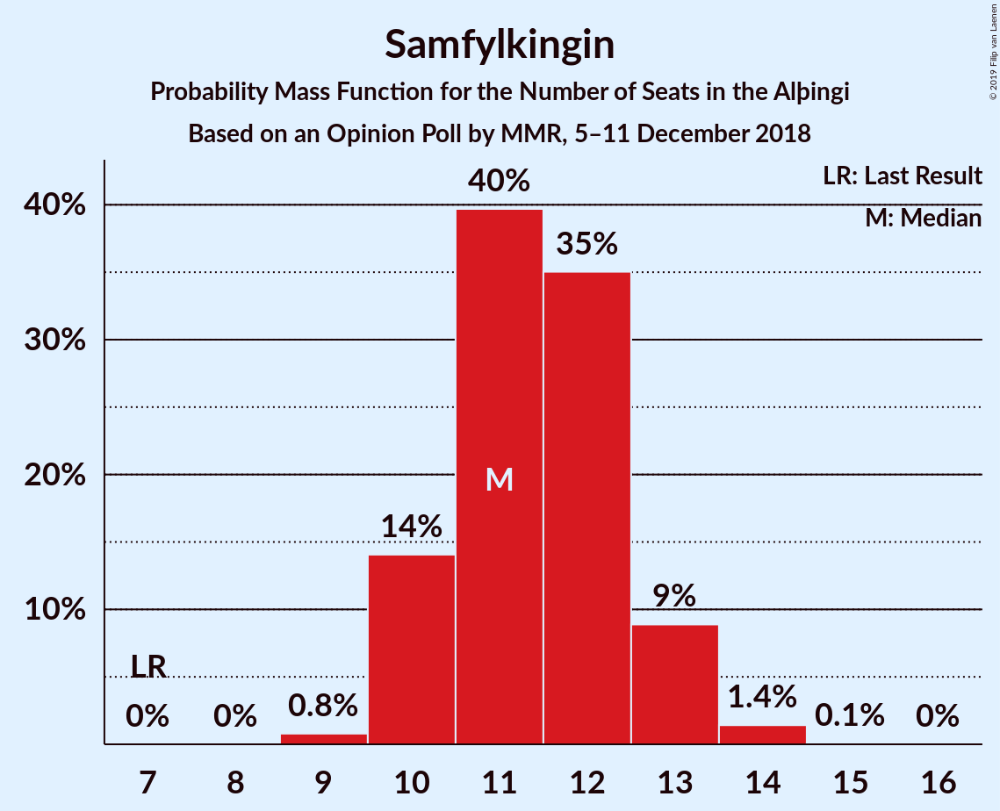

# Opinion Poll by MMR, 5–11 December 2018

<a href="#voting-intentions">Voting Intentions</a> | <a href="#seats">Seats</a> | <a href="#coalitions">Coalitions</a> | <a href="#technical-information">Technical Information</a>

## Voting Intentions

### Confidence Intervals

| Party | Last Result | Poll Result | 80% Confidence Interval | 90% Confidence Interval | 95% Confidence Interval | 99% Confidence Interval |
|:-----:|:-----------:|:-----------:|:-----------------------:|:-----------------------:|:-----------------------:|:-----------------------:|
| Sjálfstæðisflokkurinn | 25.2% | 22.1% | 20.4–23.8% |20.0–24.3% |19.6–24.8% |18.8–25.6% |
| Samfylkingin | 12.1% | 16.9% | 15.5–18.5% |15.1–19.0% |14.7–19.4% |14.0–20.2% |
| Píratar | 9.2% | 14.4% | 13.0–15.9% |12.6–16.3% |12.3–16.7% |11.7–17.5% |
| Vinstrihreyfingin – grænt framboð | 16.9% | 12.9% | 11.6–14.4% |11.3–14.8% |11.0–15.2% |10.4–15.9% |
| Framsóknarflokkurinn | 10.7% | 12.5% | 11.2–14.0% |10.9–14.4% |10.6–14.7% |10.0–15.5% |
| Viðreisn | 6.7% | 8.5% | 7.5–9.8% |7.2–10.1% |6.9–10.4% |6.4–11.1% |
| Miðflokkurinn | 10.9% | 5.9% | 5.1–7.0% |4.8–7.3% |4.6–7.6% |4.2–8.2% |
| Flokkur fólksins | 6.9% | 4.2% | 3.5–5.2% |3.3–5.4% |3.1–5.7% |2.8–6.1% |

*Note:* The poll result column reflects the actual value used in the calculations. Published results may vary slightly, and in addition be rounded to fewer digits.

## Seats

### Confidence Intervals

| Party | Last Result | Median | 80% Confidence Interval | 90% Confidence Interval | 95% Confidence Interval | 99% Confidence Interval |
|:-----:|:-----------:|:------:|:-----------------------:|:-----------------------:|:-----------------------:|:-----------------------:|
| <a href="#sjálfstæðisflokkurinn">Sjálfstæðisflokkurinn</a> | 16 | 15 | 13–16 |13–17 |13–17 |12–18 |
| <a href="#samfylkingin">Samfylkingin</a> | 7 | 12 | 10–13 |10–13 |10–13 |9–14 |
| <a href="#píratar">Píratar</a> | 6 | 10 | 9–11 |8–11 |8–11 |8–12 |
| <a href="#vinstrihreyfingin-–-grænt-framboð">Vinstrihreyfingin – grænt framboð</a> | 11 | 9 | 7–10 |7–10 |7–10 |7–11 |
| <a href="#framsóknarflokkurinn">Framsóknarflokkurinn</a> | 8 | 9 | 7–10 |7–10 |7–10 |7–11 |
| <a href="#viðreisn">Viðreisn</a> | 4 | 5 | 5–6 |5–7 |4–7 |4–7 |
| <a href="#miðflokkurinn">Miðflokkurinn</a> | 7 | 4 | 1–5 |0–5 |0–5 |0–5 |
| <a href="#flokkur-fólksins">Flokkur fólksins</a> | 4 | 0 | 0–3 |0–3 |0–4 |0–4 |

### Sjálfstæðisflokkurinn

*For a full overview of the results for this party, see the [Sjálfstæðisflokkurinn](party-sjálfstæðisflokkurinn.html) page.*

| Number of Seats | Probability | Accumulated | Special Marks |
|:---------------:|:-----------:|:-----------:|:-------------:|
| 12 | 1.3% | 100% |  |
| 13 | 10% | 98.6% |  |
| 14 | 31% | 88% |  |
| 15 | 27% | 57% | Median |
| 16 | 21% | 30% | Last Result |
| 17 | 8% | 9% |  |
| 18 | 0.8% | 0.9% |  |
| 19 | 0% | 0% |  |

### Samfylkingin

*For a full overview of the results for this party, see the [Samfylkingin](party-samfylkingin.html) page.*

| Number of Seats | Probability | Accumulated | Special Marks |
|:---------------:|:-----------:|:-----------:|:-------------:|
| 7 | 0% | 100% | Last Result |
| 8 | 0% | 100% |  |
| 9 | 1.1% | 100% |  |
| 10 | 20% | 98.9% |  |
| 11 | 26% | 79% |  |
| 12 | 41% | 53% | Median |
| 13 | 9% | 12% |  |
| 14 | 2% | 2% |  |
| 15 | 0.1% | 0.1% |  |
| 16 | 0% | 0% |  |

### Píratar

*For a full overview of the results for this party, see the [Píratar](party-píratar.html) page.*

| Number of Seats | Probability | Accumulated | Special Marks |
|:---------------:|:-----------:|:-----------:|:-------------:|
| 6 | 0% | 100% | Last Result |
| 7 | 0.3% | 100% |  |
| 8 | 8% | 99.7% |  |
| 9 | 35% | 92% |  |
| 10 | 40% | 57% | Median |
| 11 | 16% | 17% |  |
| 12 | 0.9% | 0.9% |  |
| 13 | 0.1% | 0.1% |  |
| 14 | 0% | 0% |  |

### Vinstrihreyfingin – grænt framboð

*For a full overview of the results for this party, see the [Vinstrihreyfingin – grænt framboð](party-vinstrihreyfingin–græntframboð.html) page.*

| Number of Seats | Probability | Accumulated | Special Marks |
|:---------------:|:-----------:|:-----------:|:-------------:|
| 6 | 0.3% | 100% |  |
| 7 | 11% | 99.7% |  |
| 8 | 31% | 89% |  |
| 9 | 37% | 57% | Median |
| 10 | 19% | 20% |  |
| 11 | 1.0% | 1.1% | Last Result |
| 12 | 0.1% | 0.1% |  |
| 13 | 0% | 0% |  |

### Framsóknarflokkurinn

*For a full overview of the results for this party, see the [Framsóknarflokkurinn](party-framsóknarflokkurinn.html) page.*

| Number of Seats | Probability | Accumulated | Special Marks |
|:---------------:|:-----------:|:-----------:|:-------------:|
| 6 | 0.4% | 100% |  |
| 7 | 13% | 99.5% |  |
| 8 | 30% | 87% | Last Result |
| 9 | 13% | 56% | Median |
| 10 | 42% | 43% |  |
| 11 | 1.4% | 1.4% |  |
| 12 | 0% | 0.1% |  |
| 13 | 0% | 0% |  |

### Viðreisn

*For a full overview of the results for this party, see the [Viðreisn](party-viðreisn.html) page.*

| Number of Seats | Probability | Accumulated | Special Marks |
|:---------------:|:-----------:|:-----------:|:-------------:|
| 4 | 5% | 100% | Last Result |
| 5 | 46% | 95% | Median |
| 6 | 40% | 49% |  |
| 7 | 9% | 9% |  |
| 8 | 0.3% | 0.3% |  |
| 9 | 0% | 0% |  |

### Miðflokkurinn

*For a full overview of the results for this party, see the [Miðflokkurinn](party-miðflokkurinn.html) page.*

| Number of Seats | Probability | Accumulated | Special Marks |
|:---------------:|:-----------:|:-----------:|:-------------:|
| 0 | 5% | 100% |  |
| 1 | 7% | 95% |  |
| 2 | 0% | 88% |  |
| 3 | 24% | 88% |  |
| 4 | 52% | 64% | Median |
| 5 | 12% | 12% |  |
| 6 | 0.1% | 0.1% |  |
| 7 | 0% | 0% | Last Result |

### Flokkur fólksins

*For a full overview of the results for this party, see the [Flokkur fólksins](party-flokkurfólksins.html) page.*

| Number of Seats | Probability | Accumulated | Special Marks |
|:---------------:|:-----------:|:-----------:|:-------------:|
| 0 | 84% | 100% | Median |
| 1 | 0% | 16% |  |
| 2 | 0% | 16% |  |
| 3 | 12% | 16% |  |
| 4 | 3% | 3% | Last Result |
| 5 | 0% | 0% |  |

## Coalitions

### Confidence Intervals

| Coalition | Last Result | Median | Majority? | 80% Confidence Interval | 90% Confidence Interval | 95% Confidence Interval | 99% Confidence Interval |
|:---------:|:-----------:|:------:|:---------:|:-----------------------:|:-----------------------:|:-----------------------:|:-----------------------:|
| Samfylkingin – Píratar – Vinstrihreyfingin – grænt framboð – Viðreisn | 28 | 35 | 99.2% | 33–37 | 33–38 | 32–38 | 31–39 |
| Sjálfstæðisflokkurinn – Vinstrihreyfingin – grænt framboð – Framsóknarflokkurinn | 35 | 33 | 72% | 30–34 | 30–35 | 30–35 | 29–36 |
| Samfylkingin – Vinstrihreyfingin – grænt framboð – Framsóknarflokkurinn – Miðflokkurinn | 33 | 33 | 69% | 30–35 | 30–35 | 29–35 | 29–35 |
| Samfylkingin – Píratar – Vinstrihreyfingin – grænt framboð | 24 | 30 | 12% | 28–32 | 27–32 | 27–33 | 26–33 |
| Samfylkingin – Vinstrihreyfingin – grænt framboð – Framsóknarflokkurinn | 26 | 29 | 6% | 27–31 | 26–32 | 26–32 | 25–32 |
| Sjálfstæðisflokkurinn – Framsóknarflokkurinn – Miðflokkurinn | 31 | 27 | 0% | 25–29 | 25–30 | 24–30 | 24–31 |
| Sjálfstæðisflokkurinn – Samfylkingin | 23 | 26 | 0% | 24–28 | 24–29 | 24–29 | 22–29 |
| Sjálfstæðisflokkurinn – Framsóknarflokkurinn | 24 | 24 | 0% | 22–25 | 22–26 | 22–27 | 21–28 |
| Sjálfstæðisflokkurinn – Vinstrihreyfingin – grænt framboð | 27 | 23 | 0% | 22–25 | 21–26 | 21–26 | 20–27 |
| Samfylkingin – Vinstrihreyfingin – grænt framboð – Miðflokkurinn | 25 | 24 | 0% | 21–25 | 21–26 | 20–26 | 19–27 |
| Vinstrihreyfingin – grænt framboð – Framsóknarflokkurinn – Miðflokkurinn | 26 | 21 | 0% | 19–23 | 18–23 | 18–23 | 18–24 |
| Sjálfstæðisflokkurinn – Viðreisn | 20 | 20 | 0% | 19–22 | 19–23 | 18–23 | 17–24 |
| Samfylkingin – Vinstrihreyfingin – grænt framboð | 18 | 20 | 0% | 18–22 | 18–22 | 17–23 | 17–23 |
| Píratar – Vinstrihreyfingin – grænt framboð | 17 | 18 | 0% | 17–20 | 16–20 | 16–21 | 15–21 |
| Sjálfstæðisflokkurinn – Miðflokkurinn | 23 | 18 | 0% | 16–20 | 15–21 | 15–21 | 15–21 |
| Vinstrihreyfingin – grænt framboð – Framsóknarflokkurinn | 19 | 18 | 0% | 15–19 | 15–19 | 15–20 | 15–21 |
| Vinstrihreyfingin – grænt framboð – Miðflokkurinn | 18 | 12 | 0% | 10–14 | 10–14 | 9–14 | 9–15 |

### Samfylkingin – Píratar – Vinstrihreyfingin – grænt framboð – Viðreisn

| Number of Seats | Probability | Accumulated | Special Marks |
|:---------------:|:-----------:|:-----------:|:-------------:|
| 28 | 0% | 100% | Last Result |
| 29 | 0% | 100% |  |
| 30 | 0% | 100% |  |
| 31 | 0.7% | 100% |  |
| 32 | 4% | 99.2% | Majority |
| 33 | 12% | 96% |  |
| 34 | 13% | 83% |  |
| 35 | 22% | 70% |  |
| 36 | 25% | 48% | Median |
| 37 | 14% | 24% |  |
| 38 | 8% | 10% |  |
| 39 | 2% | 2% |  |
| 40 | 0.1% | 0.1% |  |
| 41 | 0% | 0% |  |

### Sjálfstæðisflokkurinn – Vinstrihreyfingin – grænt framboð – Framsóknarflokkurinn

| Number of Seats | Probability | Accumulated | Special Marks |
|:---------------:|:-----------:|:-----------:|:-------------:|
| 28 | 0.1% | 100% |  |
| 29 | 2% | 99.9% |  |
| 30 | 10% | 98% |  |
| 31 | 17% | 88% |  |
| 32 | 20% | 72% | Majority |
| 33 | 32% | 52% | Median |
| 34 | 13% | 20% |  |
| 35 | 5% | 7% | Last Result |
| 36 | 1.4% | 2% |  |
| 37 | 0.4% | 0.4% |  |
| 38 | 0% | 0% |  |

### Samfylkingin – Vinstrihreyfingin – grænt framboð – Framsóknarflokkurinn – Miðflokkurinn

| Number of Seats | Probability | Accumulated | Special Marks |
|:---------------:|:-----------:|:-----------:|:-------------:|
| 28 | 0.1% | 100% |  |
| 29 | 3% | 99.9% |  |
| 30 | 9% | 97% |  |
| 31 | 19% | 88% |  |
| 32 | 19% | 69% | Majority |
| 33 | 21% | 50% | Last Result |
| 34 | 18% | 29% | Median |
| 35 | 11% | 11% |  |
| 36 | 0.4% | 0.4% |  |
| 37 | 0% | 0% |  |

### Samfylkingin – Píratar – Vinstrihreyfingin – grænt framboð

| Number of Seats | Probability | Accumulated | Special Marks |
|:---------------:|:-----------:|:-----------:|:-------------:|
| 24 | 0% | 100% | Last Result |
| 25 | 0.1% | 100% |  |
| 26 | 1.2% | 99.9% |  |
| 27 | 7% | 98.8% |  |
| 28 | 14% | 92% |  |
| 29 | 18% | 78% |  |
| 30 | 29% | 61% |  |
| 31 | 19% | 31% | Median |
| 32 | 7% | 12% | Majority |
| 33 | 5% | 5% |  |
| 34 | 0.1% | 0.1% |  |
| 35 | 0% | 0% |  |

### Samfylkingin – Vinstrihreyfingin – grænt framboð – Framsóknarflokkurinn

| Number of Seats | Probability | Accumulated | Special Marks |
|:---------------:|:-----------:|:-----------:|:-------------:|
| 25 | 0.6% | 100% |  |
| 26 | 6% | 99.3% | Last Result |
| 27 | 16% | 94% |  |
| 28 | 22% | 77% |  |
| 29 | 12% | 55% |  |
| 30 | 18% | 43% | Median |
| 31 | 19% | 25% |  |
| 32 | 6% | 6% | Majority |
| 33 | 0.1% | 0.1% |  |
| 34 | 0% | 0% |  |

### Sjálfstæðisflokkurinn – Framsóknarflokkurinn – Miðflokkurinn

| Number of Seats | Probability | Accumulated | Special Marks |
|:---------------:|:-----------:|:-----------:|:-------------:|
| 22 | 0.1% | 100% |  |
| 23 | 0.2% | 99.9% |  |
| 24 | 2% | 99.7% |  |
| 25 | 10% | 97% |  |
| 26 | 18% | 87% |  |
| 27 | 28% | 69% |  |
| 28 | 23% | 41% | Median |
| 29 | 11% | 17% |  |
| 30 | 6% | 7% |  |
| 31 | 0.6% | 0.6% | Last Result |
| 32 | 0% | 0% | Majority |

### Sjálfstæðisflokkurinn – Samfylkingin

| Number of Seats | Probability | Accumulated | Special Marks |
|:---------------:|:-----------:|:-----------:|:-------------:|
| 22 | 1.1% | 100% |  |
| 23 | 1.4% | 98.9% | Last Result |
| 24 | 8% | 98% |  |
| 25 | 13% | 89% |  |
| 26 | 35% | 76% |  |
| 27 | 19% | 40% | Median |
| 28 | 15% | 21% |  |
| 29 | 6% | 6% |  |
| 30 | 0.3% | 0.5% |  |
| 31 | 0.1% | 0.1% |  |
| 32 | 0% | 0% | Majority |

### Sjálfstæðisflokkurinn – Framsóknarflokkurinn

| Number of Seats | Probability | Accumulated | Special Marks |
|:---------------:|:-----------:|:-----------:|:-------------:|
| 19 | 0.1% | 100% |  |
| 20 | 0.3% | 99.9% |  |
| 21 | 2% | 99.6% |  |
| 22 | 13% | 98% |  |
| 23 | 34% | 85% |  |
| 24 | 25% | 51% | Last Result, Median |
| 25 | 17% | 26% |  |
| 26 | 6% | 9% |  |
| 27 | 2% | 3% |  |
| 28 | 0.5% | 0.6% |  |
| 29 | 0% | 0% |  |

### Sjálfstæðisflokkurinn – Vinstrihreyfingin – grænt framboð

| Number of Seats | Probability | Accumulated | Special Marks |
|:---------------:|:-----------:|:-----------:|:-------------:|
| 19 | 0.1% | 100% |  |
| 20 | 2% | 99.9% |  |
| 21 | 3% | 98% |  |
| 22 | 19% | 95% |  |
| 23 | 30% | 76% |  |
| 24 | 22% | 47% | Median |
| 25 | 15% | 25% |  |
| 26 | 9% | 10% |  |
| 27 | 1.2% | 1.3% | Last Result |
| 28 | 0.2% | 0.2% |  |
| 29 | 0% | 0% |  |

### Samfylkingin – Vinstrihreyfingin – grænt framboð – Miðflokkurinn

| Number of Seats | Probability | Accumulated | Special Marks |
|:---------------:|:-----------:|:-----------:|:-------------:|
| 19 | 0.8% | 100% |  |
| 20 | 2% | 99.2% |  |
| 21 | 8% | 97% |  |
| 22 | 13% | 89% |  |
| 23 | 19% | 76% |  |
| 24 | 25% | 57% |  |
| 25 | 24% | 32% | Last Result, Median |
| 26 | 7% | 8% |  |
| 27 | 0.6% | 0.7% |  |
| 28 | 0.1% | 0.1% |  |
| 29 | 0% | 0% |  |

### Vinstrihreyfingin – grænt framboð – Framsóknarflokkurinn – Miðflokkurinn

| Number of Seats | Probability | Accumulated | Special Marks |
|:---------------:|:-----------:|:-----------:|:-------------:|
| 16 | 0.1% | 100% |  |
| 17 | 0.2% | 99.9% |  |
| 18 | 5% | 99.7% |  |
| 19 | 16% | 95% |  |
| 20 | 13% | 79% |  |
| 21 | 25% | 66% |  |
| 22 | 23% | 41% | Median |
| 23 | 16% | 18% |  |
| 24 | 2% | 2% |  |
| 25 | 0.4% | 0.4% |  |
| 26 | 0% | 0% | Last Result |

### Sjálfstæðisflokkurinn – Viðreisn

| Number of Seats | Probability | Accumulated | Special Marks |
|:---------------:|:-----------:|:-----------:|:-------------:|
| 17 | 0.6% | 100% |  |
| 18 | 4% | 99.3% |  |
| 19 | 24% | 96% |  |
| 20 | 30% | 72% | Last Result, Median |
| 21 | 17% | 42% |  |
| 22 | 19% | 24% |  |
| 23 | 5% | 5% |  |
| 24 | 0.5% | 0.6% |  |
| 25 | 0% | 0% |  |

### Samfylkingin – Vinstrihreyfingin – grænt framboð

| Number of Seats | Probability | Accumulated | Special Marks |
|:---------------:|:-----------:|:-----------:|:-------------:|
| 16 | 0.1% | 100% |  |
| 17 | 3% | 99.9% |  |
| 18 | 11% | 97% | Last Result |
| 19 | 18% | 86% |  |
| 20 | 28% | 68% |  |
| 21 | 22% | 40% | Median |
| 22 | 15% | 18% |  |
| 23 | 2% | 3% |  |
| 24 | 0.2% | 0.3% |  |
| 25 | 0% | 0% |  |

### Píratar – Vinstrihreyfingin – grænt framboð

| Number of Seats | Probability | Accumulated | Special Marks |
|:---------------:|:-----------:|:-----------:|:-------------:|
| 15 | 0.8% | 100% |  |
| 16 | 7% | 99.2% |  |
| 17 | 17% | 92% | Last Result |
| 18 | 29% | 75% |  |
| 19 | 30% | 46% | Median |
| 20 | 11% | 16% |  |
| 21 | 5% | 5% |  |
| 22 | 0.2% | 0.2% |  |
| 23 | 0% | 0% |  |

### Sjálfstæðisflokkurinn – Miðflokkurinn

| Number of Seats | Probability | Accumulated | Special Marks |
|:---------------:|:-----------:|:-----------:|:-------------:|
| 14 | 0.2% | 100% |  |
| 15 | 5% | 99.8% |  |
| 16 | 6% | 95% |  |
| 17 | 24% | 89% |  |
| 18 | 21% | 65% |  |
| 19 | 13% | 45% | Median |
| 20 | 26% | 32% |  |
| 21 | 5% | 5% |  |
| 22 | 0.3% | 0.3% |  |
| 23 | 0% | 0% | Last Result |

### Vinstrihreyfingin – grænt framboð – Framsóknarflokkurinn

| Number of Seats | Probability | Accumulated | Special Marks |
|:---------------:|:-----------:|:-----------:|:-------------:|
| 14 | 0.1% | 100% |  |
| 15 | 11% | 99.8% |  |
| 16 | 14% | 88% |  |
| 17 | 21% | 75% |  |
| 18 | 22% | 54% | Median |
| 19 | 27% | 32% | Last Result |
| 20 | 4% | 5% |  |
| 21 | 0.7% | 0.8% |  |
| 22 | 0.1% | 0.1% |  |
| 23 | 0% | 0% |  |

### Vinstrihreyfingin – grænt framboð – Miðflokkurinn

| Number of Seats | Probability | Accumulated | Special Marks |
|:---------------:|:-----------:|:-----------:|:-------------:|
| 8 | 0.4% | 100% |  |
| 9 | 4% | 99.6% |  |
| 10 | 9% | 95% |  |
| 11 | 14% | 86% |  |
| 12 | 24% | 72% |  |
| 13 | 36% | 48% | Median |
| 14 | 10% | 12% |  |
| 15 | 1.3% | 1.3% |  |
| 16 | 0% | 0% |  |
| 17 | 0% | 0% |  |
| 18 | 0% | 0% | Last Result |

## Technical Information

### Opinion Poll

+ **Polling firm:** MMR
+ **Commissioner(s):** —
+ **Fieldwork period:** 5–11 December 2018

### Calculations

+ **Sample size:** 975
+ **Simulations done:** 131,072
+ **Error estimate:** 2.76%

