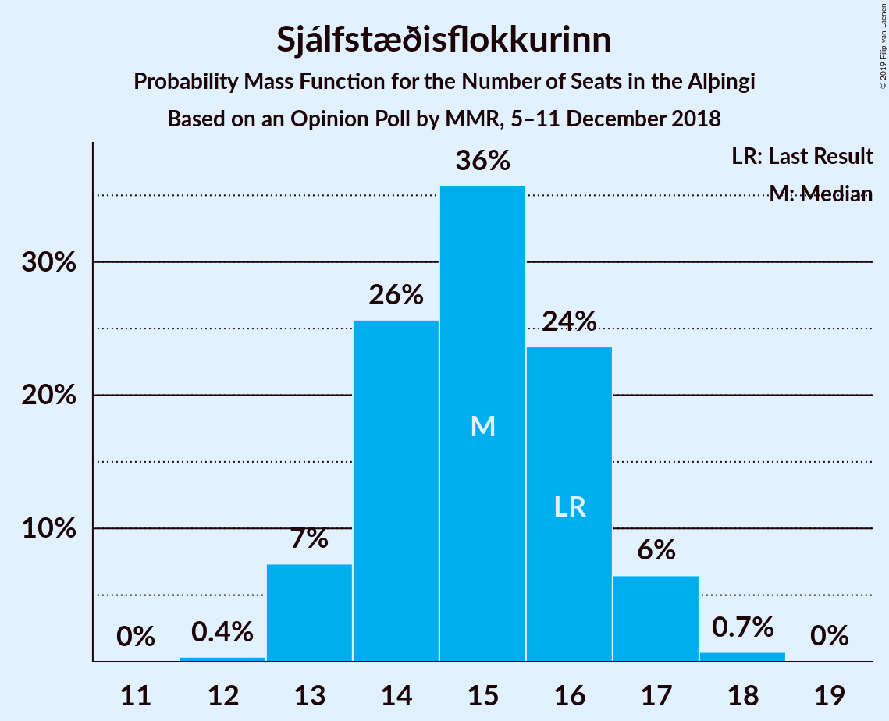

# Opinion Poll by MMR, 5–11 December 2018

<a href="#voting-intentions">Voting Intentions</a> | <a href="#seats">Seats</a> | <a href="#coalitions">Coalitions</a> | <a href="#technical-information">Technical Information</a>

## Voting Intentions

### Confidence Intervals

| Party | Last Result | Poll Result | 80% Confidence Interval | 90% Confidence Interval | 95% Confidence Interval | 99% Confidence Interval |
|:-----:|:-----------:|:-----------:|:-----------------------:|:-----------------------:|:-----------------------:|:-----------------------:|
| Sjálfstæðisflokkurinn | 25.2% | 22.1% | 20.4–23.8% |20.0–24.3% |19.6–24.8% |18.8–25.6% |
| Samfylkingin | 12.1% | 16.9% | 15.5–18.5% |15.1–19.0% |14.7–19.4% |14.0–20.2% |
| Píratar | 9.2% | 14.4% | 13.0–15.9% |12.6–16.3% |12.3–16.7% |11.7–17.5% |
| Vinstrihreyfingin – grænt framboð | 16.9% | 12.9% | 11.6–14.4% |11.3–14.8% |11.0–15.2% |10.4–15.9% |
| Framsóknarflokkurinn | 10.7% | 12.5% | 11.2–14.0% |10.9–14.4% |10.6–14.7% |10.0–15.5% |
| Viðreisn | 6.7% | 8.5% | 7.5–9.8% |7.2–10.1% |6.9–10.4% |6.4–11.1% |
| Miðflokkurinn | 10.9% | 5.9% | 5.1–7.0% |4.8–7.3% |4.6–7.6% |4.2–8.2% |
| Flokkur fólksins | 6.9% | 4.2% | 3.5–5.2% |3.3–5.4% |3.1–5.7% |2.8–6.1% |

*Note:* The poll result column reflects the actual value used in the calculations. Published results may vary slightly, and in addition be rounded to fewer digits.

## Seats

### Confidence Intervals

| Party | Last Result | Median | 80% Confidence Interval | 90% Confidence Interval | 95% Confidence Interval | 99% Confidence Interval |
|:-----:|:-----------:|:------:|:-----------------------:|:-----------------------:|:-----------------------:|:-----------------------:|
| <a href="#sjálfstæðisflokkurinn">Sjálfstæðisflokkurinn</a> | 16 | 15 | 14–16 |13–17 |13–17 |13–18 |
| <a href="#samfylkingin">Samfylkingin</a> | 7 | 11 | 10–13 |10–13 |10–13 |9–14 |
| <a href="#píratar">Píratar</a> | 6 | 10 | 9–11 |8–11 |8–11 |8–12 |
| <a href="#vinstrihreyfingin-–-grænt-framboð">Vinstrihreyfingin – grænt framboð</a> | 11 | 9 | 8–10 |7–10 |7–10 |7–11 |
| <a href="#framsóknarflokkurinn">Framsóknarflokkurinn</a> | 8 | 9 | 8–10 |7–10 |7–10 |7–11 |
| <a href="#viðreisn">Viðreisn</a> | 4 | 6 | 5–6 |5–7 |4–7 |4–7 |
| <a href="#miðflokkurinn">Miðflokkurinn</a> | 7 | 4 | 3–4 |1–5 |0–5 |0–5 |
| <a href="#flokkur-fólksins">Flokkur fólksins</a> | 4 | 0 | 0–3 |0–3 |0–3 |0–4 |

### Sjálfstæðisflokkurinn

*For a full overview of the results for this party, see the [Sjálfstæðisflokkurinn](party-sjálfstæðisflokkurinn.html) page.*

| Number of Seats | Probability | Accumulated | Special Marks |
|:---------------:|:-----------:|:-----------:|:-------------:|
| 12 | 0.4% | 100% |  |
| 13 | 7% | 99.6% |  |
| 14 | 26% | 92% |  |
| 15 | 36% | 67% | Median |
| 16 | 24% | 31% | Last Result |
| 17 | 6% | 7% |  |
| 18 | 0.7% | 0.8% |  |
| 19 | 0% | 0% |  |

### Samfylkingin

*For a full overview of the results for this party, see the [Samfylkingin](party-samfylkingin.html) page.*

| Number of Seats | Probability | Accumulated | Special Marks |
|:---------------:|:-----------:|:-----------:|:-------------:|
| 7 | 0% | 100% | Last Result |
| 8 | 0% | 100% |  |
| 9 | 0.8% | 100% |  |
| 10 | 14% | 99.2% |  |
| 11 | 40% | 85% | Median |
| 12 | 35% | 45% |  |
| 13 | 9% | 10% |  |
| 14 | 1.4% | 1.5% |  |
| 15 | 0.1% | 0.1% |  |
| 16 | 0% | 0% |  |

### Píratar

*For a full overview of the results for this party, see the [Píratar](party-píratar.html) page.*

| Number of Seats | Probability | Accumulated | Special Marks |
|:---------------:|:-----------:|:-----------:|:-------------:|
| 6 | 0% | 100% | Last Result |
| 7 | 0.3% | 100% |  |
| 8 | 8% | 99.7% |  |
| 9 | 36% | 92% |  |
| 10 | 40% | 56% | Median |
| 11 | 14% | 15% |  |
| 12 | 1.0% | 1.1% |  |
| 13 | 0% | 0% |  |

### Vinstrihreyfingin – grænt framboð

*For a full overview of the results for this party, see the [Vinstrihreyfingin – grænt framboð](party-vinstrihreyfingin–græntframboð.html) page.*

| Number of Seats | Probability | Accumulated | Special Marks |
|:---------------:|:-----------:|:-----------:|:-------------:|
| 6 | 0.2% | 100% |  |
| 7 | 6% | 99.8% |  |
| 8 | 44% | 94% |  |
| 9 | 37% | 50% | Median |
| 10 | 12% | 13% |  |
| 11 | 1.2% | 1.2% | Last Result |
| 12 | 0% | 0% |  |

### Framsóknarflokkurinn

*For a full overview of the results for this party, see the [Framsóknarflokkurinn](party-framsóknarflokkurinn.html) page.*

| Number of Seats | Probability | Accumulated | Special Marks |
|:---------------:|:-----------:|:-----------:|:-------------:|
| 6 | 0.4% | 100% |  |
| 7 | 9% | 99.6% |  |
| 8 | 36% | 91% | Last Result |
| 9 | 10% | 55% | Median |
| 10 | 43% | 45% |  |
| 11 | 1.0% | 1.1% |  |
| 12 | 0% | 0% |  |

### Viðreisn

*For a full overview of the results for this party, see the [Viðreisn](party-viðreisn.html) page.*

| Number of Seats | Probability | Accumulated | Special Marks |
|:---------------:|:-----------:|:-----------:|:-------------:|
| 4 | 5% | 100% | Last Result |
| 5 | 44% | 95% |  |
| 6 | 44% | 51% | Median |
| 7 | 7% | 7% |  |
| 8 | 0.2% | 0.2% |  |
| 9 | 0% | 0% |  |

### Miðflokkurinn

*For a full overview of the results for this party, see the [Miðflokkurinn](party-miðflokkurinn.html) page.*

| Number of Seats | Probability | Accumulated | Special Marks |
|:---------------:|:-----------:|:-----------:|:-------------:|
| 0 | 3% | 100% |  |
| 1 | 7% | 97% |  |
| 2 | 0.1% | 90% |  |
| 3 | 24% | 90% |  |
| 4 | 58% | 66% | Median |
| 5 | 8% | 8% |  |
| 6 | 0.1% | 0.1% |  |
| 7 | 0% | 0% | Last Result |

### Flokkur fólksins

*For a full overview of the results for this party, see the [Flokkur fólksins](party-flokkurfólksins.html) page.*

| Number of Seats | Probability | Accumulated | Special Marks |
|:---------------:|:-----------:|:-----------:|:-------------:|
| 0 | 86% | 100% | Median |
| 1 | 0% | 14% |  |
| 2 | 0% | 14% |  |
| 3 | 12% | 14% |  |
| 4 | 1.4% | 1.4% | Last Result |
| 5 | 0% | 0% |  |

## Coalitions

### Confidence Intervals

| Coalition | Last Result | Median | Majority? | 80% Confidence Interval | 90% Confidence Interval | 95% Confidence Interval | 99% Confidence Interval |
|:---------:|:-----------:|:------:|:---------:|:-----------------------:|:-----------------------:|:-----------------------:|:-----------------------:|
| Samfylkingin – Píratar – Vinstrihreyfingin – grænt framboð – Viðreisn | 28 | 35 | 99.6% | 33–37 | 33–38 | 32–38 | 32–39 |
| Samfylkingin – Vinstrihreyfingin – grænt framboð – Framsóknarflokkurinn – Miðflokkurinn | 33 | 32 | 76% | 31–34 | 30–35 | 30–35 | 29–35 |
| Sjálfstæðisflokkurinn – Vinstrihreyfingin – grænt framboð – Framsóknarflokkurinn | 35 | 32 | 79% | 31–34 | 30–35 | 30–35 | 29–36 |
| Samfylkingin – Píratar – Vinstrihreyfingin – grænt framboð | 24 | 30 | 9% | 28–31 | 28–32 | 27–32 | 26–33 |
| Samfylkingin – Vinstrihreyfingin – grænt framboð – Framsóknarflokkurinn | 26 | 29 | 4% | 27–31 | 27–31 | 26–32 | 25–32 |
| Sjálfstæðisflokkurinn – Framsóknarflokkurinn – Miðflokkurinn | 31 | 27 | 0% | 26–29 | 25–29 | 25–30 | 24–31 |
| Sjálfstæðisflokkurinn – Samfylkingin | 23 | 26 | 0% | 25–28 | 24–29 | 24–29 | 23–30 |
| Sjálfstæðisflokkurinn – Framsóknarflokkurinn | 24 | 24 | 0% | 22–25 | 22–26 | 21–26 | 21–27 |
| Samfylkingin – Vinstrihreyfingin – grænt framboð – Miðflokkurinn | 25 | 24 | 0% | 22–25 | 21–26 | 21–26 | 19–27 |
| Sjálfstæðisflokkurinn – Vinstrihreyfingin – grænt framboð | 27 | 24 | 0% | 22–25 | 22–26 | 21–26 | 20–27 |
| Vinstrihreyfingin – grænt framboð – Framsóknarflokkurinn – Miðflokkurinn | 26 | 21 | 0% | 19–23 | 19–23 | 18–23 | 17–24 |
| Sjálfstæðisflokkurinn – Viðreisn | 20 | 20 | 0% | 19–22 | 19–23 | 18–23 | 18–23 |
| Samfylkingin – Vinstrihreyfingin – grænt framboð | 18 | 20 | 0% | 19–22 | 18–22 | 18–22 | 17–23 |
| Sjálfstæðisflokkurinn – Miðflokkurinn | 23 | 19 | 0% | 17–20 | 16–21 | 16–21 | 15–22 |
| Píratar – Vinstrihreyfingin – grænt framboð | 17 | 18 | 0% | 17–20 | 16–20 | 16–21 | 15–21 |
| Vinstrihreyfingin – grænt framboð – Framsóknarflokkurinn | 19 | 18 | 0% | 16–19 | 16–19 | 15–20 | 15–20 |
| Vinstrihreyfingin – grænt framboð – Miðflokkurinn | 18 | 12 | 0% | 11–13 | 10–14 | 9–14 | 9–15 |

### Samfylkingin – Píratar – Vinstrihreyfingin – grænt framboð – Viðreisn

| Number of Seats | Probability | Accumulated | Special Marks |
|:---------------:|:-----------:|:-----------:|:-------------:|
| 28 | 0% | 100% | Last Result |
| 29 | 0% | 100% |  |
| 30 | 0% | 100% |  |
| 31 | 0.4% | 100% |  |
| 32 | 2% | 99.6% | Majority |
| 33 | 9% | 97% |  |
| 34 | 21% | 89% |  |
| 35 | 29% | 68% |  |
| 36 | 23% | 39% | Median |
| 37 | 11% | 16% |  |
| 38 | 5% | 6% |  |
| 39 | 0.9% | 1.1% |  |
| 40 | 0.1% | 0.1% |  |
| 41 | 0% | 0% |  |

### Samfylkingin – Vinstrihreyfingin – grænt framboð – Framsóknarflokkurinn – Miðflokkurinn

| Number of Seats | Probability | Accumulated | Special Marks |
|:---------------:|:-----------:|:-----------:|:-------------:|
| 28 | 0.2% | 100% |  |
| 29 | 2% | 99.8% |  |
| 30 | 6% | 98% |  |
| 31 | 16% | 92% |  |
| 32 | 29% | 76% | Majority |
| 33 | 22% | 47% | Last Result, Median |
| 34 | 19% | 25% |  |
| 35 | 5% | 6% |  |
| 36 | 0.4% | 0.5% |  |
| 37 | 0% | 0% |  |

### Sjálfstæðisflokkurinn – Vinstrihreyfingin – grænt framboð – Framsóknarflokkurinn

| Number of Seats | Probability | Accumulated | Special Marks |
|:---------------:|:-----------:|:-----------:|:-------------:|
| 28 | 0.1% | 100% |  |
| 29 | 1.1% | 99.9% |  |
| 30 | 5% | 98.8% |  |
| 31 | 15% | 93% |  |
| 32 | 30% | 79% | Majority |
| 33 | 29% | 49% | Median |
| 34 | 14% | 20% |  |
| 35 | 4% | 5% | Last Result |
| 36 | 1.3% | 1.5% |  |
| 37 | 0.2% | 0.2% |  |
| 38 | 0% | 0% |  |

### Samfylkingin – Píratar – Vinstrihreyfingin – grænt framboð

| Number of Seats | Probability | Accumulated | Special Marks |
|:---------------:|:-----------:|:-----------:|:-------------:|
| 24 | 0% | 100% | Last Result |
| 25 | 0.1% | 100% |  |
| 26 | 0.6% | 99.9% |  |
| 27 | 4% | 99.3% |  |
| 28 | 14% | 95% |  |
| 29 | 29% | 81% |  |
| 30 | 28% | 52% | Median |
| 31 | 16% | 24% |  |
| 32 | 6% | 9% | Majority |
| 33 | 2% | 2% |  |
| 34 | 0.3% | 0.3% |  |
| 35 | 0% | 0% |  |

### Samfylkingin – Vinstrihreyfingin – grænt framboð – Framsóknarflokkurinn

| Number of Seats | Probability | Accumulated | Special Marks |
|:---------------:|:-----------:|:-----------:|:-------------:|
| 25 | 0.6% | 100% |  |
| 26 | 3% | 99.4% | Last Result |
| 27 | 12% | 96% |  |
| 28 | 24% | 84% |  |
| 29 | 26% | 60% | Median |
| 30 | 23% | 35% |  |
| 31 | 8% | 12% |  |
| 32 | 3% | 4% | Majority |
| 33 | 0.3% | 0.3% |  |
| 34 | 0% | 0% |  |

### Sjálfstæðisflokkurinn – Framsóknarflokkurinn – Miðflokkurinn

| Number of Seats | Probability | Accumulated | Special Marks |
|:---------------:|:-----------:|:-----------:|:-------------:|
| 22 | 0% | 100% |  |
| 23 | 0.3% | 99.9% |  |
| 24 | 2% | 99.7% |  |
| 25 | 7% | 98% |  |
| 26 | 14% | 91% |  |
| 27 | 28% | 77% |  |
| 28 | 28% | 49% | Median |
| 29 | 18% | 21% |  |
| 30 | 3% | 4% |  |
| 31 | 0.5% | 0.5% | Last Result |
| 32 | 0% | 0% | Majority |

### Sjálfstæðisflokkurinn – Samfylkingin

| Number of Seats | Probability | Accumulated | Special Marks |
|:---------------:|:-----------:|:-----------:|:-------------:|
| 22 | 0.2% | 100% |  |
| 23 | 0.8% | 99.8% | Last Result |
| 24 | 6% | 99.0% |  |
| 25 | 18% | 93% |  |
| 26 | 30% | 75% | Median |
| 27 | 25% | 45% |  |
| 28 | 16% | 21% |  |
| 29 | 4% | 5% |  |
| 30 | 0.9% | 1.1% |  |
| 31 | 0.1% | 0.1% |  |
| 32 | 0% | 0% | Majority |

### Sjálfstæðisflokkurinn – Framsóknarflokkurinn

| Number of Seats | Probability | Accumulated | Special Marks |
|:---------------:|:-----------:|:-----------:|:-------------:|
| 20 | 0.4% | 100% |  |
| 21 | 3% | 99.6% |  |
| 22 | 9% | 97% |  |
| 23 | 23% | 87% |  |
| 24 | 33% | 64% | Last Result, Median |
| 25 | 24% | 31% |  |
| 26 | 6% | 7% |  |
| 27 | 2% | 2% |  |
| 28 | 0.2% | 0.2% |  |
| 29 | 0% | 0% |  |

### Samfylkingin – Vinstrihreyfingin – grænt framboð – Miðflokkurinn

| Number of Seats | Probability | Accumulated | Special Marks |
|:---------------:|:-----------:|:-----------:|:-------------:|
| 19 | 0.7% | 100% |  |
| 20 | 2% | 99.3% |  |
| 21 | 5% | 98% |  |
| 22 | 14% | 93% |  |
| 23 | 23% | 79% |  |
| 24 | 36% | 56% | Median |
| 25 | 14% | 20% | Last Result |
| 26 | 5% | 7% |  |
| 27 | 1.0% | 1.1% |  |
| 28 | 0.1% | 0.1% |  |
| 29 | 0% | 0% |  |

### Sjálfstæðisflokkurinn – Vinstrihreyfingin – grænt framboð

| Number of Seats | Probability | Accumulated | Special Marks |
|:---------------:|:-----------:|:-----------:|:-------------:|
| 20 | 0.7% | 100% |  |
| 21 | 4% | 99.3% |  |
| 22 | 19% | 96% |  |
| 23 | 25% | 76% |  |
| 24 | 28% | 51% | Median |
| 25 | 15% | 23% |  |
| 26 | 7% | 8% |  |
| 27 | 1.0% | 1.1% | Last Result |
| 28 | 0.1% | 0.1% |  |
| 29 | 0% | 0% |  |

### Vinstrihreyfingin – grænt framboð – Framsóknarflokkurinn – Miðflokkurinn

| Number of Seats | Probability | Accumulated | Special Marks |
|:---------------:|:-----------:|:-----------:|:-------------:|
| 16 | 0.1% | 100% |  |
| 17 | 0.8% | 99.9% |  |
| 18 | 2% | 99.0% |  |
| 19 | 9% | 97% |  |
| 20 | 23% | 88% |  |
| 21 | 28% | 66% |  |
| 22 | 26% | 38% | Median |
| 23 | 10% | 12% |  |
| 24 | 2% | 2% |  |
| 25 | 0.1% | 0.1% |  |
| 26 | 0% | 0% | Last Result |

### Sjálfstæðisflokkurinn – Viðreisn

| Number of Seats | Probability | Accumulated | Special Marks |
|:---------------:|:-----------:|:-----------:|:-------------:|
| 17 | 0.4% | 100% |  |
| 18 | 4% | 99.6% |  |
| 19 | 15% | 96% |  |
| 20 | 31% | 81% | Last Result |
| 21 | 29% | 49% | Median |
| 22 | 15% | 20% |  |
| 23 | 5% | 5% |  |
| 24 | 0.4% | 0.5% |  |
| 25 | 0% | 0% |  |

### Samfylkingin – Vinstrihreyfingin – grænt framboð

| Number of Seats | Probability | Accumulated | Special Marks |
|:---------------:|:-----------:|:-----------:|:-------------:|
| 16 | 0.1% | 100% |  |
| 17 | 1.1% | 99.9% |  |
| 18 | 8% | 98.9% | Last Result |
| 19 | 24% | 91% |  |
| 20 | 38% | 67% | Median |
| 21 | 18% | 29% |  |
| 22 | 9% | 11% |  |
| 23 | 2% | 2% |  |
| 24 | 0.2% | 0.2% |  |
| 25 | 0% | 0% |  |

### Sjálfstæðisflokkurinn – Miðflokkurinn

| Number of Seats | Probability | Accumulated | Special Marks |
|:---------------:|:-----------:|:-----------:|:-------------:|
| 14 | 0.3% | 100% |  |
| 15 | 2% | 99.7% |  |
| 16 | 5% | 98% |  |
| 17 | 14% | 92% |  |
| 18 | 25% | 78% |  |
| 19 | 31% | 53% | Median |
| 20 | 16% | 22% |  |
| 21 | 5% | 6% |  |
| 22 | 0.6% | 0.6% |  |
| 23 | 0% | 0% | Last Result |

### Píratar – Vinstrihreyfingin – grænt framboð

| Number of Seats | Probability | Accumulated | Special Marks |
|:---------------:|:-----------:|:-----------:|:-------------:|
| 15 | 0.6% | 100% |  |
| 16 | 5% | 99.4% |  |
| 17 | 22% | 94% | Last Result |
| 18 | 31% | 72% |  |
| 19 | 30% | 41% | Median |
| 20 | 9% | 12% |  |
| 21 | 3% | 3% |  |
| 22 | 0.2% | 0.2% |  |
| 23 | 0% | 0% |  |

### Vinstrihreyfingin – grænt framboð – Framsóknarflokkurinn

| Number of Seats | Probability | Accumulated | Special Marks |
|:---------------:|:-----------:|:-----------:|:-------------:|
| 14 | 0.2% | 100% |  |
| 15 | 4% | 99.8% |  |
| 16 | 19% | 96% |  |
| 17 | 23% | 77% |  |
| 18 | 33% | 53% | Median |
| 19 | 16% | 20% | Last Result |
| 20 | 3% | 4% |  |
| 21 | 0.3% | 0.3% |  |
| 22 | 0% | 0% |  |

### Vinstrihreyfingin – grænt framboð – Miðflokkurinn

| Number of Seats | Probability | Accumulated | Special Marks |
|:---------------:|:-----------:|:-----------:|:-------------:|
| 8 | 0.3% | 100% |  |
| 9 | 4% | 99.6% |  |
| 10 | 6% | 96% |  |
| 11 | 14% | 90% |  |
| 12 | 37% | 76% |  |
| 13 | 29% | 39% | Median |
| 14 | 8% | 9% |  |
| 15 | 1.3% | 1.3% |  |
| 16 | 0.1% | 0.1% |  |
| 17 | 0% | 0% |  |
| 18 | 0% | 0% | Last Result |

## Technical Information

### Opinion Poll

+ **Polling firm:** MMR
+ **Commissioner(s):** —
+ **Fieldwork period:** 5–11 December 2018

### Calculations

+ **Sample size:** 975
+ **Simulations done:** 1,048,576
+ **Error estimate:** 1.16%

