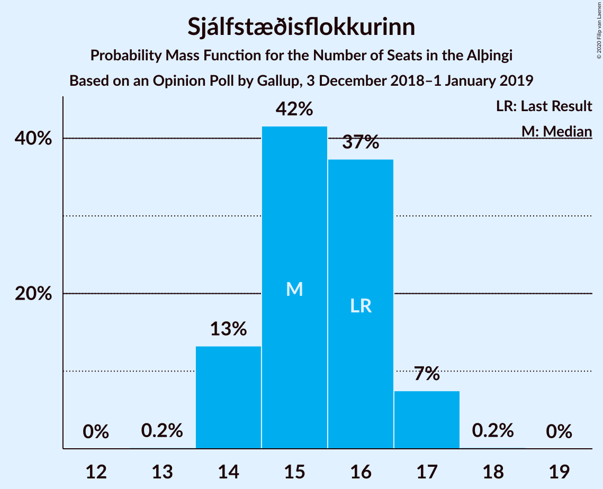
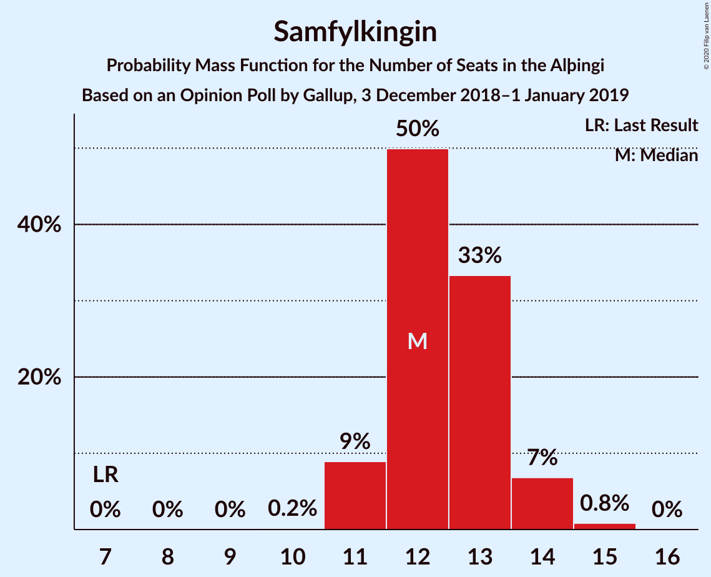
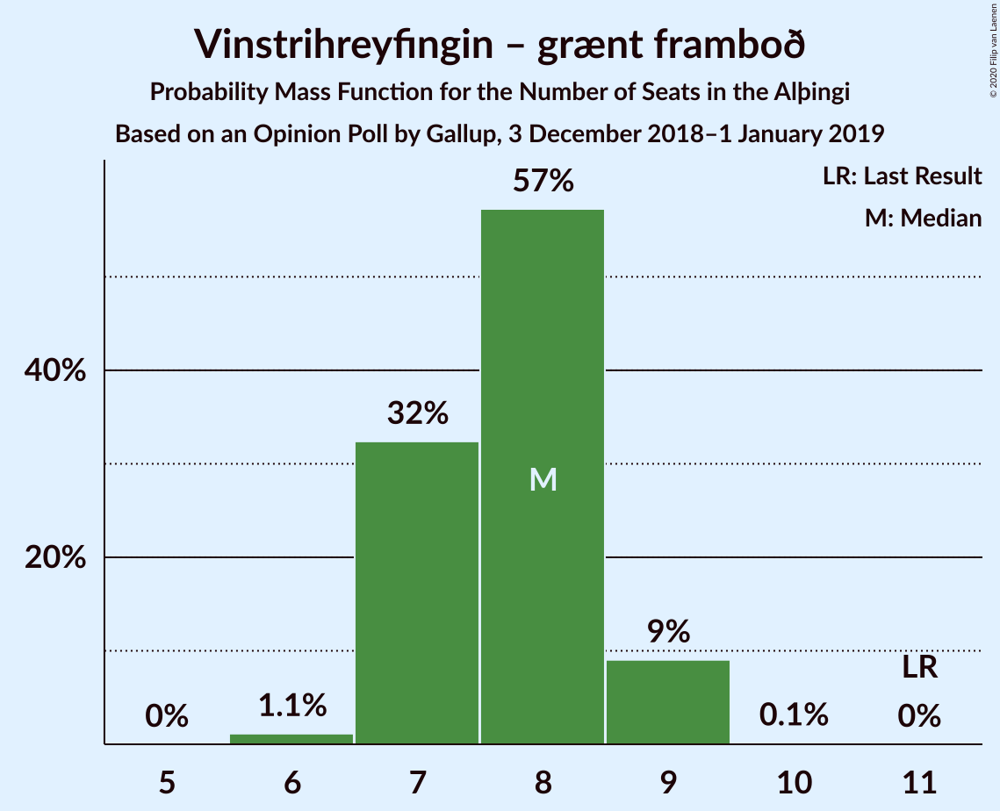
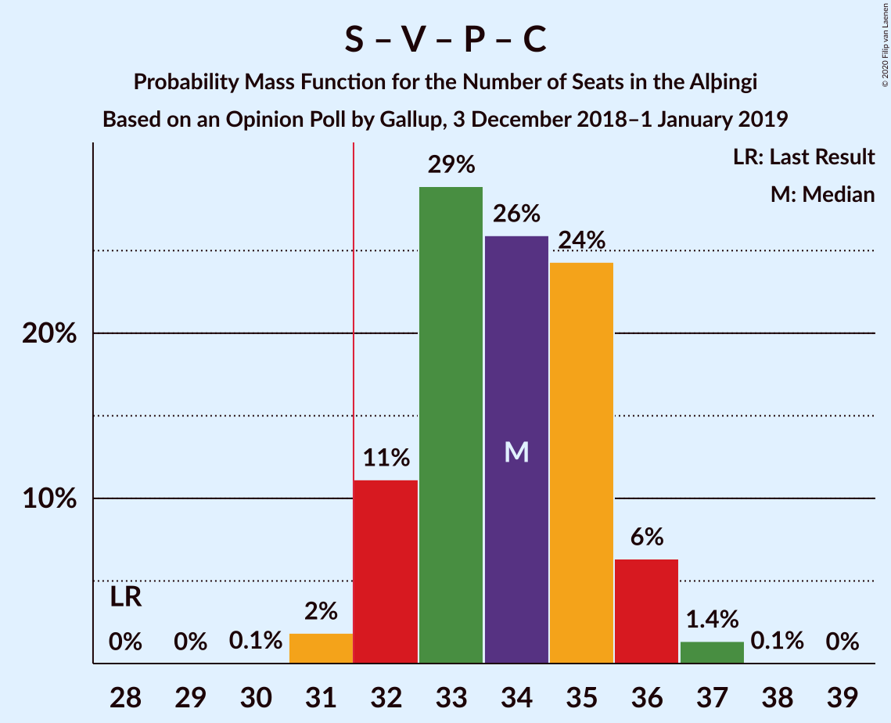
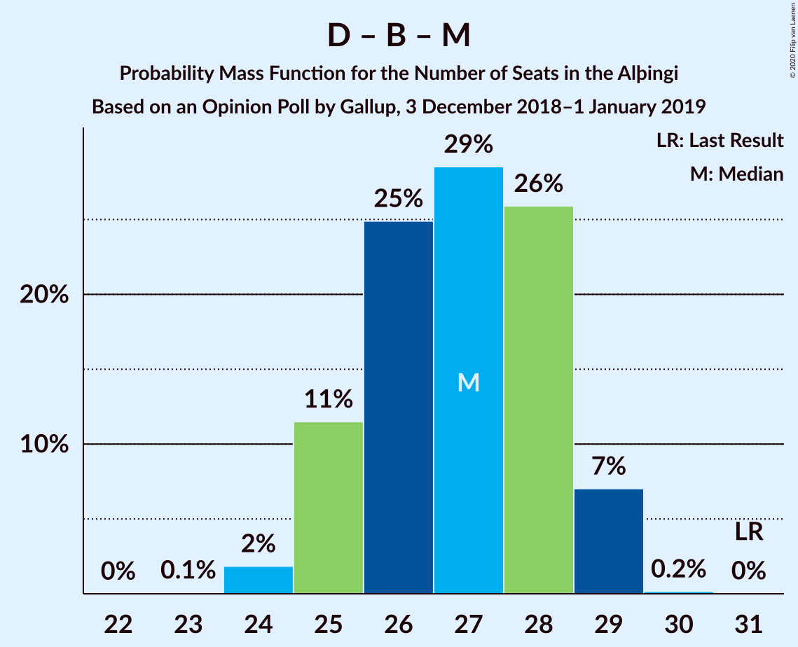
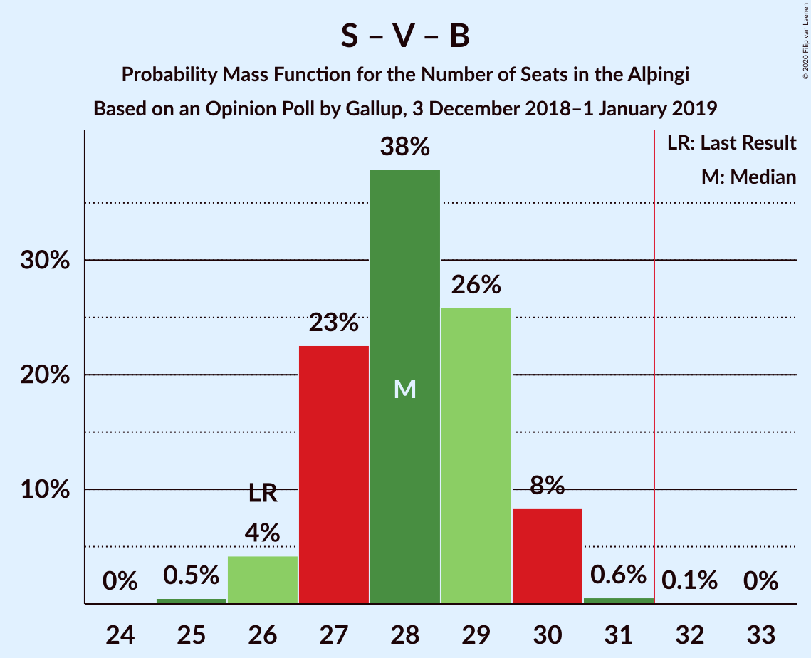

# Opinion Poll by Gallup, 3 December 2018–1 January 2019

<a href="#voting-intentions">Voting Intentions</a> | <a href="#seats">Seats</a> | <a href="#coalitions">Coalitions</a> | <a href="#technical-information">Technical Information</a>

## Voting Intentions

### Confidence Intervals

| Party | Last Result | Poll Result | 80% Confidence Interval | 90% Confidence Interval | 95% Confidence Interval | 99% Confidence Interval |
|:-----:|:-----------:|:-----------:|:-----------------------:|:-----------------------:|:-----------------------:|:-----------------------:|
| Sjálfstæðisflokkurinn | 25.2% | 22.7% | 21.7–23.7% |21.4–24.0% |21.2–24.3% |20.7–24.8% |
| Samfylkingin | 12.1% | 18.4% | 17.5–19.4% |17.3–19.6% |17.0–19.9% |16.6–20.3% |
| Vinstrihreyfingin – grænt framboð | 16.9% | 11.6% | 10.9–12.4% |10.7–12.7% |10.5–12.8% |10.2–13.2% |
| Framsóknarflokkurinn | 10.7% | 11.4% | 10.7–12.2% |10.5–12.4% |10.3–12.6% |10.0–13.0% |
| Píratar | 9.2% | 10.7% | 10.0–11.5% |9.8–11.7% |9.6–11.9% |9.3–12.3% |
| Viðreisn | 6.7% | 10.5% | 9.8–11.3% |9.6–11.5% |9.4–11.7% |9.1–12.0% |
| Miðflokkurinn | 10.9% | 5.7% | 5.2–6.3% |5.0–6.5% |4.9–6.6% |4.7–6.9% |
| Flokkur fólksins | 6.9% | 5.3% | 4.8–5.9% |4.7–6.1% |4.5–6.2% |4.3–6.5% |
| Sósíalistaflokkur Íslands | 0.0% | 3.4% | 3.0–3.9% |2.9–4.0% |2.8–4.1% |2.6–4.4% |

*Note:* The poll result column reflects the actual value used in the calculations. Published results may vary slightly, and in addition be rounded to fewer digits.

## Seats

### Confidence Intervals

| Party | Last Result | Median | 80% Confidence Interval | 90% Confidence Interval | 95% Confidence Interval | 99% Confidence Interval |
|:-----:|:-----------:|:------:|:-----------------------:|:-----------------------:|:-----------------------:|:-----------------------:|
| <a href="#sjálfstæðisflokkurinn">Sjálfstæðisflokkurinn</a> | 16 | 16 | 15–17 |15–17 |14–17 |14–17 |
| <a href="#samfylkingin">Samfylkingin</a> | 7 | 13 | 11–13 |11–13 |11–14 |11–14 |
| <a href="#vinstrihreyfingin-–-grænt-framboð">Vinstrihreyfingin – grænt framboð</a> | 11 | 8 | 7–8 |7–8 |6–8 |6–8 |
| <a href="#framsóknarflokkurinn">Framsóknarflokkurinn</a> | 8 | 8 | 8 |8 |8 |8 |
| <a href="#píratar">Píratar</a> | 6 | 6 | 6–7 |6–7 |6–7 |6–7 |
| <a href="#viðreisn">Viðreisn</a> | 4 | 8 | 6–8 |6–8 |6–8 |6–8 |
| <a href="#miðflokkurinn">Miðflokkurinn</a> | 7 | 4 | 4 |4 |4 |4 |
| <a href="#flokkur-fólksins">Flokkur fólksins</a> | 4 | 0 | 0–4 |0–4 |0–4 |0–4 |
| <a href="#sósíalistaflokkur-íslands">Sósíalistaflokkur Íslands</a> | 0 | 0 | 0 |0 |0 |0 |

### Sjálfstæðisflokkurinn

*For a full overview of the results for this party, see the [Sjálfstæðisflokkurinn](party-sjálfstæðisflokkurinn.html) page.*

| Number of Seats | Probability | Accumulated | Special Marks |
|:---------------:|:-----------:|:-----------:|:-------------:|
| 13 | 0.1% | 100% |  |
| 14 | 5% | 99.9% |  |
| 15 | 19% | 95% |  |
| 16 | 67% | 77% | Last Result, Median |
| 17 | 10% | 10% |  |
| 18 | 0% | 0% |  |

### Samfylkingin

*For a full overview of the results for this party, see the [Samfylkingin](party-samfylkingin.html) page.*

| Number of Seats | Probability | Accumulated | Special Marks |
|:---------------:|:-----------:|:-----------:|:-------------:|
| 7 | 0% | 100% | Last Result |
| 8 | 0% | 100% |  |
| 9 | 0% | 100% |  |
| 10 | 0% | 100% |  |
| 11 | 25% | 100% |  |
| 12 | 0.3% | 75% |  |
| 13 | 70% | 74% | Median |
| 14 | 4% | 4% |  |
| 15 | 0% | 0% |  |

### Vinstrihreyfingin – grænt framboð

*For a full overview of the results for this party, see the [Vinstrihreyfingin – grænt framboð](party-vinstrihreyfingin–græntframboð.html) page.*

| Number of Seats | Probability | Accumulated | Special Marks |
|:---------------:|:-----------:|:-----------:|:-------------:|
| 6 | 4% | 100% |  |
| 7 | 44% | 96% |  |
| 8 | 52% | 52% | Median |
| 9 | 0% | 0% |  |
| 10 | 0% | 0% |  |
| 11 | 0% | 0% | Last Result |

### Framsóknarflokkurinn

*For a full overview of the results for this party, see the [Framsóknarflokkurinn](party-framsóknarflokkurinn.html) page.*

| Number of Seats | Probability | Accumulated | Special Marks |
|:---------------:|:-----------:|:-----------:|:-------------:|
| 8 | 99.8% | 100% | Last Result, Median |
| 9 | 0% | 0.2% |  |
| 10 | 0.2% | 0.2% |  |
| 11 | 0% | 0% |  |

### Píratar

*For a full overview of the results for this party, see the [Píratar](party-píratar.html) page.*

| Number of Seats | Probability | Accumulated | Special Marks |
|:---------------:|:-----------:|:-----------:|:-------------:|
| 6 | 80% | 100% | Last Result, Median |
| 7 | 20% | 20% |  |
| 8 | 0.1% | 0.1% |  |
| 9 | 0% | 0% |  |

### Viðreisn

*For a full overview of the results for this party, see the [Viðreisn](party-viðreisn.html) page.*

| Number of Seats | Probability | Accumulated | Special Marks |
|:---------------:|:-----------:|:-----------:|:-------------:|
| 4 | 0% | 100% | Last Result |
| 5 | 0% | 100% |  |
| 6 | 48% | 100% |  |
| 7 | 0.3% | 52% |  |
| 8 | 52% | 52% | Median |
| 9 | 0% | 0% |  |

### Miðflokkurinn

*For a full overview of the results for this party, see the [Miðflokkurinn](party-miðflokkurinn.html) page.*

| Number of Seats | Probability | Accumulated | Special Marks |
|:---------------:|:-----------:|:-----------:|:-------------:|
| 3 | 0.2% | 100% |  |
| 4 | 99.8% | 99.8% | Median |
| 5 | 0% | 0% |  |
| 6 | 0% | 0% |  |
| 7 | 0% | 0% | Last Result |

### Flokkur fólksins

*For a full overview of the results for this party, see the [Flokkur fólksins](party-flokkurfólksins.html) page.*

| Number of Seats | Probability | Accumulated | Special Marks |
|:---------------:|:-----------:|:-----------:|:-------------:|
| 0 | 52% | 100% | Median |
| 1 | 0% | 48% |  |
| 2 | 0% | 48% |  |
| 3 | 0.1% | 48% |  |
| 4 | 48% | 48% | Last Result |
| 5 | 0% | 0% |  |

### Sósíalistaflokkur Íslands

*For a full overview of the results for this party, see the [Sósíalistaflokkur Íslands](party-sósíalistaflokkuríslands.html) page.*

| Number of Seats | Probability | Accumulated | Special Marks |
|:---------------:|:-----------:|:-----------:|:-------------:|
| 0 | 100% | 100% | Last Result, Median |

## Coalitions

### Confidence Intervals

| Coalition | Last Result | Median | Majority? | 80% Confidence Interval | 90% Confidence Interval | 95% Confidence Interval | 99% Confidence Interval |
|:---------:|:-----------:|:------:|:---------:|:-----------------------:|:-----------------------:|:-----------------------:|:-----------------------:|
| Samfylkingin – Vinstrihreyfingin – grænt framboð – Píratar – Viðreisn | 28 | 35 | 75% | 31–35 | 30–35 | 30–35 | 30–35 |
| Samfylkingin – Vinstrihreyfingin – grænt framboð – Framsóknarflokkurinn – Miðflokkurinn | 33 | 33 | 75% | 30–33 | 30–33 | 30–33 | 30–33 |
| Sjálfstæðisflokkurinn – Vinstrihreyfingin – grænt framboð – Framsóknarflokkurinn | 35 | 32 | 62% | 30–32 | 30–32 | 28–32 | 28–32 |
| Sjálfstæðisflokkurinn – Samfylkingin | 23 | 29 | 0% | 27–29 | 27–29 | 27–29 | 27–29 |
| Sjálfstæðisflokkurinn – Framsóknarflokkurinn – Miðflokkurinn | 31 | 28 | 0% | 27–29 | 27–29 | 26–29 | 26–29 |
| Samfylkingin – Vinstrihreyfingin – grænt framboð – Framsóknarflokkurinn | 26 | 29 | 0% | 26–29 | 26–29 | 26–29 | 26–29 |
| Samfylkingin – Vinstrihreyfingin – grænt framboð – Píratar | 24 | 27 | 0% | 24–27 | 24–27 | 24–27 | 24–27 |
| Sjálfstæðisflokkurinn – Framsóknarflokkurinn | 24 | 24 | 0% | 23–25 | 23–25 | 22–25 | 22–25 |
| Samfylkingin – Vinstrihreyfingin – grænt framboð – Miðflokkurinn | 25 | 25 | 0% | 22–25 | 22–25 | 22–25 | 22–25 |
| Sjálfstæðisflokkurinn – Vinstrihreyfingin – grænt framboð | 27 | 24 | 0% | 22–24 | 22–24 | 20–24 | 20–24 |
| Sjálfstæðisflokkurinn – Viðreisn | 20 | 24 | 0% | 21–24 | 21–24 | 20–24 | 20–24 |
| Sjálfstæðisflokkurinn – Miðflokkurinn | 23 | 20 | 0% | 19–20 | 19–21 | 18–21 | 18–21 |
| Samfylkingin – Vinstrihreyfingin – grænt framboð | 18 | 21 | 0% | 18–21 | 18–21 | 18–21 | 18–21 |
| Vinstrihreyfingin – grænt framboð – Framsóknarflokkurinn – Miðflokkurinn | 26 | 20 | 0% | 19–20 | 19–20 | 18–20 | 18–20 |
| Vinstrihreyfingin – grænt framboð – Framsóknarflokkurinn | 19 | 16 | 0% | 15–16 | 15–16 | 14–16 | 14–16 |
| Vinstrihreyfingin – grænt framboð – Píratar | 17 | 14 | 0% | 13–14 | 13–14 | 13–14 | 13–14 |
| Vinstrihreyfingin – grænt framboð – Miðflokkurinn | 18 | 12 | 0% | 11–12 | 11–12 | 10–12 | 10–12 |

### Samfylkingin – Vinstrihreyfingin – grænt framboð – Píratar – Viðreisn

| Number of Seats | Probability | Accumulated | Special Marks |
|:---------------:|:-----------:|:-----------:|:-------------:|
| 28 | 0% | 100% | Last Result |
| 29 | 0% | 100% |  |
| 30 | 10% | 100% |  |
| 31 | 15% | 90% |  |
| 32 | 18% | 75% | Majority |
| 33 | 5% | 56% |  |
| 34 | 0.1% | 52% |  |
| 35 | 52% | 52% | Median |
| 36 | 0% | 0% |  |

### Samfylkingin – Vinstrihreyfingin – grænt framboð – Framsóknarflokkurinn – Miðflokkurinn

| Number of Seats | Probability | Accumulated | Special Marks |
|:---------------:|:-----------:|:-----------:|:-------------:|
| 30 | 25% | 100% |  |
| 31 | 0.1% | 75% |  |
| 32 | 23% | 75% | Majority |
| 33 | 52% | 52% | Last Result, Median |
| 34 | 0% | 0% |  |

### Sjálfstæðisflokkurinn – Vinstrihreyfingin – grænt framboð – Framsóknarflokkurinn

| Number of Seats | Probability | Accumulated | Special Marks |
|:---------------:|:-----------:|:-----------:|:-------------:|
| 28 | 4% | 100% |  |
| 29 | 0% | 96% |  |
| 30 | 19% | 96% |  |
| 31 | 15% | 77% |  |
| 32 | 62% | 62% | Median, Majority |
| 33 | 0% | 0% |  |
| 34 | 0% | 0% |  |
| 35 | 0% | 0% | Last Result |

### Sjálfstæðisflokkurinn – Samfylkingin

| Number of Seats | Probability | Accumulated | Special Marks |
|:---------------:|:-----------:|:-----------:|:-------------:|
| 23 | 0% | 100% | Last Result |
| 24 | 0% | 100% |  |
| 25 | 0.1% | 100% |  |
| 26 | 0.2% | 99.9% |  |
| 27 | 15% | 99.8% |  |
| 28 | 33% | 85% |  |
| 29 | 52% | 52% | Median |
| 30 | 0% | 0% |  |

### Sjálfstæðisflokkurinn – Framsóknarflokkurinn – Miðflokkurinn

| Number of Seats | Probability | Accumulated | Special Marks |
|:---------------:|:-----------:|:-----------:|:-------------:|
| 26 | 5% | 100% |  |
| 27 | 18% | 95% |  |
| 28 | 67% | 77% | Median |
| 29 | 10% | 10% |  |
| 30 | 0% | 0% |  |
| 31 | 0% | 0% | Last Result |

### Samfylkingin – Vinstrihreyfingin – grænt framboð – Framsóknarflokkurinn

| Number of Seats | Probability | Accumulated | Special Marks |
|:---------------:|:-----------:|:-----------:|:-------------:|
| 26 | 25% | 100% | Last Result |
| 27 | 0% | 75% |  |
| 28 | 23% | 75% |  |
| 29 | 52% | 52% | Median |
| 30 | 0.1% | 0.1% |  |
| 31 | 0% | 0% |  |

### Samfylkingin – Vinstrihreyfingin – grænt framboð – Píratar

| Number of Seats | Probability | Accumulated | Special Marks |
|:---------------:|:-----------:|:-----------:|:-------------:|
| 24 | 10% | 100% | Last Result |
| 25 | 15% | 90% |  |
| 26 | 19% | 75% |  |
| 27 | 56% | 56% | Median |
| 28 | 0.1% | 0.1% |  |
| 29 | 0% | 0% |  |

### Sjálfstæðisflokkurinn – Framsóknarflokkurinn

| Number of Seats | Probability | Accumulated | Special Marks |
|:---------------:|:-----------:|:-----------:|:-------------:|
| 22 | 5% | 100% |  |
| 23 | 19% | 95% |  |
| 24 | 67% | 77% | Last Result, Median |
| 25 | 10% | 10% |  |
| 26 | 0% | 0% |  |

### Samfylkingin – Vinstrihreyfingin – grænt framboð – Miðflokkurinn

| Number of Seats | Probability | Accumulated | Special Marks |
|:---------------:|:-----------:|:-----------:|:-------------:|
| 21 | 0.1% | 100% |  |
| 22 | 25% | 99.9% |  |
| 23 | 0.1% | 75% |  |
| 24 | 23% | 75% |  |
| 25 | 52% | 52% | Last Result, Median |
| 26 | 0% | 0% |  |

### Sjálfstæðisflokkurinn – Vinstrihreyfingin – grænt framboð

| Number of Seats | Probability | Accumulated | Special Marks |
|:---------------:|:-----------:|:-----------:|:-------------:|
| 20 | 4% | 100% |  |
| 21 | 0.2% | 96% |  |
| 22 | 19% | 95% |  |
| 23 | 15% | 77% |  |
| 24 | 62% | 62% | Median |
| 25 | 0% | 0% |  |
| 26 | 0% | 0% |  |
| 27 | 0% | 0% | Last Result |

### Sjálfstæðisflokkurinn – Viðreisn

| Number of Seats | Probability | Accumulated | Special Marks |
|:---------------:|:-----------:|:-----------:|:-------------:|
| 19 | 0.1% | 100% |  |
| 20 | 4% | 99.9% | Last Result |
| 21 | 19% | 96% |  |
| 22 | 15% | 77% |  |
| 23 | 10% | 62% |  |
| 24 | 52% | 52% | Median |
| 25 | 0% | 0% |  |

### Sjálfstæðisflokkurinn – Miðflokkurinn

| Number of Seats | Probability | Accumulated | Special Marks |
|:---------------:|:-----------:|:-----------:|:-------------:|
| 16 | 0.1% | 100% |  |
| 17 | 0% | 99.9% |  |
| 18 | 5% | 99.9% |  |
| 19 | 18% | 95% |  |
| 20 | 67% | 77% | Median |
| 21 | 10% | 10% |  |
| 22 | 0% | 0% |  |
| 23 | 0% | 0% | Last Result |

### Samfylkingin – Vinstrihreyfingin – grænt framboð

| Number of Seats | Probability | Accumulated | Special Marks |
|:---------------:|:-----------:|:-----------:|:-------------:|
| 18 | 25% | 100% | Last Result |
| 19 | 0% | 75% |  |
| 20 | 23% | 75% |  |
| 21 | 52% | 52% | Median |
| 22 | 0% | 0% |  |

### Vinstrihreyfingin – grænt framboð – Framsóknarflokkurinn – Miðflokkurinn

| Number of Seats | Probability | Accumulated | Special Marks |
|:---------------:|:-----------:|:-----------:|:-------------:|
| 18 | 4% | 100% |  |
| 19 | 44% | 96% |  |
| 20 | 52% | 52% | Median |
| 21 | 0.1% | 0.1% |  |
| 22 | 0% | 0% |  |
| 23 | 0% | 0% |  |
| 24 | 0% | 0% |  |
| 25 | 0% | 0% |  |
| 26 | 0% | 0% | Last Result |

### Vinstrihreyfingin – grænt framboð – Framsóknarflokkurinn

| Number of Seats | Probability | Accumulated | Special Marks |
|:---------------:|:-----------:|:-----------:|:-------------:|
| 14 | 4% | 100% |  |
| 15 | 44% | 96% |  |
| 16 | 52% | 52% | Median |
| 17 | 0% | 0.1% |  |
| 18 | 0.1% | 0.1% |  |
| 19 | 0% | 0% | Last Result |

### Vinstrihreyfingin – grænt framboð – Píratar

| Number of Seats | Probability | Accumulated | Special Marks |
|:---------------:|:-----------:|:-----------:|:-------------:|
| 12 | 0.1% | 100% |  |
| 13 | 33% | 99.9% |  |
| 14 | 67% | 67% | Median |
| 15 | 0% | 0.1% |  |
| 16 | 0.1% | 0.1% |  |
| 17 | 0% | 0% | Last Result |

### Vinstrihreyfingin – grænt framboð – Miðflokkurinn

| Number of Seats | Probability | Accumulated | Special Marks |
|:---------------:|:-----------:|:-----------:|:-------------:|
| 9 | 0.1% | 100% |  |
| 10 | 4% | 99.9% |  |
| 11 | 44% | 95% |  |
| 12 | 52% | 52% | Median |
| 13 | 0% | 0% |  |
| 14 | 0% | 0% |  |
| 15 | 0% | 0% |  |
| 16 | 0% | 0% |  |
| 17 | 0% | 0% |  |
| 18 | 0% | 0% | Last Result |

## Technical Information

### Opinion Poll

+ **Polling firm:** Gallup
+ **Commissioner(s):** —
+ **Fieldwork period:** 3 December 2018–1 January 2019

### Calculations

+ **Sample size:** 2841
+ **Simulations done:** 1,024
+ **Error estimate:** 1.69%

