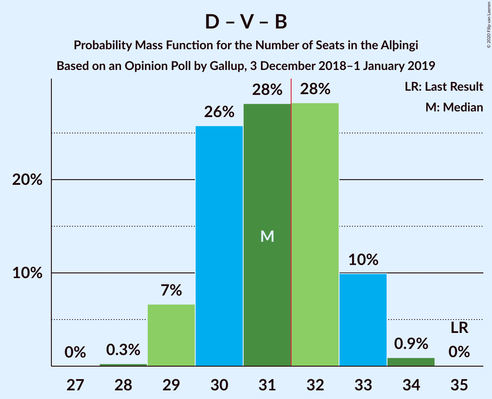

# Opinion Poll by Gallup, 3 December 2018–1 January 2019

<a href="#voting-intentions">Voting Intentions</a> | <a href="#seats">Seats</a> | <a href="#coalitions">Coalitions</a> | <a href="#technical-information">Technical Information</a>

## Voting Intentions

### Confidence Intervals

| Party | Last Result | Poll Result | 80% Confidence Interval | 90% Confidence Interval | 95% Confidence Interval | 99% Confidence Interval |
|:-----:|:-----------:|:-----------:|:-----------------------:|:-----------------------:|:-----------------------:|:-----------------------:|
| Sjálfstæðisflokkurinn | 25.2% | 22.7% | 21.7–23.7% |21.4–24.0% |21.2–24.3% |20.7–24.8% |
| Samfylkingin | 12.1% | 18.4% | 17.5–19.4% |17.3–19.6% |17.0–19.9% |16.6–20.3% |
| Vinstrihreyfingin – grænt framboð | 16.9% | 11.6% | 10.9–12.4% |10.7–12.7% |10.5–12.8% |10.2–13.2% |
| Framsóknarflokkurinn | 10.7% | 11.4% | 10.7–12.2% |10.5–12.4% |10.3–12.6% |10.0–13.0% |
| Píratar | 9.2% | 10.7% | 10.0–11.5% |9.8–11.7% |9.6–11.9% |9.3–12.3% |
| Viðreisn | 6.7% | 10.5% | 9.8–11.3% |9.6–11.5% |9.4–11.7% |9.1–12.0% |
| Miðflokkurinn | 10.9% | 5.7% | 5.2–6.3% |5.0–6.5% |4.9–6.6% |4.7–6.9% |
| Flokkur fólksins | 6.9% | 5.3% | 4.8–5.9% |4.7–6.1% |4.5–6.2% |4.3–6.5% |
| Sósíalistaflokkur Íslands | 0.0% | 3.4% | 3.0–3.9% |2.9–4.0% |2.8–4.1% |2.6–4.4% |

*Note:* The poll result column reflects the actual value used in the calculations. Published results may vary slightly, and in addition be rounded to fewer digits.

## Seats

### Confidence Intervals

| Party | Last Result | Median | 80% Confidence Interval | 90% Confidence Interval | 95% Confidence Interval | 99% Confidence Interval |
|:-----:|:-----------:|:------:|:-----------------------:|:-----------------------:|:-----------------------:|:-----------------------:|
| <a href="#sjálfstæðisflokkurinn">Sjálfstæðisflokkurinn</a> | 16 | 15 | 14–16 |14–17 |14–17 |14–17 |
| <a href="#samfylkingin">Samfylkingin</a> | 7 | 12 | 12–13 |11–14 |11–14 |11–15 |
| <a href="#vinstrihreyfingin-–-grænt-framboð">Vinstrihreyfingin – grænt framboð</a> | 11 | 8 | 7–8 |7–9 |7–9 |6–9 |
| <a href="#framsóknarflokkurinn">Framsóknarflokkurinn</a> | 8 | 8 | 7–8 |7–9 |7–10 |6–10 |
| <a href="#píratar">Píratar</a> | 6 | 7 | 6–8 |6–8 |6–8 |5–8 |
| <a href="#viðreisn">Viðreisn</a> | 4 | 7 | 6–7 |6–8 |6–8 |6–8 |
| <a href="#miðflokkurinn">Miðflokkurinn</a> | 7 | 4 | 3–4 |3–4 |1–4 |1–4 |
| <a href="#flokkur-fólksins">Flokkur fólksins</a> | 4 | 3 | 0–4 |0–4 |0–4 |0–4 |
| <a href="#sósíalistaflokkur-íslands">Sósíalistaflokkur Íslands</a> | 0 | 0 | 0 |0 |0 |0 |

### Sjálfstæðisflokkurinn

*For a full overview of the results for this party, see the [Sjálfstæðisflokkurinn](party-sjálfstæðisflokkurinn.html) page.*

| Number of Seats | Probability | Accumulated | Special Marks |
|:---------------:|:-----------:|:-----------:|:-------------:|
| 13 | 0.2% | 100% |  |
| 14 | 13% | 99.8% |  |
| 15 | 42% | 87% | Median |
| 16 | 37% | 45% | Last Result |
| 17 | 7% | 8% |  |
| 18 | 0.2% | 0.2% |  |
| 19 | 0% | 0% |  |

### Samfylkingin

*For a full overview of the results for this party, see the [Samfylkingin](party-samfylkingin.html) page.*

| Number of Seats | Probability | Accumulated | Special Marks |
|:---------------:|:-----------:|:-----------:|:-------------:|
| 7 | 0% | 100% | Last Result |
| 8 | 0% | 100% |  |
| 9 | 0% | 100% |  |
| 10 | 0.2% | 100% |  |
| 11 | 9% | 99.8% |  |
| 12 | 50% | 91% | Median |
| 13 | 33% | 41% |  |
| 14 | 7% | 8% |  |
| 15 | 0.8% | 0.8% |  |
| 16 | 0% | 0% |  |

### Vinstrihreyfingin – grænt framboð

*For a full overview of the results for this party, see the [Vinstrihreyfingin – grænt framboð](party-vinstrihreyfingin–græntframboð.html) page.*

| Number of Seats | Probability | Accumulated | Special Marks |
|:---------------:|:-----------:|:-----------:|:-------------:|
| 6 | 1.1% | 100% |  |
| 7 | 32% | 98.9% |  |
| 8 | 57% | 66% | Median |
| 9 | 9% | 9% |  |
| 10 | 0.1% | 0.1% |  |
| 11 | 0% | 0% | Last Result |

### Framsóknarflokkurinn

*For a full overview of the results for this party, see the [Framsóknarflokkurinn](party-framsóknarflokkurinn.html) page.*

| Number of Seats | Probability | Accumulated | Special Marks |
|:---------------:|:-----------:|:-----------:|:-------------:|
| 6 | 1.2% | 100% |  |
| 7 | 9% | 98.8% |  |
| 8 | 83% | 89% | Last Result, Median |
| 9 | 4% | 6% |  |
| 10 | 3% | 3% |  |
| 11 | 0% | 0% |  |

### Píratar

*For a full overview of the results for this party, see the [Píratar](party-píratar.html) page.*

| Number of Seats | Probability | Accumulated | Special Marks |
|:---------------:|:-----------:|:-----------:|:-------------:|
| 5 | 0.7% | 100% |  |
| 6 | 17% | 99.3% | Last Result |
| 7 | 70% | 82% | Median |
| 8 | 12% | 12% |  |
| 9 | 0.1% | 0.1% |  |
| 10 | 0% | 0% |  |

### Viðreisn

*For a full overview of the results for this party, see the [Viðreisn](party-viðreisn.html) page.*

| Number of Seats | Probability | Accumulated | Special Marks |
|:---------------:|:-----------:|:-----------:|:-------------:|
| 4 | 0% | 100% | Last Result |
| 5 | 0.2% | 100% |  |
| 6 | 31% | 99.8% |  |
| 7 | 61% | 68% | Median |
| 8 | 7% | 7% |  |
| 9 | 0% | 0% |  |

### Miðflokkurinn

*For a full overview of the results for this party, see the [Miðflokkurinn](party-miðflokkurinn.html) page.*

| Number of Seats | Probability | Accumulated | Special Marks |
|:---------------:|:-----------:|:-----------:|:-------------:|
| 1 | 4% | 100% |  |
| 2 | 0% | 96% |  |
| 3 | 37% | 96% |  |
| 4 | 58% | 59% | Median |
| 5 | 0.4% | 0.4% |  |
| 6 | 0% | 0% |  |
| 7 | 0% | 0% | Last Result |

### Flokkur fólksins

*For a full overview of the results for this party, see the [Flokkur fólksins](party-flokkurfólksins.html) page.*

| Number of Seats | Probability | Accumulated | Special Marks |
|:---------------:|:-----------:|:-----------:|:-------------:|
| 0 | 30% | 100% |  |
| 1 | 0% | 70% |  |
| 2 | 0% | 70% |  |
| 3 | 53% | 70% | Median |
| 4 | 18% | 18% | Last Result |
| 5 | 0% | 0% |  |

### Sósíalistaflokkur Íslands

*For a full overview of the results for this party, see the [Sósíalistaflokkur Íslands](party-sósíalistaflokkuríslands.html) page.*

| Number of Seats | Probability | Accumulated | Special Marks |
|:---------------:|:-----------:|:-----------:|:-------------:|
| 0 | 100% | 100% | Last Result, Median |

## Coalitions

### Confidence Intervals

| Coalition | Last Result | Median | Majority? | 80% Confidence Interval | 90% Confidence Interval | 95% Confidence Interval | 99% Confidence Interval |
|:---------:|:-----------:|:------:|:---------:|:-----------------------:|:-----------------------:|:-----------------------:|:-----------------------:|
| Samfylkingin – Vinstrihreyfingin – grænt framboð – Píratar – Viðreisn | 28 | 34 | 98% | 32–35 | 32–36 | 32–36 | 31–37 |
| Samfylkingin – Vinstrihreyfingin – grænt framboð – Framsóknarflokkurinn – Miðflokkurinn | 33 | 31 | 49% | 30–33 | 30–33 | 29–34 | 28–34 |
| Sjálfstæðisflokkurinn – Vinstrihreyfingin – grænt framboð – Framsóknarflokkurinn | 35 | 31 | 39% | 30–33 | 29–33 | 29–33 | 29–34 |
| Samfylkingin – Vinstrihreyfingin – grænt framboð – Framsóknarflokkurinn | 26 | 28 | 0.1% | 27–29 | 27–30 | 26–30 | 26–31 |
| Sjálfstæðisflokkurinn – Samfylkingin | 23 | 28 | 0.1% | 27–29 | 26–30 | 26–30 | 25–30 |
| Sjálfstæðisflokkurinn – Framsóknarflokkurinn – Miðflokkurinn | 31 | 27 | 0% | 25–28 | 25–29 | 25–29 | 24–29 |
| Samfylkingin – Vinstrihreyfingin – grænt framboð – Píratar | 24 | 27 | 0% | 26–29 | 25–29 | 25–29 | 24–30 |
| Samfylkingin – Vinstrihreyfingin – grænt framboð – Miðflokkurinn | 25 | 23 | 0% | 22–25 | 22–25 | 21–26 | 20–26 |
| Sjálfstæðisflokkurinn – Framsóknarflokkurinn | 24 | 23 | 0% | 22–25 | 22–25 | 22–25 | 21–26 |
| Sjálfstæðisflokkurinn – Vinstrihreyfingin – grænt framboð | 27 | 23 | 0% | 22–24 | 22–25 | 21–25 | 21–25 |
| Sjálfstæðisflokkurinn – Viðreisn | 20 | 22 | 0% | 21–23 | 21–24 | 20–24 | 20–24 |
| Samfylkingin – Vinstrihreyfingin – grænt framboð | 18 | 20 | 0% | 19–21 | 19–22 | 18–22 | 18–23 |
| Vinstrihreyfingin – grænt framboð – Framsóknarflokkurinn – Miðflokkurinn | 26 | 19 | 0% | 18–20 | 18–21 | 17–21 | 16–22 |
| Sjálfstæðisflokkurinn – Miðflokkurinn | 23 | 19 | 0% | 18–20 | 17–21 | 17–21 | 16–21 |
| Vinstrihreyfingin – grænt framboð – Framsóknarflokkurinn | 19 | 16 | 0% | 15–17 | 15–17 | 14–17 | 14–18 |
| Vinstrihreyfingin – grænt framboð – Píratar | 17 | 15 | 0% | 14–16 | 13–16 | 13–16 | 12–17 |
| Vinstrihreyfingin – grænt framboð – Miðflokkurinn | 18 | 11 | 0% | 10–12 | 10–13 | 9–13 | 8–13 |

### Samfylkingin – Vinstrihreyfingin – grænt framboð – Píratar – Viðreisn

| Number of Seats | Probability | Accumulated | Special Marks |
|:---------------:|:-----------:|:-----------:|:-------------:|
| 28 | 0% | 100% | Last Result |
| 29 | 0% | 100% |  |
| 30 | 0.1% | 100% |  |
| 31 | 2% | 99.9% |  |
| 32 | 11% | 98% | Majority |
| 33 | 29% | 87% |  |
| 34 | 26% | 58% | Median |
| 35 | 24% | 32% |  |
| 36 | 6% | 8% |  |
| 37 | 1.4% | 1.4% |  |
| 38 | 0.1% | 0.1% |  |
| 39 | 0% | 0% |  |

### Samfylkingin – Vinstrihreyfingin – grænt framboð – Framsóknarflokkurinn – Miðflokkurinn

| Number of Seats | Probability | Accumulated | Special Marks |
|:---------------:|:-----------:|:-----------:|:-------------:|
| 28 | 0.7% | 100% |  |
| 29 | 2% | 99.3% |  |
| 30 | 12% | 97% |  |
| 31 | 36% | 85% |  |
| 32 | 21% | 49% | Median, Majority |
| 33 | 24% | 28% | Last Result |
| 34 | 4% | 4% |  |
| 35 | 0.2% | 0.2% |  |
| 36 | 0% | 0% |  |

### Sjálfstæðisflokkurinn – Vinstrihreyfingin – grænt framboð – Framsóknarflokkurinn

| Number of Seats | Probability | Accumulated | Special Marks |
|:---------------:|:-----------:|:-----------:|:-------------:|
| 28 | 0.3% | 100% |  |
| 29 | 7% | 99.7% |  |
| 30 | 26% | 93% |  |
| 31 | 28% | 67% | Median |
| 32 | 28% | 39% | Majority |
| 33 | 10% | 11% |  |
| 34 | 0.9% | 1.0% |  |
| 35 | 0% | 0% | Last Result |

### Samfylkingin – Vinstrihreyfingin – grænt framboð – Framsóknarflokkurinn

| Number of Seats | Probability | Accumulated | Special Marks |
|:---------------:|:-----------:|:-----------:|:-------------:|
| 25 | 0.5% | 100% |  |
| 26 | 4% | 99.5% | Last Result |
| 27 | 23% | 95% |  |
| 28 | 38% | 73% | Median |
| 29 | 26% | 35% |  |
| 30 | 8% | 9% |  |
| 31 | 0.6% | 0.6% |  |
| 32 | 0.1% | 0.1% | Majority |
| 33 | 0% | 0% |  |

### Sjálfstæðisflokkurinn – Samfylkingin

| Number of Seats | Probability | Accumulated | Special Marks |
|:---------------:|:-----------:|:-----------:|:-------------:|
| 23 | 0% | 100% | Last Result |
| 24 | 0% | 100% |  |
| 25 | 1.3% | 100% |  |
| 26 | 8% | 98.7% |  |
| 27 | 36% | 90% | Median |
| 28 | 25% | 54% |  |
| 29 | 23% | 29% |  |
| 30 | 6% | 6% |  |
| 31 | 0.2% | 0.3% |  |
| 32 | 0.1% | 0.1% | Majority |
| 33 | 0% | 0% |  |

### Sjálfstæðisflokkurinn – Framsóknarflokkurinn – Miðflokkurinn

| Number of Seats | Probability | Accumulated | Special Marks |
|:---------------:|:-----------:|:-----------:|:-------------:|
| 23 | 0.1% | 100% |  |
| 24 | 2% | 99.9% |  |
| 25 | 11% | 98% |  |
| 26 | 25% | 87% |  |
| 27 | 29% | 62% | Median |
| 28 | 26% | 33% |  |
| 29 | 7% | 7% |  |
| 30 | 0.2% | 0.2% |  |
| 31 | 0% | 0% | Last Result |

### Samfylkingin – Vinstrihreyfingin – grænt framboð – Píratar

| Number of Seats | Probability | Accumulated | Special Marks |
|:---------------:|:-----------:|:-----------:|:-------------:|
| 24 | 0.6% | 100% | Last Result |
| 25 | 7% | 99.4% |  |
| 26 | 24% | 93% |  |
| 27 | 33% | 69% | Median |
| 28 | 25% | 36% |  |
| 29 | 10% | 11% |  |
| 30 | 0.9% | 1.0% |  |
| 31 | 0% | 0% |  |

### Samfylkingin – Vinstrihreyfingin – grænt framboð – Miðflokkurinn

| Number of Seats | Probability | Accumulated | Special Marks |
|:---------------:|:-----------:|:-----------:|:-------------:|
| 20 | 1.0% | 100% |  |
| 21 | 2% | 99.0% |  |
| 22 | 8% | 97% |  |
| 23 | 39% | 89% |  |
| 24 | 24% | 50% | Median |
| 25 | 22% | 26% | Last Result |
| 26 | 4% | 4% |  |
| 27 | 0.3% | 0.3% |  |
| 28 | 0% | 0% |  |

### Sjálfstæðisflokkurinn – Framsóknarflokkurinn

| Number of Seats | Probability | Accumulated | Special Marks |
|:---------------:|:-----------:|:-----------:|:-------------:|
| 20 | 0.1% | 100% |  |
| 21 | 2% | 99.9% |  |
| 22 | 18% | 98% |  |
| 23 | 36% | 81% | Median |
| 24 | 35% | 45% | Last Result |
| 25 | 9% | 11% |  |
| 26 | 1.5% | 2% |  |
| 27 | 0.1% | 0.1% |  |
| 28 | 0% | 0% |  |

### Sjálfstæðisflokkurinn – Vinstrihreyfingin – grænt framboð

| Number of Seats | Probability | Accumulated | Special Marks |
|:---------------:|:-----------:|:-----------:|:-------------:|
| 20 | 0.1% | 100% |  |
| 21 | 4% | 99.9% |  |
| 22 | 25% | 95% |  |
| 23 | 32% | 70% | Median |
| 24 | 30% | 39% |  |
| 25 | 8% | 9% |  |
| 26 | 0.5% | 0.5% |  |
| 27 | 0% | 0% | Last Result |

### Sjálfstæðisflokkurinn – Viðreisn

| Number of Seats | Probability | Accumulated | Special Marks |
|:---------------:|:-----------:|:-----------:|:-------------:|
| 20 | 3% | 100% | Last Result |
| 21 | 22% | 97% |  |
| 22 | 39% | 75% | Median |
| 23 | 29% | 36% |  |
| 24 | 7% | 7% |  |
| 25 | 0.3% | 0.4% |  |
| 26 | 0% | 0% |  |

### Samfylkingin – Vinstrihreyfingin – grænt framboð

| Number of Seats | Probability | Accumulated | Special Marks |
|:---------------:|:-----------:|:-----------:|:-------------:|
| 17 | 0.3% | 100% |  |
| 18 | 3% | 99.7% | Last Result |
| 19 | 22% | 97% |  |
| 20 | 40% | 75% | Median |
| 21 | 27% | 35% |  |
| 22 | 7% | 7% |  |
| 23 | 0.5% | 0.6% |  |
| 24 | 0% | 0% |  |

### Vinstrihreyfingin – grænt framboð – Framsóknarflokkurinn – Miðflokkurinn

| Number of Seats | Probability | Accumulated | Special Marks |
|:---------------:|:-----------:|:-----------:|:-------------:|
| 15 | 0.1% | 100% |  |
| 16 | 1.4% | 99.9% |  |
| 17 | 3% | 98% |  |
| 18 | 16% | 95% |  |
| 19 | 37% | 79% |  |
| 20 | 36% | 42% | Median |
| 21 | 5% | 6% |  |
| 22 | 0.5% | 0.6% |  |
| 23 | 0.1% | 0.1% |  |
| 24 | 0% | 0% |  |
| 25 | 0% | 0% |  |
| 26 | 0% | 0% | Last Result |

### Sjálfstæðisflokkurinn – Miðflokkurinn

| Number of Seats | Probability | Accumulated | Special Marks |
|:---------------:|:-----------:|:-----------:|:-------------:|
| 15 | 0.3% | 100% |  |
| 16 | 1.2% | 99.7% |  |
| 17 | 8% | 98% |  |
| 18 | 27% | 91% |  |
| 19 | 32% | 63% | Median |
| 20 | 27% | 32% |  |
| 21 | 5% | 5% |  |
| 22 | 0.1% | 0.1% |  |
| 23 | 0% | 0% | Last Result |

### Vinstrihreyfingin – grænt framboð – Framsóknarflokkurinn

| Number of Seats | Probability | Accumulated | Special Marks |
|:---------------:|:-----------:|:-----------:|:-------------:|
| 13 | 0.2% | 100% |  |
| 14 | 4% | 99.8% |  |
| 15 | 33% | 96% |  |
| 16 | 51% | 63% | Median |
| 17 | 10% | 12% |  |
| 18 | 1.4% | 2% |  |
| 19 | 0.1% | 0.1% | Last Result |
| 20 | 0% | 0% |  |

### Vinstrihreyfingin – grænt framboð – Píratar

| Number of Seats | Probability | Accumulated | Special Marks |
|:---------------:|:-----------:|:-----------:|:-------------:|
| 12 | 1.1% | 100% |  |
| 13 | 7% | 98.9% |  |
| 14 | 29% | 91% |  |
| 15 | 47% | 62% | Median |
| 16 | 15% | 15% |  |
| 17 | 0.7% | 0.7% | Last Result |
| 18 | 0% | 0% |  |

### Vinstrihreyfingin – grænt framboð – Miðflokkurinn

| Number of Seats | Probability | Accumulated | Special Marks |
|:---------------:|:-----------:|:-----------:|:-------------:|
| 8 | 2% | 100% |  |
| 9 | 3% | 98% |  |
| 10 | 12% | 95% |  |
| 11 | 42% | 84% |  |
| 12 | 37% | 42% | Median |
| 13 | 5% | 5% |  |
| 14 | 0% | 0% |  |
| 15 | 0% | 0% |  |
| 16 | 0% | 0% |  |
| 17 | 0% | 0% |  |
| 18 | 0% | 0% | Last Result |

## Technical Information

### Opinion Poll

+ **Polling firm:** Gallup
+ **Commissioner(s):** —
+ **Fieldwork period:** 3 December 2018–1 January 2019

### Calculations

+ **Sample size:** 2841
+ **Simulations done:** 1,048,576
+ **Error estimate:** 1.37%

