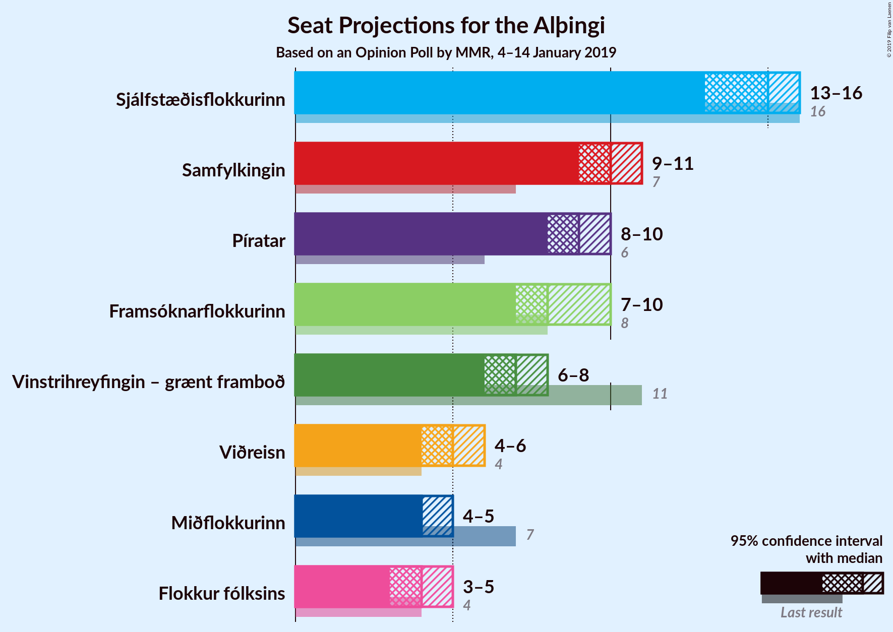

# Opinion Poll by MMR, 4–14 January 2019

<a href="#voting-intentions">Voting Intentions</a> | <a href="#seats">Seats</a> | <a href="#coalitions">Coalitions</a> | <a href="#technical-information">Technical Information</a>

## Voting Intentions

### Confidence Intervals

| Party | Last Result | Poll Result | 80% Confidence Interval | 90% Confidence Interval | 95% Confidence Interval | 99% Confidence Interval |
|:-----:|:-----------:|:-----------:|:-----------------------:|:-----------------------:|:-----------------------:|:-----------------------:|
| Sjálfstæðisflokkurinn | 25.2% | 22.2% | 21.1–23.4% |20.8–23.8% |20.5–24.1% |20.0–24.6% |
| Samfylkingin | 12.1% | 15.0% | 14.0–16.0% |13.7–16.3% |13.5–16.6% |13.1–17.1% |
| Píratar | 9.2% | 13.8% | 12.8–14.8% |12.6–15.1% |12.4–15.3% |11.9–15.8% |
| Framsóknarflokkurinn | 10.7% | 11.7% | 10.8–12.7% |10.6–12.9% |10.4–13.2% |10.0–13.6% |
| Vinstrihreyfingin – grænt framboð | 16.9% | 11.3% | 10.5–12.3% |10.2–12.5% |10.0–12.7% |9.6–13.2% |
| Viðreisn | 6.7% | 7.8% | 7.1–8.6% |6.9–8.9% |6.7–9.1% |6.4–9.4% |
| Miðflokkurinn | 10.9% | 6.9% | 6.2–7.7% |6.0–7.9% |5.9–8.1% |5.6–8.4% |
| Flokkur fólksins | 6.9% | 6.7% | 6.0–7.5% |5.9–7.7% |5.7–7.9% |5.4–8.2% |

*Note:* The poll result column reflects the actual value used in the calculations. Published results may vary slightly, and in addition be rounded to fewer digits.

## Seats

### Confidence Intervals

| Party | Last Result | Median | 80% Confidence Interval | 90% Confidence Interval | 95% Confidence Interval | 99% Confidence Interval |
|:-----:|:-----------:|:------:|:-----------------------:|:-----------------------:|:-----------------------:|:-----------------------:|
| <a href="#sjálfstæðisflokkurinn">Sjálfstæðisflokkurinn</a> | 16 | 15 | 14–16 |14–16 |13–16 |13–17 |
| <a href="#samfylkingin">Samfylkingin</a> | 7 | 10 | 9–11 |9–11 |9–11 |8–11 |
| <a href="#píratar">Píratar</a> | 6 | 9 | 8–10 |8–10 |8–10 |8–10 |
| <a href="#framsóknarflokkurinn">Framsóknarflokkurinn</a> | 8 | 8 | 8–9 |7–9 |7–10 |7–10 |
| <a href="#vinstrihreyfingin-–-grænt-framboð">Vinstrihreyfingin – grænt framboð</a> | 11 | 7 | 7–8 |6–8 |6–8 |6–9 |
| <a href="#viðreisn">Viðreisn</a> | 4 | 5 | 4–5 |4–6 |4–6 |4–6 |
| <a href="#miðflokkurinn">Miðflokkurinn</a> | 7 | 4 | 4–5 |4–5 |4–5 |3–5 |
| <a href="#flokkur-fólksins">Flokkur fólksins</a> | 4 | 4 | 4–5 |3–5 |3–5 |3–5 |

### Sjálfstæðisflokkurinn

*For a full overview of the results for this party, see the [Sjálfstæðisflokkurinn](party-sjálfstæðisflokkurinn.html) page.*

| Number of Seats | Probability | Accumulated | Special Marks |
|:---------------:|:-----------:|:-----------:|:-------------:|
| 13 | 3% | 100% |  |
| 14 | 32% | 97% |  |
| 15 | 44% | 66% | Median |
| 16 | 20% | 22% | Last Result |
| 17 | 1.3% | 1.4% |  |
| 18 | 0% | 0% |  |

### Samfylkingin

*For a full overview of the results for this party, see the [Samfylkingin](party-samfylkingin.html) page.*

| Number of Seats | Probability | Accumulated | Special Marks |
|:---------------:|:-----------:|:-----------:|:-------------:|
| 7 | 0% | 100% | Last Result |
| 8 | 0.9% | 100% |  |
| 9 | 16% | 99.1% |  |
| 10 | 73% | 83% | Median |
| 11 | 10% | 10% |  |
| 12 | 0.2% | 0.2% |  |
| 13 | 0% | 0% |  |

### Píratar

*For a full overview of the results for this party, see the [Píratar](party-píratar.html) page.*

| Number of Seats | Probability | Accumulated | Special Marks |
|:---------------:|:-----------:|:-----------:|:-------------:|
| 6 | 0% | 100% | Last Result |
| 7 | 0.3% | 100% |  |
| 8 | 20% | 99.7% |  |
| 9 | 62% | 79% | Median |
| 10 | 17% | 17% |  |
| 11 | 0.3% | 0.3% |  |
| 12 | 0% | 0% |  |

### Framsóknarflokkurinn

*For a full overview of the results for this party, see the [Framsóknarflokkurinn](party-framsóknarflokkurinn.html) page.*

| Number of Seats | Probability | Accumulated | Special Marks |
|:---------------:|:-----------:|:-----------:|:-------------:|
| 6 | 0.4% | 100% |  |
| 7 | 8% | 99.6% |  |
| 8 | 74% | 92% | Last Result, Median |
| 9 | 15% | 18% |  |
| 10 | 3% | 3% |  |
| 11 | 0% | 0% |  |

### Vinstrihreyfingin – grænt framboð

*For a full overview of the results for this party, see the [Vinstrihreyfingin – grænt framboð](party-vinstrihreyfingin–græntframboð.html) page.*

| Number of Seats | Probability | Accumulated | Special Marks |
|:---------------:|:-----------:|:-----------:|:-------------:|
| 6 | 6% | 100% |  |
| 7 | 53% | 94% | Median |
| 8 | 40% | 41% |  |
| 9 | 0.9% | 0.9% |  |
| 10 | 0% | 0% |  |
| 11 | 0% | 0% | Last Result |

### Viðreisn

*For a full overview of the results for this party, see the [Viðreisn](party-viðreisn.html) page.*

| Number of Seats | Probability | Accumulated | Special Marks |
|:---------------:|:-----------:|:-----------:|:-------------:|
| 4 | 20% | 100% | Last Result |
| 5 | 71% | 80% | Median |
| 6 | 8% | 9% |  |
| 7 | 0% | 0% |  |

### Miðflokkurinn

*For a full overview of the results for this party, see the [Miðflokkurinn](party-miðflokkurinn.html) page.*

| Number of Seats | Probability | Accumulated | Special Marks |
|:---------------:|:-----------:|:-----------:|:-------------:|
| 3 | 2% | 100% |  |
| 4 | 69% | 98% | Median |
| 5 | 28% | 28% |  |
| 6 | 0.2% | 0.2% |  |
| 7 | 0% | 0% | Last Result |

### Flokkur fólksins

*For a full overview of the results for this party, see the [Flokkur fólksins](party-flokkurfólksins.html) page.*

| Number of Seats | Probability | Accumulated | Special Marks |
|:---------------:|:-----------:|:-----------:|:-------------:|
| 3 | 5% | 100% |  |
| 4 | 80% | 95% | Last Result, Median |
| 5 | 15% | 15% |  |
| 6 | 0.1% | 0.1% |  |
| 7 | 0% | 0% |  |

## Coalitions

### Confidence Intervals

| Coalition | Last Result | Median | Majority? | 80% Confidence Interval | 90% Confidence Interval | 95% Confidence Interval | 99% Confidence Interval |
|:---------:|:-----------:|:------:|:---------:|:-----------------------:|:-----------------------:|:-----------------------:|:-----------------------:|
| Samfylkingin – Píratar – Vinstrihreyfingin – grænt framboð – Viðreisn | 28 | 31 | 41% | 30–32 | 29–33 | 29–33 | 28–33 |
| Sjálfstæðisflokkurinn – Framsóknarflokkurinn – Vinstrihreyfingin – grænt framboð | 35 | 30 | 7% | 29–31 | 29–32 | 29–32 | 28–33 |
| Samfylkingin – Framsóknarflokkurinn – Vinstrihreyfingin – grænt framboð – Miðflokkurinn | 33 | 30 | 2% | 29–31 | 28–31 | 28–31 | 27–32 |
| Sjálfstæðisflokkurinn – Framsóknarflokkurinn – Miðflokkurinn | 31 | 27 | 0% | 26–28 | 26–29 | 26–29 | 25–30 |
| Samfylkingin – Píratar – Vinstrihreyfingin – grænt framboð | 24 | 26 | 0% | 25–27 | 24–28 | 24–28 | 23–28 |
| Samfylkingin – Framsóknarflokkurinn – Vinstrihreyfingin – grænt framboð | 26 | 25 | 0% | 24–26 | 24–27 | 24–27 | 23–28 |
| Sjálfstæðisflokkurinn – Samfylkingin | 23 | 25 | 0% | 24–26 | 23–26 | 23–27 | 22–27 |
| Sjálfstæðisflokkurinn – Framsóknarflokkurinn | 24 | 23 | 0% | 22–24 | 22–24 | 22–25 | 21–25 |
| Sjálfstæðisflokkurinn – Vinstrihreyfingin – grænt framboð | 27 | 22 | 0% | 21–23 | 21–24 | 20–24 | 19–24 |
| Samfylkingin – Vinstrihreyfingin – grænt framboð – Miðflokkurinn | 25 | 22 | 0% | 21–22 | 20–23 | 19–23 | 19–24 |
| Framsóknarflokkurinn – Vinstrihreyfingin – grænt framboð – Miðflokkurinn | 26 | 20 | 0% | 19–21 | 18–21 | 18–22 | 17–22 |
| Sjálfstæðisflokkurinn – Miðflokkurinn | 23 | 19 | 0% | 18–20 | 18–20 | 18–21 | 17–21 |
| Sjálfstæðisflokkurinn – Viðreisn | 20 | 20 | 0% | 19–21 | 18–21 | 18–21 | 17–22 |
| Samfylkingin – Vinstrihreyfingin – grænt framboð | 18 | 17 | 0% | 16–18 | 16–18 | 16–18 | 15–19 |
| Píratar – Vinstrihreyfingin – grænt framboð | 17 | 16 | 0% | 15–17 | 15–18 | 14–18 | 14–18 |
| Framsóknarflokkurinn – Vinstrihreyfingin – grænt framboð | 19 | 15 | 0% | 15–17 | 14–17 | 14–17 | 14–17 |
| Vinstrihreyfingin – grænt framboð – Miðflokkurinn | 18 | 12 | 0% | 11–13 | 10–13 | 10–13 | 10–13 |

### Samfylkingin – Píratar – Vinstrihreyfingin – grænt framboð – Viðreisn

| Number of Seats | Probability | Accumulated | Special Marks |
|:---------------:|:-----------:|:-----------:|:-------------:|
| 27 | 0.3% | 100% |  |
| 28 | 2% | 99.7% | Last Result |
| 29 | 6% | 98% |  |
| 30 | 17% | 92% |  |
| 31 | 33% | 75% | Median |
| 32 | 34% | 41% | Majority |
| 33 | 7% | 7% |  |
| 34 | 0.4% | 0.4% |  |
| 35 | 0% | 0% |  |

### Sjálfstæðisflokkurinn – Framsóknarflokkurinn – Vinstrihreyfingin – grænt framboð

| Number of Seats | Probability | Accumulated | Special Marks |
|:---------------:|:-----------:|:-----------:|:-------------:|
| 27 | 0.1% | 100% |  |
| 28 | 2% | 99.9% |  |
| 29 | 15% | 98% |  |
| 30 | 37% | 83% | Median |
| 31 | 39% | 45% |  |
| 32 | 6% | 7% | Majority |
| 33 | 0.7% | 0.7% |  |
| 34 | 0% | 0% |  |
| 35 | 0% | 0% | Last Result |

### Samfylkingin – Framsóknarflokkurinn – Vinstrihreyfingin – grænt framboð – Miðflokkurinn

| Number of Seats | Probability | Accumulated | Special Marks |
|:---------------:|:-----------:|:-----------:|:-------------:|
| 26 | 0.2% | 100% |  |
| 27 | 2% | 99.8% |  |
| 28 | 7% | 98% |  |
| 29 | 30% | 91% | Median |
| 30 | 45% | 61% |  |
| 31 | 14% | 16% |  |
| 32 | 2% | 2% | Majority |
| 33 | 0.1% | 0.1% | Last Result |
| 34 | 0% | 0% |  |

### Sjálfstæðisflokkurinn – Framsóknarflokkurinn – Miðflokkurinn

| Number of Seats | Probability | Accumulated | Special Marks |
|:---------------:|:-----------:|:-----------:|:-------------:|
| 24 | 0.2% | 100% |  |
| 25 | 2% | 99.8% |  |
| 26 | 18% | 98% |  |
| 27 | 42% | 81% | Median |
| 28 | 32% | 39% |  |
| 29 | 6% | 7% |  |
| 30 | 0.5% | 0.5% |  |
| 31 | 0% | 0% | Last Result |

### Samfylkingin – Píratar – Vinstrihreyfingin – grænt framboð

| Number of Seats | Probability | Accumulated | Special Marks |
|:---------------:|:-----------:|:-----------:|:-------------:|
| 22 | 0.1% | 100% |  |
| 23 | 0.7% | 99.9% |  |
| 24 | 4% | 99.3% | Last Result |
| 25 | 16% | 95% |  |
| 26 | 34% | 79% | Median |
| 27 | 39% | 45% |  |
| 28 | 6% | 6% |  |
| 29 | 0.4% | 0.4% |  |
| 30 | 0% | 0% |  |

### Samfylkingin – Framsóknarflokkurinn – Vinstrihreyfingin – grænt framboð

| Number of Seats | Probability | Accumulated | Special Marks |
|:---------------:|:-----------:|:-----------:|:-------------:|
| 22 | 0.1% | 100% |  |
| 23 | 2% | 99.9% |  |
| 24 | 12% | 98% |  |
| 25 | 39% | 86% | Median |
| 26 | 39% | 47% | Last Result |
| 27 | 8% | 9% |  |
| 28 | 0.7% | 0.7% |  |
| 29 | 0% | 0% |  |

### Sjálfstæðisflokkurinn – Samfylkingin

| Number of Seats | Probability | Accumulated | Special Marks |
|:---------------:|:-----------:|:-----------:|:-------------:|
| 22 | 0.5% | 100% |  |
| 23 | 8% | 99.5% | Last Result |
| 24 | 28% | 91% |  |
| 25 | 42% | 64% | Median |
| 26 | 19% | 21% |  |
| 27 | 3% | 3% |  |
| 28 | 0.1% | 0.1% |  |
| 29 | 0% | 0% |  |

### Sjálfstæðisflokkurinn – Framsóknarflokkurinn

| Number of Seats | Probability | Accumulated | Special Marks |
|:---------------:|:-----------:|:-----------:|:-------------:|
| 20 | 0.2% | 100% |  |
| 21 | 2% | 99.8% |  |
| 22 | 25% | 98% |  |
| 23 | 49% | 73% | Median |
| 24 | 21% | 24% | Last Result |
| 25 | 3% | 3% |  |
| 26 | 0.1% | 0.1% |  |
| 27 | 0% | 0% |  |

### Sjálfstæðisflokkurinn – Vinstrihreyfingin – grænt framboð

| Number of Seats | Probability | Accumulated | Special Marks |
|:---------------:|:-----------:|:-----------:|:-------------:|
| 19 | 0.6% | 100% |  |
| 20 | 2% | 99.4% |  |
| 21 | 18% | 97% |  |
| 22 | 38% | 79% | Median |
| 23 | 35% | 41% |  |
| 24 | 5% | 6% |  |
| 25 | 0.2% | 0.2% |  |
| 26 | 0% | 0% |  |
| 27 | 0% | 0% | Last Result |

### Samfylkingin – Vinstrihreyfingin – grænt framboð – Miðflokkurinn

| Number of Seats | Probability | Accumulated | Special Marks |
|:---------------:|:-----------:|:-----------:|:-------------:|
| 18 | 0.2% | 100% |  |
| 19 | 3% | 99.8% |  |
| 20 | 6% | 97% |  |
| 21 | 34% | 91% | Median |
| 22 | 48% | 57% |  |
| 23 | 8% | 9% |  |
| 24 | 0.7% | 0.7% |  |
| 25 | 0% | 0% | Last Result |

### Framsóknarflokkurinn – Vinstrihreyfingin – grænt framboð – Miðflokkurinn

| Number of Seats | Probability | Accumulated | Special Marks |
|:---------------:|:-----------:|:-----------:|:-------------:|
| 17 | 0.5% | 100% |  |
| 18 | 6% | 99.5% |  |
| 19 | 33% | 93% | Median |
| 20 | 43% | 60% |  |
| 21 | 15% | 18% |  |
| 22 | 3% | 3% |  |
| 23 | 0% | 0% |  |
| 24 | 0% | 0% |  |
| 25 | 0% | 0% |  |
| 26 | 0% | 0% | Last Result |

### Sjálfstæðisflokkurinn – Miðflokkurinn

| Number of Seats | Probability | Accumulated | Special Marks |
|:---------------:|:-----------:|:-----------:|:-------------:|
| 16 | 0.2% | 100% |  |
| 17 | 2% | 99.8% |  |
| 18 | 24% | 98% |  |
| 19 | 39% | 74% | Median |
| 20 | 31% | 35% |  |
| 21 | 5% | 5% |  |
| 22 | 0.2% | 0.2% |  |
| 23 | 0% | 0% | Last Result |

### Sjálfstæðisflokkurinn – Viðreisn

| Number of Seats | Probability | Accumulated | Special Marks |
|:---------------:|:-----------:|:-----------:|:-------------:|
| 17 | 0.7% | 100% |  |
| 18 | 8% | 99.3% |  |
| 19 | 28% | 91% |  |
| 20 | 45% | 63% | Last Result, Median |
| 21 | 16% | 18% |  |
| 22 | 2% | 2% |  |
| 23 | 0.1% | 0.1% |  |
| 24 | 0% | 0% |  |

### Samfylkingin – Vinstrihreyfingin – grænt framboð

| Number of Seats | Probability | Accumulated | Special Marks |
|:---------------:|:-----------:|:-----------:|:-------------:|
| 14 | 0.1% | 100% |  |
| 15 | 2% | 99.9% |  |
| 16 | 11% | 98% |  |
| 17 | 45% | 87% | Median |
| 18 | 39% | 42% | Last Result |
| 19 | 2% | 2% |  |
| 20 | 0.1% | 0.1% |  |
| 21 | 0% | 0% |  |

### Píratar – Vinstrihreyfingin – grænt framboð

| Number of Seats | Probability | Accumulated | Special Marks |
|:---------------:|:-----------:|:-----------:|:-------------:|
| 13 | 0.1% | 100% |  |
| 14 | 3% | 99.9% |  |
| 15 | 13% | 97% |  |
| 16 | 39% | 84% | Median |
| 17 | 40% | 45% | Last Result |
| 18 | 5% | 5% |  |
| 19 | 0.2% | 0.2% |  |
| 20 | 0% | 0% |  |

### Framsóknarflokkurinn – Vinstrihreyfingin – grænt framboð

| Number of Seats | Probability | Accumulated | Special Marks |
|:---------------:|:-----------:|:-----------:|:-------------:|
| 13 | 0.3% | 100% |  |
| 14 | 8% | 99.7% |  |
| 15 | 46% | 92% | Median |
| 16 | 35% | 46% |  |
| 17 | 10% | 11% |  |
| 18 | 0.2% | 0.2% |  |
| 19 | 0% | 0% | Last Result |

### Vinstrihreyfingin – grænt framboð – Miðflokkurinn

| Number of Seats | Probability | Accumulated | Special Marks |
|:---------------:|:-----------:|:-----------:|:-------------:|
| 9 | 0.4% | 100% |  |
| 10 | 5% | 99.6% |  |
| 11 | 38% | 94% | Median |
| 12 | 46% | 57% |  |
| 13 | 11% | 11% |  |
| 14 | 0.2% | 0.2% |  |
| 15 | 0% | 0% |  |
| 16 | 0% | 0% |  |
| 17 | 0% | 0% |  |
| 18 | 0% | 0% | Last Result |

## Technical Information

### Opinion Poll

+ **Polling firm:** MMR
+ **Commissioner(s):** —
+ **Fieldwork period:** 4–14 January 2019

### Calculations

+ **Sample size:** 2061
+ **Simulations done:** 1,048,576
+ **Error estimate:** 1.39%

