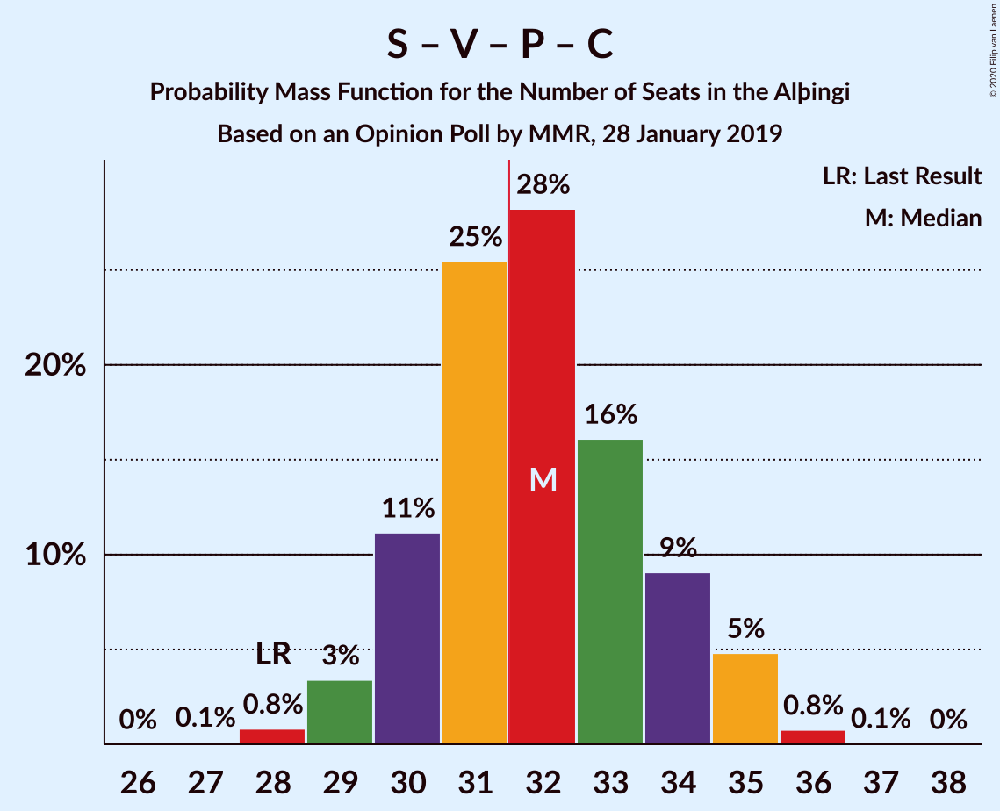
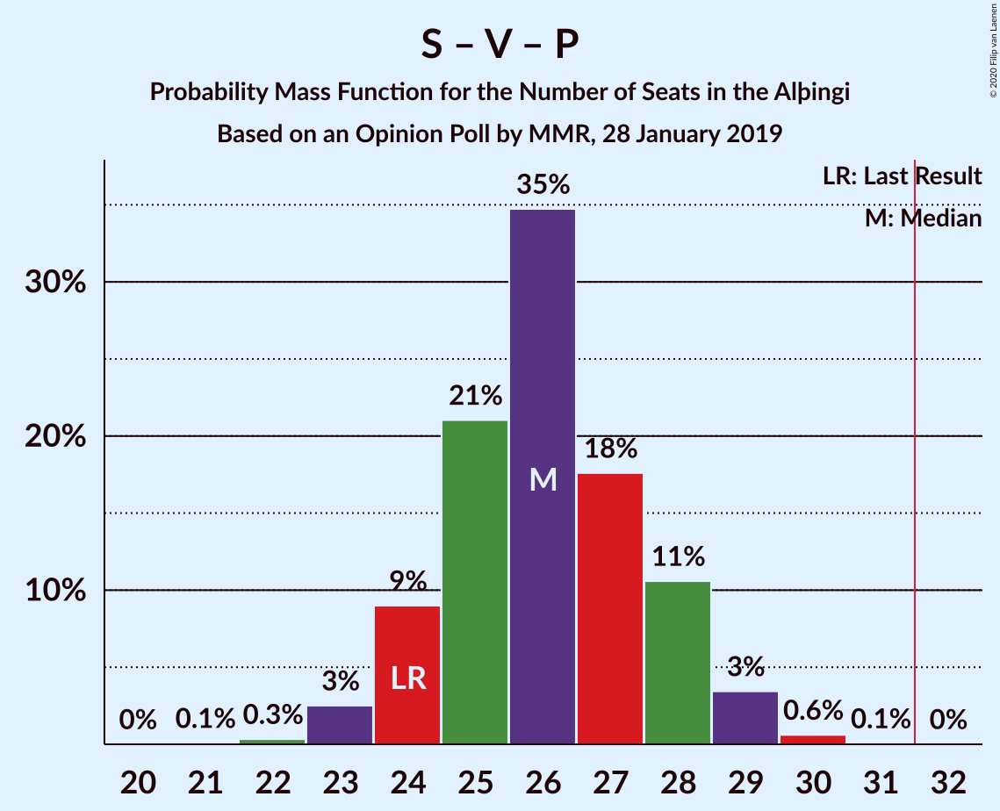

# Opinion Poll by MMR, 28 January 2019

<a href="#voting-intentions">Voting Intentions</a> | <a href="#seats">Seats</a> | <a href="#coalitions">Coalitions</a> | <a href="#technical-information">Technical Information</a>

## Voting Intentions

### Confidence Intervals

| Party | Last Result | Poll Result | 80% Confidence Interval | 90% Confidence Interval | 95% Confidence Interval | 99% Confidence Interval |
|:-----:|:-----------:|:-----------:|:-----------------------:|:-----------------------:|:-----------------------:|:-----------------------:|
| Sjálfstæðisflokkurinn | 25.2% | 21.8% | 20.1–23.6% |19.6–24.1% |19.2–24.6% |18.4–25.5% |
| Samfylkingin | 12.1% | 15.5% | 14.0–17.1% |13.6–17.6% |13.3–18.0% |12.6–18.8% |
| Framsóknarflokkurinn | 10.7% | 12.6% | 11.3–14.2% |10.9–14.6% |10.6–15.0% |10.0–15.7% |
| Vinstrihreyfingin – grænt framboð | 16.9% | 12.2% | 10.9–13.7% |10.5–14.1% |10.2–14.5% |9.6–15.2% |
| Píratar | 9.2% | 12.0% | 10.7–13.5% |10.3–13.9% |10.0–14.3% |9.4–15.0% |
| Viðreisn | 6.7% | 9.2% | 8.1–10.6% |7.8–11.0% |7.5–11.3% |7.0–12.0% |
| Miðflokkurinn | 10.9% | 8.2% | 7.2–9.5% |6.9–9.9% |6.6–10.2% |6.1–10.9% |
| Flokkur fólksins | 6.9% | 5.4% | 4.5–6.5% |4.3–6.8% |4.1–7.1% |3.7–7.6% |

*Note:* The poll result column reflects the actual value used in the calculations. Published results may vary slightly, and in addition be rounded to fewer digits.

## Seats

### Confidence Intervals

| Party | Last Result | Median | 80% Confidence Interval | 90% Confidence Interval | 95% Confidence Interval | 99% Confidence Interval |
|:-----:|:-----------:|:------:|:-----------------------:|:-----------------------:|:-----------------------:|:-----------------------:|
| <a href="#sjálfstæðisflokkurinn">Sjálfstæðisflokkurinn</a> | 16 | 14 | 13–16 |13–16 |13–17 |12–18 |
| <a href="#samfylkingin">Samfylkingin</a> | 7 | 10 | 9–11 |9–12 |9–12 |8–13 |
| <a href="#framsóknarflokkurinn">Framsóknarflokkurinn</a> | 8 | 9 | 8–10 |8–11 |7–11 |6–11 |
| <a href="#vinstrihreyfingin-–-grænt-framboð">Vinstrihreyfingin – grænt framboð</a> | 11 | 8 | 7–9 |7–10 |6–10 |6–10 |
| <a href="#píratar">Píratar</a> | 6 | 8 | 7–9 |7–9 |6–9 |6–10 |
| <a href="#viðreisn">Viðreisn</a> | 4 | 6 | 5–7 |5–7 |5–7 |4–8 |
| <a href="#miðflokkurinn">Miðflokkurinn</a> | 7 | 5 | 4–6 |4–6 |4–7 |4–7 |
| <a href="#flokkur-fólksins">Flokkur fólksins</a> | 4 | 3 | 0–4 |0–4 |0–4 |0–5 |

### Sjálfstæðisflokkurinn

*For a full overview of the results for this party, see the [Sjálfstæðisflokkurinn](party-sjálfstæðisflokkurinn.html) page.*

| Number of Seats | Probability | Accumulated | Special Marks |
|:---------------:|:-----------:|:-----------:|:-------------:|
| 11 | 0.1% | 100% |  |
| 12 | 1.4% | 99.9% |  |
| 13 | 19% | 98.6% |  |
| 14 | 30% | 79% | Median |
| 15 | 33% | 50% |  |
| 16 | 12% | 17% | Last Result |
| 17 | 4% | 5% |  |
| 18 | 1.0% | 1.1% |  |
| 19 | 0.1% | 0.1% |  |
| 20 | 0% | 0% |  |

### Samfylkingin

*For a full overview of the results for this party, see the [Samfylkingin](party-samfylkingin.html) page.*

| Number of Seats | Probability | Accumulated | Special Marks |
|:---------------:|:-----------:|:-----------:|:-------------:|
| 7 | 0.1% | 100% | Last Result |
| 8 | 2% | 99.9% |  |
| 9 | 15% | 98% |  |
| 10 | 47% | 82% | Median |
| 11 | 28% | 35% |  |
| 12 | 6% | 7% |  |
| 13 | 0.9% | 1.0% |  |
| 14 | 0.1% | 0.1% |  |
| 15 | 0% | 0% |  |

### Framsóknarflokkurinn

*For a full overview of the results for this party, see the [Framsóknarflokkurinn](party-framsóknarflokkurinn.html) page.*

| Number of Seats | Probability | Accumulated | Special Marks |
|:---------------:|:-----------:|:-----------:|:-------------:|
| 6 | 0.5% | 100% |  |
| 7 | 4% | 99.5% |  |
| 8 | 39% | 96% | Last Result |
| 9 | 23% | 56% | Median |
| 10 | 28% | 33% |  |
| 11 | 5% | 6% |  |
| 12 | 0.1% | 0.1% |  |
| 13 | 0% | 0% |  |

### Vinstrihreyfingin – grænt framboð

*For a full overview of the results for this party, see the [Vinstrihreyfingin – grænt framboð](party-vinstrihreyfingin–græntframboð.html) page.*

| Number of Seats | Probability | Accumulated | Special Marks |
|:---------------:|:-----------:|:-----------:|:-------------:|
| 5 | 0.1% | 100% |  |
| 6 | 3% | 99.9% |  |
| 7 | 26% | 97% |  |
| 8 | 46% | 71% | Median |
| 9 | 18% | 25% |  |
| 10 | 8% | 8% |  |
| 11 | 0.1% | 0.1% | Last Result |
| 12 | 0% | 0% |  |

### Píratar

*For a full overview of the results for this party, see the [Píratar](party-píratar.html) page.*

| Number of Seats | Probability | Accumulated | Special Marks |
|:---------------:|:-----------:|:-----------:|:-------------:|
| 5 | 0.2% | 100% |  |
| 6 | 4% | 99.8% | Last Result |
| 7 | 30% | 95% |  |
| 8 | 49% | 66% | Median |
| 9 | 14% | 16% |  |
| 10 | 2% | 2% |  |
| 11 | 0% | 0% |  |

### Viðreisn

*For a full overview of the results for this party, see the [Viðreisn](party-viðreisn.html) page.*

| Number of Seats | Probability | Accumulated | Special Marks |
|:---------------:|:-----------:|:-----------:|:-------------:|
| 4 | 1.4% | 100% | Last Result |
| 5 | 29% | 98.6% |  |
| 6 | 52% | 70% | Median |
| 7 | 16% | 17% |  |
| 8 | 1.1% | 1.1% |  |
| 9 | 0% | 0% |  |

### Miðflokkurinn

*For a full overview of the results for this party, see the [Miðflokkurinn](party-miðflokkurinn.html) page.*

| Number of Seats | Probability | Accumulated | Special Marks |
|:---------------:|:-----------:|:-----------:|:-------------:|
| 3 | 0.1% | 100% |  |
| 4 | 14% | 99.9% |  |
| 5 | 56% | 86% | Median |
| 6 | 27% | 30% |  |
| 7 | 3% | 3% | Last Result |
| 8 | 0.1% | 0.2% |  |
| 9 | 0% | 0% |  |

### Flokkur fólksins

*For a full overview of the results for this party, see the [Flokkur fólksins](party-flokkurfólksins.html) page.*

| Number of Seats | Probability | Accumulated | Special Marks |
|:---------------:|:-----------:|:-----------:|:-------------:|
| 0 | 26% | 100% |  |
| 1 | 0% | 74% |  |
| 2 | 0% | 74% |  |
| 3 | 47% | 74% | Median |
| 4 | 26% | 27% | Last Result |
| 5 | 1.0% | 1.0% |  |
| 6 | 0% | 0% |  |

## Coalitions

### Confidence Intervals

| Coalition | Last Result | Median | Majority? | 80% Confidence Interval | 90% Confidence Interval | 95% Confidence Interval | 99% Confidence Interval |
|:---------:|:-----------:|:------:|:---------:|:-----------------------:|:-----------------------:|:-----------------------:|:-----------------------:|
| Samfylkingin – Framsóknarflokkurinn – Vinstrihreyfingin – grænt framboð – Miðflokkurinn | 33 | 32 | 72% | 31–34 | 30–35 | 30–35 | 29–36 |
| Samfylkingin – Vinstrihreyfingin – grænt framboð – Píratar – Viðreisn | 28 | 32 | 59% | 30–34 | 30–35 | 29–35 | 28–36 |
| Sjálfstæðisflokkurinn – Framsóknarflokkurinn – Vinstrihreyfingin – grænt framboð | 35 | 31 | 43% | 30–33 | 29–34 | 29–34 | 28–35 |
| Sjálfstæðisflokkurinn – Framsóknarflokkurinn – Miðflokkurinn | 31 | 28 | 3% | 27–31 | 27–31 | 26–32 | 25–32 |
| Samfylkingin – Framsóknarflokkurinn – Vinstrihreyfingin – grænt framboð | 26 | 27 | 0% | 25–29 | 25–29 | 24–30 | 24–31 |
| Samfylkingin – Vinstrihreyfingin – grænt framboð – Píratar | 24 | 26 | 0% | 24–28 | 24–28 | 23–29 | 23–30 |
| Sjálfstæðisflokkurinn – Samfylkingin | 23 | 25 | 0% | 23–27 | 23–27 | 22–27 | 21–29 |
| Sjálfstæðisflokkurinn – Framsóknarflokkurinn | 24 | 23 | 0% | 22–25 | 21–26 | 21–26 | 20–27 |
| Samfylkingin – Vinstrihreyfingin – grænt framboð – Miðflokkurinn | 25 | 23 | 0% | 22–25 | 21–26 | 21–26 | 20–27 |
| Framsóknarflokkurinn – Vinstrihreyfingin – grænt framboð – Miðflokkurinn | 26 | 22 | 0% | 20–24 | 20–24 | 20–25 | 19–26 |
| Sjálfstæðisflokkurinn – Vinstrihreyfingin – grænt framboð | 27 | 22 | 0% | 21–24 | 20–25 | 20–25 | 19–26 |
| Sjálfstæðisflokkurinn – Viðreisn | 20 | 20 | 0% | 19–22 | 18–23 | 18–23 | 17–24 |
| Sjálfstæðisflokkurinn – Miðflokkurinn | 23 | 20 | 0% | 18–21 | 18–22 | 17–22 | 17–23 |
| Samfylkingin – Vinstrihreyfingin – grænt framboð | 18 | 18 | 0% | 17–20 | 16–20 | 16–21 | 15–22 |
| Framsóknarflokkurinn – Vinstrihreyfingin – grænt framboð | 19 | 17 | 0% | 15–18 | 15–19 | 15–19 | 14–20 |
| Vinstrihreyfingin – grænt framboð – Píratar | 17 | 16 | 0% | 14–17 | 14–18 | 14–18 | 13–19 |
| Vinstrihreyfingin – grænt framboð – Miðflokkurinn | 18 | 13 | 0% | 12–15 | 12–15 | 11–16 | 10–16 |

### Samfylkingin – Framsóknarflokkurinn – Vinstrihreyfingin – grænt framboð – Miðflokkurinn

| Number of Seats | Probability | Accumulated | Special Marks |
|:---------------:|:-----------:|:-----------:|:-------------:|
| 27 | 0.1% | 100% |  |
| 28 | 0.4% | 99.9% |  |
| 29 | 2% | 99.6% |  |
| 30 | 7% | 98% |  |
| 31 | 19% | 91% |  |
| 32 | 29% | 72% | Median, Majority |
| 33 | 22% | 43% | Last Result |
| 34 | 14% | 21% |  |
| 35 | 5% | 7% |  |
| 36 | 2% | 2% |  |
| 37 | 0.2% | 0.2% |  |
| 38 | 0% | 0% |  |

### Samfylkingin – Vinstrihreyfingin – grænt framboð – Píratar – Viðreisn

| Number of Seats | Probability | Accumulated | Special Marks |
|:---------------:|:-----------:|:-----------:|:-------------:|
| 27 | 0.1% | 100% |  |
| 28 | 0.8% | 99.9% | Last Result |
| 29 | 3% | 99.1% |  |
| 30 | 11% | 96% |  |
| 31 | 25% | 84% |  |
| 32 | 28% | 59% | Median, Majority |
| 33 | 16% | 31% |  |
| 34 | 9% | 15% |  |
| 35 | 5% | 6% |  |
| 36 | 0.8% | 0.8% |  |
| 37 | 0.1% | 0.1% |  |
| 38 | 0% | 0% |  |

### Sjálfstæðisflokkurinn – Framsóknarflokkurinn – Vinstrihreyfingin – grænt framboð

| Number of Seats | Probability | Accumulated | Special Marks |
|:---------------:|:-----------:|:-----------:|:-------------:|
| 27 | 0.1% | 100% |  |
| 28 | 1.1% | 99.9% |  |
| 29 | 4% | 98.8% |  |
| 30 | 19% | 95% |  |
| 31 | 33% | 76% | Median |
| 32 | 24% | 43% | Majority |
| 33 | 12% | 19% |  |
| 34 | 5% | 7% |  |
| 35 | 2% | 2% | Last Result |
| 36 | 0.2% | 0.3% |  |
| 37 | 0% | 0% |  |

### Sjálfstæðisflokkurinn – Framsóknarflokkurinn – Miðflokkurinn

| Number of Seats | Probability | Accumulated | Special Marks |
|:---------------:|:-----------:|:-----------:|:-------------:|
| 24 | 0.1% | 100% |  |
| 25 | 0.8% | 99.9% |  |
| 26 | 3% | 99.1% |  |
| 27 | 17% | 96% |  |
| 28 | 31% | 79% | Median |
| 29 | 26% | 48% |  |
| 30 | 12% | 22% |  |
| 31 | 7% | 10% | Last Result |
| 32 | 3% | 3% | Majority |
| 33 | 0.3% | 0.4% |  |
| 34 | 0% | 0% |  |

### Samfylkingin – Framsóknarflokkurinn – Vinstrihreyfingin – grænt framboð

| Number of Seats | Probability | Accumulated | Special Marks |
|:---------------:|:-----------:|:-----------:|:-------------:|
| 23 | 0.4% | 100% |  |
| 24 | 3% | 99.6% |  |
| 25 | 8% | 97% |  |
| 26 | 22% | 89% | Last Result |
| 27 | 27% | 67% | Median |
| 28 | 23% | 40% |  |
| 29 | 11% | 16% |  |
| 30 | 4% | 5% |  |
| 31 | 0.7% | 0.7% |  |
| 32 | 0% | 0% | Majority |

### Samfylkingin – Vinstrihreyfingin – grænt framboð – Píratar

| Number of Seats | Probability | Accumulated | Special Marks |
|:---------------:|:-----------:|:-----------:|:-------------:|
| 21 | 0.1% | 100% |  |
| 22 | 0.3% | 99.9% |  |
| 23 | 3% | 99.6% |  |
| 24 | 9% | 97% | Last Result |
| 25 | 21% | 88% |  |
| 26 | 35% | 67% | Median |
| 27 | 18% | 32% |  |
| 28 | 11% | 15% |  |
| 29 | 3% | 4% |  |
| 30 | 0.6% | 0.7% |  |
| 31 | 0.1% | 0.1% |  |
| 32 | 0% | 0% | Majority |

### Sjálfstæðisflokkurinn – Samfylkingin

| Number of Seats | Probability | Accumulated | Special Marks |
|:---------------:|:-----------:|:-----------:|:-------------:|
| 21 | 0.5% | 100% |  |
| 22 | 3% | 99.4% |  |
| 23 | 17% | 96% | Last Result |
| 24 | 22% | 79% | Median |
| 25 | 30% | 57% |  |
| 26 | 15% | 27% |  |
| 27 | 9% | 11% |  |
| 28 | 2% | 2% |  |
| 29 | 0.5% | 0.6% |  |
| 30 | 0% | 0.1% |  |
| 31 | 0% | 0% |  |

### Sjálfstæðisflokkurinn – Framsóknarflokkurinn

| Number of Seats | Probability | Accumulated | Special Marks |
|:---------------:|:-----------:|:-----------:|:-------------:|
| 19 | 0.1% | 100% |  |
| 20 | 0.6% | 99.9% |  |
| 21 | 4% | 99.3% |  |
| 22 | 15% | 95% |  |
| 23 | 39% | 80% | Median |
| 24 | 24% | 41% | Last Result |
| 25 | 10% | 17% |  |
| 26 | 6% | 7% |  |
| 27 | 0.8% | 1.0% |  |
| 28 | 0.1% | 0.2% |  |
| 29 | 0.1% | 0.1% |  |
| 30 | 0% | 0% |  |

### Samfylkingin – Vinstrihreyfingin – grænt framboð – Miðflokkurinn

| Number of Seats | Probability | Accumulated | Special Marks |
|:---------------:|:-----------:|:-----------:|:-------------:|
| 19 | 0.2% | 100% |  |
| 20 | 0.9% | 99.8% |  |
| 21 | 4% | 99.0% |  |
| 22 | 18% | 95% |  |
| 23 | 32% | 76% | Median |
| 24 | 24% | 44% |  |
| 25 | 14% | 20% | Last Result |
| 26 | 5% | 7% |  |
| 27 | 1.2% | 2% |  |
| 28 | 0.3% | 0.3% |  |
| 29 | 0% | 0% |  |

### Framsóknarflokkurinn – Vinstrihreyfingin – grænt framboð – Miðflokkurinn

| Number of Seats | Probability | Accumulated | Special Marks |
|:---------------:|:-----------:|:-----------:|:-------------:|
| 18 | 0.1% | 100% |  |
| 19 | 2% | 99.8% |  |
| 20 | 9% | 98% |  |
| 21 | 24% | 89% |  |
| 22 | 29% | 66% | Median |
| 23 | 22% | 37% |  |
| 24 | 12% | 15% |  |
| 25 | 3% | 3% |  |
| 26 | 0.6% | 0.7% | Last Result |
| 27 | 0% | 0% |  |

### Sjálfstæðisflokkurinn – Vinstrihreyfingin – grænt framboð

| Number of Seats | Probability | Accumulated | Special Marks |
|:---------------:|:-----------:|:-----------:|:-------------:|
| 18 | 0.1% | 100% |  |
| 19 | 0.6% | 99.9% |  |
| 20 | 5% | 99.3% |  |
| 21 | 18% | 94% |  |
| 22 | 27% | 76% | Median |
| 23 | 26% | 49% |  |
| 24 | 16% | 23% |  |
| 25 | 6% | 8% |  |
| 26 | 2% | 2% |  |
| 27 | 0.3% | 0.3% | Last Result |
| 28 | 0% | 0% |  |

### Sjálfstæðisflokkurinn – Viðreisn

| Number of Seats | Probability | Accumulated | Special Marks |
|:---------------:|:-----------:|:-----------:|:-------------:|
| 17 | 0.6% | 100% |  |
| 18 | 6% | 99.4% |  |
| 19 | 19% | 94% |  |
| 20 | 31% | 75% | Last Result, Median |
| 21 | 27% | 44% |  |
| 22 | 12% | 17% |  |
| 23 | 4% | 5% |  |
| 24 | 1.1% | 1.3% |  |
| 25 | 0.2% | 0.2% |  |
| 26 | 0% | 0% |  |

### Sjálfstæðisflokkurinn – Miðflokkurinn

| Number of Seats | Probability | Accumulated | Special Marks |
|:---------------:|:-----------:|:-----------:|:-------------:|
| 16 | 0.1% | 100% |  |
| 17 | 4% | 99.9% |  |
| 18 | 16% | 95% |  |
| 19 | 21% | 79% | Median |
| 20 | 33% | 58% |  |
| 21 | 17% | 25% |  |
| 22 | 6% | 8% |  |
| 23 | 2% | 2% | Last Result |
| 24 | 0.2% | 0.2% |  |
| 25 | 0% | 0% |  |

### Samfylkingin – Vinstrihreyfingin – grænt framboð

| Number of Seats | Probability | Accumulated | Special Marks |
|:---------------:|:-----------:|:-----------:|:-------------:|
| 15 | 0.9% | 100% |  |
| 16 | 6% | 99.1% |  |
| 17 | 21% | 93% |  |
| 18 | 32% | 72% | Last Result, Median |
| 19 | 26% | 40% |  |
| 20 | 10% | 14% |  |
| 21 | 3% | 4% |  |
| 22 | 0.6% | 0.6% |  |
| 23 | 0% | 0% |  |

### Framsóknarflokkurinn – Vinstrihreyfingin – grænt framboð

| Number of Seats | Probability | Accumulated | Special Marks |
|:---------------:|:-----------:|:-----------:|:-------------:|
| 13 | 0.1% | 100% |  |
| 14 | 2% | 99.9% |  |
| 15 | 10% | 98% |  |
| 16 | 28% | 88% |  |
| 17 | 25% | 60% | Median |
| 18 | 25% | 35% |  |
| 19 | 8% | 10% | Last Result |
| 20 | 1.1% | 1.2% |  |
| 21 | 0.1% | 0.1% |  |
| 22 | 0% | 0% |  |

### Vinstrihreyfingin – grænt framboð – Píratar

| Number of Seats | Probability | Accumulated | Special Marks |
|:---------------:|:-----------:|:-----------:|:-------------:|
| 12 | 0.2% | 100% |  |
| 13 | 1.3% | 99.8% |  |
| 14 | 10% | 98% |  |
| 15 | 27% | 88% |  |
| 16 | 38% | 61% | Median |
| 17 | 15% | 24% | Last Result |
| 18 | 7% | 8% |  |
| 19 | 0.9% | 0.9% |  |
| 20 | 0.1% | 0.1% |  |
| 21 | 0% | 0% |  |

### Vinstrihreyfingin – grænt framboð – Miðflokkurinn

| Number of Seats | Probability | Accumulated | Special Marks |
|:---------------:|:-----------:|:-----------:|:-------------:|
| 10 | 0.5% | 100% |  |
| 11 | 4% | 99.5% |  |
| 12 | 24% | 96% |  |
| 13 | 33% | 72% | Median |
| 14 | 27% | 39% |  |
| 15 | 9% | 12% |  |
| 16 | 3% | 3% |  |
| 17 | 0.2% | 0.2% |  |
| 18 | 0% | 0% | Last Result |

## Technical Information

### Opinion Poll

+ **Polling firm:** MMR
+ **Commissioner(s):** —
+ **Fieldwork period:** 28 January 2019

### Calculations

+ **Sample size:** 910
+ **Simulations done:** 1,048,576
+ **Error estimate:** 1.19%

