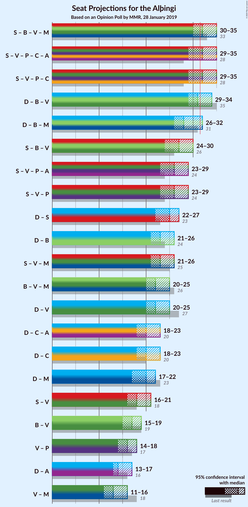
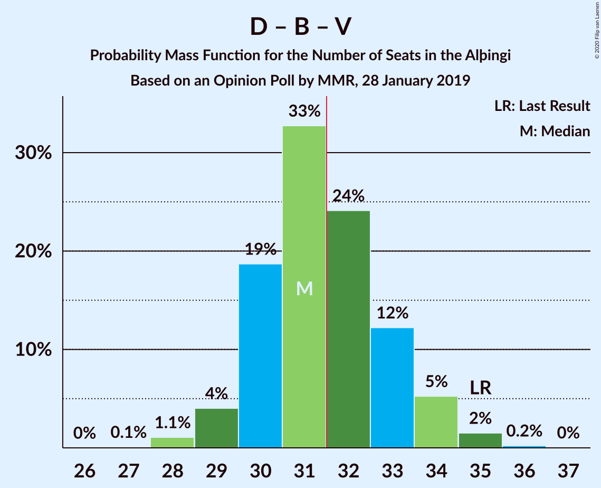

# Opinion Poll by MMR, 28 January 2019

<a href="#voting-intentions">Voting Intentions</a> | <a href="#seats">Seats</a> | <a href="#coalitions">Coalitions</a> | <a href="#technical-information">Technical Information</a>

## Voting Intentions

### Confidence Intervals

| Party | Last Result | Poll Result | 80% Confidence Interval | 90% Confidence Interval | 95% Confidence Interval | 99% Confidence Interval |
|:-----:|:-----------:|:-----------:|:-----------------------:|:-----------------------:|:-----------------------:|:-----------------------:|
| Sjálfstæðisflokkurinn | 25.2% | 21.8% | 20.1–23.6% |19.6–24.1% |19.2–24.6% |18.4–25.5% |
| Samfylkingin | 12.1% | 15.5% | 14.0–17.1% |13.6–17.6% |13.3–18.0% |12.6–18.8% |
| Framsóknarflokkurinn | 10.7% | 12.6% | 11.3–14.2% |10.9–14.6% |10.6–15.0% |10.0–15.7% |
| Vinstrihreyfingin – grænt framboð | 16.9% | 12.2% | 10.9–13.7% |10.5–14.1% |10.2–14.5% |9.6–15.2% |
| Píratar | 9.2% | 12.0% | 10.7–13.5% |10.3–13.9% |10.0–14.3% |9.4–15.0% |
| Viðreisn | 6.7% | 9.2% | 8.1–10.6% |7.8–11.0% |7.5–11.3% |7.0–12.0% |
| Miðflokkurinn | 10.9% | 8.2% | 7.2–9.5% |6.9–9.9% |6.6–10.2% |6.1–10.9% |
| Flokkur fólksins | 6.9% | 5.4% | 4.5–6.5% |4.3–6.8% |4.1–7.1% |3.7–7.6% |

*Note:* The poll result column reflects the actual value used in the calculations. Published results may vary slightly, and in addition be rounded to fewer digits.

## Seats

### Confidence Intervals

| Party | Last Result | Median | 80% Confidence Interval | 90% Confidence Interval | 95% Confidence Interval | 99% Confidence Interval |
|:-----:|:-----------:|:------:|:-----------------------:|:-----------------------:|:-----------------------:|:-----------------------:|
| <a href="#sjálfstæðisflokkurinn">Sjálfstæðisflokkurinn</a> | 16 | 13 | 13–14 |13–14 |13–15 |13–16 |
| <a href="#samfylkingin">Samfylkingin</a> | 7 | 10 | 9–10 |9–10 |9–10 |8–10 |
| <a href="#framsóknarflokkurinn">Framsóknarflokkurinn</a> | 8 | 7 | 7–9 |7–9 |7–9 |7–11 |
| <a href="#vinstrihreyfingin-–-grænt-framboð">Vinstrihreyfingin – grænt framboð</a> | 11 | 9 | 9–10 |9–11 |7–11 |7–11 |
| <a href="#píratar">Píratar</a> | 6 | 9 | 8–9 |8–9 |7–9 |7–9 |
| <a href="#viðreisn">Viðreisn</a> | 4 | 6 | 6–7 |6–7 |6–7 |6–7 |
| <a href="#miðflokkurinn">Miðflokkurinn</a> | 7 | 5 | 4–5 |4–6 |4–6 |4–6 |
| <a href="#flokkur-fólksins">Flokkur fólksins</a> | 4 | 4 | 4 |0–4 |0–5 |0–5 |

### Sjálfstæðisflokkurinn

*For a full overview of the results for this party, see the [Sjálfstæðisflokkurinn](party-sjálfstæðisflokkurinn.html) page.*

| Number of Seats | Probability | Accumulated | Special Marks |
|:---------------:|:-----------:|:-----------:|:-------------:|
| 12 | 0% | 100% |  |
| 13 | 85% | 99.9% | Median |
| 14 | 10% | 15% |  |
| 15 | 4% | 5% |  |
| 16 | 0.6% | 0.8% | Last Result |
| 17 | 0% | 0.3% |  |
| 18 | 0.3% | 0.3% |  |
| 19 | 0% | 0% |  |

### Samfylkingin

*For a full overview of the results for this party, see the [Samfylkingin](party-samfylkingin.html) page.*

| Number of Seats | Probability | Accumulated | Special Marks |
|:---------------:|:-----------:|:-----------:|:-------------:|
| 7 | 0% | 100% | Last Result |
| 8 | 0.5% | 100% |  |
| 9 | 10% | 99.5% |  |
| 10 | 89% | 89% | Median |
| 11 | 0.2% | 0.4% |  |
| 12 | 0.1% | 0.2% |  |
| 13 | 0.2% | 0.2% |  |
| 14 | 0% | 0% |  |

### Framsóknarflokkurinn

*For a full overview of the results for this party, see the [Framsóknarflokkurinn](party-framsóknarflokkurinn.html) page.*

| Number of Seats | Probability | Accumulated | Special Marks |
|:---------------:|:-----------:|:-----------:|:-------------:|
| 6 | 0.4% | 100% |  |
| 7 | 86% | 99.6% | Median |
| 8 | 0.5% | 13% | Last Result |
| 9 | 12% | 13% |  |
| 10 | 0.2% | 0.7% |  |
| 11 | 0.5% | 0.5% |  |
| 12 | 0% | 0% |  |

### Vinstrihreyfingin – grænt framboð

*For a full overview of the results for this party, see the [Vinstrihreyfingin – grænt framboð](party-vinstrihreyfingin–græntframboð.html) page.*

| Number of Seats | Probability | Accumulated | Special Marks |
|:---------------:|:-----------:|:-----------:|:-------------:|
| 6 | 0.1% | 100% |  |
| 7 | 4% | 99.9% |  |
| 8 | 0.5% | 96% |  |
| 9 | 77% | 95% | Median |
| 10 | 10% | 18% |  |
| 11 | 9% | 9% | Last Result |
| 12 | 0% | 0% |  |

### Píratar

*For a full overview of the results for this party, see the [Píratar](party-píratar.html) page.*

| Number of Seats | Probability | Accumulated | Special Marks |
|:---------------:|:-----------:|:-----------:|:-------------:|
| 6 | 0% | 100% | Last Result |
| 7 | 4% | 99.9% |  |
| 8 | 19% | 96% |  |
| 9 | 77% | 77% | Median |
| 10 | 0.2% | 0.2% |  |
| 11 | 0% | 0% |  |

### Viðreisn

*For a full overview of the results for this party, see the [Viðreisn](party-viðreisn.html) page.*

| Number of Seats | Probability | Accumulated | Special Marks |
|:---------------:|:-----------:|:-----------:|:-------------:|
| 4 | 0% | 100% | Last Result |
| 5 | 0.2% | 100% |  |
| 6 | 89% | 99.8% | Median |
| 7 | 10% | 10% |  |
| 8 | 0.4% | 0.4% |  |
| 9 | 0% | 0% |  |

### Miðflokkurinn

*For a full overview of the results for this party, see the [Miðflokkurinn](party-miðflokkurinn.html) page.*

| Number of Seats | Probability | Accumulated | Special Marks |
|:---------------:|:-----------:|:-----------:|:-------------:|
| 4 | 13% | 100% |  |
| 5 | 77% | 87% | Median |
| 6 | 9% | 9% |  |
| 7 | 0.1% | 0.1% | Last Result |
| 8 | 0% | 0% |  |

### Flokkur fólksins

*For a full overview of the results for this party, see the [Flokkur fólksins](party-flokkurfólksins.html) page.*

| Number of Seats | Probability | Accumulated | Special Marks |
|:---------------:|:-----------:|:-----------:|:-------------:|
| 0 | 10% | 100% |  |
| 1 | 0% | 90% |  |
| 2 | 0% | 90% |  |
| 3 | 0.5% | 90% |  |
| 4 | 87% | 90% | Last Result, Median |
| 5 | 3% | 3% |  |
| 6 | 0% | 0% |  |

## Coalitions

### Confidence Intervals

| Coalition | Last Result | Median | Majority? | 80% Confidence Interval | 90% Confidence Interval | 95% Confidence Interval | 99% Confidence Interval |
|:---------:|:-----------:|:------:|:---------:|:-----------------------:|:-----------------------:|:-----------------------:|:-----------------------:|
| Samfylkingin – Framsóknarflokkurinn – Vinstrihreyfingin – grænt framboð – Miðflokkurinn | 33 | 31 | 10% | 30–31 | 30–36 | 30–36 | 29–36 |
| Samfylkingin – Vinstrihreyfingin – grænt framboð – Píratar – Viðreisn | 28 | 34 | 96% | 34 | 34–35 | 30–35 | 30–35 |
| Sjálfstæðisflokkurinn – Framsóknarflokkurinn – Vinstrihreyfingin – grænt framboð | 35 | 29 | 10% | 29–31 | 29–33 | 29–33 | 29–33 |
| Samfylkingin – Framsóknarflokkurinn – Vinstrihreyfingin – grænt framboð | 26 | 26 | 0% | 26 | 26–30 | 26–30 | 25–30 |
| Samfylkingin – Vinstrihreyfingin – grænt framboð – Píratar | 24 | 28 | 0% | 27–28 | 27–29 | 24–29 | 24–29 |
| Sjálfstæðisflokkurinn – Framsóknarflokkurinn – Miðflokkurinn | 31 | 25 | 0.5% | 25–28 | 25–28 | 25–28 | 25–31 |
| Samfylkingin – Vinstrihreyfingin – grænt framboð – Miðflokkurinn | 25 | 24 | 0% | 23–24 | 23–27 | 21–27 | 21–27 |
| Framsóknarflokkurinn – Vinstrihreyfingin – grænt framboð – Miðflokkurinn | 26 | 21 | 0% | 21 | 21–26 | 20–26 | 20–26 |
| Sjálfstæðisflokkurinn – Samfylkingin | 23 | 23 | 0% | 23 | 23 | 23–25 | 23–26 |
| Sjálfstæðisflokkurinn – Vinstrihreyfingin – grænt framboð | 27 | 22 | 0% | 22–24 | 22–24 | 22–24 | 22–25 |
| Sjálfstæðisflokkurinn – Framsóknarflokkurinn | 24 | 20 | 0% | 20–22 | 20–22 | 20–24 | 20–25 |
| Sjálfstæðisflokkurinn – Viðreisn | 20 | 19 | 0% | 19–21 | 19–21 | 19–21 | 19–23 |
| Samfylkingin – Vinstrihreyfingin – grænt framboð | 18 | 19 | 0% | 19 | 19–21 | 17–21 | 16–21 |
| Framsóknarflokkurinn – Vinstrihreyfingin – grænt framboð | 19 | 16 | 0% | 16–17 | 16–20 | 16–20 | 15–20 |
| Sjálfstæðisflokkurinn – Miðflokkurinn | 23 | 18 | 0% | 18–19 | 18–19 | 18–19 | 18–22 |
| Vinstrihreyfingin – grænt framboð – Píratar | 17 | 18 | 0% | 18 | 18–19 | 14–19 | 14–19 |
| Vinstrihreyfingin – grænt framboð – Miðflokkurinn | 18 | 14 | 0% | 14 | 14–17 | 11–17 | 11–17 |

### Samfylkingin – Framsóknarflokkurinn – Vinstrihreyfingin – grænt framboð – Miðflokkurinn

| Number of Seats | Probability | Accumulated | Special Marks |
|:---------------:|:-----------:|:-----------:|:-------------:|
| 27 | 0.2% | 100% |  |
| 28 | 0% | 99.8% |  |
| 29 | 0.3% | 99.8% |  |
| 30 | 13% | 99.5% |  |
| 31 | 77% | 86% | Median |
| 32 | 0.5% | 10% | Majority |
| 33 | 0.4% | 9% | Last Result |
| 34 | 0.2% | 9% |  |
| 35 | 0.1% | 9% |  |
| 36 | 9% | 9% |  |
| 37 | 0% | 0% |  |

### Samfylkingin – Vinstrihreyfingin – grænt framboð – Píratar – Viðreisn

| Number of Seats | Probability | Accumulated | Special Marks |
|:---------------:|:-----------:|:-----------:|:-------------:|
| 28 | 0% | 100% | Last Result |
| 29 | 0% | 100% |  |
| 30 | 3% | 100% |  |
| 31 | 0.6% | 96% |  |
| 32 | 0.4% | 96% | Majority |
| 33 | 0.4% | 95% |  |
| 34 | 86% | 95% | Median |
| 35 | 9% | 9% |  |
| 36 | 0% | 0% |  |

### Sjálfstæðisflokkurinn – Framsóknarflokkurinn – Vinstrihreyfingin – grænt framboð

| Number of Seats | Probability | Accumulated | Special Marks |
|:---------------:|:-----------:|:-----------:|:-------------:|
| 29 | 77% | 100% | Median |
| 30 | 0.2% | 23% |  |
| 31 | 13% | 23% |  |
| 32 | 0.3% | 10% | Majority |
| 33 | 9% | 9% |  |
| 34 | 0.2% | 0.3% |  |
| 35 | 0.1% | 0.1% | Last Result |
| 36 | 0% | 0% |  |

### Samfylkingin – Framsóknarflokkurinn – Vinstrihreyfingin – grænt framboð

| Number of Seats | Probability | Accumulated | Special Marks |
|:---------------:|:-----------:|:-----------:|:-------------:|
| 22 | 0.2% | 100% |  |
| 23 | 0.2% | 99.8% |  |
| 24 | 0% | 99.6% |  |
| 25 | 0.2% | 99.6% |  |
| 26 | 90% | 99.5% | Last Result, Median |
| 27 | 0.5% | 9% |  |
| 28 | 0.3% | 9% |  |
| 29 | 0.2% | 9% |  |
| 30 | 9% | 9% |  |
| 31 | 0% | 0% |  |

### Samfylkingin – Vinstrihreyfingin – grænt framboð – Píratar

| Number of Seats | Probability | Accumulated | Special Marks |
|:---------------:|:-----------:|:-----------:|:-------------:|
| 23 | 0.4% | 100% |  |
| 24 | 4% | 99.6% | Last Result |
| 25 | 0.3% | 96% |  |
| 26 | 0% | 96% |  |
| 27 | 10% | 96% |  |
| 28 | 77% | 85% | Median |
| 29 | 9% | 9% |  |
| 30 | 0% | 0% |  |

### Sjálfstæðisflokkurinn – Framsóknarflokkurinn – Miðflokkurinn

| Number of Seats | Probability | Accumulated | Special Marks |
|:---------------:|:-----------:|:-----------:|:-------------:|
| 24 | 0.1% | 100% |  |
| 25 | 86% | 99.8% | Median |
| 26 | 0% | 13% |  |
| 27 | 0% | 13% |  |
| 28 | 12% | 13% |  |
| 29 | 0.2% | 1.1% |  |
| 30 | 0.4% | 0.9% |  |
| 31 | 0% | 0.5% | Last Result |
| 32 | 0.4% | 0.5% | Majority |
| 33 | 0% | 0% |  |

### Samfylkingin – Vinstrihreyfingin – grænt framboð – Miðflokkurinn

| Number of Seats | Probability | Accumulated | Special Marks |
|:---------------:|:-----------:|:-----------:|:-------------:|
| 21 | 4% | 100% |  |
| 22 | 0.6% | 96% |  |
| 23 | 10% | 96% |  |
| 24 | 77% | 86% | Median |
| 25 | 0% | 9% | Last Result |
| 26 | 0% | 9% |  |
| 27 | 8% | 8% |  |
| 28 | 0% | 0% |  |

### Framsóknarflokkurinn – Vinstrihreyfingin – grænt framboð – Miðflokkurinn

| Number of Seats | Probability | Accumulated | Special Marks |
|:---------------:|:-----------:|:-----------:|:-------------:|
| 19 | 0.4% | 100% |  |
| 20 | 4% | 99.6% |  |
| 21 | 86% | 96% | Median |
| 22 | 0.1% | 9% |  |
| 23 | 0.1% | 9% |  |
| 24 | 0.7% | 9% |  |
| 25 | 0.1% | 9% |  |
| 26 | 9% | 9% | Last Result |
| 27 | 0% | 0% |  |

### Sjálfstæðisflokkurinn – Samfylkingin

| Number of Seats | Probability | Accumulated | Special Marks |
|:---------------:|:-----------:|:-----------:|:-------------:|
| 22 | 0.2% | 100% |  |
| 23 | 95% | 99.8% | Last Result, Median |
| 24 | 0.8% | 5% |  |
| 25 | 4% | 4% |  |
| 26 | 0.3% | 0.6% |  |
| 27 | 0% | 0.2% |  |
| 28 | 0.1% | 0.2% |  |
| 29 | 0.2% | 0.2% |  |
| 30 | 0% | 0% |  |

### Sjálfstæðisflokkurinn – Vinstrihreyfingin – grænt framboð

| Number of Seats | Probability | Accumulated | Special Marks |
|:---------------:|:-----------:|:-----------:|:-------------:|
| 19 | 0.1% | 100% |  |
| 20 | 0% | 99.9% |  |
| 21 | 0.2% | 99.9% |  |
| 22 | 81% | 99.8% | Median |
| 23 | 0.3% | 19% |  |
| 24 | 18% | 19% |  |
| 25 | 0.1% | 0.5% |  |
| 26 | 0.4% | 0.5% |  |
| 27 | 0% | 0% | Last Result |

### Sjálfstæðisflokkurinn – Framsóknarflokkurinn

| Number of Seats | Probability | Accumulated | Special Marks |
|:---------------:|:-----------:|:-----------:|:-------------:|
| 20 | 77% | 100% | Median |
| 21 | 10% | 23% |  |
| 22 | 9% | 13% |  |
| 23 | 0.1% | 5% |  |
| 24 | 4% | 5% | Last Result |
| 25 | 0.2% | 0.7% |  |
| 26 | 0.4% | 0.4% |  |
| 27 | 0% | 0% |  |

### Sjálfstæðisflokkurinn – Viðreisn

| Number of Seats | Probability | Accumulated | Special Marks |
|:---------------:|:-----------:|:-----------:|:-------------:|
| 18 | 0% | 100% |  |
| 19 | 85% | 99.9% | Median |
| 20 | 0.3% | 15% | Last Result |
| 21 | 13% | 14% |  |
| 22 | 0.4% | 1.0% |  |
| 23 | 0.4% | 0.6% |  |
| 24 | 0% | 0.2% |  |
| 25 | 0.2% | 0.2% |  |
| 26 | 0% | 0% |  |

### Samfylkingin – Vinstrihreyfingin – grænt framboð

| Number of Seats | Probability | Accumulated | Special Marks |
|:---------------:|:-----------:|:-----------:|:-------------:|
| 16 | 0.6% | 100% |  |
| 17 | 4% | 99.4% |  |
| 18 | 0.4% | 96% | Last Result |
| 19 | 86% | 95% | Median |
| 20 | 0.2% | 9% |  |
| 21 | 8% | 9% |  |
| 22 | 0% | 0.1% |  |
| 23 | 0% | 0% |  |

### Framsóknarflokkurinn – Vinstrihreyfingin – grænt framboð

| Number of Seats | Probability | Accumulated | Special Marks |
|:---------------:|:-----------:|:-----------:|:-------------:|
| 14 | 0.4% | 100% |  |
| 15 | 0.2% | 99.6% |  |
| 16 | 80% | 99.4% | Median |
| 17 | 10% | 19% |  |
| 18 | 0.8% | 9% |  |
| 19 | 0.1% | 9% | Last Result |
| 20 | 9% | 9% |  |
| 21 | 0% | 0% |  |

### Sjálfstæðisflokkurinn – Miðflokkurinn

| Number of Seats | Probability | Accumulated | Special Marks |
|:---------------:|:-----------:|:-----------:|:-------------:|
| 17 | 0.1% | 100% |  |
| 18 | 86% | 99.8% | Median |
| 19 | 12% | 13% |  |
| 20 | 0.3% | 1.4% |  |
| 21 | 0.5% | 1.1% |  |
| 22 | 0.4% | 0.6% |  |
| 23 | 0.3% | 0.3% | Last Result |
| 24 | 0% | 0% |  |

### Vinstrihreyfingin – grænt framboð – Píratar

| Number of Seats | Probability | Accumulated | Special Marks |
|:---------------:|:-----------:|:-----------:|:-------------:|
| 13 | 0.1% | 100% |  |
| 14 | 4% | 99.9% |  |
| 15 | 0.1% | 96% |  |
| 16 | 0.6% | 96% |  |
| 17 | 0% | 95% | Last Result |
| 18 | 87% | 95% | Median |
| 19 | 9% | 9% |  |
| 20 | 0% | 0% |  |

### Vinstrihreyfingin – grænt framboð – Miðflokkurinn

| Number of Seats | Probability | Accumulated | Special Marks |
|:---------------:|:-----------:|:-----------:|:-------------:|
| 11 | 4% | 100% |  |
| 12 | 0.1% | 96% |  |
| 13 | 0.8% | 96% |  |
| 14 | 87% | 95% | Median |
| 15 | 0.1% | 9% |  |
| 16 | 0.3% | 9% |  |
| 17 | 8% | 8% |  |
| 18 | 0% | 0% | Last Result |

## Technical Information

### Opinion Poll

+ **Polling firm:** MMR
+ **Commissioner(s):** —
+ **Fieldwork period:** 28 January 2019

### Calculations

+ **Sample size:** 910
+ **Simulations done:** 1,024
+ **Error estimate:** 2.09%

