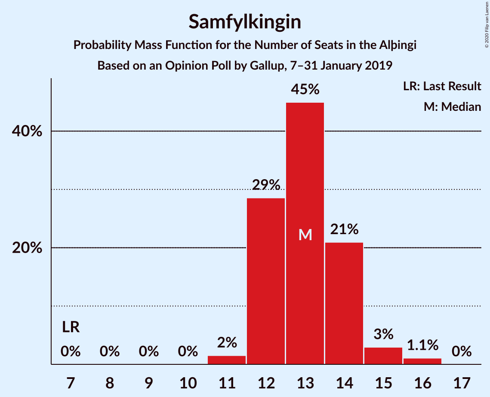

# Opinion Poll by Gallup, 7–31 January 2019

<a href="#voting-intentions">Voting Intentions</a> | <a href="#seats">Seats</a> | <a href="#coalitions">Coalitions</a> | <a href="#technical-information">Technical Information</a>

## Voting Intentions

### Confidence Intervals

| Party | Last Result | Poll Result | 80% Confidence Interval | 90% Confidence Interval | 95% Confidence Interval | 99% Confidence Interval |
|:-----:|:-----------:|:-----------:|:-----------------------:|:-----------------------:|:-----------------------:|:-----------------------:|
| Sjálfstæðisflokkurinn | 25.2% | 23.4% | 22.3–24.6% |22.0–24.9% |21.7–25.2% |21.2–25.7% |
| Samfylkingin | 12.1% | 19.1% | 18.1–20.2% |17.8–20.5% |17.6–20.8% |17.1–21.3% |
| Píratar | 9.2% | 12.7% | 11.8–13.6% |11.6–13.9% |11.4–14.1% |11.0–14.6% |
| Vinstrihreyfingin – grænt framboð | 16.9% | 11.3% | 10.5–12.2% |10.3–12.5% |10.1–12.7% |9.7–13.1% |
| Viðreisn | 6.7% | 9.1% | 8.4–9.9% |8.2–10.2% |8.0–10.3% |7.7–10.7% |
| Framsóknarflokkurinn | 10.7% | 8.8% | 8.1–9.6% |7.9–9.8% |7.7–10.0% |7.4–10.4% |
| Miðflokkurinn | 10.9% | 6.5% | 5.9–7.2% |5.7–7.4% |5.6–7.6% |5.3–7.9% |
| Sósíalistaflokkur Íslands | 0.0% | 5.3% | 4.7–5.9% |4.6–6.1% |4.5–6.3% |4.2–6.6% |
| Flokkur fólksins | 6.9% | 3.7% | 3.2–4.2% |3.1–4.4% |3.0–4.5% |2.8–4.8% |

*Note:* The poll result column reflects the actual value used in the calculations. Published results may vary slightly, and in addition be rounded to fewer digits.

## Seats

### Confidence Intervals

| Party | Last Result | Median | 80% Confidence Interval | 90% Confidence Interval | 95% Confidence Interval | 99% Confidence Interval |
|:-----:|:-----------:|:------:|:-----------------------:|:-----------------------:|:-----------------------:|:-----------------------:|
| <a href="#sjálfstæðisflokkurinn">Sjálfstæðisflokkurinn</a> | 16 | 16 | 15–17 |15–17 |15–18 |14–18 |
| <a href="#samfylkingin">Samfylkingin</a> | 7 | 13 | 12–14 |12–14 |12–15 |11–16 |
| <a href="#píratar">Píratar</a> | 6 | 9 | 8–10 |8–10 |8–10 |7–10 |
| <a href="#vinstrihreyfingin-–-grænt-framboð">Vinstrihreyfingin – grænt framboð</a> | 11 | 8 | 7–8 |7–8 |7–9 |6–9 |
| <a href="#viðreisn">Viðreisn</a> | 4 | 6 | 5–7 |5–7 |5–7 |5–7 |
| <a href="#framsóknarflokkurinn">Framsóknarflokkurinn</a> | 8 | 6 | 5–6 |5–6 |5–7 |5–7 |
| <a href="#miðflokkurinn">Miðflokkurinn</a> | 7 | 4 | 4 |4 |3–5 |3–5 |
| <a href="#sósíalistaflokkur-íslands">Sósíalistaflokkur Íslands</a> | 0 | 0 | 0–4 |0–4 |0–4 |0–4 |
| <a href="#flokkur-fólksins">Flokkur fólksins</a> | 4 | 0 | 0 |0 |0 |0 |

### Sjálfstæðisflokkurinn

*For a full overview of the results for this party, see the [Sjálfstæðisflokkurinn](party-sjálfstæðisflokkurinn.html) page.*

| Number of Seats | Probability | Accumulated | Special Marks |
|:---------------:|:-----------:|:-----------:|:-------------:|
| 14 | 1.2% | 100% |  |
| 15 | 25% | 98.7% |  |
| 16 | 47% | 74% | Last Result, Median |
| 17 | 23% | 28% |  |
| 18 | 5% | 5% |  |
| 19 | 0.2% | 0.2% |  |
| 20 | 0% | 0% |  |

### Samfylkingin

*For a full overview of the results for this party, see the [Samfylkingin](party-samfylkingin.html) page.*

| Number of Seats | Probability | Accumulated | Special Marks |
|:---------------:|:-----------:|:-----------:|:-------------:|
| 7 | 0% | 100% | Last Result |
| 8 | 0% | 100% |  |
| 9 | 0% | 100% |  |
| 10 | 0% | 100% |  |
| 11 | 2% | 100% |  |
| 12 | 16% | 98% |  |
| 13 | 52% | 82% | Median |
| 14 | 27% | 30% |  |
| 15 | 2% | 4% |  |
| 16 | 1.4% | 1.4% |  |
| 17 | 0% | 0% |  |

### Píratar

*For a full overview of the results for this party, see the [Píratar](party-píratar.html) page.*

| Number of Seats | Probability | Accumulated | Special Marks |
|:---------------:|:-----------:|:-----------:|:-------------:|
| 6 | 0% | 100% | Last Result |
| 7 | 2% | 100% |  |
| 8 | 44% | 98% |  |
| 9 | 24% | 55% | Median |
| 10 | 31% | 31% |  |
| 11 | 0% | 0% |  |

### Vinstrihreyfingin – grænt framboð

*For a full overview of the results for this party, see the [Vinstrihreyfingin – grænt framboð](party-vinstrihreyfingin–græntframboð.html) page.*

| Number of Seats | Probability | Accumulated | Special Marks |
|:---------------:|:-----------:|:-----------:|:-------------:|
| 6 | 2% | 100% |  |
| 7 | 34% | 98% |  |
| 8 | 62% | 64% | Median |
| 9 | 3% | 3% |  |
| 10 | 0% | 0% |  |
| 11 | 0% | 0% | Last Result |

### Viðreisn

*For a full overview of the results for this party, see the [Viðreisn](party-viðreisn.html) page.*

| Number of Seats | Probability | Accumulated | Special Marks |
|:---------------:|:-----------:|:-----------:|:-------------:|
| 4 | 0% | 100% | Last Result |
| 5 | 25% | 100% |  |
| 6 | 62% | 75% | Median |
| 7 | 13% | 13% |  |
| 8 | 0% | 0% |  |

### Framsóknarflokkurinn

*For a full overview of the results for this party, see the [Framsóknarflokkurinn](party-framsóknarflokkurinn.html) page.*

| Number of Seats | Probability | Accumulated | Special Marks |
|:---------------:|:-----------:|:-----------:|:-------------:|
| 4 | 0.3% | 100% |  |
| 5 | 25% | 99.7% |  |
| 6 | 70% | 74% | Median |
| 7 | 4% | 4% |  |
| 8 | 0.2% | 0.2% | Last Result |
| 9 | 0% | 0% |  |

### Miðflokkurinn

*For a full overview of the results for this party, see the [Miðflokkurinn](party-miðflokkurinn.html) page.*

| Number of Seats | Probability | Accumulated | Special Marks |
|:---------------:|:-----------:|:-----------:|:-------------:|
| 3 | 3% | 100% |  |
| 4 | 93% | 97% | Median |
| 5 | 4% | 4% |  |
| 6 | 0.1% | 0.1% |  |
| 7 | 0% | 0% | Last Result |

### Sósíalistaflokkur Íslands

*For a full overview of the results for this party, see the [Sósíalistaflokkur Íslands](party-sósíalistaflokkuríslands.html) page.*

| Number of Seats | Probability | Accumulated | Special Marks |
|:---------------:|:-----------:|:-----------:|:-------------:|
| 0 | 52% | 100% | Last Result, Median |
| 1 | 0% | 48% |  |
| 2 | 0% | 48% |  |
| 3 | 26% | 48% |  |
| 4 | 21% | 21% |  |
| 5 | 0% | 0% |  |

### Flokkur fólksins

*For a full overview of the results for this party, see the [Flokkur fólksins](party-flokkurfólksins.html) page.*

| Number of Seats | Probability | Accumulated | Special Marks |
|:---------------:|:-----------:|:-----------:|:-------------:|
| 0 | 99.9% | 100% | Median |
| 1 | 0% | 0.1% |  |
| 2 | 0% | 0.1% |  |
| 3 | 0.1% | 0.1% |  |
| 4 | 0% | 0% | Last Result |

## Coalitions

### Confidence Intervals

| Coalition | Last Result | Median | Majority? | 80% Confidence Interval | 90% Confidence Interval | 95% Confidence Interval | 99% Confidence Interval |
|:---------:|:-----------:|:------:|:---------:|:-----------------------:|:-----------------------:|:-----------------------:|:-----------------------:|
| Samfylkingin – Píratar – Vinstrihreyfingin – grænt framboð – Viðreisn | 28 | 36 | 100% | 34–37 | 33–37 | 33–37 | 32–38 |
| Samfylkingin – Vinstrihreyfingin – grænt framboð – Framsóknarflokkurinn – Miðflokkurinn | 33 | 31 | 11% | 29–32 | 29–32 | 28–32 | 28–33 |
| Sjálfstæðisflokkurinn – Vinstrihreyfingin – grænt framboð – Framsóknarflokkurinn | 35 | 30 | 1.4% | 28–30 | 28–31 | 27–31 | 26–32 |
| Samfylkingin – Píratar – Vinstrihreyfingin – grænt framboð | 24 | 30 | 0.7% | 28–31 | 28–31 | 27–31 | 26–32 |
| Sjálfstæðisflokkurinn – Samfylkingin | 23 | 29 | 1.0% | 28–31 | 28–31 | 27–31 | 27–32 |
| Sjálfstæðisflokkurinn – Framsóknarflokkurinn – Miðflokkurinn | 31 | 26 | 0% | 24–27 | 24–28 | 24–28 | 23–28 |
| Samfylkingin – Vinstrihreyfingin – grænt framboð – Framsóknarflokkurinn | 26 | 27 | 0% | 25–28 | 25–28 | 24–28 | 24–29 |
| Samfylkingin – Vinstrihreyfingin – grænt framboð – Miðflokkurinn | 25 | 25 | 0% | 24–26 | 23–26 | 23–27 | 22–27 |
| Sjálfstæðisflokkurinn – Vinstrihreyfingin – grænt framboð | 27 | 24 | 0% | 23–25 | 22–25 | 22–25 | 21–26 |
| Sjálfstæðisflokkurinn – Framsóknarflokkurinn | 24 | 22 | 0% | 20–23 | 20–24 | 20–24 | 20–24 |
| Sjálfstæðisflokkurinn – Viðreisn | 20 | 22 | 0% | 20–24 | 20–24 | 20–24 | 20–25 |
| Sjálfstæðisflokkurinn – Miðflokkurinn | 23 | 20 | 0% | 19–21 | 19–22 | 19–22 | 18–23 |
| Samfylkingin – Vinstrihreyfingin – grænt framboð | 18 | 21 | 0% | 20–22 | 19–22 | 19–22 | 18–23 |
| Vinstrihreyfingin – grænt framboð – Framsóknarflokkurinn – Miðflokkurinn | 26 | 18 | 0% | 16–18 | 16–19 | 16–19 | 15–20 |
| Píratar – Vinstrihreyfingin – grænt framboð | 17 | 16 | 0% | 15–18 | 15–18 | 15–18 | 14–18 |
| Vinstrihreyfingin – grænt framboð – Framsóknarflokkurinn | 19 | 14 | 0% | 13–14 | 12–14 | 12–15 | 11–15 |
| Vinstrihreyfingin – grænt framboð – Miðflokkurinn | 18 | 12 | 0% | 11–12 | 11–12 | 10–13 | 10–13 |

### Samfylkingin – Píratar – Vinstrihreyfingin – grænt framboð – Viðreisn

| Number of Seats | Probability | Accumulated | Special Marks |
|:---------------:|:-----------:|:-----------:|:-------------:|
| 28 | 0% | 100% | Last Result |
| 29 | 0% | 100% |  |
| 30 | 0% | 100% |  |
| 31 | 0% | 100% |  |
| 32 | 2% | 100% | Majority |
| 33 | 5% | 98% |  |
| 34 | 21% | 94% |  |
| 35 | 20% | 73% |  |
| 36 | 20% | 53% | Median |
| 37 | 32% | 33% |  |
| 38 | 0.9% | 0.9% |  |
| 39 | 0% | 0% |  |

### Samfylkingin – Vinstrihreyfingin – grænt framboð – Framsóknarflokkurinn – Miðflokkurinn

| Number of Seats | Probability | Accumulated | Special Marks |
|:---------------:|:-----------:|:-----------:|:-------------:|
| 27 | 0.2% | 100% |  |
| 28 | 4% | 99.8% |  |
| 29 | 10% | 96% |  |
| 30 | 21% | 86% |  |
| 31 | 54% | 65% | Median |
| 32 | 9% | 11% | Majority |
| 33 | 2% | 2% | Last Result |
| 34 | 0.2% | 0.2% |  |
| 35 | 0% | 0% |  |

### Sjálfstæðisflokkurinn – Vinstrihreyfingin – grænt framboð – Framsóknarflokkurinn

| Number of Seats | Probability | Accumulated | Special Marks |
|:---------------:|:-----------:|:-----------:|:-------------:|
| 25 | 0.1% | 100% |  |
| 26 | 0.6% | 99.9% |  |
| 27 | 3% | 99.4% |  |
| 28 | 16% | 96% |  |
| 29 | 15% | 79% |  |
| 30 | 56% | 64% | Median |
| 31 | 7% | 9% |  |
| 32 | 1.3% | 1.4% | Majority |
| 33 | 0.1% | 0.1% |  |
| 34 | 0% | 0% |  |
| 35 | 0% | 0% | Last Result |

### Samfylkingin – Píratar – Vinstrihreyfingin – grænt framboð

| Number of Seats | Probability | Accumulated | Special Marks |
|:---------------:|:-----------:|:-----------:|:-------------:|
| 24 | 0% | 100% | Last Result |
| 25 | 0% | 100% |  |
| 26 | 0.6% | 100% |  |
| 27 | 3% | 99.3% |  |
| 28 | 15% | 96% |  |
| 29 | 30% | 81% |  |
| 30 | 18% | 52% | Median |
| 31 | 33% | 34% |  |
| 32 | 0.7% | 0.7% | Majority |
| 33 | 0% | 0% |  |

### Sjálfstæðisflokkurinn – Samfylkingin

| Number of Seats | Probability | Accumulated | Special Marks |
|:---------------:|:-----------:|:-----------:|:-------------:|
| 23 | 0% | 100% | Last Result |
| 24 | 0% | 100% |  |
| 25 | 0% | 100% |  |
| 26 | 0.2% | 100% |  |
| 27 | 5% | 99.8% |  |
| 28 | 15% | 95% |  |
| 29 | 49% | 80% | Median |
| 30 | 18% | 31% |  |
| 31 | 13% | 14% |  |
| 32 | 1.0% | 1.0% | Majority |
| 33 | 0% | 0% |  |

### Sjálfstæðisflokkurinn – Framsóknarflokkurinn – Miðflokkurinn

| Number of Seats | Probability | Accumulated | Special Marks |
|:---------------:|:-----------:|:-----------:|:-------------:|
| 23 | 0.6% | 100% |  |
| 24 | 14% | 99.4% |  |
| 25 | 15% | 85% |  |
| 26 | 48% | 70% | Median |
| 27 | 16% | 23% |  |
| 28 | 6% | 7% |  |
| 29 | 0.2% | 0.3% |  |
| 30 | 0.1% | 0.1% |  |
| 31 | 0% | 0% | Last Result |

### Samfylkingin – Vinstrihreyfingin – grænt framboð – Framsóknarflokkurinn

| Number of Seats | Probability | Accumulated | Special Marks |
|:---------------:|:-----------:|:-----------:|:-------------:|
| 23 | 0.2% | 100% |  |
| 24 | 4% | 99.8% |  |
| 25 | 10% | 96% |  |
| 26 | 22% | 86% | Last Result |
| 27 | 53% | 65% | Median |
| 28 | 10% | 11% |  |
| 29 | 1.5% | 2% |  |
| 30 | 0% | 0% |  |

### Samfylkingin – Vinstrihreyfingin – grænt framboð – Miðflokkurinn

| Number of Seats | Probability | Accumulated | Special Marks |
|:---------------:|:-----------:|:-----------:|:-------------:|
| 21 | 0.1% | 100% |  |
| 22 | 1.4% | 99.9% |  |
| 23 | 5% | 98% |  |
| 24 | 29% | 93% |  |
| 25 | 42% | 64% | Last Result, Median |
| 26 | 20% | 22% |  |
| 27 | 3% | 3% |  |
| 28 | 0.1% | 0.1% |  |
| 29 | 0% | 0% |  |

### Sjálfstæðisflokkurinn – Vinstrihreyfingin – grænt framboð

| Number of Seats | Probability | Accumulated | Special Marks |
|:---------------:|:-----------:|:-----------:|:-------------:|
| 20 | 0.2% | 100% |  |
| 21 | 1.2% | 99.8% |  |
| 22 | 5% | 98.6% |  |
| 23 | 30% | 94% |  |
| 24 | 52% | 64% | Median |
| 25 | 10% | 12% |  |
| 26 | 2% | 2% |  |
| 27 | 0% | 0% | Last Result |

### Sjálfstæðisflokkurinn – Framsóknarflokkurinn

| Number of Seats | Probability | Accumulated | Special Marks |
|:---------------:|:-----------:|:-----------:|:-------------:|
| 19 | 0.2% | 100% |  |
| 20 | 14% | 99.8% |  |
| 21 | 15% | 86% |  |
| 22 | 49% | 71% | Median |
| 23 | 17% | 22% |  |
| 24 | 5% | 5% | Last Result |
| 25 | 0.2% | 0.2% |  |
| 26 | 0% | 0% |  |

### Sjálfstæðisflokkurinn – Viðreisn

| Number of Seats | Probability | Accumulated | Special Marks |
|:---------------:|:-----------:|:-----------:|:-------------:|
| 19 | 0.4% | 100% |  |
| 20 | 14% | 99.6% | Last Result |
| 21 | 17% | 85% |  |
| 22 | 40% | 68% | Median |
| 23 | 17% | 28% |  |
| 24 | 10% | 11% |  |
| 25 | 0.5% | 0.6% |  |
| 26 | 0% | 0% |  |

### Sjálfstæðisflokkurinn – Miðflokkurinn

| Number of Seats | Probability | Accumulated | Special Marks |
|:---------------:|:-----------:|:-----------:|:-------------:|
| 17 | 0.4% | 100% |  |
| 18 | 2% | 99.6% |  |
| 19 | 23% | 98% |  |
| 20 | 46% | 74% | Median |
| 21 | 22% | 28% |  |
| 22 | 5% | 6% |  |
| 23 | 0.6% | 0.7% | Last Result |
| 24 | 0.1% | 0.1% |  |
| 25 | 0% | 0% |  |

### Samfylkingin – Vinstrihreyfingin – grænt framboð

| Number of Seats | Probability | Accumulated | Special Marks |
|:---------------:|:-----------:|:-----------:|:-------------:|
| 18 | 1.5% | 100% | Last Result |
| 19 | 5% | 98.5% |  |
| 20 | 29% | 94% |  |
| 21 | 43% | 65% | Median |
| 22 | 19% | 21% |  |
| 23 | 2% | 2% |  |
| 24 | 0% | 0% |  |

### Vinstrihreyfingin – grænt framboð – Framsóknarflokkurinn – Miðflokkurinn

| Number of Seats | Probability | Accumulated | Special Marks |
|:---------------:|:-----------:|:-----------:|:-------------:|
| 15 | 2% | 100% |  |
| 16 | 9% | 98% |  |
| 17 | 39% | 90% |  |
| 18 | 45% | 50% | Median |
| 19 | 5% | 5% |  |
| 20 | 0.6% | 0.6% |  |
| 21 | 0% | 0% |  |
| 22 | 0% | 0% |  |
| 23 | 0% | 0% |  |
| 24 | 0% | 0% |  |
| 25 | 0% | 0% |  |
| 26 | 0% | 0% | Last Result |

### Píratar – Vinstrihreyfingin – grænt framboð

| Number of Seats | Probability | Accumulated | Special Marks |
|:---------------:|:-----------:|:-----------:|:-------------:|
| 14 | 2% | 100% |  |
| 15 | 15% | 98% |  |
| 16 | 42% | 84% |  |
| 17 | 16% | 41% | Last Result, Median |
| 18 | 25% | 25% |  |
| 19 | 0% | 0% |  |

### Vinstrihreyfingin – grænt framboð – Framsóknarflokkurinn

| Number of Seats | Probability | Accumulated | Special Marks |
|:---------------:|:-----------:|:-----------:|:-------------:|
| 11 | 2% | 100% |  |
| 12 | 8% | 98% |  |
| 13 | 40% | 90% |  |
| 14 | 46% | 50% | Median |
| 15 | 4% | 4% |  |
| 16 | 0.1% | 0.1% |  |
| 17 | 0% | 0% |  |
| 18 | 0% | 0% |  |
| 19 | 0% | 0% | Last Result |

### Vinstrihreyfingin – grænt framboð – Miðflokkurinn

| Number of Seats | Probability | Accumulated | Special Marks |
|:---------------:|:-----------:|:-----------:|:-------------:|
| 10 | 3% | 100% |  |
| 11 | 33% | 97% |  |
| 12 | 59% | 63% | Median |
| 13 | 4% | 5% |  |
| 14 | 0.3% | 0.3% |  |
| 15 | 0% | 0% |  |
| 16 | 0% | 0% |  |
| 17 | 0% | 0% |  |
| 18 | 0% | 0% | Last Result |

## Technical Information

### Opinion Poll

+ **Polling firm:** Gallup
+ **Commissioner(s):** —
+ **Fieldwork period:** 7–31 January 2019

### Calculations

+ **Sample size:** 2307
+ **Simulations done:** 524,288
+ **Error estimate:** 1.40%

