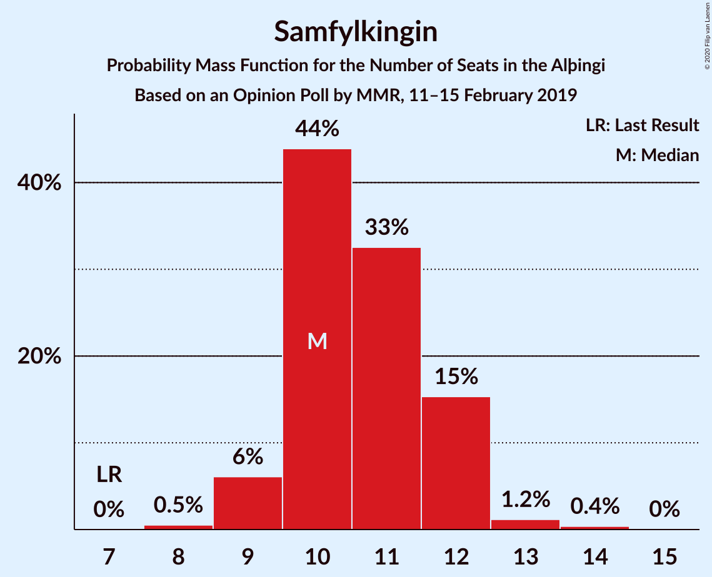
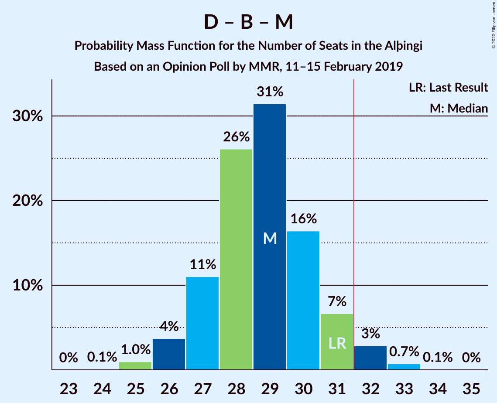

# Opinion Poll by MMR, 11–15 February 2019

<a href="#voting-intentions">Voting Intentions</a> | <a href="#seats">Seats</a> | <a href="#coalitions">Coalitions</a> | <a href="#technical-information">Technical Information</a>

## Voting Intentions

### Confidence Intervals

| Party | Last Result | Poll Result | 80% Confidence Interval | 90% Confidence Interval | 95% Confidence Interval | 99% Confidence Interval |
|:-----:|:-----------:|:-----------:|:-----------------------:|:-----------------------:|:-----------------------:|:-----------------------:|
| Sjálfstæðisflokkurinn | 25.2% | 22.7% | 21.0–24.5% |20.5–25.0% |20.1–25.5% |19.3–26.4% |
| Samfylkingin | 12.1% | 16.0% | 14.5–17.6% |14.1–18.0% |13.7–18.4% |13.1–19.2% |
| Framsóknarflokkurinn | 10.7% | 13.5% | 12.1–15.0% |11.8–15.5% |11.4–15.8% |10.8–16.6% |
| Vinstrihreyfingin – grænt framboð | 16.9% | 11.1% | 9.9–12.6% |9.6–13.0% |9.3–13.3% |8.7–14.0% |
| Píratar | 9.2% | 10.4% | 9.2–11.8% |8.9–12.2% |8.6–12.5% |8.0–13.2% |
| Viðreisn | 6.7% | 8.1% | 7.1–9.4% |6.8–9.8% |6.6–10.1% |6.1–10.7% |
| Flokkur fólksins | 6.9% | 7.0% | 6.0–8.1% |5.7–8.5% |5.5–8.8% |5.1–9.4% |
| Miðflokkurinn | 10.9% | 6.1% | 5.2–7.2% |5.0–7.5% |4.7–7.8% |4.3–8.4% |
| Sósíalistaflokkur Íslands | 0.0% | 3.6% | 3.0–4.6% |2.8–4.8% |2.6–5.0% |2.3–5.5% |

*Note:* The poll result column reflects the actual value used in the calculations. Published results may vary slightly, and in addition be rounded to fewer digits.

## Seats

### Confidence Intervals

| Party | Last Result | Median | 80% Confidence Interval | 90% Confidence Interval | 95% Confidence Interval | 99% Confidence Interval |
|:-----:|:-----------:|:------:|:-----------------------:|:-----------------------:|:-----------------------:|:-----------------------:|
| <a href="#sjálfstæðisflokkurinn">Sjálfstæðisflokkurinn</a> | 16 | 15 | 14–17 |14–17 |13–18 |13–19 |
| <a href="#samfylkingin">Samfylkingin</a> | 7 | 10 | 10–12 |9–12 |9–12 |8–13 |
| <a href="#framsóknarflokkurinn">Framsóknarflokkurinn</a> | 8 | 10 | 8–11 |8–12 |8–12 |8–12 |
| <a href="#vinstrihreyfingin-–-grænt-framboð">Vinstrihreyfingin – grænt framboð</a> | 11 | 7 | 6–8 |6–9 |6–9 |5–10 |
| <a href="#píratar">Píratar</a> | 6 | 7 | 6–8 |6–8 |5–8 |5–9 |
| <a href="#viðreisn">Viðreisn</a> | 4 | 5 | 4–6 |4–6 |4–7 |4–7 |
| <a href="#flokkur-fólksins">Flokkur fólksins</a> | 4 | 4 | 3–5 |3–6 |3–6 |3–6 |
| <a href="#miðflokkurinn">Miðflokkurinn</a> | 7 | 4 | 3–4 |3–5 |1–5 |1–5 |
| <a href="#sósíalistaflokkur-íslands">Sósíalistaflokkur Íslands</a> | 0 | 0 | 0 |0 |0–3 |0–3 |

### Sjálfstæðisflokkurinn

*For a full overview of the results for this party, see the [Sjálfstæðisflokkurinn](party-sjálfstæðisflokkurinn.html) page.*

| Number of Seats | Probability | Accumulated | Special Marks |
|:---------------:|:-----------:|:-----------:|:-------------:|
| 13 | 3% | 100% |  |
| 14 | 22% | 97% |  |
| 15 | 35% | 74% | Median |
| 16 | 25% | 39% | Last Result |
| 17 | 10% | 14% |  |
| 18 | 2% | 4% |  |
| 19 | 2% | 2% |  |
| 20 | 0% | 0% |  |

### Samfylkingin

*For a full overview of the results for this party, see the [Samfylkingin](party-samfylkingin.html) page.*

| Number of Seats | Probability | Accumulated | Special Marks |
|:---------------:|:-----------:|:-----------:|:-------------:|
| 7 | 0% | 100% | Last Result |
| 8 | 0.5% | 100% |  |
| 9 | 6% | 99.5% |  |
| 10 | 44% | 93% | Median |
| 11 | 33% | 49% |  |
| 12 | 15% | 17% |  |
| 13 | 1.2% | 2% |  |
| 14 | 0.4% | 0.4% |  |
| 15 | 0% | 0% |  |

### Framsóknarflokkurinn

*For a full overview of the results for this party, see the [Framsóknarflokkurinn](party-framsóknarflokkurinn.html) page.*

| Number of Seats | Probability | Accumulated | Special Marks |
|:---------------:|:-----------:|:-----------:|:-------------:|
| 7 | 0.2% | 100% |  |
| 8 | 16% | 99.8% | Last Result |
| 9 | 16% | 83% |  |
| 10 | 50% | 68% | Median |
| 11 | 11% | 18% |  |
| 12 | 7% | 7% |  |
| 13 | 0.2% | 0.4% |  |
| 14 | 0.2% | 0.2% |  |
| 15 | 0% | 0% |  |

### Vinstrihreyfingin – grænt framboð

*For a full overview of the results for this party, see the [Vinstrihreyfingin – grænt framboð](party-vinstrihreyfingin–græntframboð.html) page.*

| Number of Seats | Probability | Accumulated | Special Marks |
|:---------------:|:-----------:|:-----------:|:-------------:|
| 5 | 0.6% | 100% |  |
| 6 | 16% | 99.4% |  |
| 7 | 36% | 83% | Median |
| 8 | 41% | 47% |  |
| 9 | 5% | 6% |  |
| 10 | 0.5% | 0.6% |  |
| 11 | 0% | 0% | Last Result |

### Píratar

*For a full overview of the results for this party, see the [Píratar](party-píratar.html) page.*

| Number of Seats | Probability | Accumulated | Special Marks |
|:---------------:|:-----------:|:-----------:|:-------------:|
| 4 | 0.1% | 100% |  |
| 5 | 4% | 99.9% |  |
| 6 | 39% | 96% | Last Result |
| 7 | 42% | 57% | Median |
| 8 | 14% | 15% |  |
| 9 | 1.1% | 1.1% |  |
| 10 | 0% | 0% |  |

### Viðreisn

*For a full overview of the results for this party, see the [Viðreisn](party-viðreisn.html) page.*

| Number of Seats | Probability | Accumulated | Special Marks |
|:---------------:|:-----------:|:-----------:|:-------------:|
| 3 | 0.1% | 100% |  |
| 4 | 12% | 99.9% | Last Result |
| 5 | 57% | 88% | Median |
| 6 | 28% | 31% |  |
| 7 | 3% | 3% |  |
| 8 | 0% | 0% |  |

### Flokkur fólksins

*For a full overview of the results for this party, see the [Flokkur fólksins](party-flokkurfólksins.html) page.*

| Number of Seats | Probability | Accumulated | Special Marks |
|:---------------:|:-----------:|:-----------:|:-------------:|
| 0 | 0.2% | 100% |  |
| 1 | 0% | 99.8% |  |
| 2 | 0% | 99.8% |  |
| 3 | 10% | 99.8% |  |
| 4 | 58% | 89% | Last Result, Median |
| 5 | 26% | 32% |  |
| 6 | 6% | 6% |  |
| 7 | 0% | 0% |  |

### Miðflokkurinn

*For a full overview of the results for this party, see the [Miðflokkurinn](party-miðflokkurinn.html) page.*

| Number of Seats | Probability | Accumulated | Special Marks |
|:---------------:|:-----------:|:-----------:|:-------------:|
| 0 | 0.1% | 100% |  |
| 1 | 5% | 99.9% |  |
| 2 | 0% | 95% |  |
| 3 | 23% | 95% |  |
| 4 | 63% | 72% | Median |
| 5 | 9% | 9% |  |
| 6 | 0.2% | 0.2% |  |
| 7 | 0% | 0% | Last Result |

### Sósíalistaflokkur Íslands

*For a full overview of the results for this party, see the [Sósíalistaflokkur Íslands](party-sósíalistaflokkuríslands.html) page.*

| Number of Seats | Probability | Accumulated | Special Marks |
|:---------------:|:-----------:|:-----------:|:-------------:|
| 0 | 97% | 100% | Last Result, Median |
| 1 | 0% | 3% |  |
| 2 | 0% | 3% |  |
| 3 | 2% | 3% |  |
| 4 | 0% | 0% |  |

## Coalitions

### Confidence Intervals

| Coalition | Last Result | Median | Majority? | 80% Confidence Interval | 90% Confidence Interval | 95% Confidence Interval | 99% Confidence Interval |
|:---------:|:-----------:|:------:|:---------:|:-----------------------:|:-----------------------:|:-----------------------:|:-----------------------:|
| Sjálfstæðisflokkurinn – Framsóknarflokkurinn – Vinstrihreyfingin – grænt framboð | 35 | 32 | 79% | 31–34 | 30–35 | 30–35 | 29–36 |
| Samfylkingin – Framsóknarflokkurinn – Vinstrihreyfingin – grænt framboð – Miðflokkurinn | 33 | 32 | 55% | 29–33 | 29–34 | 29–34 | 28–35 |
| Samfylkingin – Vinstrihreyfingin – grænt framboð – Píratar – Viðreisn | 28 | 30 | 10% | 28–31 | 27–32 | 27–32 | 26–33 |
| Sjálfstæðisflokkurinn – Framsóknarflokkurinn – Miðflokkurinn | 31 | 29 | 4% | 27–31 | 27–31 | 26–32 | 25–33 |
| Samfylkingin – Framsóknarflokkurinn – Vinstrihreyfingin – grænt framboð | 26 | 28 | 0.3% | 26–30 | 25–30 | 25–30 | 24–31 |
| Sjálfstæðisflokkurinn – Samfylkingin | 23 | 26 | 0% | 24–28 | 24–28 | 24–29 | 23–29 |
| Sjálfstæðisflokkurinn – Framsóknarflokkurinn | 24 | 25 | 0% | 24–27 | 23–28 | 23–28 | 22–29 |
| Samfylkingin – Vinstrihreyfingin – grænt framboð – Píratar | 24 | 25 | 0% | 23–26 | 22–27 | 22–27 | 21–28 |
| Sjálfstæðisflokkurinn – Vinstrihreyfingin – grænt framboð | 27 | 23 | 0% | 21–24 | 21–25 | 20–25 | 20–26 |
| Samfylkingin – Vinstrihreyfingin – grænt framboð – Miðflokkurinn | 25 | 22 | 0% | 20–23 | 19–24 | 19–24 | 18–25 |
| Sjálfstæðisflokkurinn – Viðreisn | 20 | 20 | 0% | 19–22 | 19–23 | 18–24 | 18–25 |
| Framsóknarflokkurinn – Vinstrihreyfingin – grænt framboð – Miðflokkurinn | 26 | 21 | 0% | 19–22 | 18–23 | 18–23 | 17–24 |
| Sjálfstæðisflokkurinn – Miðflokkurinn | 23 | 19 | 0% | 18–21 | 17–21 | 16–22 | 15–23 |
| Samfylkingin – Vinstrihreyfingin – grænt framboð | 18 | 18 | 0% | 17–19 | 16–20 | 16–20 | 15–21 |
| Framsóknarflokkurinn – Vinstrihreyfingin – grænt framboð | 19 | 17 | 0% | 16–19 | 15–19 | 15–19 | 14–20 |
| Vinstrihreyfingin – grænt framboð – Píratar | 17 | 14 | 0% | 13–15 | 12–16 | 12–16 | 11–17 |
| Vinstrihreyfingin – grænt framboð – Miðflokkurinn | 18 | 11 | 0% | 10–12 | 9–13 | 8–13 | 8–14 |

### Sjálfstæðisflokkurinn – Framsóknarflokkurinn – Vinstrihreyfingin – grænt framboð

| Number of Seats | Probability | Accumulated | Special Marks |
|:---------------:|:-----------:|:-----------:|:-------------:|
| 28 | 0.1% | 100% |  |
| 29 | 1.0% | 99.9% |  |
| 30 | 7% | 98.9% |  |
| 31 | 13% | 92% |  |
| 32 | 34% | 79% | Median, Majority |
| 33 | 25% | 45% |  |
| 34 | 14% | 20% |  |
| 35 | 4% | 6% | Last Result |
| 36 | 1.2% | 1.4% |  |
| 37 | 0.2% | 0.2% |  |
| 38 | 0% | 0% |  |

### Samfylkingin – Framsóknarflokkurinn – Vinstrihreyfingin – grænt framboð – Miðflokkurinn

| Number of Seats | Probability | Accumulated | Special Marks |
|:---------------:|:-----------:|:-----------:|:-------------:|
| 27 | 0.4% | 100% |  |
| 28 | 2% | 99.6% |  |
| 29 | 9% | 98% |  |
| 30 | 17% | 89% |  |
| 31 | 18% | 73% | Median |
| 32 | 33% | 55% | Majority |
| 33 | 12% | 22% | Last Result |
| 34 | 8% | 9% |  |
| 35 | 0.8% | 0.9% |  |
| 36 | 0% | 0.1% |  |
| 37 | 0% | 0% |  |

### Samfylkingin – Vinstrihreyfingin – grænt framboð – Píratar – Viðreisn

| Number of Seats | Probability | Accumulated | Special Marks |
|:---------------:|:-----------:|:-----------:|:-------------:|
| 25 | 0.2% | 100% |  |
| 26 | 0.8% | 99.8% |  |
| 27 | 4% | 99.0% |  |
| 28 | 8% | 95% | Last Result |
| 29 | 23% | 87% | Median |
| 30 | 33% | 64% |  |
| 31 | 21% | 31% |  |
| 32 | 7% | 10% | Majority |
| 33 | 2% | 2% |  |
| 34 | 0.2% | 0.3% |  |
| 35 | 0.1% | 0.1% |  |
| 36 | 0% | 0% |  |

### Sjálfstæðisflokkurinn – Framsóknarflokkurinn – Miðflokkurinn

| Number of Seats | Probability | Accumulated | Special Marks |
|:---------------:|:-----------:|:-----------:|:-------------:|
| 24 | 0.1% | 100% |  |
| 25 | 1.0% | 99.9% |  |
| 26 | 4% | 98.9% |  |
| 27 | 11% | 95% |  |
| 28 | 26% | 84% |  |
| 29 | 31% | 58% | Median |
| 30 | 16% | 27% |  |
| 31 | 7% | 10% | Last Result |
| 32 | 3% | 4% | Majority |
| 33 | 0.7% | 0.8% |  |
| 34 | 0.1% | 0.1% |  |
| 35 | 0% | 0% |  |

### Samfylkingin – Framsóknarflokkurinn – Vinstrihreyfingin – grænt framboð

| Number of Seats | Probability | Accumulated | Special Marks |
|:---------------:|:-----------:|:-----------:|:-------------:|
| 23 | 0.2% | 100% |  |
| 24 | 0.8% | 99.8% |  |
| 25 | 5% | 99.0% |  |
| 26 | 13% | 94% | Last Result |
| 27 | 18% | 81% | Median |
| 28 | 37% | 63% |  |
| 29 | 15% | 26% |  |
| 30 | 9% | 11% |  |
| 31 | 1.4% | 2% |  |
| 32 | 0.3% | 0.3% | Majority |
| 33 | 0% | 0% |  |

### Sjálfstæðisflokkurinn – Samfylkingin

| Number of Seats | Probability | Accumulated | Special Marks |
|:---------------:|:-----------:|:-----------:|:-------------:|
| 22 | 0.2% | 100% |  |
| 23 | 2% | 99.8% | Last Result |
| 24 | 11% | 98% |  |
| 25 | 27% | 87% | Median |
| 26 | 31% | 61% |  |
| 27 | 18% | 30% |  |
| 28 | 8% | 11% |  |
| 29 | 3% | 3% |  |
| 30 | 0.3% | 0.3% |  |
| 31 | 0% | 0.1% |  |
| 32 | 0% | 0% | Majority |

### Sjálfstæðisflokkurinn – Framsóknarflokkurinn

| Number of Seats | Probability | Accumulated | Special Marks |
|:---------------:|:-----------:|:-----------:|:-------------:|
| 21 | 0.1% | 100% |  |
| 22 | 2% | 99.9% |  |
| 23 | 6% | 98% |  |
| 24 | 28% | 92% | Last Result |
| 25 | 32% | 64% | Median |
| 26 | 19% | 32% |  |
| 27 | 8% | 13% |  |
| 28 | 3% | 5% |  |
| 29 | 2% | 2% |  |
| 30 | 0.1% | 0.1% |  |
| 31 | 0% | 0% |  |

### Samfylkingin – Vinstrihreyfingin – grænt framboð – Píratar

| Number of Seats | Probability | Accumulated | Special Marks |
|:---------------:|:-----------:|:-----------:|:-------------:|
| 20 | 0.2% | 100% |  |
| 21 | 1.2% | 99.8% |  |
| 22 | 5% | 98.6% |  |
| 23 | 11% | 94% |  |
| 24 | 24% | 83% | Last Result, Median |
| 25 | 34% | 59% |  |
| 26 | 19% | 25% |  |
| 27 | 4% | 5% |  |
| 28 | 0.9% | 1.1% |  |
| 29 | 0.2% | 0.2% |  |
| 30 | 0% | 0% |  |

### Sjálfstæðisflokkurinn – Vinstrihreyfingin – grænt framboð

| Number of Seats | Probability | Accumulated | Special Marks |
|:---------------:|:-----------:|:-----------:|:-------------:|
| 19 | 0.4% | 100% |  |
| 20 | 4% | 99.5% |  |
| 21 | 14% | 96% |  |
| 22 | 27% | 82% | Median |
| 23 | 29% | 55% |  |
| 24 | 19% | 25% |  |
| 25 | 5% | 7% |  |
| 26 | 2% | 2% |  |
| 27 | 0.2% | 0.2% | Last Result |
| 28 | 0% | 0% |  |

### Samfylkingin – Vinstrihreyfingin – grænt framboð – Miðflokkurinn

| Number of Seats | Probability | Accumulated | Special Marks |
|:---------------:|:-----------:|:-----------:|:-------------:|
| 17 | 0.2% | 100% |  |
| 18 | 1.0% | 99.8% |  |
| 19 | 5% | 98.8% |  |
| 20 | 13% | 94% |  |
| 21 | 21% | 81% | Median |
| 22 | 34% | 60% |  |
| 23 | 16% | 26% |  |
| 24 | 9% | 10% |  |
| 25 | 0.7% | 0.8% | Last Result |
| 26 | 0.1% | 0.1% |  |
| 27 | 0% | 0% |  |

### Sjálfstæðisflokkurinn – Viðreisn

| Number of Seats | Probability | Accumulated | Special Marks |
|:---------------:|:-----------:|:-----------:|:-------------:|
| 17 | 0.3% | 100% |  |
| 18 | 2% | 99.7% |  |
| 19 | 21% | 97% |  |
| 20 | 28% | 77% | Last Result, Median |
| 21 | 29% | 48% |  |
| 22 | 14% | 20% |  |
| 23 | 3% | 6% |  |
| 24 | 2% | 3% |  |
| 25 | 0.6% | 0.6% |  |
| 26 | 0% | 0% |  |

### Framsóknarflokkurinn – Vinstrihreyfingin – grænt framboð – Miðflokkurinn

| Number of Seats | Probability | Accumulated | Special Marks |
|:---------------:|:-----------:|:-----------:|:-------------:|
| 16 | 0.1% | 100% |  |
| 17 | 0.8% | 99.9% |  |
| 18 | 5% | 99.1% |  |
| 19 | 11% | 94% |  |
| 20 | 25% | 84% |  |
| 21 | 22% | 59% | Median |
| 22 | 28% | 37% |  |
| 23 | 8% | 9% |  |
| 24 | 1.4% | 1.5% |  |
| 25 | 0.1% | 0.1% |  |
| 26 | 0% | 0% | Last Result |

### Sjálfstæðisflokkurinn – Miðflokkurinn

| Number of Seats | Probability | Accumulated | Special Marks |
|:---------------:|:-----------:|:-----------:|:-------------:|
| 14 | 0.1% | 100% |  |
| 15 | 0.6% | 99.9% |  |
| 16 | 2% | 99.4% |  |
| 17 | 6% | 97% |  |
| 18 | 25% | 91% |  |
| 19 | 33% | 66% | Median |
| 20 | 21% | 33% |  |
| 21 | 8% | 11% |  |
| 22 | 2% | 3% |  |
| 23 | 1.1% | 1.2% | Last Result |
| 24 | 0% | 0% |  |

### Samfylkingin – Vinstrihreyfingin – grænt framboð

| Number of Seats | Probability | Accumulated | Special Marks |
|:---------------:|:-----------:|:-----------:|:-------------:|
| 14 | 0.2% | 100% |  |
| 15 | 2% | 99.8% |  |
| 16 | 8% | 98% |  |
| 17 | 24% | 90% | Median |
| 18 | 34% | 66% | Last Result |
| 19 | 24% | 33% |  |
| 20 | 8% | 9% |  |
| 21 | 1.0% | 1.2% |  |
| 22 | 0.2% | 0.2% |  |
| 23 | 0% | 0% |  |

### Framsóknarflokkurinn – Vinstrihreyfingin – grænt framboð

| Number of Seats | Probability | Accumulated | Special Marks |
|:---------------:|:-----------:|:-----------:|:-------------:|
| 13 | 0.1% | 100% |  |
| 14 | 2% | 99.9% |  |
| 15 | 8% | 98% |  |
| 16 | 21% | 90% |  |
| 17 | 27% | 69% | Median |
| 18 | 32% | 43% |  |
| 19 | 9% | 11% | Last Result |
| 20 | 1.2% | 1.4% |  |
| 21 | 0.2% | 0.2% |  |
| 22 | 0% | 0% |  |

### Vinstrihreyfingin – grænt framboð – Píratar

| Number of Seats | Probability | Accumulated | Special Marks |
|:---------------:|:-----------:|:-----------:|:-------------:|
| 10 | 0.1% | 100% |  |
| 11 | 1.5% | 99.9% |  |
| 12 | 8% | 98% |  |
| 13 | 18% | 90% |  |
| 14 | 36% | 72% | Median |
| 15 | 30% | 37% |  |
| 16 | 5% | 6% |  |
| 17 | 1.3% | 1.4% | Last Result |
| 18 | 0.1% | 0.1% |  |
| 19 | 0% | 0% |  |

### Vinstrihreyfingin – grænt framboð – Miðflokkurinn

| Number of Seats | Probability | Accumulated | Special Marks |
|:---------------:|:-----------:|:-----------:|:-------------:|
| 7 | 0.3% | 100% |  |
| 8 | 2% | 99.7% |  |
| 9 | 7% | 97% |  |
| 10 | 19% | 91% |  |
| 11 | 31% | 72% | Median |
| 12 | 33% | 40% |  |
| 13 | 7% | 7% |  |
| 14 | 0.6% | 0.6% |  |
| 15 | 0% | 0% |  |
| 16 | 0% | 0% |  |
| 17 | 0% | 0% |  |
| 18 | 0% | 0% | Last Result |

## Technical Information

### Opinion Poll

+ **Polling firm:** MMR
+ **Commissioner(s):** —
+ **Fieldwork period:** 11–15 February 2019

### Calculations

+ **Sample size:** 934
+ **Simulations done:** 1,048,576
+ **Error estimate:** 0.73%

