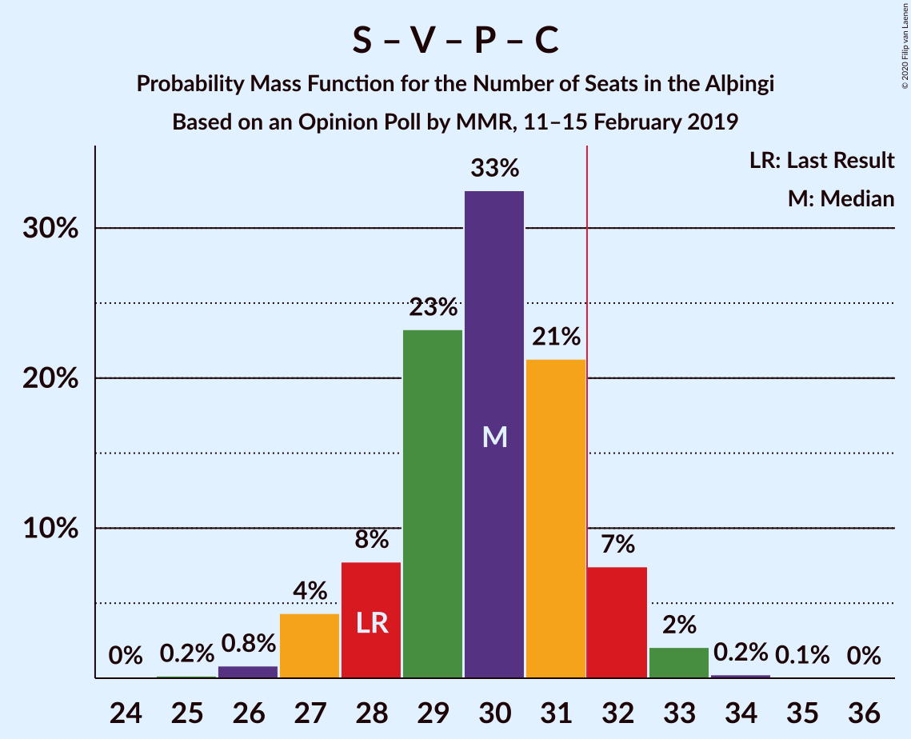

# Opinion Poll by MMR, 11–15 February 2019

<a href="#voting-intentions">Voting Intentions</a> | <a href="#seats">Seats</a> | <a href="#coalitions">Coalitions</a> | <a href="#technical-information">Technical Information</a>

## Voting Intentions

### Confidence Intervals

| Party | Last Result | Poll Result | 80% Confidence Interval | 90% Confidence Interval | 95% Confidence Interval | 99% Confidence Interval |
|:-----:|:-----------:|:-----------:|:-----------------------:|:-----------------------:|:-----------------------:|:-----------------------:|
| Sjálfstæðisflokkurinn | 25.2% | 22.7% | 21.0–24.5% |20.5–25.0% |20.1–25.5% |19.3–26.4% |
| Samfylkingin | 12.1% | 16.0% | 14.5–17.6% |14.1–18.0% |13.7–18.4% |13.1–19.2% |
| Framsóknarflokkurinn | 10.7% | 13.5% | 12.1–15.0% |11.8–15.5% |11.4–15.8% |10.8–16.6% |
| Vinstrihreyfingin – grænt framboð | 16.9% | 11.1% | 9.9–12.6% |9.6–13.0% |9.3–13.3% |8.7–14.0% |
| Píratar | 9.2% | 10.4% | 9.2–11.8% |8.9–12.2% |8.6–12.5% |8.0–13.2% |
| Viðreisn | 6.7% | 8.1% | 7.1–9.4% |6.8–9.8% |6.6–10.1% |6.1–10.7% |
| Flokkur fólksins | 6.9% | 7.0% | 6.0–8.1% |5.7–8.5% |5.5–8.8% |5.1–9.4% |
| Miðflokkurinn | 10.9% | 6.1% | 5.2–7.2% |5.0–7.5% |4.7–7.8% |4.3–8.4% |

*Note:* The poll result column reflects the actual value used in the calculations. Published results may vary slightly, and in addition be rounded to fewer digits.

## Seats

### Confidence Intervals

| Party | Last Result | Median | 80% Confidence Interval | 90% Confidence Interval | 95% Confidence Interval | 99% Confidence Interval |
|:-----:|:-----------:|:------:|:-----------------------:|:-----------------------:|:-----------------------:|:-----------------------:|
| <a href="#sjálfstæðisflokkurinn">Sjálfstæðisflokkurinn</a> | 16 | 15 | 15–16 |15–16 |15–16 |14–16 |
| <a href="#samfylkingin">Samfylkingin</a> | 7 | 11 | 11 |11 |11 |9–11 |
| <a href="#framsóknarflokkurinn">Framsóknarflokkurinn</a> | 8 | 11 | 11 |11 |11 |10–12 |
| <a href="#vinstrihreyfingin-–-grænt-framboð">Vinstrihreyfingin – grænt framboð</a> | 11 | 6 | 6 |6 |6 |5–6 |
| <a href="#píratar">Píratar</a> | 6 | 5 | 5 |5 |5 |5–6 |
| <a href="#viðreisn">Viðreisn</a> | 4 | 5 | 5 |5 |5 |5–7 |
| <a href="#flokkur-fólksins">Flokkur fólksins</a> | 4 | 4 | 3–4 |3–4 |3–4 |3–4 |
| <a href="#miðflokkurinn">Miðflokkurinn</a> | 7 | 3 | 3 |3 |3 |3–4 |

### Sjálfstæðisflokkurinn

*For a full overview of the results for this party, see the [Sjálfstæðisflokkurinn](party-sjálfstæðisflokkurinn.html) page.*

| Number of Seats | Probability | Accumulated | Special Marks |
|:---------------:|:-----------:|:-----------:|:-------------:|
| 12 | 0.1% | 100% |  |
| 13 | 0.3% | 99.9% |  |
| 14 | 0.2% | 99.7% |  |
| 15 | 80% | 99.5% | Median |
| 16 | 20% | 20% | Last Result |
| 17 | 0% | 0.2% |  |
| 18 | 0.1% | 0.2% |  |
| 19 | 0% | 0% |  |

### Samfylkingin

*For a full overview of the results for this party, see the [Samfylkingin](party-samfylkingin.html) page.*

| Number of Seats | Probability | Accumulated | Special Marks |
|:---------------:|:-----------:|:-----------:|:-------------:|
| 7 | 0% | 100% | Last Result |
| 8 | 0% | 100% |  |
| 9 | 0.6% | 100% |  |
| 10 | 1.5% | 99.4% |  |
| 11 | 98% | 98% | Median |
| 12 | 0.2% | 0.2% |  |
| 13 | 0.1% | 0.1% |  |
| 14 | 0% | 0% |  |

### Framsóknarflokkurinn

*For a full overview of the results for this party, see the [Framsóknarflokkurinn](party-framsóknarflokkurinn.html) page.*

| Number of Seats | Probability | Accumulated | Special Marks |
|:---------------:|:-----------:|:-----------:|:-------------:|
| 8 | 0% | 100% | Last Result |
| 9 | 0.1% | 100% |  |
| 10 | 1.1% | 99.9% |  |
| 11 | 98% | 98.8% | Median |
| 12 | 0.8% | 1.0% |  |
| 13 | 0.1% | 0.1% |  |
| 14 | 0% | 0% |  |

### Vinstrihreyfingin – grænt framboð

*For a full overview of the results for this party, see the [Vinstrihreyfingin – grænt framboð](party-vinstrihreyfingin–græntframboð.html) page.*

| Number of Seats | Probability | Accumulated | Special Marks |
|:---------------:|:-----------:|:-----------:|:-------------:|
| 4 | 0.1% | 100% |  |
| 5 | 1.1% | 99.9% |  |
| 6 | 98.6% | 98.8% | Median |
| 7 | 0.1% | 0.3% |  |
| 8 | 0.1% | 0.1% |  |
| 9 | 0% | 0% |  |
| 10 | 0% | 0% |  |
| 11 | 0% | 0% | Last Result |

### Píratar

*For a full overview of the results for this party, see the [Píratar](party-píratar.html) page.*

| Number of Seats | Probability | Accumulated | Special Marks |
|:---------------:|:-----------:|:-----------:|:-------------:|
| 4 | 0.3% | 100% |  |
| 5 | 99.1% | 99.7% | Median |
| 6 | 0.2% | 0.6% | Last Result |
| 7 | 0.3% | 0.4% |  |
| 8 | 0% | 0.1% |  |
| 9 | 0.1% | 0.1% |  |
| 10 | 0% | 0% |  |

### Viðreisn

*For a full overview of the results for this party, see the [Viðreisn](party-viðreisn.html) page.*

| Number of Seats | Probability | Accumulated | Special Marks |
|:---------------:|:-----------:|:-----------:|:-------------:|
| 4 | 0.3% | 100% | Last Result |
| 5 | 98.7% | 99.7% | Median |
| 6 | 0.3% | 0.9% |  |
| 7 | 0.6% | 0.6% |  |
| 8 | 0% | 0% |  |

### Flokkur fólksins

*For a full overview of the results for this party, see the [Flokkur fólksins](party-flokkurfólksins.html) page.*

| Number of Seats | Probability | Accumulated | Special Marks |
|:---------------:|:-----------:|:-----------:|:-------------:|
| 2 | 0.1% | 100% |  |
| 3 | 19% | 99.9% |  |
| 4 | 80% | 80% | Last Result, Median |
| 5 | 0.5% | 0.5% |  |
| 6 | 0% | 0% |  |

### Miðflokkurinn

*For a full overview of the results for this party, see the [Miðflokkurinn](party-miðflokkurinn.html) page.*

| Number of Seats | Probability | Accumulated | Special Marks |
|:---------------:|:-----------:|:-----------:|:-------------:|
| 0 | 0.2% | 100% |  |
| 1 | 0% | 99.8% |  |
| 2 | 0.1% | 99.8% |  |
| 3 | 98.8% | 99.7% | Median |
| 4 | 0.7% | 1.0% |  |
| 5 | 0.2% | 0.2% |  |
| 6 | 0% | 0% |  |
| 7 | 0% | 0% | Last Result |

## Coalitions

### Confidence Intervals

| Coalition | Last Result | Median | Majority? | 80% Confidence Interval | 90% Confidence Interval | 95% Confidence Interval | 99% Confidence Interval |
|:---------:|:-----------:|:------:|:---------:|:-----------------------:|:-----------------------:|:-----------------------:|:-----------------------:|
| Sjálfstæðisflokkurinn – Framsóknarflokkurinn – Vinstrihreyfingin – grænt framboð | 35 | 32 | 99.2% | 32–33 | 32–33 | 32–33 | 31–33 |
| Samfylkingin – Framsóknarflokkurinn – Vinstrihreyfingin – grænt framboð – Miðflokkurinn | 33 | 31 | 0.2% | 31 | 31 | 31 | 29–31 |
| Sjálfstæðisflokkurinn – Framsóknarflokkurinn – Miðflokkurinn | 31 | 29 | 0.1% | 29–30 | 29–30 | 29–30 | 28–30 |
| Samfylkingin – Framsóknarflokkurinn – Vinstrihreyfingin – grænt framboð | 26 | 28 | 0% | 28 | 28 | 28 | 25–28 |
| Samfylkingin – Vinstrihreyfingin – grænt framboð – Píratar – Viðreisn | 28 | 27 | 0.1% | 27 | 27 | 27 | 25–27 |
| Sjálfstæðisflokkurinn – Framsóknarflokkurinn | 24 | 26 | 0% | 26–27 | 26–27 | 26–27 | 25–27 |
| Sjálfstæðisflokkurinn – Samfylkingin | 23 | 26 | 0% | 26–27 | 26–27 | 26–27 | 25–27 |
| Samfylkingin – Vinstrihreyfingin – grænt framboð – Píratar | 24 | 22 | 0% | 22 | 22 | 22 | 20–23 |
| Sjálfstæðisflokkurinn – Vinstrihreyfingin – grænt framboð | 27 | 21 | 0% | 21–22 | 21–22 | 21–22 | 20–22 |
| Sjálfstæðisflokkurinn – Viðreisn | 20 | 20 | 0% | 20–21 | 20–21 | 20–21 | 19–23 |
| Framsóknarflokkurinn – Vinstrihreyfingin – grænt framboð – Miðflokkurinn | 26 | 20 | 0% | 20 | 20 | 20 | 20 |
| Samfylkingin – Vinstrihreyfingin – grænt framboð – Miðflokkurinn | 25 | 20 | 0% | 20 | 20 | 20 | 18–20 |
| Sjálfstæðisflokkurinn – Miðflokkurinn | 23 | 18 | 0% | 18–19 | 18–19 | 18–19 | 18–20 |
| Framsóknarflokkurinn – Vinstrihreyfingin – grænt framboð | 19 | 17 | 0% | 17 | 17 | 17 | 16–17 |
| Samfylkingin – Vinstrihreyfingin – grænt framboð | 18 | 17 | 0% | 17 | 17 | 17 | 15–17 |
| Vinstrihreyfingin – grænt framboð – Píratar | 17 | 11 | 0% | 11 | 11 | 11 | 10–13 |
| Vinstrihreyfingin – grænt framboð – Miðflokkurinn | 18 | 9 | 0% | 9 | 9 | 9 | 8–10 |

### Sjálfstæðisflokkurinn – Framsóknarflokkurinn – Vinstrihreyfingin – grænt framboð

| Number of Seats | Probability | Accumulated | Special Marks |
|:---------------:|:-----------:|:-----------:|:-------------:|
| 29 | 0.3% | 100% |  |
| 30 | 0.1% | 99.6% |  |
| 31 | 0.3% | 99.6% |  |
| 32 | 80% | 99.2% | Median, Majority |
| 33 | 19% | 19% |  |
| 34 | 0% | 0.2% |  |
| 35 | 0.2% | 0.2% | Last Result |
| 36 | 0% | 0% |  |

### Samfylkingin – Framsóknarflokkurinn – Vinstrihreyfingin – grænt framboð – Miðflokkurinn

| Number of Seats | Probability | Accumulated | Special Marks |
|:---------------:|:-----------:|:-----------:|:-------------:|
| 27 | 0.1% | 100% |  |
| 28 | 0% | 99.9% |  |
| 29 | 0.8% | 99.8% |  |
| 30 | 1.0% | 99.1% |  |
| 31 | 98% | 98% | Median |
| 32 | 0.2% | 0.2% | Majority |
| 33 | 0% | 0% | Last Result |

### Sjálfstæðisflokkurinn – Framsóknarflokkurinn – Miðflokkurinn

| Number of Seats | Probability | Accumulated | Special Marks |
|:---------------:|:-----------:|:-----------:|:-------------:|
| 23 | 0.1% | 100% |  |
| 24 | 0.1% | 99.9% |  |
| 25 | 0% | 99.9% |  |
| 26 | 0% | 99.9% |  |
| 27 | 0.1% | 99.8% |  |
| 28 | 0.3% | 99.7% |  |
| 29 | 79% | 99.4% | Median |
| 30 | 20% | 20% |  |
| 31 | 0% | 0.2% | Last Result |
| 32 | 0% | 0.1% | Majority |
| 33 | 0% | 0.1% |  |
| 34 | 0.1% | 0.1% |  |
| 35 | 0% | 0% |  |

### Samfylkingin – Framsóknarflokkurinn – Vinstrihreyfingin – grænt framboð

| Number of Seats | Probability | Accumulated | Special Marks |
|:---------------:|:-----------:|:-----------:|:-------------:|
| 24 | 0.1% | 100% |  |
| 25 | 0.7% | 99.9% |  |
| 26 | 0.2% | 99.1% | Last Result |
| 27 | 1.0% | 98.9% |  |
| 28 | 98% | 98% | Median |
| 29 | 0.1% | 0.3% |  |
| 30 | 0.1% | 0.2% |  |
| 31 | 0.1% | 0.1% |  |
| 32 | 0% | 0% | Majority |

### Samfylkingin – Vinstrihreyfingin – grænt framboð – Píratar – Viðreisn

| Number of Seats | Probability | Accumulated | Special Marks |
|:---------------:|:-----------:|:-----------:|:-------------:|
| 24 | 0.1% | 100% |  |
| 25 | 0.9% | 99.9% |  |
| 26 | 0% | 99.0% |  |
| 27 | 98% | 98.9% | Median |
| 28 | 0.2% | 0.5% | Last Result |
| 29 | 0% | 0.3% |  |
| 30 | 0% | 0.2% |  |
| 31 | 0.1% | 0.2% |  |
| 32 | 0.1% | 0.1% | Majority |
| 33 | 0% | 0% |  |

### Sjálfstæðisflokkurinn – Framsóknarflokkurinn

| Number of Seats | Probability | Accumulated | Special Marks |
|:---------------:|:-----------:|:-----------:|:-------------:|
| 22 | 0.1% | 100% |  |
| 23 | 0.3% | 99.9% |  |
| 24 | 0.1% | 99.7% | Last Result |
| 25 | 0.2% | 99.5% |  |
| 26 | 80% | 99.4% | Median |
| 27 | 20% | 20% |  |
| 28 | 0% | 0.2% |  |
| 29 | 0% | 0.1% |  |
| 30 | 0% | 0.1% |  |
| 31 | 0.1% | 0.1% |  |
| 32 | 0% | 0% | Majority |

### Sjálfstæðisflokkurinn – Samfylkingin

| Number of Seats | Probability | Accumulated | Special Marks |
|:---------------:|:-----------:|:-----------:|:-------------:|
| 22 | 0.1% | 100% |  |
| 23 | 0.2% | 99.9% | Last Result |
| 24 | 0% | 99.7% |  |
| 25 | 1.5% | 99.7% |  |
| 26 | 79% | 98% | Median |
| 27 | 19% | 19% |  |
| 28 | 0.1% | 0.2% |  |
| 29 | 0% | 0% |  |

### Samfylkingin – Vinstrihreyfingin – grænt framboð – Píratar

| Number of Seats | Probability | Accumulated | Special Marks |
|:---------------:|:-----------:|:-----------:|:-------------:|
| 19 | 0.3% | 100% |  |
| 20 | 1.3% | 99.7% |  |
| 21 | 0% | 98% |  |
| 22 | 98% | 98% | Median |
| 23 | 0.2% | 0.5% |  |
| 24 | 0.2% | 0.4% | Last Result |
| 25 | 0% | 0.2% |  |
| 26 | 0.1% | 0.1% |  |
| 27 | 0.1% | 0.1% |  |
| 28 | 0% | 0% |  |

### Sjálfstæðisflokkurinn – Vinstrihreyfingin – grænt framboð

| Number of Seats | Probability | Accumulated | Special Marks |
|:---------------:|:-----------:|:-----------:|:-------------:|
| 19 | 0.2% | 100% |  |
| 20 | 1.0% | 99.7% |  |
| 21 | 79% | 98.7% | Median |
| 22 | 20% | 20% |  |
| 23 | 0.1% | 0.2% |  |
| 24 | 0% | 0.1% |  |
| 25 | 0% | 0% |  |
| 26 | 0% | 0% |  |
| 27 | 0% | 0% | Last Result |

### Sjálfstæðisflokkurinn – Viðreisn

| Number of Seats | Probability | Accumulated | Special Marks |
|:---------------:|:-----------:|:-----------:|:-------------:|
| 17 | 0.2% | 100% |  |
| 18 | 0.1% | 99.8% |  |
| 19 | 0.3% | 99.7% |  |
| 20 | 80% | 99.4% | Last Result, Median |
| 21 | 19% | 20% |  |
| 22 | 0.2% | 0.9% |  |
| 23 | 0.7% | 0.7% |  |
| 24 | 0% | 0% |  |

### Framsóknarflokkurinn – Vinstrihreyfingin – grænt framboð – Miðflokkurinn

| Number of Seats | Probability | Accumulated | Special Marks |
|:---------------:|:-----------:|:-----------:|:-------------:|
| 17 | 0.1% | 100% |  |
| 18 | 0.1% | 99.9% |  |
| 19 | 0.2% | 99.8% |  |
| 20 | 99.3% | 99.5% | Median |
| 21 | 0.2% | 0.3% |  |
| 22 | 0% | 0% |  |
| 23 | 0% | 0% |  |
| 24 | 0% | 0% |  |
| 25 | 0% | 0% |  |
| 26 | 0% | 0% | Last Result |

### Samfylkingin – Vinstrihreyfingin – grænt framboð – Miðflokkurinn

| Number of Seats | Probability | Accumulated | Special Marks |
|:---------------:|:-----------:|:-----------:|:-------------:|
| 17 | 0.1% | 100% |  |
| 18 | 0.9% | 99.8% |  |
| 19 | 0.8% | 98.9% |  |
| 20 | 98% | 98% | Median |
| 21 | 0.3% | 0.4% |  |
| 22 | 0.1% | 0.1% |  |
| 23 | 0% | 0% |  |
| 24 | 0% | 0% |  |
| 25 | 0% | 0% | Last Result |

### Sjálfstæðisflokkurinn – Miðflokkurinn

| Number of Seats | Probability | Accumulated | Special Marks |
|:---------------:|:-----------:|:-----------:|:-------------:|
| 13 | 0.1% | 100% |  |
| 14 | 0.1% | 99.9% |  |
| 15 | 0.1% | 99.9% |  |
| 16 | 0% | 99.8% |  |
| 17 | 0.1% | 99.8% |  |
| 18 | 80% | 99.6% | Median |
| 19 | 19% | 20% |  |
| 20 | 0.7% | 0.9% |  |
| 21 | 0.1% | 0.2% |  |
| 22 | 0% | 0% |  |
| 23 | 0% | 0% | Last Result |

### Framsóknarflokkurinn – Vinstrihreyfingin – grænt framboð

| Number of Seats | Probability | Accumulated | Special Marks |
|:---------------:|:-----------:|:-----------:|:-------------:|
| 14 | 0.1% | 100% |  |
| 15 | 0.2% | 99.9% |  |
| 16 | 0.8% | 99.7% |  |
| 17 | 98.7% | 98.9% | Median |
| 18 | 0.1% | 0.2% |  |
| 19 | 0% | 0.1% | Last Result |
| 20 | 0.1% | 0.1% |  |
| 21 | 0% | 0% |  |

### Samfylkingin – Vinstrihreyfingin – grænt framboð

| Number of Seats | Probability | Accumulated | Special Marks |
|:---------------:|:-----------:|:-----------:|:-------------:|
| 14 | 0.1% | 100% |  |
| 15 | 2% | 99.9% |  |
| 16 | 0.2% | 98% |  |
| 17 | 98% | 98% | Median |
| 18 | 0.2% | 0.3% | Last Result |
| 19 | 0% | 0.1% |  |
| 20 | 0% | 0.1% |  |
| 21 | 0.1% | 0.1% |  |
| 22 | 0% | 0% |  |

### Vinstrihreyfingin – grænt framboð – Píratar

| Number of Seats | Probability | Accumulated | Special Marks |
|:---------------:|:-----------:|:-----------:|:-------------:|
| 9 | 0.3% | 100% |  |
| 10 | 0.9% | 99.7% |  |
| 11 | 98% | 98.8% | Median |
| 12 | 0.1% | 0.6% |  |
| 13 | 0.2% | 0.5% |  |
| 14 | 0.3% | 0.3% |  |
| 15 | 0% | 0.1% |  |
| 16 | 0% | 0% |  |
| 17 | 0% | 0% | Last Result |

### Vinstrihreyfingin – grænt framboð – Miðflokkurinn

| Number of Seats | Probability | Accumulated | Special Marks |
|:---------------:|:-----------:|:-----------:|:-------------:|
| 7 | 0.1% | 100% |  |
| 8 | 1.0% | 99.8% |  |
| 9 | 98% | 98.9% | Median |
| 10 | 0.6% | 0.9% |  |
| 11 | 0.2% | 0.2% |  |
| 12 | 0% | 0% |  |
| 13 | 0% | 0% |  |
| 14 | 0% | 0% |  |
| 15 | 0% | 0% |  |
| 16 | 0% | 0% |  |
| 17 | 0% | 0% |  |
| 18 | 0% | 0% | Last Result |

## Technical Information

### Opinion Poll

+ **Polling firm:** MMR
+ **Commissioner(s):** —
+ **Fieldwork period:** 11–15 February 2019

### Calculations

+ **Sample size:** 934
+ **Simulations done:** 1,024
+ **Error estimate:** 2.44%

