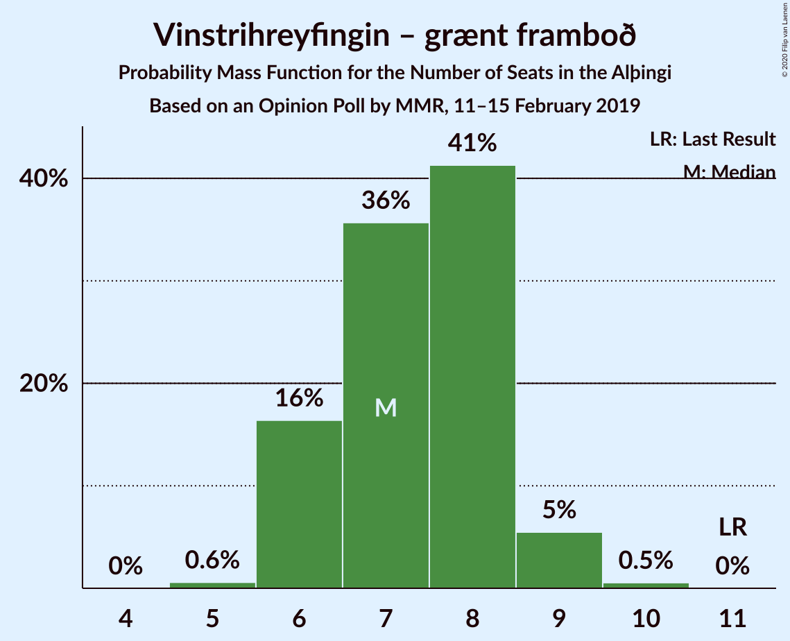
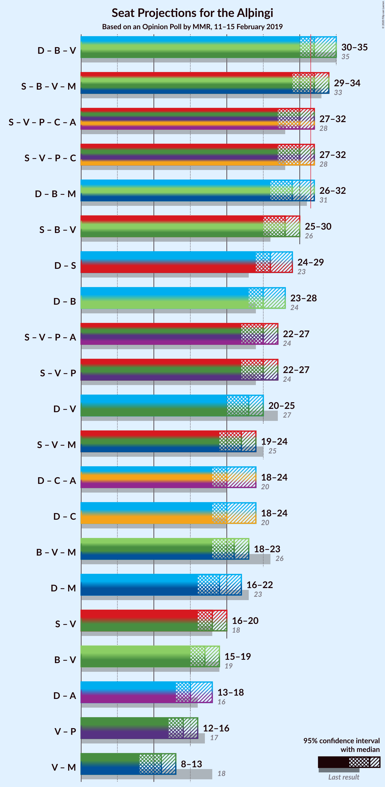
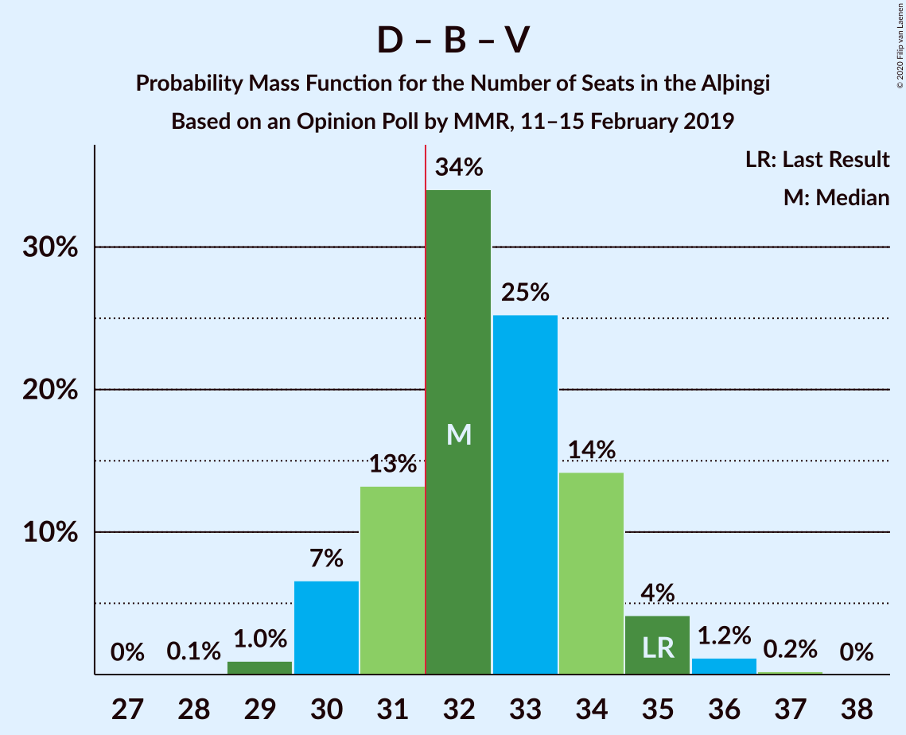
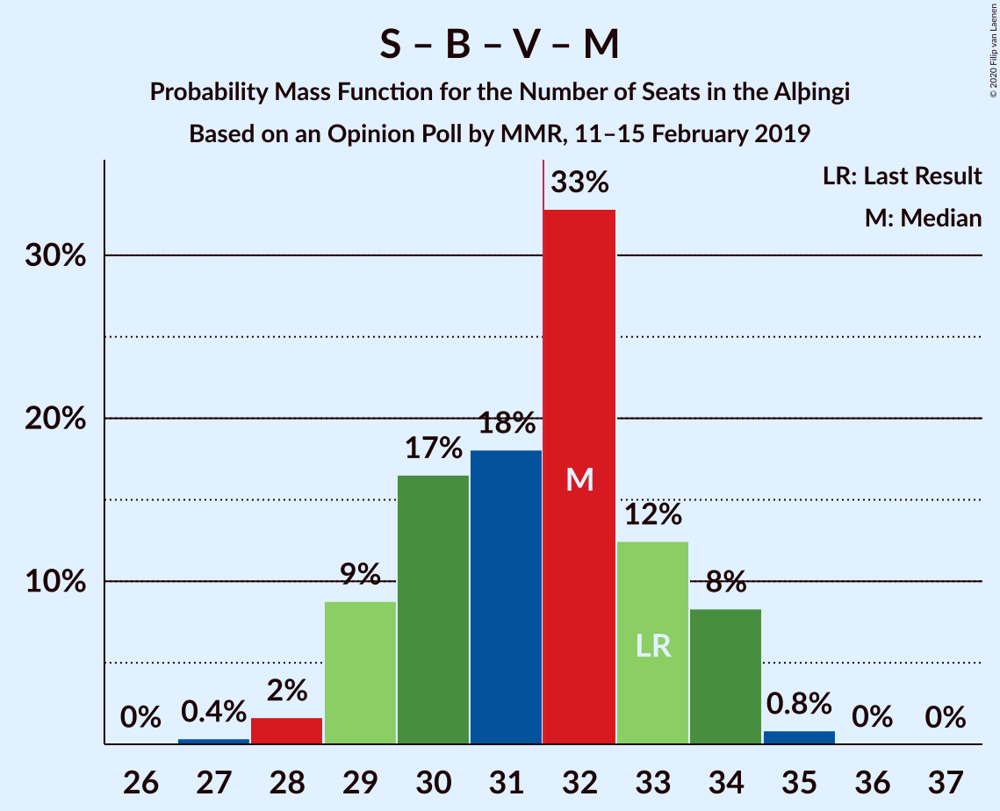
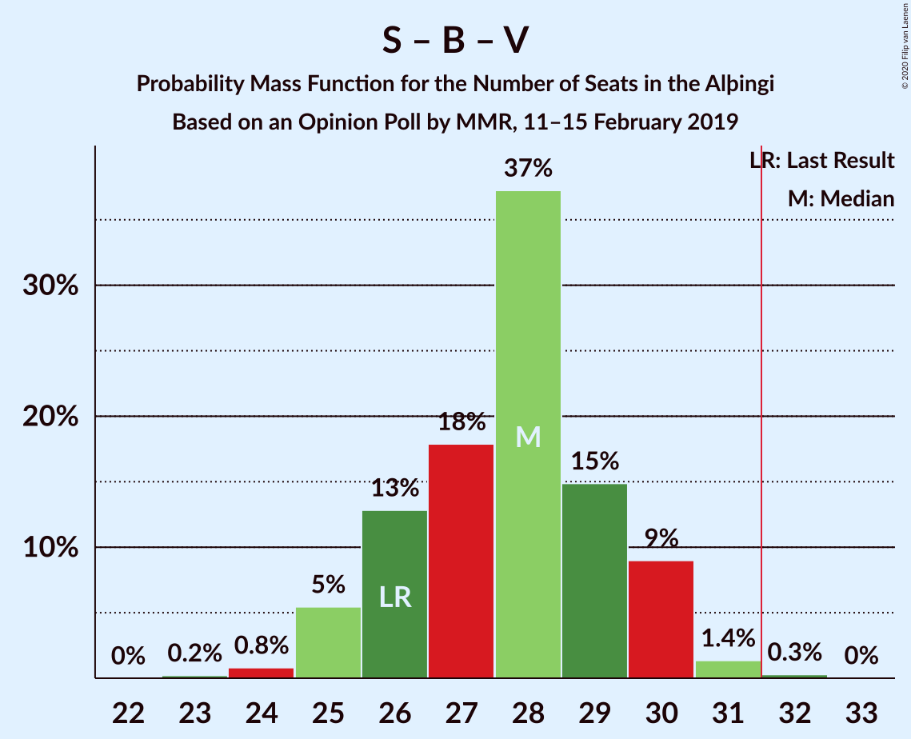
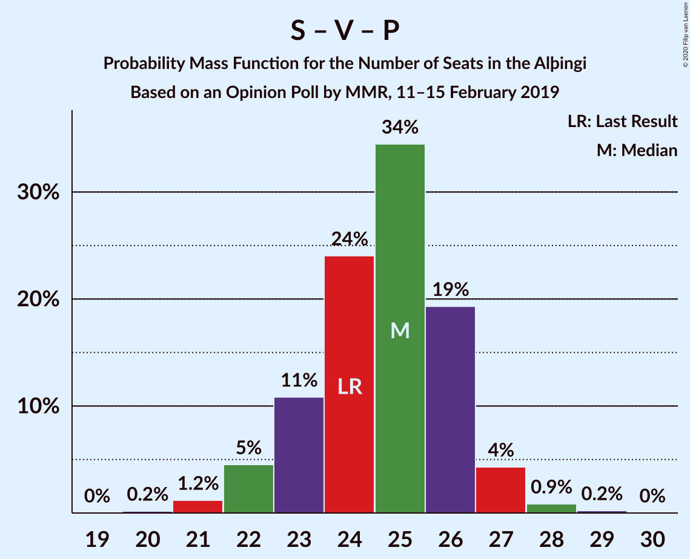

# Opinion Poll by MMR, 11–15 February 2019

<a href="#voting-intentions">Voting Intentions</a> | <a href="#seats">Seats</a> | <a href="#coalitions">Coalitions</a> | <a href="#technical-information">Technical Information</a>

## Voting Intentions

### Confidence Intervals

| Party | Last Result | Poll Result | 80% Confidence Interval | 90% Confidence Interval | 95% Confidence Interval | 99% Confidence Interval |
|:-----:|:-----------:|:-----------:|:-----------------------:|:-----------------------:|:-----------------------:|:-----------------------:|
| Sjálfstæðisflokkurinn | 25.2% | 22.7% | 21.0–24.5% |20.5–25.0% |20.1–25.5% |19.3–26.4% |
| Samfylkingin | 12.1% | 16.0% | 14.5–17.6% |14.1–18.0% |13.7–18.4% |13.1–19.2% |
| Framsóknarflokkurinn | 10.7% | 13.5% | 12.1–15.0% |11.8–15.5% |11.4–15.8% |10.8–16.6% |
| Vinstrihreyfingin – grænt framboð | 16.9% | 11.1% | 9.9–12.6% |9.6–13.0% |9.3–13.3% |8.7–14.0% |
| Píratar | 9.2% | 10.4% | 9.2–11.8% |8.9–12.2% |8.6–12.5% |8.0–13.2% |
| Viðreisn | 6.7% | 8.1% | 7.1–9.4% |6.8–9.8% |6.6–10.1% |6.1–10.7% |
| Flokkur fólksins | 6.9% | 7.0% | 6.0–8.1% |5.7–8.5% |5.5–8.8% |5.1–9.4% |
| Miðflokkurinn | 10.9% | 6.1% | 5.2–7.2% |5.0–7.5% |4.7–7.8% |4.3–8.4% |

*Note:* The poll result column reflects the actual value used in the calculations. Published results may vary slightly, and in addition be rounded to fewer digits.

## Seats

### Confidence Intervals

| Party | Last Result | Median | 80% Confidence Interval | 90% Confidence Interval | 95% Confidence Interval | 99% Confidence Interval |
|:-----:|:-----------:|:------:|:-----------------------:|:-----------------------:|:-----------------------:|:-----------------------:|
| <a href="#sjálfstæðisflokkurinn">Sjálfstæðisflokkurinn</a> | 16 | 15 | 13–17 |13–18 |13–18 |13–19 |
| <a href="#samfylkingin">Samfylkingin</a> | 7 | 10 | 9–11 |9–11 |8–12 |8–13 |
| <a href="#framsóknarflokkurinn">Framsóknarflokkurinn</a> | 8 | 9 | 8–11 |8–12 |8–12 |8–12 |
| <a href="#vinstrihreyfingin-–-grænt-framboð">Vinstrihreyfingin – grænt framboð</a> | 11 | 7 | 6–8 |6–9 |5–9 |5–9 |
| <a href="#píratar">Píratar</a> | 6 | 6 | 5–7 |5–8 |5–8 |4–8 |
| <a href="#viðreisn">Viðreisn</a> | 4 | 5 | 4–6 |4–6 |4–6 |3–7 |
| <a href="#flokkur-fólksins">Flokkur fólksins</a> | 4 | 4 | 3–5 |3–5 |3–5 |3–6 |
| <a href="#miðflokkurinn">Miðflokkurinn</a> | 7 | 4 | 3–4 |1–5 |1–5 |1–5 |

### Sjálfstæðisflokkurinn

*For a full overview of the results for this party, see the [Sjálfstæðisflokkurinn](party-sjálfstæðisflokkurinn.html) page.*

| Number of Seats | Probability | Accumulated | Special Marks |
|:---------------:|:-----------:|:-----------:|:-------------:|
| 12 | 0.1% | 100% |  |
| 13 | 13% | 99.9% |  |
| 14 | 31% | 87% |  |
| 15 | 32% | 56% | Median |
| 16 | 12% | 24% | Last Result |
| 17 | 6% | 12% |  |
| 18 | 4% | 6% |  |
| 19 | 2% | 2% |  |
| 20 | 0% | 0% |  |

### Samfylkingin

*For a full overview of the results for this party, see the [Samfylkingin](party-samfylkingin.html) page.*

| Number of Seats | Probability | Accumulated | Special Marks |
|:---------------:|:-----------:|:-----------:|:-------------:|
| 7 | 0.2% | 100% | Last Result |
| 8 | 3% | 99.8% |  |
| 9 | 11% | 97% |  |
| 10 | 53% | 86% | Median |
| 11 | 28% | 33% |  |
| 12 | 3% | 5% |  |
| 13 | 2% | 2% |  |
| 14 | 0.1% | 0.2% |  |
| 15 | 0% | 0% |  |

### Framsóknarflokkurinn

*For a full overview of the results for this party, see the [Framsóknarflokkurinn](party-framsóknarflokkurinn.html) page.*

| Number of Seats | Probability | Accumulated | Special Marks |
|:---------------:|:-----------:|:-----------:|:-------------:|
| 7 | 0.2% | 100% |  |
| 8 | 13% | 99.8% | Last Result |
| 9 | 41% | 87% | Median |
| 10 | 29% | 46% |  |
| 11 | 7% | 17% |  |
| 12 | 9% | 9% |  |
| 13 | 0.1% | 0.2% |  |
| 14 | 0.1% | 0.1% |  |
| 15 | 0% | 0% |  |

### Vinstrihreyfingin – grænt framboð

*For a full overview of the results for this party, see the [Vinstrihreyfingin – grænt framboð](party-vinstrihreyfingin–græntframboð.html) page.*

| Number of Seats | Probability | Accumulated | Special Marks |
|:---------------:|:-----------:|:-----------:|:-------------:|
| 4 | 0.1% | 100% |  |
| 5 | 3% | 99.9% |  |
| 6 | 19% | 97% |  |
| 7 | 48% | 78% | Median |
| 8 | 26% | 31% |  |
| 9 | 5% | 5% |  |
| 10 | 0.4% | 0.4% |  |
| 11 | 0% | 0% | Last Result |

### Píratar

*For a full overview of the results for this party, see the [Píratar](party-píratar.html) page.*

| Number of Seats | Probability | Accumulated | Special Marks |
|:---------------:|:-----------:|:-----------:|:-------------:|
| 4 | 0.6% | 100% |  |
| 5 | 23% | 99.4% |  |
| 6 | 41% | 76% | Last Result, Median |
| 7 | 29% | 35% |  |
| 8 | 5% | 6% |  |
| 9 | 0.4% | 0.4% |  |
| 10 | 0% | 0% |  |

### Viðreisn

*For a full overview of the results for this party, see the [Viðreisn](party-viðreisn.html) page.*

| Number of Seats | Probability | Accumulated | Special Marks |
|:---------------:|:-----------:|:-----------:|:-------------:|
| 3 | 0.6% | 100% |  |
| 4 | 18% | 99.4% | Last Result |
| 5 | 51% | 81% | Median |
| 6 | 29% | 30% |  |
| 7 | 0.9% | 0.9% |  |
| 8 | 0% | 0% |  |

### Flokkur fólksins

*For a full overview of the results for this party, see the [Flokkur fólksins](party-flokkurfólksins.html) page.*

| Number of Seats | Probability | Accumulated | Special Marks |
|:---------------:|:-----------:|:-----------:|:-------------:|
| 0 | 0.4% | 100% |  |
| 1 | 0% | 99.6% |  |
| 2 | 0% | 99.6% |  |
| 3 | 19% | 99.6% |  |
| 4 | 55% | 81% | Last Result, Median |
| 5 | 25% | 26% |  |
| 6 | 1.2% | 1.2% |  |
| 7 | 0% | 0% |  |

### Miðflokkurinn

*For a full overview of the results for this party, see the [Miðflokkurinn](party-miðflokkurinn.html) page.*

| Number of Seats | Probability | Accumulated | Special Marks |
|:---------------:|:-----------:|:-----------:|:-------------:|
| 0 | 0.1% | 100% |  |
| 1 | 5% | 99.9% |  |
| 2 | 0.1% | 95% |  |
| 3 | 37% | 95% |  |
| 4 | 51% | 58% | Median |
| 5 | 7% | 7% |  |
| 6 | 0% | 0% |  |
| 7 | 0% | 0% | Last Result |

## Coalitions

### Confidence Intervals

| Coalition | Last Result | Median | Majority? | 80% Confidence Interval | 90% Confidence Interval | 95% Confidence Interval | 99% Confidence Interval |
|:---------:|:-----------:|:------:|:---------:|:-----------------------:|:-----------------------:|:-----------------------:|:-----------------------:|
| Sjálfstæðisflokkurinn – Framsóknarflokkurinn – Vinstrihreyfingin – grænt framboð | 35 | 31 | 45% | 29–34 | 29–35 | 29–35 | 29–36 |
| Samfylkingin – Framsóknarflokkurinn – Vinstrihreyfingin – grænt framboð – Miðflokkurinn | 33 | 30 | 18% | 29–32 | 28–33 | 28–34 | 26–34 |
| Sjálfstæðisflokkurinn – Framsóknarflokkurinn – Miðflokkurinn | 31 | 28 | 5% | 26–30 | 26–31 | 26–32 | 25–33 |
| Samfylkingin – Vinstrihreyfingin – grænt framboð – Píratar – Viðreisn | 28 | 29 | 4% | 27–31 | 25–31 | 25–32 | 24–33 |
| Samfylkingin – Framsóknarflokkurinn – Vinstrihreyfingin – grænt framboð | 26 | 27 | 0.1% | 25–29 | 25–30 | 24–30 | 22–30 |
| Sjálfstæðisflokkurinn – Framsóknarflokkurinn | 24 | 24 | 0% | 23–27 | 22–28 | 22–29 | 22–29 |
| Sjálfstæðisflokkurinn – Samfylkingin | 23 | 25 | 0% | 23–27 | 23–28 | 23–28 | 22–29 |
| Samfylkingin – Vinstrihreyfingin – grænt framboð – Píratar | 24 | 23 | 0% | 22–25 | 21–26 | 21–27 | 20–28 |
| Sjálfstæðisflokkurinn – Vinstrihreyfingin – grænt framboð | 27 | 22 | 0% | 20–24 | 20–25 | 19–25 | 18–26 |
| Samfylkingin – Vinstrihreyfingin – grænt framboð – Miðflokkurinn | 25 | 21 | 0% | 19–22 | 19–23 | 18–24 | 17–25 |
| Sjálfstæðisflokkurinn – Viðreisn | 20 | 20 | 0% | 18–22 | 18–23 | 18–24 | 17–24 |
| Framsóknarflokkurinn – Vinstrihreyfingin – grænt framboð – Miðflokkurinn | 26 | 20 | 0% | 19–22 | 18–22 | 17–23 | 17–23 |
| Sjálfstæðisflokkurinn – Miðflokkurinn | 23 | 18 | 0% | 17–21 | 16–21 | 16–22 | 15–23 |
| Samfylkingin – Vinstrihreyfingin – grænt framboð | 18 | 17 | 0% | 16–19 | 15–20 | 15–20 | 14–21 |
| Framsóknarflokkurinn – Vinstrihreyfingin – grænt framboð | 19 | 17 | 0% | 15–18 | 15–19 | 14–19 | 14–20 |
| Vinstrihreyfingin – grænt framboð – Píratar | 17 | 13 | 0% | 12–15 | 11–15 | 11–16 | 10–16 |
| Vinstrihreyfingin – grænt framboð – Miðflokkurinn | 18 | 11 | 0% | 9–12 | 9–13 | 8–13 | 7–14 |

### Sjálfstæðisflokkurinn – Framsóknarflokkurinn – Vinstrihreyfingin – grænt framboð

| Number of Seats | Probability | Accumulated | Special Marks |
|:---------------:|:-----------:|:-----------:|:-------------:|
| 28 | 0.3% | 100% |  |
| 29 | 12% | 99.7% |  |
| 30 | 13% | 87% |  |
| 31 | 28% | 74% | Median |
| 32 | 18% | 45% | Majority |
| 33 | 12% | 27% |  |
| 34 | 9% | 15% |  |
| 35 | 6% | 7% | Last Result |
| 36 | 1.0% | 1.0% |  |
| 37 | 0% | 0.1% |  |
| 38 | 0% | 0% |  |

### Samfylkingin – Framsóknarflokkurinn – Vinstrihreyfingin – grænt framboð – Miðflokkurinn

| Number of Seats | Probability | Accumulated | Special Marks |
|:---------------:|:-----------:|:-----------:|:-------------:|
| 26 | 0.8% | 100% |  |
| 27 | 1.4% | 99.1% |  |
| 28 | 7% | 98% |  |
| 29 | 7% | 91% |  |
| 30 | 38% | 84% | Median |
| 31 | 27% | 46% |  |
| 32 | 10% | 18% | Majority |
| 33 | 5% | 8% | Last Result |
| 34 | 3% | 3% |  |
| 35 | 0.2% | 0.2% |  |
| 36 | 0% | 0% |  |

### Sjálfstæðisflokkurinn – Framsóknarflokkurinn – Miðflokkurinn

| Number of Seats | Probability | Accumulated | Special Marks |
|:---------------:|:-----------:|:-----------:|:-------------:|
| 23 | 0.1% | 100% |  |
| 24 | 0.2% | 99.9% |  |
| 25 | 2% | 99.8% |  |
| 26 | 12% | 98% |  |
| 27 | 32% | 86% |  |
| 28 | 26% | 54% | Median |
| 29 | 9% | 28% |  |
| 30 | 10% | 19% |  |
| 31 | 4% | 9% | Last Result |
| 32 | 4% | 5% | Majority |
| 33 | 0.8% | 1.1% |  |
| 34 | 0.2% | 0.2% |  |
| 35 | 0% | 0% |  |

### Samfylkingin – Vinstrihreyfingin – grænt framboð – Píratar – Viðreisn

| Number of Seats | Probability | Accumulated | Special Marks |
|:---------------:|:-----------:|:-----------:|:-------------:|
| 23 | 0.1% | 100% |  |
| 24 | 0.7% | 99.9% |  |
| 25 | 4% | 99.2% |  |
| 26 | 2% | 95% |  |
| 27 | 15% | 92% |  |
| 28 | 19% | 77% | Last Result, Median |
| 29 | 34% | 58% |  |
| 30 | 13% | 24% |  |
| 31 | 8% | 11% |  |
| 32 | 2% | 4% | Majority |
| 33 | 1.3% | 1.4% |  |
| 34 | 0.1% | 0.1% |  |
| 35 | 0% | 0% |  |

### Samfylkingin – Framsóknarflokkurinn – Vinstrihreyfingin – grænt framboð

| Number of Seats | Probability | Accumulated | Special Marks |
|:---------------:|:-----------:|:-----------:|:-------------:|
| 22 | 0.6% | 100% |  |
| 23 | 2% | 99.4% |  |
| 24 | 1.4% | 98% |  |
| 25 | 9% | 96% |  |
| 26 | 28% | 87% | Last Result, Median |
| 27 | 28% | 59% |  |
| 28 | 18% | 32% |  |
| 29 | 7% | 13% |  |
| 30 | 6% | 7% |  |
| 31 | 0.3% | 0.4% |  |
| 32 | 0.1% | 0.1% | Majority |
| 33 | 0% | 0% |  |

### Sjálfstæðisflokkurinn – Framsóknarflokkurinn

| Number of Seats | Probability | Accumulated | Special Marks |
|:---------------:|:-----------:|:-----------:|:-------------:|
| 21 | 0.2% | 100% |  |
| 22 | 9% | 99.8% |  |
| 23 | 17% | 91% |  |
| 24 | 41% | 74% | Last Result, Median |
| 25 | 11% | 34% |  |
| 26 | 8% | 23% |  |
| 27 | 9% | 14% |  |
| 28 | 1.5% | 6% |  |
| 29 | 4% | 4% |  |
| 30 | 0.3% | 0.3% |  |
| 31 | 0% | 0% |  |

### Sjálfstæðisflokkurinn – Samfylkingin

| Number of Seats | Probability | Accumulated | Special Marks |
|:---------------:|:-----------:|:-----------:|:-------------:|
| 21 | 0.2% | 100% |  |
| 22 | 1.1% | 99.8% |  |
| 23 | 11% | 98.7% | Last Result |
| 24 | 24% | 88% |  |
| 25 | 31% | 64% | Median |
| 26 | 16% | 33% |  |
| 27 | 12% | 18% |  |
| 28 | 4% | 6% |  |
| 29 | 2% | 2% |  |
| 30 | 0.2% | 0.2% |  |
| 31 | 0% | 0% |  |

### Samfylkingin – Vinstrihreyfingin – grænt framboð – Píratar

| Number of Seats | Probability | Accumulated | Special Marks |
|:---------------:|:-----------:|:-----------:|:-------------:|
| 19 | 0.4% | 100% |  |
| 20 | 2% | 99.6% |  |
| 21 | 5% | 98% |  |
| 22 | 18% | 93% |  |
| 23 | 25% | 75% | Median |
| 24 | 26% | 50% | Last Result |
| 25 | 17% | 24% |  |
| 26 | 4% | 7% |  |
| 27 | 2% | 3% |  |
| 28 | 1.2% | 1.2% |  |
| 29 | 0.1% | 0.1% |  |
| 30 | 0% | 0% |  |

### Sjálfstæðisflokkurinn – Vinstrihreyfingin – grænt framboð

| Number of Seats | Probability | Accumulated | Special Marks |
|:---------------:|:-----------:|:-----------:|:-------------:|
| 18 | 0.8% | 100% |  |
| 19 | 3% | 99.2% |  |
| 20 | 11% | 96% |  |
| 21 | 26% | 85% |  |
| 22 | 25% | 59% | Median |
| 23 | 17% | 34% |  |
| 24 | 10% | 17% |  |
| 25 | 6% | 7% |  |
| 26 | 1.1% | 1.2% |  |
| 27 | 0.1% | 0.1% | Last Result |
| 28 | 0% | 0% |  |

### Samfylkingin – Vinstrihreyfingin – grænt framboð – Miðflokkurinn

| Number of Seats | Probability | Accumulated | Special Marks |
|:---------------:|:-----------:|:-----------:|:-------------:|
| 16 | 0.1% | 100% |  |
| 17 | 0.8% | 99.9% |  |
| 18 | 3% | 99.1% |  |
| 19 | 12% | 96% |  |
| 20 | 17% | 84% |  |
| 21 | 39% | 67% | Median |
| 22 | 19% | 28% |  |
| 23 | 6% | 9% |  |
| 24 | 3% | 3% |  |
| 25 | 0.5% | 0.5% | Last Result |
| 26 | 0% | 0% |  |

### Sjálfstæðisflokkurinn – Viðreisn

| Number of Seats | Probability | Accumulated | Special Marks |
|:---------------:|:-----------:|:-----------:|:-------------:|
| 17 | 1.3% | 100% |  |
| 18 | 13% | 98.6% |  |
| 19 | 28% | 86% |  |
| 20 | 26% | 58% | Last Result, Median |
| 21 | 20% | 32% |  |
| 22 | 5% | 12% |  |
| 23 | 2% | 7% |  |
| 24 | 4% | 5% |  |
| 25 | 0.3% | 0.3% |  |
| 26 | 0% | 0% |  |

### Framsóknarflokkurinn – Vinstrihreyfingin – grænt framboð – Miðflokkurinn

| Number of Seats | Probability | Accumulated | Special Marks |
|:---------------:|:-----------:|:-----------:|:-------------:|
| 16 | 0.1% | 100% |  |
| 17 | 3% | 99.8% |  |
| 18 | 5% | 97% |  |
| 19 | 11% | 92% |  |
| 20 | 49% | 81% | Median |
| 21 | 15% | 32% |  |
| 22 | 13% | 17% |  |
| 23 | 4% | 4% |  |
| 24 | 0.4% | 0.4% |  |
| 25 | 0% | 0.1% |  |
| 26 | 0% | 0% | Last Result |

### Sjálfstæðisflokkurinn – Miðflokkurinn

| Number of Seats | Probability | Accumulated | Special Marks |
|:---------------:|:-----------:|:-----------:|:-------------:|
| 14 | 0.2% | 100% |  |
| 15 | 0.8% | 99.8% |  |
| 16 | 4% | 99.0% |  |
| 17 | 24% | 95% |  |
| 18 | 27% | 71% |  |
| 19 | 26% | 44% | Median |
| 20 | 7% | 18% |  |
| 21 | 8% | 11% |  |
| 22 | 2% | 4% |  |
| 23 | 2% | 2% | Last Result |
| 24 | 0% | 0% |  |

### Samfylkingin – Vinstrihreyfingin – grænt framboð

| Number of Seats | Probability | Accumulated | Special Marks |
|:---------------:|:-----------:|:-----------:|:-------------:|
| 13 | 0.1% | 100% |  |
| 14 | 2% | 99.9% |  |
| 15 | 4% | 98% |  |
| 16 | 15% | 94% |  |
| 17 | 36% | 79% | Median |
| 18 | 32% | 43% | Last Result |
| 19 | 5% | 12% |  |
| 20 | 5% | 6% |  |
| 21 | 1.1% | 1.1% |  |
| 22 | 0% | 0.1% |  |
| 23 | 0% | 0% |  |

### Framsóknarflokkurinn – Vinstrihreyfingin – grænt framboð

| Number of Seats | Probability | Accumulated | Special Marks |
|:---------------:|:-----------:|:-----------:|:-------------:|
| 13 | 0.4% | 100% |  |
| 14 | 4% | 99.6% |  |
| 15 | 7% | 95% |  |
| 16 | 39% | 89% | Median |
| 17 | 24% | 50% |  |
| 18 | 17% | 26% |  |
| 19 | 8% | 9% | Last Result |
| 20 | 0.6% | 0.7% |  |
| 21 | 0.1% | 0.1% |  |
| 22 | 0% | 0% |  |

### Vinstrihreyfingin – grænt framboð – Píratar

| Number of Seats | Probability | Accumulated | Special Marks |
|:---------------:|:-----------:|:-----------:|:-------------:|
| 9 | 0.1% | 100% |  |
| 10 | 1.3% | 99.9% |  |
| 11 | 6% | 98.7% |  |
| 12 | 15% | 93% |  |
| 13 | 36% | 78% | Median |
| 14 | 27% | 42% |  |
| 15 | 12% | 14% |  |
| 16 | 2% | 3% |  |
| 17 | 0.4% | 0.4% | Last Result |
| 18 | 0% | 0% |  |

### Vinstrihreyfingin – grænt framboð – Miðflokkurinn

| Number of Seats | Probability | Accumulated | Special Marks |
|:---------------:|:-----------:|:-----------:|:-------------:|
| 6 | 0.1% | 100% |  |
| 7 | 0.6% | 99.9% |  |
| 8 | 3% | 99.3% |  |
| 9 | 12% | 96% |  |
| 10 | 21% | 84% |  |
| 11 | 47% | 63% | Median |
| 12 | 11% | 17% |  |
| 13 | 5% | 5% |  |
| 14 | 0.6% | 0.7% |  |
| 15 | 0% | 0% |  |
| 16 | 0% | 0% |  |
| 17 | 0% | 0% |  |
| 18 | 0% | 0% | Last Result |

## Technical Information

### Opinion Poll

+ **Polling firm:** MMR
+ **Commissioner(s):** —
+ **Fieldwork period:** 11–15 February 2019

### Calculations

+ **Sample size:** 934
+ **Simulations done:** 131,072
+ **Error estimate:** 2.24%

