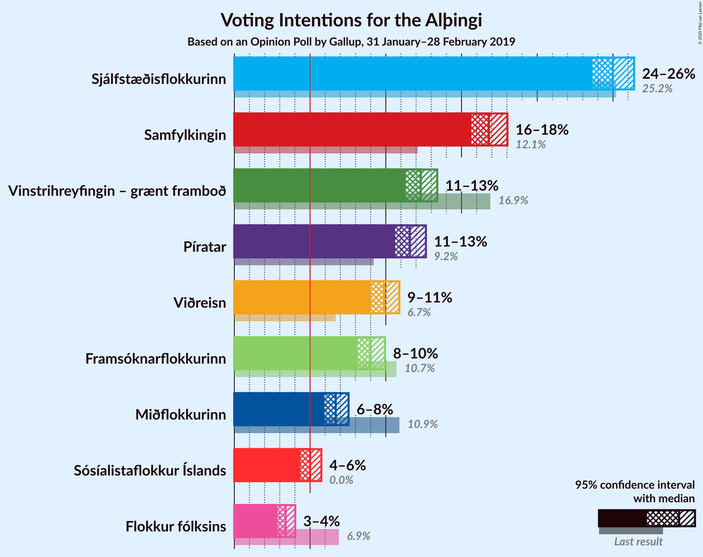
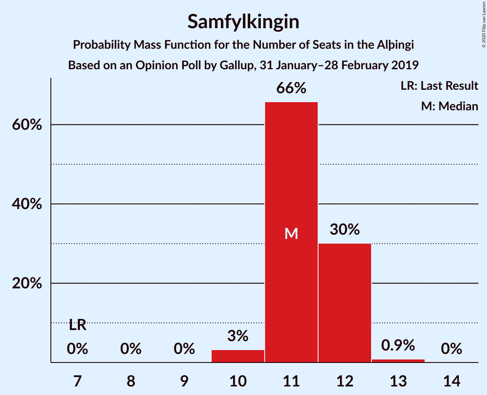

# Opinion Poll by Gallup, 31 January–28 February 2019

<a href="#voting-intentions">Voting Intentions</a> | <a href="#seats">Seats</a> | <a href="#coalitions">Coalitions</a> | <a href="#technical-information">Technical Information</a>

## Voting Intentions

### Confidence Intervals

| Party | Last Result | Poll Result | 80% Confidence Interval | 90% Confidence Interval | 95% Confidence Interval | 99% Confidence Interval |
|:-----:|:-----------:|:-----------:|:-----------------------:|:-----------------------:|:-----------------------:|:-----------------------:|
| Sjálfstæðisflokkurinn | 25.2% | 25.0% | 24.1–25.9% |23.9–26.2% |23.6–26.4% |23.2–26.8% |
| Samfylkingin | 12.1% | 16.8% | 16.0–17.6% |15.8–17.8% |15.7–18.0% |15.3–18.4% |
| Vinstrihreyfingin – grænt framboð | 16.9% | 12.3% | 11.6–13.0% |11.5–13.2% |11.3–13.4% |11.0–13.7% |
| Píratar | 9.2% | 11.6% | 11.0–12.3% |10.8–12.5% |10.6–12.7% |10.3–13.0% |
| Viðreisn | 6.7% | 9.9% | 9.3–10.5% |9.1–10.7% |9.0–10.9% |8.7–11.2% |
| Framsóknarflokkurinn | 10.7% | 9.0% | 8.4–9.6% |8.3–9.8% |8.1–10.0% |7.9–10.3% |
| Miðflokkurinn | 10.9% | 6.7% | 6.2–7.3% |6.1–7.4% |5.9–7.5% |5.7–7.8% |
| Flokkur fólksins | 6.9% | 3.4% | 3.0–3.8% |2.9–3.9% |2.8–4.0% |2.7–4.2% |

*Note:* The poll result column reflects the actual value used in the calculations. Published results may vary slightly, and in addition be rounded to fewer digits.

## Seats

### Confidence Intervals

| Party | Last Result | Median | 80% Confidence Interval | 90% Confidence Interval | 95% Confidence Interval | 99% Confidence Interval |
|:-----:|:-----------:|:------:|:-----------------------:|:-----------------------:|:-----------------------:|:-----------------------:|
| <a href="#sjálfstæðisflokkurinn">Sjálfstæðisflokkurinn</a> | 16 | 18 | 17–18 |16–19 |16–19 |16–19 |
| <a href="#samfylkingin">Samfylkingin</a> | 7 | 11 | 10–12 |10–12 |10–12 |10–13 |
| <a href="#vinstrihreyfingin-–-grænt-framboð">Vinstrihreyfingin – grænt framboð</a> | 11 | 8 | 7–9 |7–9 |7–9 |7–10 |
| <a href="#píratar">Píratar</a> | 6 | 8 | 7–8 |7–8 |7–8 |6–9 |
| <a href="#viðreisn">Viðreisn</a> | 4 | 6 | 6–7 |6–7 |6–7 |5–7 |
| <a href="#framsóknarflokkurinn">Framsóknarflokkurinn</a> | 8 | 6 | 5–6 |5–6 |5–7 |5–8 |
| <a href="#miðflokkurinn">Miðflokkurinn</a> | 7 | 4 | 4–5 |4–5 |4–5 |3–5 |
| <a href="#flokkur-fólksins">Flokkur fólksins</a> | 4 | 0 | 0 |0 |0 |0 |

### Sjálfstæðisflokkurinn

*For a full overview of the results for this party, see the [Sjálfstæðisflokkurinn](party-sjálfstæðisflokkurinn.html) page.*

| Number of Seats | Probability | Accumulated | Special Marks |
|:---------------:|:-----------:|:-----------:|:-------------:|
| 15 | 0.5% | 100% |  |
| 16 | 6% | 99.5% | Last Result |
| 17 | 41% | 93% |  |
| 18 | 43% | 52% | Median |
| 19 | 9% | 9% |  |
| 20 | 0% | 0% |  |

### Samfylkingin

*For a full overview of the results for this party, see the [Samfylkingin](party-samfylkingin.html) page.*

| Number of Seats | Probability | Accumulated | Special Marks |
|:---------------:|:-----------:|:-----------:|:-------------:|
| 7 | 0% | 100% | Last Result |
| 8 | 0% | 100% |  |
| 9 | 0% | 100% |  |
| 10 | 15% | 100% |  |
| 11 | 61% | 85% | Median |
| 12 | 22% | 25% |  |
| 13 | 2% | 2% |  |
| 14 | 0% | 0% |  |

### Vinstrihreyfingin – grænt framboð

*For a full overview of the results for this party, see the [Vinstrihreyfingin – grænt framboð](party-vinstrihreyfingin–græntframboð.html) page.*

| Number of Seats | Probability | Accumulated | Special Marks |
|:---------------:|:-----------:|:-----------:|:-------------:|
| 7 | 16% | 100% |  |
| 8 | 56% | 84% | Median |
| 9 | 28% | 28% |  |
| 10 | 0.6% | 0.6% |  |
| 11 | 0% | 0% | Last Result |

### Píratar

*For a full overview of the results for this party, see the [Píratar](party-píratar.html) page.*

| Number of Seats | Probability | Accumulated | Special Marks |
|:---------------:|:-----------:|:-----------:|:-------------:|
| 6 | 1.1% | 100% | Last Result |
| 7 | 31% | 98.9% |  |
| 8 | 65% | 67% | Median |
| 9 | 2% | 2% |  |
| 10 | 0% | 0% |  |

### Viðreisn

*For a full overview of the results for this party, see the [Viðreisn](party-viðreisn.html) page.*

| Number of Seats | Probability | Accumulated | Special Marks |
|:---------------:|:-----------:|:-----------:|:-------------:|
| 4 | 0% | 100% | Last Result |
| 5 | 1.3% | 100% |  |
| 6 | 59% | 98.7% | Median |
| 7 | 39% | 39% |  |
| 8 | 0.2% | 0.2% |  |
| 9 | 0% | 0% |  |

### Framsóknarflokkurinn

*For a full overview of the results for this party, see the [Framsóknarflokkurinn](party-framsóknarflokkurinn.html) page.*

| Number of Seats | Probability | Accumulated | Special Marks |
|:---------------:|:-----------:|:-----------:|:-------------:|
| 4 | 0.1% | 100% |  |
| 5 | 31% | 99.9% |  |
| 6 | 65% | 69% | Median |
| 7 | 3% | 3% |  |
| 8 | 0.6% | 0.6% | Last Result |
| 9 | 0% | 0% |  |

### Miðflokkurinn

*For a full overview of the results for this party, see the [Miðflokkurinn](party-miðflokkurinn.html) page.*

| Number of Seats | Probability | Accumulated | Special Marks |
|:---------------:|:-----------:|:-----------:|:-------------:|
| 3 | 1.5% | 100% |  |
| 4 | 85% | 98.5% | Median |
| 5 | 13% | 14% |  |
| 6 | 0% | 0% |  |
| 7 | 0% | 0% | Last Result |

### Flokkur fólksins

*For a full overview of the results for this party, see the [Flokkur fólksins](party-flokkurfólksins.html) page.*

| Number of Seats | Probability | Accumulated | Special Marks |
|:---------------:|:-----------:|:-----------:|:-------------:|
| 0 | 100% | 100% | Median |
| 1 | 0% | 0% |  |
| 2 | 0% | 0% |  |
| 3 | 0% | 0% |  |
| 4 | 0% | 0% | Last Result |

## Coalitions

### Confidence Intervals

| Coalition | Last Result | Median | Majority? | 80% Confidence Interval | 90% Confidence Interval | 95% Confidence Interval | 99% Confidence Interval |
|:---------:|:-----------:|:------:|:---------:|:-----------------------:|:-----------------------:|:-----------------------:|:-----------------------:|
| Samfylkingin – Vinstrihreyfingin – grænt framboð – Píratar – Viðreisn | 28 | 33 | 96% | 32–35 | 32–35 | 31–36 | 31–36 |
| Sjálfstæðisflokkurinn – Vinstrihreyfingin – grænt framboð – Framsóknarflokkurinn | 35 | 31 | 43% | 30–33 | 30–33 | 30–33 | 29–34 |
| Samfylkingin – Vinstrihreyfingin – grænt framboð – Framsóknarflokkurinn – Miðflokkurinn | 33 | 29 | 1.2% | 28–31 | 28–31 | 27–31 | 27–32 |
| Sjálfstæðisflokkurinn – Samfylkingin | 23 | 29 | 0% | 27–30 | 27–30 | 27–30 | 26–31 |
| Sjálfstæðisflokkurinn – Framsóknarflokkurinn – Miðflokkurinn | 31 | 27 | 0% | 26–29 | 26–29 | 26–29 | 25–30 |
| Samfylkingin – Vinstrihreyfingin – grænt framboð – Píratar | 24 | 27 | 0% | 26–28 | 25–29 | 25–29 | 24–29 |
| Sjálfstæðisflokkurinn – Vinstrihreyfingin – grænt framboð | 27 | 26 | 0% | 25–27 | 24–27 | 24–27 | 24–28 |
| Samfylkingin – Vinstrihreyfingin – grænt framboð – Framsóknarflokkurinn | 26 | 25 | 0% | 24–26 | 24–27 | 23–27 | 23–27 |
| Sjálfstæðisflokkurinn – Framsóknarflokkurinn | 24 | 23 | 0% | 22–24 | 22–25 | 22–25 | 21–25 |
| Samfylkingin – Vinstrihreyfingin – grænt framboð – Miðflokkurinn | 25 | 23 | 0% | 22–25 | 22–25 | 22–25 | 21–26 |
| Sjálfstæðisflokkurinn – Viðreisn | 20 | 24 | 0% | 23–25 | 23–25 | 22–25 | 22–26 |
| Sjálfstæðisflokkurinn – Miðflokkurinn | 23 | 22 | 0% | 21–23 | 20–23 | 20–23 | 20–24 |
| Samfylkingin – Vinstrihreyfingin – grænt framboð | 18 | 19 | 0% | 18–20 | 18–21 | 18–21 | 17–21 |
| Vinstrihreyfingin – grænt framboð – Framsóknarflokkurinn – Miðflokkurinn | 26 | 18 | 0% | 17–19 | 17–19 | 16–20 | 16–20 |
| Vinstrihreyfingin – grænt framboð – Píratar | 17 | 16 | 0% | 15–17 | 15–17 | 15–17 | 14–18 |
| Vinstrihreyfingin – grænt framboð – Framsóknarflokkurinn | 19 | 14 | 0% | 13–15 | 13–15 | 13–15 | 12–16 |
| Vinstrihreyfingin – grænt framboð – Miðflokkurinn | 18 | 12 | 0% | 11–13 | 11–13 | 11–14 | 11–14 |

### Samfylkingin – Vinstrihreyfingin – grænt framboð – Píratar – Viðreisn

| Number of Seats | Probability | Accumulated | Special Marks |
|:---------------:|:-----------:|:-----------:|:-------------:|
| 28 | 0% | 100% | Last Result |
| 29 | 0% | 100% |  |
| 30 | 0.4% | 100% |  |
| 31 | 4% | 99.6% |  |
| 32 | 24% | 96% | Majority |
| 33 | 29% | 72% | Median |
| 34 | 26% | 43% |  |
| 35 | 13% | 17% |  |
| 36 | 5% | 5% |  |
| 37 | 0.1% | 0.1% |  |
| 38 | 0% | 0% |  |

### Sjálfstæðisflokkurinn – Vinstrihreyfingin – grænt framboð – Framsóknarflokkurinn

| Number of Seats | Probability | Accumulated | Special Marks |
|:---------------:|:-----------:|:-----------:|:-------------:|
| 29 | 0.6% | 100% |  |
| 30 | 18% | 99.4% |  |
| 31 | 39% | 81% |  |
| 32 | 27% | 43% | Median, Majority |
| 33 | 15% | 16% |  |
| 34 | 0.7% | 0.7% |  |
| 35 | 0% | 0% | Last Result |

### Samfylkingin – Vinstrihreyfingin – grænt framboð – Framsóknarflokkurinn – Miðflokkurinn

| Number of Seats | Probability | Accumulated | Special Marks |
|:---------------:|:-----------:|:-----------:|:-------------:|
| 26 | 0.2% | 100% |  |
| 27 | 4% | 99.8% |  |
| 28 | 30% | 96% |  |
| 29 | 32% | 66% | Median |
| 30 | 19% | 33% |  |
| 31 | 13% | 14% |  |
| 32 | 1.1% | 1.2% | Majority |
| 33 | 0.1% | 0.1% | Last Result |
| 34 | 0% | 0% |  |

### Sjálfstæðisflokkurinn – Samfylkingin

| Number of Seats | Probability | Accumulated | Special Marks |
|:---------------:|:-----------:|:-----------:|:-------------:|
| 23 | 0% | 100% | Last Result |
| 24 | 0% | 100% |  |
| 25 | 0% | 100% |  |
| 26 | 0.7% | 100% |  |
| 27 | 10% | 99.3% |  |
| 28 | 30% | 89% |  |
| 29 | 42% | 59% | Median |
| 30 | 16% | 17% |  |
| 31 | 1.4% | 1.4% |  |
| 32 | 0% | 0% | Majority |

### Sjálfstæðisflokkurinn – Framsóknarflokkurinn – Miðflokkurinn

| Number of Seats | Probability | Accumulated | Special Marks |
|:---------------:|:-----------:|:-----------:|:-------------:|
| 25 | 0.9% | 100% |  |
| 26 | 20% | 99.1% |  |
| 27 | 32% | 79% |  |
| 28 | 35% | 47% | Median |
| 29 | 12% | 13% |  |
| 30 | 0.8% | 0.8% |  |
| 31 | 0% | 0% | Last Result |

### Samfylkingin – Vinstrihreyfingin – grænt framboð – Píratar

| Number of Seats | Probability | Accumulated | Special Marks |
|:---------------:|:-----------:|:-----------:|:-------------:|
| 24 | 0.5% | 100% | Last Result |
| 25 | 5% | 99.5% |  |
| 26 | 29% | 95% |  |
| 27 | 40% | 66% | Median |
| 28 | 19% | 26% |  |
| 29 | 7% | 7% |  |
| 30 | 0.3% | 0.3% |  |
| 31 | 0% | 0% |  |

### Sjálfstæðisflokkurinn – Vinstrihreyfingin – grænt framboð

| Number of Seats | Probability | Accumulated | Special Marks |
|:---------------:|:-----------:|:-----------:|:-------------:|
| 23 | 0.3% | 100% |  |
| 24 | 6% | 99.7% |  |
| 25 | 42% | 94% |  |
| 26 | 31% | 52% | Median |
| 27 | 20% | 21% | Last Result |
| 28 | 0.9% | 0.9% |  |
| 29 | 0% | 0% |  |

### Samfylkingin – Vinstrihreyfingin – grænt framboð – Framsóknarflokkurinn

| Number of Seats | Probability | Accumulated | Special Marks |
|:---------------:|:-----------:|:-----------:|:-------------:|
| 22 | 0.2% | 100% |  |
| 23 | 4% | 99.8% |  |
| 24 | 31% | 95% |  |
| 25 | 35% | 64% | Median |
| 26 | 21% | 29% | Last Result |
| 27 | 8% | 8% |  |
| 28 | 0.4% | 0.4% |  |
| 29 | 0% | 0% |  |

### Sjálfstæðisflokkurinn – Framsóknarflokkurinn

| Number of Seats | Probability | Accumulated | Special Marks |
|:---------------:|:-----------:|:-----------:|:-------------:|
| 20 | 0.1% | 100% |  |
| 21 | 1.1% | 99.9% |  |
| 22 | 20% | 98.8% |  |
| 23 | 36% | 79% |  |
| 24 | 36% | 42% | Last Result, Median |
| 25 | 6% | 6% |  |
| 26 | 0.1% | 0.1% |  |
| 27 | 0% | 0% |  |

### Samfylkingin – Vinstrihreyfingin – grænt framboð – Miðflokkurinn

| Number of Seats | Probability | Accumulated | Special Marks |
|:---------------:|:-----------:|:-----------:|:-------------:|
| 21 | 2% | 100% |  |
| 22 | 18% | 98% |  |
| 23 | 37% | 80% | Median |
| 24 | 29% | 44% |  |
| 25 | 13% | 14% | Last Result |
| 26 | 1.2% | 1.3% |  |
| 27 | 0.1% | 0.1% |  |
| 28 | 0% | 0% |  |

### Sjálfstæðisflokkurinn – Viðreisn

| Number of Seats | Probability | Accumulated | Special Marks |
|:---------------:|:-----------:|:-----------:|:-------------:|
| 20 | 0% | 100% | Last Result |
| 21 | 0.3% | 100% |  |
| 22 | 3% | 99.7% |  |
| 23 | 22% | 96% |  |
| 24 | 54% | 74% | Median |
| 25 | 20% | 21% |  |
| 26 | 1.1% | 1.1% |  |
| 27 | 0% | 0% |  |

### Sjálfstæðisflokkurinn – Miðflokkurinn

| Number of Seats | Probability | Accumulated | Special Marks |
|:---------------:|:-----------:|:-----------:|:-------------:|
| 19 | 0.4% | 100% |  |
| 20 | 6% | 99.6% |  |
| 21 | 36% | 93% |  |
| 22 | 41% | 57% | Median |
| 23 | 16% | 16% | Last Result |
| 24 | 0.6% | 0.6% |  |
| 25 | 0% | 0% |  |

### Samfylkingin – Vinstrihreyfingin – grænt framboð

| Number of Seats | Probability | Accumulated | Special Marks |
|:---------------:|:-----------:|:-----------:|:-------------:|
| 17 | 2% | 100% |  |
| 18 | 19% | 98% | Last Result |
| 19 | 39% | 79% | Median |
| 20 | 31% | 40% |  |
| 21 | 8% | 8% |  |
| 22 | 0.5% | 0.5% |  |
| 23 | 0% | 0% |  |

### Vinstrihreyfingin – grænt framboð – Framsóknarflokkurinn – Miðflokkurinn

| Number of Seats | Probability | Accumulated | Special Marks |
|:---------------:|:-----------:|:-----------:|:-------------:|
| 15 | 0.1% | 100% |  |
| 16 | 2% | 99.9% |  |
| 17 | 32% | 97% |  |
| 18 | 34% | 65% | Median |
| 19 | 27% | 31% |  |
| 20 | 4% | 4% |  |
| 21 | 0.1% | 0.1% |  |
| 22 | 0% | 0% |  |
| 23 | 0% | 0% |  |
| 24 | 0% | 0% |  |
| 25 | 0% | 0% |  |
| 26 | 0% | 0% | Last Result |

### Vinstrihreyfingin – grænt framboð – Píratar

| Number of Seats | Probability | Accumulated | Special Marks |
|:---------------:|:-----------:|:-----------:|:-------------:|
| 13 | 0.2% | 100% |  |
| 14 | 2% | 99.8% |  |
| 15 | 28% | 98% |  |
| 16 | 56% | 70% | Median |
| 17 | 13% | 14% | Last Result |
| 18 | 0.8% | 0.8% |  |
| 19 | 0% | 0% |  |

### Vinstrihreyfingin – grænt framboð – Framsóknarflokkurinn

| Number of Seats | Probability | Accumulated | Special Marks |
|:---------------:|:-----------:|:-----------:|:-------------:|
| 12 | 2% | 100% |  |
| 13 | 33% | 98% |  |
| 14 | 42% | 64% | Median |
| 15 | 21% | 22% |  |
| 16 | 1.1% | 1.2% |  |
| 17 | 0.1% | 0.1% |  |
| 18 | 0% | 0% |  |
| 19 | 0% | 0% | Last Result |

### Vinstrihreyfingin – grænt framboð – Miðflokkurinn

| Number of Seats | Probability | Accumulated | Special Marks |
|:---------------:|:-----------:|:-----------:|:-------------:|
| 10 | 0.2% | 100% |  |
| 11 | 16% | 99.8% |  |
| 12 | 46% | 84% | Median |
| 13 | 35% | 38% |  |
| 14 | 3% | 3% |  |
| 15 | 0% | 0% |  |
| 16 | 0% | 0% |  |
| 17 | 0% | 0% |  |
| 18 | 0% | 0% | Last Result |

## Technical Information

### Opinion Poll

+ **Polling firm:** Gallup
+ **Commissioner(s):** —
+ **Fieldwork period:** 31 January–28 February 2019

### Calculations

+ **Sample size:** 3777
+ **Simulations done:** 524,288
+ **Error estimate:** 1.10%

