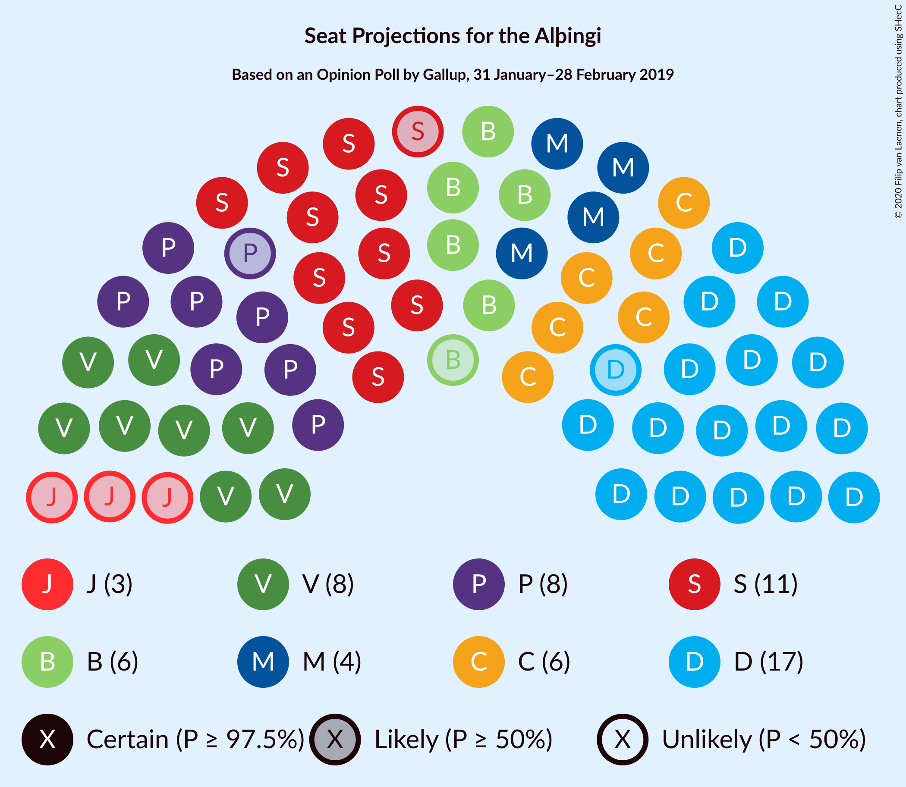
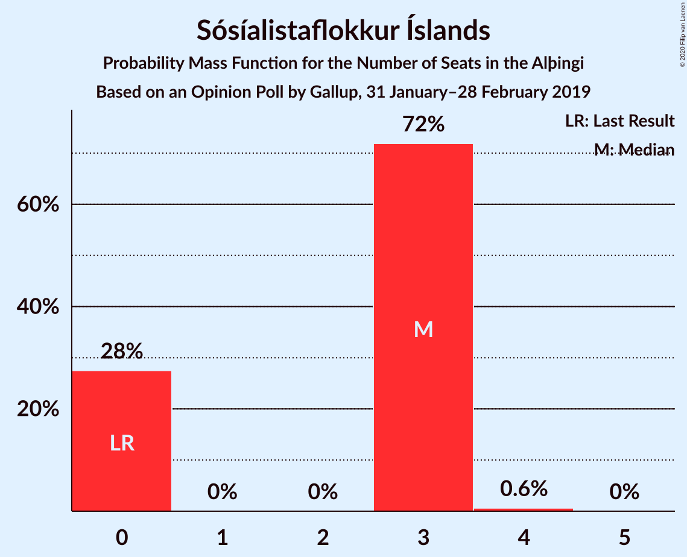
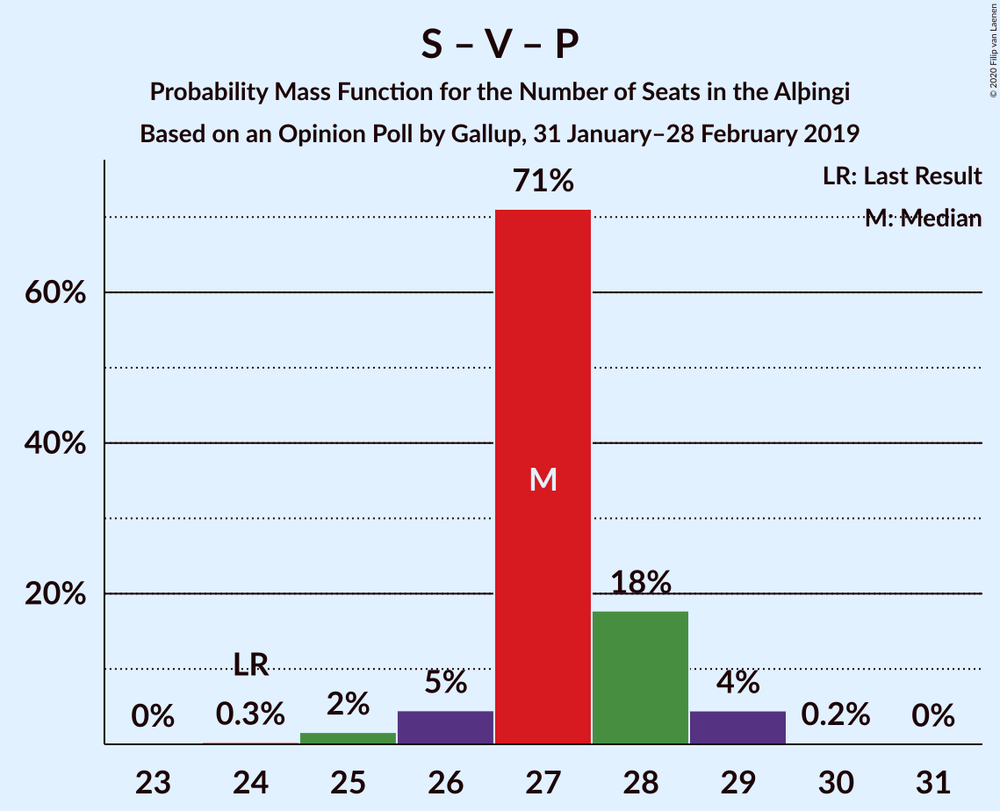
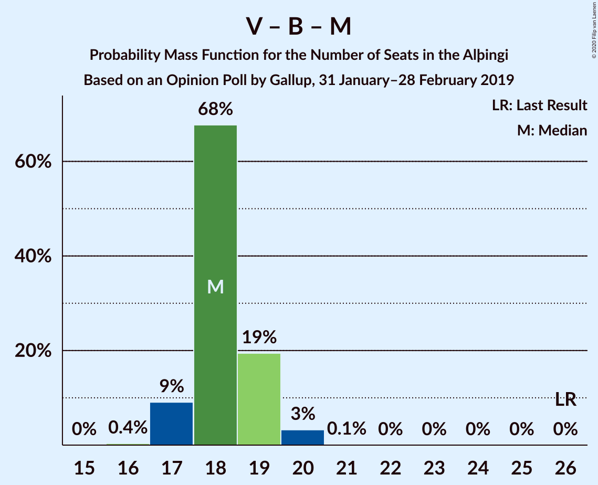

# Opinion Poll by Gallup, 31 January–28 February 2019

<a href="#voting-intentions">Voting Intentions</a> | <a href="#seats">Seats</a> | <a href="#coalitions">Coalitions</a> | <a href="#technical-information">Technical Information</a>

## Voting Intentions

### Confidence Intervals

| Party | Last Result | Poll Result | 80% Confidence Interval | 90% Confidence Interval | 95% Confidence Interval | 99% Confidence Interval |
|:-----:|:-----------:|:-----------:|:-----------------------:|:-----------------------:|:-----------------------:|:-----------------------:|
| Sjálfstæðisflokkurinn | 25.2% | 25.0% | 24.1–25.9% |23.9–26.2% |23.6–26.4% |23.2–26.8% |
| Samfylkingin | 12.1% | 16.8% | 16.0–17.6% |15.8–17.8% |15.7–18.0% |15.3–18.4% |
| Vinstrihreyfingin – grænt framboð | 16.9% | 12.3% | 11.6–13.0% |11.5–13.2% |11.3–13.4% |11.0–13.7% |
| Píratar | 9.2% | 11.6% | 11.0–12.3% |10.8–12.5% |10.6–12.7% |10.3–13.0% |
| Viðreisn | 6.7% | 9.9% | 9.3–10.5% |9.1–10.7% |9.0–10.9% |8.7–11.2% |
| Framsóknarflokkurinn | 10.7% | 9.0% | 8.4–9.6% |8.3–9.8% |8.1–10.0% |7.9–10.3% |
| Miðflokkurinn | 10.9% | 6.7% | 6.2–7.3% |6.1–7.4% |5.9–7.5% |5.7–7.8% |
| Sósíalistaflokkur Íslands | 0.0% | 5.0% | 4.6–5.5% |4.5–5.6% |4.4–5.7% |4.2–6.0% |
| Flokkur fólksins | 6.9% | 3.4% | 3.0–3.8% |2.9–3.9% |2.8–4.0% |2.7–4.2% |

*Note:* The poll result column reflects the actual value used in the calculations. Published results may vary slightly, and in addition be rounded to fewer digits.

## Seats

### Confidence Intervals

| Party | Last Result | Median | 80% Confidence Interval | 90% Confidence Interval | 95% Confidence Interval | 99% Confidence Interval |
|:-----:|:-----------:|:------:|:-----------------------:|:-----------------------:|:-----------------------:|:-----------------------:|
| <a href="#sjálfstæðisflokkurinn">Sjálfstæðisflokkurinn</a> | 16 | 17 | 17–19 |16–19 |16–19 |16–19 |
| <a href="#samfylkingin">Samfylkingin</a> | 7 | 11 | 11–12 |11–12 |10–12 |10–13 |
| <a href="#vinstrihreyfingin-–-grænt-framboð">Vinstrihreyfingin – grænt framboð</a> | 11 | 8 | 8–9 |8–9 |8–9 |7–10 |
| <a href="#píratar">Píratar</a> | 6 | 8 | 7–8 |7–8 |7–8 |6–9 |
| <a href="#viðreisn">Viðreisn</a> | 4 | 6 | 6–7 |6–7 |6–7 |6–8 |
| <a href="#framsóknarflokkurinn">Framsóknarflokkurinn</a> | 8 | 6 | 5–6 |5–6 |5–7 |5–7 |
| <a href="#miðflokkurinn">Miðflokkurinn</a> | 7 | 4 | 4–5 |4–5 |4–5 |4–5 |
| <a href="#sósíalistaflokkur-íslands">Sósíalistaflokkur Íslands</a> | 0 | 3 | 0–3 |0–3 |0–3 |0–4 |
| <a href="#flokkur-fólksins">Flokkur fólksins</a> | 4 | 0 | 0 |0 |0 |0 |

### Sjálfstæðisflokkurinn

*For a full overview of the results for this party, see the [Sjálfstæðisflokkurinn](party-sjálfstæðisflokkurinn.html) page.*

| Number of Seats | Probability | Accumulated | Special Marks |
|:---------------:|:-----------:|:-----------:|:-------------:|
| 15 | 0.1% | 100% |  |
| 16 | 6% | 99.9% | Last Result |
| 17 | 61% | 94% | Median |
| 18 | 24% | 34% |  |
| 19 | 10% | 10% |  |
| 20 | 0% | 0% |  |

### Samfylkingin

*For a full overview of the results for this party, see the [Samfylkingin](party-samfylkingin.html) page.*

| Number of Seats | Probability | Accumulated | Special Marks |
|:---------------:|:-----------:|:-----------:|:-------------:|
| 7 | 0% | 100% | Last Result |
| 8 | 0% | 100% |  |
| 9 | 0% | 100% |  |
| 10 | 4% | 100% |  |
| 11 | 67% | 96% | Median |
| 12 | 27% | 28% |  |
| 13 | 2% | 2% |  |
| 14 | 0% | 0% |  |

### Vinstrihreyfingin – grænt framboð

*For a full overview of the results for this party, see the [Vinstrihreyfingin – grænt framboð](party-vinstrihreyfingin–græntframboð.html) page.*

| Number of Seats | Probability | Accumulated | Special Marks |
|:---------------:|:-----------:|:-----------:|:-------------:|
| 7 | 2% | 100% |  |
| 8 | 79% | 98% | Median |
| 9 | 18% | 19% |  |
| 10 | 0.9% | 0.9% |  |
| 11 | 0% | 0% | Last Result |

### Píratar

*For a full overview of the results for this party, see the [Píratar](party-píratar.html) page.*

| Number of Seats | Probability | Accumulated | Special Marks |
|:---------------:|:-----------:|:-----------:|:-------------:|
| 6 | 0.7% | 100% | Last Result |
| 7 | 19% | 99.3% |  |
| 8 | 78% | 80% | Median |
| 9 | 2% | 2% |  |
| 10 | 0% | 0% |  |

### Viðreisn

*For a full overview of the results for this party, see the [Viðreisn](party-viðreisn.html) page.*

| Number of Seats | Probability | Accumulated | Special Marks |
|:---------------:|:-----------:|:-----------:|:-------------:|
| 4 | 0% | 100% | Last Result |
| 5 | 0.4% | 100% |  |
| 6 | 75% | 99.6% | Median |
| 7 | 24% | 24% |  |
| 8 | 0.5% | 0.5% |  |
| 9 | 0% | 0% |  |

### Framsóknarflokkurinn

*For a full overview of the results for this party, see the [Framsóknarflokkurinn](party-framsóknarflokkurinn.html) page.*

| Number of Seats | Probability | Accumulated | Special Marks |
|:---------------:|:-----------:|:-----------:|:-------------:|
| 5 | 13% | 100% |  |
| 6 | 82% | 87% | Median |
| 7 | 5% | 5% |  |
| 8 | 0.3% | 0.3% | Last Result |
| 9 | 0% | 0% |  |

### Miðflokkurinn

*For a full overview of the results for this party, see the [Miðflokkurinn](party-miðflokkurinn.html) page.*

| Number of Seats | Probability | Accumulated | Special Marks |
|:---------------:|:-----------:|:-----------:|:-------------:|
| 3 | 0.5% | 100% |  |
| 4 | 84% | 99.5% | Median |
| 5 | 15% | 15% |  |
| 6 | 0% | 0% |  |
| 7 | 0% | 0% | Last Result |

### Sósíalistaflokkur Íslands

*For a full overview of the results for this party, see the [Sósíalistaflokkur Íslands](party-sósíalistaflokkuríslands.html) page.*

| Number of Seats | Probability | Accumulated | Special Marks |
|:---------------:|:-----------:|:-----------:|:-------------:|
| 0 | 31% | 100% | Last Result |
| 1 | 0% | 69% |  |
| 2 | 0% | 69% |  |
| 3 | 68% | 69% | Median |
| 4 | 0.6% | 0.6% |  |
| 5 | 0% | 0% |  |

### Flokkur fólksins

*For a full overview of the results for this party, see the [Flokkur fólksins](party-flokkurfólksins.html) page.*

| Number of Seats | Probability | Accumulated | Special Marks |
|:---------------:|:-----------:|:-----------:|:-------------:|
| 0 | 100% | 100% | Median |
| 1 | 0% | 0% |  |
| 2 | 0% | 0% |  |
| 3 | 0% | 0% |  |
| 4 | 0% | 0% | Last Result |

## Coalitions

### Confidence Intervals

| Coalition | Last Result | Median | Majority? | 80% Confidence Interval | 90% Confidence Interval | 95% Confidence Interval | 99% Confidence Interval |
|:---------:|:-----------:|:------:|:---------:|:-----------------------:|:-----------------------:|:-----------------------:|:-----------------------:|
| Samfylkingin – Vinstrihreyfingin – grænt framboð – Píratar – Viðreisn | 28 | 33 | 98% | 33–35 | 32–35 | 32–36 | 31–36 |
| Sjálfstæðisflokkurinn – Vinstrihreyfingin – grænt framboð – Framsóknarflokkurinn | 35 | 31 | 40% | 31–33 | 30–33 | 30–33 | 30–34 |
| Samfylkingin – Vinstrihreyfingin – grænt framboð – Framsóknarflokkurinn – Miðflokkurinn | 33 | 29 | 2% | 29–31 | 29–31 | 28–31 | 27–32 |
| Sjálfstæðisflokkurinn – Samfylkingin | 23 | 28 | 0.6% | 28–30 | 28–31 | 27–31 | 27–32 |
| Sjálfstæðisflokkurinn – Framsóknarflokkurinn – Miðflokkurinn | 31 | 27 | 0% | 27–29 | 26–30 | 26–30 | 25–31 |
| Samfylkingin – Vinstrihreyfingin – grænt framboð – Píratar | 24 | 27 | 0% | 27–28 | 26–29 | 26–29 | 24–29 |
| Sjálfstæðisflokkurinn – Vinstrihreyfingin – grænt framboð | 27 | 25 | 0% | 25–27 | 24–27 | 24–27 | 24–28 |
| Samfylkingin – Vinstrihreyfingin – grænt framboð – Framsóknarflokkurinn | 26 | 25 | 0% | 25–26 | 24–27 | 23–27 | 23–28 |
| Sjálfstæðisflokkurinn – Viðreisn | 20 | 23 | 0% | 23–25 | 23–25 | 23–25 | 22–26 |
| Sjálfstæðisflokkurinn – Framsóknarflokkurinn | 24 | 23 | 0% | 22–25 | 22–25 | 22–25 | 21–26 |
| Samfylkingin – Vinstrihreyfingin – grænt framboð – Miðflokkurinn | 25 | 23 | 0% | 23–25 | 23–25 | 22–25 | 21–26 |
| Sjálfstæðisflokkurinn – Miðflokkurinn | 23 | 21 | 0% | 21–23 | 20–24 | 20–24 | 20–24 |
| Samfylkingin – Vinstrihreyfingin – grænt framboð | 18 | 19 | 0% | 19–20 | 19–21 | 18–21 | 17–22 |
| Vinstrihreyfingin – grænt framboð – Framsóknarflokkurinn – Miðflokkurinn | 26 | 18 | 0% | 18–19 | 17–19 | 17–20 | 16–20 |
| Vinstrihreyfingin – grænt framboð – Píratar | 17 | 16 | 0% | 15–17 | 15–17 | 15–17 | 14–18 |
| Vinstrihreyfingin – grænt framboð – Framsóknarflokkurinn | 19 | 14 | 0% | 14–15 | 13–15 | 13–15 | 13–16 |
| Vinstrihreyfingin – grænt framboð – Miðflokkurinn | 18 | 12 | 0% | 12–13 | 12–13 | 12–14 | 11–14 |

### Samfylkingin – Vinstrihreyfingin – grænt framboð – Píratar – Viðreisn

| Number of Seats | Probability | Accumulated | Special Marks |
|:---------------:|:-----------:|:-----------:|:-------------:|
| 28 | 0% | 100% | Last Result |
| 29 | 0% | 100% |  |
| 30 | 0.4% | 100% |  |
| 31 | 2% | 99.6% |  |
| 32 | 4% | 98% | Majority |
| 33 | 59% | 94% | Median |
| 34 | 18% | 35% |  |
| 35 | 13% | 17% |  |
| 36 | 5% | 5% |  |
| 37 | 0.2% | 0.2% |  |
| 38 | 0% | 0% |  |

### Sjálfstæðisflokkurinn – Vinstrihreyfingin – grænt framboð – Framsóknarflokkurinn

| Number of Seats | Probability | Accumulated | Special Marks |
|:---------------:|:-----------:|:-----------:|:-------------:|
| 29 | 0.3% | 100% |  |
| 30 | 9% | 99.7% |  |
| 31 | 51% | 90% | Median |
| 32 | 24% | 40% | Majority |
| 33 | 14% | 16% |  |
| 34 | 2% | 2% |  |
| 35 | 0% | 0% | Last Result |

### Samfylkingin – Vinstrihreyfingin – grænt framboð – Framsóknarflokkurinn – Miðflokkurinn

| Number of Seats | Probability | Accumulated | Special Marks |
|:---------------:|:-----------:|:-----------:|:-------------:|
| 26 | 0.1% | 100% |  |
| 27 | 2% | 99.9% |  |
| 28 | 3% | 98% |  |
| 29 | 61% | 96% | Median |
| 30 | 15% | 35% |  |
| 31 | 18% | 20% |  |
| 32 | 2% | 2% | Majority |
| 33 | 0.1% | 0.1% | Last Result |
| 34 | 0% | 0% |  |

### Sjálfstæðisflokkurinn – Samfylkingin

| Number of Seats | Probability | Accumulated | Special Marks |
|:---------------:|:-----------:|:-----------:|:-------------:|
| 23 | 0% | 100% | Last Result |
| 24 | 0% | 100% |  |
| 25 | 0% | 100% |  |
| 26 | 0.1% | 100% |  |
| 27 | 4% | 99.9% |  |
| 28 | 54% | 96% | Median |
| 29 | 22% | 42% |  |
| 30 | 14% | 20% |  |
| 31 | 5% | 5% |  |
| 32 | 0.6% | 0.6% | Majority |
| 33 | 0% | 0% |  |

### Sjálfstæðisflokkurinn – Framsóknarflokkurinn – Miðflokkurinn

| Number of Seats | Probability | Accumulated | Special Marks |
|:---------------:|:-----------:|:-----------:|:-------------:|
| 25 | 0.6% | 100% |  |
| 26 | 8% | 99.4% |  |
| 27 | 59% | 91% | Median |
| 28 | 16% | 32% |  |
| 29 | 11% | 16% |  |
| 30 | 5% | 6% |  |
| 31 | 0.6% | 0.6% | Last Result |
| 32 | 0% | 0% | Majority |

### Samfylkingin – Vinstrihreyfingin – grænt framboð – Píratar

| Number of Seats | Probability | Accumulated | Special Marks |
|:---------------:|:-----------:|:-----------:|:-------------:|
| 24 | 0.6% | 100% | Last Result |
| 25 | 2% | 99.4% |  |
| 26 | 6% | 98% |  |
| 27 | 64% | 92% | Median |
| 28 | 21% | 28% |  |
| 29 | 7% | 7% |  |
| 30 | 0.3% | 0.4% |  |
| 31 | 0.1% | 0.1% |  |
| 32 | 0% | 0% | Majority |

### Sjálfstæðisflokkurinn – Vinstrihreyfingin – grænt framboð

| Number of Seats | Probability | Accumulated | Special Marks |
|:---------------:|:-----------:|:-----------:|:-------------:|
| 24 | 5% | 100% |  |
| 25 | 55% | 95% | Median |
| 26 | 21% | 40% |  |
| 27 | 18% | 19% | Last Result |
| 28 | 1.1% | 1.1% |  |
| 29 | 0% | 0% |  |

### Samfylkingin – Vinstrihreyfingin – grænt framboð – Framsóknarflokkurinn

| Number of Seats | Probability | Accumulated | Special Marks |
|:---------------:|:-----------:|:-----------:|:-------------:|
| 22 | 0.2% | 100% |  |
| 23 | 3% | 99.8% |  |
| 24 | 3% | 97% |  |
| 25 | 60% | 94% | Median |
| 26 | 25% | 34% | Last Result |
| 27 | 8% | 9% |  |
| 28 | 0.7% | 0.7% |  |
| 29 | 0% | 0% |  |

### Sjálfstæðisflokkurinn – Viðreisn

| Number of Seats | Probability | Accumulated | Special Marks |
|:---------------:|:-----------:|:-----------:|:-------------:|
| 20 | 0% | 100% | Last Result |
| 21 | 0% | 100% |  |
| 22 | 1.3% | 100% |  |
| 23 | 58% | 98.7% | Median |
| 24 | 20% | 41% |  |
| 25 | 19% | 21% |  |
| 26 | 2% | 2% |  |
| 27 | 0% | 0% |  |

### Sjálfstæðisflokkurinn – Framsóknarflokkurinn

| Number of Seats | Probability | Accumulated | Special Marks |
|:---------------:|:-----------:|:-----------:|:-------------:|
| 21 | 0.6% | 100% |  |
| 22 | 10% | 99.4% |  |
| 23 | 59% | 89% | Median |
| 24 | 19% | 30% | Last Result |
| 25 | 10% | 11% |  |
| 26 | 0.9% | 0.9% |  |
| 27 | 0% | 0% |  |

### Samfylkingin – Vinstrihreyfingin – grænt framboð – Miðflokkurinn

| Number of Seats | Probability | Accumulated | Special Marks |
|:---------------:|:-----------:|:-----------:|:-------------:|
| 21 | 1.1% | 100% |  |
| 22 | 2% | 98.9% |  |
| 23 | 55% | 97% | Median |
| 24 | 23% | 42% |  |
| 25 | 17% | 19% | Last Result |
| 26 | 2% | 2% |  |
| 27 | 0% | 0% |  |

### Sjálfstæðisflokkurinn – Miðflokkurinn

| Number of Seats | Probability | Accumulated | Special Marks |
|:---------------:|:-----------:|:-----------:|:-------------:|
| 19 | 0.1% | 100% |  |
| 20 | 5% | 99.9% |  |
| 21 | 57% | 95% | Median |
| 22 | 23% | 38% |  |
| 23 | 9% | 15% | Last Result |
| 24 | 6% | 6% |  |
| 25 | 0% | 0% |  |

### Samfylkingin – Vinstrihreyfingin – grænt framboð

| Number of Seats | Probability | Accumulated | Special Marks |
|:---------------:|:-----------:|:-----------:|:-------------:|
| 17 | 1.3% | 100% |  |
| 18 | 3% | 98.7% | Last Result |
| 19 | 57% | 96% | Median |
| 20 | 30% | 39% |  |
| 21 | 8% | 9% |  |
| 22 | 0.5% | 0.5% |  |
| 23 | 0% | 0% |  |

### Vinstrihreyfingin – grænt framboð – Framsóknarflokkurinn – Miðflokkurinn

| Number of Seats | Probability | Accumulated | Special Marks |
|:---------------:|:-----------:|:-----------:|:-------------:|
| 16 | 0.5% | 100% |  |
| 17 | 6% | 99.4% |  |
| 18 | 67% | 94% | Median |
| 19 | 23% | 27% |  |
| 20 | 4% | 4% |  |
| 21 | 0.2% | 0.2% |  |
| 22 | 0% | 0% |  |
| 23 | 0% | 0% |  |
| 24 | 0% | 0% |  |
| 25 | 0% | 0% |  |
| 26 | 0% | 0% | Last Result |

### Vinstrihreyfingin – grænt framboð – Píratar

| Number of Seats | Probability | Accumulated | Special Marks |
|:---------------:|:-----------:|:-----------:|:-------------:|
| 14 | 1.3% | 100% |  |
| 15 | 13% | 98.6% |  |
| 16 | 73% | 86% | Median |
| 17 | 12% | 13% | Last Result |
| 18 | 0.7% | 0.7% |  |
| 19 | 0% | 0% |  |

### Vinstrihreyfingin – grænt framboð – Framsóknarflokkurinn

| Number of Seats | Probability | Accumulated | Special Marks |
|:---------------:|:-----------:|:-----------:|:-------------:|
| 12 | 0.5% | 100% |  |
| 13 | 8% | 99.5% |  |
| 14 | 74% | 91% | Median |
| 15 | 16% | 17% |  |
| 16 | 1.0% | 1.1% |  |
| 17 | 0.1% | 0.1% |  |
| 18 | 0% | 0% |  |
| 19 | 0% | 0% | Last Result |

### Vinstrihreyfingin – grænt framboð – Miðflokkurinn

| Number of Seats | Probability | Accumulated | Special Marks |
|:---------------:|:-----------:|:-----------:|:-------------:|
| 10 | 0.1% | 100% |  |
| 11 | 2% | 99.9% |  |
| 12 | 67% | 98% | Median |
| 13 | 28% | 31% |  |
| 14 | 3% | 3% |  |
| 15 | 0% | 0% |  |
| 16 | 0% | 0% |  |
| 17 | 0% | 0% |  |
| 18 | 0% | 0% | Last Result |

## Technical Information

### Opinion Poll

+ **Polling firm:** Gallup
+ **Commissioner(s):** —
+ **Fieldwork period:** 31 January–28 February 2019

### Calculations

+ **Sample size:** 3777
+ **Simulations done:** 524,288
+ **Error estimate:** 0.84%

