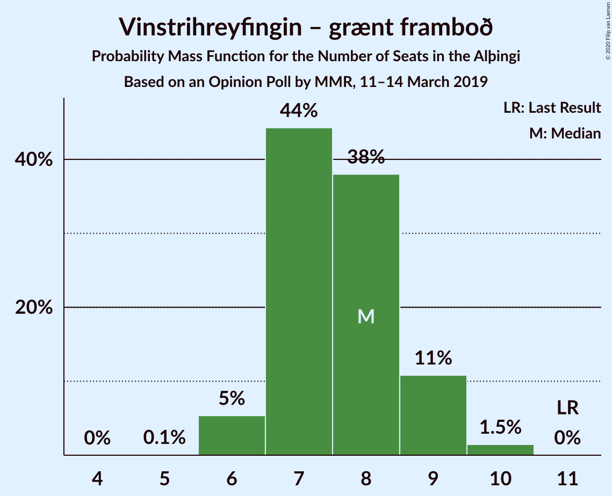
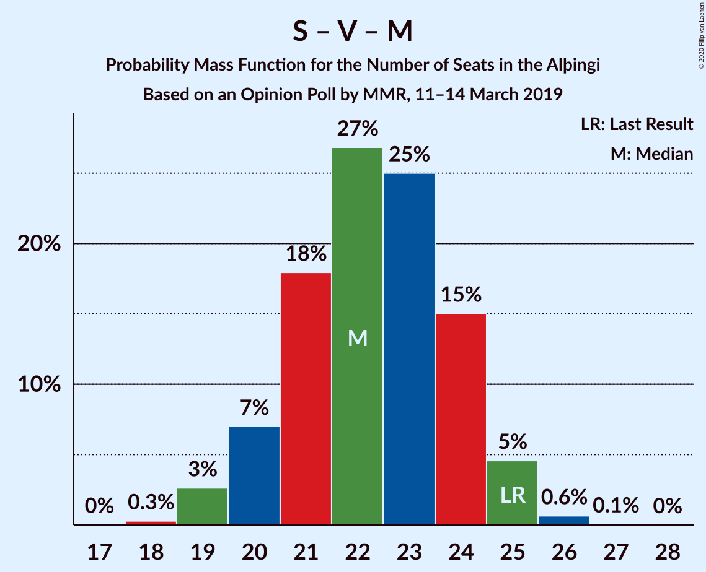

# Opinion Poll by MMR, 11–14 March 2019

<a href="#voting-intentions">Voting Intentions</a> | <a href="#seats">Seats</a> | <a href="#coalitions">Coalitions</a> | <a href="#technical-information">Technical Information</a>

## Voting Intentions

### Confidence Intervals

| Party | Last Result | Poll Result | 80% Confidence Interval | 90% Confidence Interval | 95% Confidence Interval | 99% Confidence Interval |
|:-----:|:-----------:|:-----------:|:-----------------------:|:-----------------------:|:-----------------------:|:-----------------------:|
| Sjálfstæðisflokkurinn | 25.2% | 23.6% | 22.0–25.4% |21.5–25.9% |21.1–26.3% |20.3–27.2% |
| Samfylkingin | 12.1% | 13.9% | 12.5–15.3% |12.2–15.7% |11.9–16.1% |11.3–16.8% |
| Píratar | 9.2% | 13.7% | 12.4–15.1% |12.0–15.5% |11.7–15.9% |11.1–16.6% |
| Vinstrihreyfingin – grænt framboð | 16.9% | 11.4% | 10.2–12.8% |9.9–13.2% |9.6–13.5% |9.1–14.2% |
| Framsóknarflokkurinn | 10.7% | 11.1% | 10.0–12.5% |9.6–12.9% |9.3–13.2% |8.8–13.9% |
| Viðreisn | 6.7% | 9.4% | 8.3–10.6% |8.0–11.0% |7.7–11.3% |7.2–11.9% |
| Miðflokkurinn | 10.9% | 8.0% | 7.0–9.2% |6.7–9.5% |6.5–9.8% |6.1–10.4% |
| Flokkur fólksins | 6.9% | 4.7% | 3.9–5.6% |3.7–5.9% |3.6–6.2% |3.2–6.6% |

*Note:* The poll result column reflects the actual value used in the calculations. Published results may vary slightly, and in addition be rounded to fewer digits.

## Seats

### Confidence Intervals

| Party | Last Result | Median | 80% Confidence Interval | 90% Confidence Interval | 95% Confidence Interval | 99% Confidence Interval |
|:-----:|:-----------:|:------:|:-----------------------:|:-----------------------:|:-----------------------:|:-----------------------:|
| <a href="#sjálfstæðisflokkurinn">Sjálfstæðisflokkurinn</a> | 16 | 17 | 15–18 |15–18 |14–19 |14–19 |
| <a href="#samfylkingin">Samfylkingin</a> | 7 | 9 | 8–10 |8–11 |8–11 |7–11 |
| <a href="#píratar">Píratar</a> | 6 | 9 | 8–10 |8–10 |8–11 |7–11 |
| <a href="#vinstrihreyfingin-–-grænt-framboð">Vinstrihreyfingin – grænt framboð</a> | 11 | 7 | 6–8 |6–9 |6–9 |6–10 |
| <a href="#framsóknarflokkurinn">Framsóknarflokkurinn</a> | 8 | 8 | 7–9 |6–9 |6–9 |6–10 |
| <a href="#viðreisn">Viðreisn</a> | 4 | 6 | 5–7 |5–7 |5–7 |4–8 |
| <a href="#miðflokkurinn">Miðflokkurinn</a> | 7 | 5 | 4–6 |4–6 |4–7 |4–7 |
| <a href="#flokkur-fólksins">Flokkur fólksins</a> | 4 | 0 | 0–3 |0–3 |0–4 |0–4 |

### Sjálfstæðisflokkurinn

*For a full overview of the results for this party, see the [Sjálfstæðisflokkurinn](party-sjálfstæðisflokkurinn.html) page.*

| Number of Seats | Probability | Accumulated | Special Marks |
|:---------------:|:-----------:|:-----------:|:-------------:|
| 13 | 0.4% | 100% |  |
| 14 | 3% | 99.6% |  |
| 15 | 20% | 97% |  |
| 16 | 24% | 77% | Last Result |
| 17 | 31% | 53% | Median |
| 18 | 18% | 22% |  |
| 19 | 4% | 4% |  |
| 20 | 0.2% | 0.2% |  |
| 21 | 0% | 0% |  |

### Samfylkingin

*For a full overview of the results for this party, see the [Samfylkingin](party-samfylkingin.html) page.*

| Number of Seats | Probability | Accumulated | Special Marks |
|:---------------:|:-----------:|:-----------:|:-------------:|
| 6 | 0.1% | 100% |  |
| 7 | 2% | 99.9% | Last Result |
| 8 | 15% | 98% |  |
| 9 | 44% | 83% | Median |
| 10 | 33% | 39% |  |
| 11 | 6% | 6% |  |
| 12 | 0.4% | 0.4% |  |
| 13 | 0% | 0% |  |

### Píratar

*For a full overview of the results for this party, see the [Píratar](party-píratar.html) page.*

| Number of Seats | Probability | Accumulated | Special Marks |
|:---------------:|:-----------:|:-----------:|:-------------:|
| 6 | 0.1% | 100% | Last Result |
| 7 | 2% | 99.9% |  |
| 8 | 14% | 98% |  |
| 9 | 57% | 84% | Median |
| 10 | 23% | 27% |  |
| 11 | 4% | 4% |  |
| 12 | 0.2% | 0.2% |  |
| 13 | 0% | 0% |  |

### Vinstrihreyfingin – grænt framboð

*For a full overview of the results for this party, see the [Vinstrihreyfingin – grænt framboð](party-vinstrihreyfingin–græntframboð.html) page.*

| Number of Seats | Probability | Accumulated | Special Marks |
|:---------------:|:-----------:|:-----------:|:-------------:|
| 5 | 0.3% | 100% |  |
| 6 | 10% | 99.7% |  |
| 7 | 45% | 89% | Median |
| 8 | 35% | 45% |  |
| 9 | 8% | 9% |  |
| 10 | 1.3% | 1.3% |  |
| 11 | 0% | 0% | Last Result |

### Framsóknarflokkurinn

*For a full overview of the results for this party, see the [Framsóknarflokkurinn](party-framsóknarflokkurinn.html) page.*

| Number of Seats | Probability | Accumulated | Special Marks |
|:---------------:|:-----------:|:-----------:|:-------------:|
| 5 | 0.4% | 100% |  |
| 6 | 8% | 99.6% |  |
| 7 | 23% | 92% |  |
| 8 | 58% | 68% | Last Result, Median |
| 9 | 8% | 11% |  |
| 10 | 2% | 2% |  |
| 11 | 0.3% | 0.3% |  |
| 12 | 0% | 0% |  |

### Viðreisn

*For a full overview of the results for this party, see the [Viðreisn](party-viðreisn.html) page.*

| Number of Seats | Probability | Accumulated | Special Marks |
|:---------------:|:-----------:|:-----------:|:-------------:|
| 4 | 0.9% | 100% | Last Result |
| 5 | 23% | 99.1% |  |
| 6 | 45% | 76% | Median |
| 7 | 30% | 32% |  |
| 8 | 2% | 2% |  |
| 9 | 0.1% | 0.1% |  |
| 10 | 0% | 0% |  |

### Miðflokkurinn

*For a full overview of the results for this party, see the [Miðflokkurinn](party-miðflokkurinn.html) page.*

| Number of Seats | Probability | Accumulated | Special Marks |
|:---------------:|:-----------:|:-----------:|:-------------:|
| 3 | 0.2% | 100% |  |
| 4 | 13% | 99.8% |  |
| 5 | 53% | 87% | Median |
| 6 | 31% | 33% |  |
| 7 | 3% | 3% | Last Result |
| 8 | 0% | 0.1% |  |
| 9 | 0% | 0% |  |

### Flokkur fólksins

*For a full overview of the results for this party, see the [Flokkur fólksins](party-flokkurfólksins.html) page.*

| Number of Seats | Probability | Accumulated | Special Marks |
|:---------------:|:-----------:|:-----------:|:-------------:|
| 0 | 65% | 100% | Median |
| 1 | 0% | 35% |  |
| 2 | 0% | 35% |  |
| 3 | 30% | 35% |  |
| 4 | 5% | 5% | Last Result |
| 5 | 0% | 0% |  |

## Coalitions

### Confidence Intervals

| Coalition | Last Result | Median | Majority? | 80% Confidence Interval | 90% Confidence Interval | 95% Confidence Interval | 99% Confidence Interval |
|:---------:|:-----------:|:------:|:---------:|:-----------------------:|:-----------------------:|:-----------------------:|:-----------------------:|
| Samfylkingin – Píratar – Vinstrihreyfingin – grænt framboð – Viðreisn | 28 | 32 | 62% | 29–34 | 29–35 | 29–35 | 27–36 |
| Sjálfstæðisflokkurinn – Vinstrihreyfingin – grænt framboð – Framsóknarflokkurinn | 35 | 32 | 58% | 30–33 | 29–34 | 29–34 | 28–35 |
| Sjálfstæðisflokkurinn – Framsóknarflokkurinn – Miðflokkurinn | 31 | 30 | 5% | 28–31 | 27–32 | 27–32 | 26–33 |
| Samfylkingin – Vinstrihreyfingin – grænt framboð – Framsóknarflokkurinn – Miðflokkurinn | 33 | 30 | 11% | 28–32 | 27–32 | 26–32 | 25–33 |
| Samfylkingin – Píratar – Vinstrihreyfingin – grænt framboð | 24 | 26 | 0% | 24–28 | 23–29 | 23–29 | 22–29 |
| Sjálfstæðisflokkurinn – Samfylkingin | 23 | 26 | 0% | 24–27 | 24–28 | 23–28 | 22–29 |
| Samfylkingin – Vinstrihreyfingin – grænt framboð – Framsóknarflokkurinn | 26 | 24 | 0% | 23–26 | 22–26 | 22–27 | 21–28 |
| Sjálfstæðisflokkurinn – Framsóknarflokkurinn | 24 | 24 | 0% | 23–26 | 22–26 | 22–27 | 21–27 |
| Sjálfstæðisflokkurinn – Vinstrihreyfingin – grænt framboð | 27 | 24 | 0% | 22–25 | 22–26 | 21–27 | 20–27 |
| Sjálfstæðisflokkurinn – Viðreisn | 20 | 23 | 0% | 21–24 | 20–25 | 20–25 | 19–26 |
| Samfylkingin – Vinstrihreyfingin – grænt framboð – Miðflokkurinn | 25 | 22 | 0% | 20–24 | 19–24 | 19–25 | 18–25 |
| Sjálfstæðisflokkurinn – Miðflokkurinn | 23 | 22 | 0% | 20–23 | 19–24 | 19–24 | 18–25 |
| Vinstrihreyfingin – grænt framboð – Framsóknarflokkurinn – Miðflokkurinn | 26 | 20 | 0% | 19–22 | 19–22 | 18–23 | 17–24 |
| Píratar – Vinstrihreyfingin – grænt framboð | 17 | 17 | 0% | 15–18 | 15–19 | 14–19 | 14–20 |
| Samfylkingin – Vinstrihreyfingin – grænt framboð | 18 | 17 | 0% | 15–18 | 15–19 | 14–19 | 13–20 |
| Vinstrihreyfingin – grænt framboð – Framsóknarflokkurinn | 19 | 15 | 0% | 14–16 | 13–17 | 13–17 | 12–18 |
| Vinstrihreyfingin – grænt framboð – Miðflokkurinn | 18 | 13 | 0% | 11–14 | 11–14 | 11–15 | 10–15 |

### Samfylkingin – Píratar – Vinstrihreyfingin – grænt framboð – Viðreisn

| Number of Seats | Probability | Accumulated | Special Marks |
|:---------------:|:-----------:|:-----------:|:-------------:|
| 26 | 0.1% | 100% |  |
| 27 | 0.9% | 99.9% |  |
| 28 | 1.4% | 98.9% | Last Result |
| 29 | 9% | 98% |  |
| 30 | 13% | 89% |  |
| 31 | 13% | 76% | Median |
| 32 | 22% | 62% | Majority |
| 33 | 21% | 41% |  |
| 34 | 12% | 20% |  |
| 35 | 7% | 8% |  |
| 36 | 1.0% | 1.0% |  |
| 37 | 0.1% | 0.1% |  |
| 38 | 0% | 0% |  |

### Sjálfstæðisflokkurinn – Vinstrihreyfingin – grænt framboð – Framsóknarflokkurinn

| Number of Seats | Probability | Accumulated | Special Marks |
|:---------------:|:-----------:|:-----------:|:-------------:|
| 27 | 0.1% | 100% |  |
| 28 | 0.9% | 99.9% |  |
| 29 | 4% | 99.0% |  |
| 30 | 10% | 95% |  |
| 31 | 27% | 85% |  |
| 32 | 33% | 58% | Median, Majority |
| 33 | 17% | 25% |  |
| 34 | 7% | 8% |  |
| 35 | 1.0% | 1.2% | Last Result |
| 36 | 0.1% | 0.1% |  |
| 37 | 0% | 0% |  |

### Sjálfstæðisflokkurinn – Framsóknarflokkurinn – Miðflokkurinn

| Number of Seats | Probability | Accumulated | Special Marks |
|:---------------:|:-----------:|:-----------:|:-------------:|
| 25 | 0.3% | 100% |  |
| 26 | 2% | 99.7% |  |
| 27 | 5% | 98% |  |
| 28 | 18% | 93% |  |
| 29 | 22% | 75% |  |
| 30 | 28% | 53% | Median |
| 31 | 19% | 24% | Last Result |
| 32 | 4% | 5% | Majority |
| 33 | 0.7% | 0.7% |  |
| 34 | 0% | 0% |  |

### Samfylkingin – Vinstrihreyfingin – grænt framboð – Framsóknarflokkurinn – Miðflokkurinn

| Number of Seats | Probability | Accumulated | Special Marks |
|:---------------:|:-----------:|:-----------:|:-------------:|
| 25 | 0.6% | 100% |  |
| 26 | 2% | 99.4% |  |
| 27 | 4% | 97% |  |
| 28 | 11% | 93% |  |
| 29 | 26% | 82% | Median |
| 30 | 31% | 56% |  |
| 31 | 14% | 25% |  |
| 32 | 9% | 11% | Majority |
| 33 | 2% | 2% | Last Result |
| 34 | 0.3% | 0.3% |  |
| 35 | 0% | 0% |  |

### Samfylkingin – Píratar – Vinstrihreyfingin – grænt framboð

| Number of Seats | Probability | Accumulated | Special Marks |
|:---------------:|:-----------:|:-----------:|:-------------:|
| 21 | 0.2% | 100% |  |
| 22 | 2% | 99.8% |  |
| 23 | 6% | 98% |  |
| 24 | 9% | 92% | Last Result |
| 25 | 22% | 83% | Median |
| 26 | 30% | 61% |  |
| 27 | 19% | 31% |  |
| 28 | 7% | 12% |  |
| 29 | 5% | 5% |  |
| 30 | 0.3% | 0.3% |  |
| 31 | 0% | 0.1% |  |
| 32 | 0% | 0% | Majority |

### Sjálfstæðisflokkurinn – Samfylkingin

| Number of Seats | Probability | Accumulated | Special Marks |
|:---------------:|:-----------:|:-----------:|:-------------:|
| 21 | 0.2% | 100% |  |
| 22 | 1.0% | 99.8% |  |
| 23 | 2% | 98.8% | Last Result |
| 24 | 13% | 97% |  |
| 25 | 23% | 84% |  |
| 26 | 32% | 61% | Median |
| 27 | 20% | 29% |  |
| 28 | 7% | 9% |  |
| 29 | 1.2% | 1.4% |  |
| 30 | 0.2% | 0.2% |  |
| 31 | 0% | 0% |  |

### Samfylkingin – Vinstrihreyfingin – grænt framboð – Framsóknarflokkurinn

| Number of Seats | Probability | Accumulated | Special Marks |
|:---------------:|:-----------:|:-----------:|:-------------:|
| 20 | 0.2% | 100% |  |
| 21 | 1.4% | 99.8% |  |
| 22 | 5% | 98% |  |
| 23 | 15% | 93% |  |
| 24 | 29% | 78% | Median |
| 25 | 31% | 49% |  |
| 26 | 13% | 18% | Last Result |
| 27 | 3% | 5% |  |
| 28 | 2% | 2% |  |
| 29 | 0.1% | 0.1% |  |
| 30 | 0% | 0% |  |

### Sjálfstæðisflokkurinn – Framsóknarflokkurinn

| Number of Seats | Probability | Accumulated | Special Marks |
|:---------------:|:-----------:|:-----------:|:-------------:|
| 20 | 0.2% | 100% |  |
| 21 | 2% | 99.8% |  |
| 22 | 7% | 98% |  |
| 23 | 22% | 92% |  |
| 24 | 26% | 70% | Last Result |
| 25 | 24% | 44% | Median |
| 26 | 16% | 19% |  |
| 27 | 3% | 3% |  |
| 28 | 0.3% | 0.3% |  |
| 29 | 0% | 0% |  |

### Sjálfstæðisflokkurinn – Vinstrihreyfingin – grænt framboð

| Number of Seats | Probability | Accumulated | Special Marks |
|:---------------:|:-----------:|:-----------:|:-------------:|
| 20 | 0.6% | 100% |  |
| 21 | 2% | 99.4% |  |
| 22 | 9% | 97% |  |
| 23 | 24% | 88% |  |
| 24 | 27% | 64% | Median |
| 25 | 26% | 36% |  |
| 26 | 7% | 10% |  |
| 27 | 3% | 3% | Last Result |
| 28 | 0.1% | 0.1% |  |
| 29 | 0% | 0% |  |

### Sjálfstæðisflokkurinn – Viðreisn

| Number of Seats | Probability | Accumulated | Special Marks |
|:---------------:|:-----------:|:-----------:|:-------------:|
| 18 | 0.2% | 100% |  |
| 19 | 0.8% | 99.8% |  |
| 20 | 5% | 99.0% | Last Result |
| 21 | 14% | 94% |  |
| 22 | 26% | 80% |  |
| 23 | 27% | 54% | Median |
| 24 | 21% | 28% |  |
| 25 | 6% | 7% |  |
| 26 | 0.8% | 0.9% |  |
| 27 | 0.1% | 0.1% |  |
| 28 | 0% | 0% |  |

### Samfylkingin – Vinstrihreyfingin – grænt framboð – Miðflokkurinn

| Number of Seats | Probability | Accumulated | Special Marks |
|:---------------:|:-----------:|:-----------:|:-------------:|
| 17 | 0.3% | 100% |  |
| 18 | 1.5% | 99.7% |  |
| 19 | 4% | 98% |  |
| 20 | 9% | 95% |  |
| 21 | 23% | 86% | Median |
| 22 | 28% | 63% |  |
| 23 | 21% | 34% |  |
| 24 | 10% | 14% |  |
| 25 | 4% | 4% | Last Result |
| 26 | 0.4% | 0.4% |  |
| 27 | 0% | 0% |  |

### Sjálfstæðisflokkurinn – Miðflokkurinn

| Number of Seats | Probability | Accumulated | Special Marks |
|:---------------:|:-----------:|:-----------:|:-------------:|
| 17 | 0.1% | 100% |  |
| 18 | 0.9% | 99.9% |  |
| 19 | 5% | 99.0% |  |
| 20 | 13% | 94% |  |
| 21 | 20% | 82% |  |
| 22 | 31% | 62% | Median |
| 23 | 23% | 31% | Last Result |
| 24 | 7% | 8% |  |
| 25 | 0.5% | 0.6% |  |
| 26 | 0.1% | 0.1% |  |
| 27 | 0% | 0% |  |

### Vinstrihreyfingin – grænt framboð – Framsóknarflokkurinn – Miðflokkurinn

| Number of Seats | Probability | Accumulated | Special Marks |
|:---------------:|:-----------:|:-----------:|:-------------:|
| 15 | 0.1% | 100% |  |
| 16 | 0.2% | 99.9% |  |
| 17 | 0.9% | 99.8% |  |
| 18 | 4% | 98.9% |  |
| 19 | 15% | 95% |  |
| 20 | 34% | 80% | Median |
| 21 | 29% | 46% |  |
| 22 | 13% | 16% |  |
| 23 | 3% | 4% |  |
| 24 | 0.5% | 0.6% |  |
| 25 | 0.1% | 0.1% |  |
| 26 | 0% | 0% | Last Result |

### Píratar – Vinstrihreyfingin – grænt framboð

| Number of Seats | Probability | Accumulated | Special Marks |
|:---------------:|:-----------:|:-----------:|:-------------:|
| 12 | 0.1% | 100% |  |
| 13 | 0.3% | 99.9% |  |
| 14 | 3% | 99.6% |  |
| 15 | 13% | 96% |  |
| 16 | 33% | 84% | Median |
| 17 | 33% | 51% | Last Result |
| 18 | 12% | 18% |  |
| 19 | 6% | 7% |  |
| 20 | 0.9% | 1.0% |  |
| 21 | 0.1% | 0.1% |  |
| 22 | 0% | 0% |  |

### Samfylkingin – Vinstrihreyfingin – grænt framboð

| Number of Seats | Probability | Accumulated | Special Marks |
|:---------------:|:-----------:|:-----------:|:-------------:|
| 13 | 0.8% | 100% |  |
| 14 | 3% | 99.2% |  |
| 15 | 10% | 96% |  |
| 16 | 28% | 85% | Median |
| 17 | 33% | 57% |  |
| 18 | 17% | 24% | Last Result |
| 19 | 5% | 7% |  |
| 20 | 2% | 2% |  |
| 21 | 0.1% | 0.1% |  |
| 22 | 0% | 0% |  |

### Vinstrihreyfingin – grænt framboð – Framsóknarflokkurinn

| Number of Seats | Probability | Accumulated | Special Marks |
|:---------------:|:-----------:|:-----------:|:-------------:|
| 11 | 0.1% | 100% |  |
| 12 | 0.6% | 99.9% |  |
| 13 | 5% | 99.3% |  |
| 14 | 15% | 95% |  |
| 15 | 45% | 79% | Median |
| 16 | 27% | 34% |  |
| 17 | 6% | 8% |  |
| 18 | 1.4% | 2% |  |
| 19 | 0.4% | 0.5% | Last Result |
| 20 | 0% | 0% |  |

### Vinstrihreyfingin – grænt framboð – Miðflokkurinn

| Number of Seats | Probability | Accumulated | Special Marks |
|:---------------:|:-----------:|:-----------:|:-------------:|
| 9 | 0.2% | 100% |  |
| 10 | 2% | 99.8% |  |
| 11 | 10% | 98% |  |
| 12 | 33% | 87% | Median |
| 13 | 30% | 54% |  |
| 14 | 19% | 24% |  |
| 15 | 4% | 5% |  |
| 16 | 0.4% | 0.4% |  |
| 17 | 0% | 0% |  |
| 18 | 0% | 0% | Last Result |

## Technical Information

### Opinion Poll

+ **Polling firm:** MMR
+ **Commissioner(s):** —
+ **Fieldwork period:** 11–14 March 2019

### Calculations

+ **Sample size:** 1025
+ **Simulations done:** 524,288
+ **Error estimate:** 1.10%

