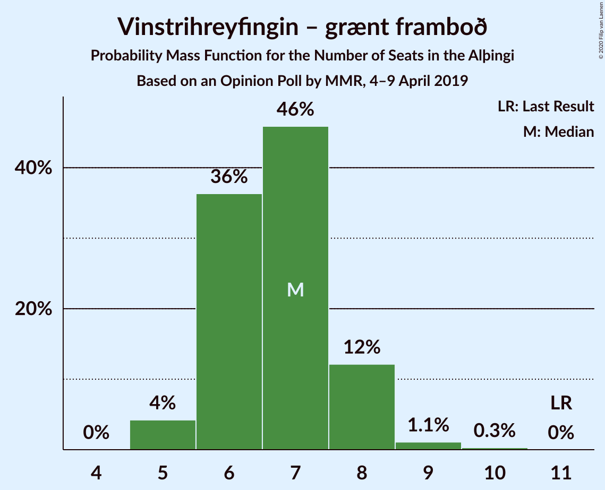

# Opinion Poll by MMR, 4–9 April 2019

<a href="#voting-intentions">Voting Intentions</a> | <a href="#seats">Seats</a> | <a href="#coalitions">Coalitions</a> | <a href="#technical-information">Technical Information</a>

## Voting Intentions

### Confidence Intervals

| Party | Last Result | Poll Result | 80% Confidence Interval | 90% Confidence Interval | 95% Confidence Interval | 99% Confidence Interval |
|:-----:|:-----------:|:-----------:|:-----------------------:|:-----------------------:|:-----------------------:|:-----------------------:|
| Sjálfstæðisflokkurinn | 25.2% | 21.7% | 20.0–23.5% |19.6–24.0% |19.2–24.5% |18.4–25.4% |
| Píratar | 9.2% | 15.0% | 13.6–16.6% |13.2–17.1% |12.8–17.5% |12.2–18.2% |
| Samfylkingin | 12.1% | 13.9% | 12.6–15.5% |12.2–15.9% |11.8–16.3% |11.2–17.1% |
| Vinstrihreyfingin – grænt framboð | 16.9% | 10.4% | 9.2–11.8% |8.8–12.1% |8.6–12.5% |8.0–13.2% |
| Miðflokkurinn | 10.9% | 10.2% | 9.0–11.5% |8.6–11.9% |8.4–12.3% |7.8–13.0% |
| Viðreisn | 6.7% | 9.0% | 7.9–10.3% |7.5–10.7% |7.3–11.0% |6.8–11.6% |
| Framsóknarflokkurinn | 10.7% | 8.7% | 7.7–10.0% |7.3–10.4% |7.1–10.7% |6.6–11.4% |
| Flokkur fólksins | 6.9% | 5.4% | 4.6–6.5% |4.3–6.8% |4.1–7.1% |3.7–7.6% |

*Note:* The poll result column reflects the actual value used in the calculations. Published results may vary slightly, and in addition be rounded to fewer digits.

## Seats

### Confidence Intervals

| Party | Last Result | Median | 80% Confidence Interval | 90% Confidence Interval | 95% Confidence Interval | 99% Confidence Interval |
|:-----:|:-----------:|:------:|:-----------------------:|:-----------------------:|:-----------------------:|:-----------------------:|
| <a href="#sjálfstæðisflokkurinn">Sjálfstæðisflokkurinn</a> | 16 | 15 | 13–16 |13–17 |13–18 |13–18 |
| <a href="#píratar">Píratar</a> | 6 | 9 | 9–11 |8–11 |8–12 |8–12 |
| <a href="#samfylkingin">Samfylkingin</a> | 7 | 9 | 8–10 |7–10 |7–11 |6–12 |
| <a href="#vinstrihreyfingin-–-grænt-framboð">Vinstrihreyfingin – grænt framboð</a> | 11 | 6 | 6–7 |5–8 |5–9 |5–10 |
| <a href="#miðflokkurinn">Miðflokkurinn</a> | 7 | 6 | 5–9 |5–9 |5–9 |5–10 |
| <a href="#viðreisn">Viðreisn</a> | 4 | 5 | 5–6 |4–7 |4–7 |4–7 |
| <a href="#framsóknarflokkurinn">Framsóknarflokkurinn</a> | 8 | 5 | 5–7 |4–7 |4–7 |4–8 |
| <a href="#flokkur-fólksins">Flokkur fólksins</a> | 4 | 3 | 0–4 |0–4 |0–4 |0–5 |

### Sjálfstæðisflokkurinn

*For a full overview of the results for this party, see the [Sjálfstæðisflokkurinn](party-sjálfstæðisflokkurinn.html) page.*

| Number of Seats | Probability | Accumulated | Special Marks |
|:---------------:|:-----------:|:-----------:|:-------------:|
| 12 | 0.3% | 100% |  |
| 13 | 15% | 99.7% |  |
| 14 | 20% | 85% |  |
| 15 | 42% | 65% | Median |
| 16 | 14% | 23% | Last Result |
| 17 | 6% | 9% |  |
| 18 | 3% | 3% |  |
| 19 | 0.1% | 0.1% |  |
| 20 | 0% | 0% |  |

### Píratar

*For a full overview of the results for this party, see the [Píratar](party-píratar.html) page.*

| Number of Seats | Probability | Accumulated | Special Marks |
|:---------------:|:-----------:|:-----------:|:-------------:|
| 6 | 0% | 100% | Last Result |
| 7 | 0.2% | 100% |  |
| 8 | 9% | 99.8% |  |
| 9 | 41% | 90% | Median |
| 10 | 35% | 50% |  |
| 11 | 12% | 15% |  |
| 12 | 3% | 3% |  |
| 13 | 0.3% | 0.4% |  |
| 14 | 0.1% | 0.1% |  |
| 15 | 0% | 0% |  |

### Samfylkingin

*For a full overview of the results for this party, see the [Samfylkingin](party-samfylkingin.html) page.*

| Number of Seats | Probability | Accumulated | Special Marks |
|:---------------:|:-----------:|:-----------:|:-------------:|
| 6 | 0.5% | 100% |  |
| 7 | 6% | 99.5% | Last Result |
| 8 | 16% | 93% |  |
| 9 | 36% | 77% | Median |
| 10 | 37% | 41% |  |
| 11 | 4% | 4% |  |
| 12 | 0.5% | 0.5% |  |
| 13 | 0% | 0% |  |

### Vinstrihreyfingin – grænt framboð

*For a full overview of the results for this party, see the [Vinstrihreyfingin – grænt framboð](party-vinstrihreyfingin–græntframboð.html) page.*

| Number of Seats | Probability | Accumulated | Special Marks |
|:---------------:|:-----------:|:-----------:|:-------------:|
| 4 | 0.2% | 100% |  |
| 5 | 6% | 99.8% |  |
| 6 | 55% | 94% | Median |
| 7 | 31% | 39% |  |
| 8 | 5% | 8% |  |
| 9 | 2% | 3% |  |
| 10 | 0.6% | 0.6% |  |
| 11 | 0% | 0% | Last Result |

### Miðflokkurinn

*For a full overview of the results for this party, see the [Miðflokkurinn](party-miðflokkurinn.html) page.*

| Number of Seats | Probability | Accumulated | Special Marks |
|:---------------:|:-----------:|:-----------:|:-------------:|
| 4 | 0.4% | 100% |  |
| 5 | 13% | 99.6% |  |
| 6 | 43% | 87% | Median |
| 7 | 19% | 44% | Last Result |
| 8 | 11% | 25% |  |
| 9 | 13% | 14% |  |
| 10 | 0.7% | 0.7% |  |
| 11 | 0% | 0% |  |

### Viðreisn

*For a full overview of the results for this party, see the [Viðreisn](party-viðreisn.html) page.*

| Number of Seats | Probability | Accumulated | Special Marks |
|:---------------:|:-----------:|:-----------:|:-------------:|
| 4 | 6% | 100% | Last Result |
| 5 | 54% | 94% | Median |
| 6 | 35% | 41% |  |
| 7 | 6% | 6% |  |
| 8 | 0.4% | 0.4% |  |
| 9 | 0% | 0% |  |

### Framsóknarflokkurinn

*For a full overview of the results for this party, see the [Framsóknarflokkurinn](party-framsóknarflokkurinn.html) page.*

| Number of Seats | Probability | Accumulated | Special Marks |
|:---------------:|:-----------:|:-----------:|:-------------:|
| 3 | 0.1% | 100% |  |
| 4 | 9% | 99.9% |  |
| 5 | 44% | 91% | Median |
| 6 | 30% | 46% |  |
| 7 | 15% | 17% |  |
| 8 | 1.3% | 1.4% | Last Result |
| 9 | 0.1% | 0.2% |  |
| 10 | 0.1% | 0.1% |  |
| 11 | 0% | 0% |  |

### Flokkur fólksins

*For a full overview of the results for this party, see the [Flokkur fólksins](party-flokkurfólksins.html) page.*

| Number of Seats | Probability | Accumulated | Special Marks |
|:---------------:|:-----------:|:-----------:|:-------------:|
| 0 | 26% | 100% |  |
| 1 | 0.1% | 74% |  |
| 2 | 0.1% | 74% |  |
| 3 | 55% | 74% | Median |
| 4 | 18% | 19% | Last Result |
| 5 | 0.7% | 0.7% |  |
| 6 | 0% | 0% |  |

## Coalitions

### Confidence Intervals

| Coalition | Last Result | Median | Majority? | 80% Confidence Interval | 90% Confidence Interval | 95% Confidence Interval | 99% Confidence Interval |
|:---------:|:-----------:|:------:|:---------:|:-----------------------:|:-----------------------:|:-----------------------:|:-----------------------:|
| Píratar – Samfylkingin – Vinstrihreyfingin – grænt framboð – Viðreisn | 28 | 30 | 29% | 29–33 | 28–34 | 27–34 | 26–35 |
| Samfylkingin – Vinstrihreyfingin – grænt framboð – Miðflokkurinn – Framsóknarflokkurinn | 33 | 28 | 1.3% | 26–30 | 25–31 | 25–31 | 24–32 |
| Sjálfstæðisflokkurinn – Miðflokkurinn – Framsóknarflokkurinn | 31 | 27 | 0.3% | 25–29 | 25–30 | 24–30 | 24–31 |
| Sjálfstæðisflokkurinn – Vinstrihreyfingin – grænt framboð – Framsóknarflokkurinn | 35 | 27 | 0.2% | 25–29 | 24–30 | 24–30 | 23–31 |
| Píratar – Samfylkingin – Vinstrihreyfingin – grænt framboð | 24 | 25 | 0% | 23–27 | 23–28 | 22–29 | 21–29 |
| Sjálfstæðisflokkurinn – Samfylkingin | 23 | 24 | 0% | 22–26 | 21–26 | 21–26 | 20–27 |
| Samfylkingin – Vinstrihreyfingin – grænt framboð – Miðflokkurinn | 25 | 22 | 0% | 20–24 | 20–25 | 19–25 | 19–26 |
| Sjálfstæðisflokkurinn – Miðflokkurinn | 23 | 21 | 0% | 20–23 | 19–24 | 19–25 | 18–26 |
| Sjálfstæðisflokkurinn – Vinstrihreyfingin – grænt framboð | 27 | 21 | 0% | 19–23 | 19–24 | 19–25 | 18–25 |
| Samfylkingin – Vinstrihreyfingin – grænt framboð – Framsóknarflokkurinn | 26 | 21 | 0% | 19–23 | 19–23 | 18–24 | 17–25 |
| Sjálfstæðisflokkurinn – Framsóknarflokkurinn | 24 | 20 | 0% | 19–22 | 18–23 | 18–23 | 18–24 |
| Sjálfstæðisflokkurinn – Viðreisn | 20 | 20 | 0% | 19–22 | 18–22 | 18–23 | 17–24 |
| Vinstrihreyfingin – grænt framboð – Miðflokkurinn – Framsóknarflokkurinn | 26 | 19 | 0% | 17–21 | 16–21 | 16–22 | 15–23 |
| Píratar – Vinstrihreyfingin – grænt framboð | 17 | 16 | 0% | 15–18 | 14–18 | 14–19 | 13–20 |
| Samfylkingin – Vinstrihreyfingin – grænt framboð | 18 | 16 | 0% | 14–17 | 13–18 | 13–18 | 12–19 |
| Vinstrihreyfingin – grænt framboð – Miðflokkurinn | 18 | 13 | 0% | 12–15 | 11–16 | 11–16 | 10–17 |
| Vinstrihreyfingin – grænt framboð – Framsóknarflokkurinn | 19 | 12 | 0% | 11–13 | 10–14 | 10–14 | 9–15 |

### Píratar – Samfylkingin – Vinstrihreyfingin – grænt framboð – Viðreisn

| Number of Seats | Probability | Accumulated | Special Marks |
|:---------------:|:-----------:|:-----------:|:-------------:|
| 25 | 0.1% | 100% |  |
| 26 | 0.7% | 99.9% |  |
| 27 | 2% | 99.3% |  |
| 28 | 6% | 97% | Last Result |
| 29 | 21% | 91% | Median |
| 30 | 21% | 70% |  |
| 31 | 21% | 50% |  |
| 32 | 13% | 29% | Majority |
| 33 | 10% | 16% |  |
| 34 | 3% | 6% |  |
| 35 | 2% | 2% |  |
| 36 | 0.4% | 0.4% |  |
| 37 | 0% | 0% |  |

### Samfylkingin – Vinstrihreyfingin – grænt framboð – Miðflokkurinn – Framsóknarflokkurinn

| Number of Seats | Probability | Accumulated | Special Marks |
|:---------------:|:-----------:|:-----------:|:-------------:|
| 23 | 0.3% | 100% |  |
| 24 | 1.2% | 99.6% |  |
| 25 | 5% | 98% |  |
| 26 | 10% | 93% | Median |
| 27 | 25% | 83% |  |
| 28 | 26% | 58% |  |
| 29 | 17% | 32% |  |
| 30 | 10% | 15% |  |
| 31 | 4% | 5% |  |
| 32 | 1.0% | 1.3% | Majority |
| 33 | 0.2% | 0.2% | Last Result |
| 34 | 0.1% | 0.1% |  |
| 35 | 0% | 0% |  |

### Sjálfstæðisflokkurinn – Miðflokkurinn – Framsóknarflokkurinn

| Number of Seats | Probability | Accumulated | Special Marks |
|:---------------:|:-----------:|:-----------:|:-------------:|
| 23 | 0.3% | 100% |  |
| 24 | 3% | 99.6% |  |
| 25 | 8% | 97% |  |
| 26 | 26% | 89% | Median |
| 27 | 22% | 62% |  |
| 28 | 24% | 40% |  |
| 29 | 10% | 16% |  |
| 30 | 4% | 6% |  |
| 31 | 2% | 2% | Last Result |
| 32 | 0.3% | 0.3% | Majority |
| 33 | 0.1% | 0.1% |  |
| 34 | 0% | 0% |  |

### Sjálfstæðisflokkurinn – Vinstrihreyfingin – grænt framboð – Framsóknarflokkurinn

| Number of Seats | Probability | Accumulated | Special Marks |
|:---------------:|:-----------:|:-----------:|:-------------:|
| 23 | 1.4% | 100% |  |
| 24 | 6% | 98.6% |  |
| 25 | 13% | 93% |  |
| 26 | 22% | 80% | Median |
| 27 | 23% | 57% |  |
| 28 | 21% | 34% |  |
| 29 | 8% | 13% |  |
| 30 | 4% | 6% |  |
| 31 | 1.3% | 1.5% |  |
| 32 | 0.1% | 0.2% | Majority |
| 33 | 0% | 0% |  |
| 34 | 0% | 0% |  |
| 35 | 0% | 0% | Last Result |

### Píratar – Samfylkingin – Vinstrihreyfingin – grænt framboð

| Number of Seats | Probability | Accumulated | Special Marks |
|:---------------:|:-----------:|:-----------:|:-------------:|
| 20 | 0.1% | 100% |  |
| 21 | 0.8% | 99.9% |  |
| 22 | 3% | 99.1% |  |
| 23 | 9% | 97% |  |
| 24 | 26% | 88% | Last Result, Median |
| 25 | 19% | 62% |  |
| 26 | 22% | 42% |  |
| 27 | 14% | 21% |  |
| 28 | 4% | 7% |  |
| 29 | 3% | 3% |  |
| 30 | 0.3% | 0.3% |  |
| 31 | 0% | 0% |  |

### Sjálfstæðisflokkurinn – Samfylkingin

| Number of Seats | Probability | Accumulated | Special Marks |
|:---------------:|:-----------:|:-----------:|:-------------:|
| 20 | 2% | 100% |  |
| 21 | 4% | 98% |  |
| 22 | 9% | 94% |  |
| 23 | 15% | 84% | Last Result |
| 24 | 30% | 69% | Median |
| 25 | 27% | 40% |  |
| 26 | 11% | 13% |  |
| 27 | 2% | 2% |  |
| 28 | 0.4% | 0.4% |  |
| 29 | 0% | 0.1% |  |
| 30 | 0% | 0% |  |

### Samfylkingin – Vinstrihreyfingin – grænt framboð – Miðflokkurinn

| Number of Seats | Probability | Accumulated | Special Marks |
|:---------------:|:-----------:|:-----------:|:-------------:|
| 17 | 0.1% | 100% |  |
| 18 | 0.3% | 99.9% |  |
| 19 | 2% | 99.5% |  |
| 20 | 8% | 97% |  |
| 21 | 18% | 90% | Median |
| 22 | 32% | 71% |  |
| 23 | 17% | 39% |  |
| 24 | 13% | 22% |  |
| 25 | 7% | 9% | Last Result |
| 26 | 2% | 2% |  |
| 27 | 0.3% | 0.3% |  |
| 28 | 0.1% | 0.1% |  |
| 29 | 0% | 0% |  |

### Sjálfstæðisflokkurinn – Miðflokkurinn

| Number of Seats | Probability | Accumulated | Special Marks |
|:---------------:|:-----------:|:-----------:|:-------------:|
| 17 | 0.1% | 100% |  |
| 18 | 0.6% | 99.9% |  |
| 19 | 4% | 99.3% |  |
| 20 | 16% | 95% |  |
| 21 | 33% | 79% | Median |
| 22 | 21% | 45% |  |
| 23 | 16% | 25% | Last Result |
| 24 | 7% | 9% |  |
| 25 | 2% | 3% |  |
| 26 | 0.4% | 0.6% |  |
| 27 | 0.2% | 0.2% |  |
| 28 | 0.1% | 0.1% |  |
| 29 | 0% | 0% |  |

### Sjálfstæðisflokkurinn – Vinstrihreyfingin – grænt framboð

| Number of Seats | Probability | Accumulated | Special Marks |
|:---------------:|:-----------:|:-----------:|:-------------:|
| 18 | 2% | 100% |  |
| 19 | 9% | 98% |  |
| 20 | 16% | 89% |  |
| 21 | 34% | 74% | Median |
| 22 | 23% | 40% |  |
| 23 | 10% | 17% |  |
| 24 | 4% | 7% |  |
| 25 | 3% | 3% |  |
| 26 | 0.2% | 0.3% |  |
| 27 | 0% | 0% | Last Result |

### Samfylkingin – Vinstrihreyfingin – grænt framboð – Framsóknarflokkurinn

| Number of Seats | Probability | Accumulated | Special Marks |
|:---------------:|:-----------:|:-----------:|:-------------:|
| 16 | 0.2% | 100% |  |
| 17 | 0.7% | 99.8% |  |
| 18 | 3% | 99.1% |  |
| 19 | 8% | 97% |  |
| 20 | 21% | 89% | Median |
| 21 | 23% | 68% |  |
| 22 | 31% | 44% |  |
| 23 | 8% | 13% |  |
| 24 | 4% | 5% |  |
| 25 | 0.9% | 1.0% |  |
| 26 | 0.1% | 0.1% | Last Result |
| 27 | 0% | 0% |  |

### Sjálfstæðisflokkurinn – Framsóknarflokkurinn

| Number of Seats | Probability | Accumulated | Special Marks |
|:---------------:|:-----------:|:-----------:|:-------------:|
| 17 | 0.3% | 100% |  |
| 18 | 9% | 99.7% |  |
| 19 | 18% | 91% |  |
| 20 | 27% | 73% | Median |
| 21 | 22% | 46% |  |
| 22 | 16% | 23% |  |
| 23 | 6% | 7% |  |
| 24 | 1.0% | 1.2% | Last Result |
| 25 | 0.2% | 0.2% |  |
| 26 | 0% | 0% |  |

### Sjálfstæðisflokkurinn – Viðreisn

| Number of Seats | Probability | Accumulated | Special Marks |
|:---------------:|:-----------:|:-----------:|:-------------:|
| 17 | 1.0% | 100% |  |
| 18 | 9% | 99.0% |  |
| 19 | 20% | 90% |  |
| 20 | 30% | 71% | Last Result, Median |
| 21 | 23% | 41% |  |
| 22 | 13% | 18% |  |
| 23 | 3% | 5% |  |
| 24 | 2% | 2% |  |
| 25 | 0.1% | 0.1% |  |
| 26 | 0% | 0% |  |

### Vinstrihreyfingin – grænt framboð – Miðflokkurinn – Framsóknarflokkurinn

| Number of Seats | Probability | Accumulated | Special Marks |
|:---------------:|:-----------:|:-----------:|:-------------:|
| 14 | 0.1% | 100% |  |
| 15 | 1.0% | 99.9% |  |
| 16 | 5% | 98.9% |  |
| 17 | 17% | 94% | Median |
| 18 | 24% | 77% |  |
| 19 | 24% | 53% |  |
| 20 | 16% | 29% |  |
| 21 | 8% | 12% |  |
| 22 | 3% | 4% |  |
| 23 | 0.9% | 1.2% |  |
| 24 | 0.2% | 0.2% |  |
| 25 | 0% | 0% |  |
| 26 | 0% | 0% | Last Result |

### Píratar – Vinstrihreyfingin – grænt framboð

| Number of Seats | Probability | Accumulated | Special Marks |
|:---------------:|:-----------:|:-----------:|:-------------:|
| 12 | 0.1% | 100% |  |
| 13 | 1.2% | 99.9% |  |
| 14 | 7% | 98.7% |  |
| 15 | 33% | 92% | Median |
| 16 | 26% | 59% |  |
| 17 | 18% | 33% | Last Result |
| 18 | 10% | 15% |  |
| 19 | 4% | 5% |  |
| 20 | 0.6% | 0.8% |  |
| 21 | 0.1% | 0.1% |  |
| 22 | 0% | 0% |  |

### Samfylkingin – Vinstrihreyfingin – grænt framboð

| Number of Seats | Probability | Accumulated | Special Marks |
|:---------------:|:-----------:|:-----------:|:-------------:|
| 12 | 0.8% | 100% |  |
| 13 | 5% | 99.1% |  |
| 14 | 8% | 94% |  |
| 15 | 34% | 86% | Median |
| 16 | 31% | 52% |  |
| 17 | 15% | 21% |  |
| 18 | 4% | 5% | Last Result |
| 19 | 1.5% | 2% |  |
| 20 | 0.2% | 0.2% |  |
| 21 | 0% | 0% |  |

### Vinstrihreyfingin – grænt framboð – Miðflokkurinn

| Number of Seats | Probability | Accumulated | Special Marks |
|:---------------:|:-----------:|:-----------:|:-------------:|
| 9 | 0.1% | 100% |  |
| 10 | 1.0% | 99.9% |  |
| 11 | 7% | 98.9% |  |
| 12 | 30% | 91% | Median |
| 13 | 25% | 61% |  |
| 14 | 17% | 37% |  |
| 15 | 14% | 19% |  |
| 16 | 5% | 5% |  |
| 17 | 0.8% | 0.9% |  |
| 18 | 0.1% | 0.1% | Last Result |
| 19 | 0% | 0% |  |

### Vinstrihreyfingin – grænt framboð – Framsóknarflokkurinn

| Number of Seats | Probability | Accumulated | Special Marks |
|:---------------:|:-----------:|:-----------:|:-------------:|
| 9 | 0.6% | 100% |  |
| 10 | 9% | 99.3% |  |
| 11 | 28% | 91% | Median |
| 12 | 29% | 63% |  |
| 13 | 24% | 34% |  |
| 14 | 8% | 10% |  |
| 15 | 2% | 2% |  |
| 16 | 0.3% | 0.4% |  |
| 17 | 0.1% | 0.1% |  |
| 18 | 0% | 0% |  |
| 19 | 0% | 0% | Last Result |

## Technical Information

### Opinion Poll

+ **Polling firm:** MMR
+ **Commissioner(s):** —
+ **Fieldwork period:** 4–9 April 2019

### Calculations

+ **Sample size:** 926
+ **Simulations done:** 1,048,576
+ **Error estimate:** 0.90%

