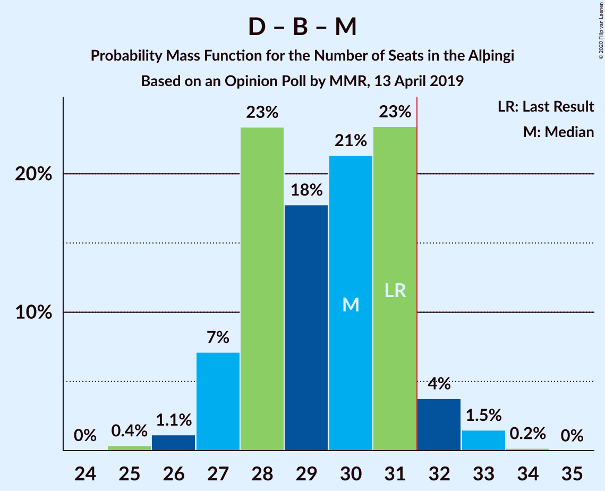

# Opinion Poll by MMR, 13 April 2019

<a href="#voting-intentions">Voting Intentions</a> | <a href="#seats">Seats</a> | <a href="#coalitions">Coalitions</a> | <a href="#technical-information">Technical Information</a>

## Voting Intentions

### Confidence Intervals

| Party | Last Result | Poll Result | 80% Confidence Interval | 90% Confidence Interval | 95% Confidence Interval | 99% Confidence Interval |
|:-----:|:-----------:|:-----------:|:-----------------------:|:-----------------------:|:-----------------------:|:-----------------------:|
| Sjálfstæðisflokkurinn | 25.2% | 22.5% | 20.8–24.4% |20.3–24.9% |19.9–25.4% |19.1–26.3% |
| Samfylkingin | 12.1% | 14.3% | 12.9–15.9% |12.5–16.3% |12.2–16.7% |11.5–17.5% |
| Píratar | 9.2% | 13.3% | 11.9–14.8% |11.6–15.3% |11.2–15.7% |10.6–16.4% |
| Vinstrihreyfingin – grænt framboð | 16.9% | 12.1% | 10.8–13.6% |10.4–14.0% |10.1–14.4% |9.5–15.1% |
| Framsóknarflokkurinn | 10.7% | 11.2% | 10.0–12.7% |9.6–13.1% |9.3–13.4% |8.7–14.1% |
| Miðflokkurinn | 10.9% | 9.2% | 8.1–10.6% |7.8–11.0% |7.5–11.3% |7.0–12.0% |
| Viðreisn | 6.7% | 7.8% | 6.8–9.1% |6.5–9.4% |6.2–9.7% |5.8–10.4% |
| Flokkur fólksins | 6.9% | 5.1% | 4.2–6.1% |4.0–6.4% |3.8–6.7% |3.4–7.2% |
| Sósíalistaflokkur Íslands | 0.0% | 2.9% | 2.3–3.7% |2.1–3.9% |2.0–4.2% |1.7–4.6% |

*Note:* The poll result column reflects the actual value used in the calculations. Published results may vary slightly, and in addition be rounded to fewer digits.

## Seats

### Confidence Intervals

| Party | Last Result | Median | 80% Confidence Interval | 90% Confidence Interval | 95% Confidence Interval | 99% Confidence Interval |
|:-----:|:-----------:|:------:|:-----------------------:|:-----------------------:|:-----------------------:|:-----------------------:|
| <a href="#sjálfstæðisflokkurinn">Sjálfstæðisflokkurinn</a> | 16 | 16 | 14–17 |14–18 |13–18 |13–19 |
| <a href="#samfylkingin">Samfylkingin</a> | 7 | 10 | 8–11 |8–11 |8–12 |7–12 |
| <a href="#píratar">Píratar</a> | 6 | 9 | 8–10 |8–10 |7–10 |7–12 |
| <a href="#vinstrihreyfingin-–-grænt-framboð">Vinstrihreyfingin – grænt framboð</a> | 11 | 8 | 7–9 |7–10 |6–10 |6–10 |
| <a href="#framsóknarflokkurinn">Framsóknarflokkurinn</a> | 8 | 8 | 7–9 |6–10 |6–10 |6–11 |
| <a href="#miðflokkurinn">Miðflokkurinn</a> | 7 | 6 | 5–7 |5–7 |5–8 |4–9 |
| <a href="#viðreisn">Viðreisn</a> | 4 | 5 | 4–6 |4–6 |4–6 |4–7 |
| <a href="#flokkur-fólksins">Flokkur fólksins</a> | 4 | 3 | 0–4 |0–4 |0–4 |0–4 |
| <a href="#sósíalistaflokkur-íslands">Sósíalistaflokkur Íslands</a> | 0 | 0 | 0 |0 |0 |0 |

### Sjálfstæðisflokkurinn

*For a full overview of the results for this party, see the [Sjálfstæðisflokkurinn](party-sjálfstæðisflokkurinn.html) page.*

| Number of Seats | Probability | Accumulated | Special Marks |
|:---------------:|:-----------:|:-----------:|:-------------:|
| 12 | 0.1% | 100% |  |
| 13 | 3% | 99.9% |  |
| 14 | 15% | 97% |  |
| 15 | 30% | 81% |  |
| 16 | 26% | 52% | Last Result, Median |
| 17 | 19% | 25% |  |
| 18 | 6% | 7% |  |
| 19 | 1.0% | 1.0% |  |
| 20 | 0% | 0% |  |

### Samfylkingin

*For a full overview of the results for this party, see the [Samfylkingin](party-samfylkingin.html) page.*

| Number of Seats | Probability | Accumulated | Special Marks |
|:---------------:|:-----------:|:-----------:|:-------------:|
| 7 | 0.9% | 100% | Last Result |
| 8 | 13% | 99.1% |  |
| 9 | 22% | 86% |  |
| 10 | 40% | 64% | Median |
| 11 | 20% | 24% |  |
| 12 | 4% | 4% |  |
| 13 | 0.1% | 0.1% |  |
| 14 | 0% | 0% |  |

### Píratar

*For a full overview of the results for this party, see the [Píratar](party-píratar.html) page.*

| Number of Seats | Probability | Accumulated | Special Marks |
|:---------------:|:-----------:|:-----------:|:-------------:|
| 6 | 0.2% | 100% | Last Result |
| 7 | 3% | 99.8% |  |
| 8 | 44% | 97% |  |
| 9 | 26% | 53% | Median |
| 10 | 25% | 27% |  |
| 11 | 2% | 2% |  |
| 12 | 0.7% | 0.7% |  |
| 13 | 0% | 0% |  |

### Vinstrihreyfingin – grænt framboð

*For a full overview of the results for this party, see the [Vinstrihreyfingin – grænt framboð](party-vinstrihreyfingin–græntframboð.html) page.*

| Number of Seats | Probability | Accumulated | Special Marks |
|:---------------:|:-----------:|:-----------:|:-------------:|
| 6 | 3% | 100% |  |
| 7 | 21% | 97% |  |
| 8 | 45% | 76% | Median |
| 9 | 25% | 32% |  |
| 10 | 6% | 7% |  |
| 11 | 0.2% | 0.2% | Last Result |
| 12 | 0% | 0% |  |

### Framsóknarflokkurinn

*For a full overview of the results for this party, see the [Framsóknarflokkurinn](party-framsóknarflokkurinn.html) page.*

| Number of Seats | Probability | Accumulated | Special Marks |
|:---------------:|:-----------:|:-----------:|:-------------:|
| 5 | 0.2% | 100% |  |
| 6 | 8% | 99.8% |  |
| 7 | 25% | 92% |  |
| 8 | 55% | 68% | Last Result, Median |
| 9 | 5% | 13% |  |
| 10 | 7% | 8% |  |
| 11 | 0.8% | 0.9% |  |
| 12 | 0% | 0% |  |

### Miðflokkurinn

*For a full overview of the results for this party, see the [Miðflokkurinn](party-miðflokkurinn.html) page.*

| Number of Seats | Probability | Accumulated | Special Marks |
|:---------------:|:-----------:|:-----------:|:-------------:|
| 4 | 0.9% | 100% |  |
| 5 | 28% | 99.1% |  |
| 6 | 49% | 71% | Median |
| 7 | 17% | 22% | Last Result |
| 8 | 2% | 5% |  |
| 9 | 2% | 2% |  |
| 10 | 0% | 0% |  |

### Viðreisn

*For a full overview of the results for this party, see the [Viðreisn](party-viðreisn.html) page.*

| Number of Seats | Probability | Accumulated | Special Marks |
|:---------------:|:-----------:|:-----------:|:-------------:|
| 3 | 0.3% | 100% |  |
| 4 | 24% | 99.6% | Last Result |
| 5 | 53% | 76% | Median |
| 6 | 21% | 23% |  |
| 7 | 2% | 2% |  |
| 8 | 0.1% | 0.1% |  |
| 9 | 0% | 0% |  |

### Flokkur fólksins

*For a full overview of the results for this party, see the [Flokkur fólksins](party-flokkurfólksins.html) page.*

| Number of Seats | Probability | Accumulated | Special Marks |
|:---------------:|:-----------:|:-----------:|:-------------:|
| 0 | 45% | 100% |  |
| 1 | 0% | 55% |  |
| 2 | 0% | 55% |  |
| 3 | 35% | 55% | Median |
| 4 | 20% | 21% | Last Result |
| 5 | 0.4% | 0.4% |  |
| 6 | 0% | 0% |  |

### Sósíalistaflokkur Íslands

*For a full overview of the results for this party, see the [Sósíalistaflokkur Íslands](party-sósíalistaflokkuríslands.html) page.*

| Number of Seats | Probability | Accumulated | Special Marks |
|:---------------:|:-----------:|:-----------:|:-------------:|
| 0 | 100% | 100% | Last Result, Median |

## Coalitions

### Confidence Intervals

| Coalition | Last Result | Median | Majority? | 80% Confidence Interval | 90% Confidence Interval | 95% Confidence Interval | 99% Confidence Interval |
|:---------:|:-----------:|:------:|:---------:|:-----------------------:|:-----------------------:|:-----------------------:|:-----------------------:|
| Samfylkingin – Vinstrihreyfingin – grænt framboð – Framsóknarflokkurinn – Miðflokkurinn | 33 | 32 | 58% | 30–33 | 29–34 | 29–35 | 28–35 |
| Samfylkingin – Píratar – Vinstrihreyfingin – grænt framboð – Viðreisn | 28 | 32 | 61% | 30–34 | 29–34 | 29–35 | 28–36 |
| Sjálfstæðisflokkurinn – Vinstrihreyfingin – grænt framboð – Framsóknarflokkurinn | 35 | 31 | 49% | 30–34 | 29–34 | 28–34 | 28–35 |
| Sjálfstæðisflokkurinn – Framsóknarflokkurinn – Miðflokkurinn | 31 | 30 | 5% | 28–31 | 27–32 | 27–32 | 26–33 |
| Samfylkingin – Píratar – Vinstrihreyfingin – grænt framboð | 24 | 27 | 0.1% | 25–29 | 24–29 | 24–30 | 23–31 |
| Samfylkingin – Vinstrihreyfingin – grænt framboð – Framsóknarflokkurinn | 26 | 26 | 0% | 24–28 | 23–28 | 23–28 | 22–30 |
| Sjálfstæðisflokkurinn – Samfylkingin | 23 | 26 | 0% | 23–27 | 22–28 | 22–28 | 22–29 |
| Samfylkingin – Vinstrihreyfingin – grænt framboð – Miðflokkurinn | 25 | 24 | 0% | 22–26 | 21–26 | 21–27 | 20–27 |
| Sjálfstæðisflokkurinn – Vinstrihreyfingin – grænt framboð | 27 | 24 | 0% | 22–26 | 21–26 | 21–27 | 20–27 |
| Sjálfstæðisflokkurinn – Framsóknarflokkurinn | 24 | 24 | 0% | 22–25 | 21–26 | 21–26 | 20–27 |
| Vinstrihreyfingin – grænt framboð – Framsóknarflokkurinn – Miðflokkurinn | 26 | 22 | 0% | 20–24 | 20–24 | 19–25 | 19–26 |
| Sjálfstæðisflokkurinn – Miðflokkurinn | 23 | 22 | 0% | 20–23 | 19–24 | 19–24 | 18–25 |
| Sjálfstæðisflokkurinn – Viðreisn | 20 | 21 | 0% | 19–22 | 18–23 | 18–23 | 17–24 |
| Samfylkingin – Vinstrihreyfingin – grænt framboð | 18 | 18 | 0% | 16–20 | 16–20 | 15–20 | 15–21 |
| Píratar – Vinstrihreyfingin – grænt framboð | 17 | 17 | 0% | 15–19 | 15–19 | 14–20 | 14–20 |
| Vinstrihreyfingin – grænt framboð – Framsóknarflokkurinn | 19 | 16 | 0% | 14–17 | 14–18 | 14–18 | 13–19 |
| Vinstrihreyfingin – grænt framboð – Miðflokkurinn | 18 | 14 | 0% | 13–16 | 12–16 | 12–17 | 11–17 |

### Samfylkingin – Vinstrihreyfingin – grænt framboð – Framsóknarflokkurinn – Miðflokkurinn

| Number of Seats | Probability | Accumulated | Special Marks |
|:---------------:|:-----------:|:-----------:|:-------------:|
| 27 | 0.2% | 100% |  |
| 28 | 1.0% | 99.8% |  |
| 29 | 6% | 98.8% |  |
| 30 | 15% | 92% |  |
| 31 | 19% | 77% |  |
| 32 | 29% | 58% | Median, Majority |
| 33 | 19% | 29% | Last Result |
| 34 | 7% | 10% |  |
| 35 | 3% | 3% |  |
| 36 | 0.3% | 0.3% |  |
| 37 | 0% | 0% |  |

### Samfylkingin – Píratar – Vinstrihreyfingin – grænt framboð – Viðreisn

| Number of Seats | Probability | Accumulated | Special Marks |
|:---------------:|:-----------:|:-----------:|:-------------:|
| 27 | 0.2% | 100% |  |
| 28 | 1.0% | 99.8% | Last Result |
| 29 | 9% | 98.8% |  |
| 30 | 16% | 90% |  |
| 31 | 12% | 74% |  |
| 32 | 35% | 61% | Median, Majority |
| 33 | 12% | 26% |  |
| 34 | 9% | 14% |  |
| 35 | 4% | 5% |  |
| 36 | 0.5% | 0.6% |  |
| 37 | 0% | 0% |  |

### Sjálfstæðisflokkurinn – Vinstrihreyfingin – grænt framboð – Framsóknarflokkurinn

| Number of Seats | Probability | Accumulated | Special Marks |
|:---------------:|:-----------:|:-----------:|:-------------:|
| 27 | 0.2% | 100% |  |
| 28 | 2% | 99.7% |  |
| 29 | 7% | 97% |  |
| 30 | 17% | 91% |  |
| 31 | 24% | 74% |  |
| 32 | 18% | 49% | Median, Majority |
| 33 | 19% | 31% |  |
| 34 | 10% | 12% |  |
| 35 | 2% | 2% | Last Result |
| 36 | 0.1% | 0.1% |  |
| 37 | 0% | 0% |  |

### Sjálfstæðisflokkurinn – Framsóknarflokkurinn – Miðflokkurinn

| Number of Seats | Probability | Accumulated | Special Marks |
|:---------------:|:-----------:|:-----------:|:-------------:|
| 25 | 0.4% | 100% |  |
| 26 | 1.1% | 99.6% |  |
| 27 | 7% | 98% |  |
| 28 | 23% | 91% |  |
| 29 | 18% | 68% |  |
| 30 | 21% | 50% | Median |
| 31 | 23% | 29% | Last Result |
| 32 | 4% | 5% | Majority |
| 33 | 1.5% | 2% |  |
| 34 | 0.2% | 0.2% |  |
| 35 | 0% | 0% |  |

### Samfylkingin – Píratar – Vinstrihreyfingin – grænt framboð

| Number of Seats | Probability | Accumulated | Special Marks |
|:---------------:|:-----------:|:-----------:|:-------------:|
| 22 | 0.1% | 100% |  |
| 23 | 2% | 99.9% |  |
| 24 | 7% | 98% | Last Result |
| 25 | 11% | 91% |  |
| 26 | 24% | 80% |  |
| 27 | 28% | 56% | Median |
| 28 | 17% | 28% |  |
| 29 | 8% | 11% |  |
| 30 | 2% | 3% |  |
| 31 | 0.9% | 0.9% |  |
| 32 | 0.1% | 0.1% | Majority |
| 33 | 0% | 0% |  |

### Samfylkingin – Vinstrihreyfingin – grænt framboð – Framsóknarflokkurinn

| Number of Seats | Probability | Accumulated | Special Marks |
|:---------------:|:-----------:|:-----------:|:-------------:|
| 21 | 0.1% | 100% |  |
| 22 | 0.9% | 99.8% |  |
| 23 | 6% | 98.9% |  |
| 24 | 16% | 93% |  |
| 25 | 18% | 77% |  |
| 26 | 28% | 58% | Last Result, Median |
| 27 | 19% | 30% |  |
| 28 | 8% | 11% |  |
| 29 | 2% | 2% |  |
| 30 | 0.6% | 0.6% |  |
| 31 | 0% | 0% |  |

### Sjálfstæðisflokkurinn – Samfylkingin

| Number of Seats | Probability | Accumulated | Special Marks |
|:---------------:|:-----------:|:-----------:|:-------------:|
| 21 | 0.3% | 100% |  |
| 22 | 5% | 99.7% |  |
| 23 | 11% | 95% | Last Result |
| 24 | 10% | 84% |  |
| 25 | 23% | 73% |  |
| 26 | 22% | 51% | Median |
| 27 | 21% | 29% |  |
| 28 | 7% | 8% |  |
| 29 | 0.8% | 0.8% |  |
| 30 | 0% | 0% |  |

### Samfylkingin – Vinstrihreyfingin – grænt framboð – Miðflokkurinn

| Number of Seats | Probability | Accumulated | Special Marks |
|:---------------:|:-----------:|:-----------:|:-------------:|
| 19 | 0.1% | 100% |  |
| 20 | 0.5% | 99.9% |  |
| 21 | 4% | 99.4% |  |
| 22 | 13% | 95% |  |
| 23 | 21% | 82% |  |
| 24 | 27% | 61% | Median |
| 25 | 21% | 34% | Last Result |
| 26 | 10% | 13% |  |
| 27 | 2% | 3% |  |
| 28 | 0.3% | 0.4% |  |
| 29 | 0.1% | 0.1% |  |
| 30 | 0% | 0% |  |

### Sjálfstæðisflokkurinn – Vinstrihreyfingin – grænt framboð

| Number of Seats | Probability | Accumulated | Special Marks |
|:---------------:|:-----------:|:-----------:|:-------------:|
| 19 | 0.1% | 100% |  |
| 20 | 1.2% | 99.9% |  |
| 21 | 5% | 98.8% |  |
| 22 | 14% | 93% |  |
| 23 | 23% | 80% |  |
| 24 | 26% | 56% | Median |
| 25 | 18% | 31% |  |
| 26 | 9% | 12% |  |
| 27 | 3% | 3% | Last Result |
| 28 | 0.2% | 0.2% |  |
| 29 | 0% | 0% |  |

### Sjálfstæðisflokkurinn – Framsóknarflokkurinn

| Number of Seats | Probability | Accumulated | Special Marks |
|:---------------:|:-----------:|:-----------:|:-------------:|
| 19 | 0.1% | 100% |  |
| 20 | 1.1% | 99.8% |  |
| 21 | 8% | 98.7% |  |
| 22 | 23% | 91% |  |
| 23 | 16% | 68% |  |
| 24 | 24% | 52% | Last Result, Median |
| 25 | 21% | 28% |  |
| 26 | 5% | 7% |  |
| 27 | 1.2% | 1.2% |  |
| 28 | 0.1% | 0.1% |  |
| 29 | 0% | 0% |  |

### Vinstrihreyfingin – grænt framboð – Framsóknarflokkurinn – Miðflokkurinn

| Number of Seats | Probability | Accumulated | Special Marks |
|:---------------:|:-----------:|:-----------:|:-------------:|
| 17 | 0.1% | 100% |  |
| 18 | 0.4% | 99.9% |  |
| 19 | 2% | 99.5% |  |
| 20 | 11% | 97% |  |
| 21 | 25% | 86% |  |
| 22 | 27% | 61% | Median |
| 23 | 22% | 33% |  |
| 24 | 9% | 12% |  |
| 25 | 2% | 3% |  |
| 26 | 0.4% | 0.5% | Last Result |
| 27 | 0.1% | 0.1% |  |
| 28 | 0% | 0% |  |

### Sjálfstæðisflokkurinn – Miðflokkurinn

| Number of Seats | Probability | Accumulated | Special Marks |
|:---------------:|:-----------:|:-----------:|:-------------:|
| 18 | 0.6% | 100% |  |
| 19 | 6% | 99.3% |  |
| 20 | 15% | 94% |  |
| 21 | 27% | 79% |  |
| 22 | 21% | 51% | Median |
| 23 | 23% | 30% | Last Result |
| 24 | 5% | 7% |  |
| 25 | 1.2% | 1.5% |  |
| 26 | 0.2% | 0.2% |  |
| 27 | 0% | 0% |  |

### Sjálfstæðisflokkurinn – Viðreisn

| Number of Seats | Probability | Accumulated | Special Marks |
|:---------------:|:-----------:|:-----------:|:-------------:|
| 17 | 0.5% | 100% |  |
| 18 | 5% | 99.5% |  |
| 19 | 16% | 95% |  |
| 20 | 27% | 79% | Last Result |
| 21 | 23% | 52% | Median |
| 22 | 21% | 29% |  |
| 23 | 6% | 8% |  |
| 24 | 1.3% | 2% |  |
| 25 | 0.2% | 0.2% |  |
| 26 | 0% | 0% |  |

### Samfylkingin – Vinstrihreyfingin – grænt framboð

| Number of Seats | Probability | Accumulated | Special Marks |
|:---------------:|:-----------:|:-----------:|:-------------:|
| 14 | 0.3% | 100% |  |
| 15 | 3% | 99.6% |  |
| 16 | 13% | 96% |  |
| 17 | 21% | 83% |  |
| 18 | 27% | 62% | Last Result, Median |
| 19 | 25% | 35% |  |
| 20 | 9% | 10% |  |
| 21 | 1.1% | 1.3% |  |
| 22 | 0.2% | 0.2% |  |
| 23 | 0% | 0% |  |

### Píratar – Vinstrihreyfingin – grænt framboð

| Number of Seats | Probability | Accumulated | Special Marks |
|:---------------:|:-----------:|:-----------:|:-------------:|
| 13 | 0.1% | 100% |  |
| 14 | 3% | 99.9% |  |
| 15 | 8% | 97% |  |
| 16 | 32% | 89% |  |
| 17 | 25% | 57% | Last Result, Median |
| 18 | 18% | 32% |  |
| 19 | 10% | 13% |  |
| 20 | 3% | 3% |  |
| 21 | 0.2% | 0.3% |  |
| 22 | 0% | 0% |  |

### Vinstrihreyfingin – grænt framboð – Framsóknarflokkurinn

| Number of Seats | Probability | Accumulated | Special Marks |
|:---------------:|:-----------:|:-----------:|:-------------:|
| 12 | 0.3% | 100% |  |
| 13 | 2% | 99.7% |  |
| 14 | 8% | 98% |  |
| 15 | 24% | 89% |  |
| 16 | 37% | 66% | Median |
| 17 | 19% | 29% |  |
| 18 | 8% | 10% |  |
| 19 | 1.5% | 2% | Last Result |
| 20 | 0.3% | 0.3% |  |
| 21 | 0% | 0% |  |

### Vinstrihreyfingin – grænt framboð – Miðflokkurinn

| Number of Seats | Probability | Accumulated | Special Marks |
|:---------------:|:-----------:|:-----------:|:-------------:|
| 11 | 1.1% | 100% |  |
| 12 | 6% | 98.9% |  |
| 13 | 26% | 92% |  |
| 14 | 31% | 67% | Median |
| 15 | 22% | 36% |  |
| 16 | 11% | 14% |  |
| 17 | 3% | 3% |  |
| 18 | 0.3% | 0.3% | Last Result |
| 19 | 0% | 0% |  |

## Technical Information

### Opinion Poll

+ **Polling firm:** MMR
+ **Commissioner(s):** —
+ **Fieldwork period:** 13 April 2019

### Calculations

+ **Sample size:** 910
+ **Simulations done:** 1,048,576
+ **Error estimate:** 1.65%

