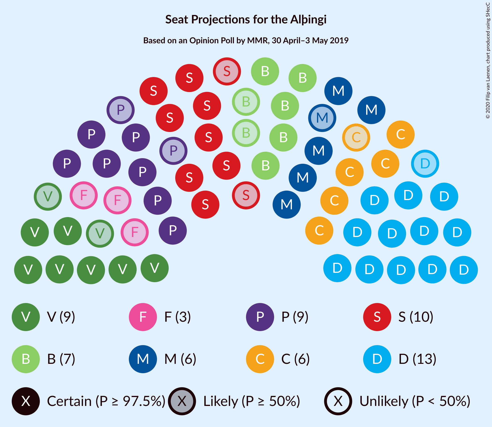
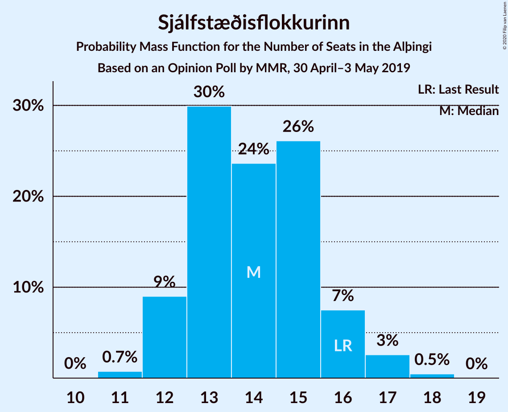
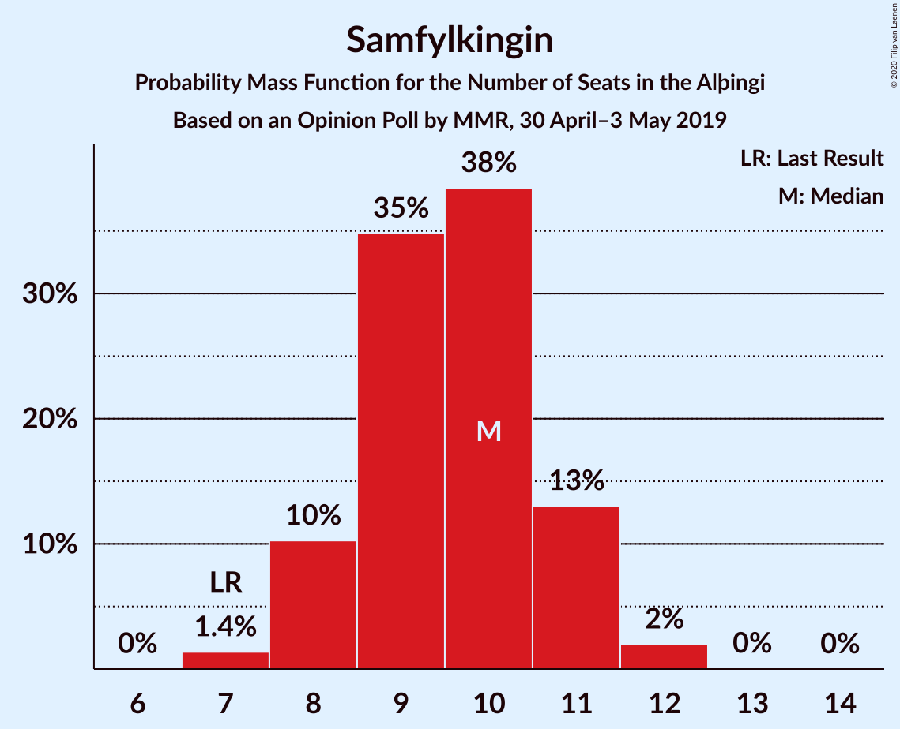
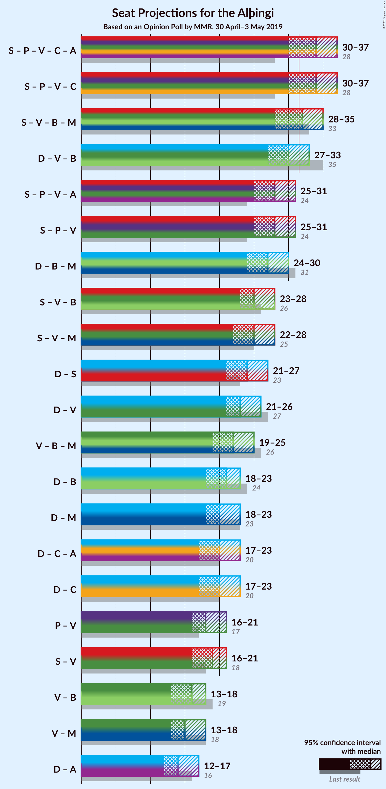
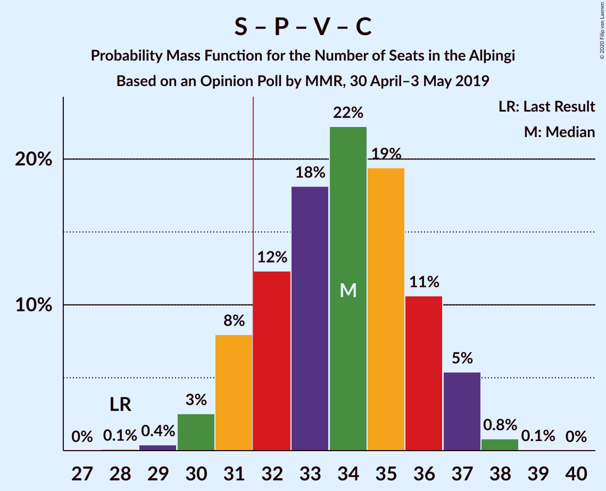
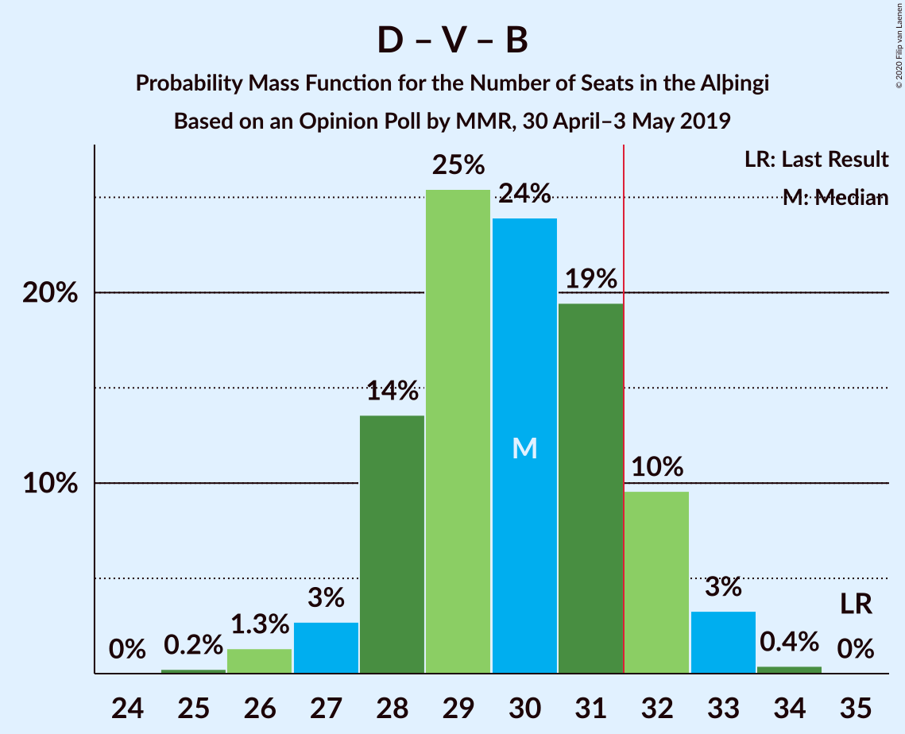
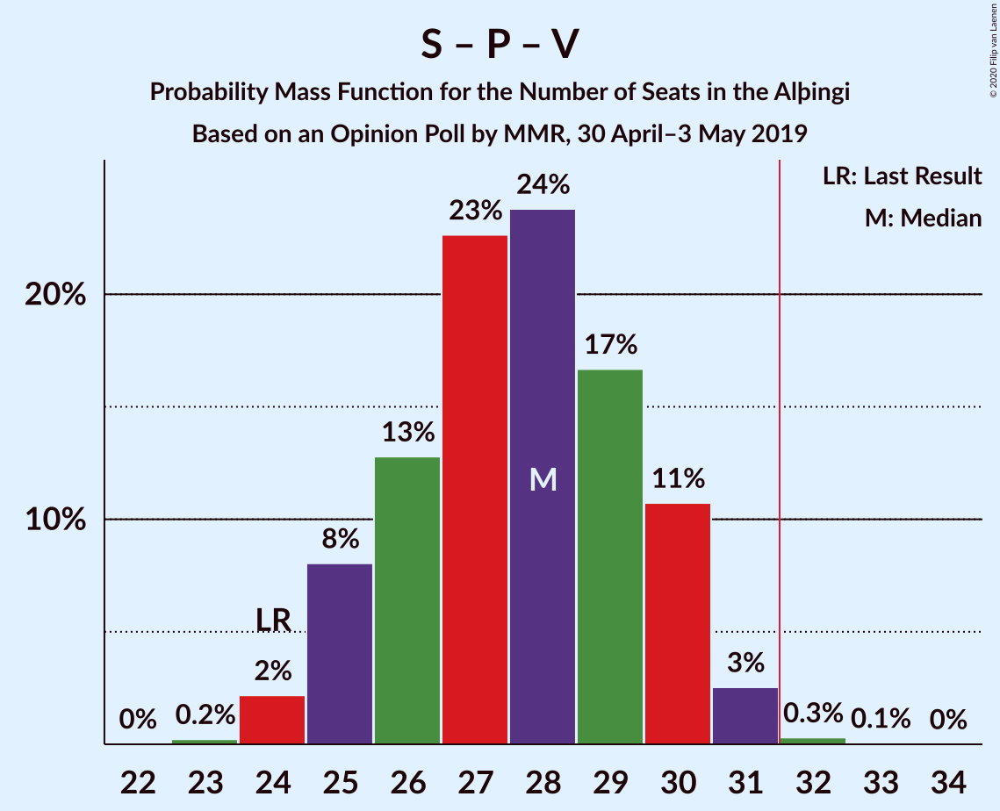
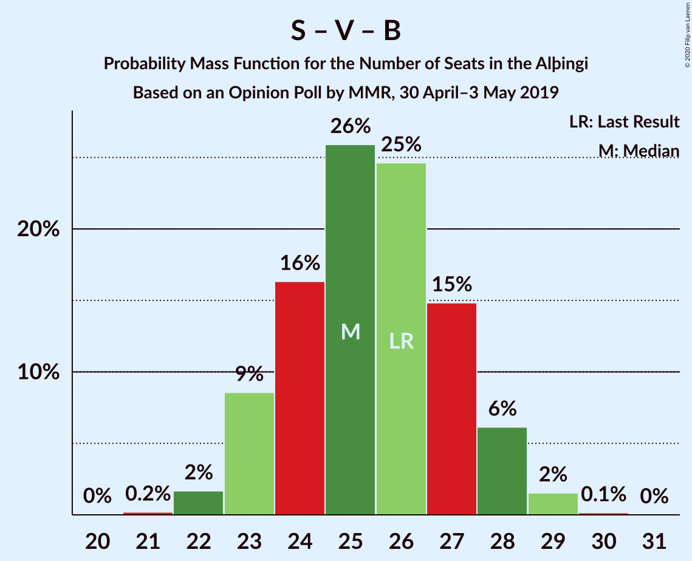

# Opinion Poll by MMR, 30 April–3 May 2019

<a href="#voting-intentions">Voting Intentions</a> | <a href="#seats">Seats</a> | <a href="#coalitions">Coalitions</a> | <a href="#technical-information">Technical Information</a>

## Voting Intentions

### Confidence Intervals

| Party | Last Result | Poll Result | 80% Confidence Interval | 90% Confidence Interval | 95% Confidence Interval | 99% Confidence Interval |
|:-----:|:-----------:|:-----------:|:-----------------------:|:-----------------------:|:-----------------------:|:-----------------------:|
| Sjálfstæðisflokkurinn | 25.2% | 20.2% | 18.6–21.9% |18.1–22.5% |17.8–22.9% |17.0–23.7% |
| Samfylkingin | 12.1% | 14.1% | 12.8–15.7% |12.4–16.1% |12.1–16.5% |11.4–17.3% |
| Vinstrihreyfingin – grænt framboð | 16.9% | 13.4% | 12.1–14.9% |11.7–15.3% |11.4–15.7% |10.7–16.5% |
| Píratar | 9.2% | 13.4% | 12.1–14.9% |11.7–15.3% |11.4–15.7% |10.7–16.5% |
| Framsóknarflokkurinn | 10.7% | 9.8% | 8.6–11.1% |8.3–11.5% |8.0–11.8% |7.5–12.5% |
| Miðflokkurinn | 10.9% | 9.2% | 8.1–10.6% |7.8–10.9% |7.6–11.3% |7.1–11.9% |
| Viðreisn | 6.7% | 9.2% | 8.1–10.6% |7.8–10.9% |7.6–11.3% |7.1–11.9% |
| Flokkur fólksins | 6.9% | 5.1% | 4.3–6.1% |4.1–6.4% |3.9–6.7% |3.5–7.2% |
| Sósíalistaflokkur Íslands | 0.0% | 4.3% | 3.5–5.2% |3.3–5.5% |3.1–5.7% |2.8–6.2% |

*Note:* The poll result column reflects the actual value used in the calculations. Published results may vary slightly, and in addition be rounded to fewer digits.

## Seats

### Confidence Intervals

| Party | Last Result | Median | 80% Confidence Interval | 90% Confidence Interval | 95% Confidence Interval | 99% Confidence Interval |
|:-----:|:-----------:|:------:|:-----------------------:|:-----------------------:|:-----------------------:|:-----------------------:|
| <a href="#sjálfstæðisflokkurinn">Sjálfstæðisflokkurinn</a> | 16 | 13 | 12–15 |12–16 |12–16 |12–17 |
| <a href="#samfylkingin">Samfylkingin</a> | 7 | 9 | 8–11 |8–11 |8–11 |7–12 |
| <a href="#vinstrihreyfingin-–-grænt-framboð">Vinstrihreyfingin – grænt framboð</a> | 11 | 10 | 8–10 |8–11 |7–11 |7–11 |
| <a href="#píratar">Píratar</a> | 6 | 9 | 8–10 |8–10 |7–11 |7–11 |
| <a href="#framsóknarflokkurinn">Framsóknarflokkurinn</a> | 8 | 7 | 6–8 |6–9 |5–10 |5–10 |
| <a href="#miðflokkurinn">Miðflokkurinn</a> | 7 | 6 | 5–7 |5–7 |5–9 |4–9 |
| <a href="#viðreisn">Viðreisn</a> | 4 | 6 | 5–7 |5–7 |5–8 |4–8 |
| <a href="#flokkur-fólksins">Flokkur fólksins</a> | 4 | 3 | 0–4 |0–4 |0–4 |0–5 |
| <a href="#sósíalistaflokkur-íslands">Sósíalistaflokkur Íslands</a> | 0 | 0 | 0 |0–3 |0–3 |0–4 |

### Sjálfstæðisflokkurinn

*For a full overview of the results for this party, see the [Sjálfstæðisflokkurinn](party-sjálfstæðisflokkurinn.html) page.*

| Number of Seats | Probability | Accumulated | Special Marks |
|:---------------:|:-----------:|:-----------:|:-------------:|
| 11 | 0.2% | 100% |  |
| 12 | 18% | 99.8% |  |
| 13 | 37% | 82% | Median |
| 14 | 23% | 45% |  |
| 15 | 16% | 22% |  |
| 16 | 5% | 6% | Last Result |
| 17 | 0.8% | 1.2% |  |
| 18 | 0.5% | 0.5% |  |
| 19 | 0% | 0% |  |

### Samfylkingin

*For a full overview of the results for this party, see the [Samfylkingin](party-samfylkingin.html) page.*

| Number of Seats | Probability | Accumulated | Special Marks |
|:---------------:|:-----------:|:-----------:|:-------------:|
| 7 | 0.5% | 100% | Last Result |
| 8 | 12% | 99.4% |  |
| 9 | 45% | 87% | Median |
| 10 | 21% | 42% |  |
| 11 | 20% | 21% |  |
| 12 | 2% | 2% |  |
| 13 | 0.1% | 0.1% |  |
| 14 | 0% | 0% |  |

### Vinstrihreyfingin – grænt framboð

*For a full overview of the results for this party, see the [Vinstrihreyfingin – grænt framboð](party-vinstrihreyfingin–græntframboð.html) page.*

| Number of Seats | Probability | Accumulated | Special Marks |
|:---------------:|:-----------:|:-----------:|:-------------:|
| 6 | 0.1% | 100% |  |
| 7 | 3% | 99.9% |  |
| 8 | 29% | 97% |  |
| 9 | 14% | 68% |  |
| 10 | 49% | 54% | Median |
| 11 | 5% | 5% | Last Result |
| 12 | 0.2% | 0.2% |  |
| 13 | 0% | 0% |  |

### Píratar

*For a full overview of the results for this party, see the [Píratar](party-píratar.html) page.*

| Number of Seats | Probability | Accumulated | Special Marks |
|:---------------:|:-----------:|:-----------:|:-------------:|
| 6 | 0.1% | 100% | Last Result |
| 7 | 4% | 99.9% |  |
| 8 | 26% | 96% |  |
| 9 | 48% | 70% | Median |
| 10 | 18% | 21% |  |
| 11 | 3% | 3% |  |
| 12 | 0.5% | 0.5% |  |
| 13 | 0% | 0% |  |

### Framsóknarflokkurinn

*For a full overview of the results for this party, see the [Framsóknarflokkurinn](party-framsóknarflokkurinn.html) page.*

| Number of Seats | Probability | Accumulated | Special Marks |
|:---------------:|:-----------:|:-----------:|:-------------:|
| 4 | 0.4% | 100% |  |
| 5 | 4% | 99.6% |  |
| 6 | 33% | 95% |  |
| 7 | 39% | 62% | Median |
| 8 | 17% | 23% | Last Result |
| 9 | 1.5% | 6% |  |
| 10 | 4% | 4% |  |
| 11 | 0% | 0% |  |

### Miðflokkurinn

*For a full overview of the results for this party, see the [Miðflokkurinn](party-miðflokkurinn.html) page.*

| Number of Seats | Probability | Accumulated | Special Marks |
|:---------------:|:-----------:|:-----------:|:-------------:|
| 4 | 0.8% | 100% |  |
| 5 | 32% | 99.2% |  |
| 6 | 37% | 67% | Median |
| 7 | 26% | 30% | Last Result |
| 8 | 0.7% | 4% |  |
| 9 | 3% | 3% |  |
| 10 | 0% | 0% |  |

### Viðreisn

*For a full overview of the results for this party, see the [Viðreisn](party-viðreisn.html) page.*

| Number of Seats | Probability | Accumulated | Special Marks |
|:---------------:|:-----------:|:-----------:|:-------------:|
| 4 | 2% | 100% | Last Result |
| 5 | 29% | 98% |  |
| 6 | 54% | 70% | Median |
| 7 | 12% | 16% |  |
| 8 | 4% | 4% |  |
| 9 | 0% | 0% |  |

### Flokkur fólksins

*For a full overview of the results for this party, see the [Flokkur fólksins](party-flokkurfólksins.html) page.*

| Number of Seats | Probability | Accumulated | Special Marks |
|:---------------:|:-----------:|:-----------:|:-------------:|
| 0 | 20% | 100% |  |
| 1 | 0.7% | 80% |  |
| 2 | 0% | 79% |  |
| 3 | 52% | 79% | Median |
| 4 | 24% | 27% | Last Result |
| 5 | 2% | 2% |  |
| 6 | 0% | 0% |  |

### Sósíalistaflokkur Íslands

*For a full overview of the results for this party, see the [Sósíalistaflokkur Íslands](party-sósíalistaflokkuríslands.html) page.*

| Number of Seats | Probability | Accumulated | Special Marks |
|:---------------:|:-----------:|:-----------:|:-------------:|
| 0 | 90% | 100% | Last Result, Median |
| 1 | 0.9% | 10% |  |
| 2 | 0% | 9% |  |
| 3 | 8% | 9% |  |
| 4 | 0.9% | 0.9% |  |
| 5 | 0% | 0% |  |

## Coalitions

### Confidence Intervals

| Coalition | Last Result | Median | Majority? | 80% Confidence Interval | 90% Confidence Interval | 95% Confidence Interval | 99% Confidence Interval |
|:---------:|:-----------:|:------:|:---------:|:-----------------------:|:-----------------------:|:-----------------------:|:-----------------------:|
| Samfylkingin – Píratar – Vinstrihreyfingin – grænt framboð – Viðreisn | 28 | 33 | 92% | 32–36 | 31–37 | 31–37 | 30–38 |
| Samfylkingin – Vinstrihreyfingin – grænt framboð – Framsóknarflokkurinn – Miðflokkurinn | 33 | 32 | 57% | 30–34 | 30–34 | 29–35 | 28–35 |
| Sjálfstæðisflokkurinn – Vinstrihreyfingin – grænt framboð – Framsóknarflokkurinn | 35 | 30 | 9% | 28–31 | 28–32 | 27–32 | 26–33 |
| Samfylkingin – Píratar – Vinstrihreyfingin – grænt framboð | 24 | 27 | 0.2% | 26–30 | 25–30 | 25–30 | 24–31 |
| Sjálfstæðisflokkurinn – Framsóknarflokkurinn – Miðflokkurinn | 31 | 26 | 0% | 25–29 | 24–29 | 24–29 | 23–30 |
| Samfylkingin – Vinstrihreyfingin – grænt framboð – Framsóknarflokkurinn | 26 | 25 | 0% | 24–27 | 24–28 | 23–28 | 22–29 |
| Samfylkingin – Vinstrihreyfingin – grænt framboð – Miðflokkurinn | 25 | 25 | 0% | 22–28 | 22–28 | 22–28 | 21–28 |
| Sjálfstæðisflokkurinn – Samfylkingin | 23 | 23 | 0% | 21–25 | 21–25 | 21–26 | 21–27 |
| Sjálfstæðisflokkurinn – Vinstrihreyfingin – grænt framboð | 27 | 23 | 0% | 21–24 | 21–25 | 21–25 | 20–27 |
| Vinstrihreyfingin – grænt framboð – Framsóknarflokkurinn – Miðflokkurinn | 26 | 22 | 0% | 20–24 | 20–25 | 19–25 | 18–25 |
| Sjálfstæðisflokkurinn – Framsóknarflokkurinn | 24 | 20 | 0% | 18–23 | 18–23 | 18–23 | 18–24 |
| Sjálfstæðisflokkurinn – Viðreisn | 20 | 19 | 0% | 17–21 | 17–22 | 17–23 | 17–23 |
| Sjálfstæðisflokkurinn – Miðflokkurinn | 23 | 19 | 0% | 19–21 | 18–22 | 18–22 | 18–23 |
| Samfylkingin – Vinstrihreyfingin – grænt framboð | 18 | 19 | 0% | 17–21 | 17–21 | 17–21 | 16–21 |
| Píratar – Vinstrihreyfingin – grænt framboð | 17 | 18 | 0% | 17–20 | 16–20 | 16–21 | 15–21 |
| Vinstrihreyfingin – grænt framboð – Framsóknarflokkurinn | 19 | 16 | 0% | 15–17 | 14–18 | 14–18 | 13–19 |
| Vinstrihreyfingin – grænt framboð – Miðflokkurinn | 18 | 15 | 0% | 13–17 | 13–18 | 13–18 | 12–18 |

### Samfylkingin – Píratar – Vinstrihreyfingin – grænt framboð – Viðreisn

| Number of Seats | Probability | Accumulated | Special Marks |
|:---------------:|:-----------:|:-----------:|:-------------:|
| 28 | 0% | 100% | Last Result |
| 29 | 0.1% | 100% |  |
| 30 | 0.8% | 99.8% |  |
| 31 | 7% | 99.0% |  |
| 32 | 19% | 92% | Majority |
| 33 | 29% | 73% |  |
| 34 | 14% | 44% | Median |
| 35 | 19% | 30% |  |
| 36 | 5% | 11% |  |
| 37 | 5% | 6% |  |
| 38 | 0.9% | 1.0% |  |
| 39 | 0% | 0% |  |

### Samfylkingin – Vinstrihreyfingin – grænt framboð – Framsóknarflokkurinn – Miðflokkurinn

| Number of Seats | Probability | Accumulated | Special Marks |
|:---------------:|:-----------:|:-----------:|:-------------:|
| 26 | 0.1% | 100% |  |
| 27 | 0.2% | 99.9% |  |
| 28 | 2% | 99.7% |  |
| 29 | 2% | 98% |  |
| 30 | 27% | 96% |  |
| 31 | 12% | 68% |  |
| 32 | 27% | 57% | Median, Majority |
| 33 | 10% | 30% | Last Result |
| 34 | 17% | 20% |  |
| 35 | 3% | 3% |  |
| 36 | 0.3% | 0.3% |  |
| 37 | 0% | 0% |  |

### Sjálfstæðisflokkurinn – Vinstrihreyfingin – grænt framboð – Framsóknarflokkurinn

| Number of Seats | Probability | Accumulated | Special Marks |
|:---------------:|:-----------:|:-----------:|:-------------:|
| 25 | 0% | 100% |  |
| 26 | 1.1% | 99.9% |  |
| 27 | 3% | 98.9% |  |
| 28 | 20% | 96% |  |
| 29 | 23% | 76% |  |
| 30 | 18% | 53% | Median |
| 31 | 26% | 35% |  |
| 32 | 7% | 9% | Majority |
| 33 | 2% | 2% |  |
| 34 | 0.3% | 0.3% |  |
| 35 | 0% | 0% | Last Result |

### Samfylkingin – Píratar – Vinstrihreyfingin – grænt framboð

| Number of Seats | Probability | Accumulated | Special Marks |
|:---------------:|:-----------:|:-----------:|:-------------:|
| 23 | 0.2% | 100% |  |
| 24 | 0.4% | 99.7% | Last Result |
| 25 | 7% | 99.4% |  |
| 26 | 19% | 92% |  |
| 27 | 26% | 73% |  |
| 28 | 17% | 47% | Median |
| 29 | 5% | 30% |  |
| 30 | 23% | 25% |  |
| 31 | 1.3% | 2% |  |
| 32 | 0.2% | 0.2% | Majority |
| 33 | 0% | 0% |  |

### Sjálfstæðisflokkurinn – Framsóknarflokkurinn – Miðflokkurinn

| Number of Seats | Probability | Accumulated | Special Marks |
|:---------------:|:-----------:|:-----------:|:-------------:|
| 23 | 2% | 100% |  |
| 24 | 4% | 98% |  |
| 25 | 25% | 94% |  |
| 26 | 25% | 70% | Median |
| 27 | 14% | 45% |  |
| 28 | 20% | 31% |  |
| 29 | 10% | 11% |  |
| 30 | 1.2% | 1.4% |  |
| 31 | 0.2% | 0.2% | Last Result |
| 32 | 0% | 0% | Majority |

### Samfylkingin – Vinstrihreyfingin – grænt framboð – Framsóknarflokkurinn

| Number of Seats | Probability | Accumulated | Special Marks |
|:---------------:|:-----------:|:-----------:|:-------------:|
| 21 | 0.3% | 100% |  |
| 22 | 1.3% | 99.7% |  |
| 23 | 2% | 98% |  |
| 24 | 8% | 96% |  |
| 25 | 38% | 88% |  |
| 26 | 23% | 50% | Last Result, Median |
| 27 | 20% | 27% |  |
| 28 | 6% | 7% |  |
| 29 | 0.9% | 1.0% |  |
| 30 | 0.1% | 0.1% |  |
| 31 | 0% | 0% |  |

### Samfylkingin – Vinstrihreyfingin – grænt framboð – Miðflokkurinn

| Number of Seats | Probability | Accumulated | Special Marks |
|:---------------:|:-----------:|:-----------:|:-------------:|
| 20 | 0.2% | 100% |  |
| 21 | 0.4% | 99.8% |  |
| 22 | 16% | 99.4% |  |
| 23 | 13% | 83% |  |
| 24 | 12% | 70% |  |
| 25 | 22% | 58% | Last Result, Median |
| 26 | 16% | 36% |  |
| 27 | 6% | 20% |  |
| 28 | 13% | 14% |  |
| 29 | 0.3% | 0.3% |  |
| 30 | 0% | 0% |  |

### Sjálfstæðisflokkurinn – Samfylkingin

| Number of Seats | Probability | Accumulated | Special Marks |
|:---------------:|:-----------:|:-----------:|:-------------:|
| 19 | 0.1% | 100% |  |
| 20 | 0.4% | 99.9% |  |
| 21 | 14% | 99.5% |  |
| 22 | 18% | 85% | Median |
| 23 | 31% | 68% | Last Result |
| 24 | 23% | 37% |  |
| 25 | 11% | 14% |  |
| 26 | 2% | 3% |  |
| 27 | 0.6% | 1.0% |  |
| 28 | 0.3% | 0.3% |  |
| 29 | 0% | 0% |  |

### Sjálfstæðisflokkurinn – Vinstrihreyfingin – grænt framboð

| Number of Seats | Probability | Accumulated | Special Marks |
|:---------------:|:-----------:|:-----------:|:-------------:|
| 19 | 0.2% | 100% |  |
| 20 | 1.2% | 99.8% |  |
| 21 | 12% | 98.6% |  |
| 22 | 21% | 86% |  |
| 23 | 44% | 65% | Median |
| 24 | 13% | 21% |  |
| 25 | 6% | 8% |  |
| 26 | 1.1% | 2% |  |
| 27 | 0.7% | 0.8% | Last Result |
| 28 | 0% | 0% |  |

### Vinstrihreyfingin – grænt framboð – Framsóknarflokkurinn – Miðflokkurinn

| Number of Seats | Probability | Accumulated | Special Marks |
|:---------------:|:-----------:|:-----------:|:-------------:|
| 18 | 0.6% | 100% |  |
| 19 | 2% | 99.4% |  |
| 20 | 9% | 97% |  |
| 21 | 22% | 88% |  |
| 22 | 21% | 66% |  |
| 23 | 26% | 45% | Median |
| 24 | 13% | 18% |  |
| 25 | 6% | 6% |  |
| 26 | 0.2% | 0.3% | Last Result |
| 27 | 0.1% | 0.1% |  |
| 28 | 0% | 0% |  |

### Sjálfstæðisflokkurinn – Framsóknarflokkurinn

| Number of Seats | Probability | Accumulated | Special Marks |
|:---------------:|:-----------:|:-----------:|:-------------:|
| 17 | 0.2% | 100% |  |
| 18 | 16% | 99.8% |  |
| 19 | 18% | 84% |  |
| 20 | 21% | 66% | Median |
| 21 | 18% | 45% |  |
| 22 | 4% | 27% |  |
| 23 | 22% | 23% |  |
| 24 | 1.3% | 1.5% | Last Result |
| 25 | 0.1% | 0.1% |  |
| 26 | 0% | 0% |  |

### Sjálfstæðisflokkurinn – Viðreisn

| Number of Seats | Probability | Accumulated | Special Marks |
|:---------------:|:-----------:|:-----------:|:-------------:|
| 16 | 0.1% | 100% |  |
| 17 | 15% | 99.9% |  |
| 18 | 14% | 84% |  |
| 19 | 22% | 71% | Median |
| 20 | 20% | 49% | Last Result |
| 21 | 23% | 30% |  |
| 22 | 4% | 7% |  |
| 23 | 3% | 3% |  |
| 24 | 0.2% | 0.3% |  |
| 25 | 0.2% | 0.2% |  |
| 26 | 0% | 0% |  |

### Sjálfstæðisflokkurinn – Miðflokkurinn

| Number of Seats | Probability | Accumulated | Special Marks |
|:---------------:|:-----------:|:-----------:|:-------------:|
| 17 | 0.4% | 100% |  |
| 18 | 7% | 99.6% |  |
| 19 | 48% | 93% | Median |
| 20 | 32% | 45% |  |
| 21 | 5% | 12% |  |
| 22 | 5% | 8% |  |
| 23 | 2% | 2% | Last Result |
| 24 | 0.4% | 0.5% |  |
| 25 | 0% | 0% |  |

### Samfylkingin – Vinstrihreyfingin – grænt framboð

| Number of Seats | Probability | Accumulated | Special Marks |
|:---------------:|:-----------:|:-----------:|:-------------:|
| 15 | 0.4% | 100% |  |
| 16 | 2% | 99.5% |  |
| 17 | 22% | 98% |  |
| 18 | 24% | 76% | Last Result |
| 19 | 19% | 52% | Median |
| 20 | 16% | 33% |  |
| 21 | 17% | 18% |  |
| 22 | 0.3% | 0.4% |  |
| 23 | 0.1% | 0.1% |  |
| 24 | 0% | 0% |  |

### Píratar – Vinstrihreyfingin – grænt framboð

| Number of Seats | Probability | Accumulated | Special Marks |
|:---------------:|:-----------:|:-----------:|:-------------:|
| 14 | 0.1% | 100% |  |
| 15 | 2% | 99.9% |  |
| 16 | 6% | 98% |  |
| 17 | 27% | 93% | Last Result |
| 18 | 25% | 65% |  |
| 19 | 23% | 40% | Median |
| 20 | 13% | 16% |  |
| 21 | 3% | 3% |  |
| 22 | 0.2% | 0.2% |  |
| 23 | 0% | 0% |  |

### Vinstrihreyfingin – grænt framboð – Framsóknarflokkurinn

| Number of Seats | Probability | Accumulated | Special Marks |
|:---------------:|:-----------:|:-----------:|:-------------:|
| 12 | 0.3% | 100% |  |
| 13 | 2% | 99.7% |  |
| 14 | 5% | 98% |  |
| 15 | 13% | 93% |  |
| 16 | 49% | 81% |  |
| 17 | 23% | 32% | Median |
| 18 | 8% | 10% |  |
| 19 | 1.2% | 1.3% | Last Result |
| 20 | 0.1% | 0.1% |  |
| 21 | 0% | 0% |  |

### Vinstrihreyfingin – grænt framboð – Miðflokkurinn

| Number of Seats | Probability | Accumulated | Special Marks |
|:---------------:|:-----------:|:-----------:|:-------------:|
| 12 | 1.4% | 100% |  |
| 13 | 20% | 98.6% |  |
| 14 | 9% | 78% |  |
| 15 | 20% | 69% |  |
| 16 | 21% | 49% | Median |
| 17 | 23% | 28% |  |
| 18 | 5% | 5% | Last Result |
| 19 | 0.3% | 0.3% |  |
| 20 | 0% | 0% |  |

## Technical Information

### Opinion Poll

+ **Polling firm:** MMR
+ **Commissioner(s):** —
+ **Fieldwork period:** 30 April–3 May 2019

### Calculations

+ **Sample size:** 941
+ **Simulations done:** 131,072
+ **Error estimate:** 2.38%

