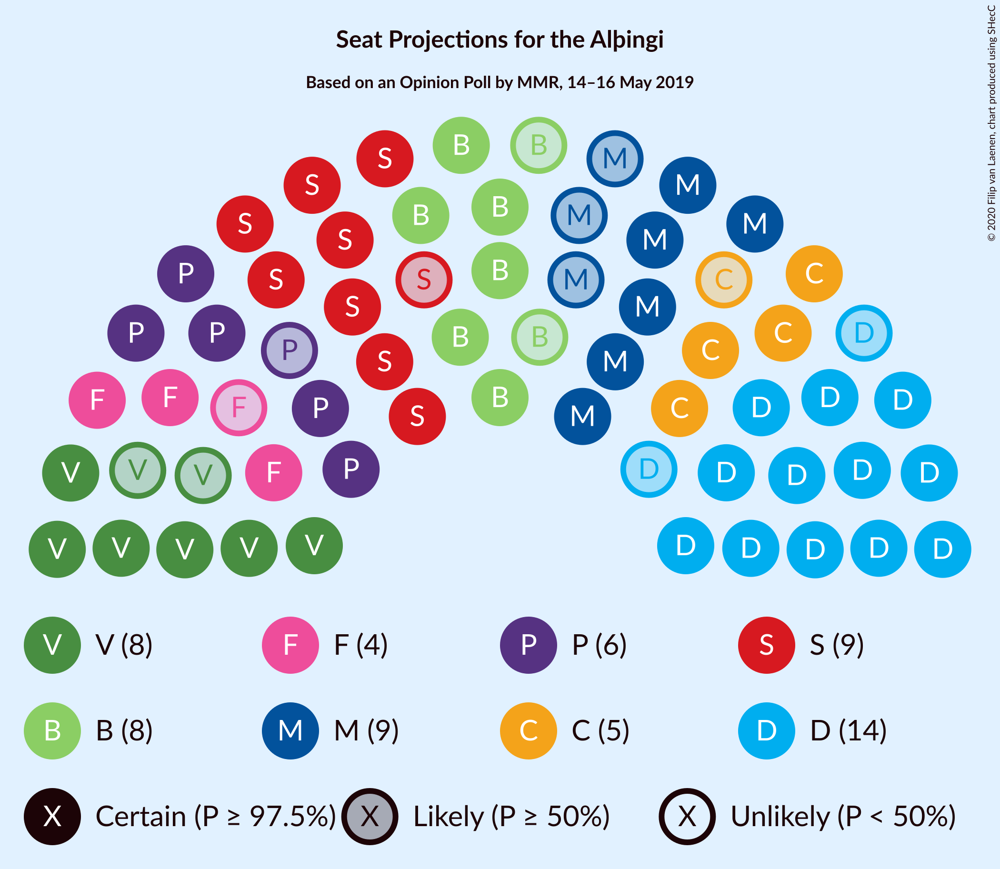
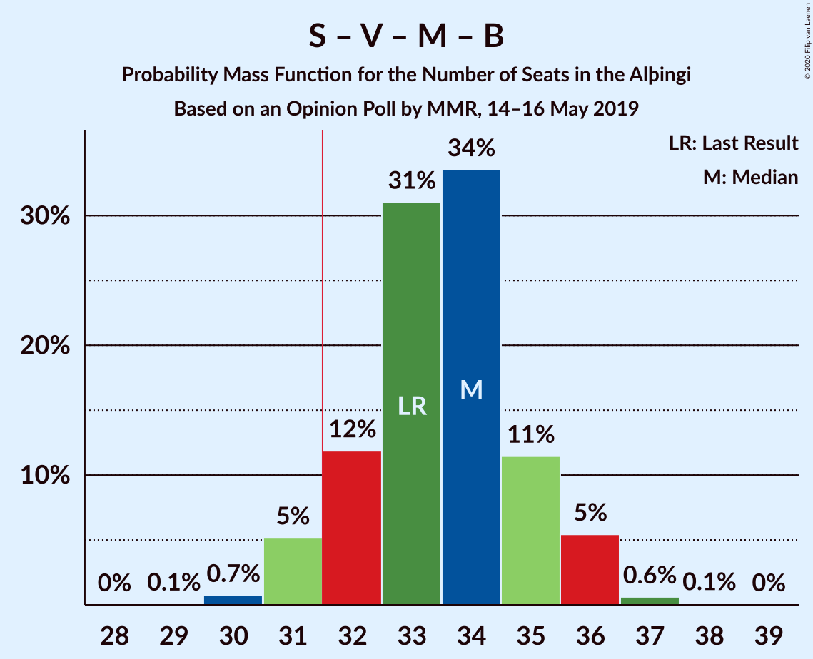
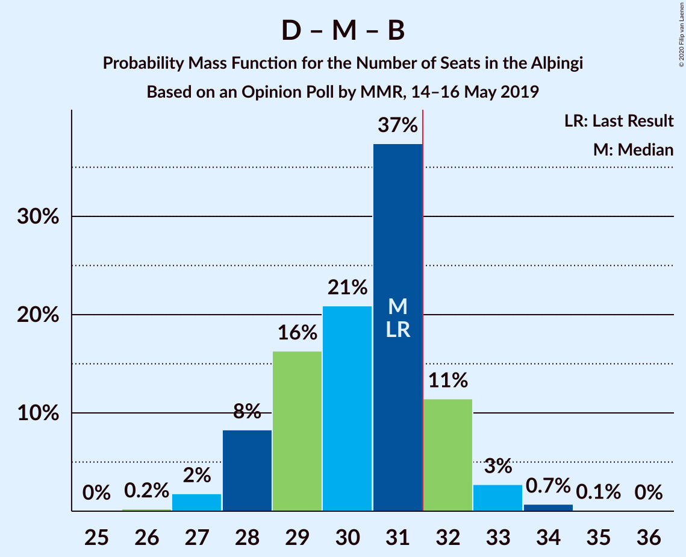
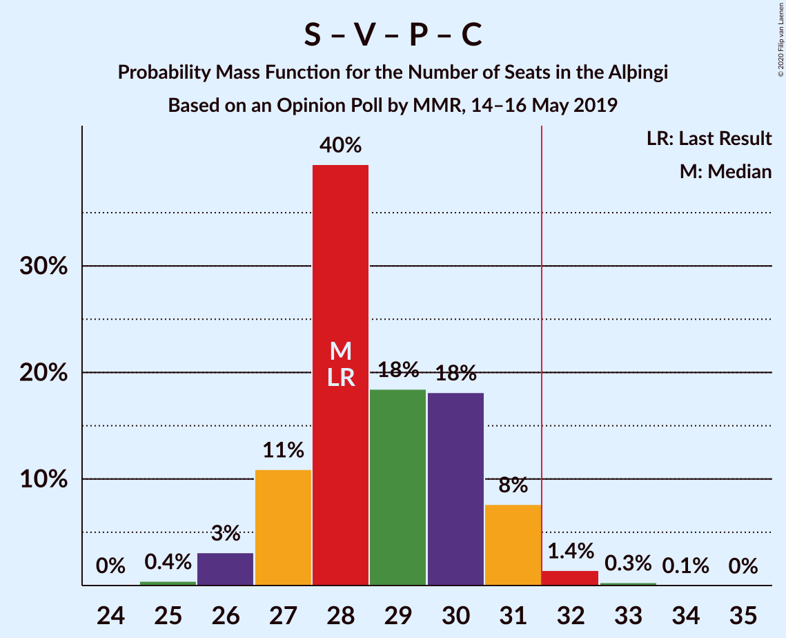

# Opinion Poll by MMR, 14–16 May 2019

<a href="#voting-intentions">Voting Intentions</a> | <a href="#seats">Seats</a> | <a href="#coalitions">Coalitions</a> | <a href="#technical-information">Technical Information</a>

## Voting Intentions

### Confidence Intervals

| Party | Last Result | Poll Result | 80% Confidence Interval | 90% Confidence Interval | 95% Confidence Interval | 99% Confidence Interval |
|:-----:|:-----------:|:-----------:|:-----------------------:|:-----------------------:|:-----------------------:|:-----------------------:|
| Sjálfstæðisflokkurinn | 25.2% | 21.3% | 19.7–23.0% |19.2–23.5% |18.8–23.9% |18.1–24.8% |
| Samfylkingin | 12.1% | 13.9% | 12.6–15.4% |12.2–15.9% |11.9–16.2% |11.3–17.0% |
| Vinstrihreyfingin – grænt framboð | 16.9% | 12.2% | 10.9–13.6% |10.6–14.0% |10.3–14.4% |9.7–15.1% |
| Miðflokkurinn | 10.9% | 11.8% | 10.5–13.2% |10.2–13.6% |9.9–13.9% |9.3–14.6% |
| Framsóknarflokkurinn | 10.7% | 11.6% | 10.3–13.0% |10.0–13.4% |9.7–13.7% |9.1–14.4% |
| Píratar | 9.2% | 9.8% | 8.7–11.1% |8.4–11.5% |8.1–11.8% |7.6–12.5% |
| Viðreisn | 6.7% | 8.4% | 7.3–9.6% |7.1–10.0% |6.8–10.3% |6.3–10.9% |
| Flokkur fólksins | 6.9% | 6.4% | 5.5–7.6% |5.3–7.9% |5.1–8.2% |4.7–8.7% |
| Sósíalistaflokkur Íslands | 0.0% | 3.2% | 2.6–4.0% |2.4–4.3% |2.2–4.5% |2.0–4.9% |

*Note:* The poll result column reflects the actual value used in the calculations. Published results may vary slightly, and in addition be rounded to fewer digits.

## Seats

### Confidence Intervals

| Party | Last Result | Median | 80% Confidence Interval | 90% Confidence Interval | 95% Confidence Interval | 99% Confidence Interval |
|:-----:|:-----------:|:------:|:-----------------------:|:-----------------------:|:-----------------------:|:-----------------------:|
| <a href="#sjálfstæðisflokkurinn">Sjálfstæðisflokkurinn</a> | 16 | 14 | 13–15 |13–16 |12–16 |12–17 |
| <a href="#samfylkingin">Samfylkingin</a> | 7 | 9 | 8–10 |8–10 |8–11 |7–11 |
| <a href="#vinstrihreyfingin-–-grænt-framboð">Vinstrihreyfingin – grænt framboð</a> | 11 | 8 | 7–9 |7–9 |6–10 |6–10 |
| <a href="#miðflokkurinn">Miðflokkurinn</a> | 7 | 9 | 7–10 |7–10 |6–10 |6–10 |
| <a href="#framsóknarflokkurinn">Framsóknarflokkurinn</a> | 8 | 8 | 7–9 |6–10 |6–10 |6–11 |
| <a href="#píratar">Píratar</a> | 6 | 6 | 5–7 |5–7 |5–8 |5–8 |
| <a href="#viðreisn">Viðreisn</a> | 4 | 5 | 5–6 |4–6 |4–6 |4–7 |
| <a href="#flokkur-fólksins">Flokkur fólksins</a> | 4 | 4 | 3–5 |3–5 |3–5 |0–5 |
| <a href="#sósíalistaflokkur-íslands">Sósíalistaflokkur Íslands</a> | 0 | 0 | 0 |0 |0 |0 |

### Sjálfstæðisflokkurinn

*For a full overview of the results for this party, see the [Sjálfstæðisflokkurinn](party-sjálfstæðisflokkurinn.html) page.*

| Number of Seats | Probability | Accumulated | Special Marks |
|:---------------:|:-----------:|:-----------:|:-------------:|
| 11 | 0.1% | 100% |  |
| 12 | 4% | 99.9% |  |
| 13 | 24% | 95% |  |
| 14 | 50% | 72% | Median |
| 15 | 15% | 22% |  |
| 16 | 5% | 7% | Last Result |
| 17 | 0.9% | 1.1% |  |
| 18 | 0.2% | 0.3% |  |
| 19 | 0% | 0% |  |

### Samfylkingin

*For a full overview of the results for this party, see the [Samfylkingin](party-samfylkingin.html) page.*

| Number of Seats | Probability | Accumulated | Special Marks |
|:---------------:|:-----------:|:-----------:|:-------------:|
| 7 | 2% | 100% | Last Result |
| 8 | 16% | 98% |  |
| 9 | 49% | 83% | Median |
| 10 | 29% | 34% |  |
| 11 | 4% | 5% |  |
| 12 | 0.2% | 0.3% |  |
| 13 | 0% | 0% |  |

### Vinstrihreyfingin – grænt framboð

*For a full overview of the results for this party, see the [Vinstrihreyfingin – grænt framboð](party-vinstrihreyfingin–græntframboð.html) page.*

| Number of Seats | Probability | Accumulated | Special Marks |
|:---------------:|:-----------:|:-----------:|:-------------:|
| 6 | 3% | 100% |  |
| 7 | 26% | 97% |  |
| 8 | 50% | 72% | Median |
| 9 | 17% | 22% |  |
| 10 | 5% | 5% |  |
| 11 | 0.1% | 0.1% | Last Result |
| 12 | 0% | 0% |  |

### Miðflokkurinn

*For a full overview of the results for this party, see the [Miðflokkurinn](party-miðflokkurinn.html) page.*

| Number of Seats | Probability | Accumulated | Special Marks |
|:---------------:|:-----------:|:-----------:|:-------------:|
| 6 | 3% | 100% |  |
| 7 | 18% | 97% | Last Result |
| 8 | 16% | 78% |  |
| 9 | 48% | 62% | Median |
| 10 | 14% | 14% |  |
| 11 | 0% | 0% |  |

### Framsóknarflokkurinn

*For a full overview of the results for this party, see the [Framsóknarflokkurinn](party-framsóknarflokkurinn.html) page.*

| Number of Seats | Probability | Accumulated | Special Marks |
|:---------------:|:-----------:|:-----------:|:-------------:|
| 5 | 0.1% | 100% |  |
| 6 | 8% | 99.9% |  |
| 7 | 21% | 92% |  |
| 8 | 55% | 71% | Last Result, Median |
| 9 | 11% | 16% |  |
| 10 | 4% | 5% |  |
| 11 | 0.8% | 0.8% |  |
| 12 | 0% | 0% |  |

### Píratar

*For a full overview of the results for this party, see the [Píratar](party-píratar.html) page.*

| Number of Seats | Probability | Accumulated | Special Marks |
|:---------------:|:-----------:|:-----------:|:-------------:|
| 4 | 0.2% | 100% |  |
| 5 | 12% | 99.8% |  |
| 6 | 51% | 88% | Last Result, Median |
| 7 | 32% | 37% |  |
| 8 | 4% | 4% |  |
| 9 | 0.2% | 0.2% |  |
| 10 | 0% | 0% |  |

### Viðreisn

*For a full overview of the results for this party, see the [Viðreisn](party-viðreisn.html) page.*

| Number of Seats | Probability | Accumulated | Special Marks |
|:---------------:|:-----------:|:-----------:|:-------------:|
| 4 | 10% | 100% | Last Result |
| 5 | 60% | 90% | Median |
| 6 | 29% | 30% |  |
| 7 | 2% | 2% |  |
| 8 | 0% | 0% |  |

### Flokkur fólksins

*For a full overview of the results for this party, see the [Flokkur fólksins](party-flokkurfólksins.html) page.*

| Number of Seats | Probability | Accumulated | Special Marks |
|:---------------:|:-----------:|:-----------:|:-------------:|
| 0 | 2% | 100% |  |
| 1 | 0% | 98% |  |
| 2 | 0% | 98% |  |
| 3 | 13% | 98% |  |
| 4 | 66% | 85% | Last Result, Median |
| 5 | 19% | 19% |  |
| 6 | 0.5% | 0.5% |  |
| 7 | 0% | 0% |  |

### Sósíalistaflokkur Íslands

*For a full overview of the results for this party, see the [Sósíalistaflokkur Íslands](party-sósíalistaflokkuríslands.html) page.*

| Number of Seats | Probability | Accumulated | Special Marks |
|:---------------:|:-----------:|:-----------:|:-------------:|
| 0 | 99.7% | 100% | Last Result, Median |
| 1 | 0% | 0.3% |  |
| 2 | 0% | 0.3% |  |
| 3 | 0.3% | 0.3% |  |
| 4 | 0% | 0% |  |

## Coalitions

### Confidence Intervals

| Coalition | Last Result | Median | Majority? | 80% Confidence Interval | 90% Confidence Interval | 95% Confidence Interval | 99% Confidence Interval |
|:---------:|:-----------:|:------:|:---------:|:-----------------------:|:-----------------------:|:-----------------------:|:-----------------------:|
| Samfylkingin – Vinstrihreyfingin – grænt framboð – Miðflokkurinn – Framsóknarflokkurinn | 33 | 34 | 94% | 32–35 | 31–36 | 31–36 | 30–37 |
| Sjálfstæðisflokkurinn – Miðflokkurinn – Framsóknarflokkurinn | 31 | 31 | 15% | 28–32 | 28–32 | 28–33 | 27–34 |
| Sjálfstæðisflokkurinn – Vinstrihreyfingin – grænt framboð – Framsóknarflokkurinn | 35 | 30 | 9% | 28–31 | 28–32 | 27–33 | 26–34 |
| Samfylkingin – Vinstrihreyfingin – grænt framboð – Píratar – Viðreisn | 28 | 28 | 2% | 27–30 | 27–31 | 26–31 | 26–32 |
| Samfylkingin – Vinstrihreyfingin – grænt framboð – Miðflokkurinn | 25 | 26 | 0% | 24–27 | 23–28 | 23–28 | 22–29 |
| Samfylkingin – Vinstrihreyfingin – grænt framboð – Framsóknarflokkurinn | 26 | 25 | 0% | 23–27 | 23–27 | 23–27 | 22–29 |
| Vinstrihreyfingin – grænt framboð – Miðflokkurinn – Framsóknarflokkurinn | 26 | 24 | 0% | 23–26 | 22–26 | 22–27 | 21–27 |
| Samfylkingin – Vinstrihreyfingin – grænt framboð – Píratar | 24 | 23 | 0% | 22–25 | 22–26 | 21–26 | 20–27 |
| Sjálfstæðisflokkurinn – Samfylkingin | 23 | 23 | 0% | 22–25 | 21–25 | 21–26 | 21–26 |
| Sjálfstæðisflokkurinn – Framsóknarflokkurinn | 24 | 22 | 0% | 20–23 | 20–24 | 20–25 | 19–25 |
| Sjálfstæðisflokkurinn – Miðflokkurinn | 23 | 23 | 0% | 21–24 | 20–24 | 20–25 | 19–26 |
| Sjálfstæðisflokkurinn – Vinstrihreyfingin – grænt framboð | 27 | 22 | 0% | 21–23 | 20–24 | 20–25 | 19–26 |
| Sjálfstæðisflokkurinn – Viðreisn | 20 | 19 | 0% | 18–21 | 18–21 | 17–21 | 17–23 |
| Samfylkingin – Vinstrihreyfingin – grænt framboð | 18 | 17 | 0% | 16–19 | 15–19 | 15–19 | 14–20 |
| Vinstrihreyfingin – grænt framboð – Miðflokkurinn | 18 | 17 | 0% | 15–18 | 14–18 | 14–19 | 13–19 |
| Vinstrihreyfingin – grænt framboð – Framsóknarflokkurinn | 19 | 16 | 0% | 14–17 | 14–18 | 14–18 | 13–19 |
| Vinstrihreyfingin – grænt framboð – Píratar | 17 | 14 | 0% | 13–16 | 13–16 | 12–16 | 12–17 |

### Samfylkingin – Vinstrihreyfingin – grænt framboð – Miðflokkurinn – Framsóknarflokkurinn

| Number of Seats | Probability | Accumulated | Special Marks |
|:---------------:|:-----------:|:-----------:|:-------------:|
| 29 | 0.1% | 100% |  |
| 30 | 0.7% | 99.9% |  |
| 31 | 5% | 99.2% |  |
| 32 | 12% | 94% | Majority |
| 33 | 31% | 82% | Last Result |
| 34 | 34% | 51% | Median |
| 35 | 11% | 18% |  |
| 36 | 5% | 6% |  |
| 37 | 0.6% | 0.7% |  |
| 38 | 0.1% | 0.1% |  |
| 39 | 0% | 0% |  |

### Sjálfstæðisflokkurinn – Miðflokkurinn – Framsóknarflokkurinn

| Number of Seats | Probability | Accumulated | Special Marks |
|:---------------:|:-----------:|:-----------:|:-------------:|
| 26 | 0.2% | 100% |  |
| 27 | 2% | 99.7% |  |
| 28 | 8% | 98% |  |
| 29 | 16% | 90% |  |
| 30 | 21% | 73% |  |
| 31 | 37% | 52% | Last Result, Median |
| 32 | 11% | 15% | Majority |
| 33 | 3% | 4% |  |
| 34 | 0.7% | 0.9% |  |
| 35 | 0.1% | 0.1% |  |
| 36 | 0% | 0% |  |

### Sjálfstæðisflokkurinn – Vinstrihreyfingin – grænt framboð – Framsóknarflokkurinn

| Number of Seats | Probability | Accumulated | Special Marks |
|:---------------:|:-----------:|:-----------:|:-------------:|
| 26 | 0.5% | 100% |  |
| 27 | 3% | 99.5% |  |
| 28 | 11% | 97% |  |
| 29 | 24% | 86% |  |
| 30 | 40% | 62% | Median |
| 31 | 14% | 22% |  |
| 32 | 6% | 9% | Majority |
| 33 | 2% | 3% |  |
| 34 | 0.7% | 0.8% |  |
| 35 | 0.1% | 0.1% | Last Result |
| 36 | 0% | 0% |  |

### Samfylkingin – Vinstrihreyfingin – grænt framboð – Píratar – Viðreisn

| Number of Seats | Probability | Accumulated | Special Marks |
|:---------------:|:-----------:|:-----------:|:-------------:|
| 25 | 0.4% | 100% |  |
| 26 | 3% | 99.5% |  |
| 27 | 11% | 96% |  |
| 28 | 40% | 86% | Last Result, Median |
| 29 | 18% | 46% |  |
| 30 | 18% | 28% |  |
| 31 | 8% | 9% |  |
| 32 | 1.4% | 2% | Majority |
| 33 | 0.3% | 0.3% |  |
| 34 | 0.1% | 0.1% |  |
| 35 | 0% | 0% |  |

### Samfylkingin – Vinstrihreyfingin – grænt framboð – Miðflokkurinn

| Number of Seats | Probability | Accumulated | Special Marks |
|:---------------:|:-----------:|:-----------:|:-------------:|
| 21 | 0.1% | 100% |  |
| 22 | 0.8% | 99.9% |  |
| 23 | 5% | 99.0% |  |
| 24 | 10% | 94% |  |
| 25 | 26% | 85% | Last Result |
| 26 | 39% | 59% | Median |
| 27 | 11% | 19% |  |
| 28 | 8% | 9% |  |
| 29 | 0.6% | 0.8% |  |
| 30 | 0.1% | 0.1% |  |
| 31 | 0% | 0% |  |

### Samfylkingin – Vinstrihreyfingin – grænt framboð – Framsóknarflokkurinn

| Number of Seats | Probability | Accumulated | Special Marks |
|:---------------:|:-----------:|:-----------:|:-------------:|
| 21 | 0.2% | 100% |  |
| 22 | 1.2% | 99.8% |  |
| 23 | 11% | 98.7% |  |
| 24 | 19% | 88% |  |
| 25 | 38% | 69% | Median |
| 26 | 19% | 30% | Last Result |
| 27 | 10% | 12% |  |
| 28 | 1.2% | 2% |  |
| 29 | 0.9% | 0.9% |  |
| 30 | 0% | 0% |  |

### Vinstrihreyfingin – grænt framboð – Miðflokkurinn – Framsóknarflokkurinn

| Number of Seats | Probability | Accumulated | Special Marks |
|:---------------:|:-----------:|:-----------:|:-------------:|
| 20 | 0.1% | 100% |  |
| 21 | 2% | 99.9% |  |
| 22 | 6% | 98% |  |
| 23 | 15% | 93% |  |
| 24 | 33% | 77% |  |
| 25 | 29% | 44% | Median |
| 26 | 11% | 15% | Last Result |
| 27 | 4% | 4% |  |
| 28 | 0.4% | 0.4% |  |
| 29 | 0% | 0% |  |

### Samfylkingin – Vinstrihreyfingin – grænt framboð – Píratar

| Number of Seats | Probability | Accumulated | Special Marks |
|:---------------:|:-----------:|:-----------:|:-------------:|
| 19 | 0.1% | 100% |  |
| 20 | 0.6% | 99.9% |  |
| 21 | 4% | 99.3% |  |
| 22 | 17% | 95% |  |
| 23 | 34% | 78% | Median |
| 24 | 24% | 44% | Last Result |
| 25 | 13% | 20% |  |
| 26 | 6% | 7% |  |
| 27 | 0.7% | 0.8% |  |
| 28 | 0.1% | 0.1% |  |
| 29 | 0% | 0% |  |

### Sjálfstæðisflokkurinn – Samfylkingin

| Number of Seats | Probability | Accumulated | Special Marks |
|:---------------:|:-----------:|:-----------:|:-------------:|
| 20 | 0.3% | 100% |  |
| 21 | 7% | 99.7% |  |
| 22 | 18% | 93% |  |
| 23 | 39% | 75% | Last Result, Median |
| 24 | 25% | 36% |  |
| 25 | 8% | 11% |  |
| 26 | 2% | 3% |  |
| 27 | 0.3% | 0.3% |  |
| 28 | 0% | 0% |  |

### Sjálfstæðisflokkurinn – Framsóknarflokkurinn

| Number of Seats | Probability | Accumulated | Special Marks |
|:---------------:|:-----------:|:-----------:|:-------------:|
| 19 | 1.3% | 100% |  |
| 20 | 13% | 98.7% |  |
| 21 | 22% | 86% |  |
| 22 | 42% | 65% | Median |
| 23 | 15% | 22% |  |
| 24 | 5% | 8% | Last Result |
| 25 | 2% | 3% |  |
| 26 | 0.3% | 0.4% |  |
| 27 | 0.1% | 0.1% |  |
| 28 | 0% | 0% |  |

### Sjálfstæðisflokkurinn – Miðflokkurinn

| Number of Seats | Probability | Accumulated | Special Marks |
|:---------------:|:-----------:|:-----------:|:-------------:|
| 18 | 0.1% | 100% |  |
| 19 | 0.9% | 99.9% |  |
| 20 | 8% | 99.0% |  |
| 21 | 13% | 91% |  |
| 22 | 24% | 78% |  |
| 23 | 33% | 54% | Last Result, Median |
| 24 | 18% | 21% |  |
| 25 | 2% | 3% |  |
| 26 | 0.5% | 0.7% |  |
| 27 | 0.1% | 0.2% |  |
| 28 | 0.1% | 0.1% |  |
| 29 | 0% | 0% |  |

### Sjálfstæðisflokkurinn – Vinstrihreyfingin – grænt framboð

| Number of Seats | Probability | Accumulated | Special Marks |
|:---------------:|:-----------:|:-----------:|:-------------:|
| 18 | 0.1% | 100% |  |
| 19 | 0.7% | 99.9% |  |
| 20 | 8% | 99.2% |  |
| 21 | 28% | 91% |  |
| 22 | 36% | 63% | Median |
| 23 | 18% | 27% |  |
| 24 | 5% | 8% |  |
| 25 | 2% | 3% |  |
| 26 | 0.8% | 0.9% |  |
| 27 | 0.1% | 0.1% | Last Result |
| 28 | 0% | 0% |  |

### Sjálfstæðisflokkurinn – Viðreisn

| Number of Seats | Probability | Accumulated | Special Marks |
|:---------------:|:-----------:|:-----------:|:-------------:|
| 16 | 0.2% | 100% |  |
| 17 | 3% | 99.8% |  |
| 18 | 19% | 97% |  |
| 19 | 45% | 77% | Median |
| 20 | 22% | 32% | Last Result |
| 21 | 8% | 10% |  |
| 22 | 2% | 2% |  |
| 23 | 0.6% | 0.7% |  |
| 24 | 0.1% | 0.1% |  |
| 25 | 0% | 0% |  |

### Samfylkingin – Vinstrihreyfingin – grænt framboð

| Number of Seats | Probability | Accumulated | Special Marks |
|:---------------:|:-----------:|:-----------:|:-------------:|
| 14 | 0.6% | 100% |  |
| 15 | 6% | 99.4% |  |
| 16 | 19% | 94% |  |
| 17 | 43% | 75% | Median |
| 18 | 20% | 33% | Last Result |
| 19 | 11% | 13% |  |
| 20 | 1.2% | 2% |  |
| 21 | 0.3% | 0.4% |  |
| 22 | 0% | 0% |  |

### Vinstrihreyfingin – grænt framboð – Miðflokkurinn

| Number of Seats | Probability | Accumulated | Special Marks |
|:---------------:|:-----------:|:-----------:|:-------------:|
| 12 | 0.1% | 100% |  |
| 13 | 1.2% | 99.9% |  |
| 14 | 4% | 98.8% |  |
| 15 | 13% | 95% |  |
| 16 | 32% | 82% |  |
| 17 | 33% | 50% | Median |
| 18 | 14% | 17% | Last Result |
| 19 | 3% | 3% |  |
| 20 | 0.5% | 0.5% |  |
| 21 | 0% | 0% |  |

### Vinstrihreyfingin – grænt framboð – Framsóknarflokkurinn

| Number of Seats | Probability | Accumulated | Special Marks |
|:---------------:|:-----------:|:-----------:|:-------------:|
| 12 | 0.2% | 100% |  |
| 13 | 2% | 99.8% |  |
| 14 | 9% | 98% |  |
| 15 | 24% | 88% |  |
| 16 | 41% | 64% | Median |
| 17 | 15% | 23% |  |
| 18 | 7% | 8% |  |
| 19 | 0.7% | 1.0% | Last Result |
| 20 | 0.2% | 0.2% |  |
| 21 | 0% | 0% |  |

### Vinstrihreyfingin – grænt framboð – Píratar

| Number of Seats | Probability | Accumulated | Special Marks |
|:---------------:|:-----------:|:-----------:|:-------------:|
| 11 | 0.3% | 100% |  |
| 12 | 3% | 99.7% |  |
| 13 | 22% | 97% |  |
| 14 | 37% | 75% | Median |
| 15 | 25% | 38% |  |
| 16 | 10% | 13% |  |
| 17 | 2% | 2% | Last Result |
| 18 | 0.1% | 0.1% |  |
| 19 | 0% | 0% |  |

## Technical Information

### Opinion Poll

+ **Polling firm:** MMR
+ **Commissioner(s):** —
+ **Fieldwork period:** 14–16 May 2019

### Calculations

+ **Sample size:** 978
+ **Simulations done:** 1,048,576
+ **Error estimate:** 1.16%

