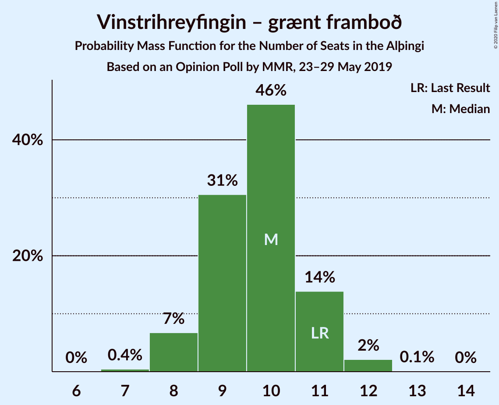
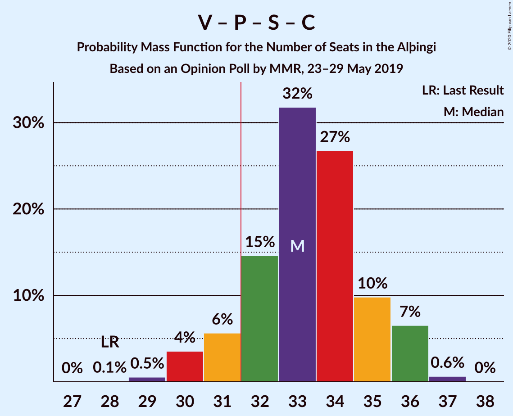
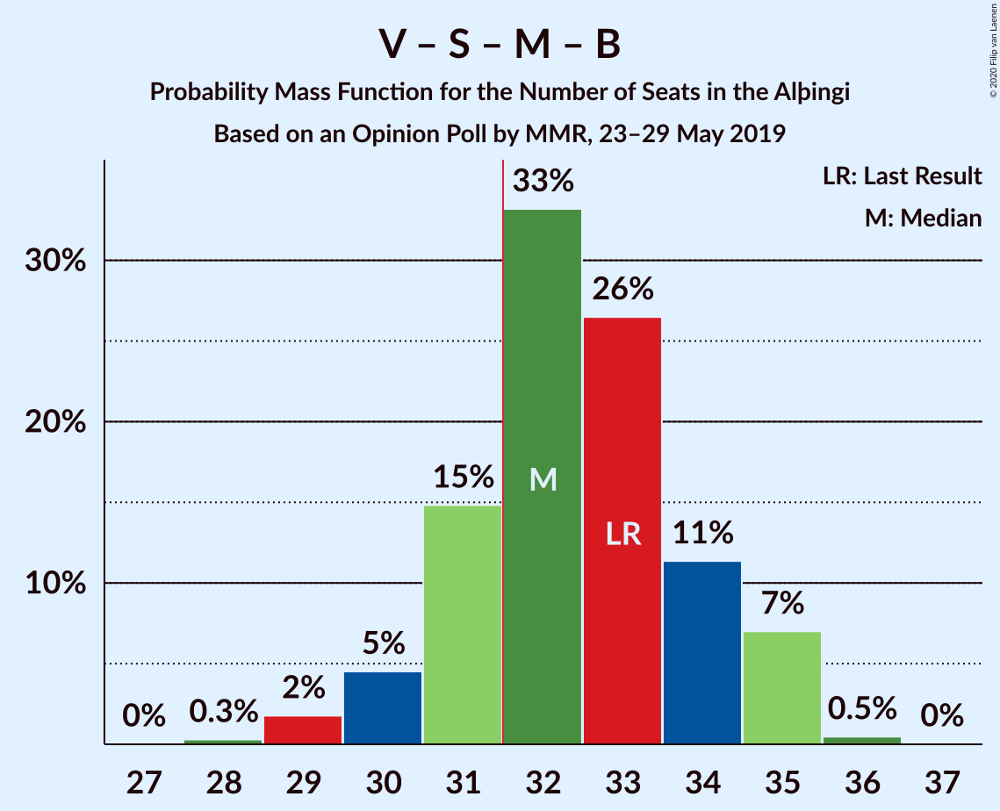
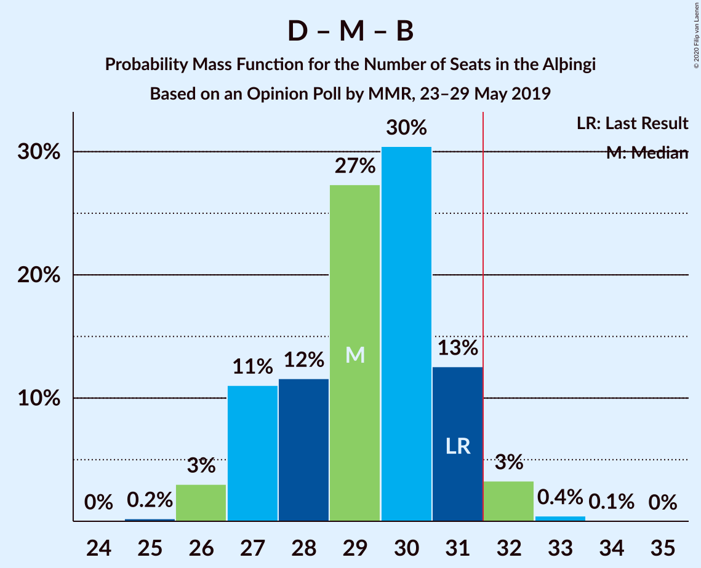
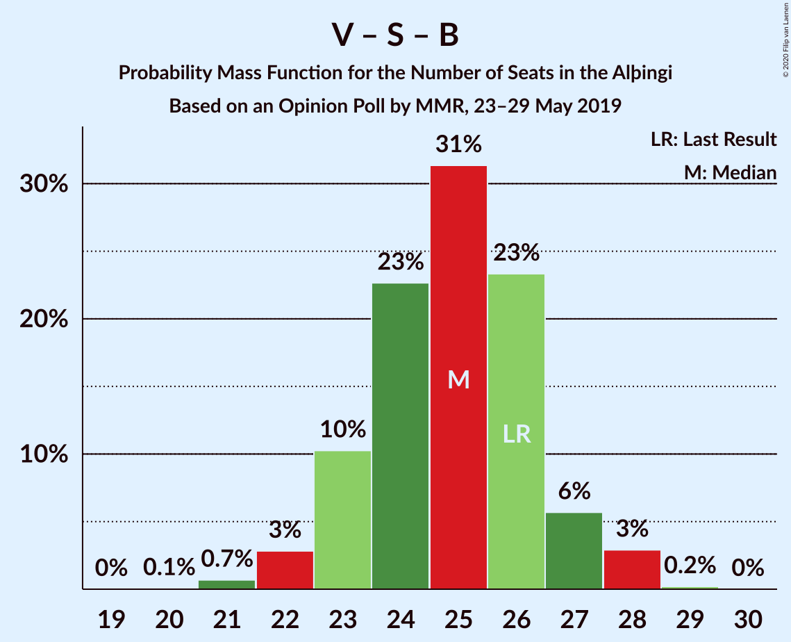

# Opinion Poll by MMR, 23–29 May 2019

<a href="#voting-intentions">Voting Intentions</a> | <a href="#seats">Seats</a> | <a href="#coalitions">Coalitions</a> | <a href="#technical-information">Technical Information</a>

## Voting Intentions

### Confidence Intervals

| Party | Last Result | Poll Result | 80% Confidence Interval | 90% Confidence Interval | 95% Confidence Interval | 99% Confidence Interval |
|:-----:|:-----------:|:-----------:|:-----------------------:|:-----------------------:|:-----------------------:|:-----------------------:|
| Sjálfstæðisflokkurinn | 25.2% | 21.5% | 19.8–23.3% |19.3–23.8% |18.9–24.2% |18.2–25.1% |
| Vinstrihreyfingin – grænt framboð | 16.9% | 14.1% | 12.7–15.6% |12.3–16.0% |12.0–16.4% |11.3–17.2% |
| Píratar | 9.2% | 13.9% | 12.6–15.5% |12.2–15.9% |11.9–16.3% |11.2–17.1% |
| Samfylkingin | 12.1% | 12.4% | 11.2–13.9% |10.8–14.4% |10.5–14.7% |9.9–15.5% |
| Miðflokkurinn | 10.9% | 10.8% | 9.6–12.3% |9.3–12.7% |9.0–13.0% |8.4–13.7% |
| Framsóknarflokkurinn | 10.7% | 9.7% | 8.5–11.0% |8.2–11.4% |7.9–11.7% |7.4–12.4% |
| Viðreisn | 6.7% | 8.3% | 7.2–9.5% |6.9–9.9% |6.7–10.2% |6.2–10.9% |
| Flokkur fólksins | 6.9% | 4.2% | 3.4–5.2% |3.2–5.4% |3.1–5.7% |2.8–6.2% |

*Note:* The poll result column reflects the actual value used in the calculations. Published results may vary slightly, and in addition be rounded to fewer digits.

## Seats

### Confidence Intervals

| Party | Last Result | Median | 80% Confidence Interval | 90% Confidence Interval | 95% Confidence Interval | 99% Confidence Interval |
|:-----:|:-----------:|:------:|:-----------------------:|:-----------------------:|:-----------------------:|:-----------------------:|
| <a href="#sjálfstæðisflokkurinn">Sjálfstæðisflokkurinn</a> | 16 | 14 | 13–16 |13–17 |13–18 |12–18 |
| <a href="#vinstrihreyfingin-–-grænt-framboð">Vinstrihreyfingin – grænt framboð</a> | 11 | 10 | 8–10 |8–11 |7–11 |7–11 |
| <a href="#píratar">Píratar</a> | 6 | 9 | 8–11 |8–11 |8–11 |7–11 |
| <a href="#samfylkingin">Samfylkingin</a> | 7 | 8 | 7–9 |7–10 |7–10 |6–10 |
| <a href="#miðflokkurinn">Miðflokkurinn</a> | 7 | 7 | 6–9 |6–9 |5–9 |5–10 |
| <a href="#framsóknarflokkurinn">Framsóknarflokkurinn</a> | 8 | 7 | 5–7 |5–8 |5–8 |4–10 |
| <a href="#viðreisn">Viðreisn</a> | 4 | 5 | 4–6 |4–6 |4–7 |4–7 |
| <a href="#flokkur-fólksins">Flokkur fólksins</a> | 4 | 0 | 0–3 |0–3 |0–3 |0–4 |

### Sjálfstæðisflokkurinn

*For a full overview of the results for this party, see the [Sjálfstæðisflokkurinn](party-sjálfstæðisflokkurinn.html) page.*

| Number of Seats | Probability | Accumulated | Special Marks |
|:---------------:|:-----------:|:-----------:|:-------------:|
| 12 | 1.1% | 100% |  |
| 13 | 19% | 98.9% |  |
| 14 | 30% | 80% | Median |
| 15 | 24% | 50% |  |
| 16 | 17% | 26% | Last Result |
| 17 | 6% | 9% |  |
| 18 | 3% | 3% |  |
| 19 | 0% | 0% |  |

### Vinstrihreyfingin – grænt framboð

*For a full overview of the results for this party, see the [Vinstrihreyfingin – grænt framboð](party-vinstrihreyfingin–græntframboð.html) page.*

| Number of Seats | Probability | Accumulated | Special Marks |
|:---------------:|:-----------:|:-----------:|:-------------:|
| 7 | 3% | 100% |  |
| 8 | 8% | 97% |  |
| 9 | 31% | 89% |  |
| 10 | 48% | 58% | Median |
| 11 | 10% | 10% | Last Result |
| 12 | 0.4% | 0.5% |  |
| 13 | 0% | 0% |  |

### Píratar

*For a full overview of the results for this party, see the [Píratar](party-píratar.html) page.*

| Number of Seats | Probability | Accumulated | Special Marks |
|:---------------:|:-----------:|:-----------:|:-------------:|
| 6 | 0% | 100% | Last Result |
| 7 | 2% | 100% |  |
| 8 | 32% | 98% |  |
| 9 | 18% | 66% | Median |
| 10 | 37% | 48% |  |
| 11 | 10% | 10% |  |
| 12 | 0.1% | 0.2% |  |
| 13 | 0.1% | 0.1% |  |
| 14 | 0% | 0% |  |

### Samfylkingin

*For a full overview of the results for this party, see the [Samfylkingin](party-samfylkingin.html) page.*

| Number of Seats | Probability | Accumulated | Special Marks |
|:---------------:|:-----------:|:-----------:|:-------------:|
| 6 | 2% | 100% |  |
| 7 | 17% | 98% | Last Result |
| 8 | 54% | 81% | Median |
| 9 | 17% | 27% |  |
| 10 | 9% | 10% |  |
| 11 | 0.3% | 0.3% |  |
| 12 | 0% | 0% |  |

### Miðflokkurinn

*For a full overview of the results for this party, see the [Miðflokkurinn](party-miðflokkurinn.html) page.*

| Number of Seats | Probability | Accumulated | Special Marks |
|:---------------:|:-----------:|:-----------:|:-------------:|
| 5 | 3% | 100% |  |
| 6 | 15% | 97% |  |
| 7 | 46% | 82% | Last Result, Median |
| 8 | 17% | 36% |  |
| 9 | 18% | 19% |  |
| 10 | 2% | 2% |  |
| 11 | 0% | 0% |  |

### Framsóknarflokkurinn

*For a full overview of the results for this party, see the [Framsóknarflokkurinn](party-framsóknarflokkurinn.html) page.*

| Number of Seats | Probability | Accumulated | Special Marks |
|:---------------:|:-----------:|:-----------:|:-------------:|
| 4 | 1.3% | 100% |  |
| 5 | 17% | 98.7% |  |
| 6 | 30% | 82% |  |
| 7 | 45% | 51% | Median |
| 8 | 5% | 7% | Last Result |
| 9 | 0.6% | 1.4% |  |
| 10 | 0.7% | 0.7% |  |
| 11 | 0% | 0% |  |

### Viðreisn

*For a full overview of the results for this party, see the [Viðreisn](party-viðreisn.html) page.*

| Number of Seats | Probability | Accumulated | Special Marks |
|:---------------:|:-----------:|:-----------:|:-------------:|
| 3 | 0.1% | 100% |  |
| 4 | 13% | 99.9% | Last Result |
| 5 | 44% | 87% | Median |
| 6 | 39% | 43% |  |
| 7 | 4% | 4% |  |
| 8 | 0.2% | 0.2% |  |
| 9 | 0% | 0% |  |

### Flokkur fólksins

*For a full overview of the results for this party, see the [Flokkur fólksins](party-flokkurfólksins.html) page.*

| Number of Seats | Probability | Accumulated | Special Marks |
|:---------------:|:-----------:|:-----------:|:-------------:|
| 0 | 82% | 100% | Median |
| 1 | 0.1% | 18% |  |
| 2 | 0% | 18% |  |
| 3 | 17% | 18% |  |
| 4 | 0.5% | 0.6% | Last Result |
| 5 | 0% | 0% |  |

## Coalitions

### Confidence Intervals

| Coalition | Last Result | Median | Majority? | 80% Confidence Interval | 90% Confidence Interval | 95% Confidence Interval | 99% Confidence Interval |
|:---------:|:-----------:|:------:|:---------:|:-----------------------:|:-----------------------:|:-----------------------:|:-----------------------:|
| Vinstrihreyfingin – grænt framboð – Píratar – Samfylkingin – Viðreisn | 28 | 33 | 66% | 30–34 | 29–35 | 29–35 | 28–36 |
| Vinstrihreyfingin – grænt framboð – Samfylkingin – Miðflokkurinn – Framsóknarflokkurinn | 33 | 31 | 47% | 29–33 | 29–34 | 28–34 | 27–35 |
| Sjálfstæðisflokkurinn – Vinstrihreyfingin – grænt framboð – Framsóknarflokkurinn | 35 | 31 | 36% | 28–32 | 28–33 | 28–33 | 26–34 |
| Sjálfstæðisflokkurinn – Miðflokkurinn – Framsóknarflokkurinn | 31 | 28 | 3% | 27–30 | 26–31 | 26–32 | 24–32 |
| Vinstrihreyfingin – grænt framboð – Píratar – Samfylkingin | 24 | 27 | 0% | 25–29 | 24–29 | 24–30 | 23–31 |
| Vinstrihreyfingin – grænt framboð – Samfylkingin – Miðflokkurinn | 25 | 25 | 0% | 23–27 | 23–27 | 22–27 | 21–28 |
| Vinstrihreyfingin – grænt framboð – Samfylkingin – Framsóknarflokkurinn | 26 | 24 | 0% | 22–26 | 22–26 | 21–27 | 20–28 |
| Sjálfstæðisflokkurinn – Vinstrihreyfingin – grænt framboð | 27 | 24 | 0% | 22–26 | 22–27 | 21–27 | 20–27 |
| Vinstrihreyfingin – grænt framboð – Miðflokkurinn – Framsóknarflokkurinn | 26 | 23 | 0% | 22–25 | 21–26 | 20–26 | 20–27 |
| Sjálfstæðisflokkurinn – Samfylkingin | 23 | 23 | 0% | 21–25 | 21–26 | 20–26 | 19–26 |
| Sjálfstæðisflokkurinn – Miðflokkurinn | 23 | 22 | 0% | 20–24 | 20–25 | 20–25 | 19–26 |
| Sjálfstæðisflokkurinn – Framsóknarflokkurinn | 24 | 21 | 0% | 19–23 | 19–24 | 18–24 | 18–24 |
| Sjálfstæðisflokkurinn – Viðreisn | 20 | 20 | 0% | 18–22 | 18–22 | 17–23 | 17–23 |
| Vinstrihreyfingin – grænt framboð – Píratar | 17 | 19 | 0% | 17–20 | 16–21 | 16–21 | 15–22 |
| Vinstrihreyfingin – grænt framboð – Samfylkingin | 18 | 18 | 0% | 16–19 | 16–20 | 15–20 | 14–21 |
| Vinstrihreyfingin – grænt framboð – Miðflokkurinn | 18 | 17 | 0% | 15–19 | 15–19 | 15–19 | 14–20 |
| Vinstrihreyfingin – grænt framboð – Framsóknarflokkurinn | 19 | 16 | 0% | 15–18 | 14–18 | 14–18 | 12–19 |

### Vinstrihreyfingin – grænt framboð – Píratar – Samfylkingin – Viðreisn

| Number of Seats | Probability | Accumulated | Special Marks |
|:---------------:|:-----------:|:-----------:|:-------------:|
| 27 | 0.2% | 100% |  |
| 28 | 0.5% | 99.7% | Last Result |
| 29 | 5% | 99.2% |  |
| 30 | 16% | 94% |  |
| 31 | 12% | 78% |  |
| 32 | 13% | 66% | Median, Majority |
| 33 | 27% | 52% |  |
| 34 | 16% | 25% |  |
| 35 | 7% | 9% |  |
| 36 | 2% | 2% |  |
| 37 | 0.4% | 0.5% |  |
| 38 | 0% | 0% |  |

### Vinstrihreyfingin – grænt framboð – Samfylkingin – Miðflokkurinn – Framsóknarflokkurinn

| Number of Seats | Probability | Accumulated | Special Marks |
|:---------------:|:-----------:|:-----------:|:-------------:|
| 26 | 0.3% | 100% |  |
| 27 | 2% | 99.7% |  |
| 28 | 2% | 98% |  |
| 29 | 6% | 96% |  |
| 30 | 7% | 90% |  |
| 31 | 35% | 83% |  |
| 32 | 24% | 47% | Median, Majority |
| 33 | 14% | 23% | Last Result |
| 34 | 7% | 9% |  |
| 35 | 1.4% | 2% |  |
| 36 | 0.2% | 0.2% |  |
| 37 | 0% | 0% |  |

### Sjálfstæðisflokkurinn – Vinstrihreyfingin – grænt framboð – Framsóknarflokkurinn

| Number of Seats | Probability | Accumulated | Special Marks |
|:---------------:|:-----------:|:-----------:|:-------------:|
| 25 | 0.1% | 100% |  |
| 26 | 0.6% | 99.9% |  |
| 27 | 1.3% | 99.3% |  |
| 28 | 11% | 98% |  |
| 29 | 10% | 87% |  |
| 30 | 24% | 78% |  |
| 31 | 17% | 53% | Median |
| 32 | 28% | 36% | Majority |
| 33 | 6% | 8% |  |
| 34 | 2% | 2% |  |
| 35 | 0.2% | 0.2% | Last Result |
| 36 | 0% | 0% |  |

### Sjálfstæðisflokkurinn – Miðflokkurinn – Framsóknarflokkurinn

| Number of Seats | Probability | Accumulated | Special Marks |
|:---------------:|:-----------:|:-----------:|:-------------:|
| 23 | 0.1% | 100% |  |
| 24 | 0.6% | 99.9% |  |
| 25 | 2% | 99.3% |  |
| 26 | 5% | 98% |  |
| 27 | 27% | 92% |  |
| 28 | 16% | 66% | Median |
| 29 | 22% | 50% |  |
| 30 | 19% | 28% |  |
| 31 | 5% | 8% | Last Result |
| 32 | 3% | 3% | Majority |
| 33 | 0.2% | 0.2% |  |
| 34 | 0% | 0% |  |

### Vinstrihreyfingin – grænt framboð – Píratar – Samfylkingin

| Number of Seats | Probability | Accumulated | Special Marks |
|:---------------:|:-----------:|:-----------:|:-------------:|
| 22 | 0.1% | 100% |  |
| 23 | 0.6% | 99.9% |  |
| 24 | 6% | 99.2% | Last Result |
| 25 | 16% | 93% |  |
| 26 | 14% | 76% |  |
| 27 | 20% | 62% | Median |
| 28 | 28% | 42% |  |
| 29 | 11% | 14% |  |
| 30 | 3% | 4% |  |
| 31 | 0.5% | 0.5% |  |
| 32 | 0% | 0% | Majority |

### Vinstrihreyfingin – grænt framboð – Samfylkingin – Miðflokkurinn

| Number of Seats | Probability | Accumulated | Special Marks |
|:---------------:|:-----------:|:-----------:|:-------------:|
| 20 | 0.1% | 100% |  |
| 21 | 0.5% | 99.9% |  |
| 22 | 4% | 99.4% |  |
| 23 | 9% | 96% |  |
| 24 | 18% | 87% |  |
| 25 | 32% | 68% | Last Result, Median |
| 26 | 18% | 36% |  |
| 27 | 16% | 18% |  |
| 28 | 2% | 2% |  |
| 29 | 0.4% | 0.4% |  |
| 30 | 0% | 0% |  |

### Vinstrihreyfingin – grænt framboð – Samfylkingin – Framsóknarflokkurinn

| Number of Seats | Probability | Accumulated | Special Marks |
|:---------------:|:-----------:|:-----------:|:-------------:|
| 18 | 0.1% | 100% |  |
| 19 | 0.3% | 99.9% |  |
| 20 | 0.5% | 99.7% |  |
| 21 | 3% | 99.2% |  |
| 22 | 10% | 96% |  |
| 23 | 19% | 87% |  |
| 24 | 29% | 68% |  |
| 25 | 22% | 39% | Median |
| 26 | 13% | 17% | Last Result |
| 27 | 4% | 4% |  |
| 28 | 0.5% | 0.6% |  |
| 29 | 0.1% | 0.1% |  |
| 30 | 0% | 0% |  |

### Sjálfstæðisflokkurinn – Vinstrihreyfingin – grænt framboð

| Number of Seats | Probability | Accumulated | Special Marks |
|:---------------:|:-----------:|:-----------:|:-------------:|
| 20 | 0.9% | 100% |  |
| 21 | 3% | 99.0% |  |
| 22 | 8% | 96% |  |
| 23 | 17% | 88% |  |
| 24 | 25% | 71% | Median |
| 25 | 31% | 46% |  |
| 26 | 10% | 15% |  |
| 27 | 5% | 5% | Last Result |
| 28 | 0.3% | 0.4% |  |
| 29 | 0.1% | 0.1% |  |
| 30 | 0% | 0% |  |

### Vinstrihreyfingin – grænt framboð – Miðflokkurinn – Framsóknarflokkurinn

| Number of Seats | Probability | Accumulated | Special Marks |
|:---------------:|:-----------:|:-----------:|:-------------:|
| 19 | 0.4% | 100% |  |
| 20 | 3% | 99.6% |  |
| 21 | 5% | 97% |  |
| 22 | 15% | 91% |  |
| 23 | 36% | 76% |  |
| 24 | 22% | 40% | Median |
| 25 | 10% | 18% |  |
| 26 | 7% | 8% | Last Result |
| 27 | 0.7% | 0.7% |  |
| 28 | 0% | 0% |  |

### Sjálfstæðisflokkurinn – Samfylkingin

| Number of Seats | Probability | Accumulated | Special Marks |
|:---------------:|:-----------:|:-----------:|:-------------:|
| 19 | 0.5% | 100% |  |
| 20 | 4% | 99.5% |  |
| 21 | 17% | 95% |  |
| 22 | 23% | 78% | Median |
| 23 | 18% | 55% | Last Result |
| 24 | 26% | 37% |  |
| 25 | 5% | 11% |  |
| 26 | 6% | 6% |  |
| 27 | 0.3% | 0.3% |  |
| 28 | 0% | 0% |  |

### Sjálfstæðisflokkurinn – Miðflokkurinn

| Number of Seats | Probability | Accumulated | Special Marks |
|:---------------:|:-----------:|:-----------:|:-------------:|
| 18 | 0.5% | 100% |  |
| 19 | 2% | 99.5% |  |
| 20 | 10% | 98% |  |
| 21 | 26% | 88% | Median |
| 22 | 24% | 62% |  |
| 23 | 26% | 38% | Last Result |
| 24 | 5% | 11% |  |
| 25 | 5% | 6% |  |
| 26 | 0.4% | 0.6% |  |
| 27 | 0.2% | 0.2% |  |
| 28 | 0% | 0% |  |

### Sjálfstæðisflokkurinn – Framsóknarflokkurinn

| Number of Seats | Probability | Accumulated | Special Marks |
|:---------------:|:-----------:|:-----------:|:-------------:|
| 17 | 0.1% | 100% |  |
| 18 | 5% | 99.9% |  |
| 19 | 11% | 95% |  |
| 20 | 23% | 84% |  |
| 21 | 19% | 61% | Median |
| 22 | 23% | 42% |  |
| 23 | 14% | 19% |  |
| 24 | 5% | 5% | Last Result |
| 25 | 0.1% | 0.2% |  |
| 26 | 0% | 0% |  |

### Sjálfstæðisflokkurinn – Viðreisn

| Number of Seats | Probability | Accumulated | Special Marks |
|:---------------:|:-----------:|:-----------:|:-------------:|
| 16 | 0.1% | 100% |  |
| 17 | 3% | 99.9% |  |
| 18 | 13% | 97% |  |
| 19 | 30% | 83% | Median |
| 20 | 14% | 54% | Last Result |
| 21 | 18% | 40% |  |
| 22 | 17% | 22% |  |
| 23 | 5% | 5% |  |
| 24 | 0.2% | 0.2% |  |
| 25 | 0% | 0% |  |

### Vinstrihreyfingin – grænt framboð – Píratar

| Number of Seats | Probability | Accumulated | Special Marks |
|:---------------:|:-----------:|:-----------:|:-------------:|
| 15 | 0.5% | 100% |  |
| 16 | 6% | 99.5% |  |
| 17 | 12% | 93% | Last Result |
| 18 | 25% | 81% |  |
| 19 | 19% | 56% | Median |
| 20 | 31% | 37% |  |
| 21 | 4% | 6% |  |
| 22 | 2% | 2% |  |
| 23 | 0% | 0% |  |

### Vinstrihreyfingin – grænt framboð – Samfylkingin

| Number of Seats | Probability | Accumulated | Special Marks |
|:---------------:|:-----------:|:-----------:|:-------------:|
| 14 | 0.6% | 100% |  |
| 15 | 4% | 99.4% |  |
| 16 | 11% | 96% |  |
| 17 | 29% | 85% |  |
| 18 | 31% | 56% | Last Result, Median |
| 19 | 16% | 24% |  |
| 20 | 8% | 9% |  |
| 21 | 0.4% | 0.5% |  |
| 22 | 0.1% | 0.1% |  |
| 23 | 0% | 0% |  |

### Vinstrihreyfingin – grænt framboð – Miðflokkurinn

| Number of Seats | Probability | Accumulated | Special Marks |
|:---------------:|:-----------:|:-----------:|:-------------:|
| 13 | 0.2% | 100% |  |
| 14 | 1.0% | 99.8% |  |
| 15 | 11% | 98.8% |  |
| 16 | 24% | 88% |  |
| 17 | 38% | 64% | Median |
| 18 | 15% | 27% | Last Result |
| 19 | 11% | 12% |  |
| 20 | 1.1% | 1.1% |  |
| 21 | 0% | 0% |  |

### Vinstrihreyfingin – grænt framboð – Framsóknarflokkurinn

| Number of Seats | Probability | Accumulated | Special Marks |
|:---------------:|:-----------:|:-----------:|:-------------:|
| 12 | 0.8% | 100% |  |
| 13 | 0.9% | 99.2% |  |
| 14 | 8% | 98% |  |
| 15 | 25% | 90% |  |
| 16 | 37% | 66% |  |
| 17 | 19% | 29% | Median |
| 18 | 9% | 10% |  |
| 19 | 2% | 2% | Last Result |
| 20 | 0.1% | 0.1% |  |
| 21 | 0% | 0% |  |

## Technical Information

### Opinion Poll

+ **Polling firm:** MMR
+ **Commissioner(s):** —
+ **Fieldwork period:** 23–29 May 2019

### Calculations

+ **Sample size:** 932
+ **Simulations done:** 131,072
+ **Error estimate:** 1.57%

