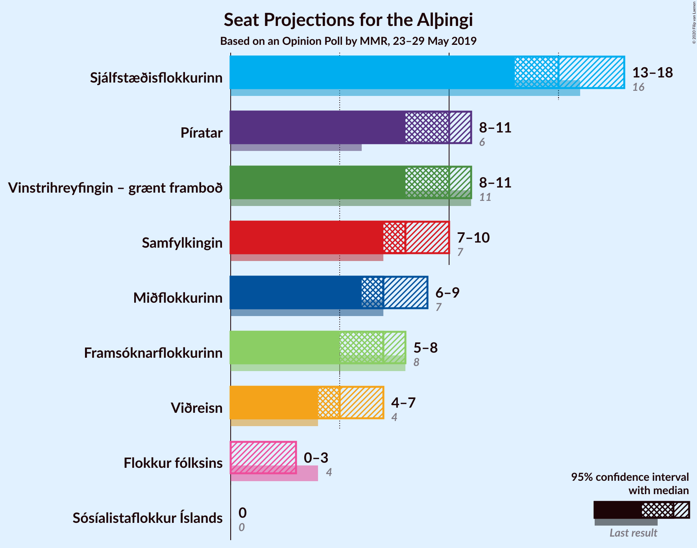
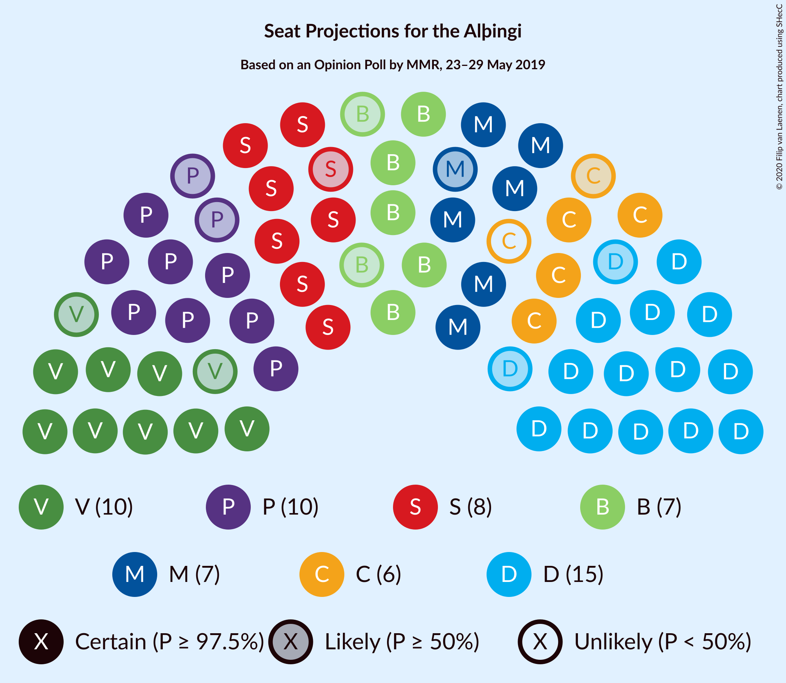
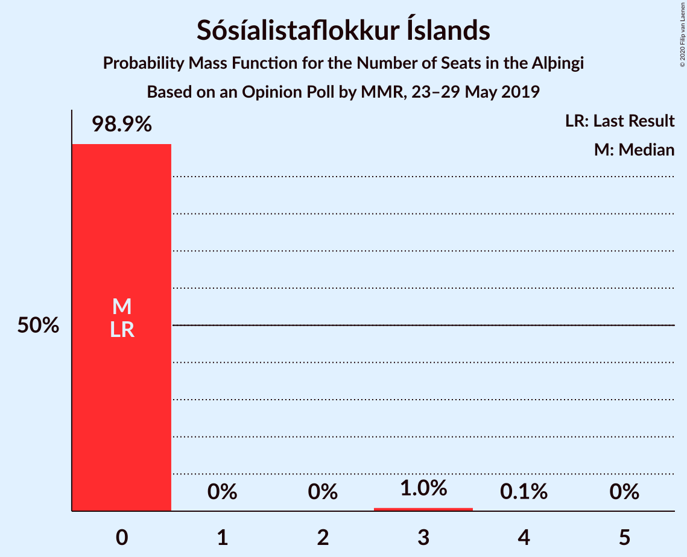
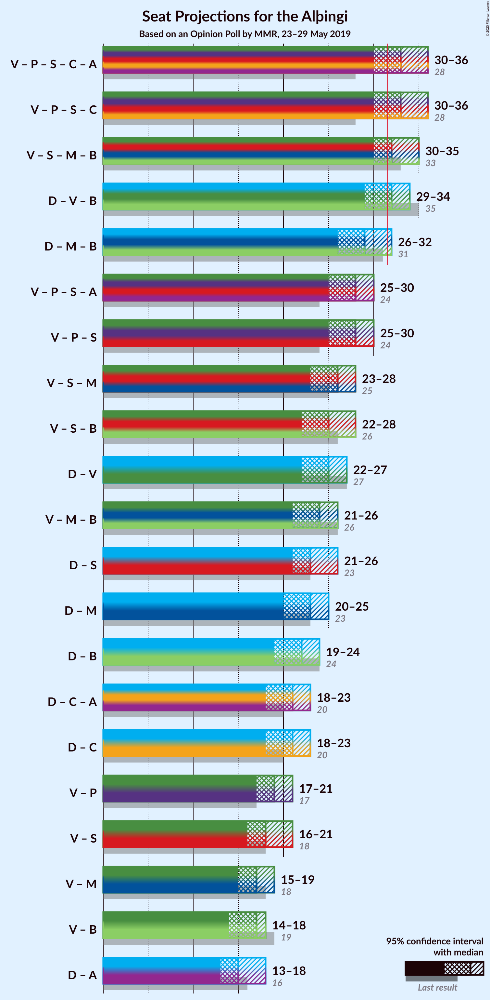

# Opinion Poll by MMR, 23–29 May 2019

<a href="#voting-intentions">Voting Intentions</a> | <a href="#seats">Seats</a> | <a href="#coalitions">Coalitions</a> | <a href="#technical-information">Technical Information</a>

## Voting Intentions

### Confidence Intervals

| Party | Last Result | Poll Result | 80% Confidence Interval | 90% Confidence Interval | 95% Confidence Interval | 99% Confidence Interval |
|:-----:|:-----------:|:-----------:|:-----------------------:|:-----------------------:|:-----------------------:|:-----------------------:|
| Sjálfstæðisflokkurinn | 25.2% | 21.5% | 19.8–23.3% |19.3–23.8% |18.9–24.2% |18.2–25.1% |
| Vinstrihreyfingin – grænt framboð | 16.9% | 14.1% | 12.7–15.6% |12.3–16.0% |12.0–16.4% |11.3–17.2% |
| Píratar | 9.2% | 13.9% | 12.6–15.5% |12.2–15.9% |11.9–16.3% |11.2–17.1% |
| Samfylkingin | 12.1% | 12.4% | 11.2–13.9% |10.8–14.4% |10.5–14.7% |9.9–15.5% |
| Miðflokkurinn | 10.9% | 10.8% | 9.6–12.3% |9.3–12.7% |9.0–13.0% |8.4–13.7% |
| Framsóknarflokkurinn | 10.7% | 9.7% | 8.5–11.0% |8.2–11.4% |7.9–11.7% |7.4–12.4% |
| Viðreisn | 6.7% | 8.3% | 7.2–9.5% |6.9–9.9% |6.7–10.2% |6.2–10.9% |
| Flokkur fólksins | 6.9% | 4.2% | 3.4–5.2% |3.2–5.4% |3.1–5.7% |2.8–6.2% |
| Sósíalistaflokkur Íslands | 0.0% | 3.4% | 2.8–4.3% |2.6–4.6% |2.4–4.8% |2.2–5.3% |

*Note:* The poll result column reflects the actual value used in the calculations. Published results may vary slightly, and in addition be rounded to fewer digits.

## Seats

### Confidence Intervals

| Party | Last Result | Median | 80% Confidence Interval | 90% Confidence Interval | 95% Confidence Interval | 99% Confidence Interval |
|:-----:|:-----------:|:------:|:-----------------------:|:-----------------------:|:-----------------------:|:-----------------------:|
| <a href="#sjálfstæðisflokkurinn">Sjálfstæðisflokkurinn</a> | 16 | 15 | 14–16 |13–17 |13–18 |12–18 |
| <a href="#vinstrihreyfingin-–-grænt-framboð">Vinstrihreyfingin – grænt framboð</a> | 11 | 10 | 9–11 |8–11 |8–11 |8–12 |
| <a href="#píratar">Píratar</a> | 6 | 10 | 8–11 |8–11 |8–11 |7–12 |
| <a href="#samfylkingin">Samfylkingin</a> | 7 | 8 | 7–10 |7–10 |7–10 |7–11 |
| <a href="#miðflokkurinn">Miðflokkurinn</a> | 7 | 7 | 7–9 |6–9 |6–9 |6–10 |
| <a href="#framsóknarflokkurinn">Framsóknarflokkurinn</a> | 8 | 7 | 6–8 |5–8 |5–8 |5–9 |
| <a href="#viðreisn">Viðreisn</a> | 4 | 5 | 5–6 |4–7 |4–7 |4–7 |
| <a href="#flokkur-fólksins">Flokkur fólksins</a> | 4 | 0 | 0–3 |0–3 |0–3 |0–4 |
| <a href="#sósíalistaflokkur-íslands">Sósíalistaflokkur Íslands</a> | 0 | 0 | 0 |0 |0 |0–3 |

### Sjálfstæðisflokkurinn

*For a full overview of the results for this party, see the [Sjálfstæðisflokkurinn](party-sjálfstæðisflokkurinn.html) page.*

| Number of Seats | Probability | Accumulated | Special Marks |
|:---------------:|:-----------:|:-----------:|:-------------:|
| 12 | 0.5% | 100% |  |
| 13 | 7% | 99.5% |  |
| 14 | 23% | 92% |  |
| 15 | 39% | 70% | Median |
| 16 | 23% | 31% | Last Result |
| 17 | 5% | 8% |  |
| 18 | 2% | 3% |  |
| 19 | 0% | 0.1% |  |
| 20 | 0% | 0% |  |

### Vinstrihreyfingin – grænt framboð

*For a full overview of the results for this party, see the [Vinstrihreyfingin – grænt framboð](party-vinstrihreyfingin–græntframboð.html) page.*

| Number of Seats | Probability | Accumulated | Special Marks |
|:---------------:|:-----------:|:-----------:|:-------------:|
| 7 | 0.4% | 100% |  |
| 8 | 7% | 99.5% |  |
| 9 | 31% | 93% |  |
| 10 | 46% | 62% | Median |
| 11 | 14% | 16% | Last Result |
| 12 | 2% | 2% |  |
| 13 | 0.1% | 0.1% |  |
| 14 | 0% | 0% |  |

### Píratar

*For a full overview of the results for this party, see the [Píratar](party-píratar.html) page.*

| Number of Seats | Probability | Accumulated | Special Marks |
|:---------------:|:-----------:|:-----------:|:-------------:|
| 6 | 0% | 100% | Last Result |
| 7 | 0.6% | 100% |  |
| 8 | 10% | 99.4% |  |
| 9 | 31% | 89% |  |
| 10 | 45% | 58% | Median |
| 11 | 12% | 13% |  |
| 12 | 1.3% | 1.4% |  |
| 13 | 0% | 0% |  |

### Samfylkingin

*For a full overview of the results for this party, see the [Samfylkingin](party-samfylkingin.html) page.*

| Number of Seats | Probability | Accumulated | Special Marks |
|:---------------:|:-----------:|:-----------:|:-------------:|
| 6 | 0.4% | 100% |  |
| 7 | 10% | 99.6% | Last Result |
| 8 | 45% | 90% | Median |
| 9 | 31% | 44% |  |
| 10 | 13% | 13% |  |
| 11 | 0.6% | 0.7% |  |
| 12 | 0% | 0% |  |

### Miðflokkurinn

*For a full overview of the results for this party, see the [Miðflokkurinn](party-miðflokkurinn.html) page.*

| Number of Seats | Probability | Accumulated | Special Marks |
|:---------------:|:-----------:|:-----------:|:-------------:|
| 5 | 0.4% | 100% |  |
| 6 | 10% | 99.6% |  |
| 7 | 53% | 90% | Last Result, Median |
| 8 | 14% | 37% |  |
| 9 | 22% | 23% |  |
| 10 | 2% | 2% |  |
| 11 | 0% | 0% |  |

### Framsóknarflokkurinn

*For a full overview of the results for this party, see the [Framsóknarflokkurinn](party-framsóknarflokkurinn.html) page.*

| Number of Seats | Probability | Accumulated | Special Marks |
|:---------------:|:-----------:|:-----------:|:-------------:|
| 4 | 0.2% | 100% |  |
| 5 | 8% | 99.8% |  |
| 6 | 31% | 92% |  |
| 7 | 44% | 60% | Median |
| 8 | 15% | 16% | Last Result |
| 9 | 0.5% | 0.7% |  |
| 10 | 0.2% | 0.2% |  |
| 11 | 0% | 0% |  |

### Viðreisn

*For a full overview of the results for this party, see the [Viðreisn](party-viðreisn.html) page.*

| Number of Seats | Probability | Accumulated | Special Marks |
|:---------------:|:-----------:|:-----------:|:-------------:|
| 4 | 6% | 100% | Last Result |
| 5 | 46% | 94% | Median |
| 6 | 40% | 47% |  |
| 7 | 7% | 7% |  |
| 8 | 0.3% | 0.3% |  |
| 9 | 0% | 0% |  |

### Flokkur fólksins

*For a full overview of the results for this party, see the [Flokkur fólksins](party-flokkurfólksins.html) page.*

| Number of Seats | Probability | Accumulated | Special Marks |
|:---------------:|:-----------:|:-----------:|:-------------:|
| 0 | 86% | 100% | Median |
| 1 | 0% | 14% |  |
| 2 | 0% | 14% |  |
| 3 | 12% | 14% |  |
| 4 | 2% | 2% | Last Result |
| 5 | 0% | 0% |  |

### Sósíalistaflokkur Íslands

*For a full overview of the results for this party, see the [Sósíalistaflokkur Íslands](party-sósíalistaflokkuríslands.html) page.*

| Number of Seats | Probability | Accumulated | Special Marks |
|:---------------:|:-----------:|:-----------:|:-------------:|
| 0 | 98.9% | 100% | Last Result, Median |
| 1 | 0% | 1.1% |  |
| 2 | 0% | 1.1% |  |
| 3 | 1.0% | 1.1% |  |
| 4 | 0.1% | 0.1% |  |
| 5 | 0% | 0% |  |

## Coalitions

### Confidence Intervals

| Coalition | Last Result | Median | Majority? | 80% Confidence Interval | 90% Confidence Interval | 95% Confidence Interval | 99% Confidence Interval |
|:---------:|:-----------:|:------:|:---------:|:-----------------------:|:-----------------------:|:-----------------------:|:-----------------------:|
| Vinstrihreyfingin – grænt framboð – Píratar – Samfylkingin – Viðreisn | 28 | 33 | 90% | 32–35 | 31–36 | 30–36 | 29–37 |
| Vinstrihreyfingin – grænt framboð – Samfylkingin – Miðflokkurinn – Framsóknarflokkurinn | 33 | 32 | 79% | 31–34 | 30–35 | 30–35 | 29–36 |
| Sjálfstæðisflokkurinn – Vinstrihreyfingin – grænt framboð – Framsóknarflokkurinn | 35 | 32 | 53% | 30–33 | 29–34 | 29–34 | 28–34 |
| Sjálfstæðisflokkurinn – Miðflokkurinn – Framsóknarflokkurinn | 31 | 29 | 4% | 27–31 | 27–31 | 26–32 | 26–33 |
| Vinstrihreyfingin – grænt framboð – Píratar – Samfylkingin | 24 | 28 | 0.3% | 26–29 | 25–30 | 25–30 | 24–31 |
| Vinstrihreyfingin – grænt framboð – Samfylkingin – Miðflokkurinn | 25 | 26 | 0% | 24–28 | 24–28 | 23–28 | 22–29 |
| Vinstrihreyfingin – grænt framboð – Samfylkingin – Framsóknarflokkurinn | 26 | 25 | 0% | 23–26 | 23–27 | 22–28 | 21–28 |
| Sjálfstæðisflokkurinn – Vinstrihreyfingin – grænt framboð | 27 | 25 | 0% | 23–26 | 23–27 | 22–27 | 21–28 |
| Vinstrihreyfingin – grænt framboð – Miðflokkurinn – Framsóknarflokkurinn | 26 | 24 | 0% | 22–25 | 22–26 | 21–26 | 21–27 |
| Sjálfstæðisflokkurinn – Samfylkingin | 23 | 23 | 0% | 22–25 | 21–26 | 21–26 | 20–27 |
| Sjálfstæðisflokkurinn – Miðflokkurinn | 23 | 23 | 0% | 21–24 | 20–25 | 20–25 | 19–26 |
| Sjálfstæðisflokkurinn – Framsóknarflokkurinn | 24 | 22 | 0% | 20–24 | 20–24 | 19–24 | 19–25 |
| Sjálfstæðisflokkurinn – Viðreisn | 20 | 21 | 0% | 19–22 | 18–23 | 18–23 | 17–24 |
| Vinstrihreyfingin – grænt framboð – Píratar | 17 | 19 | 0% | 18–21 | 17–21 | 17–21 | 16–23 |
| Vinstrihreyfingin – grænt framboð – Samfylkingin | 18 | 18 | 0% | 17–20 | 16–20 | 16–21 | 15–21 |
| Vinstrihreyfingin – grænt framboð – Miðflokkurinn | 18 | 17 | 0% | 16–19 | 15–19 | 15–19 | 14–20 |
| Vinstrihreyfingin – grænt framboð – Framsóknarflokkurinn | 19 | 17 | 0% | 15–18 | 15–18 | 14–18 | 13–19 |

### Vinstrihreyfingin – grænt framboð – Píratar – Samfylkingin – Viðreisn

| Number of Seats | Probability | Accumulated | Special Marks |
|:---------------:|:-----------:|:-----------:|:-------------:|
| 28 | 0.1% | 100% | Last Result |
| 29 | 0.5% | 99.9% |  |
| 30 | 4% | 99.4% |  |
| 31 | 6% | 96% |  |
| 32 | 15% | 90% | Majority |
| 33 | 32% | 76% | Median |
| 34 | 27% | 44% |  |
| 35 | 10% | 17% |  |
| 36 | 7% | 7% |  |
| 37 | 0.6% | 0.7% |  |
| 38 | 0% | 0% |  |

### Vinstrihreyfingin – grænt framboð – Samfylkingin – Miðflokkurinn – Framsóknarflokkurinn

| Number of Seats | Probability | Accumulated | Special Marks |
|:---------------:|:-----------:|:-----------:|:-------------:|
| 28 | 0.3% | 100% |  |
| 29 | 2% | 99.7% |  |
| 30 | 5% | 98% |  |
| 31 | 15% | 93% |  |
| 32 | 33% | 79% | Median, Majority |
| 33 | 26% | 45% | Last Result |
| 34 | 11% | 19% |  |
| 35 | 7% | 8% |  |
| 36 | 0.5% | 0.5% |  |
| 37 | 0% | 0% |  |

### Sjálfstæðisflokkurinn – Vinstrihreyfingin – grænt framboð – Framsóknarflokkurinn

| Number of Seats | Probability | Accumulated | Special Marks |
|:---------------:|:-----------:|:-----------:|:-------------:|
| 27 | 0.2% | 100% |  |
| 28 | 1.3% | 99.8% |  |
| 29 | 5% | 98% |  |
| 30 | 23% | 93% |  |
| 31 | 17% | 70% |  |
| 32 | 28% | 53% | Median, Majority |
| 33 | 19% | 25% |  |
| 34 | 5% | 6% |  |
| 35 | 0.4% | 0.4% | Last Result |
| 36 | 0% | 0% |  |

### Sjálfstæðisflokkurinn – Miðflokkurinn – Framsóknarflokkurinn

| Number of Seats | Probability | Accumulated | Special Marks |
|:---------------:|:-----------:|:-----------:|:-------------:|
| 25 | 0.2% | 100% |  |
| 26 | 3% | 99.8% |  |
| 27 | 11% | 97% |  |
| 28 | 12% | 86% |  |
| 29 | 27% | 74% | Median |
| 30 | 30% | 47% |  |
| 31 | 13% | 16% | Last Result |
| 32 | 3% | 4% | Majority |
| 33 | 0.4% | 0.5% |  |
| 34 | 0.1% | 0.1% |  |
| 35 | 0% | 0% |  |

### Vinstrihreyfingin – grænt framboð – Píratar – Samfylkingin

| Number of Seats | Probability | Accumulated | Special Marks |
|:---------------:|:-----------:|:-----------:|:-------------:|
| 23 | 0.1% | 100% |  |
| 24 | 1.5% | 99.9% | Last Result |
| 25 | 4% | 98% |  |
| 26 | 9% | 95% |  |
| 27 | 20% | 86% |  |
| 28 | 39% | 65% | Median |
| 29 | 17% | 27% |  |
| 30 | 8% | 9% |  |
| 31 | 1.3% | 2% |  |
| 32 | 0.3% | 0.3% | Majority |
| 33 | 0% | 0% |  |

### Vinstrihreyfingin – grænt framboð – Samfylkingin – Miðflokkurinn

| Number of Seats | Probability | Accumulated | Special Marks |
|:---------------:|:-----------:|:-----------:|:-------------:|
| 21 | 0% | 100% |  |
| 22 | 0.6% | 99.9% |  |
| 23 | 4% | 99.4% |  |
| 24 | 13% | 96% |  |
| 25 | 29% | 83% | Last Result, Median |
| 26 | 25% | 54% |  |
| 27 | 17% | 29% |  |
| 28 | 10% | 11% |  |
| 29 | 1.2% | 1.3% |  |
| 30 | 0.1% | 0.1% |  |
| 31 | 0% | 0% |  |

### Vinstrihreyfingin – grænt framboð – Samfylkingin – Framsóknarflokkurinn

| Number of Seats | Probability | Accumulated | Special Marks |
|:---------------:|:-----------:|:-----------:|:-------------:|
| 20 | 0.1% | 100% |  |
| 21 | 0.7% | 99.9% |  |
| 22 | 3% | 99.2% |  |
| 23 | 10% | 96% |  |
| 24 | 23% | 86% |  |
| 25 | 31% | 63% | Median |
| 26 | 23% | 32% | Last Result |
| 27 | 6% | 9% |  |
| 28 | 3% | 3% |  |
| 29 | 0.2% | 0.2% |  |
| 30 | 0% | 0% |  |

### Sjálfstæðisflokkurinn – Vinstrihreyfingin – grænt framboð

| Number of Seats | Probability | Accumulated | Special Marks |
|:---------------:|:-----------:|:-----------:|:-------------:|
| 20 | 0.1% | 100% |  |
| 21 | 0.6% | 99.9% |  |
| 22 | 4% | 99.4% |  |
| 23 | 10% | 96% |  |
| 24 | 25% | 86% |  |
| 25 | 36% | 60% | Median |
| 26 | 18% | 25% |  |
| 27 | 5% | 7% | Last Result |
| 28 | 2% | 2% |  |
| 29 | 0.1% | 0.1% |  |
| 30 | 0% | 0% |  |

### Vinstrihreyfingin – grænt framboð – Miðflokkurinn – Framsóknarflokkurinn

| Number of Seats | Probability | Accumulated | Special Marks |
|:---------------:|:-----------:|:-----------:|:-------------:|
| 20 | 0.4% | 100% |  |
| 21 | 2% | 99.5% |  |
| 22 | 8% | 97% |  |
| 23 | 21% | 89% |  |
| 24 | 38% | 68% | Median |
| 25 | 23% | 31% |  |
| 26 | 7% | 8% | Last Result |
| 27 | 1.2% | 1.3% |  |
| 28 | 0.1% | 0.1% |  |
| 29 | 0% | 0% |  |

### Sjálfstæðisflokkurinn – Samfylkingin

| Number of Seats | Probability | Accumulated | Special Marks |
|:---------------:|:-----------:|:-----------:|:-------------:|
| 20 | 0.7% | 100% |  |
| 21 | 4% | 99.2% |  |
| 22 | 17% | 95% |  |
| 23 | 30% | 78% | Last Result, Median |
| 24 | 26% | 48% |  |
| 25 | 14% | 22% |  |
| 26 | 8% | 8% |  |
| 27 | 0.5% | 0.6% |  |
| 28 | 0.1% | 0.1% |  |
| 29 | 0% | 0% |  |

### Sjálfstæðisflokkurinn – Miðflokkurinn

| Number of Seats | Probability | Accumulated | Special Marks |
|:---------------:|:-----------:|:-----------:|:-------------:|
| 18 | 0.1% | 100% |  |
| 19 | 1.4% | 99.9% |  |
| 20 | 4% | 98.6% |  |
| 21 | 17% | 94% |  |
| 22 | 26% | 78% | Median |
| 23 | 28% | 52% | Last Result |
| 24 | 18% | 24% |  |
| 25 | 5% | 6% |  |
| 26 | 1.0% | 1.1% |  |
| 27 | 0.1% | 0.1% |  |
| 28 | 0% | 0% |  |

### Sjálfstæðisflokkurinn – Framsóknarflokkurinn

| Number of Seats | Probability | Accumulated | Special Marks |
|:---------------:|:-----------:|:-----------:|:-------------:|
| 18 | 0.4% | 100% |  |
| 19 | 3% | 99.6% |  |
| 20 | 14% | 96% |  |
| 21 | 28% | 82% |  |
| 22 | 28% | 54% | Median |
| 23 | 14% | 26% |  |
| 24 | 12% | 13% | Last Result |
| 25 | 0.9% | 1.0% |  |
| 26 | 0.1% | 0.1% |  |
| 27 | 0% | 0% |  |

### Sjálfstæðisflokkurinn – Viðreisn

| Number of Seats | Probability | Accumulated | Special Marks |
|:---------------:|:-----------:|:-----------:|:-------------:|
| 16 | 0.1% | 100% |  |
| 17 | 0.6% | 99.9% |  |
| 18 | 5% | 99.3% |  |
| 19 | 13% | 95% |  |
| 20 | 29% | 81% | Last Result, Median |
| 21 | 36% | 52% |  |
| 22 | 11% | 17% |  |
| 23 | 3% | 5% |  |
| 24 | 1.4% | 2% |  |
| 25 | 0.2% | 0.2% |  |
| 26 | 0% | 0% |  |

### Vinstrihreyfingin – grænt framboð – Píratar

| Number of Seats | Probability | Accumulated | Special Marks |
|:---------------:|:-----------:|:-----------:|:-------------:|
| 15 | 0.1% | 100% |  |
| 16 | 1.5% | 99.9% |  |
| 17 | 4% | 98% | Last Result |
| 18 | 17% | 95% |  |
| 19 | 35% | 78% |  |
| 20 | 26% | 43% | Median |
| 21 | 15% | 17% |  |
| 22 | 2% | 2% |  |
| 23 | 0.5% | 0.6% |  |
| 24 | 0% | 0% |  |

### Vinstrihreyfingin – grænt framboð – Samfylkingin

| Number of Seats | Probability | Accumulated | Special Marks |
|:---------------:|:-----------:|:-----------:|:-------------:|
| 14 | 0.1% | 100% |  |
| 15 | 1.0% | 99.9% |  |
| 16 | 6% | 98.9% |  |
| 17 | 18% | 93% |  |
| 18 | 35% | 74% | Last Result, Median |
| 19 | 28% | 40% |  |
| 20 | 8% | 12% |  |
| 21 | 3% | 3% |  |
| 22 | 0.2% | 0.2% |  |
| 23 | 0% | 0% |  |

### Vinstrihreyfingin – grænt framboð – Miðflokkurinn

| Number of Seats | Probability | Accumulated | Special Marks |
|:---------------:|:-----------:|:-----------:|:-------------:|
| 13 | 0.1% | 100% |  |
| 14 | 0.6% | 99.9% |  |
| 15 | 5% | 99.3% |  |
| 16 | 18% | 94% |  |
| 17 | 35% | 76% | Median |
| 18 | 28% | 41% | Last Result |
| 19 | 10% | 13% |  |
| 20 | 2% | 2% |  |
| 21 | 0.3% | 0.3% |  |
| 22 | 0% | 0% |  |

### Vinstrihreyfingin – grænt framboð – Framsóknarflokkurinn

| Number of Seats | Probability | Accumulated | Special Marks |
|:---------------:|:-----------:|:-----------:|:-------------:|
| 12 | 0.1% | 100% |  |
| 13 | 0.5% | 99.9% |  |
| 14 | 3% | 99.5% |  |
| 15 | 20% | 96% |  |
| 16 | 26% | 76% |  |
| 17 | 34% | 51% | Median |
| 18 | 15% | 17% |  |
| 19 | 2% | 2% | Last Result |
| 20 | 0.2% | 0.2% |  |
| 21 | 0% | 0% |  |

## Technical Information

### Opinion Poll

+ **Polling firm:** MMR
+ **Commissioner(s):** —
+ **Fieldwork period:** 23–29 May 2019

### Calculations

+ **Sample size:** 932
+ **Simulations done:** 1,048,576
+ **Error estimate:** 0.98%

