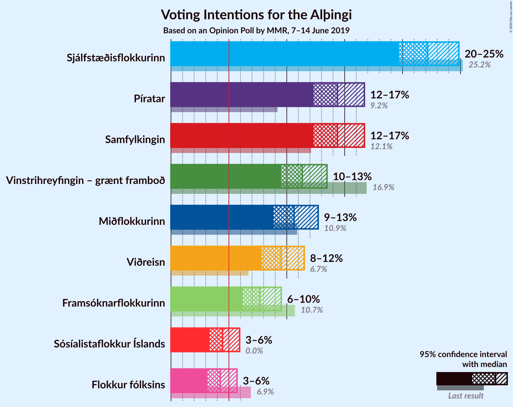
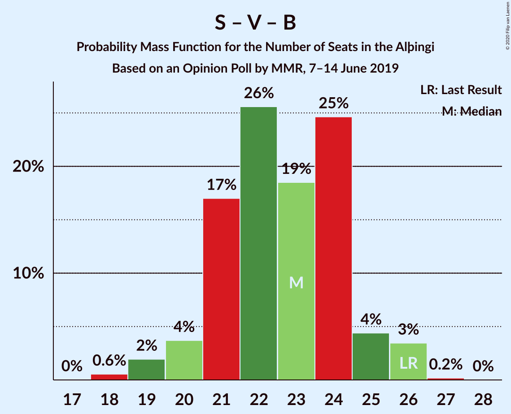

# Opinion Poll by MMR, 7–14 June 2019

<a href="#voting-intentions">Voting Intentions</a> | <a href="#seats">Seats</a> | <a href="#coalitions">Coalitions</a> | <a href="#technical-information">Technical Information</a>

## Voting Intentions

### Confidence Intervals

| Party | Last Result | Poll Result | 80% Confidence Interval | 90% Confidence Interval | 95% Confidence Interval | 99% Confidence Interval |
|:-----:|:-----------:|:-----------:|:-----------------------:|:-----------------------:|:-----------------------:|:-----------------------:|
| Sjálfstæðisflokkurinn | 25.2% | 22.2% | 20.5–23.9% |20.1–24.4% |19.7–24.9% |18.9–25.7% |
| Samfylkingin | 12.1% | 14.4% | 13.0–15.9% |12.7–16.3% |12.3–16.7% |11.7–17.5% |
| Píratar | 9.2% | 14.4% | 13.0–15.9% |12.7–16.3% |12.3–16.7% |11.7–17.5% |
| Vinstrihreyfingin – grænt framboð | 16.9% | 11.3% | 10.1–12.7% |9.8–13.1% |9.5–13.5% |9.0–14.2% |
| Miðflokkurinn | 10.9% | 10.6% | 9.5–12.0% |9.1–12.4% |8.9–12.7% |8.3–13.4% |
| Viðreisn | 6.7% | 9.5% | 8.4–10.8% |8.1–11.2% |7.8–11.5% |7.3–12.2% |
| Framsóknarflokkurinn | 10.7% | 7.7% | 6.7–8.9% |6.4–9.2% |6.2–9.5% |5.7–10.1% |
| Flokkur fólksins | 6.9% | 4.3% | 3.5–5.2% |3.3–5.5% |3.2–5.7% |2.8–6.2% |

*Note:* The poll result column reflects the actual value used in the calculations. Published results may vary slightly, and in addition be rounded to fewer digits.

## Seats

### Confidence Intervals

| Party | Last Result | Median | 80% Confidence Interval | 90% Confidence Interval | 95% Confidence Interval | 99% Confidence Interval |
|:-----:|:-----------:|:------:|:-----------------------:|:-----------------------:|:-----------------------:|:-----------------------:|
| <a href="#sjálfstæðisflokkurinn">Sjálfstæðisflokkurinn</a> | 16 | 15 | 15–17 |14–17 |13–18 |13–18 |
| <a href="#samfylkingin">Samfylkingin</a> | 7 | 10 | 9–10 |8–11 |8–11 |7–12 |
| <a href="#píratar">Píratar</a> | 6 | 9 | 8–10 |8–11 |8–11 |7–12 |
| <a href="#vinstrihreyfingin-–-grænt-framboð">Vinstrihreyfingin – grænt framboð</a> | 11 | 7 | 6–9 |6–9 |6–9 |6–10 |
| <a href="#miðflokkurinn">Miðflokkurinn</a> | 7 | 8 | 6–9 |6–9 |5–9 |5–10 |
| <a href="#viðreisn">Viðreisn</a> | 4 | 6 | 5–7 |5–7 |5–7 |5–8 |
| <a href="#framsóknarflokkurinn">Framsóknarflokkurinn</a> | 8 | 5 | 4–5 |4–6 |3–6 |3–7 |
| <a href="#flokkur-fólksins">Flokkur fólksins</a> | 4 | 0 | 0–3 |0–3 |0–3 |0–4 |

### Sjálfstæðisflokkurinn

*For a full overview of the results for this party, see the [Sjálfstæðisflokkurinn](party-sjálfstæðisflokkurinn.html) page.*

| Number of Seats | Probability | Accumulated | Special Marks |
|:---------------:|:-----------:|:-----------:|:-------------:|
| 12 | 0.2% | 100% |  |
| 13 | 4% | 99.8% |  |
| 14 | 3% | 96% |  |
| 15 | 64% | 93% | Median |
| 16 | 15% | 29% | Last Result |
| 17 | 10% | 15% |  |
| 18 | 4% | 5% |  |
| 19 | 0.1% | 0.3% |  |
| 20 | 0.2% | 0.2% |  |
| 21 | 0% | 0% |  |

### Samfylkingin

*For a full overview of the results for this party, see the [Samfylkingin](party-samfylkingin.html) page.*

| Number of Seats | Probability | Accumulated | Special Marks |
|:---------------:|:-----------:|:-----------:|:-------------:|
| 7 | 2% | 100% | Last Result |
| 8 | 3% | 98% |  |
| 9 | 36% | 94% |  |
| 10 | 53% | 59% | Median |
| 11 | 4% | 6% |  |
| 12 | 2% | 2% |  |
| 13 | 0% | 0% |  |

### Píratar

*For a full overview of the results for this party, see the [Píratar](party-píratar.html) page.*

| Number of Seats | Probability | Accumulated | Special Marks |
|:---------------:|:-----------:|:-----------:|:-------------:|
| 6 | 0% | 100% | Last Result |
| 7 | 0.6% | 100% |  |
| 8 | 19% | 99.4% |  |
| 9 | 53% | 81% | Median |
| 10 | 19% | 28% |  |
| 11 | 8% | 9% |  |
| 12 | 1.3% | 1.3% |  |
| 13 | 0% | 0% |  |

### Vinstrihreyfingin – grænt framboð

*For a full overview of the results for this party, see the [Vinstrihreyfingin – grænt framboð](party-vinstrihreyfingin–græntframboð.html) page.*

| Number of Seats | Probability | Accumulated | Special Marks |
|:---------------:|:-----------:|:-----------:|:-------------:|
| 5 | 0.4% | 100% |  |
| 6 | 18% | 99.6% |  |
| 7 | 53% | 82% | Median |
| 8 | 15% | 29% |  |
| 9 | 12% | 14% |  |
| 10 | 2% | 2% |  |
| 11 | 0% | 0% | Last Result |

### Miðflokkurinn

*For a full overview of the results for this party, see the [Miðflokkurinn](party-miðflokkurinn.html) page.*

| Number of Seats | Probability | Accumulated | Special Marks |
|:---------------:|:-----------:|:-----------:|:-------------:|
| 5 | 5% | 100% |  |
| 6 | 24% | 95% |  |
| 7 | 8% | 72% | Last Result |
| 8 | 32% | 64% | Median |
| 9 | 32% | 32% |  |
| 10 | 0.6% | 0.6% |  |
| 11 | 0% | 0% |  |

### Viðreisn

*For a full overview of the results for this party, see the [Viðreisn](party-viðreisn.html) page.*

| Number of Seats | Probability | Accumulated | Special Marks |
|:---------------:|:-----------:|:-----------:|:-------------:|
| 4 | 0.3% | 100% | Last Result |
| 5 | 26% | 99.7% |  |
| 6 | 55% | 73% | Median |
| 7 | 18% | 19% |  |
| 8 | 0.9% | 0.9% |  |
| 9 | 0.1% | 0.1% |  |
| 10 | 0% | 0% |  |

### Framsóknarflokkurinn

*For a full overview of the results for this party, see the [Framsóknarflokkurinn](party-framsóknarflokkurinn.html) page.*

| Number of Seats | Probability | Accumulated | Special Marks |
|:---------------:|:-----------:|:-----------:|:-------------:|
| 3 | 3% | 100% |  |
| 4 | 46% | 97% |  |
| 5 | 42% | 51% | Median |
| 6 | 8% | 9% |  |
| 7 | 1.0% | 1.0% |  |
| 8 | 0% | 0% | Last Result |

### Flokkur fólksins

*For a full overview of the results for this party, see the [Flokkur fólksins](party-flokkurfólksins.html) page.*

| Number of Seats | Probability | Accumulated | Special Marks |
|:---------------:|:-----------:|:-----------:|:-------------:|
| 0 | 81% | 100% | Median |
| 1 | 0.1% | 19% |  |
| 2 | 0.4% | 19% |  |
| 3 | 17% | 18% |  |
| 4 | 0.8% | 0.8% | Last Result |
| 5 | 0% | 0% |  |

## Coalitions

### Confidence Intervals

| Coalition | Last Result | Median | Majority? | 80% Confidence Interval | 90% Confidence Interval | 95% Confidence Interval | 99% Confidence Interval |
|:---------:|:-----------:|:------:|:---------:|:-----------------------:|:-----------------------:|:-----------------------:|:-----------------------:|
| Píratar – Samfylkingin – Vinstrihreyfingin – grænt framboð – Viðreisn | 28 | 32 | 58% | 30–34 | 30–35 | 28–35 | 28–36 |
| Samfylkingin – Vinstrihreyfingin – grænt framboð – Miðflokkurinn – Framsóknarflokkurinn | 33 | 29 | 3% | 27–31 | 26–31 | 26–32 | 25–33 |
| Sjálfstæðisflokkurinn – Miðflokkurinn – Framsóknarflokkurinn | 31 | 28 | 0.1% | 26–29 | 25–29 | 25–30 | 24–31 |
| Sjálfstæðisflokkurinn – Vinstrihreyfingin – grænt framboð – Framsóknarflokkurinn | 35 | 27 | 0.2% | 25–29 | 25–30 | 25–30 | 24–31 |
| Píratar – Samfylkingin – Vinstrihreyfingin – grænt framboð | 24 | 26 | 0% | 24–28 | 24–28 | 23–29 | 23–30 |
| Sjálfstæðisflokkurinn – Samfylkingin | 23 | 25 | 0% | 24–26 | 23–27 | 22–27 | 21–28 |
| Samfylkingin – Vinstrihreyfingin – grænt framboð – Miðflokkurinn | 25 | 25 | 0% | 22–26 | 21–26 | 21–27 | 20–28 |
| Sjálfstæðisflokkurinn – Miðflokkurinn | 23 | 23 | 0% | 21–24 | 21–24 | 20–25 | 19–26 |
| Sjálfstæðisflokkurinn – Vinstrihreyfingin – grænt framboð | 27 | 22 | 0% | 21–24 | 21–25 | 20–25 | 19–26 |
| Samfylkingin – Vinstrihreyfingin – grænt framboð – Framsóknarflokkurinn | 26 | 21 | 0% | 20–23 | 20–23 | 19–24 | 18–25 |
| Sjálfstæðisflokkurinn – Viðreisn | 20 | 21 | 0% | 20–23 | 20–23 | 19–24 | 18–25 |
| Sjálfstæðisflokkurinn – Framsóknarflokkurinn | 24 | 20 | 0% | 19–22 | 18–23 | 18–23 | 17–23 |
| Vinstrihreyfingin – grænt framboð – Miðflokkurinn – Framsóknarflokkurinn | 26 | 20 | 0% | 18–21 | 17–22 | 16–23 | 16–23 |
| Samfylkingin – Vinstrihreyfingin – grænt framboð | 18 | 17 | 0% | 16–18 | 15–18 | 15–19 | 14–20 |
| Píratar – Vinstrihreyfingin – grænt framboð | 17 | 16 | 0% | 15–18 | 15–19 | 14–19 | 14–20 |
| Vinstrihreyfingin – grænt framboð – Miðflokkurinn | 18 | 15 | 0% | 13–16 | 12–17 | 12–17 | 11–18 |
| Vinstrihreyfingin – grænt framboð – Framsóknarflokkurinn | 19 | 12 | 0% | 11–14 | 10–14 | 10–14 | 9–15 |

### Píratar – Samfylkingin – Vinstrihreyfingin – grænt framboð – Viðreisn

| Number of Seats | Probability | Accumulated | Special Marks |
|:---------------:|:-----------:|:-----------:|:-------------:|
| 26 | 0% | 100% |  |
| 27 | 0.1% | 99.9% |  |
| 28 | 3% | 99.9% | Last Result |
| 29 | 1.3% | 97% |  |
| 30 | 13% | 96% |  |
| 31 | 25% | 83% |  |
| 32 | 20% | 58% | Median, Majority |
| 33 | 21% | 38% |  |
| 34 | 9% | 16% |  |
| 35 | 6% | 7% |  |
| 36 | 2% | 2% |  |
| 37 | 0.1% | 0.2% |  |
| 38 | 0% | 0% |  |

### Samfylkingin – Vinstrihreyfingin – grænt framboð – Miðflokkurinn – Framsóknarflokkurinn

| Number of Seats | Probability | Accumulated | Special Marks |
|:---------------:|:-----------:|:-----------:|:-------------:|
| 24 | 0.2% | 100% |  |
| 25 | 2% | 99.8% |  |
| 26 | 4% | 98% |  |
| 27 | 11% | 94% |  |
| 28 | 11% | 83% |  |
| 29 | 31% | 72% |  |
| 30 | 27% | 41% | Median |
| 31 | 11% | 14% |  |
| 32 | 2% | 3% | Majority |
| 33 | 1.1% | 1.2% | Last Result |
| 34 | 0.1% | 0.1% |  |
| 35 | 0% | 0% |  |

### Sjálfstæðisflokkurinn – Miðflokkurinn – Framsóknarflokkurinn

| Number of Seats | Probability | Accumulated | Special Marks |
|:---------------:|:-----------:|:-----------:|:-------------:|
| 23 | 0.1% | 100% |  |
| 24 | 0.8% | 99.9% |  |
| 25 | 5% | 99.1% |  |
| 26 | 9% | 95% |  |
| 27 | 32% | 86% |  |
| 28 | 34% | 54% | Median |
| 29 | 15% | 20% |  |
| 30 | 4% | 5% |  |
| 31 | 0.7% | 0.8% | Last Result |
| 32 | 0.1% | 0.1% | Majority |
| 33 | 0% | 0% |  |

### Sjálfstæðisflokkurinn – Vinstrihreyfingin – grænt framboð – Framsóknarflokkurinn

| Number of Seats | Probability | Accumulated | Special Marks |
|:---------------:|:-----------:|:-----------:|:-------------:|
| 23 | 0.5% | 100% |  |
| 24 | 1.4% | 99.5% |  |
| 25 | 8% | 98% |  |
| 26 | 33% | 90% |  |
| 27 | 20% | 57% | Median |
| 28 | 7% | 37% |  |
| 29 | 22% | 30% |  |
| 30 | 7% | 8% |  |
| 31 | 1.0% | 1.2% |  |
| 32 | 0.2% | 0.2% | Majority |
| 33 | 0% | 0% |  |
| 34 | 0% | 0% |  |
| 35 | 0% | 0% | Last Result |

### Píratar – Samfylkingin – Vinstrihreyfingin – grænt framboð

| Number of Seats | Probability | Accumulated | Special Marks |
|:---------------:|:-----------:|:-----------:|:-------------:|
| 21 | 0.1% | 100% |  |
| 22 | 0.3% | 99.9% |  |
| 23 | 3% | 99.7% |  |
| 24 | 7% | 96% | Last Result |
| 25 | 27% | 90% |  |
| 26 | 28% | 63% | Median |
| 27 | 20% | 35% |  |
| 28 | 12% | 15% |  |
| 29 | 2% | 3% |  |
| 30 | 1.4% | 1.5% |  |
| 31 | 0.1% | 0.1% |  |
| 32 | 0% | 0% | Majority |

### Sjálfstæðisflokkurinn – Samfylkingin

| Number of Seats | Probability | Accumulated | Special Marks |
|:---------------:|:-----------:|:-----------:|:-------------:|
| 20 | 0.2% | 100% |  |
| 21 | 0.7% | 99.8% |  |
| 22 | 3% | 99.1% |  |
| 23 | 3% | 96% | Last Result |
| 24 | 20% | 93% |  |
| 25 | 47% | 73% | Median |
| 26 | 20% | 26% |  |
| 27 | 4% | 7% |  |
| 28 | 2% | 2% |  |
| 29 | 0.3% | 0.3% |  |
| 30 | 0.1% | 0.1% |  |
| 31 | 0% | 0% |  |

### Samfylkingin – Vinstrihreyfingin – grænt framboð – Miðflokkurinn

| Number of Seats | Probability | Accumulated | Special Marks |
|:---------------:|:-----------:|:-----------:|:-------------:|
| 20 | 2% | 100% |  |
| 21 | 4% | 98% |  |
| 22 | 12% | 95% |  |
| 23 | 7% | 83% |  |
| 24 | 15% | 76% |  |
| 25 | 30% | 61% | Last Result, Median |
| 26 | 29% | 32% |  |
| 27 | 2% | 3% |  |
| 28 | 0.5% | 0.6% |  |
| 29 | 0.1% | 0.1% |  |
| 30 | 0% | 0% |  |

### Sjálfstæðisflokkurinn – Miðflokkurinn

| Number of Seats | Probability | Accumulated | Special Marks |
|:---------------:|:-----------:|:-----------:|:-------------:|
| 19 | 0.5% | 100% |  |
| 20 | 3% | 99.5% |  |
| 21 | 10% | 97% |  |
| 22 | 12% | 87% |  |
| 23 | 37% | 75% | Last Result, Median |
| 24 | 36% | 39% |  |
| 25 | 2% | 3% |  |
| 26 | 0.8% | 1.1% |  |
| 27 | 0.2% | 0.3% |  |
| 28 | 0.1% | 0.1% |  |
| 29 | 0% | 0% |  |

### Sjálfstæðisflokkurinn – Vinstrihreyfingin – grænt framboð

| Number of Seats | Probability | Accumulated | Special Marks |
|:---------------:|:-----------:|:-----------:|:-------------:|
| 19 | 0.8% | 100% |  |
| 20 | 3% | 99.2% |  |
| 21 | 10% | 96% |  |
| 22 | 42% | 87% | Median |
| 23 | 17% | 44% |  |
| 24 | 19% | 27% |  |
| 25 | 7% | 9% |  |
| 26 | 1.0% | 1.3% |  |
| 27 | 0.3% | 0.3% | Last Result |
| 28 | 0% | 0% |  |

### Samfylkingin – Vinstrihreyfingin – grænt framboð – Framsóknarflokkurinn

| Number of Seats | Probability | Accumulated | Special Marks |
|:---------------:|:-----------:|:-----------:|:-------------:|
| 17 | 0.1% | 100% |  |
| 18 | 0.4% | 99.8% |  |
| 19 | 2% | 99.4% |  |
| 20 | 14% | 97% |  |
| 21 | 49% | 83% |  |
| 22 | 12% | 34% | Median |
| 23 | 18% | 23% |  |
| 24 | 3% | 4% |  |
| 25 | 0.8% | 0.9% |  |
| 26 | 0.1% | 0.2% | Last Result |
| 27 | 0% | 0% |  |

### Sjálfstæðisflokkurinn – Viðreisn

| Number of Seats | Probability | Accumulated | Special Marks |
|:---------------:|:-----------:|:-----------:|:-------------:|
| 18 | 0.8% | 100% |  |
| 19 | 3% | 99.2% |  |
| 20 | 20% | 96% | Last Result |
| 21 | 34% | 76% | Median |
| 22 | 27% | 42% |  |
| 23 | 12% | 15% |  |
| 24 | 2% | 3% |  |
| 25 | 0.4% | 0.6% |  |
| 26 | 0.2% | 0.2% |  |
| 27 | 0% | 0% |  |

### Sjálfstæðisflokkurinn – Framsóknarflokkurinn

| Number of Seats | Probability | Accumulated | Special Marks |
|:---------------:|:-----------:|:-----------:|:-------------:|
| 16 | 0.1% | 100% |  |
| 17 | 0.9% | 99.9% |  |
| 18 | 6% | 99.0% |  |
| 19 | 43% | 93% |  |
| 20 | 20% | 50% | Median |
| 21 | 14% | 30% |  |
| 22 | 10% | 16% |  |
| 23 | 6% | 6% |  |
| 24 | 0.2% | 0.2% | Last Result |
| 25 | 0% | 0% |  |

### Vinstrihreyfingin – grænt framboð – Miðflokkurinn – Framsóknarflokkurinn

| Number of Seats | Probability | Accumulated | Special Marks |
|:---------------:|:-----------:|:-----------:|:-------------:|
| 15 | 0.2% | 100% |  |
| 16 | 3% | 99.8% |  |
| 17 | 5% | 97% |  |
| 18 | 14% | 92% |  |
| 19 | 27% | 78% |  |
| 20 | 34% | 51% | Median |
| 21 | 9% | 17% |  |
| 22 | 6% | 9% |  |
| 23 | 3% | 3% |  |
| 24 | 0.2% | 0.2% |  |
| 25 | 0% | 0% |  |
| 26 | 0% | 0% | Last Result |

### Samfylkingin – Vinstrihreyfingin – grænt framboð

| Number of Seats | Probability | Accumulated | Special Marks |
|:---------------:|:-----------:|:-----------:|:-------------:|
| 13 | 0.2% | 100% |  |
| 14 | 0.5% | 99.8% |  |
| 15 | 9% | 99.3% |  |
| 16 | 24% | 90% |  |
| 17 | 42% | 66% | Median |
| 18 | 20% | 24% | Last Result |
| 19 | 3% | 4% |  |
| 20 | 0.9% | 1.0% |  |
| 21 | 0.1% | 0.1% |  |
| 22 | 0% | 0% |  |

### Píratar – Vinstrihreyfingin – grænt framboð

| Number of Seats | Probability | Accumulated | Special Marks |
|:---------------:|:-----------:|:-----------:|:-------------:|
| 13 | 0.2% | 100% |  |
| 14 | 4% | 99.7% |  |
| 15 | 21% | 96% |  |
| 16 | 31% | 74% | Median |
| 17 | 23% | 44% | Last Result |
| 18 | 12% | 21% |  |
| 19 | 8% | 9% |  |
| 20 | 0.8% | 1.0% |  |
| 21 | 0.2% | 0.2% |  |
| 22 | 0% | 0% |  |

### Vinstrihreyfingin – grænt framboð – Miðflokkurinn

| Number of Seats | Probability | Accumulated | Special Marks |
|:---------------:|:-----------:|:-----------:|:-------------:|
| 11 | 2% | 100% |  |
| 12 | 5% | 98% |  |
| 13 | 15% | 93% |  |
| 14 | 10% | 78% |  |
| 15 | 27% | 68% | Median |
| 16 | 33% | 41% |  |
| 17 | 6% | 8% |  |
| 18 | 2% | 2% | Last Result |
| 19 | 0.2% | 0.2% |  |
| 20 | 0% | 0% |  |

### Vinstrihreyfingin – grænt framboð – Framsóknarflokkurinn

| Number of Seats | Probability | Accumulated | Special Marks |
|:---------------:|:-----------:|:-----------:|:-------------:|
| 9 | 1.1% | 100% |  |
| 10 | 8% | 98.8% |  |
| 11 | 39% | 91% |  |
| 12 | 27% | 52% | Median |
| 13 | 10% | 25% |  |
| 14 | 14% | 15% |  |
| 15 | 1.4% | 2% |  |
| 16 | 0.2% | 0.2% |  |
| 17 | 0% | 0% |  |
| 18 | 0% | 0% |  |
| 19 | 0% | 0% | Last Result |

## Technical Information

### Opinion Poll

+ **Polling firm:** MMR
+ **Commissioner(s):** —
+ **Fieldwork period:** 7–14 June 2019

### Calculations

+ **Sample size:** 988
+ **Simulations done:** 131,072
+ **Error estimate:** 1.51%

