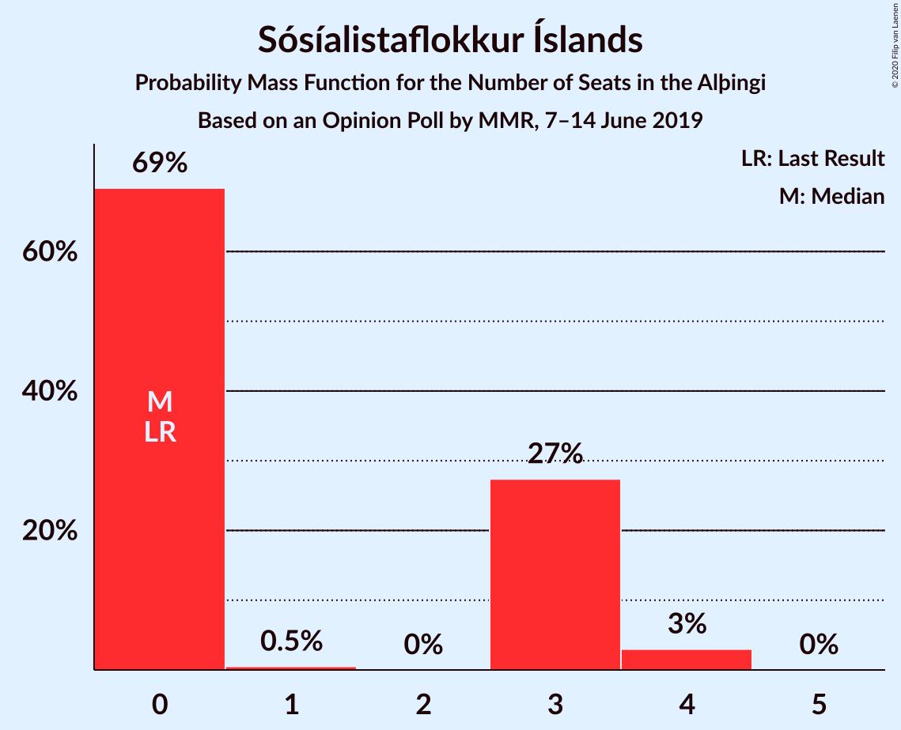
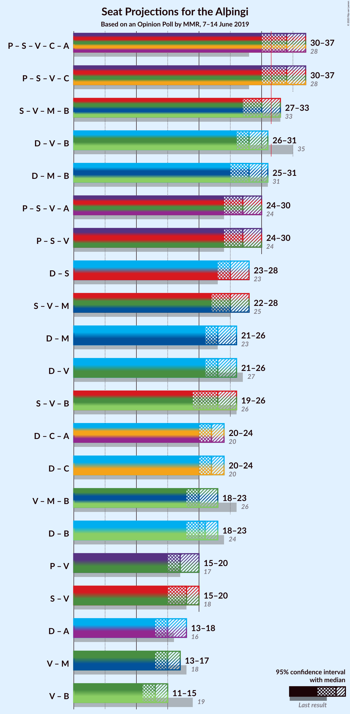
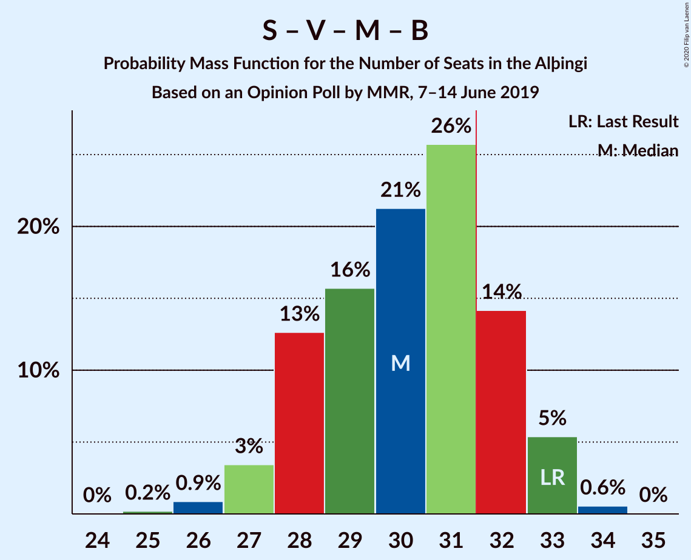
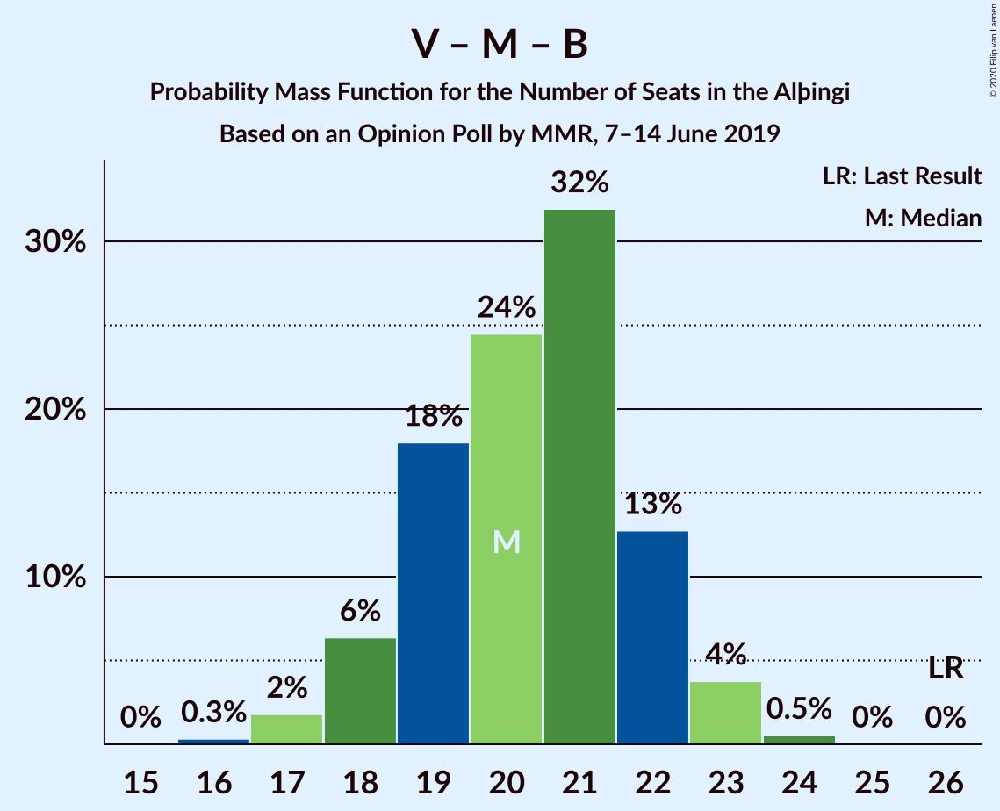

# Opinion Poll by MMR, 7–14 June 2019

<a href="#voting-intentions">Voting Intentions</a> | <a href="#seats">Seats</a> | <a href="#coalitions">Coalitions</a> | <a href="#technical-information">Technical Information</a>

## Voting Intentions

### Confidence Intervals

| Party | Last Result | Poll Result | 80% Confidence Interval | 90% Confidence Interval | 95% Confidence Interval | 99% Confidence Interval |
|:-----:|:-----------:|:-----------:|:-----------------------:|:-----------------------:|:-----------------------:|:-----------------------:|
| Sjálfstæðisflokkurinn | 25.2% | 22.2% | 20.5–23.9% |20.1–24.4% |19.7–24.9% |18.9–25.7% |
| Samfylkingin | 12.1% | 14.4% | 13.0–15.9% |12.7–16.3% |12.3–16.7% |11.7–17.5% |
| Píratar | 9.2% | 14.4% | 13.0–15.9% |12.7–16.3% |12.3–16.7% |11.7–17.5% |
| Vinstrihreyfingin – grænt framboð | 16.9% | 11.3% | 10.1–12.7% |9.8–13.1% |9.5–13.5% |9.0–14.2% |
| Miðflokkurinn | 10.9% | 10.6% | 9.5–12.0% |9.1–12.4% |8.9–12.7% |8.3–13.4% |
| Viðreisn | 6.7% | 9.5% | 8.4–10.8% |8.1–11.2% |7.8–11.5% |7.3–12.2% |
| Framsóknarflokkurinn | 10.7% | 7.7% | 6.7–8.9% |6.4–9.2% |6.2–9.5% |5.7–10.1% |
| Sósíalistaflokkur Íslands | 0.0% | 4.5% | 3.7–5.4% |3.5–5.7% |3.3–5.9% |3.0–6.4% |
| Flokkur fólksins | 6.9% | 4.3% | 3.5–5.2% |3.3–5.5% |3.2–5.7% |2.8–6.2% |

*Note:* The poll result column reflects the actual value used in the calculations. Published results may vary slightly, and in addition be rounded to fewer digits.

## Seats

### Confidence Intervals

| Party | Last Result | Median | 80% Confidence Interval | 90% Confidence Interval | 95% Confidence Interval | 99% Confidence Interval |
|:-----:|:-----------:|:------:|:-----------------------:|:-----------------------:|:-----------------------:|:-----------------------:|
| <a href="#sjálfstæðisflokkurinn">Sjálfstæðisflokkurinn</a> | 16 | 15 | 14–17 |14–18 |13–18 |13–18 |
| <a href="#samfylkingin">Samfylkingin</a> | 7 | 10 | 9–11 |8–11 |8–12 |7–12 |
| <a href="#píratar">Píratar</a> | 6 | 10 | 9–11 |8–11 |8–12 |8–12 |
| <a href="#vinstrihreyfingin-–-grænt-framboð">Vinstrihreyfingin – grænt framboð</a> | 11 | 8 | 7–9 |6–9 |6–9 |6–10 |
| <a href="#miðflokkurinn">Miðflokkurinn</a> | 7 | 7 | 6–9 |6–9 |6–9 |5–10 |
| <a href="#viðreisn">Viðreisn</a> | 4 | 6 | 5–7 |5–8 |5–8 |5–8 |
| <a href="#framsóknarflokkurinn">Framsóknarflokkurinn</a> | 8 | 5 | 4–6 |4–6 |4–6 |3–7 |
| <a href="#sósíalistaflokkur-íslands">Sósíalistaflokkur Íslands</a> | 0 | 0 | 0–3 |0–3 |0–4 |0–4 |
| <a href="#flokkur-fólksins">Flokkur fólksins</a> | 4 | 0 | 0–3 |0–3 |0–3 |0–4 |

### Sjálfstæðisflokkurinn

*For a full overview of the results for this party, see the [Sjálfstæðisflokkurinn](party-sjálfstæðisflokkurinn.html) page.*

| Number of Seats | Probability | Accumulated | Special Marks |
|:---------------:|:-----------:|:-----------:|:-------------:|
| 12 | 0.1% | 100% |  |
| 13 | 3% | 99.9% |  |
| 14 | 10% | 97% |  |
| 15 | 43% | 87% | Median |
| 16 | 31% | 44% | Last Result |
| 17 | 7% | 13% |  |
| 18 | 5% | 5% |  |
| 19 | 0.3% | 0.4% |  |
| 20 | 0% | 0% |  |

### Samfylkingin

*For a full overview of the results for this party, see the [Samfylkingin](party-samfylkingin.html) page.*

| Number of Seats | Probability | Accumulated | Special Marks |
|:---------------:|:-----------:|:-----------:|:-------------:|
| 7 | 0.7% | 100% | Last Result |
| 8 | 7% | 99.3% |  |
| 9 | 27% | 93% |  |
| 10 | 43% | 66% | Median |
| 11 | 20% | 23% |  |
| 12 | 3% | 3% |  |
| 13 | 0.2% | 0.2% |  |
| 14 | 0% | 0% |  |

### Píratar

*For a full overview of the results for this party, see the [Píratar](party-píratar.html) page.*

| Number of Seats | Probability | Accumulated | Special Marks |
|:---------------:|:-----------:|:-----------:|:-------------:|
| 6 | 0% | 100% | Last Result |
| 7 | 0.2% | 100% |  |
| 8 | 8% | 99.7% |  |
| 9 | 36% | 92% |  |
| 10 | 38% | 56% | Median |
| 11 | 15% | 18% |  |
| 12 | 2% | 3% |  |
| 13 | 0.4% | 0.4% |  |
| 14 | 0% | 0% |  |

### Vinstrihreyfingin – grænt framboð

*For a full overview of the results for this party, see the [Vinstrihreyfingin – grænt framboð](party-vinstrihreyfingin–græntframboð.html) page.*

| Number of Seats | Probability | Accumulated | Special Marks |
|:---------------:|:-----------:|:-----------:|:-------------:|
| 5 | 0.2% | 100% |  |
| 6 | 6% | 99.8% |  |
| 7 | 40% | 94% |  |
| 8 | 32% | 53% | Median |
| 9 | 19% | 21% |  |
| 10 | 2% | 2% |  |
| 11 | 0% | 0% | Last Result |

### Miðflokkurinn

*For a full overview of the results for this party, see the [Miðflokkurinn](party-miðflokkurinn.html) page.*

| Number of Seats | Probability | Accumulated | Special Marks |
|:---------------:|:-----------:|:-----------:|:-------------:|
| 5 | 1.0% | 100% |  |
| 6 | 15% | 99.0% |  |
| 7 | 39% | 84% | Last Result, Median |
| 8 | 22% | 46% |  |
| 9 | 23% | 24% |  |
| 10 | 0.9% | 0.9% |  |
| 11 | 0% | 0% |  |

### Viðreisn

*For a full overview of the results for this party, see the [Viðreisn](party-viðreisn.html) page.*

| Number of Seats | Probability | Accumulated | Special Marks |
|:---------------:|:-----------:|:-----------:|:-------------:|
| 4 | 0.2% | 100% | Last Result |
| 5 | 13% | 99.8% |  |
| 6 | 49% | 87% | Median |
| 7 | 28% | 37% |  |
| 8 | 10% | 10% |  |
| 9 | 0.2% | 0.2% |  |
| 10 | 0% | 0% |  |

### Framsóknarflokkurinn

*For a full overview of the results for this party, see the [Framsóknarflokkurinn](party-framsóknarflokkurinn.html) page.*

| Number of Seats | Probability | Accumulated | Special Marks |
|:---------------:|:-----------:|:-----------:|:-------------:|
| 3 | 0.5% | 100% |  |
| 4 | 19% | 99.5% |  |
| 5 | 53% | 81% | Median |
| 6 | 26% | 28% |  |
| 7 | 1.5% | 2% |  |
| 8 | 0.1% | 0.1% | Last Result |
| 9 | 0% | 0% |  |

### Sósíalistaflokkur Íslands

*For a full overview of the results for this party, see the [Sósíalistaflokkur Íslands](party-sósíalistaflokkuríslands.html) page.*

| Number of Seats | Probability | Accumulated | Special Marks |
|:---------------:|:-----------:|:-----------:|:-------------:|
| 0 | 69% | 100% | Last Result, Median |
| 1 | 0.5% | 31% |  |
| 2 | 0% | 30% |  |
| 3 | 27% | 30% |  |
| 4 | 3% | 3% |  |
| 5 | 0% | 0% |  |

### Flokkur fólksins

*For a full overview of the results for this party, see the [Flokkur fólksins](party-flokkurfólksins.html) page.*

| Number of Seats | Probability | Accumulated | Special Marks |
|:---------------:|:-----------:|:-----------:|:-------------:|
| 0 | 87% | 100% | Median |
| 1 | 0.4% | 13% |  |
| 2 | 0% | 13% |  |
| 3 | 11% | 13% |  |
| 4 | 2% | 2% | Last Result |
| 5 | 0% | 0% |  |

## Coalitions

### Confidence Intervals

| Coalition | Last Result | Median | Majority? | 80% Confidence Interval | 90% Confidence Interval | 95% Confidence Interval | 99% Confidence Interval |
|:---------:|:-----------:|:------:|:---------:|:-----------------------:|:-----------------------:|:-----------------------:|:-----------------------:|
| Píratar – Samfylkingin – Vinstrihreyfingin – grænt framboð – Viðreisn | 28 | 34 | 89% | 31–36 | 31–36 | 30–37 | 29–37 |
| Samfylkingin – Vinstrihreyfingin – grænt framboð – Miðflokkurinn – Framsóknarflokkurinn | 33 | 30 | 20% | 28–32 | 28–33 | 27–33 | 26–34 |
| Sjálfstæðisflokkurinn – Vinstrihreyfingin – grænt framboð – Framsóknarflokkurinn | 35 | 28 | 0.9% | 26–30 | 26–30 | 26–31 | 25–32 |
| Sjálfstæðisflokkurinn – Miðflokkurinn – Framsóknarflokkurinn | 31 | 28 | 0.9% | 26–30 | 26–30 | 25–31 | 25–32 |
| Píratar – Samfylkingin – Vinstrihreyfingin – grænt framboð | 24 | 27 | 0.1% | 25–29 | 25–30 | 24–30 | 23–31 |
| Sjálfstæðisflokkurinn – Samfylkingin | 23 | 25 | 0% | 24–27 | 23–27 | 23–28 | 22–29 |
| Samfylkingin – Vinstrihreyfingin – grænt framboð – Miðflokkurinn | 25 | 25 | 0% | 23–27 | 23–28 | 22–28 | 21–28 |
| Sjálfstæðisflokkurinn – Miðflokkurinn | 23 | 23 | 0% | 21–25 | 21–25 | 21–26 | 20–27 |
| Sjálfstæðisflokkurinn – Vinstrihreyfingin – grænt framboð | 27 | 23 | 0% | 22–25 | 21–25 | 21–26 | 20–27 |
| Samfylkingin – Vinstrihreyfingin – grænt framboð – Framsóknarflokkurinn | 26 | 23 | 0% | 21–24 | 20–25 | 19–26 | 18–26 |
| Sjálfstæðisflokkurinn – Viðreisn | 20 | 22 | 0% | 20–24 | 20–24 | 20–24 | 19–25 |
| Vinstrihreyfingin – grænt framboð – Miðflokkurinn – Framsóknarflokkurinn | 26 | 20 | 0% | 19–22 | 18–22 | 18–23 | 17–24 |
| Sjálfstæðisflokkurinn – Framsóknarflokkurinn | 24 | 21 | 0% | 19–22 | 19–23 | 18–23 | 18–24 |
| Píratar – Vinstrihreyfingin – grænt framboð | 17 | 17 | 0% | 16–19 | 15–19 | 15–20 | 15–21 |
| Samfylkingin – Vinstrihreyfingin – grænt framboð | 18 | 18 | 0% | 16–19 | 16–20 | 15–20 | 14–21 |
| Vinstrihreyfingin – grænt framboð – Miðflokkurinn | 18 | 15 | 0% | 14–17 | 13–17 | 13–17 | 12–18 |
| Vinstrihreyfingin – grænt framboð – Framsóknarflokkurinn | 19 | 13 | 0% | 11–14 | 11–15 | 11–15 | 10–16 |

### Píratar – Samfylkingin – Vinstrihreyfingin – grænt framboð – Viðreisn

| Number of Seats | Probability | Accumulated | Special Marks |
|:---------------:|:-----------:|:-----------:|:-------------:|
| 28 | 0.2% | 100% | Last Result |
| 29 | 1.2% | 99.8% |  |
| 30 | 3% | 98.6% |  |
| 31 | 6% | 95% |  |
| 32 | 20% | 89% | Majority |
| 33 | 14% | 69% |  |
| 34 | 21% | 54% | Median |
| 35 | 20% | 33% |  |
| 36 | 9% | 13% |  |
| 37 | 3% | 4% |  |
| 38 | 0.5% | 0.5% |  |
| 39 | 0% | 0% |  |

### Samfylkingin – Vinstrihreyfingin – grænt framboð – Miðflokkurinn – Framsóknarflokkurinn

| Number of Seats | Probability | Accumulated | Special Marks |
|:---------------:|:-----------:|:-----------:|:-------------:|
| 25 | 0.2% | 100% |  |
| 26 | 0.9% | 99.8% |  |
| 27 | 3% | 98.9% |  |
| 28 | 13% | 95% |  |
| 29 | 16% | 83% |  |
| 30 | 21% | 67% | Median |
| 31 | 26% | 46% |  |
| 32 | 14% | 20% | Majority |
| 33 | 5% | 6% | Last Result |
| 34 | 0.6% | 0.6% |  |
| 35 | 0% | 0% |  |

### Sjálfstæðisflokkurinn – Vinstrihreyfingin – grænt framboð – Framsóknarflokkurinn

| Number of Seats | Probability | Accumulated | Special Marks |
|:---------------:|:-----------:|:-----------:|:-------------:|
| 24 | 0.3% | 100% |  |
| 25 | 2% | 99.7% |  |
| 26 | 9% | 98% |  |
| 27 | 18% | 89% |  |
| 28 | 30% | 71% | Median |
| 29 | 19% | 41% |  |
| 30 | 17% | 22% |  |
| 31 | 4% | 5% |  |
| 32 | 0.8% | 0.9% | Majority |
| 33 | 0.1% | 0.1% |  |
| 34 | 0% | 0% |  |
| 35 | 0% | 0% | Last Result |

### Sjálfstæðisflokkurinn – Miðflokkurinn – Framsóknarflokkurinn

| Number of Seats | Probability | Accumulated | Special Marks |
|:---------------:|:-----------:|:-----------:|:-------------:|
| 23 | 0% | 100% |  |
| 24 | 0.4% | 99.9% |  |
| 25 | 2% | 99.5% |  |
| 26 | 8% | 97% |  |
| 27 | 18% | 89% | Median |
| 28 | 36% | 71% |  |
| 29 | 22% | 35% |  |
| 30 | 9% | 13% |  |
| 31 | 3% | 4% | Last Result |
| 32 | 0.8% | 0.9% | Majority |
| 33 | 0.1% | 0.1% |  |
| 34 | 0% | 0% |  |

### Píratar – Samfylkingin – Vinstrihreyfingin – grænt framboð

| Number of Seats | Probability | Accumulated | Special Marks |
|:---------------:|:-----------:|:-----------:|:-------------:|
| 22 | 0.1% | 100% |  |
| 23 | 0.8% | 99.9% |  |
| 24 | 4% | 99.1% | Last Result |
| 25 | 7% | 95% |  |
| 26 | 25% | 88% |  |
| 27 | 16% | 63% |  |
| 28 | 24% | 47% | Median |
| 29 | 18% | 23% |  |
| 30 | 5% | 6% |  |
| 31 | 0.9% | 0.9% |  |
| 32 | 0.1% | 0.1% | Majority |
| 33 | 0% | 0% |  |

### Sjálfstæðisflokkurinn – Samfylkingin

| Number of Seats | Probability | Accumulated | Special Marks |
|:---------------:|:-----------:|:-----------:|:-------------:|
| 21 | 0.2% | 100% |  |
| 22 | 2% | 99.8% |  |
| 23 | 7% | 98% | Last Result |
| 24 | 15% | 91% |  |
| 25 | 30% | 76% | Median |
| 26 | 31% | 46% |  |
| 27 | 11% | 14% |  |
| 28 | 3% | 4% |  |
| 29 | 0.7% | 0.7% |  |
| 30 | 0% | 0.1% |  |
| 31 | 0% | 0% |  |

### Samfylkingin – Vinstrihreyfingin – grænt framboð – Miðflokkurinn

| Number of Seats | Probability | Accumulated | Special Marks |
|:---------------:|:-----------:|:-----------:|:-------------:|
| 20 | 0.1% | 100% |  |
| 21 | 0.5% | 99.9% |  |
| 22 | 3% | 99.4% |  |
| 23 | 15% | 96% |  |
| 24 | 17% | 81% |  |
| 25 | 19% | 64% | Last Result, Median |
| 26 | 30% | 45% |  |
| 27 | 8% | 15% |  |
| 28 | 6% | 6% |  |
| 29 | 0.2% | 0.2% |  |
| 30 | 0% | 0% |  |

### Sjálfstæðisflokkurinn – Miðflokkurinn

| Number of Seats | Probability | Accumulated | Special Marks |
|:---------------:|:-----------:|:-----------:|:-------------:|
| 19 | 0.2% | 100% |  |
| 20 | 1.3% | 99.8% |  |
| 21 | 10% | 98% |  |
| 22 | 22% | 88% | Median |
| 23 | 35% | 66% | Last Result |
| 24 | 18% | 30% |  |
| 25 | 9% | 12% |  |
| 26 | 2% | 3% |  |
| 27 | 0.9% | 0.9% |  |
| 28 | 0% | 0% |  |

### Sjálfstæðisflokkurinn – Vinstrihreyfingin – grænt framboð

| Number of Seats | Probability | Accumulated | Special Marks |
|:---------------:|:-----------:|:-----------:|:-------------:|
| 19 | 0.3% | 100% |  |
| 20 | 1.4% | 99.7% |  |
| 21 | 6% | 98% |  |
| 22 | 24% | 93% |  |
| 23 | 35% | 69% | Median |
| 24 | 15% | 34% |  |
| 25 | 16% | 19% |  |
| 26 | 2% | 3% |  |
| 27 | 0.7% | 0.8% | Last Result |
| 28 | 0.1% | 0.1% |  |
| 29 | 0% | 0% |  |

### Samfylkingin – Vinstrihreyfingin – grænt framboð – Framsóknarflokkurinn

| Number of Seats | Probability | Accumulated | Special Marks |
|:---------------:|:-----------:|:-----------:|:-------------:|
| 18 | 0.6% | 100% |  |
| 19 | 2% | 99.4% |  |
| 20 | 4% | 97% |  |
| 21 | 17% | 94% |  |
| 22 | 26% | 77% |  |
| 23 | 19% | 51% | Median |
| 24 | 25% | 33% |  |
| 25 | 4% | 8% |  |
| 26 | 3% | 4% | Last Result |
| 27 | 0.2% | 0.2% |  |
| 28 | 0% | 0% |  |

### Sjálfstæðisflokkurinn – Viðreisn

| Number of Seats | Probability | Accumulated | Special Marks |
|:---------------:|:-----------:|:-----------:|:-------------:|
| 18 | 0.3% | 100% |  |
| 19 | 2% | 99.7% |  |
| 20 | 14% | 98% | Last Result |
| 21 | 25% | 83% | Median |
| 22 | 33% | 59% |  |
| 23 | 14% | 26% |  |
| 24 | 9% | 12% |  |
| 25 | 2% | 2% |  |
| 26 | 0.3% | 0.3% |  |
| 27 | 0% | 0% |  |

### Vinstrihreyfingin – grænt framboð – Miðflokkurinn – Framsóknarflokkurinn

| Number of Seats | Probability | Accumulated | Special Marks |
|:---------------:|:-----------:|:-----------:|:-------------:|
| 16 | 0.3% | 100% |  |
| 17 | 2% | 99.6% |  |
| 18 | 6% | 98% |  |
| 19 | 18% | 91% |  |
| 20 | 24% | 73% | Median |
| 21 | 32% | 49% |  |
| 22 | 13% | 17% |  |
| 23 | 4% | 4% |  |
| 24 | 0.5% | 0.6% |  |
| 25 | 0% | 0% |  |
| 26 | 0% | 0% | Last Result |

### Sjálfstæðisflokkurinn – Framsóknarflokkurinn

| Number of Seats | Probability | Accumulated | Special Marks |
|:---------------:|:-----------:|:-----------:|:-------------:|
| 17 | 0.4% | 100% |  |
| 18 | 4% | 99.6% |  |
| 19 | 15% | 95% |  |
| 20 | 26% | 80% | Median |
| 21 | 36% | 54% |  |
| 22 | 12% | 18% |  |
| 23 | 5% | 6% |  |
| 24 | 1.3% | 1.4% | Last Result |
| 25 | 0.1% | 0.1% |  |
| 26 | 0% | 0% |  |

### Píratar – Vinstrihreyfingin – grænt framboð

| Number of Seats | Probability | Accumulated | Special Marks |
|:---------------:|:-----------:|:-----------:|:-------------:|
| 14 | 0.4% | 100% |  |
| 15 | 6% | 99.6% |  |
| 16 | 17% | 94% |  |
| 17 | 32% | 77% | Last Result |
| 18 | 24% | 45% | Median |
| 19 | 17% | 20% |  |
| 20 | 2% | 3% |  |
| 21 | 0.9% | 1.0% |  |
| 22 | 0% | 0% |  |

### Samfylkingin – Vinstrihreyfingin – grænt framboð

| Number of Seats | Probability | Accumulated | Special Marks |
|:---------------:|:-----------:|:-----------:|:-------------:|
| 14 | 1.4% | 100% |  |
| 15 | 4% | 98.6% |  |
| 16 | 20% | 95% |  |
| 17 | 25% | 75% |  |
| 18 | 23% | 50% | Last Result, Median |
| 19 | 21% | 27% |  |
| 20 | 6% | 7% |  |
| 21 | 0.7% | 0.7% |  |
| 22 | 0% | 0% |  |

### Vinstrihreyfingin – grænt framboð – Miðflokkurinn

| Number of Seats | Probability | Accumulated | Special Marks |
|:---------------:|:-----------:|:-----------:|:-------------:|
| 11 | 0.1% | 100% |  |
| 12 | 1.3% | 99.9% |  |
| 13 | 5% | 98.6% |  |
| 14 | 26% | 93% |  |
| 15 | 20% | 67% | Median |
| 16 | 33% | 48% |  |
| 17 | 13% | 15% |  |
| 18 | 2% | 2% | Last Result |
| 19 | 0.3% | 0.3% |  |
| 20 | 0% | 0% |  |

### Vinstrihreyfingin – grænt framboð – Framsóknarflokkurinn

| Number of Seats | Probability | Accumulated | Special Marks |
|:---------------:|:-----------:|:-----------:|:-------------:|
| 9 | 0.1% | 100% |  |
| 10 | 2% | 99.9% |  |
| 11 | 10% | 98% |  |
| 12 | 30% | 89% |  |
| 13 | 32% | 58% | Median |
| 14 | 19% | 27% |  |
| 15 | 7% | 7% |  |
| 16 | 0.5% | 0.6% |  |
| 17 | 0.1% | 0.1% |  |
| 18 | 0% | 0% |  |
| 19 | 0% | 0% | Last Result |

## Technical Information

### Opinion Poll

+ **Polling firm:** MMR
+ **Commissioner(s):** —
+ **Fieldwork period:** 7–14 June 2019

### Calculations

+ **Sample size:** 988
+ **Simulations done:** 1,048,576
+ **Error estimate:** 1.97%

