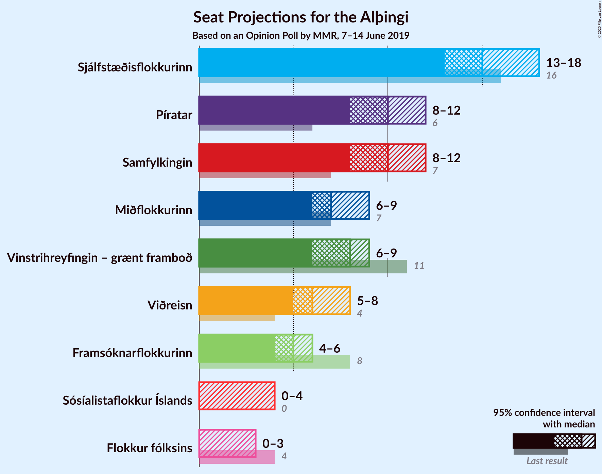
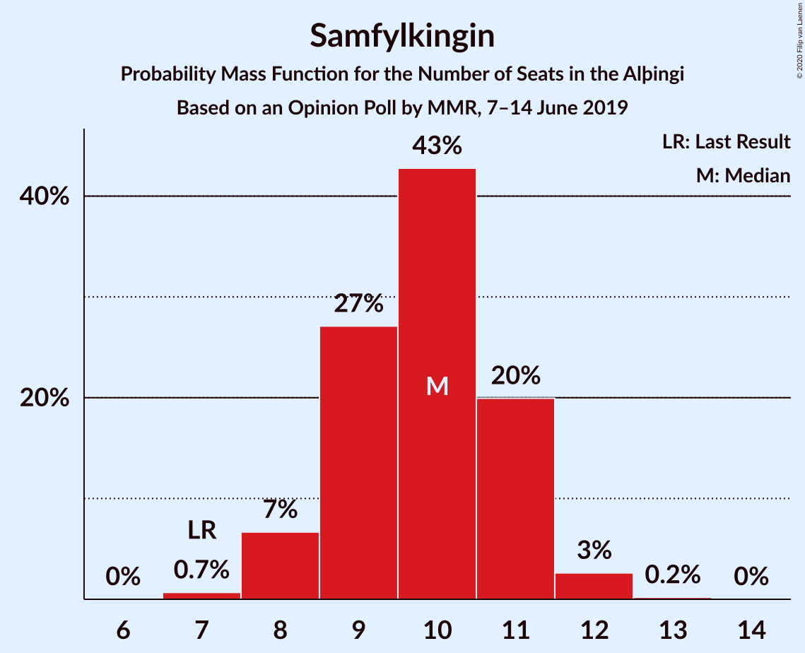
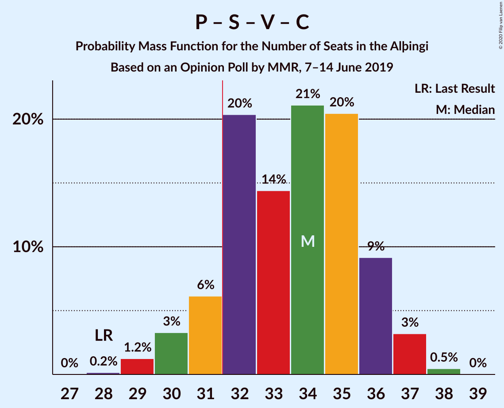

# Opinion Poll by MMR, 7–14 June 2019

<a href="#voting-intentions">Voting Intentions</a> | <a href="#seats">Seats</a> | <a href="#coalitions">Coalitions</a> | <a href="#technical-information">Technical Information</a>

## Voting Intentions

### Confidence Intervals

| Party | Last Result | Poll Result | 80% Confidence Interval | 90% Confidence Interval | 95% Confidence Interval | 99% Confidence Interval |
|:-----:|:-----------:|:-----------:|:-----------------------:|:-----------------------:|:-----------------------:|:-----------------------:|
| Sjálfstæðisflokkurinn | 25.2% | 22.2% | 20.5–23.9% |20.1–24.4% |19.7–24.9% |18.9–25.7% |
| Samfylkingin | 12.1% | 14.4% | 13.0–15.9% |12.7–16.3% |12.3–16.7% |11.7–17.5% |
| Píratar | 9.2% | 14.4% | 13.0–15.9% |12.7–16.3% |12.3–16.7% |11.7–17.5% |
| Vinstrihreyfingin – grænt framboð | 16.9% | 11.3% | 10.1–12.7% |9.8–13.1% |9.5–13.5% |9.0–14.2% |
| Miðflokkurinn | 10.9% | 10.6% | 9.5–12.0% |9.1–12.4% |8.9–12.7% |8.3–13.4% |
| Viðreisn | 6.7% | 9.5% | 8.4–10.8% |8.1–11.2% |7.8–11.5% |7.3–12.2% |
| Framsóknarflokkurinn | 10.7% | 7.7% | 6.7–8.9% |6.4–9.2% |6.2–9.5% |5.7–10.1% |
| Sósíalistaflokkur Íslands | 0.0% | 4.5% | 3.7–5.4% |3.5–5.7% |3.3–5.9% |3.0–6.4% |
| Flokkur fólksins | 6.9% | 4.3% | 3.5–5.2% |3.3–5.5% |3.2–5.7% |2.8–6.2% |

*Note:* The poll result column reflects the actual value used in the calculations. Published results may vary slightly, and in addition be rounded to fewer digits.

## Seats

### Confidence Intervals

| Party | Last Result | Median | 80% Confidence Interval | 90% Confidence Interval | 95% Confidence Interval | 99% Confidence Interval |
|:-----:|:-----------:|:------:|:-----------------------:|:-----------------------:|:-----------------------:|:-----------------------:|
| <a href="#sjálfstæðisflokkurinn">Sjálfstæðisflokkurinn</a> | 16 | 15 | 14–17 |14–18 |14–18 |13–18 |
| <a href="#samfylkingin">Samfylkingin</a> | 7 | 10 | 9–11 |8–11 |8–12 |8–12 |
| <a href="#píratar">Píratar</a> | 6 | 10 | 8–12 |8–12 |8–12 |8–13 |
| <a href="#vinstrihreyfingin-–-grænt-framboð">Vinstrihreyfingin – grænt framboð</a> | 11 | 7 | 6–9 |6–9 |6–10 |6–10 |
| <a href="#miðflokkurinn">Miðflokkurinn</a> | 7 | 7 | 6–9 |6–9 |6–9 |5–10 |
| <a href="#viðreisn">Viðreisn</a> | 4 | 6 | 5–8 |5–8 |5–8 |5–8 |
| <a href="#framsóknarflokkurinn">Framsóknarflokkurinn</a> | 8 | 5 | 4–6 |4–6 |4–7 |3–7 |
| <a href="#sósíalistaflokkur-íslands">Sósíalistaflokkur Íslands</a> | 0 | 0 | 0–3 |0–3 |0–4 |0–4 |
| <a href="#flokkur-fólksins">Flokkur fólksins</a> | 4 | 0 | 0–3 |0–3 |0–3 |0–4 |

### Sjálfstæðisflokkurinn

*For a full overview of the results for this party, see the [Sjálfstæðisflokkurinn](party-sjálfstæðisflokkurinn.html) page.*

| Number of Seats | Probability | Accumulated | Special Marks |
|:---------------:|:-----------:|:-----------:|:-------------:|
| 12 | 0.1% | 100% |  |
| 13 | 2% | 99.9% |  |
| 14 | 11% | 98% |  |
| 15 | 50% | 88% | Median |
| 16 | 25% | 38% | Last Result |
| 17 | 6% | 14% |  |
| 18 | 8% | 8% |  |
| 19 | 0.1% | 0.2% |  |
| 20 | 0% | 0.1% |  |
| 21 | 0% | 0% |  |

### Samfylkingin

*For a full overview of the results for this party, see the [Samfylkingin](party-samfylkingin.html) page.*

| Number of Seats | Probability | Accumulated | Special Marks |
|:---------------:|:-----------:|:-----------:|:-------------:|
| 7 | 0.3% | 100% | Last Result |
| 8 | 7% | 99.6% |  |
| 9 | 22% | 93% |  |
| 10 | 50% | 70% | Median |
| 11 | 18% | 21% |  |
| 12 | 3% | 3% |  |
| 13 | 0.4% | 0.4% |  |
| 14 | 0% | 0% |  |

### Píratar

*For a full overview of the results for this party, see the [Píratar](party-píratar.html) page.*

| Number of Seats | Probability | Accumulated | Special Marks |
|:---------------:|:-----------:|:-----------:|:-------------:|
| 6 | 0% | 100% | Last Result |
| 7 | 0.3% | 100% |  |
| 8 | 13% | 99.7% |  |
| 9 | 18% | 87% |  |
| 10 | 23% | 69% | Median |
| 11 | 35% | 46% |  |
| 12 | 10% | 11% |  |
| 13 | 0.5% | 0.5% |  |
| 14 | 0% | 0% |  |

### Vinstrihreyfingin – grænt framboð

*For a full overview of the results for this party, see the [Vinstrihreyfingin – grænt framboð](party-vinstrihreyfingin–græntframboð.html) page.*

| Number of Seats | Probability | Accumulated | Special Marks |
|:---------------:|:-----------:|:-----------:|:-------------:|
| 5 | 0.2% | 100% |  |
| 6 | 12% | 99.8% |  |
| 7 | 56% | 87% | Median |
| 8 | 18% | 32% |  |
| 9 | 10% | 14% |  |
| 10 | 4% | 4% |  |
| 11 | 0% | 0% | Last Result |

### Miðflokkurinn

*For a full overview of the results for this party, see the [Miðflokkurinn](party-miðflokkurinn.html) page.*

| Number of Seats | Probability | Accumulated | Special Marks |
|:---------------:|:-----------:|:-----------:|:-------------:|
| 5 | 2% | 100% |  |
| 6 | 22% | 98% |  |
| 7 | 40% | 76% | Last Result, Median |
| 8 | 17% | 35% |  |
| 9 | 18% | 19% |  |
| 10 | 1.0% | 1.0% |  |
| 11 | 0% | 0% |  |

### Viðreisn

*For a full overview of the results for this party, see the [Viðreisn](party-viðreisn.html) page.*

| Number of Seats | Probability | Accumulated | Special Marks |
|:---------------:|:-----------:|:-----------:|:-------------:|
| 4 | 0.2% | 100% | Last Result |
| 5 | 11% | 99.8% |  |
| 6 | 42% | 89% | Median |
| 7 | 23% | 48% |  |
| 8 | 24% | 24% |  |
| 9 | 0.3% | 0.3% |  |
| 10 | 0% | 0% |  |

### Framsóknarflokkurinn

*For a full overview of the results for this party, see the [Framsóknarflokkurinn](party-framsóknarflokkurinn.html) page.*

| Number of Seats | Probability | Accumulated | Special Marks |
|:---------------:|:-----------:|:-----------:|:-------------:|
| 3 | 0.5% | 100% |  |
| 4 | 19% | 99.5% |  |
| 5 | 57% | 80% | Median |
| 6 | 19% | 23% |  |
| 7 | 3% | 3% |  |
| 8 | 0% | 0% | Last Result |

### Sósíalistaflokkur Íslands

*For a full overview of the results for this party, see the [Sósíalistaflokkur Íslands](party-sósíalistaflokkuríslands.html) page.*

| Number of Seats | Probability | Accumulated | Special Marks |
|:---------------:|:-----------:|:-----------:|:-------------:|
| 0 | 71% | 100% | Last Result, Median |
| 1 | 6% | 29% |  |
| 2 | 0% | 23% |  |
| 3 | 19% | 23% |  |
| 4 | 4% | 4% |  |
| 5 | 0% | 0% |  |

### Flokkur fólksins

*For a full overview of the results for this party, see the [Flokkur fólksins](party-flokkurfólksins.html) page.*

| Number of Seats | Probability | Accumulated | Special Marks |
|:---------------:|:-----------:|:-----------:|:-------------:|
| 0 | 85% | 100% | Median |
| 1 | 3% | 15% |  |
| 2 | 0% | 12% |  |
| 3 | 10% | 12% |  |
| 4 | 2% | 2% | Last Result |
| 5 | 0% | 0% |  |

## Coalitions

### Confidence Intervals

| Coalition | Last Result | Median | Majority? | 80% Confidence Interval | 90% Confidence Interval | 95% Confidence Interval | 99% Confidence Interval |
|:---------:|:-----------:|:------:|:---------:|:-----------------------:|:-----------------------:|:-----------------------:|:-----------------------:|
| Píratar – Samfylkingin – Vinstrihreyfingin – grænt framboð – Viðreisn | 28 | 34 | 86% | 31–36 | 30–36 | 30–36 | 29–37 |
| Samfylkingin – Vinstrihreyfingin – grænt framboð – Miðflokkurinn – Framsóknarflokkurinn | 33 | 29 | 8% | 28–31 | 28–32 | 28–33 | 26–34 |
| Sjálfstæðisflokkurinn – Miðflokkurinn – Framsóknarflokkurinn | 31 | 27 | 0.8% | 26–30 | 26–30 | 26–31 | 25–33 |
| Sjálfstæðisflokkurinn – Vinstrihreyfingin – grænt framboð – Framsóknarflokkurinn | 35 | 28 | 0.8% | 26–30 | 26–31 | 26–31 | 25–32 |
| Píratar – Samfylkingin – Vinstrihreyfingin – grænt framboð | 24 | 28 | 0.1% | 25–29 | 24–30 | 24–30 | 23–31 |
| Sjálfstæðisflokkurinn – Samfylkingin | 23 | 25 | 0% | 24–27 | 23–27 | 22–28 | 22–29 |
| Samfylkingin – Vinstrihreyfingin – grænt framboð – Miðflokkurinn | 25 | 24 | 0% | 23–26 | 23–27 | 22–27 | 22–28 |
| Sjálfstæðisflokkurinn – Miðflokkurinn | 23 | 22 | 0% | 21–25 | 21–25 | 21–25 | 20–27 |
| Sjálfstæðisflokkurinn – Vinstrihreyfingin – grænt framboð | 27 | 22 | 0% | 21–25 | 21–25 | 21–25 | 20–26 |
| Samfylkingin – Vinstrihreyfingin – grænt framboð – Framsóknarflokkurinn | 26 | 22 | 0% | 21–24 | 20–25 | 20–25 | 19–26 |
| Sjálfstæðisflokkurinn – Viðreisn | 20 | 22 | 0% | 20–24 | 20–24 | 20–25 | 19–25 |
| Sjálfstæðisflokkurinn – Framsóknarflokkurinn | 24 | 20 | 0% | 19–23 | 19–23 | 19–24 | 18–24 |
| Vinstrihreyfingin – grænt framboð – Miðflokkurinn – Framsóknarflokkurinn | 26 | 19 | 0% | 18–22 | 18–23 | 17–23 | 17–24 |
| Píratar – Vinstrihreyfingin – grænt framboð | 17 | 18 | 0% | 15–19 | 15–20 | 15–20 | 14–21 |
| Samfylkingin – Vinstrihreyfingin – grænt framboð | 18 | 17 | 0% | 16–19 | 16–19 | 15–20 | 15–20 |
| Vinstrihreyfingin – grænt framboð – Miðflokkurinn | 18 | 14 | 0% | 13–17 | 13–17 | 13–18 | 12–18 |
| Vinstrihreyfingin – grænt framboð – Framsóknarflokkurinn | 19 | 12 | 0% | 11–14 | 11–15 | 10–15 | 10–15 |

### Píratar – Samfylkingin – Vinstrihreyfingin – grænt framboð – Viðreisn

| Number of Seats | Probability | Accumulated | Special Marks |
|:---------------:|:-----------:|:-----------:|:-------------:|
| 28 | 0.4% | 100% | Last Result |
| 29 | 0.4% | 99.6% |  |
| 30 | 8% | 99.2% |  |
| 31 | 6% | 92% |  |
| 32 | 9% | 86% | Majority |
| 33 | 14% | 76% | Median |
| 34 | 14% | 63% |  |
| 35 | 15% | 48% |  |
| 36 | 31% | 33% |  |
| 37 | 1.4% | 2% |  |
| 38 | 0.2% | 0.3% |  |
| 39 | 0% | 0% |  |

### Samfylkingin – Vinstrihreyfingin – grænt framboð – Miðflokkurinn – Framsóknarflokkurinn

| Number of Seats | Probability | Accumulated | Special Marks |
|:---------------:|:-----------:|:-----------:|:-------------:|
| 25 | 0.1% | 100% |  |
| 26 | 0.5% | 99.8% |  |
| 27 | 2% | 99.4% |  |
| 28 | 17% | 98% |  |
| 29 | 38% | 81% | Median |
| 30 | 17% | 43% |  |
| 31 | 17% | 25% |  |
| 32 | 5% | 8% | Majority |
| 33 | 3% | 3% | Last Result |
| 34 | 0.2% | 0.6% |  |
| 35 | 0.3% | 0.3% |  |
| 36 | 0% | 0% |  |

### Sjálfstæðisflokkurinn – Miðflokkurinn – Framsóknarflokkurinn

| Number of Seats | Probability | Accumulated | Special Marks |
|:---------------:|:-----------:|:-----------:|:-------------:|
| 23 | 0% | 100% |  |
| 24 | 0.3% | 99.9% |  |
| 25 | 1.4% | 99.6% |  |
| 26 | 12% | 98% |  |
| 27 | 40% | 86% | Median |
| 28 | 16% | 46% |  |
| 29 | 14% | 30% |  |
| 30 | 12% | 16% |  |
| 31 | 3% | 4% | Last Result |
| 32 | 0.2% | 0.8% | Majority |
| 33 | 0.7% | 0.7% |  |
| 34 | 0% | 0% |  |

### Sjálfstæðisflokkurinn – Vinstrihreyfingin – grænt framboð – Framsóknarflokkurinn

| Number of Seats | Probability | Accumulated | Special Marks |
|:---------------:|:-----------:|:-----------:|:-------------:|
| 24 | 0.4% | 100% |  |
| 25 | 2% | 99.6% |  |
| 26 | 12% | 98% |  |
| 27 | 34% | 86% | Median |
| 28 | 23% | 52% |  |
| 29 | 11% | 29% |  |
| 30 | 13% | 18% |  |
| 31 | 5% | 5% |  |
| 32 | 0.7% | 0.8% | Majority |
| 33 | 0.1% | 0.1% |  |
| 34 | 0% | 0% |  |
| 35 | 0% | 0% | Last Result |

### Píratar – Samfylkingin – Vinstrihreyfingin – grænt framboð

| Number of Seats | Probability | Accumulated | Special Marks |
|:---------------:|:-----------:|:-----------:|:-------------:|
| 22 | 0.1% | 100% |  |
| 23 | 0.6% | 99.9% |  |
| 24 | 7% | 99.3% | Last Result |
| 25 | 9% | 92% |  |
| 26 | 12% | 83% |  |
| 27 | 15% | 71% | Median |
| 28 | 29% | 56% |  |
| 29 | 19% | 27% |  |
| 30 | 7% | 8% |  |
| 31 | 1.2% | 1.3% |  |
| 32 | 0% | 0.1% | Majority |
| 33 | 0% | 0% |  |

### Sjálfstæðisflokkurinn – Samfylkingin

| Number of Seats | Probability | Accumulated | Special Marks |
|:---------------:|:-----------:|:-----------:|:-------------:|
| 21 | 0.2% | 100% |  |
| 22 | 4% | 99.8% |  |
| 23 | 5% | 96% | Last Result |
| 24 | 11% | 91% |  |
| 25 | 38% | 80% | Median |
| 26 | 23% | 42% |  |
| 27 | 14% | 19% |  |
| 28 | 4% | 5% |  |
| 29 | 0.7% | 0.9% |  |
| 30 | 0.1% | 0.1% |  |
| 31 | 0% | 0% |  |

### Samfylkingin – Vinstrihreyfingin – grænt framboð – Miðflokkurinn

| Number of Seats | Probability | Accumulated | Special Marks |
|:---------------:|:-----------:|:-----------:|:-------------:|
| 20 | 0.1% | 100% |  |
| 21 | 0.4% | 99.9% |  |
| 22 | 4% | 99.5% |  |
| 23 | 19% | 96% |  |
| 24 | 32% | 77% | Median |
| 25 | 22% | 45% | Last Result |
| 26 | 15% | 24% |  |
| 27 | 6% | 9% |  |
| 28 | 2% | 2% |  |
| 29 | 0.1% | 0.1% |  |
| 30 | 0% | 0% |  |

### Sjálfstæðisflokkurinn – Miðflokkurinn

| Number of Seats | Probability | Accumulated | Special Marks |
|:---------------:|:-----------:|:-----------:|:-------------:|
| 19 | 0.2% | 100% |  |
| 20 | 2% | 99.8% |  |
| 21 | 9% | 98% |  |
| 22 | 43% | 89% | Median |
| 23 | 21% | 46% | Last Result |
| 24 | 10% | 25% |  |
| 25 | 13% | 15% |  |
| 26 | 1.4% | 2% |  |
| 27 | 0.8% | 0.9% |  |
| 28 | 0% | 0% |  |

### Sjálfstæðisflokkurinn – Vinstrihreyfingin – grænt framboð

| Number of Seats | Probability | Accumulated | Special Marks |
|:---------------:|:-----------:|:-----------:|:-------------:|
| 19 | 0.1% | 100% |  |
| 20 | 2% | 99.9% |  |
| 21 | 9% | 98% |  |
| 22 | 42% | 90% | Median |
| 23 | 18% | 48% |  |
| 24 | 14% | 30% |  |
| 25 | 14% | 16% |  |
| 26 | 2% | 2% |  |
| 27 | 0.2% | 0.3% | Last Result |
| 28 | 0% | 0.1% |  |
| 29 | 0% | 0% |  |

### Samfylkingin – Vinstrihreyfingin – grænt framboð – Framsóknarflokkurinn

| Number of Seats | Probability | Accumulated | Special Marks |
|:---------------:|:-----------:|:-----------:|:-------------:|
| 18 | 0.2% | 100% |  |
| 19 | 2% | 99.8% |  |
| 20 | 5% | 98% |  |
| 21 | 14% | 93% |  |
| 22 | 40% | 78% | Median |
| 23 | 22% | 38% |  |
| 24 | 9% | 16% |  |
| 25 | 6% | 6% |  |
| 26 | 0.6% | 0.7% | Last Result |
| 27 | 0.1% | 0.1% |  |
| 28 | 0% | 0% |  |

### Sjálfstæðisflokkurinn – Viðreisn

| Number of Seats | Probability | Accumulated | Special Marks |
|:---------------:|:-----------:|:-----------:|:-------------:|
| 18 | 0.1% | 100% |  |
| 19 | 2% | 99.9% |  |
| 20 | 14% | 98% | Last Result |
| 21 | 16% | 85% | Median |
| 22 | 26% | 69% |  |
| 23 | 33% | 43% |  |
| 24 | 8% | 10% |  |
| 25 | 2% | 3% |  |
| 26 | 0.1% | 0.2% |  |
| 27 | 0% | 0% |  |

### Sjálfstæðisflokkurinn – Framsóknarflokkurinn

| Number of Seats | Probability | Accumulated | Special Marks |
|:---------------:|:-----------:|:-----------:|:-------------:|
| 17 | 0.2% | 100% |  |
| 18 | 2% | 99.7% |  |
| 19 | 12% | 98% |  |
| 20 | 49% | 85% | Median |
| 21 | 18% | 36% |  |
| 22 | 6% | 18% |  |
| 23 | 9% | 12% |  |
| 24 | 3% | 3% | Last Result |
| 25 | 0% | 0% |  |

### Vinstrihreyfingin – grænt framboð – Miðflokkurinn – Framsóknarflokkurinn

| Number of Seats | Probability | Accumulated | Special Marks |
|:---------------:|:-----------:|:-----------:|:-------------:|
| 16 | 0.2% | 100% |  |
| 17 | 2% | 99.8% |  |
| 18 | 13% | 97% |  |
| 19 | 42% | 85% | Median |
| 20 | 16% | 42% |  |
| 21 | 14% | 26% |  |
| 22 | 4% | 12% |  |
| 23 | 7% | 8% |  |
| 24 | 0.5% | 0.5% |  |
| 25 | 0% | 0% |  |
| 26 | 0% | 0% | Last Result |

### Píratar – Vinstrihreyfingin – grænt framboð

| Number of Seats | Probability | Accumulated | Special Marks |
|:---------------:|:-----------:|:-----------:|:-------------:|
| 13 | 0.2% | 100% |  |
| 14 | 0.7% | 99.8% |  |
| 15 | 10% | 99.1% |  |
| 16 | 14% | 89% |  |
| 17 | 18% | 75% | Last Result, Median |
| 18 | 33% | 57% |  |
| 19 | 19% | 24% |  |
| 20 | 3% | 5% |  |
| 21 | 2% | 2% |  |
| 22 | 0% | 0% |  |

### Samfylkingin – Vinstrihreyfingin – grænt framboð

| Number of Seats | Probability | Accumulated | Special Marks |
|:---------------:|:-----------:|:-----------:|:-------------:|
| 13 | 0.1% | 100% |  |
| 14 | 0.2% | 99.9% |  |
| 15 | 4% | 99.7% |  |
| 16 | 23% | 95% |  |
| 17 | 39% | 73% | Median |
| 18 | 14% | 33% | Last Result |
| 19 | 17% | 20% |  |
| 20 | 3% | 3% |  |
| 21 | 0.3% | 0.4% |  |
| 22 | 0.1% | 0.1% |  |
| 23 | 0% | 0% |  |

### Vinstrihreyfingin – grænt framboð – Miðflokkurinn

| Number of Seats | Probability | Accumulated | Special Marks |
|:---------------:|:-----------:|:-----------:|:-------------:|
| 11 | 0.1% | 100% |  |
| 12 | 2% | 99.9% |  |
| 13 | 15% | 98% |  |
| 14 | 39% | 83% | Median |
| 15 | 19% | 44% |  |
| 16 | 14% | 25% |  |
| 17 | 7% | 11% |  |
| 18 | 4% | 4% | Last Result |
| 19 | 0.2% | 0.2% |  |
| 20 | 0% | 0% |  |

### Vinstrihreyfingin – grænt framboð – Framsóknarflokkurinn

| Number of Seats | Probability | Accumulated | Special Marks |
|:---------------:|:-----------:|:-----------:|:-------------:|
| 10 | 3% | 100% |  |
| 11 | 12% | 97% |  |
| 12 | 50% | 84% | Median |
| 13 | 14% | 34% |  |
| 14 | 15% | 21% |  |
| 15 | 6% | 6% |  |
| 16 | 0.2% | 0.2% |  |
| 17 | 0% | 0% |  |
| 18 | 0% | 0% |  |
| 19 | 0% | 0% | Last Result |

## Technical Information

### Opinion Poll

+ **Polling firm:** MMR
+ **Commissioner(s):** —
+ **Fieldwork period:** 7–14 June 2019

### Calculations

+ **Sample size:** 988
+ **Simulations done:** 131,072
+ **Error estimate:** 2.88%

