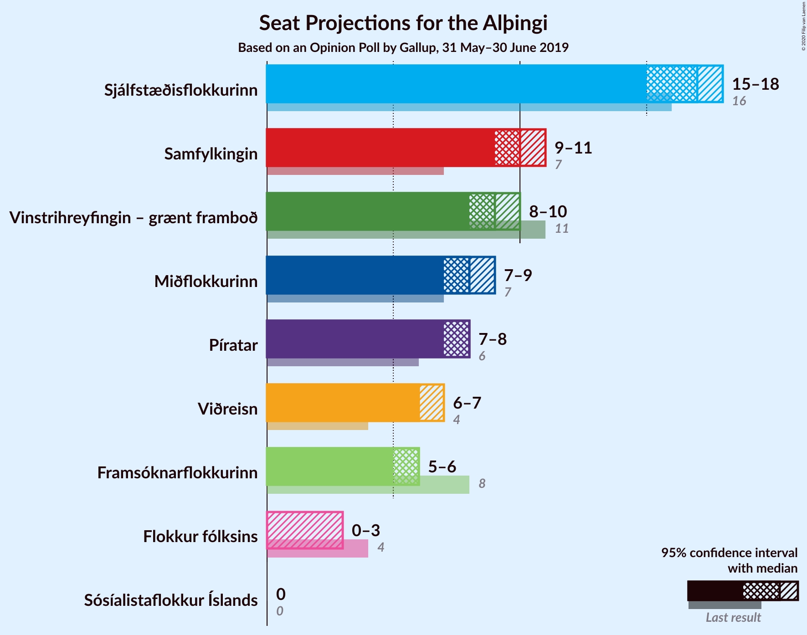
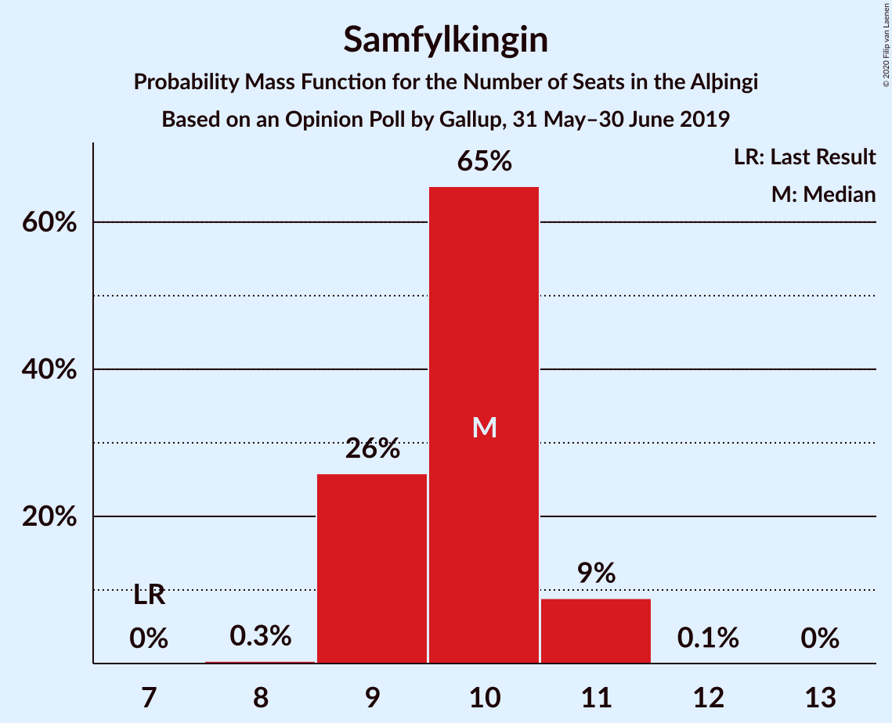
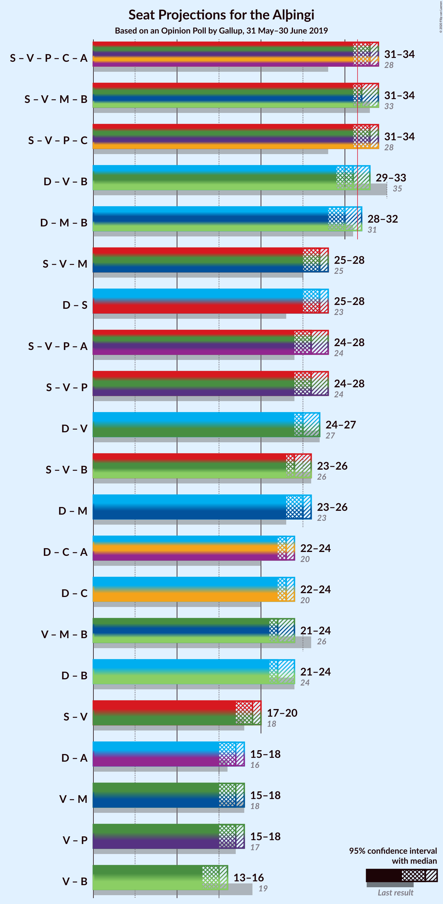
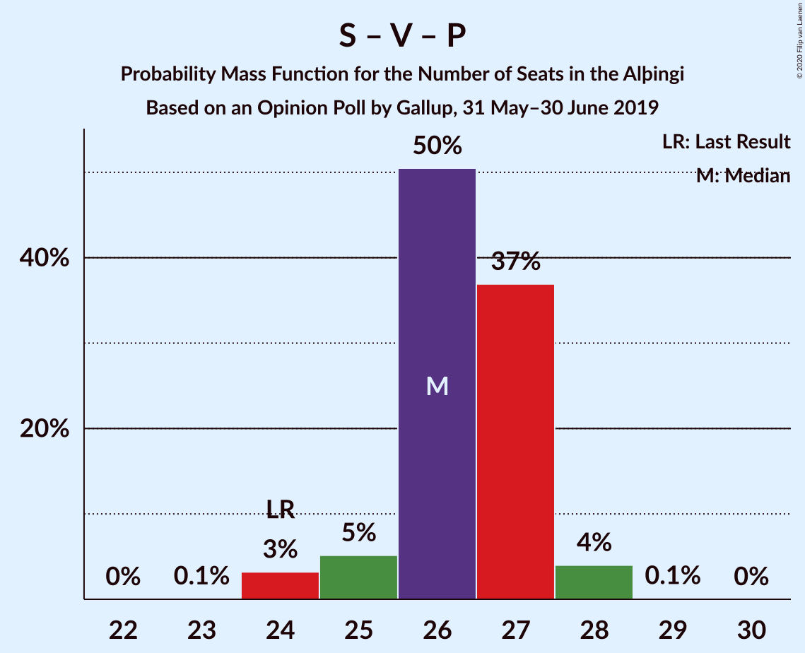
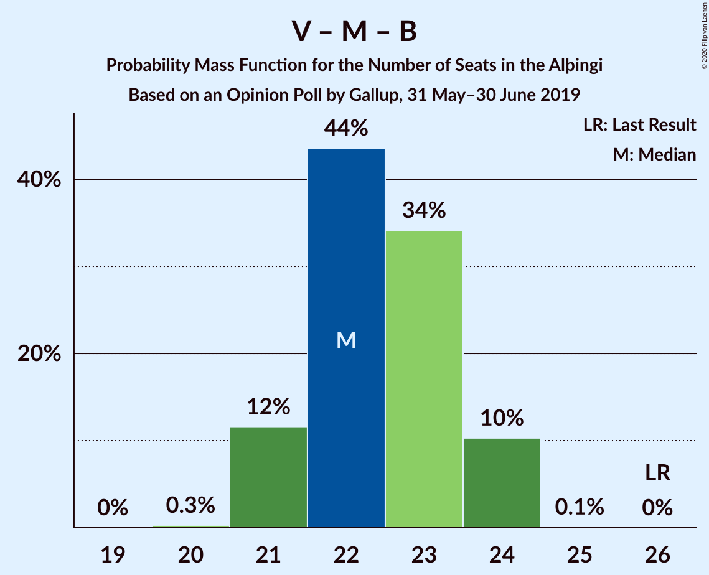

# Opinion Poll by Gallup, 31 May–30 June 2019

<a href="#voting-intentions">Voting Intentions</a> | <a href="#seats">Seats</a> | <a href="#coalitions">Coalitions</a> | <a href="#technical-information">Technical Information</a>

## Voting Intentions

### Confidence Intervals

| Party | Last Result | Poll Result | 80% Confidence Interval | 90% Confidence Interval | 95% Confidence Interval | 99% Confidence Interval |
|:-----:|:-----------:|:-----------:|:-----------------------:|:-----------------------:|:-----------------------:|:-----------------------:|
| Sjálfstæðisflokkurinn | 25.2% | 23.7% | 22.7–24.7% |22.5–25.0% |22.2–25.2% |21.8–25.7% |
| Samfylkingin | 12.1% | 14.7% | 13.9–15.5% |13.7–15.8% |13.5–16.0% |13.1–16.4% |
| Vinstrihreyfingin – grænt framboð | 16.9% | 13.0% | 12.3–13.8% |12.0–14.0% |11.9–14.2% |11.5–14.6% |
| Miðflokkurinn | 10.9% | 11.4% | 10.7–12.2% |10.5–12.4% |10.3–12.6% |10.0–12.9% |
| Píratar | 9.2% | 11.3% | 10.6–12.1% |10.4–12.3% |10.2–12.5% |9.9–12.8% |
| Viðreisn | 6.7% | 10.1% | 9.4–10.8% |9.2–11.0% |9.1–11.2% |8.8–11.5% |
| Framsóknarflokkurinn | 10.7% | 8.6% | 8.0–9.3% |7.8–9.4% |7.7–9.6% |7.4–10.0% |
| Flokkur fólksins | 6.9% | 4.2% | 3.8–4.7% |3.7–4.8% |3.6–5.0% |3.4–5.2% |
| Sósíalistaflokkur Íslands | 0.0% | 3.0% | 2.6–3.4% |2.5–3.6% |2.5–3.7% |2.3–3.9% |

*Note:* The poll result column reflects the actual value used in the calculations. Published results may vary slightly, and in addition be rounded to fewer digits.

## Seats

### Confidence Intervals

| Party | Last Result | Median | 80% Confidence Interval | 90% Confidence Interval | 95% Confidence Interval | 99% Confidence Interval |
|:-----:|:-----------:|:------:|:-----------------------:|:-----------------------:|:-----------------------:|:-----------------------:|
| <a href="#sjálfstæðisflokkurinn">Sjálfstæðisflokkurinn</a> | 16 | 17 | 16–17 |16–18 |15–18 |15–18 |
| <a href="#samfylkingin">Samfylkingin</a> | 7 | 10 | 9–10 |9–11 |9–11 |9–11 |
| <a href="#vinstrihreyfingin-–-grænt-framboð">Vinstrihreyfingin – grænt framboð</a> | 11 | 9 | 8–9 |8–10 |8–10 |8–10 |
| <a href="#miðflokkurinn">Miðflokkurinn</a> | 7 | 8 | 7–9 |7–9 |7–9 |7–10 |
| <a href="#píratar">Píratar</a> | 6 | 8 | 7–8 |7–8 |7–8 |6–9 |
| <a href="#viðreisn">Viðreisn</a> | 4 | 6 | 6–7 |6–7 |6–7 |6–8 |
| <a href="#framsóknarflokkurinn">Framsóknarflokkurinn</a> | 8 | 6 | 5–6 |5–6 |5–6 |5–7 |
| <a href="#flokkur-fólksins">Flokkur fólksins</a> | 4 | 0 | 0 |0 |0–3 |0–3 |
| <a href="#sósíalistaflokkur-íslands">Sósíalistaflokkur Íslands</a> | 0 | 0 | 0 |0 |0 |0 |

### Sjálfstæðisflokkurinn

*For a full overview of the results for this party, see the [Sjálfstæðisflokkurinn](party-sjálfstæðisflokkurinn.html) page.*

| Number of Seats | Probability | Accumulated | Special Marks |
|:---------------:|:-----------:|:-----------:|:-------------:|
| 14 | 0.1% | 100% |  |
| 15 | 4% | 99.9% |  |
| 16 | 35% | 96% | Last Result |
| 17 | 53% | 61% | Median |
| 18 | 8% | 8% |  |
| 19 | 0% | 0% |  |

### Samfylkingin

*For a full overview of the results for this party, see the [Samfylkingin](party-samfylkingin.html) page.*

| Number of Seats | Probability | Accumulated | Special Marks |
|:---------------:|:-----------:|:-----------:|:-------------:|
| 7 | 0% | 100% | Last Result |
| 8 | 0.3% | 100% |  |
| 9 | 26% | 99.7% |  |
| 10 | 65% | 74% | Median |
| 11 | 9% | 9% |  |
| 12 | 0.1% | 0.1% |  |
| 13 | 0% | 0% |  |

### Vinstrihreyfingin – grænt framboð

*For a full overview of the results for this party, see the [Vinstrihreyfingin – grænt framboð](party-vinstrihreyfingin–græntframboð.html) page.*

| Number of Seats | Probability | Accumulated | Special Marks |
|:---------------:|:-----------:|:-----------:|:-------------:|
| 7 | 0.4% | 100% |  |
| 8 | 23% | 99.6% |  |
| 9 | 71% | 76% | Median |
| 10 | 5% | 5% |  |
| 11 | 0% | 0% | Last Result |

### Miðflokkurinn

*For a full overview of the results for this party, see the [Miðflokkurinn](party-miðflokkurinn.html) page.*

| Number of Seats | Probability | Accumulated | Special Marks |
|:---------------:|:-----------:|:-----------:|:-------------:|
| 6 | 0.1% | 100% |  |
| 7 | 24% | 99.9% | Last Result |
| 8 | 61% | 76% | Median |
| 9 | 13% | 15% |  |
| 10 | 1.4% | 1.4% |  |
| 11 | 0% | 0% |  |

### Píratar

*For a full overview of the results for this party, see the [Píratar](party-píratar.html) page.*

| Number of Seats | Probability | Accumulated | Special Marks |
|:---------------:|:-----------:|:-----------:|:-------------:|
| 6 | 0.5% | 100% | Last Result |
| 7 | 31% | 99.5% |  |
| 8 | 66% | 68% | Median |
| 9 | 2% | 2% |  |
| 10 | 0% | 0% |  |

### Viðreisn

*For a full overview of the results for this party, see the [Viðreisn](party-viðreisn.html) page.*

| Number of Seats | Probability | Accumulated | Special Marks |
|:---------------:|:-----------:|:-----------:|:-------------:|
| 4 | 0% | 100% | Last Result |
| 5 | 0.1% | 100% |  |
| 6 | 69% | 99.9% | Median |
| 7 | 29% | 31% |  |
| 8 | 2% | 2% |  |
| 9 | 0% | 0% |  |

### Framsóknarflokkurinn

*For a full overview of the results for this party, see the [Framsóknarflokkurinn](party-framsóknarflokkurinn.html) page.*

| Number of Seats | Probability | Accumulated | Special Marks |
|:---------------:|:-----------:|:-----------:|:-------------:|
| 4 | 0.1% | 100% |  |
| 5 | 31% | 99.9% |  |
| 6 | 68% | 69% | Median |
| 7 | 1.3% | 1.3% |  |
| 8 | 0% | 0% | Last Result |

### Flokkur fólksins

*For a full overview of the results for this party, see the [Flokkur fólksins](party-flokkurfólksins.html) page.*

| Number of Seats | Probability | Accumulated | Special Marks |
|:---------------:|:-----------:|:-----------:|:-------------:|
| 0 | 97% | 100% | Median |
| 1 | 0% | 3% |  |
| 2 | 0% | 3% |  |
| 3 | 3% | 3% |  |
| 4 | 0% | 0% | Last Result |

### Sósíalistaflokkur Íslands

*For a full overview of the results for this party, see the [Sósíalistaflokkur Íslands](party-sósíalistaflokkuríslands.html) page.*

| Number of Seats | Probability | Accumulated | Special Marks |
|:---------------:|:-----------:|:-----------:|:-------------:|
| 0 | 100% | 100% | Last Result, Median |

## Coalitions

### Confidence Intervals

| Coalition | Last Result | Median | Majority? | 80% Confidence Interval | 90% Confidence Interval | 95% Confidence Interval | 99% Confidence Interval |
|:---------:|:-----------:|:------:|:---------:|:-----------------------:|:-----------------------:|:-----------------------:|:-----------------------:|
| Samfylkingin – Vinstrihreyfingin – grænt framboð – Miðflokkurinn – Framsóknarflokkurinn | 33 | 32 | 81% | 31–33 | 31–33 | 31–34 | 30–34 |
| Samfylkingin – Vinstrihreyfingin – grænt framboð – Píratar – Viðreisn | 28 | 33 | 95% | 32–33 | 32–34 | 31–34 | 30–35 |
| Sjálfstæðisflokkurinn – Vinstrihreyfingin – grænt framboð – Framsóknarflokkurinn | 35 | 31 | 23% | 30–32 | 30–33 | 29–33 | 28–33 |
| Sjálfstæðisflokkurinn – Miðflokkurinn – Framsóknarflokkurinn | 31 | 30 | 3% | 29–31 | 29–31 | 28–32 | 28–32 |
| Samfylkingin – Vinstrihreyfingin – grænt framboð – Miðflokkurinn | 25 | 27 | 0% | 25–27 | 25–28 | 25–28 | 25–28 |
| Sjálfstæðisflokkurinn – Samfylkingin | 23 | 27 | 0% | 25–27 | 25–28 | 25–28 | 24–28 |
| Samfylkingin – Vinstrihreyfingin – grænt framboð – Píratar | 24 | 26 | 0% | 26–27 | 25–27 | 24–28 | 24–28 |
| Sjálfstæðisflokkurinn – Vinstrihreyfingin – grænt framboð | 27 | 25 | 0% | 25–26 | 24–27 | 24–27 | 23–27 |
| Samfylkingin – Vinstrihreyfingin – grænt framboð – Framsóknarflokkurinn | 26 | 24 | 0% | 24–25 | 23–26 | 23–26 | 22–26 |
| Sjálfstæðisflokkurinn – Miðflokkurinn | 23 | 25 | 0% | 24–25 | 23–26 | 23–26 | 22–26 |
| Sjálfstæðisflokkurinn – Viðreisn | 20 | 23 | 0% | 22–24 | 22–24 | 22–24 | 21–25 |
| Vinstrihreyfingin – grænt framboð – Miðflokkurinn – Framsóknarflokkurinn | 26 | 22 | 0% | 21–24 | 21–24 | 21–24 | 21–24 |
| Sjálfstæðisflokkurinn – Framsóknarflokkurinn | 24 | 22 | 0% | 22–23 | 21–24 | 21–24 | 20–24 |
| Samfylkingin – Vinstrihreyfingin – grænt framboð | 18 | 19 | 0% | 18–20 | 18–20 | 17–20 | 17–21 |
| Vinstrihreyfingin – grænt framboð – Miðflokkurinn | 18 | 17 | 0% | 16–18 | 15–18 | 15–18 | 15–18 |
| Vinstrihreyfingin – grænt framboð – Píratar | 17 | 17 | 0% | 16–17 | 15–17 | 15–18 | 15–18 |
| Vinstrihreyfingin – grænt framboð – Framsóknarflokkurinn | 19 | 15 | 0% | 14–15 | 14–15 | 13–16 | 13–16 |

### Samfylkingin – Vinstrihreyfingin – grænt framboð – Miðflokkurinn – Framsóknarflokkurinn

| Number of Seats | Probability | Accumulated | Special Marks |
|:---------------:|:-----------:|:-----------:|:-------------:|
| 30 | 2% | 100% |  |
| 31 | 17% | 98% |  |
| 32 | 39% | 81% | Majority |
| 33 | 40% | 43% | Last Result, Median |
| 34 | 3% | 3% |  |
| 35 | 0.1% | 0.1% |  |
| 36 | 0% | 0% |  |

### Samfylkingin – Vinstrihreyfingin – grænt framboð – Píratar – Viðreisn

| Number of Seats | Probability | Accumulated | Special Marks |
|:---------------:|:-----------:|:-----------:|:-------------:|
| 28 | 0% | 100% | Last Result |
| 29 | 0.1% | 100% |  |
| 30 | 1.1% | 99.9% |  |
| 31 | 3% | 98.8% |  |
| 32 | 34% | 95% | Majority |
| 33 | 52% | 62% | Median |
| 34 | 8% | 9% |  |
| 35 | 2% | 2% |  |
| 36 | 0% | 0% |  |

### Sjálfstæðisflokkurinn – Vinstrihreyfingin – grænt framboð – Framsóknarflokkurinn

| Number of Seats | Probability | Accumulated | Special Marks |
|:---------------:|:-----------:|:-----------:|:-------------:|
| 28 | 0.7% | 100% |  |
| 29 | 3% | 99.3% |  |
| 30 | 8% | 97% |  |
| 31 | 65% | 89% |  |
| 32 | 16% | 23% | Median, Majority |
| 33 | 7% | 7% |  |
| 34 | 0% | 0% |  |
| 35 | 0% | 0% | Last Result |

### Sjálfstæðisflokkurinn – Miðflokkurinn – Framsóknarflokkurinn

| Number of Seats | Probability | Accumulated | Special Marks |
|:---------------:|:-----------:|:-----------:|:-------------:|
| 27 | 0.1% | 100% |  |
| 28 | 2% | 99.8% |  |
| 29 | 8% | 97% |  |
| 30 | 53% | 89% |  |
| 31 | 33% | 36% | Last Result, Median |
| 32 | 3% | 3% | Majority |
| 33 | 0.1% | 0.1% |  |
| 34 | 0% | 0% |  |

### Samfylkingin – Vinstrihreyfingin – grænt framboð – Miðflokkurinn

| Number of Seats | Probability | Accumulated | Special Marks |
|:---------------:|:-----------:|:-----------:|:-------------:|
| 24 | 0.2% | 100% |  |
| 25 | 17% | 99.8% | Last Result |
| 26 | 18% | 83% |  |
| 27 | 58% | 65% | Median |
| 28 | 7% | 7% |  |
| 29 | 0.2% | 0.2% |  |
| 30 | 0% | 0% |  |

### Sjálfstæðisflokkurinn – Samfylkingin

| Number of Seats | Probability | Accumulated | Special Marks |
|:---------------:|:-----------:|:-----------:|:-------------:|
| 23 | 0.2% | 100% | Last Result |
| 24 | 0.3% | 99.7% |  |
| 25 | 17% | 99.4% |  |
| 26 | 23% | 82% |  |
| 27 | 54% | 60% | Median |
| 28 | 6% | 6% |  |
| 29 | 0% | 0% |  |

### Samfylkingin – Vinstrihreyfingin – grænt framboð – Píratar

| Number of Seats | Probability | Accumulated | Special Marks |
|:---------------:|:-----------:|:-----------:|:-------------:|
| 23 | 0.1% | 100% |  |
| 24 | 3% | 99.9% | Last Result |
| 25 | 5% | 97% |  |
| 26 | 50% | 92% |  |
| 27 | 37% | 41% | Median |
| 28 | 4% | 4% |  |
| 29 | 0.1% | 0.1% |  |
| 30 | 0% | 0% |  |

### Sjálfstæðisflokkurinn – Vinstrihreyfingin – grænt framboð

| Number of Seats | Probability | Accumulated | Special Marks |
|:---------------:|:-----------:|:-----------:|:-------------:|
| 23 | 2% | 100% |  |
| 24 | 5% | 98% |  |
| 25 | 48% | 93% |  |
| 26 | 37% | 45% | Median |
| 27 | 8% | 8% | Last Result |
| 28 | 0.1% | 0.1% |  |
| 29 | 0% | 0% |  |

### Samfylkingin – Vinstrihreyfingin – grænt framboð – Framsóknarflokkurinn

| Number of Seats | Probability | Accumulated | Special Marks |
|:---------------:|:-----------:|:-----------:|:-------------:|
| 22 | 2% | 100% |  |
| 23 | 5% | 98% |  |
| 24 | 59% | 93% |  |
| 25 | 26% | 34% | Median |
| 26 | 8% | 8% | Last Result |
| 27 | 0.1% | 0.1% |  |
| 28 | 0% | 0% |  |

### Sjálfstæðisflokkurinn – Miðflokkurinn

| Number of Seats | Probability | Accumulated | Special Marks |
|:---------------:|:-----------:|:-----------:|:-------------:|
| 22 | 1.0% | 100% |  |
| 23 | 6% | 98.9% | Last Result |
| 24 | 34% | 93% |  |
| 25 | 53% | 59% | Median |
| 26 | 5% | 5% |  |
| 27 | 0.4% | 0.4% |  |
| 28 | 0% | 0% |  |

### Sjálfstæðisflokkurinn – Viðreisn

| Number of Seats | Probability | Accumulated | Special Marks |
|:---------------:|:-----------:|:-----------:|:-------------:|
| 20 | 0% | 100% | Last Result |
| 21 | 2% | 100% |  |
| 22 | 25% | 98% |  |
| 23 | 50% | 73% | Median |
| 24 | 22% | 24% |  |
| 25 | 2% | 2% |  |
| 26 | 0% | 0% |  |

### Vinstrihreyfingin – grænt framboð – Miðflokkurinn – Framsóknarflokkurinn

| Number of Seats | Probability | Accumulated | Special Marks |
|:---------------:|:-----------:|:-----------:|:-------------:|
| 20 | 0.3% | 100% |  |
| 21 | 12% | 99.7% |  |
| 22 | 44% | 88% |  |
| 23 | 34% | 45% | Median |
| 24 | 10% | 10% |  |
| 25 | 0.1% | 0.1% |  |
| 26 | 0% | 0% | Last Result |

### Sjálfstæðisflokkurinn – Framsóknarflokkurinn

| Number of Seats | Probability | Accumulated | Special Marks |
|:---------------:|:-----------:|:-----------:|:-------------:|
| 20 | 2% | 100% |  |
| 21 | 7% | 98% |  |
| 22 | 54% | 92% |  |
| 23 | 31% | 38% | Median |
| 24 | 7% | 7% | Last Result |
| 25 | 0% | 0% |  |

### Samfylkingin – Vinstrihreyfingin – grænt framboð

| Number of Seats | Probability | Accumulated | Special Marks |
|:---------------:|:-----------:|:-----------:|:-------------:|
| 16 | 0.1% | 100% |  |
| 17 | 4% | 99.9% |  |
| 18 | 40% | 96% | Last Result |
| 19 | 44% | 56% | Median |
| 20 | 11% | 12% |  |
| 21 | 0.6% | 0.6% |  |
| 22 | 0% | 0% |  |

### Vinstrihreyfingin – grænt framboð – Miðflokkurinn

| Number of Seats | Probability | Accumulated | Special Marks |
|:---------------:|:-----------:|:-----------:|:-------------:|
| 15 | 9% | 100% |  |
| 16 | 22% | 91% |  |
| 17 | 57% | 69% | Median |
| 18 | 12% | 12% | Last Result |
| 19 | 0.2% | 0.2% |  |
| 20 | 0% | 0% |  |

### Vinstrihreyfingin – grænt framboð – Píratar

| Number of Seats | Probability | Accumulated | Special Marks |
|:---------------:|:-----------:|:-----------:|:-------------:|
| 13 | 0.1% | 100% |  |
| 14 | 0.1% | 99.9% |  |
| 15 | 6% | 99.8% |  |
| 16 | 39% | 94% |  |
| 17 | 51% | 55% | Last Result, Median |
| 18 | 3% | 3% |  |
| 19 | 0% | 0% |  |

### Vinstrihreyfingin – grænt framboð – Framsóknarflokkurinn

| Number of Seats | Probability | Accumulated | Special Marks |
|:---------------:|:-----------:|:-----------:|:-------------:|
| 12 | 0.3% | 100% |  |
| 13 | 4% | 99.7% |  |
| 14 | 44% | 96% |  |
| 15 | 47% | 52% | Median |
| 16 | 4% | 4% |  |
| 17 | 0% | 0% |  |
| 18 | 0% | 0% |  |
| 19 | 0% | 0% | Last Result |

## Technical Information

### Opinion Poll

+ **Polling firm:** Gallup
+ **Commissioner(s):** —
+ **Fieldwork period:** 31 May–30 June 2019

### Calculations

+ **Sample size:** 3132
+ **Simulations done:** 1,048,576
+ **Error estimate:** 0.79%

