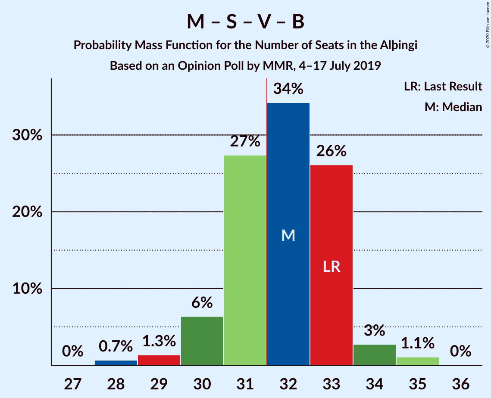
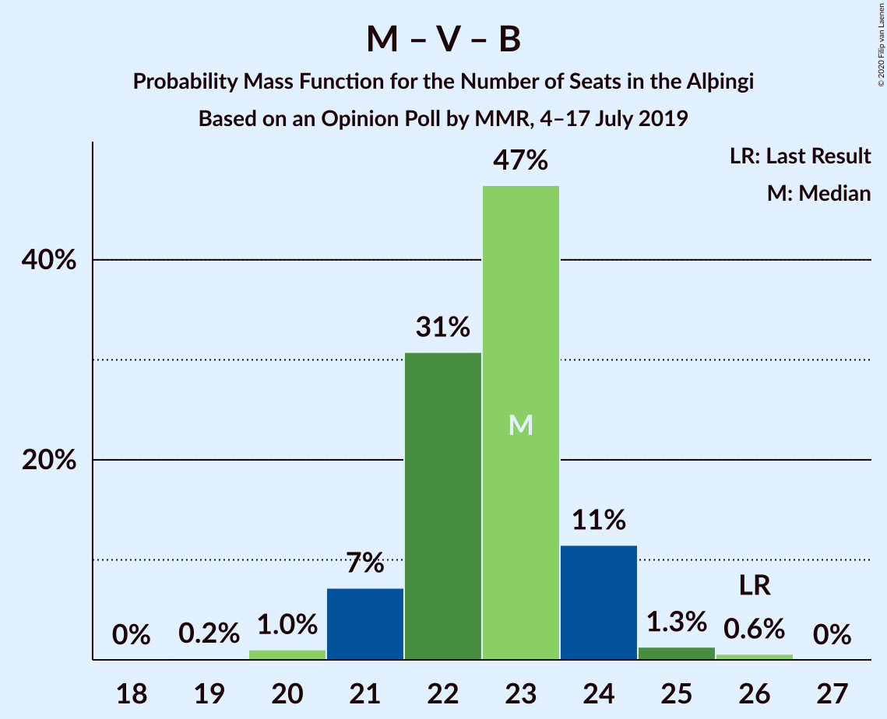

# Opinion Poll by MMR, 4–17 July 2019

<a href="#voting-intentions">Voting Intentions</a> | <a href="#seats">Seats</a> | <a href="#coalitions">Coalitions</a> | <a href="#technical-information">Technical Information</a>

## Voting Intentions

### Confidence Intervals

| Party | Last Result | Poll Result | 80% Confidence Interval | 90% Confidence Interval | 95% Confidence Interval | 99% Confidence Interval |
|:-----:|:-----------:|:-----------:|:-----------------------:|:-----------------------:|:-----------------------:|:-----------------------:|
| Sjálfstæðisflokkurinn | 25.2% | 19.0% | 17.9–20.2% |17.6–20.5% |17.4–20.8% |16.9–21.3% |
| Píratar | 9.2% | 14.9% | 13.9–15.9% |13.6–16.2% |13.4–16.5% |12.9–17.0% |
| Miðflokkurinn | 10.9% | 14.4% | 13.4–15.4% |13.2–15.7% |12.9–16.0% |12.5–16.5% |
| Samfylkingin | 12.1% | 13.5% | 12.6–14.5% |12.3–14.8% |12.1–15.0% |11.6–15.5% |
| Vinstrihreyfingin – grænt framboð | 16.9% | 10.3% | 9.5–11.2% |9.2–11.5% |9.0–11.7% |8.7–12.1% |
| Viðreisn | 6.7% | 9.7% | 8.9–10.6% |8.7–10.8% |8.5–11.1% |8.1–11.5% |
| Framsóknarflokkurinn | 10.7% | 8.4% | 7.6–9.2% |7.4–9.4% |7.2–9.7% |6.9–10.1% |
| Flokkur fólksins | 6.9% | 4.8% | 4.2–5.4% |4.1–5.6% |3.9–5.8% |3.7–6.1% |

*Note:* The poll result column reflects the actual value used in the calculations. Published results may vary slightly, and in addition be rounded to fewer digits.

## Seats

### Confidence Intervals

| Party | Last Result | Median | 80% Confidence Interval | 90% Confidence Interval | 95% Confidence Interval | 99% Confidence Interval |
|:-----:|:-----------:|:------:|:-----------------------:|:-----------------------:|:-----------------------:|:-----------------------:|
| <a href="#sjálfstæðisflokkurinn">Sjálfstæðisflokkurinn</a> | 16 | 13 | 12–14 |12–14 |12–14 |11–15 |
| <a href="#píratar">Píratar</a> | 6 | 10 | 9–11 |9–11 |8–11 |8–12 |
| <a href="#miðflokkurinn">Miðflokkurinn</a> | 7 | 10 | 9–11 |9–11 |9–12 |9–13 |
| <a href="#samfylkingin">Samfylkingin</a> | 7 | 9 | 8–10 |8–10 |8–10 |7–11 |
| <a href="#vinstrihreyfingin-–-grænt-framboð">Vinstrihreyfingin – grænt framboð</a> | 11 | 7 | 6–7 |6–8 |6–8 |5–8 |
| <a href="#viðreisn">Viðreisn</a> | 4 | 6 | 5–7 |5–7 |5–7 |5–8 |
| <a href="#framsóknarflokkurinn">Framsóknarflokkurinn</a> | 8 | 5 | 5–6 |5–6 |4–7 |4–7 |
| <a href="#flokkur-fólksins">Flokkur fólksins</a> | 4 | 0 | 0–3 |0–3 |0–3 |0–4 |

### Sjálfstæðisflokkurinn

*For a full overview of the results for this party, see the [Sjálfstæðisflokkurinn](party-sjálfstæðisflokkurinn.html) page.*

| Number of Seats | Probability | Accumulated | Special Marks |
|:---------------:|:-----------:|:-----------:|:-------------:|
| 11 | 0.9% | 100% |  |
| 12 | 23% | 99.1% |  |
| 13 | 61% | 76% | Median |
| 14 | 13% | 15% |  |
| 15 | 2% | 2% |  |
| 16 | 0.1% | 0.1% | Last Result |
| 17 | 0% | 0% |  |

### Píratar

*For a full overview of the results for this party, see the [Píratar](party-píratar.html) page.*

| Number of Seats | Probability | Accumulated | Special Marks |
|:---------------:|:-----------:|:-----------:|:-------------:|
| 6 | 0% | 100% | Last Result |
| 7 | 0% | 100% |  |
| 8 | 3% | 100% |  |
| 9 | 28% | 97% |  |
| 10 | 52% | 69% | Median |
| 11 | 16% | 17% |  |
| 12 | 1.0% | 1.0% |  |
| 13 | 0% | 0% |  |

### Miðflokkurinn

*For a full overview of the results for this party, see the [Miðflokkurinn](party-miðflokkurinn.html) page.*

| Number of Seats | Probability | Accumulated | Special Marks |
|:---------------:|:-----------:|:-----------:|:-------------:|
| 7 | 0% | 100% | Last Result |
| 8 | 0% | 100% |  |
| 9 | 16% | 100% |  |
| 10 | 70% | 84% | Median |
| 11 | 11% | 14% |  |
| 12 | 2% | 3% |  |
| 13 | 0.7% | 0.7% |  |
| 14 | 0% | 0% |  |

### Samfylkingin

*For a full overview of the results for this party, see the [Samfylkingin](party-samfylkingin.html) page.*

| Number of Seats | Probability | Accumulated | Special Marks |
|:---------------:|:-----------:|:-----------:|:-------------:|
| 7 | 2% | 100% | Last Result |
| 8 | 19% | 98% |  |
| 9 | 55% | 79% | Median |
| 10 | 23% | 24% |  |
| 11 | 0.6% | 0.7% |  |
| 12 | 0% | 0% |  |

### Vinstrihreyfingin – grænt framboð

*For a full overview of the results for this party, see the [Vinstrihreyfingin – grænt framboð](party-vinstrihreyfingin–græntframboð.html) page.*

| Number of Seats | Probability | Accumulated | Special Marks |
|:---------------:|:-----------:|:-----------:|:-------------:|
| 5 | 1.3% | 100% |  |
| 6 | 49% | 98.7% |  |
| 7 | 44% | 50% | Median |
| 8 | 6% | 6% |  |
| 9 | 0.1% | 0.1% |  |
| 10 | 0% | 0% |  |
| 11 | 0% | 0% | Last Result |

### Viðreisn

*For a full overview of the results for this party, see the [Viðreisn](party-viðreisn.html) page.*

| Number of Seats | Probability | Accumulated | Special Marks |
|:---------------:|:-----------:|:-----------:|:-------------:|
| 4 | 0% | 100% | Last Result |
| 5 | 11% | 100% |  |
| 6 | 63% | 89% | Median |
| 7 | 24% | 26% |  |
| 8 | 2% | 2% |  |
| 9 | 0% | 0% |  |

### Framsóknarflokkurinn

*For a full overview of the results for this party, see the [Framsóknarflokkurinn](party-framsóknarflokkurinn.html) page.*

| Number of Seats | Probability | Accumulated | Special Marks |
|:---------------:|:-----------:|:-----------:|:-------------:|
| 4 | 3% | 100% |  |
| 5 | 75% | 97% | Median |
| 6 | 17% | 22% |  |
| 7 | 5% | 5% |  |
| 8 | 0% | 0% | Last Result |

### Flokkur fólksins

*For a full overview of the results for this party, see the [Flokkur fólksins](party-flokkurfólksins.html) page.*

| Number of Seats | Probability | Accumulated | Special Marks |
|:---------------:|:-----------:|:-----------:|:-------------:|
| 0 | 57% | 100% | Median |
| 1 | 0.1% | 43% |  |
| 2 | 0% | 43% |  |
| 3 | 41% | 43% |  |
| 4 | 2% | 2% | Last Result |
| 5 | 0% | 0% |  |

## Coalitions

### Confidence Intervals

| Coalition | Last Result | Median | Majority? | 80% Confidence Interval | 90% Confidence Interval | 95% Confidence Interval | 99% Confidence Interval |
|:---------:|:-----------:|:------:|:---------:|:-----------------------:|:-----------------------:|:-----------------------:|:-----------------------:|
| Píratar – Samfylkingin – Vinstrihreyfingin – grænt framboð – Viðreisn | 28 | 32 | 61% | 29–33 | 29–34 | 29–35 | 27–35 |
| Miðflokkurinn – Samfylkingin – Vinstrihreyfingin – grænt framboð – Framsóknarflokkurinn | 33 | 31 | 25% | 29–32 | 29–33 | 29–33 | 28–34 |
| Sjálfstæðisflokkurinn – Miðflokkurinn – Framsóknarflokkurinn | 31 | 28 | 0.1% | 27–30 | 27–30 | 27–30 | 26–31 |
| Miðflokkurinn – Samfylkingin – Vinstrihreyfingin – grænt framboð | 25 | 26 | 0% | 24–27 | 24–27 | 24–28 | 23–29 |
| Píratar – Samfylkingin – Vinstrihreyfingin – grænt framboð | 24 | 25 | 0% | 24–27 | 23–27 | 23–28 | 22–28 |
| Sjálfstæðisflokkurinn – Vinstrihreyfingin – grænt framboð – Framsóknarflokkurinn | 35 | 25 | 0% | 23–26 | 23–27 | 23–27 | 22–28 |
| Sjálfstæðisflokkurinn – Miðflokkurinn | 23 | 23 | 0% | 22–24 | 22–25 | 22–25 | 21–26 |
| Miðflokkurinn – Vinstrihreyfingin – grænt framboð – Framsóknarflokkurinn | 26 | 22 | 0% | 21–23 | 20–24 | 20–24 | 20–25 |
| Sjálfstæðisflokkurinn – Samfylkingin | 23 | 22 | 0% | 21–23 | 21–23 | 20–24 | 20–25 |
| Samfylkingin – Vinstrihreyfingin – grænt framboð – Framsóknarflokkurinn | 26 | 21 | 0% | 19–22 | 19–23 | 19–23 | 18–24 |
| Sjálfstæðisflokkurinn – Vinstrihreyfingin – grænt framboð | 27 | 20 | 0% | 18–21 | 18–21 | 18–22 | 17–22 |
| Sjálfstæðisflokkurinn – Viðreisn | 20 | 19 | 0% | 18–20 | 18–21 | 18–21 | 17–22 |
| Sjálfstæðisflokkurinn – Framsóknarflokkurinn | 24 | 18 | 0% | 17–19 | 17–20 | 17–20 | 16–21 |
| Píratar – Vinstrihreyfingin – grænt framboð | 17 | 16 | 0% | 15–18 | 15–18 | 14–19 | 14–19 |
| Miðflokkurinn – Vinstrihreyfingin – grænt framboð | 18 | 16 | 0% | 16–18 | 15–18 | 15–18 | 15–20 |
| Samfylkingin – Vinstrihreyfingin – grænt framboð | 18 | 16 | 0% | 14–17 | 14–17 | 14–17 | 13–18 |
| Vinstrihreyfingin – grænt framboð – Framsóknarflokkurinn | 19 | 12 | 0% | 11–13 | 11–13 | 11–14 | 10–14 |

### Píratar – Samfylkingin – Vinstrihreyfingin – grænt framboð – Viðreisn

| Number of Seats | Probability | Accumulated | Special Marks |
|:---------------:|:-----------:|:-----------:|:-------------:|
| 27 | 0.8% | 100% |  |
| 28 | 0.9% | 99.2% | Last Result |
| 29 | 10% | 98% |  |
| 30 | 15% | 88% |  |
| 31 | 13% | 74% |  |
| 32 | 36% | 61% | Median, Majority |
| 33 | 17% | 25% |  |
| 34 | 5% | 8% |  |
| 35 | 3% | 4% |  |
| 36 | 0.2% | 0.2% |  |
| 37 | 0% | 0% |  |

### Miðflokkurinn – Samfylkingin – Vinstrihreyfingin – grænt framboð – Framsóknarflokkurinn

| Number of Seats | Probability | Accumulated | Special Marks |
|:---------------:|:-----------:|:-----------:|:-------------:|
| 27 | 0.4% | 100% |  |
| 28 | 0.7% | 99.6% |  |
| 29 | 16% | 98.8% |  |
| 30 | 19% | 83% |  |
| 31 | 38% | 63% | Median |
| 32 | 17% | 25% | Majority |
| 33 | 7% | 8% | Last Result |
| 34 | 1.1% | 1.4% |  |
| 35 | 0.3% | 0.3% |  |
| 36 | 0% | 0% |  |

### Sjálfstæðisflokkurinn – Miðflokkurinn – Framsóknarflokkurinn

| Number of Seats | Probability | Accumulated | Special Marks |
|:---------------:|:-----------:|:-----------:|:-------------:|
| 26 | 1.0% | 100% |  |
| 27 | 23% | 99.0% |  |
| 28 | 50% | 76% | Median |
| 29 | 13% | 26% |  |
| 30 | 11% | 13% |  |
| 31 | 2% | 2% | Last Result |
| 32 | 0.1% | 0.1% | Majority |
| 33 | 0% | 0% |  |

### Miðflokkurinn – Samfylkingin – Vinstrihreyfingin – grænt framboð

| Number of Seats | Probability | Accumulated | Special Marks |
|:---------------:|:-----------:|:-----------:|:-------------:|
| 23 | 2% | 100% |  |
| 24 | 17% | 98% |  |
| 25 | 22% | 81% | Last Result |
| 26 | 46% | 59% | Median |
| 27 | 9% | 13% |  |
| 28 | 4% | 4% |  |
| 29 | 0.6% | 0.8% |  |
| 30 | 0.2% | 0.2% |  |
| 31 | 0% | 0% |  |

### Píratar – Samfylkingin – Vinstrihreyfingin – grænt framboð

| Number of Seats | Probability | Accumulated | Special Marks |
|:---------------:|:-----------:|:-----------:|:-------------:|
| 21 | 0.1% | 100% |  |
| 22 | 2% | 99.9% |  |
| 23 | 3% | 98% |  |
| 24 | 22% | 95% | Last Result |
| 25 | 24% | 72% |  |
| 26 | 26% | 48% | Median |
| 27 | 17% | 22% |  |
| 28 | 5% | 5% |  |
| 29 | 0.3% | 0.3% |  |
| 30 | 0% | 0% |  |

### Sjálfstæðisflokkurinn – Vinstrihreyfingin – grænt framboð – Framsóknarflokkurinn

| Number of Seats | Probability | Accumulated | Special Marks |
|:---------------:|:-----------:|:-----------:|:-------------:|
| 21 | 0.1% | 100% |  |
| 22 | 1.1% | 99.9% |  |
| 23 | 18% | 98.8% |  |
| 24 | 22% | 81% |  |
| 25 | 39% | 59% | Median |
| 26 | 11% | 20% |  |
| 27 | 8% | 9% |  |
| 28 | 2% | 2% |  |
| 29 | 0.1% | 0.1% |  |
| 30 | 0% | 0% |  |
| 31 | 0% | 0% |  |
| 32 | 0% | 0% | Majority |
| 33 | 0% | 0% |  |
| 34 | 0% | 0% |  |
| 35 | 0% | 0% | Last Result |

### Sjálfstæðisflokkurinn – Miðflokkurinn

| Number of Seats | Probability | Accumulated | Special Marks |
|:---------------:|:-----------:|:-----------:|:-------------:|
| 21 | 0.7% | 100% |  |
| 22 | 27% | 99.2% |  |
| 23 | 56% | 72% | Last Result, Median |
| 24 | 11% | 16% |  |
| 25 | 4% | 5% |  |
| 26 | 0.7% | 0.8% |  |
| 27 | 0% | 0% |  |

### Miðflokkurinn – Vinstrihreyfingin – grænt framboð – Framsóknarflokkurinn

| Number of Seats | Probability | Accumulated | Special Marks |
|:---------------:|:-----------:|:-----------:|:-------------:|
| 19 | 0.2% | 100% |  |
| 20 | 5% | 99.8% |  |
| 21 | 40% | 95% |  |
| 22 | 32% | 54% | Median |
| 23 | 16% | 23% |  |
| 24 | 6% | 7% |  |
| 25 | 0.6% | 0.7% |  |
| 26 | 0.2% | 0.2% | Last Result |
| 27 | 0% | 0% |  |

### Sjálfstæðisflokkurinn – Samfylkingin

| Number of Seats | Probability | Accumulated | Special Marks |
|:---------------:|:-----------:|:-----------:|:-------------:|
| 19 | 0.2% | 100% |  |
| 20 | 3% | 99.8% |  |
| 21 | 35% | 97% |  |
| 22 | 33% | 62% | Median |
| 23 | 25% | 29% | Last Result |
| 24 | 3% | 4% |  |
| 25 | 0.7% | 0.7% |  |
| 26 | 0% | 0% |  |

### Samfylkingin – Vinstrihreyfingin – grænt framboð – Framsóknarflokkurinn

| Number of Seats | Probability | Accumulated | Special Marks |
|:---------------:|:-----------:|:-----------:|:-------------:|
| 17 | 0.4% | 100% |  |
| 18 | 0.8% | 99.5% |  |
| 19 | 13% | 98.7% |  |
| 20 | 29% | 86% |  |
| 21 | 25% | 57% | Median |
| 22 | 26% | 32% |  |
| 23 | 5% | 6% |  |
| 24 | 0.7% | 0.8% |  |
| 25 | 0% | 0% |  |
| 26 | 0% | 0% | Last Result |

### Sjálfstæðisflokkurinn – Vinstrihreyfingin – grænt framboð

| Number of Seats | Probability | Accumulated | Special Marks |
|:---------------:|:-----------:|:-----------:|:-------------:|
| 16 | 0.1% | 100% |  |
| 17 | 0.8% | 99.9% |  |
| 18 | 19% | 99.1% |  |
| 19 | 30% | 81% |  |
| 20 | 38% | 51% | Median |
| 21 | 9% | 13% |  |
| 22 | 3% | 3% |  |
| 23 | 0.1% | 0.1% |  |
| 24 | 0% | 0% |  |
| 25 | 0% | 0% |  |
| 26 | 0% | 0% |  |
| 27 | 0% | 0% | Last Result |

### Sjálfstæðisflokkurinn – Viðreisn

| Number of Seats | Probability | Accumulated | Special Marks |
|:---------------:|:-----------:|:-----------:|:-------------:|
| 17 | 2% | 100% |  |
| 18 | 22% | 98% |  |
| 19 | 47% | 76% | Median |
| 20 | 23% | 29% | Last Result |
| 21 | 5% | 6% |  |
| 22 | 0.9% | 1.0% |  |
| 23 | 0.1% | 0.1% |  |
| 24 | 0% | 0% |  |

### Sjálfstæðisflokkurinn – Framsóknarflokkurinn

| Number of Seats | Probability | Accumulated | Special Marks |
|:---------------:|:-----------:|:-----------:|:-------------:|
| 15 | 0.1% | 100% |  |
| 16 | 1.5% | 99.9% |  |
| 17 | 20% | 98% |  |
| 18 | 51% | 79% | Median |
| 19 | 18% | 27% |  |
| 20 | 9% | 10% |  |
| 21 | 0.7% | 0.8% |  |
| 22 | 0.1% | 0.1% |  |
| 23 | 0% | 0% |  |
| 24 | 0% | 0% | Last Result |

### Píratar – Vinstrihreyfingin – grænt framboð

| Number of Seats | Probability | Accumulated | Special Marks |
|:---------------:|:-----------:|:-----------:|:-------------:|
| 13 | 0.3% | 100% |  |
| 14 | 3% | 99.7% |  |
| 15 | 17% | 97% |  |
| 16 | 31% | 80% |  |
| 17 | 38% | 49% | Last Result, Median |
| 18 | 8% | 11% |  |
| 19 | 3% | 3% |  |
| 20 | 0.1% | 0.1% |  |
| 21 | 0% | 0% |  |

### Miðflokkurinn – Vinstrihreyfingin – grænt framboð

| Number of Seats | Probability | Accumulated | Special Marks |
|:---------------:|:-----------:|:-----------:|:-------------:|
| 14 | 0.2% | 100% |  |
| 15 | 6% | 99.8% |  |
| 16 | 46% | 94% |  |
| 17 | 38% | 48% | Median |
| 18 | 8% | 10% | Last Result |
| 19 | 2% | 2% |  |
| 20 | 0.5% | 0.6% |  |
| 21 | 0.1% | 0.1% |  |
| 22 | 0% | 0% |  |

### Samfylkingin – Vinstrihreyfingin – grænt framboð

| Number of Seats | Probability | Accumulated | Special Marks |
|:---------------:|:-----------:|:-----------:|:-------------:|
| 12 | 0.1% | 100% |  |
| 13 | 2% | 99.9% |  |
| 14 | 14% | 98% |  |
| 15 | 31% | 84% |  |
| 16 | 34% | 53% | Median |
| 17 | 16% | 19% |  |
| 18 | 2% | 2% | Last Result |
| 19 | 0.2% | 0.2% |  |
| 20 | 0% | 0% |  |

### Vinstrihreyfingin – grænt framboð – Framsóknarflokkurinn

| Number of Seats | Probability | Accumulated | Special Marks |
|:---------------:|:-----------:|:-----------:|:-------------:|
| 9 | 0.1% | 100% |  |
| 10 | 2% | 99.9% |  |
| 11 | 42% | 98% |  |
| 12 | 38% | 57% | Median |
| 13 | 15% | 19% |  |
| 14 | 4% | 4% |  |
| 15 | 0.1% | 0.1% |  |
| 16 | 0% | 0% |  |
| 17 | 0% | 0% |  |
| 18 | 0% | 0% |  |
| 19 | 0% | 0% | Last Result |

## Technical Information

### Opinion Poll

+ **Polling firm:** MMR
+ **Commissioner(s):** —
+ **Fieldwork period:** 4–17 July 2019

### Calculations

+ **Sample size:** 2031
+ **Simulations done:** 131,072
+ **Error estimate:** 0.79%

