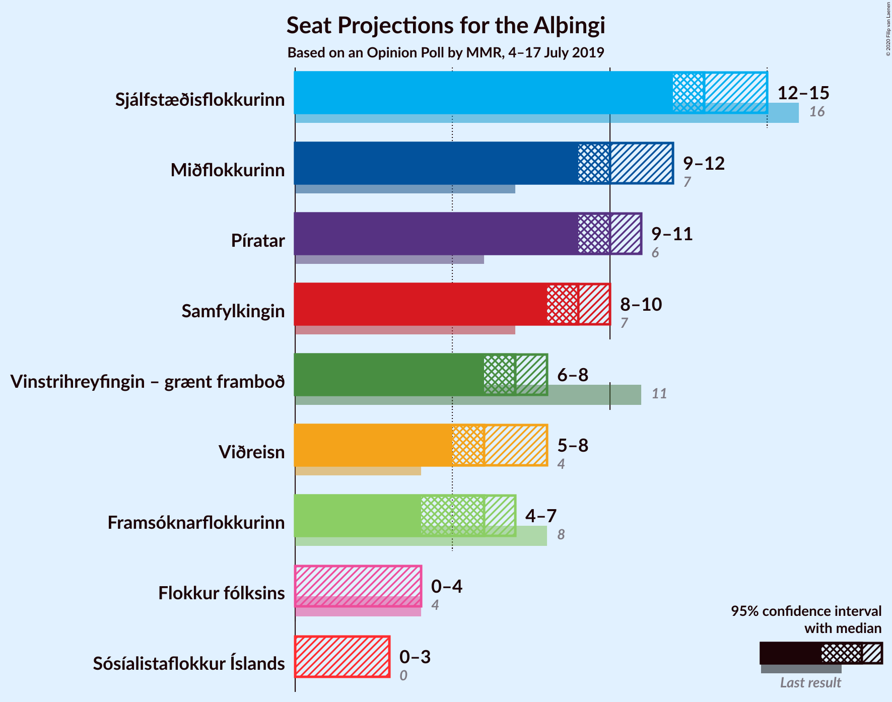
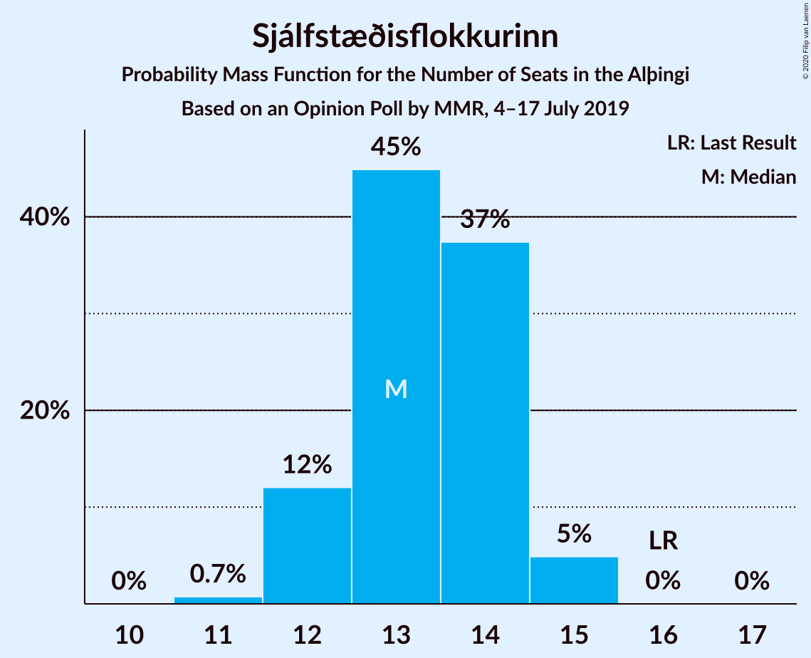
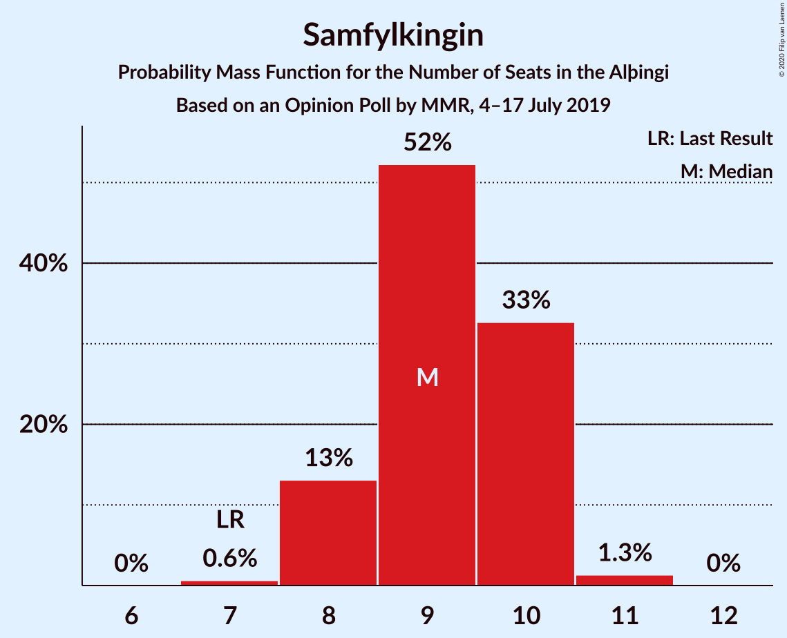
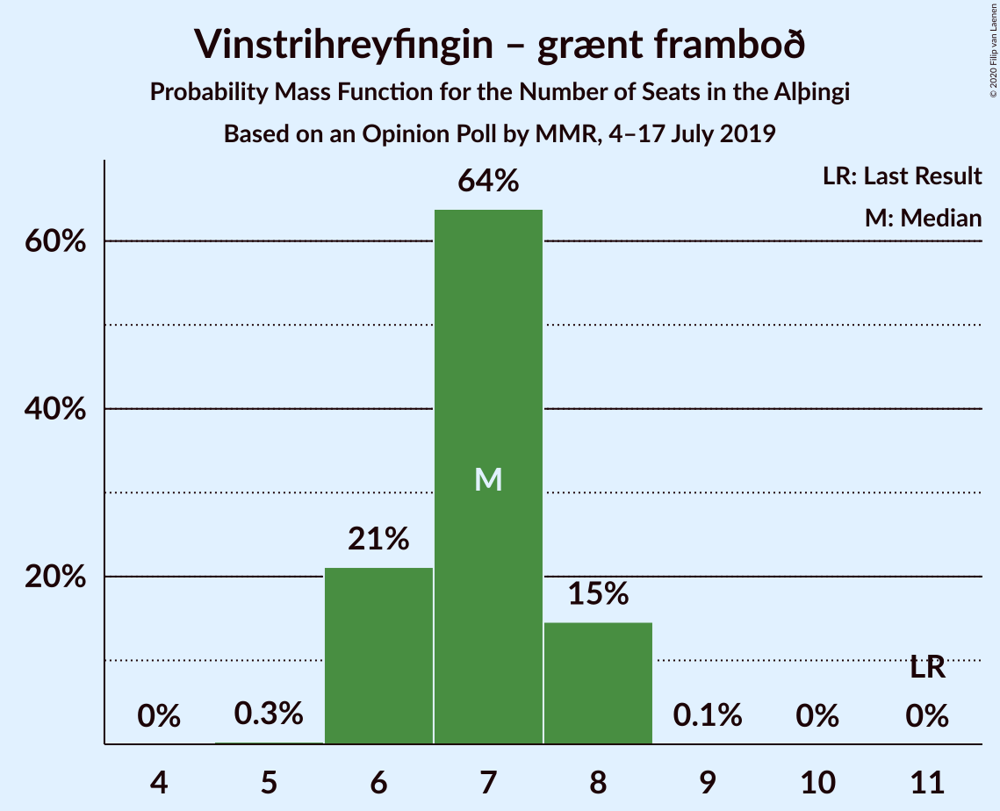
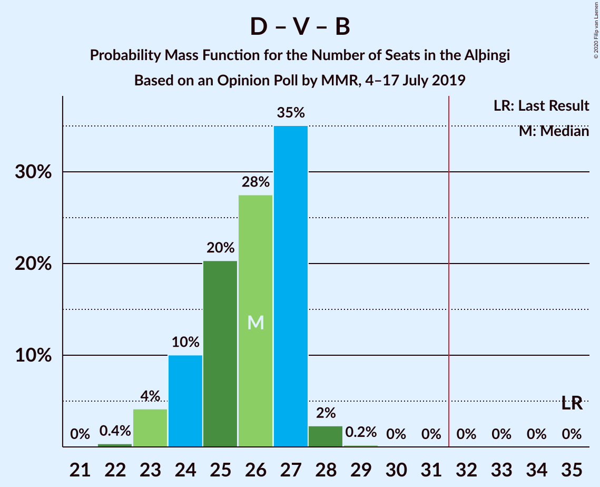
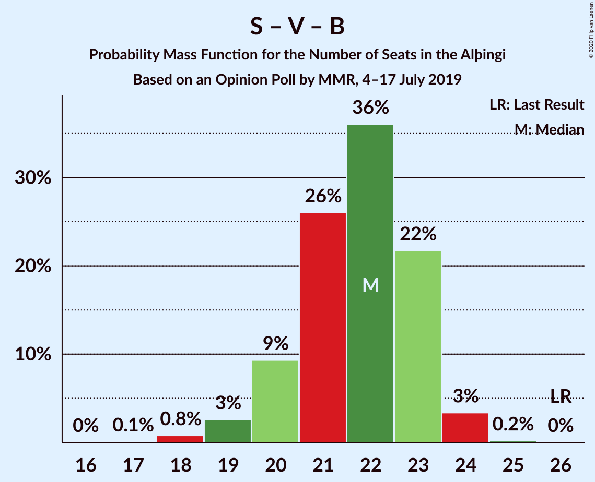

# Opinion Poll by MMR, 4–17 July 2019

<a href="#voting-intentions">Voting Intentions</a> | <a href="#seats">Seats</a> | <a href="#coalitions">Coalitions</a> | <a href="#technical-information">Technical Information</a>

## Voting Intentions

### Confidence Intervals

| Party | Last Result | Poll Result | 80% Confidence Interval | 90% Confidence Interval | 95% Confidence Interval | 99% Confidence Interval |
|:-----:|:-----------:|:-----------:|:-----------------------:|:-----------------------:|:-----------------------:|:-----------------------:|
| Sjálfstæðisflokkurinn | 25.2% | 19.0% | 17.9–20.2% |17.6–20.5% |17.4–20.8% |16.9–21.3% |
| Píratar | 9.2% | 14.9% | 13.9–15.9% |13.6–16.2% |13.4–16.5% |12.9–17.0% |
| Miðflokkurinn | 10.9% | 14.4% | 13.4–15.4% |13.2–15.7% |12.9–16.0% |12.5–16.5% |
| Samfylkingin | 12.1% | 13.5% | 12.6–14.5% |12.3–14.8% |12.1–15.0% |11.6–15.5% |
| Vinstrihreyfingin – grænt framboð | 16.9% | 10.3% | 9.5–11.2% |9.2–11.5% |9.0–11.7% |8.7–12.1% |
| Viðreisn | 6.7% | 9.7% | 8.9–10.6% |8.7–10.8% |8.5–11.1% |8.1–11.5% |
| Framsóknarflokkurinn | 10.7% | 8.4% | 7.6–9.2% |7.4–9.4% |7.2–9.7% |6.9–10.1% |
| Flokkur fólksins | 6.9% | 4.8% | 4.2–5.4% |4.1–5.6% |3.9–5.8% |3.7–6.1% |
| Sósíalistaflokkur Íslands | 0.0% | 4.3% | 3.7–4.9% |3.6–5.1% |3.5–5.3% |3.2–5.6% |

*Note:* The poll result column reflects the actual value used in the calculations. Published results may vary slightly, and in addition be rounded to fewer digits.

## Seats

### Confidence Intervals

| Party | Last Result | Median | 80% Confidence Interval | 90% Confidence Interval | 95% Confidence Interval | 99% Confidence Interval |
|:-----:|:-----------:|:------:|:-----------------------:|:-----------------------:|:-----------------------:|:-----------------------:|
| <a href="#sjálfstæðisflokkurinn">Sjálfstæðisflokkurinn</a> | 16 | 13 | 13 |13–15 |13–15 |12–15 |
| <a href="#píratar">Píratar</a> | 6 | 9 | 9 |9–10 |9–11 |9–12 |
| <a href="#miðflokkurinn">Miðflokkurinn</a> | 7 | 9 | 9 |9–10 |9–10 |9–12 |
| <a href="#samfylkingin">Samfylkingin</a> | 7 | 10 | 10 |10 |9–10 |8–11 |
| <a href="#vinstrihreyfingin-–-grænt-framboð">Vinstrihreyfingin – grænt framboð</a> | 11 | 6 | 6 |6 |6–7 |5–7 |
| <a href="#viðreisn">Viðreisn</a> | 4 | 8 | 7–8 |7–8 |6–8 |6–8 |
| <a href="#framsóknarflokkurinn">Framsóknarflokkurinn</a> | 8 | 5 | 5 |5 |5–6 |4–7 |
| <a href="#flokkur-fólksins">Flokkur fólksins</a> | 4 | 3 | 3 |0–4 |0–4 |0–4 |
| <a href="#sósíalistaflokkur-íslands">Sósíalistaflokkur Íslands</a> | 0 | 0 | 0 |0 |0 |0–3 |

### Sjálfstæðisflokkurinn

*For a full overview of the results for this party, see the [Sjálfstæðisflokkurinn](party-sjálfstæðisflokkurinn.html) page.*

| Number of Seats | Probability | Accumulated | Special Marks |
|:---------------:|:-----------:|:-----------:|:-------------:|
| 11 | 0.3% | 100% |  |
| 12 | 1.3% | 99.7% |  |
| 13 | 93% | 98% | Median |
| 14 | 0.5% | 6% |  |
| 15 | 5% | 5% |  |
| 16 | 0% | 0% | Last Result |

### Píratar

*For a full overview of the results for this party, see the [Píratar](party-píratar.html) page.*

| Number of Seats | Probability | Accumulated | Special Marks |
|:---------------:|:-----------:|:-----------:|:-------------:|
| 6 | 0% | 100% | Last Result |
| 7 | 0% | 100% |  |
| 8 | 0.1% | 100% |  |
| 9 | 94% | 99.8% | Median |
| 10 | 2% | 6% |  |
| 11 | 4% | 4% |  |
| 12 | 0.6% | 0.6% |  |
| 13 | 0% | 0% |  |

### Miðflokkurinn

*For a full overview of the results for this party, see the [Miðflokkurinn](party-miðflokkurinn.html) page.*

| Number of Seats | Probability | Accumulated | Special Marks |
|:---------------:|:-----------:|:-----------:|:-------------:|
| 7 | 0% | 100% | Last Result |
| 8 | 0.2% | 100% |  |
| 9 | 93% | 99.8% | Median |
| 10 | 5% | 6% |  |
| 11 | 0.4% | 1.3% |  |
| 12 | 0.9% | 0.9% |  |
| 13 | 0% | 0% |  |

### Samfylkingin

*For a full overview of the results for this party, see the [Samfylkingin](party-samfylkingin.html) page.*

| Number of Seats | Probability | Accumulated | Special Marks |
|:---------------:|:-----------:|:-----------:|:-------------:|
| 7 | 0.3% | 100% | Last Result |
| 8 | 0.5% | 99.7% |  |
| 9 | 4% | 99.2% |  |
| 10 | 94% | 96% | Median |
| 11 | 1.4% | 1.4% |  |
| 12 | 0% | 0% |  |

### Vinstrihreyfingin – grænt framboð

*For a full overview of the results for this party, see the [Vinstrihreyfingin – grænt framboð](party-vinstrihreyfingin–græntframboð.html) page.*

| Number of Seats | Probability | Accumulated | Special Marks |
|:---------------:|:-----------:|:-----------:|:-------------:|
| 5 | 2% | 100% |  |
| 6 | 94% | 98% | Median |
| 7 | 3% | 3% |  |
| 8 | 0.1% | 0.3% |  |
| 9 | 0% | 0.2% |  |
| 10 | 0.1% | 0.1% |  |
| 11 | 0% | 0% | Last Result |

### Viðreisn

*For a full overview of the results for this party, see the [Viðreisn](party-viðreisn.html) page.*

| Number of Seats | Probability | Accumulated | Special Marks |
|:---------------:|:-----------:|:-----------:|:-------------:|
| 4 | 0% | 100% | Last Result |
| 5 | 0.3% | 100% |  |
| 6 | 4% | 99.7% |  |
| 7 | 8% | 95% |  |
| 8 | 87% | 87% | Median |
| 9 | 0% | 0% |  |

### Framsóknarflokkurinn

*For a full overview of the results for this party, see the [Framsóknarflokkurinn](party-framsóknarflokkurinn.html) page.*

| Number of Seats | Probability | Accumulated | Special Marks |
|:---------------:|:-----------:|:-----------:|:-------------:|
| 4 | 0.7% | 100% |  |
| 5 | 96% | 99.2% | Median |
| 6 | 2% | 3% |  |
| 7 | 1.3% | 1.4% |  |
| 8 | 0.1% | 0.1% | Last Result |
| 9 | 0% | 0% |  |

### Flokkur fólksins

*For a full overview of the results for this party, see the [Flokkur fólksins](party-flokkurfólksins.html) page.*

| Number of Seats | Probability | Accumulated | Special Marks |
|:---------------:|:-----------:|:-----------:|:-------------:|
| 0 | 7% | 100% |  |
| 1 | 0% | 93% |  |
| 2 | 0% | 93% |  |
| 3 | 87% | 93% | Median |
| 4 | 6% | 6% | Last Result |
| 5 | 0% | 0% |  |

### Sósíalistaflokkur Íslands

*For a full overview of the results for this party, see the [Sósíalistaflokkur Íslands](party-sósíalistaflokkuríslands.html) page.*

| Number of Seats | Probability | Accumulated | Special Marks |
|:---------------:|:-----------:|:-----------:|:-------------:|
| 0 | 99.4% | 100% | Last Result, Median |
| 1 | 0% | 0.6% |  |
| 2 | 0% | 0.6% |  |
| 3 | 0.5% | 0.6% |  |
| 4 | 0.1% | 0.1% |  |
| 5 | 0% | 0% |  |

## Coalitions

### Confidence Intervals

| Coalition | Last Result | Median | Majority? | 80% Confidence Interval | 90% Confidence Interval | 95% Confidence Interval | 99% Confidence Interval |
|:---------:|:-----------:|:------:|:---------:|:-----------------------:|:-----------------------:|:-----------------------:|:-----------------------:|
| Píratar – Samfylkingin – Vinstrihreyfingin – grænt framboð – Viðreisn | 28 | 33 | 98.8% | 33 | 32–33 | 32–33 | 30–34 |
| Miðflokkurinn – Samfylkingin – Vinstrihreyfingin – grænt framboð – Framsóknarflokkurinn | 33 | 30 | 2% | 30 | 30–31 | 30–31 | 28–34 |
| Sjálfstæðisflokkurinn – Miðflokkurinn – Framsóknarflokkurinn | 31 | 27 | 0.3% | 27 | 27–30 | 27–30 | 27–30 |
| Píratar – Samfylkingin – Vinstrihreyfingin – grænt framboð | 24 | 25 | 0% | 25 | 25–27 | 25–27 | 23–27 |
| Sjálfstæðisflokkurinn – Vinstrihreyfingin – grænt framboð – Framsóknarflokkurinn | 35 | 24 | 0% | 24 | 24–26 | 24–27 | 23–27 |
| Miðflokkurinn – Samfylkingin – Vinstrihreyfingin – grænt framboð | 25 | 25 | 0% | 25 | 25–26 | 25–26 | 24–27 |
| Sjálfstæðisflokkurinn – Miðflokkurinn | 23 | 22 | 0% | 22 | 22–24 | 22–25 | 22–25 |
| Sjálfstæðisflokkurinn – Samfylkingin | 23 | 23 | 0% | 23 | 23–24 | 23–24 | 21–25 |
| Samfylkingin – Vinstrihreyfingin – grænt framboð – Framsóknarflokkurinn | 26 | 21 | 0% | 21 | 21 | 21–22 | 19–24 |
| Miðflokkurinn – Vinstrihreyfingin – grænt framboð – Framsóknarflokkurinn | 26 | 20 | 0% | 20 | 20–22 | 20–22 | 20–23 |
| Sjálfstæðisflokkurinn – Vinstrihreyfingin – grænt framboð | 27 | 19 | 0% | 19 | 19–20 | 19–22 | 18–22 |
| Sjálfstæðisflokkurinn – Viðreisn | 20 | 21 | 0% | 21 | 20–21 | 20–21 | 18–23 |
| Sjálfstæðisflokkurinn – Framsóknarflokkurinn | 24 | 18 | 0% | 18 | 18–20 | 18–20 | 17–21 |
| Píratar – Vinstrihreyfingin – grænt framboð | 17 | 15 | 0% | 15 | 15–16 | 15–18 | 14–18 |
| Miðflokkurinn – Vinstrihreyfingin – grænt framboð | 18 | 15 | 0% | 15 | 15–16 | 15–17 | 15–17 |
| Samfylkingin – Vinstrihreyfingin – grænt framboð | 18 | 16 | 0% | 16 | 16 | 16 | 14–17 |
| Vinstrihreyfingin – grænt framboð – Framsóknarflokkurinn | 19 | 11 | 0% | 11 | 11–12 | 11–12 | 10–13 |

### Píratar – Samfylkingin – Vinstrihreyfingin – grænt framboð – Viðreisn

| Number of Seats | Probability | Accumulated | Special Marks |
|:---------------:|:-----------:|:-----------:|:-------------:|
| 28 | 0% | 100% | Last Result |
| 29 | 0.2% | 100% |  |
| 30 | 0.6% | 99.7% |  |
| 31 | 0.4% | 99.2% |  |
| 32 | 7% | 98.8% | Majority |
| 33 | 91% | 92% | Median |
| 34 | 1.2% | 1.2% |  |
| 35 | 0% | 0% |  |

### Miðflokkurinn – Samfylkingin – Vinstrihreyfingin – grænt framboð – Framsóknarflokkurinn

| Number of Seats | Probability | Accumulated | Special Marks |
|:---------------:|:-----------:|:-----------:|:-------------:|
| 28 | 0.6% | 100% |  |
| 29 | 0.2% | 99.4% |  |
| 30 | 92% | 99.2% | Median |
| 31 | 5% | 7% |  |
| 32 | 1.1% | 2% | Majority |
| 33 | 0.1% | 1.3% | Last Result |
| 34 | 1.1% | 1.2% |  |
| 35 | 0% | 0.1% |  |
| 36 | 0% | 0% |  |

### Sjálfstæðisflokkurinn – Miðflokkurinn – Framsóknarflokkurinn

| Number of Seats | Probability | Accumulated | Special Marks |
|:---------------:|:-----------:|:-----------:|:-------------:|
| 26 | 0.2% | 100% |  |
| 27 | 92% | 99.8% | Median |
| 28 | 0.7% | 8% |  |
| 29 | 1.3% | 7% |  |
| 30 | 6% | 6% |  |
| 31 | 0% | 0.4% | Last Result |
| 32 | 0.3% | 0.3% | Majority |
| 33 | 0% | 0% |  |

### Píratar – Samfylkingin – Vinstrihreyfingin – grænt framboð

| Number of Seats | Probability | Accumulated | Special Marks |
|:---------------:|:-----------:|:-----------:|:-------------:|
| 22 | 0.2% | 100% |  |
| 23 | 0.7% | 99.8% |  |
| 24 | 0.2% | 99.1% | Last Result |
| 25 | 93% | 98.9% | Median |
| 26 | 0.7% | 6% |  |
| 27 | 5% | 5% |  |
| 28 | 0.2% | 0.2% |  |
| 29 | 0% | 0% |  |

### Sjálfstæðisflokkurinn – Vinstrihreyfingin – grænt framboð – Framsóknarflokkurinn

| Number of Seats | Probability | Accumulated | Special Marks |
|:---------------:|:-----------:|:-----------:|:-------------:|
| 21 | 0.3% | 100% |  |
| 22 | 0% | 99.7% |  |
| 23 | 0.7% | 99.7% |  |
| 24 | 92% | 99.0% | Median |
| 25 | 2% | 7% |  |
| 26 | 0.5% | 5% |  |
| 27 | 4% | 5% |  |
| 28 | 0% | 0% |  |
| 29 | 0% | 0% |  |
| 30 | 0% | 0% |  |
| 31 | 0% | 0% |  |
| 32 | 0% | 0% | Majority |
| 33 | 0% | 0% |  |
| 34 | 0% | 0% |  |
| 35 | 0% | 0% | Last Result |

### Miðflokkurinn – Samfylkingin – Vinstrihreyfingin – grænt framboð

| Number of Seats | Probability | Accumulated | Special Marks |
|:---------------:|:-----------:|:-----------:|:-------------:|
| 23 | 0.3% | 100% |  |
| 24 | 1.0% | 99.7% |  |
| 25 | 93% | 98.7% | Last Result, Median |
| 26 | 3% | 5% |  |
| 27 | 2% | 2% |  |
| 28 | 0.3% | 0.4% |  |
| 29 | 0% | 0% |  |

### Sjálfstæðisflokkurinn – Miðflokkurinn

| Number of Seats | Probability | Accumulated | Special Marks |
|:---------------:|:-----------:|:-----------:|:-------------:|
| 22 | 93% | 100% | Median |
| 23 | 0.7% | 7% | Last Result |
| 24 | 2% | 6% |  |
| 25 | 4% | 4% |  |
| 26 | 0.3% | 0.3% |  |
| 27 | 0% | 0% |  |

### Sjálfstæðisflokkurinn – Samfylkingin

| Number of Seats | Probability | Accumulated | Special Marks |
|:---------------:|:-----------:|:-----------:|:-------------:|
| 19 | 0.1% | 100% |  |
| 20 | 0.3% | 99.9% |  |
| 21 | 0.5% | 99.7% |  |
| 22 | 0.1% | 99.2% |  |
| 23 | 94% | 99.1% | Last Result, Median |
| 24 | 3% | 5% |  |
| 25 | 2% | 2% |  |
| 26 | 0% | 0% |  |

### Samfylkingin – Vinstrihreyfingin – grænt framboð – Framsóknarflokkurinn

| Number of Seats | Probability | Accumulated | Special Marks |
|:---------------:|:-----------:|:-----------:|:-------------:|
| 18 | 0.2% | 100% |  |
| 19 | 0.4% | 99.8% |  |
| 20 | 2% | 99.4% |  |
| 21 | 95% | 98% | Median |
| 22 | 2% | 3% |  |
| 23 | 0.1% | 1.3% |  |
| 24 | 1.1% | 1.2% |  |
| 25 | 0.1% | 0.1% |  |
| 26 | 0% | 0% | Last Result |

### Miðflokkurinn – Vinstrihreyfingin – grænt framboð – Framsóknarflokkurinn

| Number of Seats | Probability | Accumulated | Special Marks |
|:---------------:|:-----------:|:-----------:|:-------------:|
| 17 | 0.2% | 100% |  |
| 18 | 0.3% | 99.8% |  |
| 19 | 0% | 99.5% |  |
| 20 | 92% | 99.5% | Median |
| 21 | 2% | 8% |  |
| 22 | 4% | 6% |  |
| 23 | 1.2% | 2% |  |
| 24 | 0.3% | 0.4% |  |
| 25 | 0.1% | 0.1% |  |
| 26 | 0% | 0% | Last Result |

### Sjálfstæðisflokkurinn – Vinstrihreyfingin – grænt framboð

| Number of Seats | Probability | Accumulated | Special Marks |
|:---------------:|:-----------:|:-----------:|:-------------:|
| 16 | 0.2% | 100% |  |
| 17 | 0% | 99.8% |  |
| 18 | 2% | 99.8% |  |
| 19 | 92% | 98% | Median |
| 20 | 0.9% | 5% |  |
| 21 | 1.5% | 5% |  |
| 22 | 3% | 3% |  |
| 23 | 0.1% | 0.1% |  |
| 24 | 0% | 0% |  |
| 25 | 0% | 0% |  |
| 26 | 0% | 0% |  |
| 27 | 0% | 0% | Last Result |

### Sjálfstæðisflokkurinn – Viðreisn

| Number of Seats | Probability | Accumulated | Special Marks |
|:---------------:|:-----------:|:-----------:|:-------------:|
| 17 | 0.3% | 100% |  |
| 18 | 0.4% | 99.7% |  |
| 19 | 2% | 99.3% |  |
| 20 | 7% | 98% | Last Result |
| 21 | 89% | 91% | Median |
| 22 | 0% | 2% |  |
| 23 | 2% | 2% |  |
| 24 | 0% | 0% |  |

### Sjálfstæðisflokkurinn – Framsóknarflokkurinn

| Number of Seats | Probability | Accumulated | Special Marks |
|:---------------:|:-----------:|:-----------:|:-------------:|
| 16 | 0.2% | 100% |  |
| 17 | 0.3% | 99.7% |  |
| 18 | 93% | 99.5% | Median |
| 19 | 1.4% | 7% |  |
| 20 | 4% | 5% |  |
| 21 | 2% | 2% |  |
| 22 | 0% | 0% |  |
| 23 | 0% | 0% |  |
| 24 | 0% | 0% | Last Result |

### Píratar – Vinstrihreyfingin – grænt framboð

| Number of Seats | Probability | Accumulated | Special Marks |
|:---------------:|:-----------:|:-----------:|:-------------:|
| 14 | 0.7% | 100% |  |
| 15 | 93% | 99.3% | Median |
| 16 | 2% | 6% |  |
| 17 | 0.6% | 4% | Last Result |
| 18 | 3% | 3% |  |
| 19 | 0% | 0.2% |  |
| 20 | 0.2% | 0.2% |  |
| 21 | 0% | 0% |  |

### Miðflokkurinn – Vinstrihreyfingin – grænt framboð

| Number of Seats | Probability | Accumulated | Special Marks |
|:---------------:|:-----------:|:-----------:|:-------------:|
| 13 | 0.2% | 100% |  |
| 14 | 0.3% | 99.8% |  |
| 15 | 94% | 99.5% | Median |
| 16 | 2% | 6% |  |
| 17 | 4% | 4% |  |
| 18 | 0% | 0.3% | Last Result |
| 19 | 0% | 0.3% |  |
| 20 | 0.2% | 0.2% |  |
| 21 | 0% | 0% |  |

### Samfylkingin – Vinstrihreyfingin – grænt framboð

| Number of Seats | Probability | Accumulated | Special Marks |
|:---------------:|:-----------:|:-----------:|:-------------:|
| 13 | 0.2% | 100% |  |
| 14 | 0.9% | 99.7% |  |
| 15 | 1.1% | 98.9% |  |
| 16 | 96% | 98% | Median |
| 17 | 1.2% | 1.4% |  |
| 18 | 0.2% | 0.2% | Last Result |
| 19 | 0% | 0% |  |

### Vinstrihreyfingin – grænt framboð – Framsóknarflokkurinn

| Number of Seats | Probability | Accumulated | Special Marks |
|:---------------:|:-----------:|:-----------:|:-------------:|
| 9 | 0.5% | 100% |  |
| 10 | 0.9% | 99.5% |  |
| 11 | 92% | 98.6% | Median |
| 12 | 5% | 6% |  |
| 13 | 1.2% | 2% |  |
| 14 | 0.2% | 0.3% |  |
| 15 | 0.1% | 0.1% |  |
| 16 | 0% | 0% |  |
| 17 | 0% | 0% |  |
| 18 | 0% | 0% |  |
| 19 | 0% | 0% | Last Result |

## Technical Information

### Opinion Poll

+ **Polling firm:** MMR
+ **Commissioner(s):** —
+ **Fieldwork period:** 4–17 July 2019

### Calculations

+ **Sample size:** 2031
+ **Simulations done:** 1,024
+ **Error estimate:** 2.79%

