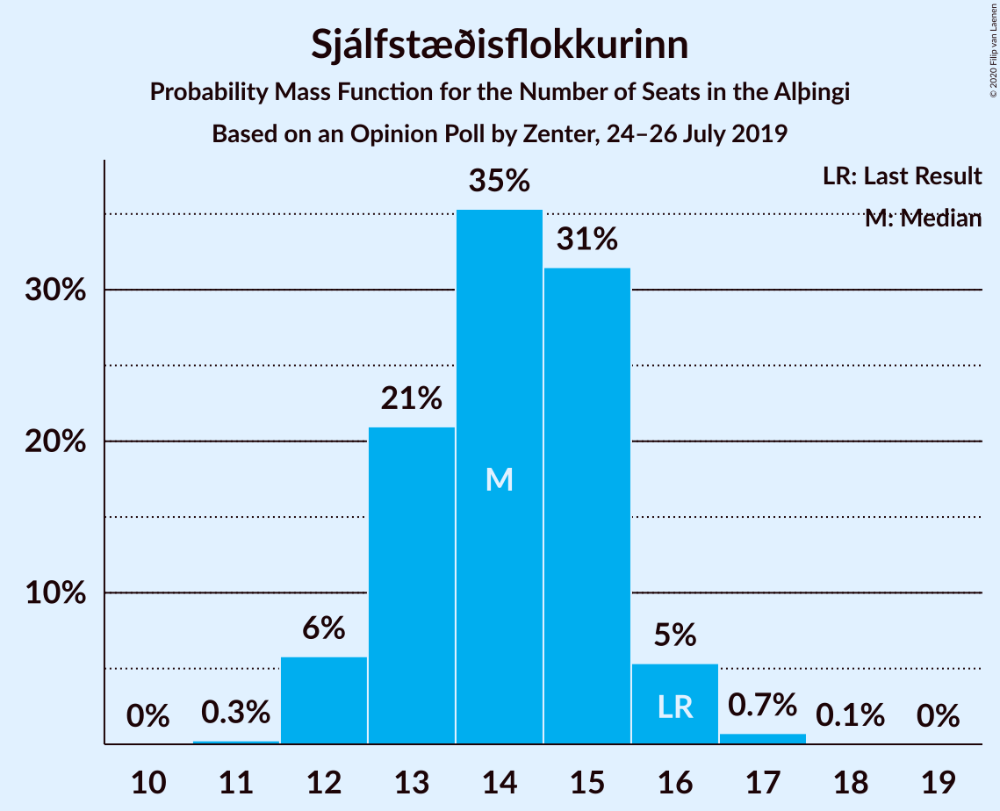
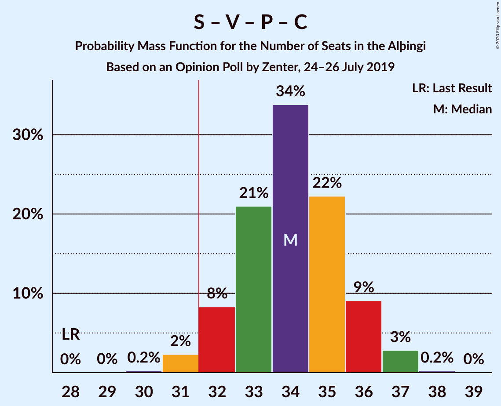
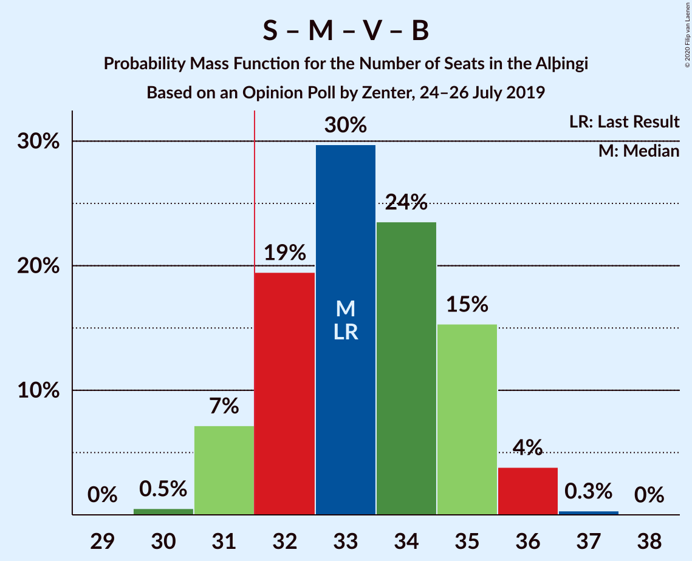
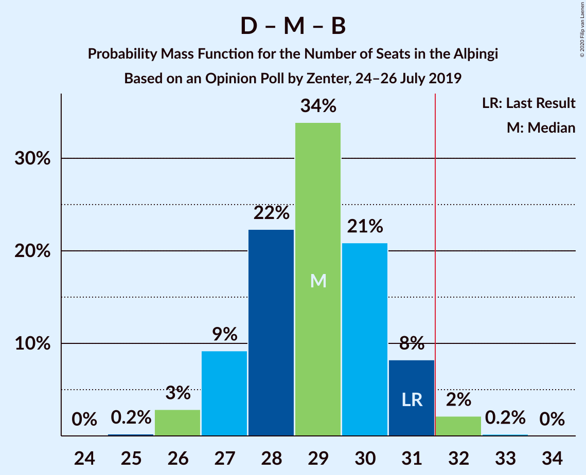
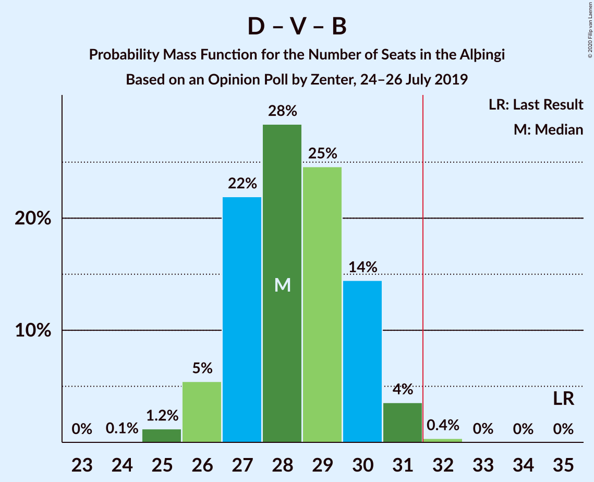
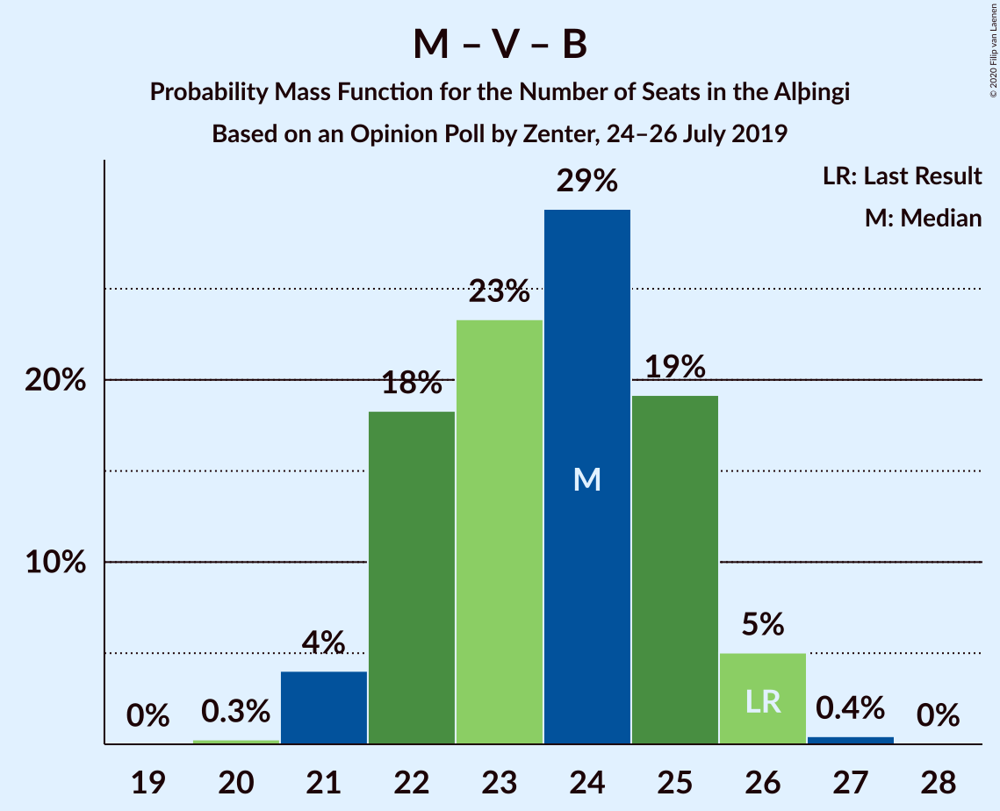
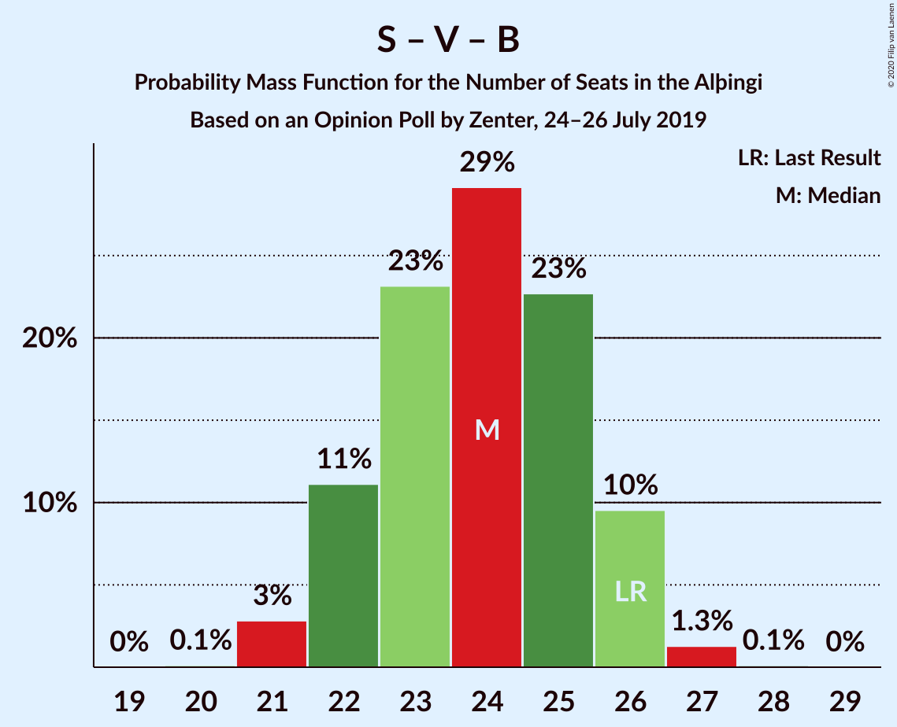

# Opinion Poll by Zenter, 24–26 July 2019

<a href="#voting-intentions">Voting Intentions</a> | <a href="#seats">Seats</a> | <a href="#coalitions">Coalitions</a> | <a href="#technical-information">Technical Information</a>

## Voting Intentions

### Confidence Intervals

| Party | Last Result | Poll Result | 80% Confidence Interval | 90% Confidence Interval | 95% Confidence Interval | 99% Confidence Interval |
|:-----:|:-----------:|:-----------:|:-----------------------:|:-----------------------:|:-----------------------:|:-----------------------:|
| Sjálfstæðisflokkurinn | 25.2% | 20.4% | 18.8–22.3% |18.3–22.8% |17.9–23.2% |17.2–24.1% |
| Samfylkingin | 12.1% | 14.3% | 12.9–15.9% |12.5–16.4% |12.2–16.8% |11.6–17.6% |
| Miðflokkurinn | 10.9% | 13.3% | 12.0–14.9% |11.6–15.3% |11.3–15.7% |10.7–16.5% |
| Vinstrihreyfingin – grænt framboð | 16.9% | 12.9% | 11.6–14.4% |11.2–14.9% |10.9–15.2% |10.2–16.0% |
| Píratar | 9.2% | 12.3% | 11.0–13.8% |10.7–14.3% |10.3–14.6% |9.8–15.4% |
| Viðreisn | 6.7% | 10.6% | 9.3–12.0% |9.0–12.4% |8.7–12.7% |8.2–13.4% |
| Framsóknarflokkurinn | 10.7% | 8.2% | 7.1–9.5% |6.9–9.9% |6.6–10.2% |6.1–10.9% |
| Flokkur fólksins | 6.9% | 3.2% | 2.6–4.1% |2.4–4.4% |2.3–4.6% |2.0–5.1% |

*Note:* The poll result column reflects the actual value used in the calculations. Published results may vary slightly, and in addition be rounded to fewer digits.

## Seats

### Confidence Intervals

| Party | Last Result | Median | 80% Confidence Interval | 90% Confidence Interval | 95% Confidence Interval | 99% Confidence Interval |
|:-----:|:-----------:|:------:|:-----------------------:|:-----------------------:|:-----------------------:|:-----------------------:|
| <a href="#sjálfstæðisflokkurinn">Sjálfstæðisflokkurinn</a> | 16 | 14 | 13–15 |12–15 |12–16 |11–17 |
| <a href="#samfylkingin">Samfylkingin</a> | 7 | 10 | 8–10 |8–11 |8–11 |7–12 |
| <a href="#miðflokkurinn">Miðflokkurinn</a> | 7 | 10 | 8–10 |8–10 |8–11 |7–12 |
| <a href="#vinstrihreyfingin-–-grænt-framboð">Vinstrihreyfingin – grænt framboð</a> | 11 | 8 | 7–10 |7–10 |7–10 |7–11 |
| <a href="#píratar">Píratar</a> | 6 | 8 | 7–9 |7–10 |7–10 |6–10 |
| <a href="#viðreisn">Viðreisn</a> | 4 | 7 | 6–7 |6–7 |6–8 |5–9 |
| <a href="#framsóknarflokkurinn">Framsóknarflokkurinn</a> | 8 | 5 | 4–6 |4–7 |4–7 |4–7 |
| <a href="#flokkur-fólksins">Flokkur fólksins</a> | 4 | 0 | 0 |0 |0 |0 |

### Sjálfstæðisflokkurinn

*For a full overview of the results for this party, see the [Sjálfstæðisflokkurinn](party-sjálfstæðisflokkurinn.html) page.*

| Number of Seats | Probability | Accumulated | Special Marks |
|:---------------:|:-----------:|:-----------:|:-------------:|
| 11 | 1.1% | 100% |  |
| 12 | 6% | 98.9% |  |
| 13 | 26% | 93% |  |
| 14 | 46% | 68% | Median |
| 15 | 18% | 22% |  |
| 16 | 3% | 4% | Last Result |
| 17 | 0.9% | 1.1% |  |
| 18 | 0.1% | 0.1% |  |
| 19 | 0% | 0% |  |

### Samfylkingin

*For a full overview of the results for this party, see the [Samfylkingin](party-samfylkingin.html) page.*

| Number of Seats | Probability | Accumulated | Special Marks |
|:---------------:|:-----------:|:-----------:|:-------------:|
| 7 | 0.6% | 100% | Last Result |
| 8 | 12% | 99.4% |  |
| 9 | 25% | 87% |  |
| 10 | 52% | 62% | Median |
| 11 | 9% | 10% |  |
| 12 | 0.9% | 0.9% |  |
| 13 | 0% | 0% |  |

### Miðflokkurinn

*For a full overview of the results for this party, see the [Miðflokkurinn](party-miðflokkurinn.html) page.*

| Number of Seats | Probability | Accumulated | Special Marks |
|:---------------:|:-----------:|:-----------:|:-------------:|
| 7 | 0.5% | 100% | Last Result |
| 8 | 15% | 99.5% |  |
| 9 | 29% | 85% |  |
| 10 | 52% | 56% | Median |
| 11 | 2% | 4% |  |
| 12 | 2% | 2% |  |
| 13 | 0% | 0% |  |

### Vinstrihreyfingin – grænt framboð

*For a full overview of the results for this party, see the [Vinstrihreyfingin – grænt framboð](party-vinstrihreyfingin–græntframboð.html) page.*

| Number of Seats | Probability | Accumulated | Special Marks |
|:---------------:|:-----------:|:-----------:|:-------------:|
| 6 | 0.3% | 100% |  |
| 7 | 12% | 99.7% |  |
| 8 | 38% | 88% | Median |
| 9 | 27% | 50% |  |
| 10 | 22% | 23% |  |
| 11 | 0.8% | 0.8% | Last Result |
| 12 | 0% | 0% |  |

### Píratar

*For a full overview of the results for this party, see the [Píratar](party-píratar.html) page.*

| Number of Seats | Probability | Accumulated | Special Marks |
|:---------------:|:-----------:|:-----------:|:-------------:|
| 6 | 0.9% | 100% | Last Result |
| 7 | 19% | 99.1% |  |
| 8 | 49% | 80% | Median |
| 9 | 25% | 32% |  |
| 10 | 6% | 6% |  |
| 11 | 0.1% | 0.1% |  |
| 12 | 0% | 0% |  |

### Viðreisn

*For a full overview of the results for this party, see the [Viðreisn](party-viðreisn.html) page.*

| Number of Seats | Probability | Accumulated | Special Marks |
|:---------------:|:-----------:|:-----------:|:-------------:|
| 4 | 0% | 100% | Last Result |
| 5 | 0.9% | 100% |  |
| 6 | 34% | 99.1% |  |
| 7 | 60% | 65% | Median |
| 8 | 4% | 5% |  |
| 9 | 0.8% | 0.9% |  |
| 10 | 0.1% | 0.1% |  |
| 11 | 0% | 0% |  |

### Framsóknarflokkurinn

*For a full overview of the results for this party, see the [Framsóknarflokkurinn](party-framsóknarflokkurinn.html) page.*

| Number of Seats | Probability | Accumulated | Special Marks |
|:---------------:|:-----------:|:-----------:|:-------------:|
| 3 | 0.2% | 100% |  |
| 4 | 19% | 99.8% |  |
| 5 | 49% | 81% | Median |
| 6 | 27% | 32% |  |
| 7 | 5% | 5% |  |
| 8 | 0.2% | 0.2% | Last Result |
| 9 | 0% | 0% |  |

### Flokkur fólksins

*For a full overview of the results for this party, see the [Flokkur fólksins](party-flokkurfólksins.html) page.*

| Number of Seats | Probability | Accumulated | Special Marks |
|:---------------:|:-----------:|:-----------:|:-------------:|
| 0 | 99.5% | 100% | Median |
| 1 | 0.1% | 0.5% |  |
| 2 | 0% | 0.4% |  |
| 3 | 0.4% | 0.4% |  |
| 4 | 0% | 0% | Last Result |

## Coalitions

### Confidence Intervals

| Coalition | Last Result | Median | Majority? | 80% Confidence Interval | 90% Confidence Interval | 95% Confidence Interval | 99% Confidence Interval |
|:---------:|:-----------:|:------:|:---------:|:-----------------------:|:-----------------------:|:-----------------------:|:-----------------------:|
| Samfylkingin – Vinstrihreyfingin – grænt framboð – Píratar – Viðreisn | 28 | 33 | 81% | 31–35 | 30–36 | 30–36 | 29–37 |
| Samfylkingin – Miðflokkurinn – Vinstrihreyfingin – grænt framboð – Framsóknarflokkurinn | 33 | 33 | 83% | 31–35 | 30–35 | 30–35 | 30–36 |
| Sjálfstæðisflokkurinn – Miðflokkurinn – Framsóknarflokkurinn | 31 | 29 | 2% | 27–30 | 26–31 | 26–31 | 25–32 |
| Sjálfstæðisflokkurinn – Vinstrihreyfingin – grænt framboð – Framsóknarflokkurinn | 35 | 28 | 0.1% | 26–29 | 26–30 | 26–30 | 24–31 |
| Samfylkingin – Miðflokkurinn – Vinstrihreyfingin – grænt framboð | 25 | 28 | 0.1% | 26–29 | 26–29 | 25–30 | 25–31 |
| Samfylkingin – Vinstrihreyfingin – grænt framboð – Píratar | 24 | 26 | 0% | 24–29 | 24–29 | 24–29 | 23–30 |
| Miðflokkurinn – Vinstrihreyfingin – grænt framboð – Framsóknarflokkurinn | 26 | 23 | 0% | 22–25 | 22–25 | 21–26 | 21–27 |
| Sjálfstæðisflokkurinn – Miðflokkurinn | 23 | 23 | 0% | 22–25 | 21–25 | 21–26 | 20–27 |
| Sjálfstæðisflokkurinn – Samfylkingin | 23 | 24 | 0% | 22–25 | 21–26 | 21–26 | 20–26 |
| Samfylkingin – Vinstrihreyfingin – grænt framboð – Framsóknarflokkurinn | 26 | 24 | 0% | 21–25 | 20–25 | 20–26 | 20–27 |
| Sjálfstæðisflokkurinn – Vinstrihreyfingin – grænt framboð | 27 | 22 | 0% | 21–24 | 21–25 | 20–25 | 19–25 |
| Sjálfstæðisflokkurinn – Viðreisn | 20 | 21 | 0% | 19–22 | 19–22 | 18–23 | 18–24 |
| Sjálfstæðisflokkurinn – Framsóknarflokkurinn | 24 | 19 | 0% | 18–20 | 18–21 | 17–21 | 16–22 |
| Miðflokkurinn – Vinstrihreyfingin – grænt framboð | 18 | 18 | 0% | 17–19 | 17–20 | 16–20 | 16–21 |
| Samfylkingin – Vinstrihreyfingin – grænt framboð | 18 | 18 | 0% | 17–20 | 16–20 | 15–20 | 15–21 |
| Vinstrihreyfingin – grænt framboð – Píratar | 17 | 17 | 0% | 15–18 | 15–19 | 15–19 | 14–20 |
| Vinstrihreyfingin – grænt framboð – Framsóknarflokkurinn | 19 | 14 | 0% | 12–15 | 12–15 | 12–16 | 11–17 |

### Samfylkingin – Vinstrihreyfingin – grænt framboð – Píratar – Viðreisn

| Number of Seats | Probability | Accumulated | Special Marks |
|:---------------:|:-----------:|:-----------:|:-------------:|
| 28 | 0.1% | 100% | Last Result |
| 29 | 0.7% | 99.9% |  |
| 30 | 5% | 99.2% |  |
| 31 | 14% | 95% |  |
| 32 | 18% | 81% | Majority |
| 33 | 20% | 62% | Median |
| 34 | 22% | 43% |  |
| 35 | 13% | 21% |  |
| 36 | 7% | 7% |  |
| 37 | 0.6% | 0.7% |  |
| 38 | 0.1% | 0.1% |  |
| 39 | 0% | 0% |  |

### Samfylkingin – Miðflokkurinn – Vinstrihreyfingin – grænt framboð – Framsóknarflokkurinn

| Number of Seats | Probability | Accumulated | Special Marks |
|:---------------:|:-----------:|:-----------:|:-------------:|
| 29 | 0.1% | 100% |  |
| 30 | 5% | 99.9% |  |
| 31 | 11% | 94% |  |
| 32 | 29% | 83% | Majority |
| 33 | 17% | 54% | Last Result, Median |
| 34 | 25% | 37% |  |
| 35 | 11% | 13% |  |
| 36 | 1.3% | 2% |  |
| 37 | 0.5% | 0.5% |  |
| 38 | 0% | 0% |  |

### Sjálfstæðisflokkurinn – Miðflokkurinn – Framsóknarflokkurinn

| Number of Seats | Probability | Accumulated | Special Marks |
|:---------------:|:-----------:|:-----------:|:-------------:|
| 25 | 1.1% | 100% |  |
| 26 | 9% | 98.9% |  |
| 27 | 14% | 90% |  |
| 28 | 26% | 76% |  |
| 29 | 26% | 50% | Median |
| 30 | 16% | 25% |  |
| 31 | 7% | 9% | Last Result |
| 32 | 1.4% | 2% | Majority |
| 33 | 0.1% | 0.1% |  |
| 34 | 0% | 0% |  |

### Sjálfstæðisflokkurinn – Vinstrihreyfingin – grænt framboð – Framsóknarflokkurinn

| Number of Seats | Probability | Accumulated | Special Marks |
|:---------------:|:-----------:|:-----------:|:-------------:|
| 23 | 0.1% | 100% |  |
| 24 | 1.1% | 99.9% |  |
| 25 | 1.3% | 98.9% |  |
| 26 | 15% | 98% |  |
| 27 | 26% | 83% | Median |
| 28 | 36% | 57% |  |
| 29 | 15% | 21% |  |
| 30 | 5% | 7% |  |
| 31 | 2% | 2% |  |
| 32 | 0.1% | 0.1% | Majority |
| 33 | 0% | 0% |  |
| 34 | 0% | 0% |  |
| 35 | 0% | 0% | Last Result |

### Samfylkingin – Miðflokkurinn – Vinstrihreyfingin – grænt framboð

| Number of Seats | Probability | Accumulated | Special Marks |
|:---------------:|:-----------:|:-----------:|:-------------:|
| 24 | 0.4% | 100% |  |
| 25 | 3% | 99.6% | Last Result |
| 26 | 15% | 96% |  |
| 27 | 22% | 81% |  |
| 28 | 36% | 60% | Median |
| 29 | 20% | 24% |  |
| 30 | 3% | 4% |  |
| 31 | 0.8% | 0.8% |  |
| 32 | 0.1% | 0.1% | Majority |
| 33 | 0% | 0% |  |

### Samfylkingin – Vinstrihreyfingin – grænt framboð – Píratar

| Number of Seats | Probability | Accumulated | Special Marks |
|:---------------:|:-----------:|:-----------:|:-------------:|
| 22 | 0.2% | 100% |  |
| 23 | 1.0% | 99.8% |  |
| 24 | 10% | 98.8% | Last Result |
| 25 | 15% | 89% |  |
| 26 | 27% | 74% | Median |
| 27 | 26% | 46% |  |
| 28 | 10% | 20% |  |
| 29 | 9% | 10% |  |
| 30 | 0.6% | 0.6% |  |
| 31 | 0% | 0% |  |

### Miðflokkurinn – Vinstrihreyfingin – grænt framboð – Framsóknarflokkurinn

| Number of Seats | Probability | Accumulated | Special Marks |
|:---------------:|:-----------:|:-----------:|:-------------:|
| 20 | 0.4% | 100% |  |
| 21 | 3% | 99.6% |  |
| 22 | 36% | 97% |  |
| 23 | 12% | 61% | Median |
| 24 | 34% | 49% |  |
| 25 | 11% | 15% |  |
| 26 | 3% | 4% | Last Result |
| 27 | 0.6% | 0.6% |  |
| 28 | 0.1% | 0.1% |  |
| 29 | 0% | 0% |  |

### Sjálfstæðisflokkurinn – Miðflokkurinn

| Number of Seats | Probability | Accumulated | Special Marks |
|:---------------:|:-----------:|:-----------:|:-------------:|
| 19 | 0% | 100% |  |
| 20 | 1.0% | 99.9% |  |
| 21 | 7% | 99.0% |  |
| 22 | 18% | 92% |  |
| 23 | 27% | 74% | Last Result |
| 24 | 31% | 47% | Median |
| 25 | 12% | 16% |  |
| 26 | 3% | 4% |  |
| 27 | 0.6% | 0.8% |  |
| 28 | 0.1% | 0.1% |  |
| 29 | 0% | 0% |  |

### Sjálfstæðisflokkurinn – Samfylkingin

| Number of Seats | Probability | Accumulated | Special Marks |
|:---------------:|:-----------:|:-----------:|:-------------:|
| 19 | 0.2% | 100% |  |
| 20 | 1.1% | 99.8% |  |
| 21 | 5% | 98.7% |  |
| 22 | 14% | 93% |  |
| 23 | 26% | 79% | Last Result |
| 24 | 39% | 53% | Median |
| 25 | 7% | 14% |  |
| 26 | 7% | 8% |  |
| 27 | 0.4% | 0.5% |  |
| 28 | 0.1% | 0.1% |  |
| 29 | 0% | 0% |  |

### Samfylkingin – Vinstrihreyfingin – grænt framboð – Framsóknarflokkurinn

| Number of Seats | Probability | Accumulated | Special Marks |
|:---------------:|:-----------:|:-----------:|:-------------:|
| 19 | 0.1% | 100% |  |
| 20 | 5% | 99.9% |  |
| 21 | 5% | 95% |  |
| 22 | 18% | 90% |  |
| 23 | 15% | 71% | Median |
| 24 | 34% | 56% |  |
| 25 | 19% | 22% |  |
| 26 | 2% | 3% | Last Result |
| 27 | 0.7% | 0.7% |  |
| 28 | 0.1% | 0.1% |  |
| 29 | 0% | 0% |  |

### Sjálfstæðisflokkurinn – Vinstrihreyfingin – grænt framboð

| Number of Seats | Probability | Accumulated | Special Marks |
|:---------------:|:-----------:|:-----------:|:-------------:|
| 19 | 1.2% | 100% |  |
| 20 | 3% | 98.8% |  |
| 21 | 15% | 96% |  |
| 22 | 36% | 81% | Median |
| 23 | 23% | 45% |  |
| 24 | 16% | 21% |  |
| 25 | 5% | 5% |  |
| 26 | 0.3% | 0.3% |  |
| 27 | 0% | 0% | Last Result |

### Sjálfstæðisflokkurinn – Viðreisn

| Number of Seats | Probability | Accumulated | Special Marks |
|:---------------:|:-----------:|:-----------:|:-------------:|
| 17 | 0.2% | 100% |  |
| 18 | 3% | 99.8% |  |
| 19 | 8% | 97% |  |
| 20 | 35% | 89% | Last Result |
| 21 | 43% | 55% | Median |
| 22 | 8% | 12% |  |
| 23 | 3% | 4% |  |
| 24 | 0.5% | 0.5% |  |
| 25 | 0% | 0% |  |

### Sjálfstæðisflokkurinn – Framsóknarflokkurinn

| Number of Seats | Probability | Accumulated | Special Marks |
|:---------------:|:-----------:|:-----------:|:-------------:|
| 15 | 0.3% | 100% |  |
| 16 | 1.1% | 99.7% |  |
| 17 | 3% | 98.6% |  |
| 18 | 29% | 96% |  |
| 19 | 33% | 67% | Median |
| 20 | 25% | 34% |  |
| 21 | 6% | 9% |  |
| 22 | 2% | 2% |  |
| 23 | 0.1% | 0.2% |  |
| 24 | 0% | 0% | Last Result |

### Miðflokkurinn – Vinstrihreyfingin – grænt framboð

| Number of Seats | Probability | Accumulated | Special Marks |
|:---------------:|:-----------:|:-----------:|:-------------:|
| 15 | 0.3% | 100% |  |
| 16 | 3% | 99.6% |  |
| 17 | 29% | 96% |  |
| 18 | 34% | 68% | Last Result, Median |
| 19 | 26% | 34% |  |
| 20 | 7% | 8% |  |
| 21 | 0.8% | 1.0% |  |
| 22 | 0.1% | 0.2% |  |
| 23 | 0% | 0% |  |

### Samfylkingin – Vinstrihreyfingin – grænt framboð

| Number of Seats | Probability | Accumulated | Special Marks |
|:---------------:|:-----------:|:-----------:|:-------------:|
| 14 | 0.1% | 100% |  |
| 15 | 3% | 99.9% |  |
| 16 | 6% | 97% |  |
| 17 | 20% | 91% |  |
| 18 | 28% | 71% | Last Result, Median |
| 19 | 28% | 43% |  |
| 20 | 13% | 15% |  |
| 21 | 2% | 2% |  |
| 22 | 0.2% | 0.2% |  |
| 23 | 0% | 0% |  |

### Vinstrihreyfingin – grænt framboð – Píratar

| Number of Seats | Probability | Accumulated | Special Marks |
|:---------------:|:-----------:|:-----------:|:-------------:|
| 13 | 0.2% | 100% |  |
| 14 | 1.5% | 99.8% |  |
| 15 | 15% | 98% |  |
| 16 | 25% | 83% | Median |
| 17 | 30% | 58% | Last Result |
| 18 | 19% | 29% |  |
| 19 | 8% | 9% |  |
| 20 | 0.8% | 0.9% |  |
| 21 | 0% | 0% |  |

### Vinstrihreyfingin – grænt framboð – Framsóknarflokkurinn

| Number of Seats | Probability | Accumulated | Special Marks |
|:---------------:|:-----------:|:-----------:|:-------------:|
| 11 | 2% | 100% |  |
| 12 | 14% | 98% |  |
| 13 | 18% | 84% | Median |
| 14 | 38% | 65% |  |
| 15 | 22% | 27% |  |
| 16 | 4% | 5% |  |
| 17 | 0.5% | 0.5% |  |
| 18 | 0% | 0% |  |
| 19 | 0% | 0% | Last Result |

## Technical Information

### Opinion Poll

+ **Polling firm:** Zenter
+ **Commissioner(s):** —
+ **Fieldwork period:** 24–26 July 2019

### Calculations

+ **Sample size:** 900
+ **Simulations done:** 131,072
+ **Error estimate:** 2.56%

