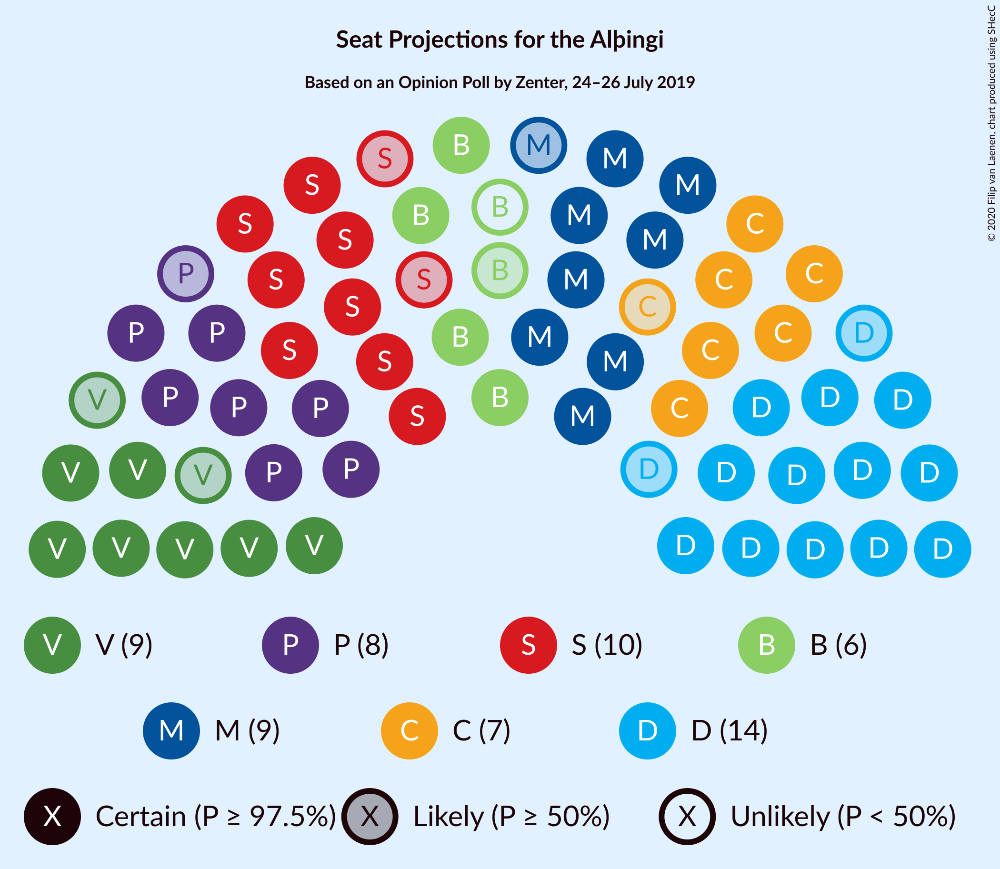
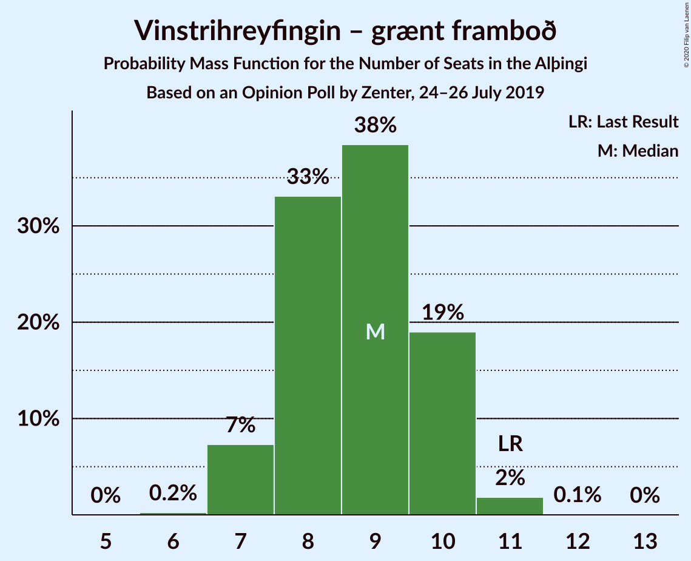
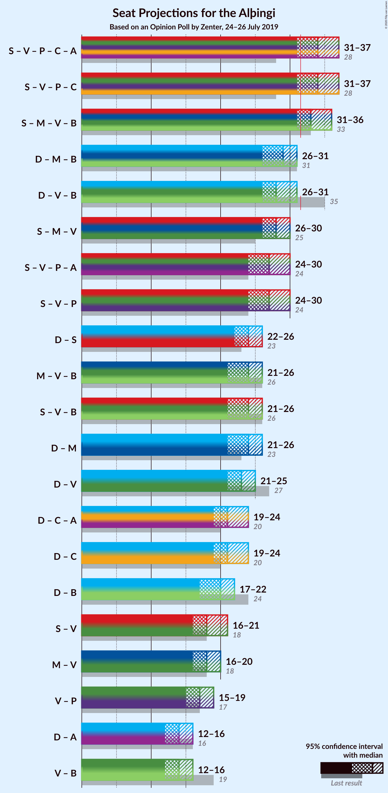

# Opinion Poll by Zenter, 24–26 July 2019

<a href="#voting-intentions">Voting Intentions</a> | <a href="#seats">Seats</a> | <a href="#coalitions">Coalitions</a> | <a href="#technical-information">Technical Information</a>

## Voting Intentions

### Confidence Intervals

| Party | Last Result | Poll Result | 80% Confidence Interval | 90% Confidence Interval | 95% Confidence Interval | 99% Confidence Interval |
|:-----:|:-----------:|:-----------:|:-----------------------:|:-----------------------:|:-----------------------:|:-----------------------:|
| Sjálfstæðisflokkurinn | 25.2% | 20.4% | 18.8–22.3% |18.3–22.8% |17.9–23.2% |17.2–24.1% |
| Samfylkingin | 12.1% | 14.3% | 12.9–15.9% |12.5–16.4% |12.2–16.8% |11.6–17.6% |
| Miðflokkurinn | 10.9% | 13.3% | 12.0–14.9% |11.6–15.3% |11.3–15.7% |10.7–16.5% |
| Vinstrihreyfingin – grænt framboð | 16.9% | 12.9% | 11.6–14.4% |11.2–14.9% |10.9–15.2% |10.2–16.0% |
| Píratar | 9.2% | 12.3% | 11.0–13.8% |10.7–14.3% |10.3–14.6% |9.8–15.4% |
| Viðreisn | 6.7% | 10.6% | 9.3–12.0% |9.0–12.4% |8.7–12.7% |8.2–13.4% |
| Framsóknarflokkurinn | 10.7% | 8.2% | 7.1–9.5% |6.9–9.9% |6.6–10.2% |6.1–10.9% |
| Flokkur fólksins | 6.9% | 3.2% | 2.6–4.1% |2.4–4.4% |2.3–4.6% |2.0–5.1% |
| Sósíalistaflokkur Íslands | 0.0% | 2.7% | 2.1–3.5% |1.9–3.7% |1.8–3.9% |1.6–4.4% |

*Note:* The poll result column reflects the actual value used in the calculations. Published results may vary slightly, and in addition be rounded to fewer digits.

## Seats

### Confidence Intervals

| Party | Last Result | Median | 80% Confidence Interval | 90% Confidence Interval | 95% Confidence Interval | 99% Confidence Interval |
|:-----:|:-----------:|:------:|:-----------------------:|:-----------------------:|:-----------------------:|:-----------------------:|
| <a href="#sjálfstæðisflokkurinn">Sjálfstæðisflokkurinn</a> | 16 | 14 | 12–15 |12–16 |12–16 |12–16 |
| <a href="#samfylkingin">Samfylkingin</a> | 7 | 10 | 9–11 |8–11 |8–12 |7–12 |
| <a href="#miðflokkurinn">Miðflokkurinn</a> | 7 | 9 | 9–10 |8–10 |7–11 |7–12 |
| <a href="#vinstrihreyfingin-–-grænt-framboð">Vinstrihreyfingin – grænt framboð</a> | 11 | 9 | 7–10 |7–10 |7–11 |7–11 |
| <a href="#píratar">Píratar</a> | 6 | 8 | 7–10 |7–10 |7–10 |6–11 |
| <a href="#viðreisn">Viðreisn</a> | 4 | 7 | 6–8 |6–9 |6–9 |6–9 |
| <a href="#framsóknarflokkurinn">Framsóknarflokkurinn</a> | 8 | 6 | 5–6 |4–6 |4–7 |4–7 |
| <a href="#flokkur-fólksins">Flokkur fólksins</a> | 4 | 0 | 0 |0 |0 |0 |
| <a href="#sósíalistaflokkur-íslands">Sósíalistaflokkur Íslands</a> | 0 | 0 | 0 |0 |0 |0 |

### Sjálfstæðisflokkurinn

*For a full overview of the results for this party, see the [Sjálfstæðisflokkurinn](party-sjálfstæðisflokkurinn.html) page.*

| Number of Seats | Probability | Accumulated | Special Marks |
|:---------------:|:-----------:|:-----------:|:-------------:|
| 11 | 0.4% | 100% |  |
| 12 | 14% | 99.6% |  |
| 13 | 14% | 86% |  |
| 14 | 33% | 72% | Median |
| 15 | 30% | 40% |  |
| 16 | 9% | 10% | Last Result |
| 17 | 0.4% | 0.4% |  |
| 18 | 0.1% | 0.1% |  |
| 19 | 0% | 0% |  |

### Samfylkingin

*For a full overview of the results for this party, see the [Samfylkingin](party-samfylkingin.html) page.*

| Number of Seats | Probability | Accumulated | Special Marks |
|:---------------:|:-----------:|:-----------:|:-------------:|
| 7 | 0.6% | 100% | Last Result |
| 8 | 9% | 99.4% |  |
| 9 | 32% | 91% |  |
| 10 | 44% | 58% | Median |
| 11 | 10% | 14% |  |
| 12 | 3% | 3% |  |
| 13 | 0.1% | 0.1% |  |
| 14 | 0% | 0% |  |

### Miðflokkurinn

*For a full overview of the results for this party, see the [Miðflokkurinn](party-miðflokkurinn.html) page.*

| Number of Seats | Probability | Accumulated | Special Marks |
|:---------------:|:-----------:|:-----------:|:-------------:|
| 7 | 3% | 100% | Last Result |
| 8 | 4% | 97% |  |
| 9 | 64% | 93% | Median |
| 10 | 25% | 28% |  |
| 11 | 2% | 3% |  |
| 12 | 0.8% | 1.1% |  |
| 13 | 0.3% | 0.3% |  |
| 14 | 0% | 0% |  |

### Vinstrihreyfingin – grænt framboð

*For a full overview of the results for this party, see the [Vinstrihreyfingin – grænt framboð](party-vinstrihreyfingin–græntframboð.html) page.*

| Number of Seats | Probability | Accumulated | Special Marks |
|:---------------:|:-----------:|:-----------:|:-------------:|
| 6 | 0.2% | 100% |  |
| 7 | 11% | 99.8% |  |
| 8 | 24% | 88% |  |
| 9 | 40% | 65% | Median |
| 10 | 22% | 25% |  |
| 11 | 2% | 3% | Last Result |
| 12 | 0.1% | 0.1% |  |
| 13 | 0% | 0% |  |

### Píratar

*For a full overview of the results for this party, see the [Píratar](party-píratar.html) page.*

| Number of Seats | Probability | Accumulated | Special Marks |
|:---------------:|:-----------:|:-----------:|:-------------:|
| 6 | 0.9% | 100% | Last Result |
| 7 | 14% | 99.1% |  |
| 8 | 36% | 85% | Median |
| 9 | 34% | 50% |  |
| 10 | 14% | 16% |  |
| 11 | 2% | 2% |  |
| 12 | 0% | 0% |  |

### Viðreisn

*For a full overview of the results for this party, see the [Viðreisn](party-viðreisn.html) page.*

| Number of Seats | Probability | Accumulated | Special Marks |
|:---------------:|:-----------:|:-----------:|:-------------:|
| 4 | 0% | 100% | Last Result |
| 5 | 0.5% | 100% |  |
| 6 | 27% | 99.5% |  |
| 7 | 30% | 73% | Median |
| 8 | 36% | 43% |  |
| 9 | 6% | 6% |  |
| 10 | 0% | 0% |  |

### Framsóknarflokkurinn

*For a full overview of the results for this party, see the [Framsóknarflokkurinn](party-framsóknarflokkurinn.html) page.*

| Number of Seats | Probability | Accumulated | Special Marks |
|:---------------:|:-----------:|:-----------:|:-------------:|
| 3 | 0.1% | 100% |  |
| 4 | 7% | 99.9% |  |
| 5 | 40% | 93% |  |
| 6 | 49% | 53% | Median |
| 7 | 3% | 4% |  |
| 8 | 0.2% | 0.2% | Last Result |
| 9 | 0% | 0% |  |

### Flokkur fólksins

*For a full overview of the results for this party, see the [Flokkur fólksins](party-flokkurfólksins.html) page.*

| Number of Seats | Probability | Accumulated | Special Marks |
|:---------------:|:-----------:|:-----------:|:-------------:|
| 0 | 99.7% | 100% | Median |
| 1 | 0% | 0.3% |  |
| 2 | 0% | 0.3% |  |
| 3 | 0.3% | 0.3% |  |
| 4 | 0% | 0% | Last Result |

### Sósíalistaflokkur Íslands

*For a full overview of the results for this party, see the [Sósíalistaflokkur Íslands](party-sósíalistaflokkuríslands.html) page.*

| Number of Seats | Probability | Accumulated | Special Marks |
|:---------------:|:-----------:|:-----------:|:-------------:|
| 0 | 100% | 100% | Last Result, Median |

## Coalitions

### Confidence Intervals

| Coalition | Last Result | Median | Majority? | 80% Confidence Interval | 90% Confidence Interval | 95% Confidence Interval | 99% Confidence Interval |
|:---------:|:-----------:|:------:|:---------:|:-----------------------:|:-----------------------:|:-----------------------:|:-----------------------:|
| Samfylkingin – Vinstrihreyfingin – grænt framboð – Píratar – Viðreisn | 28 | 34 | 98% | 33–36 | 32–36 | 32–36 | 31–37 |
| Samfylkingin – Miðflokkurinn – Vinstrihreyfingin – grænt framboð – Framsóknarflokkurinn | 33 | 34 | 87% | 31–34 | 31–35 | 31–36 | 30–36 |
| Sjálfstæðisflokkurinn – Miðflokkurinn – Framsóknarflokkurinn | 31 | 29 | 2% | 27–30 | 27–31 | 27–31 | 26–32 |
| Sjálfstæðisflokkurinn – Vinstrihreyfingin – grænt framboð – Framsóknarflokkurinn | 35 | 28 | 0.2% | 26–30 | 26–31 | 26–31 | 25–31 |
| Samfylkingin – Miðflokkurinn – Vinstrihreyfingin – grænt framboð | 25 | 28 | 0.3% | 26–29 | 26–30 | 26–31 | 25–31 |
| Samfylkingin – Vinstrihreyfingin – grænt framboð – Píratar | 24 | 27 | 0% | 25–28 | 25–29 | 25–29 | 24–30 |
| Samfylkingin – Vinstrihreyfingin – grænt framboð – Framsóknarflokkurinn | 26 | 24 | 0% | 22–25 | 22–26 | 22–27 | 21–27 |
| Sjálfstæðisflokkurinn – Samfylkingin | 23 | 24 | 0% | 22–25 | 22–26 | 22–26 | 21–27 |
| Miðflokkurinn – Vinstrihreyfingin – grænt framboð – Framsóknarflokkurinn | 26 | 24 | 0% | 22–25 | 21–25 | 21–26 | 21–27 |
| Sjálfstæðisflokkurinn – Miðflokkurinn | 23 | 23 | 0% | 21–25 | 21–25 | 21–26 | 21–26 |
| Sjálfstæðisflokkurinn – Vinstrihreyfingin – grænt framboð | 27 | 23 | 0% | 21–25 | 21–26 | 21–26 | 20–26 |
| Sjálfstæðisflokkurinn – Viðreisn | 20 | 21 | 0% | 20–23 | 20–24 | 19–24 | 18–24 |
| Sjálfstæðisflokkurinn – Framsóknarflokkurinn | 24 | 20 | 0% | 18–21 | 18–21 | 18–22 | 17–22 |
| Samfylkingin – Vinstrihreyfingin – grænt framboð | 18 | 19 | 0% | 17–20 | 17–21 | 16–21 | 15–22 |
| Miðflokkurinn – Vinstrihreyfingin – grænt framboð | 18 | 18 | 0% | 16–19 | 16–20 | 16–20 | 15–21 |
| Vinstrihreyfingin – grænt framboð – Píratar | 17 | 17 | 0% | 16–19 | 16–19 | 15–19 | 14–20 |
| Vinstrihreyfingin – grænt framboð – Framsóknarflokkurinn | 19 | 15 | 0% | 13–15 | 12–16 | 12–16 | 12–17 |

### Samfylkingin – Vinstrihreyfingin – grænt framboð – Píratar – Viðreisn

| Number of Seats | Probability | Accumulated | Special Marks |
|:---------------:|:-----------:|:-----------:|:-------------:|
| 28 | 0% | 100% | Last Result |
| 29 | 0% | 100% |  |
| 30 | 0.3% | 100% |  |
| 31 | 2% | 99.7% |  |
| 32 | 3% | 98% | Majority |
| 33 | 34% | 95% |  |
| 34 | 17% | 61% | Median |
| 35 | 23% | 44% |  |
| 36 | 19% | 20% |  |
| 37 | 1.0% | 1.3% |  |
| 38 | 0.3% | 0.3% |  |
| 39 | 0% | 0% |  |

### Samfylkingin – Miðflokkurinn – Vinstrihreyfingin – grænt framboð – Framsóknarflokkurinn

| Number of Seats | Probability | Accumulated | Special Marks |
|:---------------:|:-----------:|:-----------:|:-------------:|
| 29 | 0.1% | 100% |  |
| 30 | 0.8% | 99.9% |  |
| 31 | 13% | 99.1% |  |
| 32 | 18% | 87% | Majority |
| 33 | 18% | 68% | Last Result |
| 34 | 40% | 50% | Median |
| 35 | 7% | 10% |  |
| 36 | 3% | 3% |  |
| 37 | 0.4% | 0.5% |  |
| 38 | 0% | 0% |  |

### Sjálfstæðisflokkurinn – Miðflokkurinn – Framsóknarflokkurinn

| Number of Seats | Probability | Accumulated | Special Marks |
|:---------------:|:-----------:|:-----------:|:-------------:|
| 25 | 0.3% | 100% |  |
| 26 | 1.1% | 99.7% |  |
| 27 | 19% | 98.6% |  |
| 28 | 23% | 80% |  |
| 29 | 17% | 56% | Median |
| 30 | 34% | 39% |  |
| 31 | 3% | 5% | Last Result |
| 32 | 2% | 2% | Majority |
| 33 | 0.2% | 0.2% |  |
| 34 | 0% | 0% |  |

### Sjálfstæðisflokkurinn – Vinstrihreyfingin – grænt framboð – Framsóknarflokkurinn

| Number of Seats | Probability | Accumulated | Special Marks |
|:---------------:|:-----------:|:-----------:|:-------------:|
| 24 | 0.1% | 100% |  |
| 25 | 0.7% | 99.9% |  |
| 26 | 11% | 99.2% |  |
| 27 | 24% | 89% |  |
| 28 | 18% | 64% |  |
| 29 | 15% | 46% | Median |
| 30 | 24% | 31% |  |
| 31 | 7% | 7% |  |
| 32 | 0.2% | 0.2% | Majority |
| 33 | 0% | 0% |  |
| 34 | 0% | 0% |  |
| 35 | 0% | 0% | Last Result |

### Samfylkingin – Miðflokkurinn – Vinstrihreyfingin – grænt framboð

| Number of Seats | Probability | Accumulated | Special Marks |
|:---------------:|:-----------:|:-----------:|:-------------:|
| 24 | 0.1% | 100% |  |
| 25 | 2% | 99.9% | Last Result |
| 26 | 15% | 98% |  |
| 27 | 23% | 83% |  |
| 28 | 42% | 60% | Median |
| 29 | 10% | 18% |  |
| 30 | 5% | 8% |  |
| 31 | 2% | 3% |  |
| 32 | 0.3% | 0.3% | Majority |
| 33 | 0% | 0% |  |

### Samfylkingin – Vinstrihreyfingin – grænt framboð – Píratar

| Number of Seats | Probability | Accumulated | Special Marks |
|:---------------:|:-----------:|:-----------:|:-------------:|
| 23 | 0.3% | 100% |  |
| 24 | 2% | 99.6% | Last Result |
| 25 | 12% | 98% |  |
| 26 | 12% | 85% |  |
| 27 | 42% | 73% | Median |
| 28 | 22% | 31% |  |
| 29 | 7% | 9% |  |
| 30 | 2% | 2% |  |
| 31 | 0.1% | 0.1% |  |
| 32 | 0% | 0% | Majority |

### Samfylkingin – Vinstrihreyfingin – grænt framboð – Framsóknarflokkurinn

| Number of Seats | Probability | Accumulated | Special Marks |
|:---------------:|:-----------:|:-----------:|:-------------:|
| 20 | 0.2% | 100% |  |
| 21 | 2% | 99.8% |  |
| 22 | 18% | 98% |  |
| 23 | 20% | 80% |  |
| 24 | 13% | 60% |  |
| 25 | 39% | 46% | Median |
| 26 | 4% | 8% | Last Result |
| 27 | 3% | 4% |  |
| 28 | 0.1% | 0.1% |  |
| 29 | 0% | 0% |  |

### Sjálfstæðisflokkurinn – Samfylkingin

| Number of Seats | Probability | Accumulated | Special Marks |
|:---------------:|:-----------:|:-----------:|:-------------:|
| 20 | 0.3% | 100% |  |
| 21 | 1.4% | 99.7% |  |
| 22 | 28% | 98% |  |
| 23 | 10% | 70% | Last Result |
| 24 | 23% | 60% | Median |
| 25 | 30% | 37% |  |
| 26 | 6% | 7% |  |
| 27 | 0.9% | 0.9% |  |
| 28 | 0% | 0% |  |

### Miðflokkurinn – Vinstrihreyfingin – grænt framboð – Framsóknarflokkurinn

| Number of Seats | Probability | Accumulated | Special Marks |
|:---------------:|:-----------:|:-----------:|:-------------:|
| 20 | 0.4% | 100% |  |
| 21 | 8% | 99.5% |  |
| 22 | 12% | 92% |  |
| 23 | 16% | 80% |  |
| 24 | 52% | 64% | Median |
| 25 | 9% | 12% |  |
| 26 | 3% | 3% | Last Result |
| 27 | 0.6% | 0.7% |  |
| 28 | 0% | 0% |  |

### Sjálfstæðisflokkurinn – Miðflokkurinn

| Number of Seats | Probability | Accumulated | Special Marks |
|:---------------:|:-----------:|:-----------:|:-------------:|
| 20 | 0.3% | 100% |  |
| 21 | 15% | 99.7% |  |
| 22 | 5% | 85% |  |
| 23 | 31% | 79% | Last Result, Median |
| 24 | 32% | 48% |  |
| 25 | 12% | 16% |  |
| 26 | 3% | 3% |  |
| 27 | 0.2% | 0.2% |  |
| 28 | 0% | 0% |  |

### Sjálfstæðisflokkurinn – Vinstrihreyfingin – grænt framboð

| Number of Seats | Probability | Accumulated | Special Marks |
|:---------------:|:-----------:|:-----------:|:-------------:|
| 19 | 0.3% | 100% |  |
| 20 | 1.1% | 99.7% |  |
| 21 | 30% | 98.6% |  |
| 22 | 9% | 69% |  |
| 23 | 15% | 60% | Median |
| 24 | 34% | 45% |  |
| 25 | 5% | 11% |  |
| 26 | 5% | 5% |  |
| 27 | 0% | 0% | Last Result |

### Sjálfstæðisflokkurinn – Viðreisn

| Number of Seats | Probability | Accumulated | Special Marks |
|:---------------:|:-----------:|:-----------:|:-------------:|
| 17 | 0.1% | 100% |  |
| 18 | 0.4% | 99.9% |  |
| 19 | 2% | 99.5% |  |
| 20 | 26% | 97% | Last Result |
| 21 | 28% | 71% | Median |
| 22 | 30% | 43% |  |
| 23 | 8% | 13% |  |
| 24 | 5% | 5% |  |
| 25 | 0.1% | 0.1% |  |
| 26 | 0% | 0% |  |

### Sjálfstæðisflokkurinn – Framsóknarflokkurinn

| Number of Seats | Probability | Accumulated | Special Marks |
|:---------------:|:-----------:|:-----------:|:-------------:|
| 16 | 0.2% | 100% |  |
| 17 | 2% | 99.8% |  |
| 18 | 20% | 98% |  |
| 19 | 27% | 78% |  |
| 20 | 23% | 51% | Median |
| 21 | 25% | 28% |  |
| 22 | 3% | 3% |  |
| 23 | 0.3% | 0.3% |  |
| 24 | 0% | 0% | Last Result |

### Samfylkingin – Vinstrihreyfingin – grænt framboð

| Number of Seats | Probability | Accumulated | Special Marks |
|:---------------:|:-----------:|:-----------:|:-------------:|
| 15 | 0.6% | 100% |  |
| 16 | 3% | 99.4% |  |
| 17 | 26% | 97% |  |
| 18 | 16% | 70% | Last Result |
| 19 | 38% | 54% | Median |
| 20 | 10% | 16% |  |
| 21 | 4% | 7% |  |
| 22 | 2% | 2% |  |
| 23 | 0% | 0% |  |

### Miðflokkurinn – Vinstrihreyfingin – grænt framboð

| Number of Seats | Probability | Accumulated | Special Marks |
|:---------------:|:-----------:|:-----------:|:-------------:|
| 15 | 0.5% | 100% |  |
| 16 | 10% | 99.4% |  |
| 17 | 11% | 89% |  |
| 18 | 50% | 78% | Last Result, Median |
| 19 | 22% | 28% |  |
| 20 | 5% | 7% |  |
| 21 | 1.0% | 1.3% |  |
| 22 | 0.3% | 0.3% |  |
| 23 | 0% | 0% |  |

### Vinstrihreyfingin – grænt framboð – Píratar

| Number of Seats | Probability | Accumulated | Special Marks |
|:---------------:|:-----------:|:-----------:|:-------------:|
| 14 | 0.8% | 100% |  |
| 15 | 3% | 99.2% |  |
| 16 | 16% | 96% |  |
| 17 | 39% | 81% | Last Result, Median |
| 18 | 28% | 42% |  |
| 19 | 13% | 13% |  |
| 20 | 0.6% | 0.7% |  |
| 21 | 0.1% | 0.1% |  |
| 22 | 0% | 0% |  |

### Vinstrihreyfingin – grænt framboð – Framsóknarflokkurinn

| Number of Seats | Probability | Accumulated | Special Marks |
|:---------------:|:-----------:|:-----------:|:-------------:|
| 11 | 0.4% | 100% |  |
| 12 | 8% | 99.6% |  |
| 13 | 19% | 92% |  |
| 14 | 16% | 73% |  |
| 15 | 48% | 57% | Median |
| 16 | 8% | 8% |  |
| 17 | 0.6% | 0.7% |  |
| 18 | 0.1% | 0.1% |  |
| 19 | 0% | 0% | Last Result |

## Technical Information

### Opinion Poll

+ **Polling firm:** Zenter
+ **Commissioner(s):** —
+ **Fieldwork period:** 24–26 July 2019

### Calculations

+ **Sample size:** 900
+ **Simulations done:** 131,072
+ **Error estimate:** 2.94%

